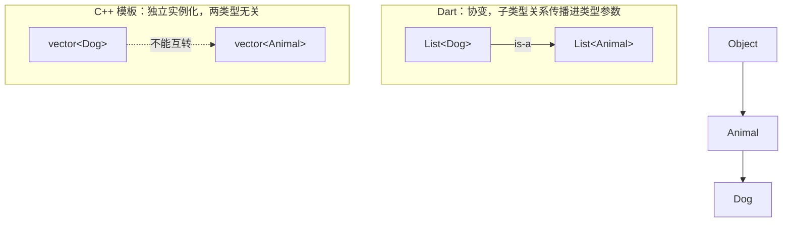

# 01 泛型与类型系统

> C 程序员第一次接触泛型，往往觉得"这不就是宏吗"或"这不就是 `void*` 加类型转换吗"，两种直觉都只对了一半。Dart 的泛型既不像 C 宏那样在预处理期做文本替换，也不像 `void*` 那样把类型信息丢给程序员：它是**编译期检查 + 运行时保留**的类型系统设施。类型参数在编译期约束代码，在运行时依然真实存在（reified），并且 `List<Dog>` 天然是 `List<Animal>` 的子类型（协变）。本章从 C 的痛点出发，讲清语法、边界、协变、运行时类型信息，以及它们如何与空安全共同构成 Dart 的健全类型系统。
>
> 前置知识：[[dart/1入门/07_面向对象|07 面向对象]]、[[dart/1入门/08_空安全|08 空安全]]。对照阅读：[[java/2深入/01_泛型深入|Java 泛型深入]]、[[rust/2深入/04-类型系统的力量|类型系统的力量]]。

---
## 一、为什么需要泛型：从 C 的两种"土办法"说起

C 没有泛型，"容器装不同类型"的需求通常用两条路绕过去。

**第一条路：`void*` 万能指针**，标准库的 `qsort` 是典型代表：

```c
void qsort(void *base, size_t nmemb, size_t size,
           int (*compar)(const void *, const void *));

int cmp_int(const void *a, const void *b) {
    int x = *(const int *)a;   // 强转，编译器不检查
    int y = *(const int *)b;
    return x - y;
}
```

类型信息全部丢失：传错类型编译器不管、取出元素必须强转、调试器看不出容器内容。

**第二条路：宏**，预处理期做文本替换，为每种类型生成一份代码：

```c
#define DEFINE_STACK(T)                              \
    typedef struct { T *data; int len; } Stack_##T;  \
    void stack_##T##_push(Stack_##T *s, T v);
DEFINE_STACK(int)
DEFINE_STACK(double)
```

宏零运行时开销，但没有类型检查、无法调试、每种类型膨胀一份代码、与 IDE 补全绝缘。

| 维度 | C `void*` | C 宏 | Dart 泛型 |
|------|-----------|------|-----------|
| 类型检查时机 | 无（运行期出错） | 无（预处理期替换） | 编译期 |
| 取出元素是否强转 | 必须 | 不需要 | 不需要 |
| 运行时是否知道元素类型 | 不知道 | 不知道 | 知道（reified） |
| 代码体积 | 一份 | 每种类型一份 | 一份（AOT 共享机器码） |
| 错误信息 | 一般 | 差 | 好，直接指出类型不匹配 |

一句话：**泛型是"有类型、有作用域、可调试"的宏，也是"不丢类型信息"的 `void*`。**

---

## 二、泛型类与泛型函数

### 2.1 泛型类

把类型本身当作参数传给类，用尖括号声明：

```dart
class Stack<T> {
  final List<T> _items = [];
  void push(T value) => _items.add(value);
  T pop() => _items.removeLast();
  T get peek => _items.last;
}

void main() {
  final stack = Stack<int>();     // T 绑定为 int
  stack.push(1);
  stack.push(2);
  print(stack.pop());             // 2
  // stack.push('hello');         // 编译错误：String 不能赋给 int
  // final String s = stack.pop(); // 编译错误：int 不能赋给 String
}
```

`Stack<int>` 与 `Stack<String>` 共享同一份类定义，但在 Dart 中是**两个不同的类型**：`Stack<int>() is Stack<String>` 为 `false`。

### 2.2 泛型函数

类型参数也可以挂在函数上，独立于任何类；多数情况下类型实参可省略，由参数推断：

```dart
T firstOr<T>(List<T> list, T fallback) =>
    list.isEmpty ? fallback : list.first;

void main() {
  print(firstOr([1, 2, 3], 0));      // 1
  print(firstOr(<String>[], '空'));  // 空
}
```

多重类型参数与嵌套很常见：`Pair<K, V>` 的 `swap()` 返回 `Pair<V, K>`，`Map<String, List<int>>` 则是"键为字符串、值为整数列表"的映射，读法由外向内。注意构造器本身**不能**再声明类型参数（Dart 不支持泛型构造器），类型参数只能来自类；需要独立推断时改用泛型静态方法或顶层函数。

### 2.3 类型参数命名约定

| 名字 | 含义 | 典型场景 |
|------|------|----------|
| `T` | 通用类型（Type） | `List<T>`、`Stack<T>` |
| `E` | 集合元素（Element） | `Iterable<E>`、`Set<E>` |
| `K` / `V` | 键 / 值（Key / Value） | `Map<K, V>` |
| `R` | 返回值（Return） | `Future<R>`、`R Function(T)` |
| `S` / `U` | 第二、第三个通用类型 | `map<S>(S Function(K, V) f)` |

---

## 三、泛型边界：`extends` 约束类型参数

裸的 `T` 只能当作 `Object?` 使用，无法调用任何成员；要使用成员必须声明边界：

```dart
// 错误示范：没有边界，编译器拒绝访问 > 运算符
// T maxOf<T>(T a, T b) => a > b ? a : b;

T maxOf<T extends Comparable<T>>(T a, T b) =>
    a.compareTo(b) >= 0 ? a : b;

abstract class Entity {
  String get id;
}

class Repository<T extends Entity> {   // 只有 Entity 的子类型能实例化
  final List<T> _items = [];
  void add(T item) => _items.add(item);
  T findById(String id) => _items.firstWhere((item) => item.id == id);
}

void main() {
  print(maxOf(3, 7));               // 7
  print(maxOf('apple', 'banana'));  // banana
  // Repository<int>();  // 编译错误：int 不是 Entity 的子类型
}
```

边界规则要点：

- Dart **只支持单一边界**，不能写 `T extends A & B`；需要多重约束时，先定义一个同时实现这些接口的抽象类
- `T extends num` 后可参与算术运算；`T extends Comparable<T>` 后可比较
- 边界决定可空性：不写边界默认 `Object?`，此时 `T?` 与 `T` 等价，编译器会警告冗余；写成 `T extends Object` 后 `T?` 才有意义

---

## 四、协变：`List<Dog>` 是 `List<Animal>` 的子类型

这是 Dart 泛型与 C++ 模板**最本质的差异**：



```dart
class Animal {
  final String name;
  Animal(this.name);
}

class Dog extends Animal {
  Dog(super.name);
}

void main() {
  List<Dog> dogs = [Dog('旺财')];
  List<Animal> animals = dogs;   // 协变：编译通过
  print(animals.first.name);     // 旺财（读取安全）

  try {
    animals.add(Animal('野猫')); // 运行时抛 TypeError
  } on TypeError catch (e) {
    print('被拦截: $e');
  }
}
```

原因在于 Dart 的类型检查**运行时保留**：`List<Dog>` 在运行时确实就是 `List<Dog>`，把 `List<Animal>` 变量指向它后，写入非 Dog 元素会破坏底层列表的类型不变式，因此写入时必须做运行时检查。这与 Java 数组类似（`Object[] arr = new String[1]; arr[0] = 42;` 抛 `ArrayStoreException`），Dart 把它推广到了所有泛型容器。

| 语言 | 变型规则 | `List<Dog>` 与 `List<Animal>` | 写入保护 |
|------|----------|-------------------------------|----------|
| Dart | 协变 | 子类型关系成立 | 运行时检查，抛 `TypeError` |
| Java | 协变（通配符可收窄） | 同上 | 运行时检查 + `? extends` 约束 |
| C++ | 不变（独立实例化） | 两个无关类型 | 编译期禁止，无运行时成本 |
| C | 无泛型 | 只有 `void*` | 无保护 |
| Kotlin | 声明处变型（`out`/`in`） | 只读接口协变 | 编译期由 `out` 保证 |

**实践结论**：只读参数尽量用 `Iterable<T>` 而不是 `List<T>`，因为 `Iterable` 不提供写入操作，协变使用没有运行时风险。例如 `int total(Iterable<Animal> animals)` 可以安全接收 `List<Dog>`，而 `void add(List<Animal> target)` 收到 `List<Dog>` 后一旦写入就会在运行时爆炸。

---

## 五、运行时类型信息：reified generics

Dart 的泛型在运行时**不擦除**（reified generics）：类型参数可参与 `is` 检查、可取 `runtimeType`、可作类型字面量：

```dart
Type typeOf<T>() => T;   // 类型变量可以当类型字面量

void main() {
  final Object list = <int>[1, 2, 3];

  print(list.runtimeType);      // List<int>
  print(list is List<int>);     // true
  print(list is List<String>);  // false
  print(list is List<num>);     // true（协变）
  print(<int, String>{}.runtimeType); // _Map<int, String>
  print(typeOf<List<String>>()); // List<String>
}
```

对比 Java 的类型擦除——泛型信息在编译后消失，运行时只剩原始类型：`List<String>` 与 `List<Integer>` 的 `getClass()` 完全相同，而且 Java 不允许对参数化类型做 `instanceof` 检查。

| 维度 | Dart（reified） | Java（擦除） | C++（模板） |
|------|-----------------|--------------|-------------|
| 运行时知道类型实参 | 知道 | 不知道 | 类型实参仅编译期存在 |
| `list is List<int>` | 支持 | 不支持 | 无 `is`，靠编译期 |
| `T` 作类型字面量 | 能（`Type t = T;`） | 不能 | 能（`typeid(T)`，需 RTTI） |
| 能否 `new T()` | 不能 | 不能 | 能（模板实例化） |
| 运行时反射 | 无（AOT 限制） | 完整反射 | 有限 RTTI |
| 类型检查成本 | 有运行时成本 | 无 | 无 |

Dart 选择 reified 的直接原因是**健全性**：协变要求运行时有能力验证写入，而擦除无法验证。代价是深层嵌套类型检查会变慢，例如热循环里反复执行 `value is Map<String, List<Map<String, int>>>`。缓解手段：把检查结果缓存到变量、用模式匹配一次性解构、避免在热路径上做复杂类型判断。

---

## 六、`dynamic`、`Object` 与泛型 `T` 的区别

这三个是初学者最容易混的：它们分别代表"完全动态"、"最宽的静态类型"与"由调用方指定的静态类型"：

```dart
T identity<T>(T value) => value;

void main() {
  dynamic d = 'hello';
  print(d.length);         // 运行时才解析成员，成功
  d = 42;
  print(d.isEven);         // 同一变量换了类型，仍能调用
  // d.notExist();         // 编译通过！运行时 NoSuchMethodError

  Object o = 'hello';
  // print(o.length);      // 编译错误：Object 上没有 length
  print(o.toString());     // 只能调用 Object 声明过的方法

  print(identity<String>('abc').length); // T 在调用点绑定为 String
}
```

| 维度 | `dynamic` | `Object?` | `T`（泛型） |
|------|-----------|-----------|-------------|
| 类型检查 | 关闭，运行时动态解析 | 编译期，只能调用 Object 成员 | 编译期，由边界决定可用成员 |
| 可空性 | 可空 | 可空；`Object` 不可空 | 由边界决定，默认 `Object?` |
| 能否调用任意成员 | 能，运行时可能失败 | 不能 | 只能在边界范围内调用 |
| 静态分析 | 基本失效 | 有效 | 有效 |
| 性能 | 动态分派开销，AOT 难优化 | 正常 | 正常 |
| 典型用途 | JSON 解析、脚本式代码 | 需要"任意非空值"的容器 | 容器与算法复用 |

选择顺序：**能用泛型就用泛型，需要装任意值用 `Object?`，只有数据形状确实动态（如 JSON）时才用 `dynamic`，并尽快转回静态类型**：

```dart
import 'dart:convert';

void main() {
  final raw = jsonDecode('{"name": "小明", "age": 18}') as Map<String, dynamic>;
  final String name = raw['name'] as String;  // 转回静态世界
  final int age = raw['age'] as int;
  print('$name 今年 $age 岁');
}
```

---
## 七、typedef：类型别名

`typedef` 给类型起别名，不创建新类型，纯粹提升可读性：

```dart
typedef IntList = List<int>;
typedef Comparator<T> = int Function(T a, T b);
typedef Handler = void Function(String event);
typedef JsonValue = Object?;              // Dart 3 起支持递归别名
typedef JsonMap = Map<String, JsonValue>;

void main() {
  IntList nums = [3, 1, 2];
  Comparator<int> byValue = (a, b) => a.compareTo(b);
  nums.sort(byValue);
  print(nums);   // [1, 2, 3]

  Handler logger = (event) => print('事件: $event');
  logger('启动');
}
```

| 对比项 | C 的 `typedef` | Dart 的 `typedef` |
|--------|----------------|-------------------|
| 函数指针别名 | `typedef int (*Cmp)(int, int);` | `typedef Cmp = int Function(int, int);` |
| 结构体别名 | 常与 `struct` 连用 | 类名本身即类型，别名仅作简写 |
| 泛型别名 | 不支持 | 支持 `typedef Comparator<T> = ...` |
| 递归别名 | 支持（结构体指针） | Dart 3+ 支持 |
| 是否创建新类型 | 否 | 否 |

---

## 八、健全性与空安全：为什么协变是安全的

**健全（sound）**意味着：静态检查通过的程序，运行时不会因类型问题崩溃（保证范围是类型错误与空值错误，不含越界、除零等）。Dart 靠两条机制实现健全：可空性写进类型系统（`String` 不可空、`String?` 可空，解引用可空值必须显式检查或用 `!`）；泛型在运行时保留并校验（协变写入失败抛 `TypeError`）。

```dart
void main() {
  String? maybe =
      DateTime.now().millisecondsSinceEpoch.isEven ? '有值' : null;
  print(maybe?.length);     // 空感知访问，安全
  if (maybe != null) {
    print(maybe.length);    // 类型提升后可直接用
  }

  final objects = <int>[] as List<Object>;
  try {
    objects.add('字符串');
  } on TypeError catch (e) {
    print('类型系统守住底线: $e');
  }
}
```

`dynamic` 会**暂时绕过**健全性：`dynamic d = 1; d.foo();` 编译通过、运行时报 `NoSuchMethodError`。这不是类型系统失效，而是 `dynamic` 明确表示"此处检查推迟到运行时"。

---

## 九、模式匹配中的类型

Dart 3 的模式匹配把"类型判断 + 提取"合并成一个动作，处理多态数据最顺手：

```dart
sealed class Shape {}

class Circle extends Shape {   // 紧凑写法，仅为示例
  final double radius;
  Circle(this.radius);
}

class Square extends Shape {
  final double side;
  Square(this.side);
}

// 类型模式：先判断类型，再绑定变量
double area(Shape shape) => switch (shape) {
      Circle(radius: final r) => 3.14159 * r * r,
      Square(side: final s) => s * s,
    };

void main() {
  print(area(Circle(1)).toStringAsFixed(2));  // 3.14

  Object value = 42;
  final label = switch (value) {   // 类型模式 + 卫语句
    int n when n.isEven => '偶数 $n',
    int n => '奇数 $n',
    String s => '字符串 "$s"',
    _ => '其他',
  };
  print(label); // 偶数 42
}
```

`sealed` 让编译器知道所有子类型，`switch` 因此能做穷尽性检查——漏掉一种 `Shape` 会直接编译报错。

---

## 十、常见坑

**坑 1：协变写入在运行时才爆炸。** `void addAll(List<Animal> target) { target.add(Animal('外来户')); }` 编译通过，但把 `List<Dog>` 传进去会抛 `TypeError`。规避：只读参数用 `Iterable<T>`，需要写入就要求精确的 `List<T>`。

**坑 2：把类型检查放进热循环。** `for (final item in data) { if (item is List<int>) ... }` 每次迭代都做深层泛型检查，成本不低。规避：从数据结构设计上避免混合类型，或一次性把检查结果缓存到变量。

**坑 3：忘记 `T?` 的可空语义。** 不写边界时 `T` 默认 `Object?`，`T?` 与 `T` 等价；写了 `T extends Object` 后 `T?` 才有意义。

**坑 4：用 `dynamic` 换一时省事。** `dynamic` 会传播：`dynamic` 表达式参与运算的结果仍是 `dynamic`，静态分析全线失效。团队代码建议开启 `avoid_dynamic_calls` lint。

**坑 5：误以为泛型能 `new T()`。** `T()` 编译错误，正确做法是把构造器当函数传进来：

```dart
class Factory<T> {
  final T Function() _builder;
  Factory(this._builder);
  T create() => _builder();
}

void main() {
  print(Factory<String>(() => '新对象').create()); // 新对象
}
```
---

## 本章小结

| 知识点 | 一句话 |
|--------|--------|
| 泛型动机 | 同时解决 `void*` 的"无类型检查"和宏的"不可调试" |
| 泛型类/函数 | `<T>` 声明类型参数，使用点可推断 |
| 命名约定 | T/E/K/V/R/S，团队一致优先 |
| 边界 | 单一 `extends` 约束，决定可用成员与可空性 |
| 协变 | `List<Dog>` 是 `List<Animal>` 子类型，写入有运行时检查 |
| reified | 运行时保留类型实参，支持 `is`/`runtimeType`/类型字面量 |
| dynamic vs Object vs T | 动态解析 / 最宽静态类型 / 调用点绑定 |
| typedef | 别名不建新类型，支持泛型与递归 |
| 健全性 | 空安全 + 泛型运行时校验共同保证 |
| 模式匹配 | 类型判断与解构合一，配合 sealed 做穷尽检查 |

---

## 练习

| 题号 | 题目 | 链接 | 知识点 |
|------|------|------|--------|
| 706 | 设计哈希映射 | https://leetcode.cn/problems/design-hashmap/ | 泛型、数据结构设计 |

- 返回目录：[[dart/dart目录|Dart 教程目录]]
