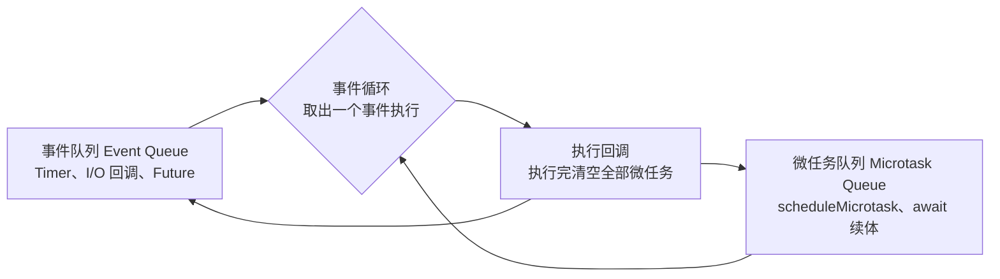
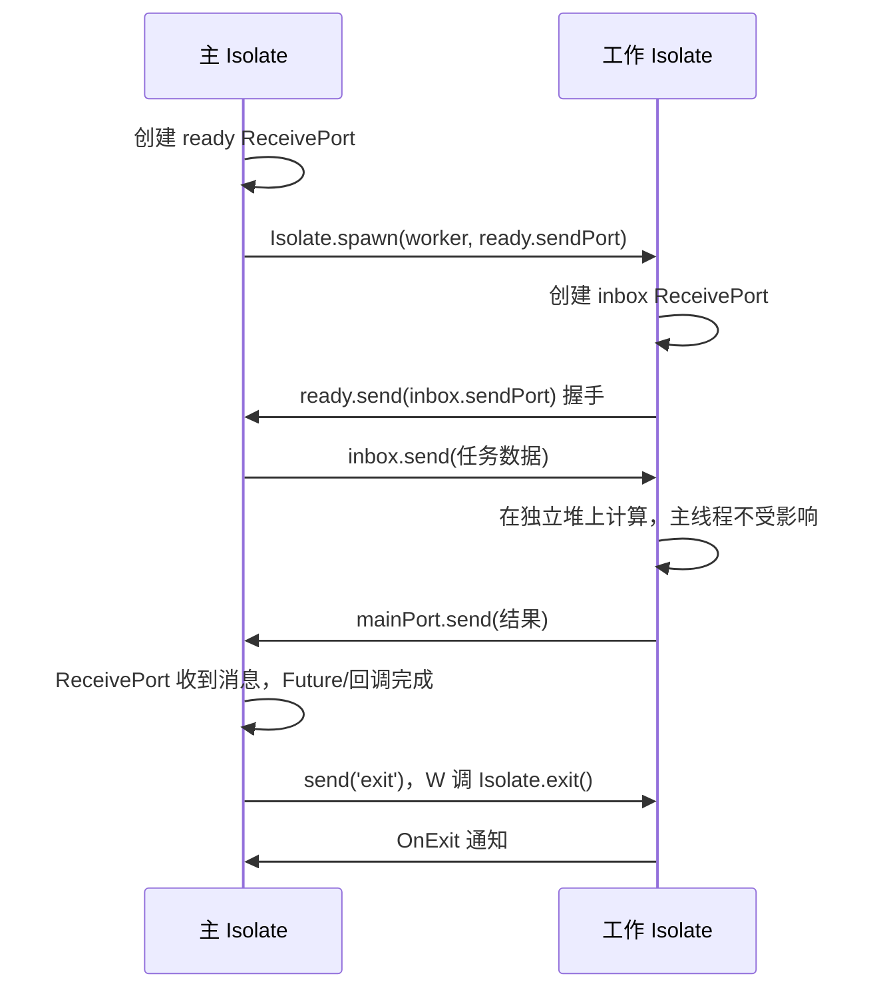

# 02 Isolate 与并发

> 从 C 转来的程序员对"多线程"有肌肉记忆：`pthread_create`、互斥锁、条件变量、共享内存，还有深夜排查数据竞争的痛苦。Dart 给了一个截然不同的答案：**没有共享内存的线程**。它的并发单元叫 Isolate（隔离区），每个 Isolate 拥有独立的堆与事件循环，彼此只能通过消息通信。这不是能力缩水，而是设计取舍：用"拷贝或转移数据"的成本，换掉锁、竞态、死锁这一整类问题。本章讲清事件循环、Isolate 的创建与通信、消息的可发送边界，以及 CPU 密集任务该如何落地。
>
> 前置知识：[[dart/1入门/09_异步编程|09 异步编程]]（Future 与事件循环）。对照阅读：[[java/2深入/04_多线程基础|Java 多线程]]、[[rust/2深入/07-并发的硬件基础|并发的硬件基础]]。

---

## 一、单线程事件循环回顾

一个 Isolate 的运行模型可以浓缩成一句话：**一个堆 + 一个事件循环 + 一个执行线程**。Dart 代码永远在某个 Isolate 的线程上执行，同一时刻只有一段代码在跑，因此单个 Isolate 内部不存在数据竞争。



事件循环的调度规则：**每处理完一个事件，就清空整个微任务队列，再取下一个事件**。微任务优先级高于事件，且微任务中再产生微任务会在本轮全部执行完。这解释了一个经典输出顺序：

```dart
import 'dart:async';

void main() {
  print('1 main 同步开始');
  scheduleMicrotask(() => print('3 微任务'));
  Future(() => print('5 事件任务'));
  Future.microtask(() => print('4 微任务'));
  print('2 main 同步结束');
}
// 输出：1 2 3 4 5
// 同步代码最先；随后清空微任务 3、4；最后才轮到事件队列里的 5
```

| 概念 | 含义 | 类比 |
|------|------|------|
| 并发（concurrency） | 多个任务在时间上交错推进，同一时刻未必真并行 | 单核上的协作式调度 |
| 并行（parallelism） | 多个任务在同一时刻真正同时执行 | 多核上的 `pthread` 各跑一个核 |
| 事件循环 | 单线程内交替处理微任务与事件 | C 里手写的 `epoll` 主循环 |
| Isolate | Dart 的并行单元，独立堆 + 独立事件循环 | 一个"进程"式的线程 |

关键结论：**异步不等于并行**。`Future`/`Stream` 让 I/O 等待期间不阻塞线程，但 CPU 密集计算依然会把唯一的事件循环卡死——这正是 Isolate 存在的理由。

---

## 二、为什么 Dart 放弃共享内存

C 的线程模型是"共享地址空间 + 锁"：任意线程可读写任意全局变量，正确性依赖程序员自觉加锁，编译器无法替你检查。Dart 选择了另一条路：

| 维度 | C `pthread` | Dart `Isolate` |
|------|-------------|----------------|
| 内存模型 | 共享堆与全局变量 | 每个 Isolate 独立堆 |
| 通信方式 | 直接读写共享内存 | 消息传递（SendPort/ReceivePort） |
| 同步原语 | mutex、条件变量、信号量 | 不需要（无共享即无竞争） |
| 数据竞争 | 可能发生，属未定义行为 | 语言层面不可能 |
| 死锁 | 常见（锁顺序不当） | 无锁可死，只有消息协议死锁 |
| 大数据传递 | 传指针，零成本 | 拷贝或转移，有成本 |
| 隔离性 | 一个线程崩溃拖垮进程 | 异常可通过错误监听捕获，堆状态互不破坏 |

代价很明确：跨 Isolate 传递对象默认是**深拷贝**（或用 `TransferableTypedData` 转移所有权）。Dart 的取舍是"用可量化的拷贝成本，消灭不可调试的并发缺陷"。

---

## 三、创建 Isolate：`Isolate.spawn` 与 `Isolate.run`

### 3.1 `Isolate.run`：一次性任务的语法糖

Dart 2.19 引入的 `Isolate.run` 是最常用的入口：启动一个 Isolate、执行函数、返回结果、自动销毁：

```dart
import 'dart:isolate';

int heavyCompute(int n) {
  var sum = 0;
  for (var i = 0; i < n; i++) {
    sum += i;   // 纯计算，不碰任何共享状态
  }
  return sum;
}

Future<void> main() async {
  final watch = Stopwatch()..start();
  // 闭包会被发送到新 Isolate，捕获的变量必须是可发送的
  final result = await Isolate.run(() => heavyCompute(2000000000));
  print('结果: $result，耗时: ${watch.elapsedMilliseconds}ms');
  print('主 Isolate 在等待期间依然能响应其他事件');
}
```

`Isolate.run` 内部会把闭包发送给新 Isolate，任务完成后用 `Isolate.exit` 把结果**转移**回主 Isolate（避免拷贝），随后销毁工作 Isolate。

### 3.2 `Isolate.spawn`：长驻工作单元

需要反复提交任务时用 `Isolate.spawn`，它返回 `Future<Isolate>`，并允许工作 Isolate 长期存活：

```dart
import 'dart:isolate';

// 入口函数必须是顶层函数或静态方法，签名固定为 void Function(T)
void worker(SendPort mainPort) {
  final inbox = ReceivePort();
  mainPort.send(inbox.sendPort);   // 先把自己的收信口告诉主 Isolate

  inbox.listen((message) {
    if (message == 'exit') {
      inbox.close();
      Isolate.exit();
    }
    mainPort.send('收到: $message');
  });
}

Future<void> main() async {
  final ready = ReceivePort();
  final isolate = await Isolate.spawn(worker, ready.sendPort);

  final workerPort = await ready.first as SendPort; // 等 worker 就绪
  ready.close();

  final replies = ReceivePort();
  isolate.addOnExitListener(replies.sendPort);      // 监听退出事件

  workerPort.send('任务 A');
  workerPort.send('任务 B');
  await Future<void>.delayed(const Duration(milliseconds: 100));
  workerPort.send('exit');
  await replies.first;                              // 等到退出通知
  replies.close();
  print('工作 Isolate 已结束');
}
```

要点：入口函数不能是带捕获状态的实例方法闭包；`Isolate.spawn` 返回后 Isolate 并非立刻可通信，需先用一个端口交换 `SendPort`（俗称握手）。

---

## 四、端口通信：SendPort 与 ReceivePort

`ReceivePort` 是收信箱，`SendPort` 是可投递的寄信地址。每个 `ReceivePort` 自动拥有一个对应的 `SendPort`；`SendPort` 本身可以发给别人，这是建立双向通信的基础。



通信语义有三条硬规则：

1. **消息按发送顺序到达**：同一对 `SendPort` 之间，先发先到，不会乱序
2. **默认深拷贝**：发送对象时复制一份，两边的修改互不影响；发送后修改原对象，接收方看到的仍是旧值
3. **端口需显式关闭**：`ReceivePort.close()` 释放资源，长驻 Isolate 不关闭端口会持续占用内存

---

## 五、哪些对象能发送：可发送性边界

不是所有对象都能跨 Isolate。可发送的类型包括：`null`、`bool`、`int`、`double`、`String`、`List`/`Map`/`Set`（元素递归可发送）、`Record`、`TypedData`、`SendPort`、`TransferableTypedData`、`Capability` 等；**不可发送**的有：任意用户类实例（除非特殊处理）、闭包捕获了不可发送对象、`ReceivePort`、`Socket`、`File`、`Future`、`Completer`、原生资源。

```dart
import 'dart:isolate';
import 'dart:typed_data';

void worker(SendPort port) {
  // TransferableTypedData 转移所有权：零拷贝
  final data = TransferableTypedData.fromList([
    Uint8List.fromList([1, 2, 3, 4]),
  ]);
  port.send(data);
}

Future<void> main() async {
  final rp = ReceivePort();
  await Isolate.spawn(worker, rp.sendPort);
  await for (final message in rp) {
    if (message is TransferableTypedData) {
      final bytes = message.materialize().asUint8List();
      print('收到字节: $bytes');   // [1, 2, 3, 4]
      // materialize 只能调用一次，之后数据归接收方所有
      rp.close();
    }
  }
}
```

发送普通对象要深拷贝，大数组场景应改用 `TransferableTypedData` 转移所有权（发送方失去访问权，接收方零拷贝获得）。另一个优化是 `Isolate.exit(port, result)`：工作 Isolate 结束并把最终结果作为唯一消息发出，运行时可以避免这次拷贝。

| 数据类型 | 能否发送 | 语义 |
|----------|----------|------|
| 数值、字符串、布尔、null | 能 | 值拷贝（不可变，等价于共享） |
| List/Map/Set/Record | 能（元素须可发送） | 深拷贝 |
| 自定义类实例 | 不能 | 需序列化为 Map/JSON 或转成 Record |
| TransferableTypedData | 能 | 所有权转移，零拷贝 |
| SendPort / Capability | 能 | 通信句柄 |
| ReceivePort / Socket / File | 不能 | 绑定特定 Isolate 的资源 |

---

## 六、`compute` 与 Isolate 池

### 6.1 Flutter 的 `compute`

Flutter 在 `foundation` 中提供 `compute`，是 `Isolate.run` 的易用封装（Web 平台上退化为当前线程执行）：

```dart
import 'package:flutter/foundation.dart';

// 顶层函数，入参和返回值都必须可发送
int countPrimes(int limit) {
  var count = 0;
  for (var n = 2; n <= limit; n++) {
    var isPrime = true;
    for (var d = 2; d * d <= n; d++) {
      if (n % d == 0) {
        isPrime = false;
        break;
      }
    }
    if (isPrime) count++;
  }
  return count;
}

Future<void> main() async {
  // UI 线程不卡顿：计算发生在工作 Isolate
  final result = await compute(countPrimes, 100000);
  debugPrint('素数个数: $result');
}
```

### 6.2 池化：摊薄启动成本

每次 `Isolate.spawn` 都要创建新堆、初始化运行时，开销在毫秒级。高频小任务应使用固定数量的常驻 Isolate 组成池，用轮询或队列分发：

```dart
import 'dart:async';
import 'dart:isolate';

void _worker(SendPort ready) {
  final inbox = ReceivePort();
  ready.send(inbox.sendPort);
  inbox.listen((message) {
    final (int task, SendPort reply) = message as (int, SendPort);
    reply.send(task * task);   // 模拟 CPU 密集计算
  });
}

class WorkerPool {
  final List<SendPort> _workers = [];
  int _next = 0;

  static Future<WorkerPool> start(int size) async {
    final pool = WorkerPool();
    for (var i = 0; i < size; i++) {
      final ready = ReceivePort();
      await Isolate.spawn(_worker, ready.sendPort);
      pool._workers.add(await ready.first as SendPort);
      ready.close();
    }
    return pool;
  }

  Future<int> run(int task) {
    final reply = ReceivePort();
    _workers[_next++ % _workers.length].send((task, reply.sendPort));
    return reply.first.then((value) {
      reply.close();
      return value as int;
    });
  }
}

Future<void> main() async {
  final pool = await WorkerPool.start(4);
  final results = await Future.wait([for (var i = 1; i <= 8; i++) pool.run(i)]);
  print(results); // [1, 4, 9, 16, 25, 36, 49, 64]
}
```

---

## 七、什么时候该用 Isolate

| 任务类型 | 是否需要 Isolate | 原因 |
|----------|------------------|------|
| 网络/文件 I/O | 不需要 | 事件循环已用非阻塞方式处理，等待不占 CPU |
| JSON 大文档解析 | 需要 | `jsonDecode` 是纯 CPU 计算，会阻塞事件循环 |
| 图像/音视频处理 | 需要 | 像素级运算密集 |
| 加密与哈希（大输入） | 需要 | CPU 密集 |
| 文本搜索、压缩 | 视规模 | 大输入用 Isolate，小输入直接算更快 |
| 频繁的小任务（微秒级） | 不需要 | 消息拷贝与调度开销远大于计算本身 |

经验法则：**如果一段同步计算会让 UI 掉帧或让服务端请求延迟超过几毫秒，就考虑搬进 Isolate；如果它主要是等待，就不要搬。**

---

## 八、Flutter 中的注意事项

- 工作 Isolate 默认不能使用 `MethodChannel` 等平台通道。需要在后台 Isolate 访问平台能力时，先取 `RootIsolateToken`，再用 `BackgroundIsolateBinaryMessenger.ensureInitialized(token)`：

```dart
import 'dart:isolate';
import 'package:flutter/services.dart';

Future<void> main() async {
  WidgetsFlutterBinding.ensureInitialized();   // 必须在取 token 前
  final token = RootIsolateToken.instance!;
  final level = await Isolate.run(() async {
    BackgroundIsolateBinaryMessenger.ensureInitialized(token);
    return MethodChannel('samples.flutter.dev/battery')
        .invokeMethod<int>('getBatteryLevel');
  });
  debugPrint('电量: $level');
}
```

- 插件初始化、`SharedPreferences`、大多数原生单例都绑定主 Isolate，别在工作 Isolate 里重复初始化
- `compute` 在 Web 上不产生并行，仅保持 API 兼容；需要 Web 并行时考虑 Worker（由编译产物决定）

---

## 九、常见坑

**坑 1：闭包捕获了不可发送对象。** `Isolate.run(() => socket.write(data))` 会在发送闭包时失败。规避：只捕获数值、字符串、集合等可发送值，把 I/O 留在主 Isolate。

**坑 2：忘记关闭 `ReceivePort`。** 端口未关闭会持续存活并阻止 Isolate 回收。用 `try/finally` 或拿到结果后立即 `close()`。

**坑 3：以为发送的是引用。** `list.add(4)` 之后再发送，接收方拿到的仍是发送时刻的快照；反过来，接收方修改列表不会影响发送方。需要共享可变状态时，重新审视设计——通常应把状态留在主 Isolate，工作 Isolate 只做纯函数计算。

**坑 4：为每个小任务 `spawn`。** 创建 Isolate 有毫秒级成本，高频小任务应池化，或干脆同步执行。

**坑 5：在工作 Isolate 里调用 `exit(0)`。** 这会让整个进程退出。结束当前 Isolate 应使用 `Isolate.exit()`（可携带最终结果），不要用 `dart:io` 的 `exit`。

---

## 本章小结

| 知识点 | 一句话 |
|--------|--------|
| 事件循环 | 一个 Isolate 一个循环，微任务先于事件且被清空 |
| 并发 vs 并行 | 异步解决等待，Isolate 解决计算 |
| Isolate 模型 | 独立堆 + 独立事件循环，无共享状态 |
| 创建方式 | `Isolate.run` 一次性，`Isolate.spawn` 长驻 |
| 通信 | `SendPort`/`ReceivePort`，消息有序、默认深拷贝 |
| 可发送性 | 基本类型与集合可发，资源与自定义对象不可发 |
| 零拷贝 | `TransferableTypedData` 转移所有权，`Isolate.exit` 免拷贝交付结果 |
| 池化 | 常驻 worker 摊薄创建成本，轮询或队列分发 |
| 使用场景 | CPU 密集搬进去，I/O 等待留在原地 |
| Flutter | 后台 Isolate 用 `RootIsolateToken` 才能走平台通道 |

---

## 练习

| 题号 | 题目 | 链接 | 知识点 |
|------|------|------|--------|
| 1114 | 按序打印 | https://leetcode.cn/problems/print-in-order/ | 并发协调、顺序控制 |

- 返回目录：[[dart/dart目录|Dart 教程目录]]
