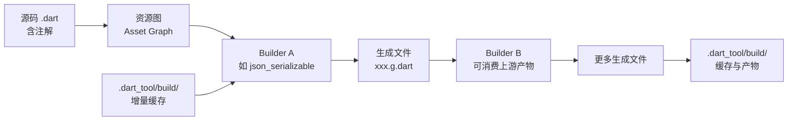

# 04 元编程与代码生成

> C 程序员熟悉两种"生成代码"的手段：`#define` 宏在预处理期做文本替换，C++ 模板在编译期做类型实例化。Java 则用注解处理器（APT）在编译期生成源码。Dart 走的是第三条路：**注解 + 独立的代码生成器（build_runner）**。你在源码里写一个 `@JsonSerializable()`，构建工具扫描源码、生成 `xxx.g.dart`，再由编译器正常编译。这看起来不如宏优雅，却解决了一个根本矛盾：Dart 要把代码 AOT 编译成紧凑的原生产物，就必须能静态分析出完整的调用图，而运行时反射会打破这个前提。本章讲清这套机制的原理、实战与工程取舍。
>
> 前置知识：[[dart/1入门/11_包管理与模块|11 包管理与模块]]（pubspec 与依赖）。对照阅读：[[java/2深入/02_注解与反射|Java 注解与反射]]。

---

## 一、元编程的三种层次

"让程序生成程序"在不同语言里落在不同层次：

| 层次 | 代表技术 | 发生时机 | Dart 现状 |
|------|----------|----------|-----------|
| 文本替换 | C 宏 `#define` | 预处理 | 无（语言刻意不提供） |
| 编译期展开 | C++ 模板、Rust 宏 | 编译 | 无（用泛型 + 代码生成替代） |
| 注解 + 源码生成 | Java APT、Dart build_runner | 构建期 | **主流方案** |
| 编译器插件 | Kotlin 编译器插件 | 编译 | 分析器插件（lint 层面） |
| 语言级宏 | Scala 3 macros | 编译 | 曾实验，2025 年停止推进 |

Dart 的选择可以总结为一句话：**把"生成"从编译过程中剥离出来，变成一次可检查、可缓存、可调试的独立构建步骤**。生成结果是普通 Dart 源码，任何工具（IDE、调试器、AOT 编译器）都能正常处理它。

---

## 二、注解：给代码附加元数据

### 2.1 语法与内置注解

注解是 `@` 开头的表达式，可加在类、字段、方法、参数、库等声明上：

```dart
class UserService {
  @deprecated           // 内置：调用处会产生警告
  void loginLegacy() {}

  @override             // 内置：要求确实重写了父类成员
  String toString() => 'UserService';

  @pragma('vm:prefer-inline')   // 给 VM 的优化提示
  int add(int a, int b) => a + b;
}
```

### 2.2 自定义注解

任何类只要构造器是 `const`，就可以当注解用：

```dart
class Route {
  final String path;
  final String method;
  const Route(this.path, {this.method = 'GET'});
}

class UserController {
  @Route('/users', method: 'POST')
  void createUser() {}
}
```

注解本身**不产生任何行为**，它只是挂在声明上的常量对象。真正读取它的是代码生成器或分析器插件。这一点与 Java 相同，但 Dart 的读取途径更窄：`dart:mirrors` 只存在于 VM/JIT，AOT 与 Web 均不可用，Flutter 默认关闭（见第七节），所以主流方案是**构建期读取**——build_runner 在编译前扫描源码里的注解。

---

## 三、build_runner：代码生成的调度器

### 3.1 工作原理

build_runner 是 Dart 官方的构建框架。它把"读源码 → 生成新源码"抽象成一个个 Builder，并按依赖关系调度：



关键机制：

- **增量构建**：build_runner 记录每个文件的输入哈希，只重建受影响的节点；缓存放在 `.dart_tool/build/`
- **输入是源码文本**：Builder 通过 `BuildStep` 读取源码与注解，不依赖运行时反射
- **产物是源码**：生成的文件与手写代码没有区别，可被 `dart analyze` 检查

### 3.2 常用命令

| 命令 | 作用 |
|------|------|
| `dart run build_runner build` | 一次性构建 |
| `dart run build_runner build --delete-conflicting-outputs` | 构建前删除冲突产物（最常用） |
| `dart run build_runner watch` | 监听文件变化，自动重建 |
| `dart run build_runner clean` | 清理缓存与产物 |
| `dart run build_runner build --build-filter='lib/**.g.dart'` | 只构建匹配路径 |

第一次引入生成器时，通常执行：

```bash
dart pub get
dart run build_runner build --delete-conflicting-outputs
```

---

## 四、json_serializable 实战

### 4.1 配置依赖

```yaml
# pubspec.yaml
dependencies:
  json_annotation: ^4.9.0

dev_dependencies:
  build_runner: ^2.4.0
  json_serializable: ^6.8.0
```

### 4.2 定义模型

```dart
import 'package:json_annotation/json_annotation.dart';

part 'user.g.dart';          // 生成文件的挂载点，文件名固定为 源文件名.g.dart

@JsonSerializable()
class User {
  final String name;

  @JsonKey(name: 'email_address')   // JSON 键与字段名不一致时映射
  final String email;

  final int age;

  const User({required this.name, required this.email, required this.age});

  // 生成器会补全这两个工厂/方法
  factory User.fromJson(Map<String, dynamic> json) => _$UserFromJson(json);
  Map<String, dynamic> toJson() => _$UserToJson(this);
}
```

运行生成命令后得到 `user.g.dart`（由工具生成，不要手改）：

```bash
dart run build_runner build --delete-conflicting-outputs
```

使用：

```dart
void main() {
  final json = {
    'name': '小明',
    'email_address': 'ming@example.com',
    'age': 18,
  };

  final user = User.fromJson(json);
  print(user.email);            // ming@example.com

  final back = user.toJson();
  print(back['email_address']); // ming@example.com
}
```

### 4.3 嵌套与选项

嵌套对象只要也标注了 `@JsonSerializable()` 就能自动递归；集合、枚举、`DateTime` 都有默认处理。全局选项写在 `build.yaml`：

```yaml
targets:
  $default:
    builders:
      json_serializable:
        options:
          explicit_to_json: true     # toJson 递归调用子对象的 toJson
          field_rename: snake        # 字段名自动转 snake_case
          create_to_json: true
          include_if_null: false     # 值为 null 时省略键
```

---

## 五、freezed：不可变数据类与联合类型

`json_serializable` 解决序列化，`freezed` 解决另一类样板：不可变类（`copyWith`、`==`、`hashCode`、`toString`）与联合类型。

### 5.1 不可变数据类

```dart
import 'package:freezed_annotation/freezed_annotation.dart';

part 'user.freezed.dart';

@freezed
abstract class User with _$User {          // freezed 3 要求 abstract 或 sealed
  const factory User({
    required String name,
    required int age,
  }) = _User;
}
```

生成后即可获得值语义：

```dart
void main() {
  const a = User(name: '小明', age: 18);
  final b = a.copyWith(age: 19);          // 生成器提供的 copyWith

  print(a == const User(name: '小明', age: 18)); // true，值相等
  print(b.age);                                  // 19
  print(a);                                      // User(name: 小明, age: 18)
}
```

需要 JSON 序列化时，freezed 可与 json_serializable 联动：同时声明 `part 'user.freezed.dart';` 与 `part 'user.g.dart';`，再补一个 `factory User.fromJson(...) => _$UserFromJson(...)`，两个生成器会协同产出。

### 5.2 联合类型与模式匹配

freezed 2 时代的 `when`/`map` 在 freezed 3 中已废弃，改用 Dart 3 的 `sealed` + 模式匹配：

```dart
@freezed
sealed class ApiResult with _$ApiResult {
  const factory ApiResult.success(String data) = ApiSuccess;
  const factory ApiResult.failure(String message, int code) = ApiFailure;
}

// 使用方必须处理全部分支，漏一个就编译报错
String render(ApiResult result) => switch (result) {
      ApiSuccess(:final data) => '成功: $data',
      ApiFailure(:final message, :final code) => '失败($code): $message',
    };

void main() {
  print(render(const ApiResult.success('已加载')));        // 成功: 已加载
  print(render(const ApiResult.failure('超时', 504)));     // 失败(504): 超时
}
```

```bash
dart run build_runner build --delete-conflicting-outputs
```

`sealed` 的穷尽性检查是编译期的，这与手写一堆 `if (x is ...)` 有本质区别：新增一个子类型时，所有 `switch` 处会立刻报错提醒你补分支。

---

## 六、source_gen：自定义生成器

内置生成器不满足需求时，可以用 `source_gen` 写自己的 Builder。核心是继承 `GeneratorForAnnotation<T>` 并实现 `generateForAnnotatedElement`：

```dart
import 'package:source_gen/source_gen.dart';
import 'package:analyzer/dart/element/element.dart';
import 'package:build/build.dart';

class Greeting {
  final String name;
  const Greeting(this.name);
}

class GreetingGenerator extends GeneratorForAnnotation<Greeting> {
  @override
  String generateForAnnotatedElement(
    Element element,
    ConstantReader annotation,
    BuildStep buildStep,
  ) {
    final name = annotation.read('name').stringValue;
    return "const greeting = '你好，$name';";
  }
}

Builder greetingBuilder(BuilderOptions options) =>
    LibraryBuilder(GreetingGenerator(), generatedExtension: '.greeting.dart');
```

再在 `build.yaml` 里注册 Builder，运行 build_runner 后，被 `@Greeting('Dart')` 标注的库旁边就会生成 `.greeting.dart`。要点：生成器运行在**构建期**，拿到的 `Element` 是分析器解析出的静态结构，因此无法读取运行时才有的值。

---

## 七、为什么 Dart 没有（可用的）运行时反射

`dart:mirrors` 曾是 Dart 的反射库，可以运行时枚举类成员、动态调用方法。如今它在主流场景不可用：

| 场景 | dart:mirrors 支持 |
|------|-------------------|
| Dart VM / JIT（`dart run`） | 支持 |
| AOT（`dart compile exe`、Flutter Release） | 不支持 |
| dart2js / Wasm（Web） | 不支持 |
| Flutter Debug | 不支持（Flutter 从未接入） |

根本原因是**树摇（tree shaking）**：AOT 编译器要从 `main` 出发做可达性分析，删掉所有不可达的类与方法，才能把产物压到几 MB。反射按名字动态查找成员，编译器无法静态判断哪些成员"可能被用到"，只能保守地全部保留——这会让树摇失效。Dart 的选择是：**牺牲反射，换取可预测的产物体积与启动速度**；需要元数据驱动的逻辑，就在构建期把信息"烧"进代码里（代码生成）。

Java 恰好相反：JVM 有完整的类元数据与反射，代价是启动慢、需依赖 GraalVM Native Image 等工具做封闭世界假设才能 AOT。两者是同一权衡的两端。

---

## 八、宏的现状与未来

Dart 团队曾推进语言级宏（macros）：让 `@JsonSerializable()` 在编译期直接生成代码，无需 build_runner。该特性长期停留在实验阶段，**2025 年初官方宣布停止推进**，理由是复杂度、工具链负担与收益不成正比。目前社区共识是：

- 代码生成继续以 build_runner 为主，增量构建与缓存机制持续优化
- 分析器插件（analyzer plugin）承担 lint 与代码辅助
- 语言层面通过 `sealed`、模式匹配、Records 等特性减少对生成的依赖

对使用者的建议：不要等待宏，把 build_runner 作为标准工程实践掌握。

---

## 九、与 Java APT、C 宏、C++ 模板对比

| 维度 | C 宏 | C++ 模板 | Java APT | Dart build_runner |
|------|------|----------|----------|-------------------|
| 触发时机 | 预处理 | 编译期实例化 | 编译期 | 独立构建步骤 |
| 输入 | 文本 | 类型 | 注解 + 源码 | 注解 + 源码 |
| 输出 | 文本 | 机器码 | Java 源码 | Dart 源码 |
| 类型安全 | 无 | 强 | 强 | 强 |
| 调试体验 | 差 | 中 | 好（生成源码可读） | 好 |
| 增量构建 | 无 | 按实例 | 编译器负责 | build_runner 缓存 |
| 读取运行时信息 | 否 | 否 | 否 | 否 |
| 典型用途 | 常量、条件编译 | 泛型容器、元编程 | Dagger、Lombok、MapStruct | json_serializable、freezed |

---

## 十、工程取舍：生成文件与构建时间

**生成文件要不要提交到版本库？** 两种策略各有拥趸：

| 策略 | 优点 | 缺点 |
|------|------|------|
| 提交 `.g.dart`/`.freezed.dart` | 克隆即可编译；CI 无需生成步骤；代码审查能看到生成结果 | 仓库膨胀；合并冲突频繁；容易与源文件不同步 |
| 不提交（加进 `.gitignore`） | 仓库干净；生成物永远最新 | 每次拉取后需手动生成；IDE 首次打开可能报红 |

团队实践建议：**默认不提交，但在 CI 中固定执行生成并检查 diff**。同时在 `.gitignore` 与 README 里写清生成命令，避免新人踩坑。

构建时间方面：生成器越多，`build_runner build` 越慢，但增量构建通常只重算受影响的文件。控制手段：缩小 `build.yaml` 的 target 范围、用 `--build-filter` 限定路径、把生成器依赖与业务依赖分开。

---

## 十一、常见坑

**坑 1：忘记运行 build_runner。** 报错形如 `The getter '_$UserFromJson' isn't defined`，说明生成文件缺失或过期。先执行 `dart run build_runner build --delete-conflicting-outputs`。

**坑 2：`part` 指令路径写错。** 生成文件名固定是 `源文件名.g.dart` / `.freezed.dart`，且必须与源文件同目录、`part` 在 `import` 之后。

**坑 3：改了模型没重建。** 字段名或类型修改后旧产物不会自动失效的场景（如手工删除部分文件）会导致运行期 `NoSuchMethodError`。用 `watch` 模式或 CI 里强制重建。

**坑 4：手动修改生成文件。** 下次构建会被覆盖。所有定制逻辑应通过注解参数、`build.yaml` 选项或手写扩展方法实现。

**坑 5：在 AOT/Web 里使用 `dart:mirrors`。** 编译直接失败或运行时抛 `UnsupportedError`。需要"按名字查成员"的能力时，改用代码生成产出查找表（如路由表、注册表）。

**坑 6：生成物与 SDK 版本不匹配。** 升级 Dart SDK 后，旧生成代码可能使用已废弃 API。升级流程：`dart pub upgrade` → `dart run build_runner clean` → 重新构建。

---

## 本章小结

| 知识点 | 一句话 |
|--------|--------|
| 元编程层次 | Dart 把生成从编译中剥离为独立构建步骤 |
| 注解 | `const` 构造器即可作注解，本身不产生行为 |
| build_runner | 增量调度 Builder，产物是普通 Dart 源码 |
| json_serializable | 注解模型 + `part`，生成 `fromJson`/`toJson` |
| freezed | 生成不可变值语义与联合类型，配合 `sealed` 模式匹配 |
| source_gen | 继承 `GeneratorForAnnotation` 自定义生成器 |
| 反射缺失 | 树摇需要静态调用图，`dart:mirrors` 仅 JIT 可用 |
| 宏 | 2025 年停止推进，build_runner 是长期方案 |
| 工程取舍 | 生成文件默认不提交，CI 固定生成并校验 |
| 常见坑 | 忘构建、part 路径错、手改产物、AOT 用反射 |

---

## 练习

| 题号 | 题目 | 链接 | 知识点 |
|------|------|------|--------|
| 297 | 二叉树的序列化与反序列化 | https://leetcode.cn/problems/serialize-and-deserialize-binary-tree/ | 序列化、递归 |

- 返回目录：[[dart/dart目录|Dart 教程目录]]
