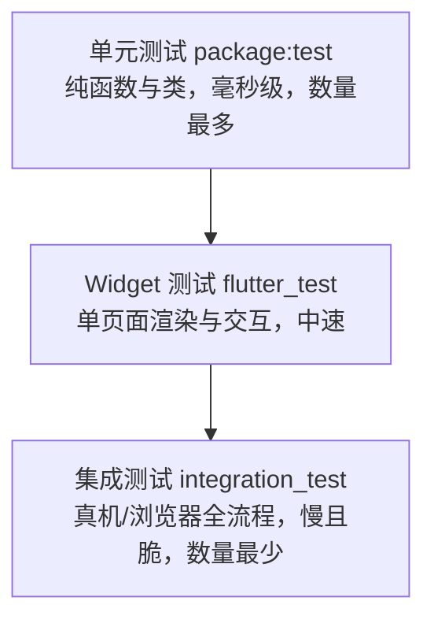
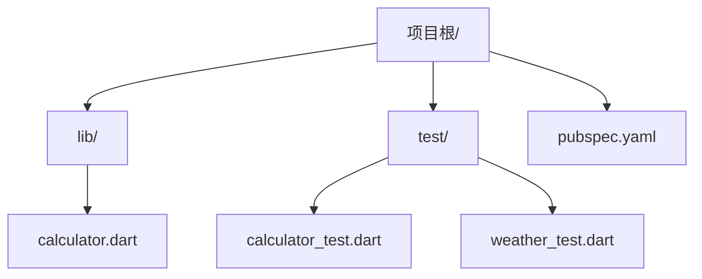

# 05 测试与调试

> C 程序员的测试工具箱通常只有 `assert` 和手工打印：`gdb` 打断点、`printf` 大法、写个 `main` 跑一遍。这套方法在单文件程序里够用，但在有异步、并发、UI 状态的应用里会迅速失效。Dart 提供了完整的工程化方案：`package:test` 做单元与集成测试，`mocktail`/`mockito` 做依赖替身，`dart test --coverage` 产出覆盖率报告，DevTools 提供断点、性能与内存视图。本章按"写测试 → 跑测试 → 调试 → 定位性能"的顺序讲清这套工具链，重点是那些让测试**假通过**的陷阱。
>
> 前置知识：[[dart/1入门/09_异步编程|09 异步编程]]（Future/Stream）、[[dart/2深入/04_元编程与代码生成|04 元编程与代码生成]]（mockito 需要 build_runner）。

---

## 一、测试金字塔在 Dart 中的落地



| 层级 | 依赖 | 运行速度 | 适合验证 |
|------|------|----------|----------|
| 单元测试 | `package:test` | 毫秒级 | 算法、模型、服务逻辑 |
| Widget 测试 | `flutter_test` | 百毫秒级 | 组件渲染、点击、状态变化 |
| 集成测试 | `integration_test` | 秒级 | 完整用户流程、平台交互 |

原则：**能用单元测试验证的逻辑，不要用 UI 测试兜底**。底层测试越快越稳定，反馈循环越短。

| 维度 | C | Dart |
|------|---|------|
| 断言 | `assert`（`NDEBUG` 下关闭） | `expect`，失败带完整上下文与堆栈 |
| 测试组织 | 手写 `main` 逐个调用 | `test`/`group` 自动发现、并发执行 |
| 依赖替身 | 手写 stub 或用链接替换 | `mocktail`/`mockito` 打桩与验证 |
| 异步验证 | 手工轮询/信号量 | `expectLater` + `completion`/`emitsInOrder` |
| 覆盖率 | `gcov` + `lcov` | `dart test --coverage` + `format_coverage` |
| 调试 | `gdb` 断点与调用栈 | DevTools：断点、火焰图、内存快照 |
| 日志 | `printf`/`stderr` | `developer.log` 带级别、错误与堆栈 |

---

## 二、package:test 基础

### 2.1 目录与依赖

```yaml
# pubspec.yaml
dev_dependencies:
  test: ^1.25.0
```

约定：测试放在与 `lib/` 平行的 `test/` 目录，文件名以 `_test.dart` 结尾，`dart test` 会自动发现。



### 2.2 基本结构：`test`、`group`、`expect`

```dart
// lib/calculator.dart
class Calculator {
  int add(int a, int b) => a + b;

  double divide(int a, int b) {
    if (b == 0) throw ArgumentError('除数不能为 0');
    return a / b;
  }

  Future<int> addAsync(int a, int b) async => a + b;

  Stream<int> countdown(int from) async* {
    for (var i = from; i > 0; i--) {
      yield i;
    }
  }
}
```

```dart
// test/calculator_test.dart
import 'package:test/test.dart';
import 'package:calculator/calculator.dart';

void main() {
  group('Calculator', () {           // group 把相关测试归类，输出更清晰
    late Calculator calc;

    setUp(() {                       // 每个 test 之前执行：隔离状态
      calc = Calculator();
    });

    test('两数相加', () {
      expect(calc.add(2, 3), equals(5));
    });

    test('除以零抛 ArgumentError', () {
      expect(() => calc.divide(1, 0), throwsA(isA<ArgumentError>()));
    });

    test('异步加法', () async {
      await expectLater(calc.addAsync(1, 2), completion(3));
    });

    test('倒计时流按序发射', () {
      expect(calc.countdown(3), emitsInOrder([3, 2, 1, emitsDone]));
    });

    test('浮点比较用 closeTo', () {
      expect(calc.divide(1, 3), closeTo(0.3333, 0.0001));
    });
  });
}
```

### 2.3 常用 matcher

| Matcher | 语义 | 示例 |
|---------|------|------|
| `equals(x)` | 值相等（调用 `==`） | `expect(result, equals(5))` |
| `isA<T>()` | 类型判断 | `expect(e, isA<ArgumentError>())` |
| `isNull` / `isNotNull` | 空判断 | `expect(value, isNull)` |
| `contains(x)` | 集合/字符串包含 | `expect(list, contains(3))` |
| `hasLength(n)` | 长度 | `expect(text, hasLength(5))` |
| `greaterThan` / `lessThan` | 比较 | `expect(age, greaterThan(18))` |
| `closeTo(v, d)` | 浮点近似 | `expect(pi, closeTo(3.14, 0.01))` |
| `throwsA(m)` | 抛指定异常 | `expect(fn, throwsA(isA<StateError>()))` |
| `returnsNormally` | 不抛异常 | `expect(fn, returnsNormally)` |
| `same(obj)` | 同一对象（identical） | `expect(a, same(b))` |
| `unorderedEquals` | 忽略顺序的集合相等 | `expect(set, unorderedEquals([1, 2]))` |
| `everyElement(m)` | 每个元素满足 | `expect(list, everyElement(greaterThan(0)))` |
| `anyOf` / `allOf` | 逻辑组合 | `expect(x, anyOf(1, 2, 3))` |

### 2.4 生命周期与组织

| 钩子 | 执行时机 |
|------|----------|
| `setUp` | 每个 `test` 前 |
| `tearDown` | 每个 `test` 后（无论成败） |
| `setUpAll` | 整个 `group` 开始前一次 |
| `tearDownAll` | 整个 `group` 结束后一次 |

命名建议：`test('当余额不足时转账应失败', ...)` 描述**行为与预期**，而不是 `test('testTransfer', ...)`。失败的测试名就是最好的 bug 报告。

---

## 三、异步测试

异步是测试假通过的重灾区。规则只有一条：**测试函数必须 `await` 所有异步操作**，否则 `test` 在回调执行前就结束了。

```dart
import 'package:test/test.dart';

Future<int> delayedValue() async {
  await Future<void>.delayed(const Duration(milliseconds: 10));
  return 42;
}

void main() {
  // 正确：await 等待 Future 完成
  test('Future 返回值', () async {
    expect(await delayedValue(), 42);
  });

  // 正确：expectLater 直接对 Future 断言（无需先 await 取值）
  test('Future 完成值', () async {
    await expectLater(delayedValue(), completion(42));
  });

  // 错误示范：没有 await，断言在 test 结束后才执行，失败也不会被报告
  // test('假通过', () {
  //   Future.delayed(const Duration(milliseconds: 10), () {
  //     expect(1, 2);
  //   });
  // });
}
```

异步 matcher 速查：

| Matcher | 用于 | 说明 |
|---------|------|------|
| `completes` | `Future` | 成功完成即可 |
| `completion(v)` | `Future` | 完成值为 `v` |
| `throwsA(m)` | `Future` / 函数 | 异步或同步异常 |
| `emitsInOrder([...])` | `Stream` | 按顺序发射指定值 |
| `emitsThrough(v)` | `Stream` | 至少发射到 `v` |
| `emitsError(m)` | `Stream` | 发射错误 |
| `emitsDone` | `Stream` | 流正常关闭 |

---

## 四、Mock：给依赖做替身

单元测试要隔离外部依赖（网络、数据库、时间），用 mock 对象替代真实实现。Dart 两大方案：

| 维度 | mocktail | mockito |
|------|----------|---------|
| 代码生成 | 不需要 | 需要 `build_runner` 生成 `.mocks.dart` |
| 上手成本 | 低，直接继承 `Mock` | 需维护生成步骤 |
| 空安全支持 | 原生 | 需 `@GenerateMocks` |
| 适用 | 绝大多数项目（推荐） | 已有 mockito 生态的项目 |

```dart
import 'package:mocktail/mocktail.dart';
import 'package:test/test.dart';

class WeatherApi {
  Future<String> fetch(String city) async => '晴';
}

class MockWeatherApi extends Mock implements WeatherApi {}

class WeatherService {
  final WeatherApi _api;
  final Map<String, String> _cache = {};
  WeatherService(this._api);

  Future<String> get(String city) async =>
      _cache[city] ??= await _api.fetch(city);
}

void main() {
  test('缓存命中时不重复调用 API', () async {
    final api = MockWeatherApi();
    when(() => api.fetch('北京')).thenAnswer((_) async => '晴');

    final service = WeatherService(api);
    final first = await service.get('北京');
    final second = await service.get('北京');

    expect(first, '晴');
    expect(second, '晴');
    verify(() => api.fetch('北京')).called(1);   // 只真实请求了一次
  });
}
```

打桩 API：`when(() => mock.method(arg)).thenReturn(v)` / `.thenAnswer((_) async => v)` / `.thenThrow(e)`；验证 API：`verify(() => mock.method(any())).called(n)`。用 `any()` 匹配自定义类型参数时，必须先 `registerFallbackValue(自定义类型实例)`，否则运行时报错。

---

## 五、dart test 常用参数

| 参数 | 作用 | 示例 |
|------|------|------|
| `--name` / `-N` | 只跑名称匹配正则的测试 | `dart test -N '相加'` |
| `--plain-name` | 精确子串匹配 | `dart test --plain-name '两数相加'` |
| `--concurrency` / `-j` | 并发测试文件数 | `dart test -j 4` |
| `--coverage` | 输出覆盖率数据目录 | `dart test --coverage=coverage` |
| `--reporter` | 输出格式 | `expanded` / `compact` / `json` / `github` |
| `--platform` / `-p` | 运行平台 | `vm` / `chrome` / `node` |
| `--fail-fast` | 首个失败即停止 | `dart test --fail-fast` |
| `--chain-stack-traces` | 显示完整异步调用链 | 调试异步失败时用 |

```bash
dart test                                   # 跑全部
dart test test/calculator_test.dart         # 跑单个文件
dart test -N 'Calculator' -j 1              # 只跑匹配组，串行执行
dart test --reporter expanded               # 逐条输出，CI 里更易读
```

---

## 六、覆盖率报告

```bash
# 1. 跑测试并收集覆盖率数据（生成 coverage/ 目录下的 json）
dart test --coverage=coverage

# 2. 安装 coverage 工具（只需一次）
dart pub global activate coverage

# 3. 把 json 汇总为 lcov.info，--report-on 指定统计范围
dart run coverage:format_coverage \
  --lcov --in=coverage --out=coverage/lcov.info --report-on=lib

# 4. 生成 HTML 报告（需系统安装 lcov 工具）
genhtml coverage/lcov.info -o coverage/html
```

| 指标 | 含义 | 建议 |
|------|------|------|
| 行覆盖率 | 执行过的代码行占比 | 核心逻辑 80% 以上 |
| 分支覆盖率 | if/switch 各分支覆盖 | 关注错误分支是否被测 |
| 文件覆盖率 | 有测试的文件占比 | 别追求 100%，生成代码排除 |

注意：覆盖率只说明"代码被执行过"，不代表断言有效。一个没有任何 `expect` 的测试也能刷满覆盖率。

---

## 七、DevTools 调试

### 7.1 启动调试

```bash
# 方式一：以调试模式运行程序，输出 DevTools 地址
dart run --observe bin/main.dart

# 方式二：先启动 DevTools 界面，再连接正在运行的应用
dart devtools
```

VS Code / Android Studio 中直接按 F5，调试器会自动接管。

### 7.2 核心能力

| 视图 | 能做什么 |
|------|----------|
| Debugger | 断点、条件断点、单步（step over/into/out）、查看局部变量与调用栈 |
| Performance | CPU 火焰图，定位热点函数与卡顿帧 |
| Memory | 堆快照、对象分配追踪，排查内存泄漏 |
| Network | 查看 HTTP 请求与响应（Flutter） |
| App Size | 分析产物体积构成（Flutter） |
| Logging | 集中查看 `print`/`log` 输出 |

调试异步代码时，在 `await` 之后的行打断点，观察变量是否被意外重置；性能问题先在 Performance 视图抓一段火焰图，再决定是否搬进 Isolate（见 [[dart/2深入/02_Isolate与并发|02 Isolate 与并发]]）。

---

## 八、日志：print 的替代品

| 方式 | 平台 | 特点 |
|------|------|------|
| `print()` | 全平台 | 简单；Flutter 高频输出可能丢日志 |
| `debugPrint()` | Flutter | 节流输出，避免 Android 日志丢失；Release 下仍输出 |
| `developer.log()` | 全平台 | 带级别、名称、错误与堆栈，DevTools 可过滤 |
| `dart:io` 的 `stderr.writeln` | 服务端 | 与标准错误流对接，容器日志友好 |

```dart
import 'dart:developer' as developer;

void main() {
  developer.log('服务启动', name: 'app', level: 800);   // 800=INFO

  try {
    throw StateError('演示异常');
  } catch (e, st) {
    developer.log('捕获异常', name: 'app', error: e, stackTrace: st);
  }
}
```

---

## 九、常见坑

**坑 1：异步未等待导致假通过。** 测试里启动 `Future` 却不 `await`，`test` 提前结束，失败断言永远不会上报。规则：测试体里每个 `Future` 都要 `await` 或返回。

**坑 2：全局状态污染。** 测试共享单例、静态缓存或环境变量时，执行顺序会决定成败。用 `setUp` 重建被测对象；无法重建的全局量用 `tearDown` 恢复。

**坑 3：测试互相依赖。** 测试 A 依赖测试 B 的副作用时，单独运行 A 会失败。每个测试必须能独立运行，且顺序无关。

**坑 4：并发执行踩共享资源。** `dart test` 默认并发跑多个测试文件，它们可能同时读写同一个临时文件或端口。改用随机端口/临时目录，或用 `-j 1` 串行。

**坑 5：mock 未注册 fallback。** `any()` 匹配自定义类型时抛 `MissingStubError` 或类型错误。在 `setUpAll` 里调用 `registerFallbackValue(实例)`。

**坑 6：测试依赖真实时间。** `Future.delayed` 让测试变慢且不稳定。用 `fake_async` 包虚拟推进时间，或把时钟抽象成可注入依赖。

**坑 7：只跑 `dart analyze` 就以为测过了。** 静态分析发现不了逻辑错误，CI 里必须同时跑 `dart analyze` 与 `dart test`。

---

## 本章小结

| 知识点 | 一句话 |
|--------|--------|
| 测试金字塔 | 单元最多、Widget 居中、集成最少 |
| 基本结构 | `test`/`group`/`expect`，`setUp` 隔离状态 |
| matcher | `equals`/`isA`/`contains`/`throwsA`/`closeTo` 覆盖常见断言 |
| 异步测试 | 必须 `await`；`expectLater` + `completion`/`emitsInOrder` |
| Mock | mocktail 免生成，mockito 需 build_runner |
| 命令 | `-N` 过滤、`-j` 并发、`--reporter` 控制输出 |
| 覆盖率 | `--coverage` 收集，`format_coverage` 转 lcov，`genhtml` 出报告 |
| DevTools | 断点调试、CPU 火焰图、内存快照、网络面板 |
| 日志 | `developer.log` 带级别与堆栈，优于裸 `print` |
| 陷阱 | 异步未等待、状态污染、互相依赖、依赖真实时间 |

---

## 练习

| 题号 | 题目 | 链接 | 知识点 |
|------|------|------|--------|
| 1 | 两数之和 | https://leetcode.cn/problems/two-sum/ | 测试编写、哈希表 |

- 返回目录：[[dart/dart目录|Dart 教程目录]]
