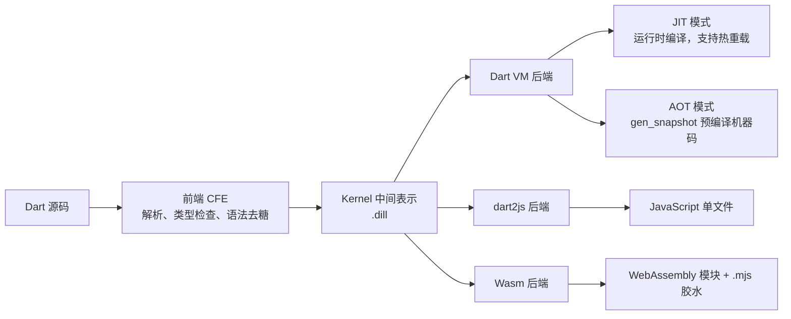
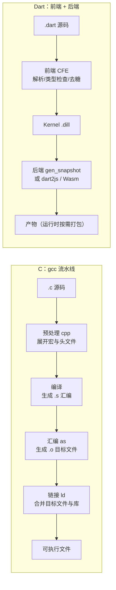

# 06 编译与产物

> C 程序员对"编译"有清晰的流水线认知：`gcc` 把 `.c` 变成 `.o`，`ld` 把 `.o` 和库链接成可执行文件。Dart 的编译体系更复杂，因为它要同时服务四种截然不同的目标：开发时的 JIT 热重载、发布时的 AOT 原生可执行文件、浏览器里的 JavaScript、以及新一代 WebAssembly。理解这条流水线的关键，是抓住中间的 **Kernel 中间表示**：所有目标共享同一个前端，区别只在下半场的后端。本章讲清每种产物的生成方式、体积与启动特征、树摇原理，以及 CI 里该如何选择。
>
> 前置知识：[[dart/1入门/02_第一个程序与命令行|02 第一个程序]]（`dart run`）、[[dart/2深入/02_Isolate与并发|02 Isolate 与并发]]（Web 上的并发限制）。

---

## 一、执行方式全景：一个前端，多个后端

Dart 官方实现是 Dart VM，它有两种执行模式；Web 平台则由两个编译器分别产出 JS 与 Wasm。所有路径共享同一段前端：



| 模式 | 编译时机 | 代表命令 | 启动速度 | 峰值性能 | 典型场景 |
|------|----------|----------|----------|----------|----------|
| JIT | 运行时 | `dart run` | 慢（需编译） | 高（可动态优化） | 开发、测试、热重载 |
| AOT | 构建时 | `dart compile exe` | 极快 | 高 | 发布 CLI/服务端 |
| dart2js | 构建时 | `dart compile js` | 取决于浏览器解析 | 中高 | Web 应用 |
| Wasm | 构建时 | `dart compile wasm` | 快（二进制解析） | 高 | Web 高性能场景 |

为什么 JIT 开发快、AOT 发布快？JIT 把编译成本推迟到运行时，换来热重载与运行时优化；AOT 把编译成本提前到构建期，产物是纯机器码，启动时无需编译。**同一个程序，开发与发布走不同的编译路径**，这是 Dart 工具链的核心设计。

---

## 二、Kernel 中间表示与 snapshot

### 2.1 Kernel：编译器的通用语言

Kernel 是 Dart 的中间表示（IR）：一棵结构化的抽象语法树，包含类型信息与去糖后的语义。前端编译器 CFE（Common Front End）负责把源码变成 Kernel：

```bash
dart compile kernel bin/main.dart -o build/main.dill
dart build/main.dill        # dill 可以用 dart 直接运行
```

`.dill` 的价值：它是所有后端的共同输入，也是分析器、热重载、增量编译的工作载体。热重载之所以能在毫秒级生效，正是因为只需重新生成受影响的 Kernel 片段，而不是重跑整条流水线。

### 2.2 snapshot：把 Kernel 再往前推一步

Snapshot 是在 Kernel 基础上预先完成部分工作的产物，分两类：

| 产物 | 命令 | 运行方式 | 特点 |
|------|------|----------|------|
| Kernel `.dill` | `dart compile kernel` | `dart x.dill` | 纯前端产物，仍需 JIT |
| JIT snapshot `.jit` | `dart compile jit-snapshot` | `dart x.jit` | 预编译 + 预热堆，启动更快；**构建时会执行程序** |
| AOT snapshot `.aot` | `dart compile aot-snapshot` | `dartaotruntime x.aot` | 预编译机器码，体积小；需配套运行时 |
| 自包含可执行文件 | `dart compile exe` | 直接运行 | AOT 机器码 + 运行时打包，零依赖 |

```bash
# JIT snapshot：注意——创建快照时会真的运行一遍 main
dart compile jit-snapshot bin/main.dart -o build/main.jit
dart build/main.jit

# AOT snapshot：体积最小，但需要 dartaotruntime 才能跑
dart compile aot-snapshot bin/main.dart -o build/main.aot
dartaotruntime build/main.aot
```

**JIT snapshot 会执行程序**这点常被忽略：如果 `main` 有副作用（写文件、发请求），构建快照时就会发生一次。它的设计初衷是"训练"：让运行时把热点代码与常用对象预先编译进快照，从而缩短生产启动时间。

---

## 三、`dart compile exe`：发布首选

```bash
dart compile exe bin/main.dart -o build/app
./build/app
```

特点：

- **零运行时依赖**：Dart 运行时被静态链接进产物，目标机器不需要装 Dart SDK
- **启动极快**：AOT 机器码直接执行，没有 JIT 的预热阶段
- **体积固定成本**：Hello World 约 6~7 MB，其中绝大部分是运行时；业务代码增长带来的增量相对很小
- 可通过 `-S/--save-debugging-info=<path>` 把调试信息从产物中剥离，既减小体积又保留符号化堆栈的能力

```bash
# 剥离调试信息，线上崩溃时用 symbols 文件还原堆栈
dart compile exe bin/main.dart -o build/app -S build/app.symbols
```

---

## 四、`dart compile js`：面向浏览器

```bash
dart compile js -O2 --minify bin/main.dart -o build/web/main.js
```

| 优化级别 | 行为 | 适用 |
|----------|------|------|
| `-O0` | 几乎不优化 | 调试编译器本身 |
| `-O1`（默认） | 全程序分析 + 内联 | 开发构建 |
| `-O2` | 安全的生产优化（含压缩） | **发布推荐** |
| `-O3` | 可能不安全的激进优化 | 追求极限体积/性能 |
| `-O4` | 更激进，可能改变语义细节 | 明确理解风险时使用 |

要点：

- `dart2js` 与开发期的 `dartdevc` 不是同一个编译器。开发时用 `dart run -d web-server` 或 Flutter 的 dev 模式，走的是快速编译但产物大的 DDC；发布才用 `dart compile js`
- 用 `deferred import` 做代码分割，首屏只加载必要代码块，其余按需拉取
- Source map 默认生成，生产可用 `--no-source-maps` 关闭

---

## 五、`dart compile wasm`：WebAssembly 路线

```bash
dart compile wasm bin/main.dart -o build/web/main.wasm
# 同时产出 main.mjs（初始化胶水代码）
```

产物是两个文件：`.wasm` 模块本身与 `.mjs` 加载器。与 dart2js 相比：

| 维度 | dart2js | Wasm |
|------|---------|------|
| 产物 | 单个 `.js` | `.wasm` + `.mjs` |
| 解析速度 | 需解析/编译 JS | 二进制格式，解析更快 |
| 执行性能 | 中高 | 接近原生 |
| 浏览器要求 | 全部现代浏览器 | 需要支持 WasmGC 的浏览器 |
| 生态兼容 | 可直接操作 DOM | 需通过 JS 互操作访问 DOM |
| 体积（Hello World） | 约 5 KB | 约 6 KB + 2 KB 胶水 |

选择建议：兼容性优先用 `dart compile js`；对计算性能敏感且可接受较新浏览器时用 Wasm。

---

## 六、树摇：AOT 与 dart2js 的体积魔法

树摇（tree shaking）指从入口出发做**全程序可达性分析**，删除永远不会执行的代码。它的前提是**封闭世界假设**：编译器能看到所有可能被调用的代码。这正是 Dart 不支持运行时反射的根本原因——反射按名字动态查找，编译器无法证明某个成员不可达。

```dart
class Used {
  void hello() => print('hello');
}

class NeverReferenced {          // 从未被引用
  void dead() => print('dead');
}

void main() {
  Used().hello();
}
// AOT/dart2js 产物中不包含 NeverReferenced 与 dead()
```

树摇能删掉的东西：

- 未被引用的类、函数、字段
- 未使用的库导出
- 在编译期可求值的常量分支（如 `if (kDebugMode)` 的假分支）
- `assert` 语句（AOT 默认关闭断言）

不能删的：通过反射访问的成员、动态 `dynamic` 调用可能命中的方法（编译器只能保守保留）、FFI 符号、`@pragma('vm:entry-point')` 标记的入口。

---

## 七、编译产物对比

同一台 Linux x64 机器上，用 Hello World 程序实测（Dart 3.13，数值随版本与平台变化）：

| 产物 | 命令 | 体积 | 启动 | 需要运行时 | 适用场景 |
|------|------|------|------|------------|----------|
| Kernel | `dart compile kernel` | 约 8 MB | 慢 | Dart SDK | 中间产物、分析 |
| JIT snapshot | `dart compile jit-snapshot` | 约 6 MB | 中 | Dart SDK | 缩短启动的开发/服务场景 |
| AOT snapshot | `dart compile aot-snapshot` | 约 0.8 MB | 快 | `dartaotruntime` | 容器内小体积服务 |
| 可执行文件 | `dart compile exe` | 约 6.7 MB | 极快 | 无 | CLI、服务端发布 |
| JavaScript | `dart compile js -O2` | 约 5 KB | 视网络 | 浏览器 | Web |
| Wasm | `dart compile wasm` | 约 6 KB + 2 KB | 快 | 浏览器 | Web 高性能 |

解读：`.exe` 的体积几乎全是运行时，换来了"拷贝即用"；`.aot` 把运行时拆出去，容器镜像可以只带一个 `dartaotruntime` 加若干小快照；Web 产物天然小，因为浏览器提供了运行时。

---

## 八、与 C 编译链接流程对比



| 阶段 | C | Dart |
|------|---|------|
| 预处理 | `cpp` 展开 `#include`/`#define` | 无独立阶段，`import` 在语言层解析 |
| 编译前端 | 解析 + 语义分析 | CFE 生成 Kernel |
| 中间表示 | GIMPLE/LLVM IR | Kernel |
| 优化 | 编译器优化 pass | TFA、内联、树摇 |
| 代码生成 | 生成汇编 | `gen_snapshot` 生成机器码，或 dart2js/Wasm 生成其他目标 |
| 汇编 | `as` | 无（直接产出目标格式） |
| 链接 | `ld` 链接库与目标文件 | 运行时静态打包进 exe；JS/Wasm 无链接步骤 |

关键差异：C 的链接是**多个编译单元的合并**；Dart 的 AOT 是**单程序封闭编译**，没有独立的库链接阶段，因此可以做跨文件的树摇与内联——这也是 AOT 性能优秀的原因之一。

---

## 九、交叉编译

`dart compile exe` 支持通过 `--target-os` 与 `--target-arch` 指定目标平台：

```bash
# 在 linux_x64 上交叉编译 linux_arm64 可执行文件
dart compile exe --target-os linux --target-arch arm64 bin/main.dart -o build/app_arm64

# 查看当前 SDK 支持的目标（不支持的目标会直接报错）
dart compile exe --target-os windows bin/main.dart -o build/app.exe
```

注意事项：

- 支持的目标取决于 SDK 是否携带对应的目标产物。实测 Dart 3.13 的 linux_x64 SDK 支持 `linux_arm`、`linux_arm64`、`linux_riscv64`、`linux_x64`，编译 Windows/macOS 目标会报 `Unsupported target platform`
- `dart compile js` 与 `dart compile wasm` 天然跨平台，产物与宿主无关
- 移动端（Android/iOS）的原生产物由 Flutter 工具链负责，不在裸 Dart 的 `compile exe` 范围内

---

## 十、体积优化与 CI 选择

### 10.1 体积优化手段

| 手段 | 命令/做法 | 收益 |
|------|-----------|------|
| 剥离调试信息 | `-S build/app.symbols` | 显著减小 exe |
| JS 压缩 | `dart compile js -O2 --minify` | 体积大幅下降 |
| 代码分割 | `deferred import` | 首屏只加载必要代码 |
| 避免反射 | 不用 `dart:mirrors` | 保住树摇 |
| 删除死代码 | 定期清理未引用的导出 | 树摇更彻底 |
| 用 AOT snapshot | `aot-snapshot` + `dartaotruntime` | 镜像体积最小 |

### 10.2 CI 中的产物选择

| 交付目标 | 推荐产物 | 构建命令 |
|----------|----------|----------|
| CLI 工具（多平台） | 各平台 `exe` | 各平台 runner 上分别 `dart compile exe`，或用 `--target-arch` |
| 服务端容器 | `aot-snapshot` + `dartaotruntime` | 基础镜像只需运行时 |
| 服务端单文件部署 | `exe` | 拷贝即运行 |
| Web 应用 | `js -O2` 或 `wasm` | 按浏览器兼容性选择 |
| Flutter 移动/桌面 | 由 Flutter 工具链产出 | `flutter build` 系列 |

CI 建议：**在构建阶段就把产物与符号文件归档**（`-S` 保存 symbols），线上崩溃时用符号文件还原堆栈；对 `exe` 产物做冒烟测试（跑一遍 `--version` 或健康检查）再发布。

---

## 十一、常见坑

**坑 1：AOT 下使用 `dart:mirrors`。** `dart compile exe` 直接编译失败，或运行时抛 `UnsupportedError`。需要"按名字查找"的能力时，改用代码生成产出静态查找表（见 [[dart/2深入/04_元编程与代码生成|04 元编程与代码生成]]）。

**坑 2：Web 上使用 `dart:io`。** `Platform`、`File`、`Socket`、`Process` 在 dart2js/Wasm 下不可用，编译期就会报错。Web 端要用 `dart:html`/`package:web` 与 `HttpRequest`/`package:http` 替代。

**坑 3：JIT snapshot 构建时执行了 `main`。** 有副作用的程序在构建快照时会真的执行一次，可能产生写文件、发请求等意外。要么保证 `main` 幂等，要么改用 `aot-snapshot`/`exe`。

**坑 4：`.aot` 当成独立可执行文件。** `.aot` 必须用 `dartaotruntime` 运行，且运行时版本要与编译时 SDK 匹配。想单文件分发就用 `exe`。

**坑 5：`-O3`/`-O4` 的"不安全优化"。** 它们可能改变依赖运行时类型细节的代码行为，生产默认用 `-O2`。

**坑 6：用 `dart run` 的性能评估 AOT 表现。** JIT 有预热与动态优化，AOT 没有；压测与性能结论必须基于最终产物。

---

## 本章小结

| 知识点 | 一句话 |
|--------|--------|
| 执行全景 | 一个前端 CFE，四个后端：JIT、AOT、dart2js、Wasm |
| Kernel | 所有后端的共同中间表示，热重载的载体 |
| Snapshot | JIT 快照启动快但构建时执行程序；AOT 快照需 `dartaotruntime` |
| `compile exe` | 零依赖单文件，体积主要由运行时构成 |
| `compile js` | `-O2` 生产推荐，`deferred import` 做代码分割 |
| `compile wasm` | `.wasm` + `.mjs`，性能好但浏览器要求高 |
| 树摇 | 封闭世界可达性分析，反射是最大敌人 |
| 与 C 对比 | 无预处理/汇编/链接阶段，AOT 做跨文件封闭编译 |
| 交叉编译 | `--target-os`/`--target-arch`，支持目标取决于 SDK |
| 工程实践 | 剥离调试信息、保存 symbols、按交付目标选产物 |

---

## 练习

| 题号 | 题目 | 链接 | 知识点 |
|------|------|------|--------|
| 224 | 基本计算器 | https://leetcode.cn/problems/basic-calculator/ | 表达式解析、编译原理思维 |

- 返回目录：[[dart/dart目录|Dart 教程目录]]
