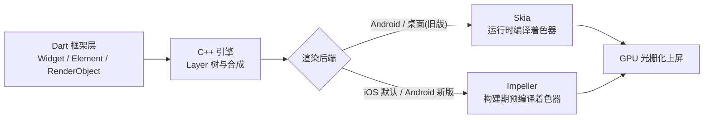
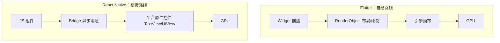
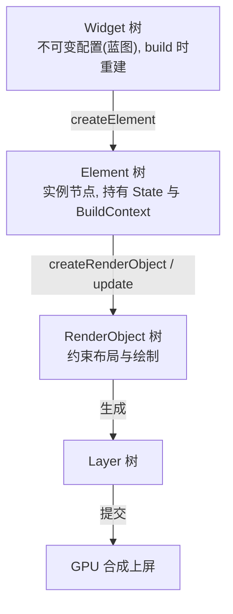
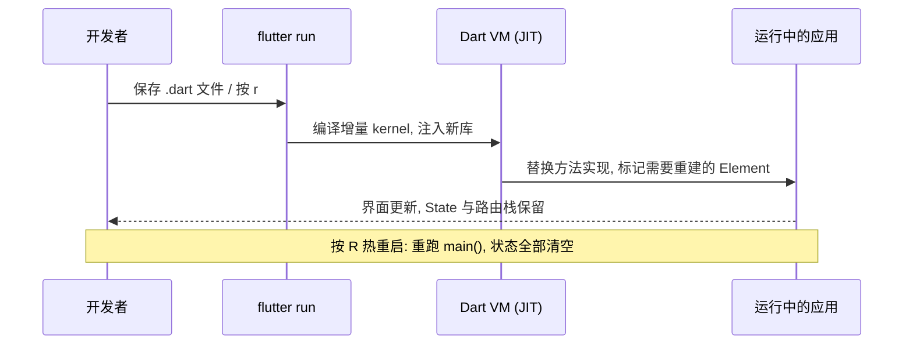

# 01 Flutter 入门

> 前置知识：[[dart/1入门/07_面向对象|07 面向对象]]、[[dart/1入门/09_异步编程|09 异步编程]]、[[dart/1入门/11_包管理与模块|11 包管理与模块]]
> 本章目标：理解 Flutter 的定位与渲染架构，说清 Widget/Element/RenderObject 三棵树的分工，掌握热重载与热重启的区别，独立创建并运行第一个 Flutter 应用，熟悉工程结构与常用命令。读完本章，你将能用一条命令把同一个应用跑到 Android、iOS、Web 与桌面端。

## Flutter 是什么

Flutter 是 Google 开源的跨平台 UI 工具包，用 Dart 语言编写应用代码。它不把 Dart 编译成 JavaScript（那是 Web 方案），也不通过桥接调用平台原生控件（那是 React Native 方案），而是**自带渲染引擎，直接向 GPU 提交绘制指令**。

- 2015 年以 "Sky" 之名亮相，2017 年 I/O 大会发布首个预览版，2018 年底发布 1.0
- 一套代码同时构建 Android、iOS、Web、Windows、macOS、Linux 应用
- 上层是 Dart 框架（Widget、动画、手势、路由），下层是 C++ 引擎（渲染、文本排版、Dart VM）
- 当前主流版本 Flutter 3.x，默认启用 Material 3，iOS 上默认使用 Impeller 渲染引擎

一句话定位：**Flutter 是「UI 界的 Unity」——自带引擎，走到哪画到哪，因此各平台表现高度一致。**

与 C 的类比：C 程序调用 `printf` 时把格式化任务交给 libc；Flutter 把「界面长什么样」交给自带的 Skia/Impeller 去光栅化，而不是交给平台的控件库。你写的是描述，引擎负责画。

## 跨平台方案横向对比

| 维度 | Flutter | React Native | 原生 Android/iOS | WebView 混合 |
|------|---------|--------------|------------------|--------------|
| 语言 | Dart | JavaScript/TypeScript | Kotlin/Swift | HTML/CSS/JS |
| 渲染方式 | 自绘引擎（Skia/Impeller） | 桥接原生控件 | 平台原生控件 | 浏览器内核 |
| UI 一致性 | 极高，各端像素级一致 | 中，控件由平台决定 | 低，两端各写一套 | 高，但样式受内核影响 |
| 性能 | 接近原生，动画 60/120fps | 中，复杂动画易掉帧 | 最好 | 一般，长列表易卡 |
| 热重载 | 支持，毫秒级 | 支持（Fast Refresh） | 有限（Apply Changes） | 支持 |
| 包体积 | 较大，引擎数 MB 起 | 较小 | 最小 | 小 |
| 原生能力 | 需平台通道/插件 | 需原生模块 | 直接可用 | 需 JS Bridge |
| 生态 | 快速成长 | 成熟，npm 庞大 | 各自平台最成熟 | 依赖 Web 生态 |
| 典型场景 | 跨端产品、强定制 UI | 已有原生团队渐进迁移 | 极致平台体验 | 活动页、内嵌页 |

选择建议：需要**多端一致、重 UI 定制、动画多**的项目，Flutter 优势最大；团队已有大量原生积累且只需渐进接入，React Native 更平滑；只做单端且要榨干平台特性，直接原生。

## 渲染架构：自绘引擎

### Skia 到 Impeller 的演进

Flutter 引擎的渲染管线大致如下：



- **Skia**：Google 的老牌 2D 图形库，Chrome、Android 都在用。它的着色器按需在运行时编译（JIT shader），首次遇到复杂效果时会卡一下，这是老版本 Flutter 上偶发 **jank（掉帧）** 的主要来源。
- **Impeller**：Flutter 自研的新引擎，**所有着色器在构建期预编译**，运行时不再编译，从根本上消除 shader 编译卡顿，并针对 Metal/Vulkan 优化。iOS 已默认启用，Android 在新版本中也已默认启用。

### 自绘路线 vs 桥接路线



桥接方案里，JS 线程与原生线程靠异步消息通信，滚动、动画这类高频操作一旦跨桥就成为瓶颈；Flutter 的自绘路线把布局与绘制放在同一个引擎里完成，与平台控件解耦，因此滚动和动画更稳。

## 三棵树：Widget / Element / RenderObject

Flutter 的 UI 不是「对象树直接绘制」，而是三层结构：



| 树 | 类型 | 生命周期 | 职责 |
|----|------|----------|------|
| Widget | 不可变配置 | 每次 build 重新创建，极廉价 | 描述 UI「应该长什么样」 |
| Element | 可变实例 | 与树中位置绑定，跨帧复用 | 连接 Widget 与 RenderObject，管理 State 归属 |
| RenderObject | 可变实例 | 尽量复用，仅在必要时重建 | 测量、布局、绘制、命中测试 |

**为什么需要 Element 中间层？** Widget 不可变、随时会被重建；如果它直接对应渲染对象，每帧都重建整棵渲染树，性能无法接受。Element 充当稳定身份：新旧 Widget 类型与 key 匹配时，复用同一个 Element 与 RenderObject，只做增量更新。这正是 React 里 Virtual DOM diff 的角色，只是 Flutter 把它做成了常驻的框架结构。

与 C 对比：Widget 像 `struct` 配置，Element 像堆上长期存在的对象，RenderObject 像真正干活的执行体。区别是 C 里三者由你手动管理，Flutter 由框架自动复用。

一个高频结论：**Widget 重建不等于 RenderObject 重建**。`build()` 被频繁调用是设计使然，不必害怕；真正昂贵的是布局与绘制。

## 热重载与热重启

### Hot Reload（热重载）

开发时按 `r` 或保存文件，Flutter 把改动编译成增量 kernel，注入运行中的 Dart VM，并触发受影响的 Widget 重建。**应用不重启、State 保留、导航栈保留**，通常几百毫秒内生效。

### Hot Restart（热重启）

按 `R`（大写）触发。它重启 Dart 入口 isolate，重新执行 `main()`，**所有 State 与导航栈清空**，但已编译的原生代码不重装。用于修改了 `main()`、全局变量初始化、`initState` 逻辑等热重载覆盖不到的场景。



| 维度 | Hot Reload | Hot Restart |
|------|------------|-------------|
| 触发键 | `r` | `R` |
| 状态保留 | 保留 | 清空 |
| 速度 | 数百毫秒 | 通常 1-2 秒 |
| 适用改动 | build 方法、样式、Widget 结构 | main、全局变量、initState、类型结构 |
| 底层机制 | JIT 增量注入 | 重启 isolate |

热重载失效的典型场景：改了 `main()` 里的初始化、改了类的字段布局（热重载不允许改变已有类的字段结构）、改了 `enum`、改了全局变量初值。遇到行为「没生效」，先试 `R`。

## 第一个 Flutter 应用

### 创建项目

```bash
flutter create hello_flutter
cd hello_flutter
flutter run
```

`flutter create` 会生成完整工程。把 `lib/main.dart` 改成下面这样：

```dart
// lib/main.dart
import 'package:flutter/material.dart';

// 应用入口：所有 Flutter 程序都从 main() 开始
void main() {
  runApp(const MyApp()); // 把根 Widget 挂载到引擎
}

// 根 Widget：配置应用级信息（标题、主题、首页）
class MyApp extends StatelessWidget {
  const MyApp({super.key});

  @override
  Widget build(BuildContext context) {
    return MaterialApp(
      title: '第一个 Flutter 应用',
      theme: ThemeData(
        colorSchemeSeed: Colors.indigo, // Material 3 主题色种子
        useMaterial3: true,
      ),
      home: const HomePage(),
    );
  }
}

// 首页：Scaffold 提供页面骨架（AppBar、body、FAB 等）
class HomePage extends StatelessWidget {
  const HomePage({super.key});

  @override
  Widget build(BuildContext context) {
    return Scaffold(
      appBar: AppBar(
        title: const Text('你好，Flutter'),
      ),
      body: const Center(
        // Center 让子组件在可用空间内居中
        child: Text(
          'Hello, Flutter!',
          style: TextStyle(fontSize: 24),
        ),
      ),
      floatingActionButton: FloatingActionButton(
        onPressed: () {
          // 用 debugPrint 而不是 print：release 下不输出，且不会丢行
          debugPrint('FAB 被点击');
        },
        child: const Icon(Icons.add),
      ),
    );
  }
}
```

运行效果：顶部一个 AppBar，中间一行居中文本，右下角一个悬浮按钮。

### 代码结构拆解

| 组件 | 角色 | 类比 |
|------|------|------|
| `runApp` | 把根 Widget 挂到引擎 | C 在 `main` 里启动事件循环 |
| `MaterialApp` | 应用级配置与路由 | Android 的 `Application` + 主题 |
| `Scaffold` | 单页骨架 | Android 的 `Activity` 布局模板 |
| `AppBar` | 顶部栏 | Android `Toolbar` / iOS `UINavigationBar` |
| `Center` | 居中布局 | Android `gravity="center"` |
| `Text` | 文本 | Android `TextView` / iOS `UILabel` |

## 项目目录结构解析

| 路径 | 作用 |
|------|------|
| `lib/` | Dart 源码目录，业务代码全部写在这里 |
| `lib/main.dart` | 应用入口，`runApp` 所在 |
| `test/` | 单元测试与 Widget 测试 |
| `android/` | Android 原生壳工程（Gradle、清单文件、图标） |
| `ios/` | iOS 原生壳工程（Xcode 工程、Info.plist） |
| `web/` | Web 入口（index.html、manifest） |
| `windows/` `macos/` `linux/` | 桌面端壳工程 |
| `pubspec.yaml` | 项目声明：名称、依赖、资源、SDK 约束 |
| `analysis_options.yaml` | 静态分析规则（lint）配置 |
| `build/` | 构建产物，不应提交到 Git |

`pubspec.yaml` 是最重要的配置文件：

```yaml
name: hello_flutter
description: 第一个 Flutter 应用
publish_to: 'none'          # 私有项目，不发布到 pub.dev
version: 1.0.0+1            # 版本号+构建号

environment:
  sdk: '>=3.3.0 <4.0.0'     # Dart SDK 约束
  flutter: '>=3.19.0'

dependencies:
  flutter:
    sdk: flutter
  cupertino_icons: ^1.0.6   # ^ 表示允许兼容性升级

dev_dependencies:
  flutter_test:
    sdk: flutter
  flutter_lints: ^4.0.0

flutter:
  uses-material-design: true
  assets:
    - assets/images/        # 必须声明资源目录，否则运行时找不到
```

修改依赖后执行 `flutter pub get` 拉取。

## Material 与 Cupertino

Flutter 内置两套设计语言：

| 维度 | Material（`package:flutter/material.dart`） | Cupertino（`package:flutter/cupertino.dart`） |
|------|---------------------------------------------|-----------------------------------------------|
| 风格 | Google Material 3 | Apple iOS Human Interface |
| 组件前缀 | `Material*`、`ElevatedButton` | `Cupertino*`、`CupertinoButton` |
| 默认观感 | Android、Web、桌面 | iOS、macOS |
| 典型组件 | AppBar、FAB、SnackBar、Drawer | CupertinoNavigationBar、CupertinoAlertDialog |
| 适配策略 | 用 Material 统一风格，或按平台切换 | 通常只对 iOS 局部使用 |

工程上的常见做法：全局用 Material（跨平台一致），对 iOS 上「用户预期强」的交互（日期选择、ActionSheet）用 Cupertino 组件，或用 `Theme.of(context).platform` 判断平台。

## 运行到各平台

```bash
# 查看可用设备（模拟器、真机、Chrome、桌面）
flutter devices

# 运行到默认设备（多个设备时会提示选择）
flutter run

# 指定设备：设备 id 来自 flutter devices 输出
flutter run -d emulator-5554      # Android 模拟器
flutter run -d "iPhone 15"        # iOS 模拟器（需 macOS）
flutter run -d chrome             # Chrome 浏览器
flutter run -d macos              # macOS 桌面（需 macOS）
flutter run -d linux              # Linux 桌面

# 发布模式运行（性能与线上一致，无热重载）
flutter run --release

# 构建产物
flutter build apk --release        # Android APK
flutter build appbundle --release  # Android AAB（上架 Google Play）
flutter build ipa --release        # iOS 归档（需 macOS + Xcode）
flutter build web --release        # Web 静态产物，位于 build/web
flutter build linux --release      # Linux 桌面
```

## 常用开发命令

| 命令 | 作用 |
|------|------|
| `flutter doctor` | 体检工具链，缺什么一目了然，环境问题先跑它 |
| `flutter create <name>` | 创建新项目，可加 `--platforms=android,ios` 限定平台 |
| `flutter pub get` | 按 pubspec.yaml 下载依赖 |
| `flutter pub upgrade` | 在约束范围内升级依赖 |
| `flutter analyze` | 静态分析，等同于 `dart analyze` |
| `flutter format .` | 按官方风格格式化代码 |
| `flutter clean` | 清除 build 缓存，构建异常时常用 |
| `flutter run` | 调试运行，支持 `r` 热重载、`R` 热重启、`q` 退出 |
| `flutter test` | 运行测试 |
| `flutter devices` | 列出可用设备 |
| `flutter doctor -v` | 详细版体检，含 SDK 路径与版本 |

调试会话中的快捷键：`r` 热重载、`R` 热重启、`p` 显示布局网格、`o` 切换平台渲染、`q` 退出。

## 常见坑

1. **首次构建极慢**：首次会下载 Gradle、CocoaPods 依赖并编译引擎绑定，几分钟到十几分钟正常。配置国内镜像（见 [[dart/1入门/01_环境配置|01 环境配置]]）能显著改善；`flutter clean` 后再次构建也会慢。
2. **设备没连上**：`flutter devices` 看不到设备时，Android 检查 USB 调试与 `adb devices`，iOS 模拟器需 macOS 且已装 Xcode 命令行工具。
3. **热重载不生效**：改 `main()`、全局变量初值、类字段结构时热重载会静默忽略，按 `R` 热重启；仍不生效则检查是否在 `--release` 模式运行。
4. **改完 pubspec 没反应**：加完依赖必须 `flutter pub get`，否则 import 报错。
5. **资源 404**：`assets/` 下的文件必须在 `pubspec.yaml` 的 `flutter.assets` 里声明，路径大小写敏感。
6. **在 Widget 里写 `print`**：用 `debugPrint`，release 模式不会输出，且大量输出时不会丢行。
7. **把业务逻辑写进 `build()`**：`build` 会被频繁调用，网络请求、文件读写放进去会重复执行。初始化逻辑放 `initState` 或状态管理层。

## 本章小结

- Flutter 用 Dart 编写、自带渲染引擎，自绘路线带来跨端一致性与稳定的动画性能
- Skia 运行时编译着色器，Impeller 预编译着色器，消除了 shader 编译卡顿
- Widget 是不可变描述，Element 是稳定实例，RenderObject 负责布局绘制；Widget 重建很廉价，布局绘制才昂贵
- 热重载保留状态注入增量代码，热重启重跑 `main()` 清空状态；改不了的结构用 `R`
- `MaterialApp` + `Scaffold` 构成应用骨架；`pubspec.yaml` 管理依赖与资源
- Material 与 Cupertino 两套设计语言可按平台混用

## 练习

1. 创建项目：用 `flutter create my_first_app` 建一个项目，分别运行到 Android 模拟器与 Chrome，记录两端界面的差异（提示：AppBar 阴影、滚动回弹）。
2. 改 UI：把首页文本改为你的名字，加一个 `Icon`，再给 `Scaffold` 加 `backgroundColor`。验收标准：保存后热重载即时更新，且不丢失任何状态。
3. 验证热重载：给 `HomePage` 改造成一个带计数器的 `StatefulWidget`（参考 [[dart/3框架/02_Widget与布局|02 Widget 与布局]]），点击加号若干次后修改按钮颜色，观察计数是否保留；再改 `main()` 里的 `title`，观察热重载是否生效，改用热重启验证区别。
4. 命令练习：用 `flutter doctor -v` 找出机器上缺失的工具链并补齐，最后 `flutter analyze` 输出 `No issues found!`。

---

- 返回目录：[[dart/dart目录|Dart 教程目录]]
