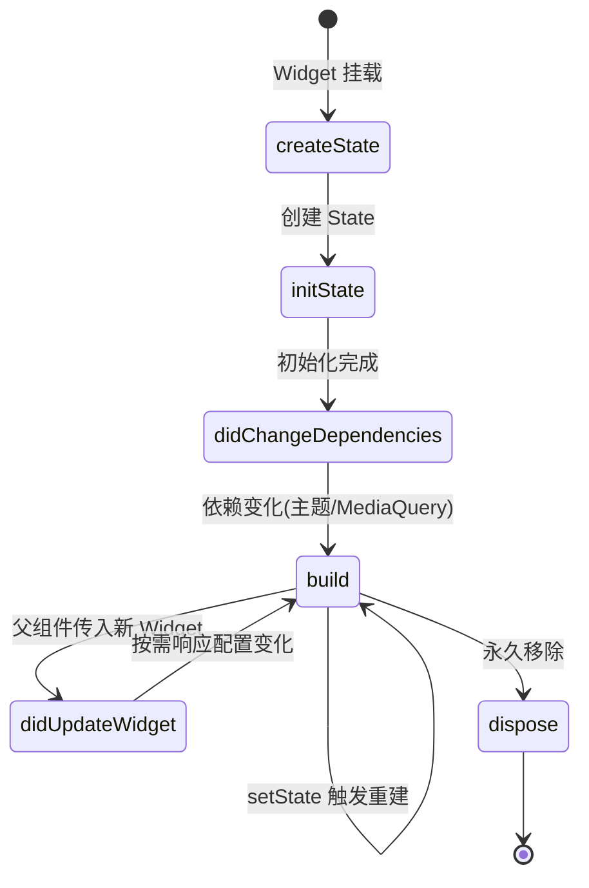
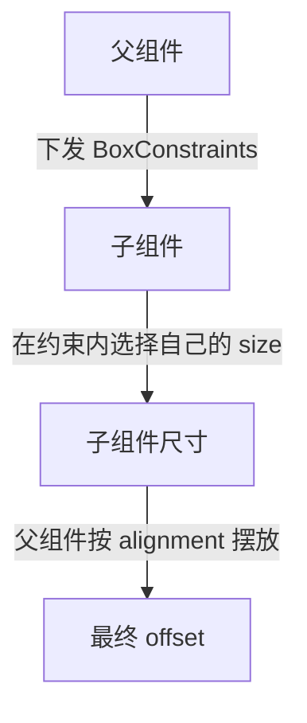

# 02 Widget 与布局

> 前置知识：[[dart/3框架/01_Flutter入门|01 Flutter 入门]]、[[dart/1入门/07_面向对象|07 面向对象]]
> 本章目标：理解「一切皆 Widget」的组合哲学，掌握 StatelessWidget 与 StatefulWidget 的生命周期，吃透 Flutter 的约束布局模型，熟练使用 Row/Column/Stack/Container/ListView 等核心组件，写出适配手机、平板与桌面的响应式界面。

## 一切都是 Widget

Flutter 里看到的一切都是 Widget：文本是 `Text`，间距是 `SizedBox`，内边距是 `Padding`，连「居中」这个行为本身也是 Widget（`Center`）。Widget 是**不可变的 UI 描述**，可以像搭积木一样组合出任意界面。

```dart
Scaffold(
  body: Center(                        // 居中本身也是 Widget
    child: Column(                     // 纵向排列
      mainAxisAlignment: MainAxisAlignment.center,
      children: const [
        Text('标题', style: TextStyle(fontSize: 28)),
        SizedBox(height: 8),           // 间距也是 Widget
      ],
    ),
  ),
)
```

| 概念 | Flutter | Android | iOS |
|------|---------|---------|-----|
| 界面单元 | Widget（不可变描述） | View / ViewGroup | UIView |
| 组合方式 | 嵌套组合，无继承 | XML 布局 + 继承 | 代码 + AutoLayout |
| 更新方式 | 重建 Widget 描述 | 修改 View 属性 | 修改视图属性 |
| 布局测量 | 单遍约束传播 | 多遍 measure/layout | 约束求解器 |

与 Android 最大的区别：`LinearLayout`、`RelativeLayout` 都是需要继承或 XML 声明的 ViewGroup；Flutter 的布局只是普通 Widget，**组合优于继承**，除非要写 `RenderObject`，否则不需要「自定义布局类」。

## StatelessWidget 与 StatefulWidget

### StatelessWidget：纯展示

没有可变状态，`build` 的输出只取决于构造参数（对应 React 函数组件）：

```dart
class UserCard extends StatelessWidget {
  final String name;
  final int age;
  const UserCard({super.key, required this.name, required this.age});

  @override
  Widget build(BuildContext context) => Card(
        child: ListTile(
          leading: const CircleAvatar(child: Icon(Icons.person)),
          title: Text(name),
          subtitle: Text('$age 岁'),
        ),
      );
}
```

### StatefulWidget：带可变状态

Widget 本身仍不可变，可变状态放在配套的 `State` 对象里，用 `setState` 通知框架重建：

```dart
class CounterBox extends StatefulWidget {
  const CounterBox({super.key});

  @override
  State<CounterBox> createState() => _CounterBoxState();
}

class _CounterBoxState extends State<CounterBox> {
  int _count = 0; // 可变状态放在 State 中

  @override
  void initState() {
    super.initState(); // 只执行一次，适合发起首屏请求
  }

  @override
  void dispose() {
    super.dispose(); // 释放 controller、取消订阅
  }

  void _increment() => setState(() => _count++); // 触发本 State 重建

  @override
  Widget build(BuildContext context) => Column(
        mainAxisSize: MainAxisSize.min,
        children: [
          Text('点击次数：$_count', style: const TextStyle(fontSize: 20)),
          const SizedBox(height: 8),
          FilledButton(onPressed: _increment, child: const Text('+1')),
        ],
      );
}
```

### State 生命周期



| 回调 | 时机 | 常见用途 |
|------|------|----------|
| `initState` | 创建后一次 | 初始化 controller、发起首屏请求 |
| `didChangeDependencies` | 依赖的 InheritedWidget 变化 | 读取主题、MediaQuery 后初始化 |
| `build` | 每次需要渲染 | 返回 Widget 描述，必须纯净 |
| `didUpdateWidget` | 父组件重建传入新 Widget | 对比新旧参数做响应 |
| `dispose` | 永久销毁 | 释放资源，**必须调用 super.dispose()** |

### setState 的三条规则

1. **只把状态变更放进 `setState`**：耗时逻辑放外面，回调应尽可能短
2. **不要在 `build` 中调用 `setState`**：会无限递归
3. **异步回调里先判断 `mounted`**：`setState` 前组件可能已被卸载

## BuildContext 是什么

`BuildContext` 是 Element 的对外接口，代表「当前 Widget 在树中的位置」，用于向上查找祖先提供的资源：

```dart
@override
Widget build(BuildContext context) {
  final theme = Theme.of(context); // 向上找最近的 Theme
  return Text('屏幕宽度 ${MediaQuery.sizeOf(context).width}',
      style: theme.textTheme.bodyLarge);
}
```

- `context` 属于「位置」而非「Widget」，同一个类在两处实例化会得到两个不同 context
- `Theme.of(context)` 基于 `InheritedWidget`：依赖变化自动重建依赖者；`initState` 中不能安全查询依赖，应放 `didChangeDependencies`

## 约束模型：BoxConstraints

Flutter 布局的核心规则只有一句话：**父组件传递约束，子组件决定尺寸，父组件决定位置。**



| 形态 | 条件 | 例子 |
|------|------|------|
| 紧约束（tight） | min == max | 屏幕根节点：宽高被锁死 |
| 松约束（loose） | min < max | `Center`：子组件可大可小，最大不超父 |
| 无界约束（unbounded） | max == infinity | 纵向 `ListView` 中的子项：高度不限 |

**为什么 `Column` 里的 `ListView` 必须包 `Expanded`？** 因为 `Column` 沿主轴给子组件无界高度约束，而 `ListView` 需要确定高度才能滚动，于是抛出 `Vertical viewport was given unbounded height`。解法是 `Expanded(child: ListView(...))` 或 `SizedBox(height: 300, child: ...)`。

## 常用布局组件

### Row / Column / Flex / Expanded / Flexible

```dart
Row(
  mainAxisAlignment: MainAxisAlignment.spaceBetween, // 主轴：横向分布
  crossAxisAlignment: CrossAxisAlignment.center,    // 交叉轴：纵向对齐
  children: [
    const Icon(Icons.star),
    const Text('收藏'),
    Expanded(                          // 占据剩余空间，等价 flex: 1
      child: Text('一段很长的说明文字', overflow: TextOverflow.ellipsis),
    ),
    Flexible(                          // 可伸缩但允许小于剩余空间
      child: FilledButton(onPressed: () {}, child: const Text('确定')),
    ),
  ],
)
```
| 组件 | 作用 | 与 C 类比 |
|------|------|-----------|
| `Flex` | 一维线性布局基类 | 手写循环摆放元素 |
| `Expanded` | 强制占满剩余空间（flex=1） | 分配剩余缓冲区 |
| `Flexible` | 可伸缩，允许小于剩余空间 | 弹性分配 |
| `Spacer` | 撑开空白的 Expanded | 填充对齐 |

### Stack / Positioned

```dart
Stack(
  children: [
    Image.network('https://picsum.photos/600/400', fit: BoxFit.cover),
    Positioned( // 相对 Stack 绝对定位
      left: 12, bottom: 12,
      child: Text(
        '图片标题',
        style: TextStyle(color: Colors.white, backgroundColor: Colors.black54),
      ),
    ),
  ],
)
```

`Stack` 子组件默认按 `alignment` 叠放；`Positioned` 只在 `Stack` 直接子级中生效。

### Container / Padding / Align / Center / SizedBox

```dart
// Container = Padding + Align + DecoratedBox + ConstrainedBox 的组合体
Container(
  width: 200, height: 120,
  margin: const EdgeInsets.all(16),   // 外边距
  padding: const EdgeInsets.all(12),  // 内边距
  alignment: Alignment.center,        // 子组件对齐
  decoration: BoxDecoration(          // 背景、圆角、阴影
    color: Colors.white,
    borderRadius: BorderRadius.circular(12),
    boxShadow: const [BoxShadow(color: Colors.black12, blurRadius: 8)],
  ),
  child: const Text('卡片内容'),
)
```

`Container` 很方便但会带来额外嵌套：只要间距用 `SizedBox`/`Padding`，只要对齐用 `Align`，性能与可读性更好。

### Wrap 与滚动组件

```dart
// 标签流：空间不足自动换行
Wrap(spacing: 8, runSpacing: 8, children: const [
  Chip(label: Text('Flutter')), Chip(label: Text('Dart')),
])

// 长列表：itemBuilder 按需构建，ListView.separated 可加分隔线
ListView.builder(
  itemCount: 100,
  itemBuilder: (context, index) => ListTile(title: Text('第 $index 项')),
)
```

`Sliver` 是可滚动区域内的「片段」抽象，`CustomScrollView` 可把 `SliverAppBar`（可折叠顶栏）、`SliverGrid`、`SliverList` 拼成一个滚动视图；只做普通列表与网格时用 `ListView`/`GridView` 即可。

## 主轴与交叉轴对齐

| 属性 | 作用轴 | 取值 | 效果 |
|------|--------|------|------|
| `mainAxisAlignment` | 主轴（Row 横向 / Column 纵向） | start、center、end、spaceBetween、spaceAround、spaceEvenly | 子组件在主轴上如何分布 |
| `crossAxisAlignment` | 交叉轴 | start、center、end、stretch、baseline | 子组件在交叉轴上如何对齐 |
| `mainAxisSize` | 主轴尺寸 | max（默认）、min | 是否撑满主轴 |

记住：**主轴随方向改变**。`Row` 主轴水平、交叉轴垂直；`Column` 反之。`stretch` 会把子组件在交叉轴上拉满。

## MediaQuery 与 LayoutBuilder

```dart
class ResponsivePage extends StatelessWidget {
  const ResponsivePage({super.key});

  @override
  Widget build(BuildContext context) => LayoutBuilder(
        builder: (context, constraints) {
          // 父组件给的实际可用空间，比屏幕宽度更精确
          final columns = constraints.maxWidth >= 900
              ? 3
              : constraints.maxWidth >= 600
                  ? 2
                  : 1;
          return GridView.builder(
            gridDelegate: SliverGridDelegateWithFixedCrossAxisCount(
              crossAxisCount: columns,
            ),
            itemBuilder: (context, index) => Text('$index'),
          );
        },
      );
}
```

| 工具 | 数据来源 | 适用场景 |
|------|----------|----------|
| `MediaQuery` | 整个窗口 | 屏幕尺寸、安全区、文字缩放 |
| `LayoutBuilder` | 父组件给的约束 | 组件级响应式，同一组件在不同容器自适应 |
| `OrientationBuilder` | 屏幕方向 | 横竖屏切换布局 |

`sizeOf` 只订阅尺寸，比 `MediaQuery.of(context)` 整体订阅更精准，能减少无谓重建。

## SafeArea

刘海屏、挖孔屏、底部手势条会遮挡内容，`SafeArea` 自动给子组件加上系统安全内边距：

```dart
Scaffold(body: SafeArea(child: ListView(children: const [Text('不会被刘海或手势条遮挡')])))
```

页面背景要延伸到屏幕边缘时，用 `SafeArea` 包内容而非包整页，或用 `top: false` 只保留需要的方向。

## 主题：ThemeData 与 Material 3

```dart
MaterialApp(
  theme: ThemeData(useMaterial3: true, colorSchemeSeed: Colors.indigo),
  darkTheme: ThemeData(colorSchemeSeed: Colors.indigo, brightness: Brightness.dark),
  themeMode: ThemeMode.system, // 跟随系统深色模式
  home: const HomePage(),
)

// 组件内读取语义色，不要硬编码十六进制色值
final scheme = Theme.of(context).colorScheme;
Container(color: scheme.primaryContainer, child: const Text('主色容器'));
```

颜色一律从 `ColorScheme` 取语义色（`primary`、`surface`、`error` 等），这样深色模式与品牌换肤才能自动生效。设计令牌体系见 [[前端开发/02-CSS框架/Tailwind-CSS/03-自定义主题|自定义主题与设计令牌]]。

## Text 与图片

```dart
Text(
  '标题文字',
  style: const TextStyle(fontSize: 24, fontWeight: FontWeight.w600, height: 1.4),
  maxLines: 2,
  overflow: TextOverflow.ellipsis, // 超出显示省略号
)

Image.asset('assets/images/logo.png', width: 120, fit: BoxFit.cover) // 需先声明 assets

// 网络图片务必处理加载与失败状态
Image.network(
  'https://picsum.photos/400/300',
  loadingBuilder: (context, child, progress) =>
      progress == null ? child : const Center(child: CircularProgressIndicator()),
  errorBuilder: (context, error, stack) =>
      const Center(child: Icon(Icons.broken_image, size: 48)),
)
```

## 与 Android XML / iOS AutoLayout 对比

| 维度 | Flutter | Android XML | iOS AutoLayout |
|------|---------|-------------|----------------|
| 声明方式 | Dart 代码嵌套 | XML 标签 | 代码/Storyboard 约束 |
| 线性布局 | Row / Column / Flex | LinearLayout | UIStackView |
| 约束模型 | 父传约束、子定尺寸、父定位置 | measure/layout 两遍遍历 | 约束求解（Cassowary） |
| 列表 | ListView / GridView / Sliver | RecyclerView | UITableView |
| 响应式 | MediaQuery / LayoutBuilder | 资源限定符 | Size Classes |

## 完整示例：响应式卡片列表

```dart
// lib/main.dart
import 'package:flutter/material.dart';

void main() => runApp(const MyApp());

class MyApp extends StatelessWidget {
  const MyApp({super.key});

  @override
  Widget build(BuildContext context) => MaterialApp(
        title: '响应式卡片列表',
        theme: ThemeData(useMaterial3: true, colorSchemeSeed: Colors.teal),
        home: const CardListPage(),
      );
}

class CardListPage extends StatelessWidget {
  const CardListPage({super.key});

  static const _items = ['Flutter 入门', 'Widget 与布局', '状态管理', '路由与导航'];

  @override
  Widget build(BuildContext context) {
    final width = MediaQuery.sizeOf(context).width;
    // 窄屏 1 列、平板 2 列、桌面 3 列
    final columns = width >= 900 ? 3 : (width >= 600 ? 2 : 1);
    return Scaffold(
      appBar: AppBar(title: const Text('响应式卡片列表')),
      body: GridView.builder(
        padding: const EdgeInsets.all(16),
        gridDelegate: SliverGridDelegateWithFixedCrossAxisCount(
          crossAxisCount: columns,
          mainAxisSpacing: 16,
          crossAxisSpacing: 16,
        ),
        itemCount: _items.length,
        itemBuilder: (context, index) => Card(
          child: Center(child: Text(_items[index])),
        ),
      ),
    );
  }
}
```

验收点：手机宽度一列、平板两列、桌面三列；旋转屏幕后列数自动变化。

## 常见坑

1. **Unbounded height**：`Column` 中直接放 `ListView` 会报「Vertical viewport was given unbounded height」。用 `Expanded`、`SizedBox(height: ...)` 或 `shrinkWrap: true`（性能差，慎用）。
2. **`Expanded` 越界**：`Expanded` 只能直接放在 `Row`/`Column`/`Flex` 里，放进 `Padding` 会报 `Incorrect use of ParentDataWidget`。
3. **`const` 优化**：能加 `const` 的 Widget 尽量加，Flutter 会跳过其重建与 diff；含运行时变量或 `Theme.of(context)` 的地方不能加。
4. **`Container` 滥用与硬编码尺寸**：只为一个间距套三层 `Container` 会让树又深又难读；`width: 375` 在平板上会留下大片空白，用约束与比例布局。
5. **在 `build` 里创建 controller**：`TextEditingController`、`AnimationController` 必须放 `State` 字段并在 `dispose` 释放；耗时逻辑同理，不能写进 `build`。

## 本章小结

- 一切皆 Widget，布局靠组合而非继承；Widget 不可变，重建代价很低
- StatefulWidget 的可变状态放 `State`，`initState` 初始化、`dispose` 清理
- 约束模型一句话：父传约束、子定尺寸、父定位置；遇到无界约束必须显式给尺寸
- Row/Column 管一维分布，Stack 管层叠，Container 是组合体，ListView/GridView 负责滚动
- 主轴交叉轴随方向变化；响应式优先用 `LayoutBuilder` + `MediaQuery.sizeOf`，主题色取 `ColorScheme` 语义色

## 练习

1. 个人名片：用 `StatelessWidget` 实现一张名片（头像、姓名、简介、联系方式），要求圆角卡片 + 阴影。验收标准：在 320 与 800 两种宽度下都不溢出（无黄黑警告条）。
2. 计数器生命周期：给 `CounterBox` 的每个生命周期回调加 `debugPrint`，分别观察热重载、热重启、页面跳转时的打印顺序，并用注释写出结论。
3. 响应式列表：改造本章的卡片列表，窄屏单列列表、宽屏三列网格，并在 AppBar 显示当前列数。验收标准：拖动窗口大小时列数实时变化且不报错。
4. 综合布局：用 `Stack` + `Positioned` + `ListView` 实现一个「个人主页」：顶部封面图、头像叠在封面上、下方是可滚动的动态列表。验收标准：头像不随列表滚动、列表可正常滚动、无布局异常。

---

- 返回目录：[[dart/dart目录|Dart 教程目录]]
