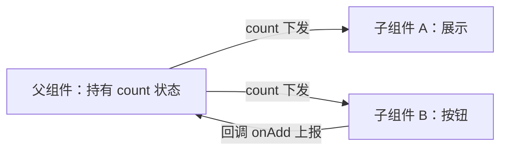
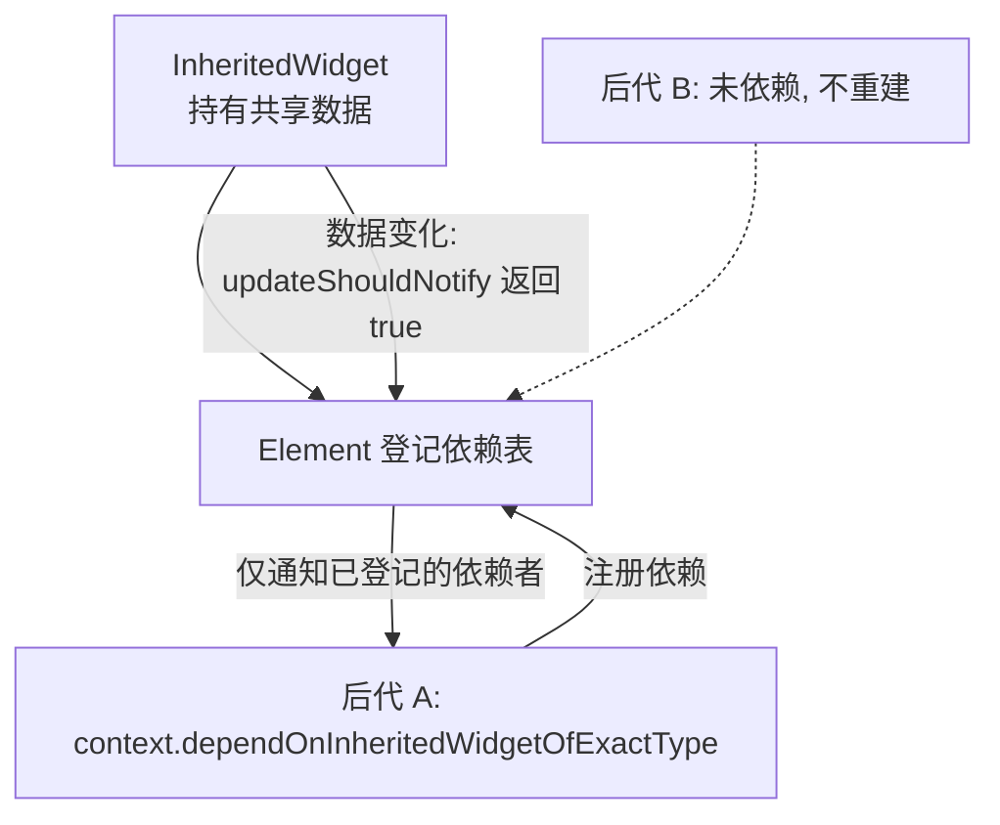
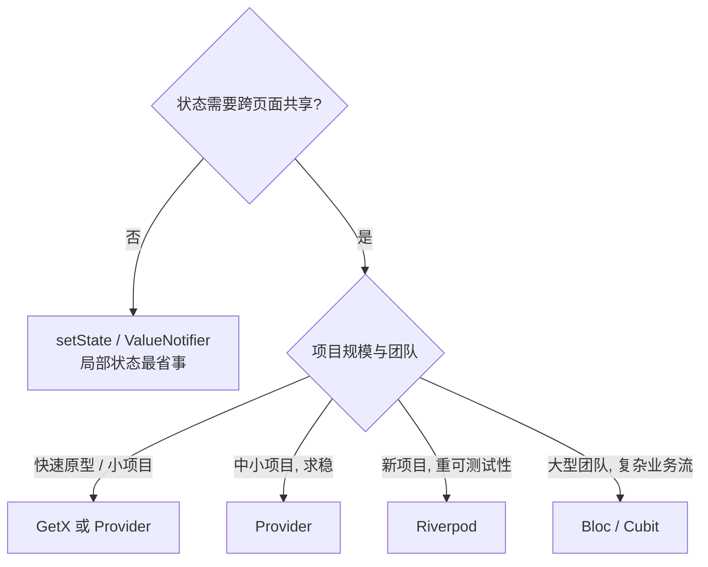

# 03 状态管理

> 前置知识：[[dart/3框架/02_Widget与布局|02 Widget 与布局]]、[[dart/1入门/07_面向对象|07 面向对象]]、[[dart/1入门/09_异步编程|09 异步编程]]
> 本章目标：分清 UI 状态与应用状态，掌握 setState、状态提升、InheritedWidget 的底层原理，能用 Provider、Riverpod、Bloc 三大主流方案实现同一功能，并依据项目规模做出合理的选型决策。

## 什么是状态

**状态（State）是任何会影响界面渲染的数据。** 在 Flutter 中，状态分两类：

| 维度 | UI 状态（局部状态） | 应用状态（共享状态） |
|------|---------------------|----------------------|
| 例子 | 输入框内容、动画进度、当前 Tab、展开/收起 | 登录用户、购物车、主题设置、消息列表 |
| 作用范围 | 单个 Widget 或单页 | 跨页面、跨组件 |
| 生命周期 | 页面销毁即丢弃 | 与 App 同生命周期或会话级 |
| 推荐方案 | `setState`、`ValueNotifier` | Provider / Riverpod / Bloc |
| 与 React 类比 | 组件内 `useState` | Redux / Zustand / Context |

选型第一原则：**能用局部状态解决的就不要引入全局状态库**。很多项目把输入框内容都塞进全局 store，结果是架构复杂度飙升、性能反而变差。

## 局部状态与 setState

`setState` 是 Flutter 内置的状态管理，适合「只影响当前页面」的状态：

```dart
class SearchBox extends StatefulWidget {
  const SearchBox({super.key});

  @override
  State<SearchBox> createState() => _SearchBoxState();
}

class _SearchBoxState extends State<SearchBox> {
  final _controller = TextEditingController(); // UI 状态：输入内容

  @override
  void dispose() {
    _controller.dispose(); // 记得释放
    super.dispose();
  }

  @override
  Widget build(BuildContext context) => Column(
        children: [
          TextField(
            controller: _controller,
            onChanged: (_) => setState(() {}), // 触发重建以更新清空按钮
          ),
          if (_controller.text.isNotEmpty)
            TextButton(
              onPressed: () => setState(() => _controller.clear()),
              child: const Text('清空'),
            ),
        ],
      );
}
```

`setState` 的代价：**调用后当前 State 的整个 `build` 重新执行**。页面简单时无所谓，页面复杂时会牵一发动全身。当发现「改一个小开关整个页面都在闪」，就该考虑缩小状态作用域或使用细粒度订阅方案。

## 状态提升：Lifting State Up

两个兄弟组件需要共享数据时，把状态提升到它们最近的共同父级：



```dart
class Parent extends StatefulWidget {
  const Parent({super.key});

  @override
  State<Parent> createState() => _ParentState();
}

class _ParentState extends State<Parent> {
  int _count = 0; // 状态提升到父级

  @override
  Widget build(BuildContext context) => Column(
        children: [
          Text('计数：$_count'), // 子组件 A：展示
          FilledButton(
            onPressed: () => setState(() => _count++), // 子组件 B：上报
            child: const Text('+1'),
          ),
        ],
      );
}
```

但状态提升只能解决「同一父级下」的共享。跨页面、跨层级时，需要「向下传递数据」的机制——这就是 `InheritedWidget`。

## InheritedWidget 原理

`InheritedWidget` 是 Flutter 官方提供的跨层级数据传递机制：祖先节点持有数据，后代通过 `context` 声明依赖，数据变化时框架只重建依赖者。



手写一个极简版：

```dart
class CountScope extends InheritedWidget {
  final int count;

  const CountScope({super.key, required this.count, required super.child});

  // 数据变化时是否通知依赖者重建
  @override
  bool updateShouldNotify(CountScope oldWidget) => count != oldWidget.count;

  // 后代调用 CountScope.of(context) 获取数据并注册依赖
  static CountScope of(BuildContext context) =>
      context.dependOnInheritedWidgetOfExactType<CountScope>()!;
}

// 使用：任意深度的后代都能拿到 count，无需层层传参
Text('${CountScope.of(context).count}');
```

Provider、Riverpod 等库本质上都是 `InheritedWidget` 的封装与增强：Provider 帮你管理「什么时候 notify」，Riverpod 帮你把依赖关系从 Widget 树中抽离。

## Provider：官方推荐的入门方案

Provider 由 Flutter 社区核心成员维护，模式简单：`ChangeNotifier` 持有状态并调用 `notifyListeners()`，Widget 通过 `context.watch` 订阅。

```dart
// 1. 定义状态模型：继承 ChangeNotifier
class CounterModel extends ChangeNotifier {
  int _count = 0;
  int get count => _count;

  void increment() {
    _count++;
    notifyListeners(); // 通知所有订阅者重建
  }
}

// 2. 在树顶注入
void main() => runApp(
      ChangeNotifierProvider(
        create: (_) => CounterModel(),
        child: const MyApp(),
      ),
    );

// 3. 读取与订阅
class CounterText extends StatelessWidget {
  const CounterText({super.key});

  @override
  Widget build(BuildContext context) => Text(
        '计数：${context.watch<CounterModel>().count}', // 变化时重建
        style: const TextStyle(fontSize: 24),
      );
}

class CounterButton extends StatelessWidget {
  const CounterButton({super.key});

  // read：只取方法不订阅，避免无谓重建
  @override
  Widget build(BuildContext context) => FilledButton(
        onPressed: () => context.read<CounterModel>().increment(),
        child: const Text('+1'),
      );
}
```

`Provider` 家族常用组件：

| 组件 | 作用 |
|------|------|
| `Provider` | 提供不可变值 |
| `ChangeNotifierProvider` | 提供可变模型，自动 dispose |
| `Consumer<T>` | 局部订阅，缩小重建范围 |
| `Selector<T, R>` | 只在选中字段变化时重建 |
| `context.watch<T>()` | 订阅整个模型，等价 `Consumer` |
| `context.read<T>()` | 不订阅，只读一次，适合事件回调 |

## Riverpod：编译期安全的新一代

Riverpod 是 Provider 作者的重写版，把「提供者」声明为顶层变量，不再依赖 `BuildContext` 查找，因而**编译期可检查、可组合、可测试**，且能自动 dispose。

```dart
// 1. 声明 Provider：顶层变量，不依赖 Widget 树
final counterProvider = NotifierProvider<CounterNotifier, int>(CounterNotifier.new);

class CounterNotifier extends Notifier<int> {
  @override
  int build() => 0; // 初始状态

  void increment() => state++; // 直接修改 state 即通知
}

// 2. 用 ConsumerWidget 订阅
class CounterText extends ConsumerWidget {
  const CounterText({super.key});

  @override
  Widget build(BuildContext context, WidgetRef ref) => Text(
        '计数：${ref.watch(counterProvider)}', // 订阅：变化时重建
        style: const TextStyle(fontSize: 24),
      );
}

class CounterButton extends ConsumerWidget {
  const CounterButton({super.key});

  // read：不订阅；点击回调里绝不能用 watch
  @override
  Widget build(BuildContext context, WidgetRef ref) => FilledButton(
        onPressed: () => ref.read(counterProvider.notifier).increment(),
        child: const Text('+1'),
      );
}

// 3. 在 main 中用 ProviderScope 包裹应用
void main() => runApp(const ProviderScope(child: MyApp()));
```

`ref` 的三种用法：

| API | 用途 | 重建行为 |
|-----|------|----------|
| `ref.watch(provider)` | 在 `build` 中订阅状态 | 状态变化时重建当前 Widget |
| `ref.read(provider)` | 事件回调中读取一次 | 不订阅、不重建 |
| `ref.listen(provider, cb)` | 监听变化执行副作用（弹窗、跳转） | 不重建，执行回调 |

Riverpod 的 Provider 种类：`Provider`（只读计算值）、`FutureProvider`（异步）、`StreamProvider`（流）、`NotifierProvider`（同步可变状态）、`AsyncNotifierProvider`（异步可变状态）。依赖关系自动推导：一个 Provider 里 `ref.watch` 另一个 Provider，前者变化会自动触发后者更新。

## Bloc / Cubit：事件驱动与强约束

Bloc 把状态变化建模为「事件 → 新状态」的单向流，适合大型团队与复杂业务。Cubit 是 Bloc 的轻量版：没有事件类，直接调用方法。

```dart
// Cubit：直接暴露方法，emit 新状态
class CounterCubit extends Cubit<int> {
  CounterCubit() : super(0);

  void increment() => emit(state + 1);
}

// Bloc：显式事件，可追踪、可回放
sealed class CounterEvent {}
class CounterIncremented extends CounterEvent {}

class CounterBloc extends Bloc<CounterEvent, int> {
  CounterBloc() : super(0) {
    on<CounterIncremented>((event, emit) => emit(state + 1));
  }
}

// 在 Widget 中订阅
BlocProvider(create: (_) => CounterCubit(), child: const CounterPage());

BlocBuilder<CounterCubit, int>(
  builder: (context, count) => Text('$count'),
)
```

| 维度 | Cubit | Bloc |
|------|-------|------|
| 状态变更入口 | 方法调用 | 事件对象 |
| 可追踪性 | 中 | 高（事件可记录、回放） |
| 样板代码 | 少 | 多 |
| 适用 | 中小型状态 | 复杂业务、审计、协同编辑 |

Bloc 的流式结构天然可测试：给定事件序列与初始状态，断言状态输出序列即可，不需要渲染界面。

## GetX 与 MobX 简述

- **GetX**：把路由、状态、依赖注入、国际化打包进一个库，写法极简（`.obs` + `Obx`），上手最快；争议在于侵入性强、隐式魔法多、社区评价两极，适合快速原型与小型项目。
- **MobX**：基于响应式可观察对象，用 `@observable` / `@computed` / `@action` 描述状态，配合 `Observer` 自动追踪依赖。心智模型与 Vue 的响应式相近，代码生成（`build_runner`）带来一定门槛。

```dart
// GetX 风格：状态加 .obs，Obx 自动订阅
final count = 0.obs;
Obx(() => Text('${count.value}'));
count.value++; // 修改即刷新

// MobX 风格：注解声明可观察状态，Observer 自动追踪依赖
// @observable int count = 0;
// @action void increment() => count++;
```

## 五大方案对比

| 方案 | 学习曲线 | 样板代码 | 可测试性 | 社区/生态 | 适用场景 |
|------|----------|----------|----------|-----------|----------|
| setState + InheritedWidget | 低 | 少 | 低 | 官方内置 | 局部状态、小页面 |
| Provider | 低 | 中 | 中 | 大，官方推荐入门 | 中小项目、团队过渡 |
| Riverpod | 中 | 中 | 高 | 快速增长，新项目主流 | 中大型项目、重测试 |
| Bloc/Cubit | 高 | 多 | 很高 | 大，企业采用多 | 大型团队、复杂业务流 |
| GetX / MobX | 低/中 | 少/中 | 低/中 | 中等 | 快速原型、偏好响应式 |

## 选型决策树



## 完整案例：购物车

用 Riverpod 实现「商品列表加入购物车、显示总价」，覆盖 `Notifier`、计算属性与 `ConsumerWidget`：

```dart
// lib/main.dart
import 'package:flutter/material.dart';
import 'package:flutter_riverpod/flutter_riverpod.dart';

// 用记录类型表示商品：名称 + 价格
const _products = [('机械键盘', 399.0), ('人体工学椅', 1299.0), ('显示器支架', 199.0)];

// 购物车状态：Map<商品名, 数量>
class CartNotifier extends Notifier<Map<String, int>> {
  @override
  Map<String, int> build() => {};

  void add(String name) {
    state = {...state, name: (state[name] ?? 0) + 1}; // 新 Map 触发通知
  }
}

final cartProvider =
    NotifierProvider<CartNotifier, Map<String, int>>(CartNotifier.new);

// 计算属性：总价由购物车派生，无需单独存状态
final totalProvider = Provider<double>((ref) {
  final cart = ref.watch(cartProvider);
  return cart.entries
      .map((e) => _products.firstWhere((p) => p.$1 == e.key).$2 * e.value)
      .fold(0, (sum, v) => sum + v);
});

void main() => runApp(ProviderScope(
      child: MaterialApp(
        title: '购物车示例',
        theme: ThemeData(useMaterial3: true, colorSchemeSeed: Colors.orange),
        home: const ShopPage(),
      ),
    ));

class ShopPage extends ConsumerWidget {
  const ShopPage({super.key});

  @override
  Widget build(BuildContext context, WidgetRef ref) {
    final cart = ref.watch(cartProvider);
    final total = ref.watch(totalProvider);
    return Scaffold(
      appBar: AppBar(title: const Text('购物车示例')),
      body: ListView(
        children: [
          for (final p in _products)
            ListTile(
              title: Text(p.$1),
              subtitle: Text('￥${p.$2.toStringAsFixed(0)} × ${cart[p.$1] ?? 0}'),
              trailing: FilledButton(
                onPressed: () => ref.read(cartProvider.notifier).add(p.$1),
                child: const Text('加入'),
              ),
            ),
        ],
      ),
      bottomNavigationBar: Padding(
        padding: const EdgeInsets.all(16),
        child: Text('合计：￥${total.toStringAsFixed(0)}',
            style: const TextStyle(fontSize: 20, fontWeight: FontWeight.bold)),
      ),
    );
  }
}
```

关键点：`cartProvider` 变化时，只有 `watch` 了它的 Widget 重建；`totalProvider` 自动随购物车更新，不需要手动同步。

## 常见坑

1. **重建范围过大**：`context.watch<Model>()` 或 `ref.watch` 放在页面顶层，任何字段变化都重建整页。用 `Selector`、`Consumer` 或拆分子 Widget 缩小范围。
2. **async gap 后使用 context**：`await` 之后 `context` 可能已失效，先判断 `if (!context.mounted) return;` 再用。
3. **dispose 遗漏**：`ChangeNotifier`、`TextEditingController`、`StreamSubscription` 都要释放；Provider 的 `ChangeNotifierProvider` 会自动 dispose，`Provider` 不会。
4. **在 `build` 中调用 `read` 却期望刷新**：`read` 不建立订阅，数据变化界面不会更新；反过来把所有状态塞进全局 store 也是过度设计，局部状态就用 `setState`。
5. **Provider 依赖 `BuildContext` 查找**：在 `initState` 或 `showDialog` 的新 context 中可能找不到 Provider，注意 Provider 注入的位置。

## 本章小结

- 状态分 UI 状态与应用状态；局部状态优先用 `setState`，不要过度设计
- 状态提升解决兄弟组件共享；`InheritedWidget` 是所有跨层级方案的底层机制
- Provider 简单直接，`watch` 订阅、`read` 触发；Riverpod 编译期安全、自动 dispose、可组合，是新项目主流选择
- Bloc/Cubit 事件驱动、可测试性最强，适合大型团队与复杂业务
- 选型看状态作用范围、项目规模与团队约束，而不是看热度

## 练习

1. 计数器重构：把 [[dart/3框架/02_Widget与布局|02 Widget 与布局]] 里的 `CounterBox`（`setState` 版）分别用 Provider 与 Riverpod 重构。验收标准：两个版本行为一致，且按钮组件不因计数变化而重建（可用 `debugPrint` 验证）。
2. 购物车扩展：给购物车案例加上「减少数量」与「移除商品」，数量减到 0 时自动移除。验收标准：总价实时正确，空购物车显示合计 ￥0。
3. 主题切换：用 Riverpod 实现亮色/深色主题切换，开关状态跨页面保持。验收标准：切换后所有页面立即生效，重启应用后恢复默认（不要求持久化）。
4. 选型分析：为你熟悉的一个 App（如外卖、笔记）列出 5 个状态，判断各自属于 UI 状态还是应用状态，并写出你会选择的方案与理由（用注释写在代码文件里）。

---

- 返回目录：[[dart/dart目录|Dart 教程目录]]
