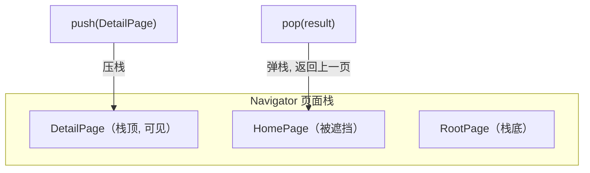
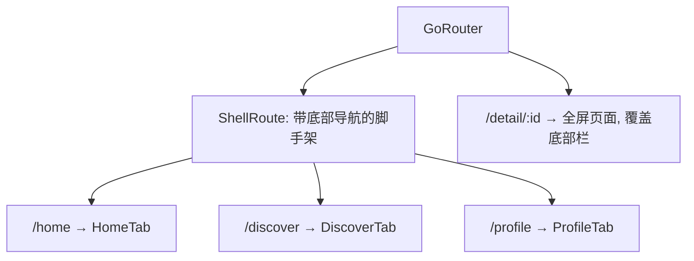

# 04 路由与导航

> 前置知识：[[dart/3框架/02_Widget与布局|02 Widget 与布局]]、[[dart/3框架/03_状态管理|03 状态管理]]
> 本章目标：理解页面栈与 push/pop 模型，掌握 Navigator 1.0 与命名路由的用法，能用 go_router 实现路径参数、嵌套路由、登录守卫与错误页，并解决底部导航状态保持、返回拦截等工程问题。

## 导航基础：页面栈

Flutter 的导航模型是一个**后进先出的页面栈**：`push` 把新页面压栈，`pop` 把栈顶页面弹出。用户按系统返回键时，框架默认弹出栈顶。



| 概念 | Flutter | Android | Web |
|------|---------|---------|-----|
| 导航容器 | `Navigator` | `Activity` 任务栈 / FragmentManager | History API |
| 压栈 | `Navigator.push` | `startActivity` | `history.pushState` |
| 弹栈 | `Navigator.pop` | `finish()` / `back` | `history.back` |
| 路由声明 | Widget / 路由表 | Manifest / 代码 | 路由配置 |

## Navigator 1.0：命令式导航

最直接的用法是 `Navigator.push` + `MaterialPageRoute`：

```dart
// 跳转并等待返回值
Future<void> openDetail(BuildContext context) async {
  final result = await Navigator.push<String>(
    context,
    MaterialPageRoute(builder: (_) => const DetailPage(id: 42)),
  );
  if (result != null) {
    debugPrint('详情页返回了：$result'); // 接收 pop 传回的数据
  }
}

// 详情页：返回时携带结果
class DetailPage extends StatelessWidget {
  final int id;
  const DetailPage({super.key, required this.id});

  @override
  Widget build(BuildContext context) {
    return Scaffold(
      appBar: AppBar(title: Text('详情 $id')),
      body: Center(
        child: FilledButton(
          onPressed: () => Navigator.pop(context, '已收藏'), // 第二参数是返回值
          child: const Text('返回并传值'),
        ),
      ),
    );
  }
}
```

常用 API：

| 方法 | 作用 |
|------|------|
| `Navigator.push` | 压入新页面，返回 `Future` |
| `Navigator.pop(context, result)` | 弹出栈顶，可携带返回值 |
| `Navigator.pushReplacement` | 替换栈顶（如登录后进入主页） |
| `Navigator.popUntil(context, (r) => r.isFirst)` | 连续弹出直到某个路由 |
| `Navigator.maybePop` | 有返回拦截时更安全的 pop |
| `Navigator.of(context)` | 获取最近的 Navigator |

## 命名路由

给页面起名字，跳转时不用直接引用 Widget 类，便于集中管理与深链：

```dart
MaterialApp(
  initialRoute: '/',
  routes: {
    '/': (_) => const HomePage(),
    '/detail': (_) => const DetailPage(id: 0), // 无参场景
  },
  // 需要动态参数时用 onGenerateRoute
  onGenerateRoute: (settings) {
    if (settings.name == '/user') {
      final id = settings.arguments as int; // 参数通过 arguments 传入
      return MaterialPageRoute(builder: (_) => UserPage(id: id));
    }
    return null; // 返回 null 则交给 onUnknownRoute
  },
  onUnknownRoute: (settings) =>
      MaterialPageRoute(builder: (_) => const NotFoundPage()),
)
```

跳转：`Navigator.pushNamed(context, '/user', arguments: 42);`

命名路由的局限：参数只能塞进 `arguments`（弱类型）、无法从 URL 直接解析、深层嵌套与重定向支持弱。复杂应用应直接使用 go_router。

## Navigator 2.0 / Router API 简介

Navigator 2.0 把「页面列表」变成**由应用状态派生出的声明式结构**：状态变化 → 重新计算 `pages` 列表 → 框架 diff 后更新导航栈。核心抽象是 `RouterDelegate`、`RouteInformationParser`、`RouteInformationProvider` 三件套。

它适合需要与浏览器 URL 双向同步、或自定义复杂导航逻辑的场景，但样板代码极多。**实践建议：不直接写 Router API，用 go_router 这类封装库**——go_router 基于 Router API，把声明式路由配置化。

## go_router 实战

安装：

```yaml
# pubspec.yaml
dependencies:
  go_router: ^14.0.0
```

### 路由表与路径参数

```dart
final router = GoRouter(
  initialLocation: '/',
  routes: [
    GoRoute(
      path: '/',
      builder: (context, state) => const HomePage(),
    ),
    // :id 是路径参数；查询参数用 state.uri.queryParameters
    GoRoute(
      path: '/user/:id',
      builder: (context, state) {
        final id = state.pathParameters['id']!;
        final tab = state.uri.queryParameters['tab'] ?? 'profile';
        return UserPage(id: id, tab: tab);
      },
      // 子路由：完整路径为 /user/:id/posts
      routes: [
        GoRoute(
          path: 'posts',
          builder: (context, state) =>
              PostsPage(userId: state.pathParameters['id']!),
        ),
      ],
    ),
  ],
);
```

```dart
// 跳转与传参
context.go('/user/42?tab=posts');       // 替换当前页（常用于顶层导航）
context.push('/user/42/posts');         // 压栈（可返回）
context.goNamed('user', pathParameters: {'id': '42'}); // 命名路由
```

### 重定向与登录守卫

```dart
final router = GoRouter(
  initialLocation: '/',
  // 每次导航前调用，返回非 null 即重定向
  redirect: (context, state) {
    final loggedIn = AuthService.instance.isLoggedIn;
    final goingToLogin = state.matchedLocation == '/login';
    if (!loggedIn && !goingToLogin) return '/login';   // 未登录强制去登录页
    if (loggedIn && goingToLogin) return '/';          // 已登录不再看登录页
    return null;                                       // null 表示放行
  },
  routes: [
    GoRoute(path: '/login', builder: (_, __) => const LoginPage()),
    GoRoute(path: '/', builder: (_, __) => const HomePage()),
  ],
  errorBuilder: (context, state) => Scaffold(
    appBar: AppBar(title: const Text('页面不存在')),
    body: Center(child: Text('错误：${state.error}')),
  ),
);

// 挂载到应用
MaterialApp.router(routerConfig: router);
```

### ShellRoute：嵌套导航与底部栏



```dart
ShellRoute(
  builder: (context, state, child) => Scaffold(
    body: child, // 子路由页面显示在 body 中
    bottomNavigationBar: NavigationBar(
      selectedIndex: _indexFromLocation(state.matchedLocation),
      onDestinationSelected: (i) => context.go(['/home', '/discover', '/profile'][i]),
      destinations: const [
        NavigationDestination(icon: Icon(Icons.home), label: '首页'),
        NavigationDestination(icon: Icon(Icons.explore), label: '发现'),
        NavigationDestination(icon: Icon(Icons.person), label: '我的'),
      ],
    ),
  ),
  routes: [
    GoRoute(path: '/home', builder: (_, __) => const HomeTab()),
    GoRoute(path: '/discover', builder: (_, __) => const DiscoverTab()),
    GoRoute(path: '/profile', builder: (_, __) => const ProfileTab()),
  ],
)

// 根据当前路径计算底部栏选中索引
int _indexFromLocation(String location) => switch (location) {
      '/home' => 0,
      '/discover' => 1,
      _ => 2,
    };
```

## 底部导航与状态保持

直接切换 `body` 会销毁旧页面、丢失滚动位置与输入内容。两种保持方案：

**方案一：`IndexedStack`**——所有子页面同时存在，只显示当前索引，状态天然保留：

```dart
class MainShell extends StatefulWidget {
  const MainShell({super.key});

  @override
  State<MainShell> createState() => _MainShellState();
}

class _MainShellState extends State<MainShell> {
  int _index = 0;

  @override
  Widget build(BuildContext context) {
    return Scaffold(
      // IndexedStack 保留所有子页面状态，适合页面数量固定的场景
      body: IndexedStack(
        index: _index,
        children: const [HomeTab(), DiscoverTab(), ProfileTab()],
      ),
      bottomNavigationBar: NavigationBar(
        selectedIndex: _index,
        onDestinationSelected: (i) => setState(() => _index = i),
        destinations: const [
          NavigationDestination(icon: Icon(Icons.home), label: '首页'),
          NavigationDestination(icon: Icon(Icons.explore), label: '发现'),
          NavigationDestination(icon: Icon(Icons.person), label: '我的'),
        ],
      ),
    );
  }
}
```

**方案二：`AutomaticKeepAliveClientMixin`**——页面被移出视口时保活，适合 TabBarView：

```dart
class _FeedState extends State<Feed> with AutomaticKeepAliveClientMixin {
  @override
  bool get wantKeepAlive => true; // 声明需要保活

  @override
  Widget build(BuildContext context) {
    super.build(context); // 必须调用，否则保活不生效
    return ListView.builder(itemBuilder: (_, i) => Text('动态 $i'));
  }
}
```

## 深链（Deep Link）概览

深链让外部（浏览器、短信、其他 App）能直接打开应用内某个页面。Flutter 侧的统一入口是 go_router 的路径匹配：

| 平台 | 方案 | 说明 |
|------|------|------|
| Android | App Links | `https://` 域名验证 + `intent-filter` |
| iOS | Universal Links | `apple-app-site-association` + Associated Domains |
| Android | 自定义 Scheme | `myapp://user/42`，无需验证但易被劫持 |
| iOS | 自定义 URL Scheme | `Info.plist` 注册，同上 |
| Web | URL 路由 | go_router 天然支持刷新与前进后退 |

配置完成后，go_router 会自动把 `/user/42` 解析为对应路由；在 `redirect` 中处理未登录深链，登录后跳回原目标即可。

## 页面转场动画

用 `PageRouteBuilder` 自定义转场，或统一在主题中配置：

```dart
Navigator.push(
  context,
  PageRouteBuilder(
    transitionDuration: const Duration(milliseconds: 400),
    pageBuilder: (_, __, ___) => const DetailPage(id: 1),
    transitionsBuilder: (_, animation, __, child) =>
        FadeTransition(opacity: animation, child: child), // 淡入
  ),
);

// 全局统一转场（Android 默认是 Zoom，iOS 是 Cupertino 滑动）
MaterialApp(
  theme: ThemeData(
    pageTransitionsTheme: const PageTransitionsTheme(
      builders: {
        TargetPlatform.android: CupertinoPageTransitionsBuilder(),
        TargetPlatform.iOS: CupertinoPageTransitionsBuilder(),
      },
    ),
  ),
)
```

## 与 Web 路由 / Android Activity 栈对比

| 维度 | Flutter Navigator | Web Router | Android Activity |
|------|-------------------|------------|------------------|
| 模型 | 页面栈 | URL 树 | Activity 栈 |
| 声明方式 | Widget / 路由表 / go_router | 路由配置 | Manifest + Intent |
| 参数 | 构造参数 / arguments / path | URL 参数 | Intent extras |
| 返回值 | `pop(result)` | 无（靠状态） | `startActivityForResult` |
| 返回拦截 | `PopScope` | `beforeunload` | `OnBackPressedCallback` |
| URL 同步 | go_router 支持 | 原生支持 | 不支持 |
| 状态恢复 | `RestorationMixin` | 浏览器自动 | `onSaveInstanceState` |

## 常见坑

1. **`context.mounted` 检查**：`await` 之后再 `Navigator.push/pop`，先判断 `if (!context.mounted) return;`，否则页面已销毁会抛异常。
2. **重复 push**：快速连点按钮会压入多个相同页面。用防抖标志位或 `if (ModalRoute.of(context)?.isCurrent != true) return;` 拦截。
3. **返回拦截用错 API**：`WillPopScope` 已废弃，改用 `PopScope`：

```dart
PopScope(
  canPop: false, // false 表示拦截返回
  onPopInvokedWithResult: (didPop, result) async {
    if (didPop) return;
    final ok = await showDialog<bool>(
      context: context,
      builder: (_) => AlertDialog(
        title: const Text('确认离开？'),
        actions: [
          TextButton(onPressed: () => Navigator.pop(context, false), child: const Text('取消')),
          TextButton(onPressed: () => Navigator.pop(context, true), child: const Text('离开')),
        ],
      ),
    );
    if (ok == true && context.mounted) Navigator.pop(context);
  },
  child: const EditPage(),
)
```

4. **`go` 与 `push` 混用**：底部 Tab 切换用 `go`（替换栈），详情页跳转用 `push`（可返回）；混用会导致返回路径错乱。
5. **路由表重复路径**：`/user/:id` 与 `/user/list` 冲突时，静态路径要放在参数路径之前，否则 `list` 会被当作 `id`。
6. **全局 `NavigatorKey` 缺失**：在拦截器或 Service 中导航需要 `navigatorKey`，记得挂到 `MaterialApp` 上。

## 本章小结

- 导航的本质是页面栈，`push` 压栈、`pop` 弹栈，`pop` 可携带返回值
- 命名路由适合简单应用；参数动态、深链、重定向场景用 go_router
- go_router 的 `redirect` 实现登录守卫，`ShellRoute` 实现带底部栏的嵌套路由，`errorBuilder` 统一错误页
- 底部导航状态保持用 `IndexedStack` 或 `AutomaticKeepAliveClientMixin`
- 深链在 Android 用 App Links、iOS 用 Universal Links，go_router 负责路径解析
- 返回拦截用 `PopScope`，异步导航前先检查 `context.mounted`

## 练习

1. 基础导航：实现首页 → 详情页的跳转，详情页返回时把「已读」标记传回首页并更新列表。验收标准：返回值能正确更新首页状态。
2. go_router 多页应用：用 go_router 实现登录页、首页、个人页三个页面，未登录访问首页自动跳登录。验收标准：登录成功后回到原目标页，退出登录后无法通过返回键回到首页。
3. 底部导航：用 `ShellRoute` + `IndexedStack` 实现三个 Tab，其中首页是长列表。验收标准：来回切换 Tab 后列表滚动位置不丢失，详情页全屏覆盖底部栏。
4. 返回拦截：给编辑页加 `PopScope`，有未保存修改时弹确认框。验收标准：无修改直接返回，有修改时必须选择「离开」才能退出。

---

- 返回目录：[[dart/dart目录|Dart 教程目录]]
