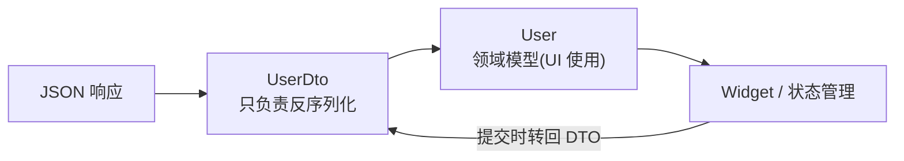
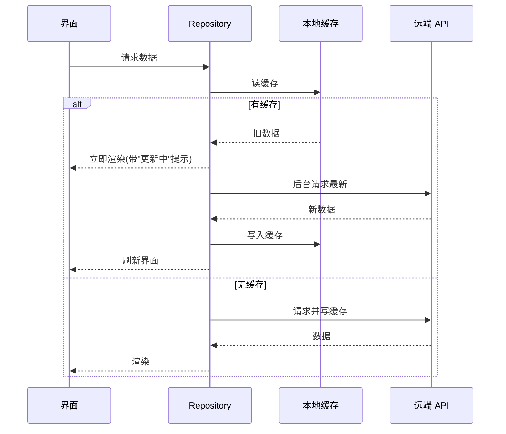

# 05 网络与数据持久化

> 前置知识：[[dart/1入门/09_异步编程|09 异步编程]]、[[dart/1入门/10_异常处理|10 异常处理]]、[[dart/2深入/04_元编程与代码生成|04 元编程与代码生成]]
> 本章目标：掌握 http 与 dio 两种网络方案，理解 JSON 序列化的两种做法与 DTO 分层，能在 shared_preferences、sqflite、drift、hive 中按场景选型，并实现「网络优先、缓存兜底」的离线可用架构。

## HTTP 与 REST 回顾

REST 把资源映射为 URL，用方法表达操作，用状态码表达结果：

| 方法 | 语义 | 幂等 | 典型用途 |
|------|------|:----:|----------|
| GET | 读取资源 | 是 | 列表、详情、搜索 |
| POST | 创建资源 | 否 | 下单、注册、发帖 |
| PUT / PATCH | 全量 / 局部更新 | 是 / 否 | 覆盖保存、改昵称 |
| DELETE | 删除资源 | 是 | 删除记录 |

| 状态码段 | 含义 | 客户端动作 |
|----------|------|------------|
| 2xx | 成功 | 解析响应体 |
| 3xx | 重定向 | 跟随 Location |
| 4xx | 客户端错误 | 401 去登录、404 显示空态、422 展示校验错误 |
| 5xx | 服务端错误 | 重试或提示稍后再试 |

## http 包：轻量首选

在 `pubspec.yaml` 添加 `http: ^1.2.0` 后：

```dart
import 'dart:convert';
import 'package:http/http.dart' as http;

Future<List<dynamic>> fetchPosts() async {
  final uri = Uri.parse('https://jsonplaceholder.typicode.com/posts');
  // timeout 必须设置，否则网络异常时会一直挂起
  final resp = await http.get(uri).timeout(const Duration(seconds: 10));
  if (resp.statusCode != 200) {
    throw Exception('请求失败：${resp.statusCode}');
  }
  // 用 utf8 解码，避免中文乱码
  return jsonDecode(utf8.decode(resp.bodyBytes)) as List<dynamic>;
}

// POST：提交 JSON 体
await http.post(uri,
    headers: {'Content-Type': 'application/json'},
    body: jsonEncode({'title': '标题', 'userId': 1}));
```

`http` 简单够用，但缺少拦截器、取消、上传进度等能力；中大型项目直接上 dio。

## dio 进阶

在 `pubspec.yaml` 添加 `dio: ^5.4.0` 后：

```dart
final dio = Dio(BaseOptions(
  baseUrl: 'https://api.example.com',
  connectTimeout: const Duration(seconds: 10),
  receiveTimeout: const Duration(seconds: 15),
));

// 拦截器：统一加 token、日志、错误转换
dio.interceptors.add(InterceptorsWrapper(
  onRequest: (options, handler) {
    options.headers['Authorization'] = 'Bearer $token';
    handler.next(options);
  },
  onError: (e, handler) {
    // 把 DioException 转成业务可读的错误文案
    final message = switch (e.type) {
      DioExceptionType.connectionTimeout => '连接超时',
      DioExceptionType.badResponse => '服务错误：${e.response?.statusCode}',
      _ => '网络异常，请稍后重试',
    };
    handler.reject(DioException(requestOptions: e.requestOptions, error: message));
  },
));

// 取消：用户输入新关键词时取消上一个请求
final cancelToken = CancelToken();
await dio.get('/search', queryParameters: {'q': 'flutter'}, cancelToken: cancelToken);
cancelToken.cancel('用户输入了新关键词');

// 上传文件
await dio.post('/upload', data: FormData.fromMap({
  'file': await MultipartFile.fromFile('/path/photo.jpg', filename: 'photo.jpg'),
}));

// 下载并显示进度
await dio.download('https://example.com/big.zip', '/path/big.zip',
    onReceiveProgress: (r, t) =>
        debugPrint('进度：${t > 0 ? (r / t * 100).toStringAsFixed(1) : 0}%'));
```

| 能力 | http | dio |
|------|------|-----|
| 拦截器 | 无（需自封装） | 内置 |
| 取消请求 | 无 | `CancelToken` |
| 上传/下载进度 | 无 | `onSendProgress` / `onReceiveProgress` |
| 超时配置 | 每次手动 `.timeout` | `BaseOptions` 全局 |
| 全局错误处理 | 无 | 拦截器统一处理 |

## JSON 序列化

### 手动 fromJson / toJson

```dart
class User {
  final int id;
  final String name;
  final String? email;
  const User({required this.id, required this.name, this.email});

  factory User.fromJson(Map<String, dynamic> json) =>
      User(id: json['id'] as int, name: json['name'] as String, email: json['email'] as String?);

  Map<String, dynamic> toJson() => {'id': id, 'name': name, 'email': email};
}

final user = User.fromJson(jsonDecode(resp.body) as Map<String, dynamic>);
```

### json_serializable 代码生成

添加 `json_annotation`、`json_serializable`、`build_runner` 三个依赖后：

```dart
import 'package:json_annotation/json_annotation.dart';

part 'user.g.dart'; // 生成文件，与源文件同目录

@JsonSerializable(fieldRename: FieldRename.snake) // user_name 自动映射 userName
class User {
  final int id;
  final String name;
  final String? email;
  const User({required this.id, required this.name, this.email});

  factory User.fromJson(Map<String, dynamic> json) => _$UserFromJson(json);
  Map<String, dynamic> toJson() => _$UserToJson(this);
}
```

```bash
dart run build_runner build --delete-conflicting-outputs  # 生成 .g.dart
dart run build_runner watch                                 # 开发时持续监听
```

手动版零依赖但字段一多容易漏改；代码生成版有类型检查、支持嵌套与自定义转换，是工程项目的默认选择。

## 模型层设计：DTO 与领域模型分离

后端返回的 JSON 结构（DTO）与 UI 使用的结构（领域模型）往往不同：DTO 字段名是下划线、有冗余字段；领域模型语义清晰、不可变。分层转换让「接口改字段」不会波及整个 UI：



```dart
// DTO：与后端字段一一对应
class UserDto {
  final String user_name;
  final int user_id;
  const UserDto({required this.user_name, required this.user_id});

  factory UserDto.fromJson(Map<String, dynamic> json) =>
      UserDto(user_name: json['user_name'] as String, user_id: json['user_id'] as int);
}

// 领域模型：UI 只认识它
class User {
  final int id;
  final String name;
  const User({required this.id, required this.name});

  factory User.fromDto(UserDto dto) => User(id: dto.user_id, name: dto.user_name);
}
```

小项目可以合并两者，但接口超过 10 个、字段频繁变动时，分层能显著降低维护成本。

## 错误处理与重试

网络错误分三类：**可重试**（超时、连接失败、5xx）、**需用户处理**（401 登录、422 校验）、**不可重试**（404）。重试用指数退避，避免雪崩：

```dart
Future<T> retry<T>(Future<T> Function() task, {int maxAttempts = 3}) async {
  var delay = const Duration(milliseconds: 500);
  for (var attempt = 1; attempt <= maxAttempts; attempt++) {
    try {
      return await task();
    } on DioException catch (e) {
      final retryable = e.type == DioExceptionType.connectionTimeout ||
          (e.response?.statusCode ?? 0) >= 500;
      if (!retryable || attempt == maxAttempts) rethrow;
      await Future.delayed(delay);
      delay *= 2; // 500ms → 1s → 2s
    }
  }
  throw StateError('unreachable');
}
```

## 本地持久化全景对比

| 方案 | 类型 | 适用数据 | 查询能力 | 学习成本 | 典型场景 |
|------|------|----------|----------|----------|----------|
| shared_preferences | 键值 | 设置项、开关 | 无 | 低 | 用户偏好 |
| flutter_secure_storage | 加密键值 | 密码、refresh token | 无 | 低 | 凭证 |
| sqflite | SQLite | 结构化数据、关系 | 完整 SQL | 中 | 离线业务表 |
| drift | 类型安全 ORM | 同 sqflite | 编译期校验 SQL | 中高 | 复杂本地库 |
| hive | NoSQL 对象库 | 简单对象、缓存 | 键/索引 | 低 | 轻量缓存 |
| isar | NoSQL 对象库 | 大量对象 | 索引、过滤、排序 | 中 | 高性能本地库 |
| 文件（path_provider + dart:io） | 任意字节 | 图片、导出、日志 | 无 | 低 | 大文件 |

```dart
// shared_preferences：几个字节的配置
final prefs = await SharedPreferences.getInstance();
await prefs.setBool('darkMode', true);
final darkMode = prefs.getBool('darkMode') ?? false;

// sqflite：结构化数据，注意 onUpgrade 迁移
final db = await openDatabase(join(await getDatabasesPath(), 'app.db'),
  version: 2,
  onCreate: (db, v) => db.execute('CREATE TABLE notes('
      'id INTEGER PRIMARY KEY AUTOINCREMENT, title TEXT NOT NULL, pinned INTEGER DEFAULT 0)'),
  onUpgrade: (db, oldV, newV) async {
    if (oldV < 2) {
      await db.execute('ALTER TABLE notes ADD COLUMN pinned INTEGER NOT NULL DEFAULT 0');
    }
  });
await db.insert('notes', {'title': '标题', 'pinned': 0});
final rows = await db.query('notes', where: 'pinned = ?', whereArgs: [1]);

// hive：轻量对象缓存；isar 用法类似但支持索引查询
final box = await Hive.openBox('settings');
await box.put('city', '杭州');
```

**drift** 在 sqflite 之上提供类型安全与编译期 SQL 校验：用 Dart 类定义表（`IntColumn get id => integer().autoIncrement()();`），`build_runner` 生成查询 API，写错字段名编译不过。适合「本地数据是核心资产」的应用（笔记、记账），代价是代码生成与学习曲线。

## 文件读写：path_provider + dart:io

```dart
import 'dart:io';
import 'package:path_provider/path_provider.dart';

Future<File> cacheFile(String name) async {
  // 应用私有目录，卸载时自动清理，无需存储权限
  final dir = await getApplicationDocumentsDirectory();
  return File('${dir.path}/$name');
}

Future<void> saveJson(String name, String content) =>
    (await cacheFile(name)).writeAsString(content); // 覆盖写入

Future<String?> readJson(String name) async {
  final file = await cacheFile(name);
  return file.existsSync() ? file.readAsString() : null;
}
```

常用目录：`getTemporaryDirectory()`（可被系统清理）、`getApplicationDocumentsDirectory()`（长期）、`getApplicationSupportDirectory()`（应用数据）。不要硬编码 `/sdcard` 路径。

## 缓存策略与离线优先

移动网络不稳定，「网络优先、缓存兜底」是标准做法；体验更好的是 **stale-while-revalidate（先显示缓存，再后台刷新）**：



数据流三层：**网络层只负责请求，缓存层负责读写与过期判断，UI 层只订阅状态**。缓存要带时间戳：

```dart
class CacheEntry {
  final String data;
  final DateTime savedAt;
  const CacheEntry(this.data, this.savedAt);

  bool get isExpired => DateTime.now().difference(savedAt) > const Duration(hours: 1);
}
```

## 安全存储：flutter_secure_storage

普通键值库是明文存储，凭证类数据必须用系统钥匙串：

```dart
const storage = FlutterSecureStorage();

await storage.write(key: 'refresh_token', value: token); // Android Keystore / iOS Keychain
final token = await storage.read(key: 'refresh_token');
await storage.delete(key: 'refresh_token');
```

## 完整示例：带缓存的城市天气列表

```dart
// lib/main.dart
import 'dart:convert';
import 'package:dio/dio.dart';
import 'package:flutter/material.dart';
import 'package:shared_preferences/shared_preferences.dart';

class WeatherRepository {
  final _dio = Dio(BaseOptions(
    baseUrl: 'https://api.example.com',
    connectTimeout: const Duration(seconds: 8),
  ));

  // 网络优先，失败时回退缓存；返回 (数据, 是否来自缓存)
  Future<(List<String>, bool)> fetchCities() async {
    final prefs = await SharedPreferences.getInstance();
    try {
      final resp = await _dio.get<List<dynamic>>('/cities');
      final list = resp.data!.map((e) => e.toString()).toList();
      await prefs.setString('cities_cache', jsonEncode(list)); // 写缓存
      return (list, false);
    } catch (e) {
      final raw = prefs.getString('cities_cache');
      if (raw != null) return ((jsonDecode(raw) as List).cast<String>(), true);
      rethrow; // 无缓存才把错误抛给 UI
    }
  }
}

void main() => runApp(MaterialApp(
      title: '城市天气',
      theme: ThemeData(useMaterial3: true, colorSchemeSeed: Colors.blue),
      home: const CityListPage(),
    ));

class CityListPage extends StatefulWidget {
  const CityListPage({super.key});

  @override
  State<CityListPage> createState() => _CityListPageState();
}

class _CityListPageState extends State<CityListPage> {
  final _repo = WeatherRepository();
  late Future<(List<String>, bool)> _future = _repo.fetchCities(); // 只发起一次

  void _reload() => setState(() => _future = _repo.fetchCities());

  @override
  Widget build(BuildContext context) {
    return Scaffold(
      appBar: AppBar(title: const Text('城市天气')),
      body: FutureBuilder<(List<String>, bool)>(
        future: _future,
        builder: (context, snapshot) {
          if (snapshot.connectionState == ConnectionState.waiting) {
            return const Center(child: CircularProgressIndicator());
          }
          if (snapshot.hasError) {
            return Center(
              child: FilledButton(onPressed: _reload, child: const Text('加载失败，点此重试')),
            );
          }
          final (cities, _) = snapshot.data!; // 第二个值表示是否来自缓存
          return ListView.builder(
            itemCount: cities.length,
            itemBuilder: (_, i) => ListTile(title: Text(cities[i])),
          );
        },
      ),
    );
  }
}
```

## 常见坑

1. **主线程解析大 JSON**：几 MB 的 JSON 用 `jsonDecode` 会卡帧，改用 `compute(jsonDecode, body)` 放到后台 isolate。
2. **忘记超时**：不设 timeout 的请求在网络异常时会长时间挂起，用户以为应用卡死；dio 在 `BaseOptions` 全局设置。
3. **数据库迁移缺失**：只改 `onCreate` 不改 `onUpgrade`，老用户升级后表结构不对直接崩溃；每次结构变更加一个版本分支。
4. **`context` 跨 async 使用**：请求返回后先判断 `mounted` / `context.mounted` 再操作 UI。
5. **缓存无过期策略 / 明文存 token**：永远显示旧数据比显示错误更糟，缓存必须带时间戳与失效规则；`shared_preferences` 是明文，凭证用 `flutter_secure_storage`。

## 本章小结

- REST 用方法表达操作、状态码表达结果；客户端按状态码分类处理
- http 轻量，dio 提供拦截器、取消、进度等工程能力，中大型项目首选 dio
- JSON 序列化可用手写或 json_serializable；DTO 与领域模型分离能隔离接口变化
- 持久化按数据形态选型：键值用 shared_preferences，结构化用 sqflite/drift，对象用 hive/isar，凭证用 secure storage
- 离线优先用「缓存兜底」，体验更好用 stale-while-revalidate；缓存必须有过期策略，重试要指数退避且只重试可重试错误

## 练习

1. 天气列表：把本章示例改为请求真实公开 API，展示城市与温度。验收标准：断网时显示上次缓存并提示「缓存数据」，联网后点重试能更新。
2. dio 封装：写一个 `ApiClient`，带 token 拦截器、统一错误文案、超时与日志。验收标准：401 时自动清理 token 并跳转登录页（可先打印代替跳转）。
3. 本地笔记：用 sqflite 实现笔记的增删改查，字段含标题、正文、更新时间。验收标准：重启应用后数据仍在；升级一次表结构（加「置顶」字段）且老数据不丢。
4. 安全存储：把登录 token 存入 flutter_secure_storage，并在启动时读取判断登录态。验收标准：杀进程重启后仍保持登录，退出登录后 token 被清除。

---

- 返回目录：[[dart/dart目录|Dart 教程目录]]
