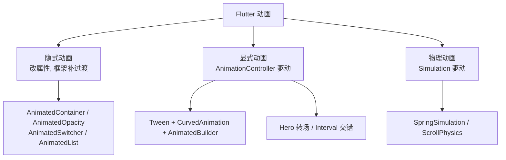

# 06 动画与自定义绘制

> 前置知识：[[dart/3框架/02_Widget与布局|02 Widget 与布局]]、[[dart/3框架/03_状态管理|03 状态管理]]
> 本章目标：建立 Flutter 动画体系的整体地图，掌握隐式动画、显式动画、交错动画与物理动画四类做法，能用 CustomPaint 与 Canvas API 绘制进度环等自定义图形，并懂得如何避免动画掉帧。

## 动画体系总览

Flutter 的动画按「谁驱动时间」分为三类，选择顺序建议：能用隐式就不用显式，能用显式就不用自定义绘制。



| 类型 | 驱动方式 | 代码量 | 控制力 | 典型场景 |
|------|----------|--------|--------|----------|
| 隐式 | 改目标值，框架自动补间 | 极少 | 弱 | 展开/收起、颜色渐变、显隐 |
| 显式 | `AnimationController` 手动控制 | 中 | 强 | 循环、暂停、进度、复杂序列 |
| 物理 | `Simulation` 按物理规律演化 | 中 | 强 | 惯性滚动、弹簧回弹 |
| 自绘 | `CustomPainter` 画布 | 多 | 最强 | 图表、进度环、波浪 |

与 Android 对比：隐式动画类似 `ViewPropertyAnimator`，显式动画类似 `ValueAnimator` + `AnimatorSet`，自绘对应 `Canvas` + `onDraw`。区别是 Flutter 把动画抽象成「值随时间变化的 `Animation<T>`」，UI 只是这个值的函数。

## 隐式动画：改属性即过渡

隐式动画组件内部持有 `AnimationController`，你只需在 `setState` 中修改目标值：

```dart
class ExpandCard extends StatefulWidget {
  const ExpandCard({super.key});

  @override
  State<ExpandCard> createState() => _ExpandCardState();
}

class _ExpandCardState extends State<ExpandCard> {
  bool _expanded = false;

  @override
  Widget build(BuildContext context) {
    return GestureDetector(
      onTap: () => setState(() => _expanded = !_expanded),
      child: AnimatedContainer(
        duration: const Duration(milliseconds: 300),
        curve: Curves.easeInOut, // 缓动曲线
        width: _expanded ? 300 : 160,
        height: _expanded ? 200 : 80,
        decoration: BoxDecoration(
          color: _expanded ? Colors.teal : Colors.grey,
          borderRadius: BorderRadius.circular(_expanded ? 24 : 8),
        ),
        child: Center(child: Text(_expanded ? '已展开' : '点击展开')),
      ),
    );
  }
}
```

常用隐式动画组件：

| 组件 | 动画属性 | 场景 |
|------|----------|------|
| `AnimatedContainer` | 尺寸、颜色、圆角、边距 | 卡片展开、按钮变形 |
| `AnimatedOpacity` | 透明度 | 淡入淡出 |
| `AnimatedSwitcher` | 子组件切换 | 数字变化、加载态切换 |
| `AnimatedPadding` | 内边距 | 键盘弹出避让 |
| `AnimatedAlign` | 对齐位置 | 位置移动 |
| `AnimatedList` | 列表增删 | 聊天消息、待办列表 |
| `TweenAnimationBuilder` | 任意值 | 数字滚动、自定义插值 |

`AnimatedSwitcher` 示例：子组件 key 变化时交叉淡化：

```dart
AnimatedSwitcher(
  duration: const Duration(milliseconds: 250),
  transitionBuilder: (child, animation) => FadeTransition(opacity: animation, child: child),
  child: Text('$count', key: ValueKey(count), style: const TextStyle(fontSize: 40)),
)
```

## 显式动画：AnimationController

需要循环、暂停、反向播放或驱动多个属性时，用 `AnimationController`：

```dart
class PulsingBox extends StatefulWidget {
  const PulsingBox({super.key});

  @override
  State<PulsingBox> createState() => _PulsingBoxState();
}

class _PulsingBoxState extends State<PulsingBox> with SingleTickerProviderStateMixin {
  late final AnimationController _controller;
  late final Animation<double> _scale;

  @override
  void initState() {
    super.initState();
    _controller = AnimationController(
      vsync: this, // 绑定 Ticker, 页面不可见时自动停止
      duration: const Duration(seconds: 2),
    )..repeat(reverse: true); // 循环往返

    // Tween 把 0-1 映射到 0.8-1.2，再叠加缓动曲线
    _scale = Tween(begin: 0.8, end: 1.2)
        .animate(CurvedAnimation(parent: _controller, curve: Curves.easeInOut));
  }

  @override
  void dispose() {
    _controller.dispose(); // 必须释放，否则内存泄漏
    super.dispose();
  }

  @override
  Widget build(BuildContext context) {
    return AnimatedBuilder(
      animation: _scale,
      builder: (context, child) => Transform.scale(scale: _scale.value, child: child),
      child: const FlutterLogo(size: 80), // 传入 child，动画帧不重建它
    );
  }
}
```

核心角色分工：

| 角色 | 职责 |
|------|------|
| `AnimationController` | 产出 0.0-1.0 的线性进度，控制播放/停止/反向 |
| `Tween<T>` | 把进度映射为具体类型（颜色、偏移、尺寸） |
| `CurvedAnimation` | 给进度加缓动曲线（`easeIn`、`elasticOut` 等） |
| `AnimatedBuilder` | 订阅动画值并重建局部 UI |
| `TickerProvider` | 提供帧回调，`SingleTickerProviderStateMixin` 对应一个 controller |

## Hero：共享元素转场

两个页面若有「同一个东西」，用 `Hero` 让它在跳转时平滑飞过去，`tag` 必须两页一致：

```dart
// 列表页
Hero(
  tag: 'cover-${item.id}',
  child: ClipRRect(
    borderRadius: BorderRadius.circular(8),
    child: Image.network(item.cover, width: 80, height: 80, fit: BoxFit.cover),
  ),
)

// 详情页：同一个 tag
Hero(
  tag: 'cover-${item.id}',
  child: Image.network(item.cover, fit: BoxFit.cover),
)
```

要点：`tag` 在同一个页面内不能重复；飞行过程中原页面与新页面的图片会被框架接管，网络图最好先缓存，避免飞行时闪烁。

## 交错动画：Interval

多个元素依次入场，用 `Interval` 把同一条时间线切成不同片段：

```dart
// 0.0-0.6 段落：标题滑入
final slide = Tween(begin: const Offset(0, 1), end: Offset.zero).animate(
  CurvedAnimation(
    parent: _controller,
    curve: const Interval(0.0, 0.6, curve: Curves.easeOut),
  ),
);

// 0.4-1.0 段落：正文淡入，与前一段重叠产生层次感
final fade = CurvedAnimation(
  parent: _controller,
  curve: const Interval(0.4, 1.0, curve: Curves.easeIn),
);

// 使用
SlideTransition(
  position: slide,
  child: FadeTransition(opacity: fade, child: const Text('交错入场')),
)
```

## 物理动画

物理动画不按固定时长，而是按物理规律演化到静止：

```dart
// 1. 滚动物理：不同平台有不同手感
ListView(physics: const BouncingScrollPhysics()) // iOS 弹性
ListView(physics: const ClampingScrollPhysics()) // Android 夹紧

// 2. 自定义弹簧：从 0 弹到 1
final simulation = SpringSimulation(
  const SpringDescription(mass: 1, stiffness: 120, damping: 12),
  0,   // 起始位置
  1,   // 目标位置
  0,   // 初速度
);
_controller.animateWith(simulation);
```

物理动画的价值在于「中断自然」：用户拖动到一半松手，动画从当前位置和当前速度继续演化，不会突兀跳变。

## 自定义绘制：CustomPaint 与 Canvas

`CustomPaint` 把一块画布交给 `CustomPainter`，用 Canvas API 绘制：

| API | 作用 |
|-----|------|
| `drawLine(p1, p2, paint)` | 画线 |
| `drawCircle(center, radius, paint)` | 画圆 |
| `drawRect(rect, paint)` | 画矩形 |
| `drawArc(rect, startAngle, sweepAngle, useCenter, paint)` | 画弧 |
| `drawPath(path, paint)` | 画路径 |
| `drawImage` / `drawParagraph` | 画图片 / 文本 |
| `Path..moveTo..lineTo..quadraticBezierTo..close()` | 构建复杂路径 |

`Paint` 的关键属性：`color`、`strokeWidth`、`style`（fill/stroke）、`strokeCap`（圆头）、`shader`（渐变）。坐标系原点在左上角，角度以弧度计、从 x 轴正方向顺时针增加。

### 完整示例：动画进度环

```dart
// lib/main.dart
import 'dart:math' as math;
import 'package:flutter/material.dart';

void main() => runApp(const RingApp());

class RingApp extends StatelessWidget {
  const RingApp({super.key});

  @override
  Widget build(BuildContext context) => MaterialApp(
        title: '进度环',
        theme: ThemeData(useMaterial3: true, colorSchemeSeed: Colors.indigo),
        home: const RingPage(),
      );
}

class RingPage extends StatefulWidget {
  const RingPage({super.key});

  @override
  State<RingPage> createState() => _RingPageState();
}

class _RingPageState extends State<RingPage> with SingleTickerProviderStateMixin {
  late final AnimationController _controller;
  late final Animation<double> _progress;

  @override
  void initState() {
    super.initState();
    _controller = AnimationController(
      vsync: this,
      duration: const Duration(milliseconds: 900),
    );
    // 0 → 0.75 的进度，用 easeOutCubic 让收尾更自然
    _progress = Tween(begin: 0.0, end: 0.75)
        .animate(CurvedAnimation(parent: _controller, curve: Curves.easeOutCubic));
  }

  @override
  void dispose() {
    _controller.dispose();
    super.dispose();
  }

  @override
  Widget build(BuildContext context) {
    return Scaffold(
      appBar: AppBar(title: const Text('动画进度环')),
      body: Center(
        child: AnimatedBuilder(
          animation: _progress,
          builder: (context, _) => CustomPaint(
            size: const Size(180, 180),
            painter: RingPainter(progress: _progress.value),
            child: SizedBox(
              width: 180,
              height: 180,
              child: Center(
                child: Text(
                  '${(_progress.value * 100).round()}%',
                  style: const TextStyle(fontSize: 28, fontWeight: FontWeight.bold),
                ),
              ),
            ),
          ),
        ),
      ),
      floatingActionButton: FloatingActionButton(
        onPressed: () => _controller.forward(from: 0), // 重新播放
        child: const Icon(Icons.replay),
      ),
    );
  }
}

class RingPainter extends CustomPainter {
  final double progress; // 0.0 - 1.0

  const RingPainter({required this.progress});

  @override
  void paint(Canvas canvas, Size size) {
    final center = size.center(Offset.zero);
    final radius = size.width / 2 - 12;

    // 背景圆环
    final bgPaint = Paint()
      ..style = PaintingStyle.stroke
      ..strokeWidth = 14
      ..color = Colors.grey.shade300;
    canvas.drawCircle(center, radius, bgPaint);

    // 前景圆弧：从正上方(-90 度)开始，扫过 progress 比例
    final fgPaint = Paint()
      ..style = PaintingStyle.stroke
      ..strokeWidth = 14
      ..strokeCap = StrokeCap.round // 圆头端点
      ..shader = const SweepGradient(
        colors: [Colors.indigo, Colors.teal],
      ).createShader(Rect.fromCircle(center: center, radius: radius));

    canvas.drawArc(
      Rect.fromCircle(center: center, radius: radius),
      -math.pi / 2,              // 起始角度：正上方
      2 * math.pi * progress,    // 扫过角度
      false,                     // 不连接圆心，只画弧线
      fgPaint,
    );
  }

  @override
  bool shouldRepaint(RingPainter oldDelegate) => oldDelegate.progress != progress;
}
```

关键点：`shouldRepaint` 返回 `false` 时框架跳过重绘，务必比较真正影响绘制的字段；`CustomPaint` 的 `child` 会绘制在画布之上，适合把文字叠在图形中央。

## 动画性能建议

1. **用 `RepaintBoundary` 隔离**：动画区域与静态区域之间加 `RepaintBoundary`，避免动画帧重绘整棵子树。
2. **缩小重建范围**：用 `AnimatedBuilder` 只包住需要动的 Widget；`AnimatedBuilder` 的 `child` 参数传不参与动画的子树。
3. **优先走合成动画**：`Transform`、`Opacity`、`SlideTransition` 只改变图层，不触发布局；避免在动画中改 `width/height`（会触发 relayout）。
4. **少用 `setState` 驱动动画**：`setState` 重建整个 State 的 `build`，用 `Animation` 值 + `AnimatedBuilder` 更精准。
5. **控制层数**：大量 `Opacity` 嵌套会产生离屏渲染，改用 `Color.withOpacity` 或 `FadeTransition`。
6. **用 DevTools 检查**：Flutter DevTools 的 Performance 面板可看帧耗时，红线即掉帧。

## Lottie 与 Rive 简介

- **Lottie**：播放 After Effects 导出的 JSON 动画，适合插画、空状态、加载动画。用 `lottie` 包，`Lottie.asset('assets/loading.json')`，可控制进度与循环。
- **Rive**：交互式矢量动画，支持状态机与运行时输入（点击、悬停），适合按钮反馈、角色动画。用 `rive` 包加载 `.riv` 文件。

选择：静态播放用 Lottie，需要「根据用户操作切换动画状态」用 Rive；二者都比逐帧图片省体积、可缩放。

## 常见坑

1. **忘记 dispose controller**：`AnimationController`、`TextEditingController` 不释放会造成内存泄漏与「setState after dispose」报错。
2. **`vsync` 用错**：一个 controller 用 `SingleTickerProviderStateMixin`，多个用 `TickerProviderStateMixin`；忘记加 mixin 编译不过。
3. **在动画监听里 `setState`**：每个动画帧都触发 `setState` 会重建整页，用 `AnimatedBuilder` 或 `ValueListenableBuilder`。
4. **隐式动画组件属性没变**：隐式动画只在「新旧值不同」时播放；同样的值不会触发。
5. **`shouldRepaint` 永远返回 true**：画布每帧重绘，白白消耗 GPU，要按字段比较。
6. **`AnimatedList` 忘记同步数据源**：增删时要同时改数据列表与调用 `insertItem/removeItem`，否则索引错位。
7. **Hero tag 冲突**：同一页面两个 Hero 使用相同 tag 会抛异常。

## 本章小结

- 动画分隐式、显式、物理三类；能用隐式就不写显式，能用显式就不自绘
- 隐式动画改属性即可；显式动画由 `AnimationController` + `Tween` + `CurvedAnimation` + `AnimatedBuilder` 组成
- `Hero` 做共享元素转场，`Interval` 做交错入场，`Simulation` 做物理回弹
- `CustomPaint` + `Canvas` 可绘制任意图形，`shouldRepaint` 决定是否重绘
- 动画性能的核心是缩小重绘范围与优先使用合成动画
- Lottie 适合播放设计稿动画，Rive 适合带状态机的交互动画

## 练习

1. 隐式动画卡片：实现点击展开/收起的卡片，要求同时改变宽高、圆角与背景色。验收标准：过渡平滑，连续快速点击不跳变。
2. 显式动画按钮：用 `AnimationController` 做一个「点赞」按钮，点击后心形放大再回弹并变色。验收标准：动画可重复触发，`dispose` 后无报错。
3. 自定义绘制：用 `CustomPainter` 画一个柱状图，数据变化时柱子高度带过渡动画。验收标准：坐标轴刻度正确，`shouldRepaint` 只在数据变化时返回 true。
4. 综合练习：实现一个「呼吸灯」加载动画：缩放 + 透明度同时变化，页面退出时动画停止且无内存泄漏。验收标准：连续进出页面 10 次，内存不持续增长。

---

- 返回目录：[[dart/dart目录|Dart 教程目录]]
