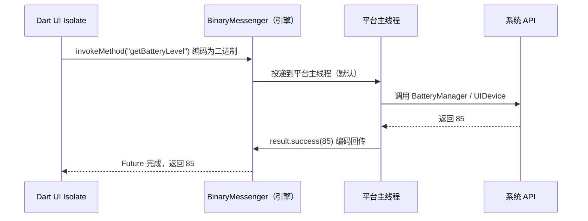

# 07 平台通道与原生集成

> 前置知识：[[dart/3框架/01_Flutter入门|01 Flutter 入门]]、[[dart/2深入/03_FFI与原生交互|03 FFI 与原生交互]]
> 本章目标：理解 Flutter 自绘引擎与原生系统之间的边界，掌握 MethodChannel、EventChannel、BasicMessageChannel 的用法与线程模型，能用 Kotlin/Swift 编写插件，了解 Pigeon、PlatformView、permission_handler，并能在 Flutter 中通过 dart:ffi 调用 C 库。

## 为什么需要平台通道

Flutter 不使用 Android 的 View 体系，也不用 iOS 的 UIKit 控件，它把 Dart 代码交给引擎里的 Dart 运行时执行，用 Skia/Impeller 直接把像素画到 Surface 上。UI 因此跨平台一致、性能可预期，但相机、蓝牙、GPS、电池、通知、第三方支付 SDK 这些能力只存在于原生 API 里。**平台通道（Platform Channel）** 就是 Dart 与原生之间的桥：Dart 把调用编码成二进制消息投递给平台侧，原生执行后再把结果编码回传。

| 维度 | 原生 Android/iOS | Flutter |
|------|------------------|---------|
| UI 渲染 | 系统控件，平台外观 | 引擎自绘，外观一致 |
| 系统 API | 直接调用，无中间层 | 经平台通道，一次编解码 |
| 线程模型 | 主线程 + 工作线程 | UI/Platform/Raster/IO 四类线程 |
| 语言 | Kotlin/Swift | Dart + 少量原生胶水代码 |
| 跨平台复用 | 各写一套 | UI 与业务全复用，原生层按平台各写一份 |

## 通道架构与线程模型

Dart 代码运行在 UI 线程（UI Isolate），原生代码运行在平台主线程（Android 的 main looper、iOS 的 main thread），消息通过引擎内部的 BinaryMessenger 传递：



关键点：

- 编码格式是二进制（`StandardMessageCodec`），不是 JSON 文本，效率高于字符串拼接
- **原生回调默认运行在平台主线程**，在 handler 里做耗时操作会阻塞 UI（Android 直接 ANR）
- 消息异步传递，Dart 侧得到 `Future`；原生侧必须且只能调用一次 `result`
- 同一通道的消息按发送顺序到达

## MethodChannel：请求-响应

MethodChannel 是最常用的通道：Dart 调方法名并传参，原生执行后返回结果或错误。

### Dart 侧

```dart
// lib/services/battery_service.dart
import 'package:flutter/services.dart';

/// 封装电池电量的平台调用，Dart 侧不关心 Android/iOS 的实现差异
class BatteryService {
  // 通道名必须与原生侧完全一致，建议用「包名/功能名」格式避免冲突
  static const MethodChannel _channel = MethodChannel('com.example.app/battery');

  /// 获取当前电量百分比；失败时抛出异常由调用方处理
  Future<int> getBatteryLevel() async {
    try {
      final int? level = await _channel.invokeMethod<int>('getBatteryLevel');
      if (level == null) throw StateError('原生返回了空电量');
      return level;
    } on PlatformException catch (e) {
      // 原生 result.error(...) 会在这里以 PlatformException 抛出
      throw StateError('读取电量失败: ${e.code} ${e.message}');
    } on MissingPluginException {
      // 原生侧没有注册该通道（常见于忘记重启应用）
      throw StateError('通道未实现，请检查原生代码是否注册');
    }
  }
}
```

### Android（Kotlin）

在 `android/app/src/main/kotlin/.../MainActivity.kt` 中注册：

```kotlin
package com.example.app

import android.content.Context
import android.os.BatteryManager
import io.flutter.embedding.android.FlutterActivity
import io.flutter.embedding.engine.FlutterEngine
import io.flutter.plugin.common.MethodChannel

class MainActivity : FlutterActivity() {
    private val channelName = "com.example.app/battery" // 与 Dart 侧完全一致

    override fun configureFlutterEngine(flutterEngine: FlutterEngine) {
        super.configureFlutterEngine(flutterEngine)
        MethodChannel(flutterEngine.dartExecutor.binaryMessenger, channelName)
            .setMethodCallHandler { call, result ->
                when (call.method) {
                    "getBatteryLevel" -> {
                        val level = getBatteryLevel()
                        if (level >= 0) result.success(level)                    // 正常返回
                        else result.error("UNAVAILABLE", "无法读取电池信息", null) // 错误返回
                    }
                    else -> result.notImplemented() // Dart 侧抛 MissingPluginException
                }
            }
    }

    private fun getBatteryLevel(): Int {
        val manager = getSystemService(Context.BATTERY_SERVICE) as BatteryManager
        return manager.getIntProperty(BatteryManager.BATTERY_PROPERTY_CAPACITY)
    }
}
```

### iOS（Swift）

在 `ios/Runner/AppDelegate.swift` 中注册：

```swift
import Flutter
import UIKit

@main
@objc class AppDelegate: FlutterAppDelegate {
  override func application(_ application: UIApplication,
      didFinishLaunchingWithOptions launchOptions: [UIApplication.LaunchOptionsKey: Any]?) -> Bool {
    let controller = window?.rootViewController as! FlutterViewController
    let channel = FlutterMethodChannel(name: "com.example.app/battery",
                                       binaryMessenger: controller.binaryMessenger)
    channel.setMethodCallHandler { call, result in
      guard call.method == "getBatteryLevel" else { return result(FlutterMethodNotImplemented) }
      UIDevice.current.isBatteryMonitoringEnabled = true
      let level = UIDevice.current.batteryLevel
      if level < 0 {
        result(FlutterError(code: "UNAVAILABLE", message: "无法读取电池信息", details: nil))
      } else {
        result(Int(level * 100)) // batteryLevel 是 0.0~1.0 的浮点
      }
    }
    GeneratedPluginRegistrant.register(with: self)
    return super.application(application, didFinishLaunchingWithOptions: launchOptions)
  }
}
```

三种通道的定位对比：

| 通道类型 | 通信方向 | 典型用途 | 是否流式 |
|----------|----------|----------|-----------|
| MethodChannel | Dart 调原生，原生返回一次 | 请求-响应（相机、文件、权限） | 否 |
| EventChannel | 原生持续推送事件到 Dart | 传感器、电量、下载进度 | 是（Stream） |
| BasicMessageChannel | 双向自由收发 | 自定义协议、高频小消息 | 是（消息对） |

## EventChannel：原生事件流

MethodChannel 一问一答；电量持续变化、传感器不断上报这类场景用 EventChannel——原生侧把事件写入 `EventSink`，Dart 侧得到一个 `Stream`。

```dart
// lib/services/battery_stream_service.dart
import 'package:flutter/services.dart';

class BatteryStreamService {
  static const EventChannel _channel =
      EventChannel('com.example.app/battery_stream');

  /// 广播流：多次监听不会重复订阅原生
  Stream<int> get batteryLevelStream =>
      _channel.receiveBroadcastStream().map((dynamic event) => event as int);
}
// 页面销毁时必须取消订阅：await sub.cancel();
```

Android 侧实现 `EventChannel.StreamHandler`：

```kotlin
package com.example.app

import android.content.*
import android.os.BatteryManager
import io.flutter.plugin.common.EventChannel

/// 监听系统电池广播，把变化推送给 Dart
class BatteryStreamHandler(private val context: Context) : EventChannel.StreamHandler {
    private var receiver: BroadcastReceiver? = null

    override fun onListen(arguments: Any?, events: EventChannel.EventSink) {
        receiver = object : BroadcastReceiver() {
            override fun onReceive(ctx: Context?, intent: Intent?) {
                val level = intent?.getIntExtra(BatteryManager.EXTRA_LEVEL, -1) ?: -1
                events.success(level) // 每次电量变化都会触发 Dart 侧 Stream
            }
        }
        context.registerReceiver(receiver, IntentFilter(Intent.ACTION_BATTERY_CHANGED))
    }

    override fun onCancel(arguments: Any?) {
        receiver?.let { context.unregisterReceiver(it) } // 必须注销，否则泄漏且耗电
        receiver = null
    }
}
// 在 MainActivity.configureFlutterEngine 中注册：
// EventChannel(flutterEngine.dartExecutor.binaryMessenger, "com.example.app/battery_stream")
//     .setStreamHandler(BatteryStreamHandler(applicationContext))
```

iOS 侧实现 `FlutterStreamHandler`，用 `NotificationCenter` 监听 `UIDevice.batteryLevelDidChangeNotification`，原理与 Android 广播一致。

## BasicMessageChannel 简介

BasicMessageChannel 不区分「方法」，双方可随时发送消息，编解码器可自定义（`JSONMessageCodec`、`StringCodec` 等），适合自定义二进制协议或高频双向小消息：

```dart
import 'package:flutter/services.dart';

final channel = BasicMessageChannel<String>('com.example.app/echo', StringCodec());

Future<void> demo() async {
  final reply = await channel.send('ping'); // 发送并等待一次回复
  print(reply);                             // 原生可返回 'pong'
  channel.setMessageHandler((message) async => 'ok'); // 原生也可主动发消息过来
}
```

## Pigeon：类型安全的通道生成

手写通道的痛点是方法名和参数靠字符串约定，拼错只在运行时暴露。Pigeon 用注解描述接口，生成 Dart/Kotlin/Swift 三端强类型代码，编译期即可发现不匹配。

```dart
// pigeons/battery_api.dart —— 只用来生成代码，不参与应用逻辑
import 'package:pigeon/pigeon.dart';

/// 原生返回的数据结构，自动生成三端模型类
class BatteryInfo {
  final int level;
  final bool charging;
  BatteryInfo({required this.level, required this.charging});
}

/// 声明由原生实现、Dart 调用的接口
@HostApi()
abstract class BatteryApi {
  int getBatteryLevel();
  BatteryInfo getBatteryInfo();
}
```

```bash
dart run pigeon --input pigeons/battery_api.dart --dart_out lib/pigeon/battery_api.g.dart
# 追加 --kotlin_out ... 与 --swift_out ... 生成原生侧代码
```

```dart
final api = BatteryApi();
final info = await api.getBatteryInfo(); // 强类型，IDE 可补全
print('${info.level}% 充电中: ${info.charging}');
```

| 对比项 | 手写 MethodChannel | Pigeon |
|--------|-------------------|--------|
| 参数类型 | 字符串 + 动态类型，运行时检查 | 生成强类型代码，编译期检查 |
| 三端一致性 | 靠人记忆，易错 | 由一份定义生成 |
| 自定义类传输 | 手写 Map 编解码 | 自动生成 |
| 灵活度 | 高，可动态调用 | 低，改接口需重新生成 |

## PlatformView：在 Flutter 中嵌入原生控件

必须复用原生控件（地图 SDK、WebView、原生播放器）时，用 PlatformView 把它嵌进 Flutter 树：

```dart
import 'package:flutter/foundation.dart';
import 'package:flutter/material.dart';

class NativeMapView extends StatelessWidget {
  const NativeMapView({super.key});
  static const String viewType = 'com.example.app/native_map';

  @override
  Widget build(BuildContext context) {
    // Android 用 AndroidView，iOS 用 UiKitView，viewType 与原生注册名一致
    if (defaultTargetPlatform == TargetPlatform.android) {
      return const AndroidView(viewType: viewType);
    }
    return const UiKitView(viewType: viewType);
  }
}
```

原生侧：Android 实现 `PlatformViewFactory`，在 `configureFlutterEngine` 中调用 `flutterEngine.platformViewsController.registry.registerViewFactory(viewType, factory)` 注册，`create`/`dispose` 管理原生 View 生命周期；iOS 实现 `FlutterPlatformViewFactory` 并注册到 registrar。

PlatformView 的代价：Android 上每个 View 需要额外的合成/纹理拷贝，大量使用会掉帧。能用 Flutter 重写的控件就别用 PlatformView。

## 插件项目结构与发布

可复用的通道代码应做成插件包：

```text
my_battery_plugin/
├── lib/my_battery_plugin.dart        # Dart API（对使用者友好）
├── android/src/main/kotlin/.../MyBatteryPlugin.kt  # Android 实现 FlutterPlugin
├── ios/Classes/MyBatteryPlugin.swift               # iOS 实现
├── example/lib/main.dart             # 示例应用，flutter run 调试插件
└── pubspec.yaml
```

```bash
flutter create --template=plugin --org com.example --platforms=android,ios my_battery_plugin
cd my_battery_plugin/example && flutter run   # 在 example 里调试，改 Dart 可热重载
cd .. && flutter test                          # 插件自身单元测试
flutter pub publish --dry-run && flutter pub publish  # 检查后发布到 pub.dev
```

Android 插件推荐实现 `FlutterPlugin` 接口而非把代码塞进应用 MainActivity：在 `onAttachedToEngine` 中创建 `MethodChannel` 并设置 handler，在 `onDetachedFromEngine` 中调用 `setMethodCallHandler(null)` 防止泄漏。这样插件可独立注册、独立测试。

## 权限请求：permission_handler

Android 6.0+ 与 iOS 都要求运行时权限，社区标准方案是 `permission_handler`：

```yaml
# pubspec.yaml
dependencies:
  permission_handler: ^11.3.0
```

```dart
import 'package:permission_handler/permission_handler.dart';

/// 请求相机权限，返回是否可用
Future<bool> ensureCameraPermission() async {
  var status = await Permission.camera.status;
  if (status.isGranted) return true;
  status = await Permission.camera.request(); // 首次或未永久拒绝时弹系统对话框
  if (status.isGranted) return true;
  if (status.isPermanentlyDenied) await openAppSettings(); // 引导用户去设置
  return false;
}
```

iOS 还必须在 `ios/Runner/Info.plist` 写用途描述，例如 `<key>NSCameraUsageDescription</key><string>用于扫描二维码登录</string>`，否则系统弹窗直接崩溃。

| 平台 | 声明位置 | 运行时请求 |
|------|----------|-----------|
| Android | `AndroidManifest.xml` 的 `<uses-permission>` | `Permission.camera.request()` |
| iOS | `Info.plist` 的 `NS*UsageDescription` | 同上（系统自动弹窗） |

## 在 Flutter 中使用 dart:ffi 调用 C 库

平台通道适合调用系统 API；已有 C/C++ 库（编解码、算法、加密）时用 `dart:ffi` 直接调用，省掉编解码开销。语法详见 [[dart/2深入/03_FFI与原生交互|03 FFI 与原生交互]]，这里只讲 Flutter 场景下的库打包。

```dart
import 'dart:ffi';
import 'dart:io' show Platform;

typedef _NativeAdd = Int32 Function(Int32 a, Int32 b);
typedef _DartAdd = int Function(int a, int b);

class NativeMath {
  late final _DartAdd _add =
      _openLibrary().lookupFunction<_NativeAdd, _DartAdd>('native_add');

  int add(int a, int b) => _add(a, b);

  DynamicLibrary _openLibrary() {
    if (Platform.isAndroid) {
      return DynamicLibrary.open('libnative_math.so'); // APK 内的 jniLibs
    }
    if (Platform.isIOS) {
      return DynamicLibrary.process(); // 静态链接进 Runner 后查找
    }
    if (Platform.isWindows) return DynamicLibrary.open('native_math.dll');
    return DynamicLibrary.open('libnative_math.so'); // Linux / macOS
  }
}
```

打包要点：

- Android：`.so` 放到 `android/app/src/main/jniLibs/<abi>/`，目录名必须是 `arm64-v8a`、`armeabi-v7a`、`x86_64` 之一，构建时自动打包
- iOS：C 源码加入 Xcode target 编译成静态库，随 Runner 一起链接
- 桌面：随应用目录分发 `.so`/`.dll`/`.dylib`；FFI 调用是同步的，耗时 C 函数应放到 `Isolate.run` 里执行

## 常见坑

1. **通道名不一致**：Dart 与原生字符串差一个字符就抛 `MissingPluginException`，建议通道名集中定义为常量，三端逐字核对。
2. **忘记注册 handler**：Android 在 `configureFlutterEngine`（插件在 `onAttachedToEngine`）注册，iOS 在 `AppDelegate` 注册；改完原生代码必须 `flutter run` 重新编译，**热重载不生效**。
3. **主线程阻塞**：Android 的 handler 默认跑在主线程，读大文件、查数据库会 ANR。耗时任务放后台线程，完成后 post 回主线程调用 `result`。
4. **result 调用次数错误**：不调用则 Dart 的 `Future` 永远不完成（页面卡 loading）；调用两次抛 `IllegalStateException`。每个分支保证恰好一次。
5. **Android/iOS 线程模型差异**：Android 默认主线程但可用 `TaskQueue` 切后台，iOS 强制主线程回调。跨平台插件不能假设线程，两端都显式把耗时任务放后台。
6. **EventChannel 不注销**：`onCancel` 里忘记 `unregisterReceiver`/`removeObserver` 会泄漏，页面反复进出后监听越积越多。
7. **PlatformView 性能与 FFI 缺 ABI**：列表里大量 PlatformView 会掉帧；只打包 `arm64-v8a` 时 x86 模拟器加载 `.so` 失败。iOS 权限描述缺失（无 `NSCameraUsageDescription`）会直接崩溃。

## 本章小结

- Flutter 自绘引擎与系统 API 之间靠平台通道通信，编解码走二进制消息，异步返回 Future
- MethodChannel 一问一答，EventChannel 持续推送，BasicMessageChannel 双向自由收发
- 原生 handler 默认在平台主线程执行，耗时任务必须移出主线程
- Pigeon 用一份定义生成三端强类型代码，消除字符串约定的运行时错误
- PlatformView 能嵌入原生控件但有性能代价，能重写就重写
- 插件是通道代码的复用单元，含 example 工程，可发布到 pub.dev
- 权限用 permission_handler 请求，iOS 必须在 Info.plist 声明用途
- dart:ffi 直接调用 C 库，Android 走 jniLibs，iOS 走静态链接

---

- 返回目录：[[dart/dart目录|Dart 教程目录]]

---

## 练习

1. **电池电量通道（验收：至少一端模拟器可运行）**
   在 Flutter 应用中实现 `getBatteryLevel`：Dart 侧封装 `BatteryService`，Kotlin 或 Swift 实现原生侧，界面放一个按钮，点击后显示当前电量百分比。要求错误分支显示中文提示而不是崩溃。

2. **EventChannel 实时电量（验收：电量变化时界面自动更新）**
   把上题改为 EventChannel 推送电量，Dart 侧用 `StreamBuilder` 显示，离开页面时正确取消订阅；原生侧在 `onCancel` 注销广播接收器，用日志验证页面销毁后不再回调。

3. **Pigeon 重构（验收：生成代码通过 `dart analyze`）**
   把第 1 题的接口改写为 Pigeon 定义（`getBatteryLevel` 与 `getBatteryInfo`），重新生成三端代码并替换手写实现，比较两种方式在改错方法名时的报错时机。

4. **FFI 小实验（验收：Android 模拟器或 Linux 桌面跑通）**
   写一个 C 函数 `int32_t native_add(int32_t, int32_t)`，编译为 `.so` 并按 ABI 放入 `jniLibs`（Linux 桌面可直接 `DynamicLibrary.open`），在 Flutter 中通过 dart:ffi 调用并显示结果；再用 `Isolate.run` 调用一个耗时 C 函数，验证 UI 不卡顿。
