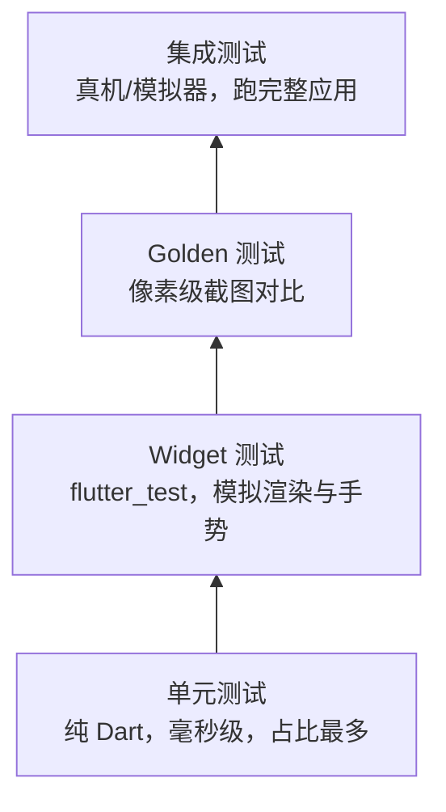

# 08 测试与发布

> 前置知识：[[dart/3框架/05_网络与数据持久化|05 网络与数据持久化]]、[[dart/2深入/05_测试与调试|05 测试与调试]]
> 本章目标：掌握 Flutter 的测试分层（单元、Widget、Golden、集成），会用 mocktail 隔离依赖；能配置 Android 签名、构建 APK/AAB 与 iOS IPA，完成图标启动屏定制，并了解 Google Play 与 App Store 的上架流程与常见驳回原因。

## 测试分层

Flutter 的测试按「运行环境」和「覆盖范围」分为四层。越往下执行越快、越多；越往上越接近真实用户、越少：



| 层级 | 运行命令 | 能否访问原生 | 典型用途 |
|------|----------|--------------|----------|
| 单元测试 | `flutter test test/xxx_test.dart` | 否 | 业务逻辑、DTO 解析、状态机 |
| Widget 测试 | 同上 | 否（插件需 mock） | 组件渲染、交互、表单校验 |
| Golden 测试 | 同上 | 否 | 视觉回归，防止 UI 意外变化 |
| 集成测试 | `flutter test integration_test -d 设备` | 是 | 端到端流程、真机性能 |

对比 C：单元测试相当于给每个函数写断言用例；Widget 测试相当于在无头环境里「点击」界面；集成测试才是真正的端到端验收。

## 单元测试

业务逻辑（价格计算、JSON 解析、状态转换）应尽量抽成纯 Dart 类，便于用 `package:test` 测试：

```dart
// lib/price_calculator.dart
class PriceCalculator {
  int discount(int total) => total >= 100 ? 20 : 0; // 满 100 减 20
}
```

```dart
// test/price_calculator_test.dart
import 'package:test/test.dart';
import 'package:my_app/price_calculator.dart';

void main() {
  group('PriceCalculator', () {
    test('满 100 减 20', () {
      expect(PriceCalculator().discount(120), 20);
    });

    test('不足门槛不打折', () {
      expect(PriceCalculator().discount(99), 0);
    });
  });
}
```

依赖外部服务时用 `mocktail` 打桩，避免真实网络请求：

```dart
// test/weather_repository_test.dart
import 'package:mocktail/mocktail.dart';
import 'package:test/test.dart';
import 'package:my_app/weather_repository.dart';

class MockWeatherApi extends Mock implements WeatherApi {}

void main() {
  test('缓存命中时不调用网络', () async {
    final api = MockWeatherApi();
    final repo = WeatherRepository(api, cache: FakeCache());

    await repo.getWeather('北京'); // 第一次会走网络
    await repo.getWeather('北京'); // 第二次应命中缓存

    verify(() => api.fetch('北京')).called(1); // 关键断言：只请求一次
  });
}
```

`verify` 是 mock 的核心价值：它验证「行为」而不只是「结果」。

## Widget 测试

Widget 测试在无头环境里构建组件树，可发手势、输文本、断言 UI。入口是 `testWidgets`，核心 API 是 `pumpWidget`、`find`、`expect`：

```dart
// lib/counter_page.dart
import 'package:flutter/material.dart';

class CounterPage extends StatefulWidget {
  const CounterPage({super.key});
  @override
  State<CounterPage> createState() => _CounterPageState();
}

class _CounterPageState extends State<CounterPage> {
  int count = 0;
  @override
  Widget build(BuildContext context) => Scaffold(
      body: Center(child: Text('$count')),
      floatingActionButton: FloatingActionButton(
          onPressed: () => setState(() => count++), child: const Icon(Icons.add)));
}
```

```dart
// test/counter_page_test.dart
import 'package:flutter/material.dart';
import 'package:flutter_test/flutter_test.dart';
import 'package:my_app/counter_page.dart';

void main() {
  testWidgets('点击按钮计数加一', (WidgetTester tester) async {
    await tester.pumpWidget(const MaterialApp(home: CounterPage()));

    expect(find.text('0'), findsOneWidget); // 初始状态
    await tester.tap(find.byIcon(Icons.add)); // 模拟点击
    await tester.pump(); // 触发一次重建

    expect(find.text('1'), findsOneWidget); // 断言新状态
  });

  testWidgets('文本输入与校验', (WidgetTester tester) async {
    await tester.pumpWidget(const MaterialApp(home: LoginPage()));

    await tester.enterText(find.byKey(const Key('email')), 'bad-email');
    await tester.tap(find.text('提交'));
    await tester.pump(); // 显示校验错误

    expect(find.text('邮箱格式不正确'), findsOneWidget);
  });
}
```

常用 Finder 与等待方式：

| API | 作用 |
|-----|------|
| `find.text('登录')` | 按文本查找 |
| `find.byIcon(Icons.add)` | 按图标查找 |
| `find.byKey(Key('email'))` | 按 Key 查找，最稳定 |
| `find.byType(TextField)` | 按类型查找 |
| `tester.pump()` | 触发一帧，处理 setState |
| `tester.pump(Duration)` | 推进动画时间 |
| `tester.pumpAndSettle()` | 等待所有动画/异步完成，谨慎用于无限动画 |

给关键控件加 `Key`（尤其是表单、列表项），测试就不会因为文案微调而失败。

## Golden 测试

Golden 测试把渲染结果与基准 PNG 对比，像素不同即失败，用于捕捉「改样式改坏了」的视觉回归：

```dart
// test/golden/primary_button_test.dart
import 'package:flutter/material.dart';
import 'package:flutter_test/flutter_test.dart';
import 'package:my_app/widgets/primary_button.dart';

void main() {
  testWidgets('PrimaryButton 外观', (WidgetTester tester) async {
    await tester.pumpWidget(const MaterialApp(
        home: Center(child: PrimaryButton(label: '提交'))));
    await expectLater(find.byType(PrimaryButton),
        matchesGoldenFile('goldens/primary_button.png'));
  });
}
```

```bash
flutter test --update-goldens   # 首次生成/确认变更后的基准图
flutter test                    # 之后每次运行做像素对比
```

CI 注意事项：不同平台/版本的字体渲染存在细微差异，Golden 测试应在固定环境（固定 Flutter 版本、固定容器的 Linux runner）运行，且只对核心组件做，不要全页面覆盖，否则维护成本极高。

## 集成测试

集成测试在真机或模拟器上启动完整应用，能访问真实插件、网络与原生能力。使用 `integration_test` 包：

```yaml
# pubspec.yaml
dev_dependencies:
  integration_test:
    sdk: flutter
```

```dart
// integration_test/login_flow_test.dart
import 'package:flutter_test/flutter_test.dart';
import 'package:integration_test/integration_test.dart';
import 'package:my_app/main.dart' as app;

void main() {
  IntegrationTestWidgetsFlutterBinding.ensureInitialized();
  testWidgets('登录完整流程', (WidgetTester tester) async {
    app.main(); // 启动真实应用
    await tester.pumpAndSettle();
    await tester.enterText(find.byKey(const Key('email')), 'test@example.com');
    await tester.enterText(find.byKey(const Key('password')), '12345678');
    await tester.tap(find.byKey(const Key('login_button')));
    await tester.pumpAndSettle();
    expect(find.text('欢迎回来'), findsOneWidget); // 断言登录后页面
  });
}
```

```bash
flutter test integration_test/login_flow_test.dart -d emulator-5554
flutter test integration_test -d chrome   # Web 端也可跑
```

CI 中没有真机时，可用 Android 模拟器 Action 或 Firebase Test Lab 运行；集成测试数量要少而关键，只覆盖「登录、下单、支付」这类主链路。

## 覆盖率与 CI

```bash
flutter test --coverage                  # 生成 coverage/lcov.info
lcov --remove coverage/lcov.info '**/*.g.dart' -o coverage/lcov.info
genhtml coverage/lcov.info -o coverage/html   # 生成 HTML 报告
```

CI 中把格式化、分析、测试串成流水线，任何一步失败都阻止合并：

```yaml
# .github/workflows/ci.yml
name: CI
on: [push, pull_request]
jobs:
  test:
    runs-on: ubuntu-latest
    steps:
      - uses: actions/checkout@v4
      - uses: subosito/flutter-action@v2
        with:
          channel: stable
          cache: true
      - run: flutter pub get
      - run: dart format --output=none --set-exit-if-changed .
      - run: flutter analyze
      - run: flutter test --coverage
```

覆盖率不是目标，但「核心业务逻辑覆盖率低于 60%」通常是危险信号。生成代码（`*.g.dart`、`*.freezed.dart`）应从统计中排除。

## Android 打包

### 签名配置

Android 发布包必须用固定私钥签名，否则无法覆盖安装更新。先生成 keystore：

```bash
keytool -genkey -v -keystore ~/upload-keystore.jks -keyalg RSA -keysize 2048 -validity 10000 -alias upload
```

在 `android/key.properties` 中保存口令（**不要提交到 Git**）：

```properties
storePassword=你的口令
keyPassword=你的口令
keyAlias=upload
storeFile=/home/you/upload-keystore.jks
```

`android/app/build.gradle.kts` 中读取并配置 release 签名：

```kotlin
import java.util.Properties
import java.io.FileInputStream

val keystoreProperties = Properties()
val keystorePropertiesFile = rootProject.file("key.properties")
if (keystorePropertiesFile.exists()) {
    keystoreProperties.load(FileInputStream(keystorePropertiesFile))
}
android {
    signingConfigs {
        create("release") {
            keyAlias = keystoreProperties["keyAlias"] as String
            keyPassword = keystoreProperties["keyPassword"] as String
            storeFile = file(keystoreProperties["storeFile"] as String)
            storePassword = keystoreProperties["storePassword"] as String
        }
    }
    buildTypes {
        release {
            signingConfig = signingConfigs.getByName("release")
            isMinifyEnabled = true      // 开启 R8 混淆与裁剪
            isShrinkResources = true    // 删除未引用资源
            proguardFiles(
                getDefaultProguardFile("proguard-android-optimize.txt"),
                "proguard-rules.pro",
            )
        }
    }
}
```

### APK 与 AAB

| 格式 | 用途 | 特点 |
|------|------|------|
| APK | 直接分发、侧载、国内商店 | 单文件，体积大 |
| AAB | Google Play 上传格式 | 商店按设备拆分下发，体积小约 15%-30% |
| split APK | `--split-per-abi` | 按 CPU 架构拆分，适合国内分发 |

```bash
# 版本号在 pubspec.yaml：version: 1.2.3+45（1.2.3 为 versionName，45 为 versionCode）
flutter build apk --release --split-per-abi
flutter build appbundle --release

# 验证签名与版本
keytool -printcert -jarfile build/app/outputs/flutter-apk/app-arm64-v8a-release.apk
```

混淆注意：反射用到的类（部分 JSON 模型、插件入口）需要 keep 规则写入 `proguard-rules.pro`，否则 release 包运行时才崩。

## iOS 打包

iOS 的签名体系比 Android 严格，需要 Apple Developer 账号（个人 99 美元/年）：

1. 在 Apple Developer 后台创建 App ID、发布证书（Distribution Certificate）与描述文件（Provisioning Profile）
2. 在 Xcode 的 Signing & Capabilities 中选择 Team 与自动管理签名，设置 `ios/Runner/Info.plist` 的版本号与权限描述
3. 构建与上传：

```bash
flutter build ipa --release                # 产物在 build/ios/ipa/*.ipa
xcrun altool --upload-app -f build/ios/ipa/*.ipa -t ios -u 你的AppleID -p 应用专用密码
```

上传后在 App Store Connect 的 TestFlight 中邀请测试，验证无误再提交审核。证书与描述文件都可在 CI 中以 base64 形式存储并导入。

## Flutter Web 与桌面构建

```bash
flutter build web --release          # 产物 build/web，可部署到任意静态服务器
flutter build web --wasm             # 实验性 Wasm 构建，性能更好
flutter build linux --release        # 桌面三平台同理：windows / macos
```

Web 产物是静态文件，注意服务器要正确设置 `.wasm`、`.json` 的 MIME 类型；桌面产物是原生可执行文件，需按平台分发安装包（Windows 常用 Inno Setup，macOS 需公证）。

## 应用图标与启动屏

手写各平台尺寸图标既繁琐又易错，用社区工具生成：

```yaml
# pubspec.yaml
dev_dependencies:
  flutter_launcher_icons: ^0.13.1
  flutter_native_splash: ^2.4.0

flutter_launcher_icons:
  android: true
  ios: true
  image_path: "assets/icon/app_icon.png"   # 1024x1024 PNG
  adaptive_icon_background: "#FFFFFF"
  adaptive_icon_foreground: "assets/icon/foreground.png"

flutter_native_splash:
  color: "#FFFFFF"
  image: "assets/icon/splash.png"
  android_12: { image: "assets/icon/splash_android12.png", color: "#FFFFFF" }
```

```bash
dart run flutter_launcher_icons
dart run flutter_native_splash:create
```

## 上架流程概览

| 项目 | Google Play | App Store |
|------|-------------|-----------|
| 上传格式 | AAB | IPA（Xcode Archive / Transporter） |
| 审核时长 | 数小时到数天 | 1-3 天，首次更久 |
| 隐私要求 | 数据安全表单、隐私政策 | 隐私清单、ATT 追踪授权 |
| 常见驳回 | target API 过低、权限滥用 | 功能不完整、支付绕开 IAP、权限描述含糊 |
| 国内补充 | 各厂商商店需软著与备案 | 需要大陆区上架资质 |

审核要点：所有权限都要有实际使用场景；账号类应用要提供测试账号；涉及虚拟支付必须走平台内购；崩溃率高的版本会被拒。

## 常见坑

1. **keystore 丢失**：Android 应用一旦发布，后续更新必须用同一签名。keystore 与口令要备份到密码管理器；丢失后 Google Play 只能走签名重置流程，非常麻烦。
2. **用 debug 签名发布**：`flutter build apk` 默认 release 但若未配置签名会报错或使用 debug key，商店直接拒绝。
3. **versionCode 不递增**：`pubspec.yaml` 的 `+45` 每次上传必须比上一版大，否则商店拒绝。
4. **包体积失控**：未压缩图片、内置大字体、未开启 `shrinkResources` 都会让包变大；优先用 WebP、`--split-per-abi`、AAB。
5. **混淆裁掉反射类**：R8 把 JSON 反序列化用到的类删掉，debug 正常、release 崩溃。补 keep 规则并用 release 包做回归测试。
6. **iOS 权限描述缺失或含糊**：`Info.plist` 未声明 `NSCameraUsageDescription` 会崩溃；描述写「需要相机权限」会被审核驳回，要写具体用途。
7. **Golden 测试跨平台失败**：不同系统字体渲染不同，必须在固定 CI 容器生成与校验基准图。
8. **CI 里跑集成测试**：默认 runner 没有设备，集成测试会失败；应单独 job 并启动模拟器，或改用 Firebase Test Lab。

## 本章小结

- 测试分四层：单元最快最多，Widget 覆盖交互，Golden 管视觉回归，集成测试只保主链路
- 单元测试用 `package:test` + mocktail 验证行为；Widget 测试用 `WidgetTester` 的 pump/tap/enterText/find/expect
- Golden 基准图必须在固定环境生成；集成测试用 `integration_test` 在真机运行
- Android 发布用固定 keystore 签名，Google Play 上传 AAB，国内可发 split APK，开启 R8 混淆与资源裁剪
- iOS 需要证书、描述文件与 App Store Connect，TestFlight 先内测再提交审核
- 图标与启动屏用 flutter_launcher_icons / flutter_native_splash 一次生成
- 上架前检查权限用途、隐私政策、测试账号与版本号递增

---

- 返回目录：[[dart/dart目录|Dart 教程目录]]

---

## 练习

1. **签名与 release 构建（验收：APK 显示正式签名与版本号）**
   生成 keystore 并配置 `key.properties` 与 `build.gradle.kts`，执行 `flutter build apk --release --split-per-abi`；用 `keytool -printcert -jarfile` 验证签名者不是 Android Debug，用 `aapt dump badging` 验证 versionName/versionCode 与 `pubspec.yaml` 一致。

2. **Widget 测试（验收：`flutter test` 全绿且覆盖三种交互）**
   为一个搜索页写测试：输入关键词后点击搜索按钮，断言结果列表出现；输入空关键词时断言显示校验提示；点击结果项断言跳转到详情页（可用 `find.byType` 验证）。要求用 `Key` 定位而不是文本。

3. **CI 流水线（验收：GitHub 上 PR 出现绿色 check）**
   配置 `.github/workflows/ci.yml`，依次执行 format 检查、`flutter analyze`、`flutter test --coverage`，故意提交一个格式错误的分支验证流水线能拦截。

4. **图标与启动屏（验收：真机或模拟器安装后可见自定义图标与启动画面）**
   准备 1024x1024 图标与启动图，配置 flutter_launcher_icons 与 flutter_native_splash，重新构建安装，检查 Android 自适应图标与 iOS 各尺寸图标是否都替换成功。
