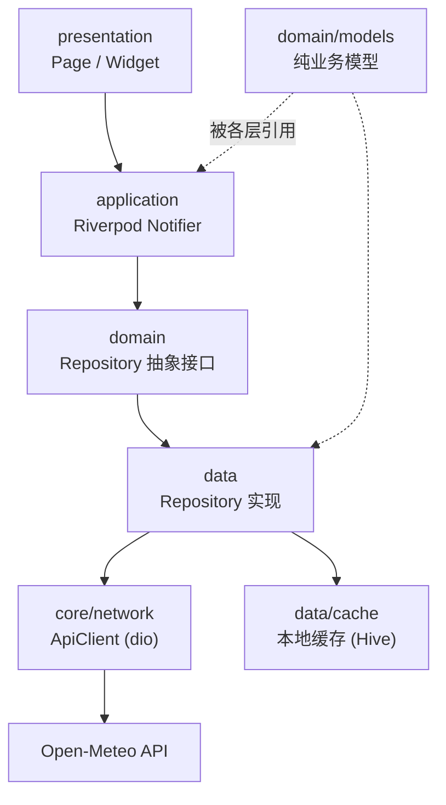

# 09 Flutter 实战项目

> 前置知识：[[dart/3框架/03_状态管理|03 状态管理]]、[[dart/3框架/04_路由与导航|04 路由与导航]]、[[dart/3框架/05_网络与数据持久化|05 网络与持久化]]
> 本章目标：从零到一完成一个离线优先的城市天气应用，覆盖需求分析、技术选型、分层架构、数据层、状态层、UI 层、路由、主题、错误处理、测试与发布。学完后你应能按同样的骨架搭建任何 CRUD 类应用。

## 项目选型与需求分析

选「城市天气」作为实战项目，原因有三个：接口免费稳定（Open-Meteo 无需 API Key）、数据模型适中（当前天气 + 逐小时预报）、天然适合演示离线优先（断网时展示缓存并标注数据时间）。

| 编号 | 功能 | 验收要点 |
|:----:|------|----------|
| F1 | 城市搜索与添加 | 支持中英文关键词，结果去重 |
| F2 | 当前天气展示 | 温度、天气状况、体感、风速 |
| F3 | 多城市切换 | 记住上次选择，重启后恢复 |
| F4 | 离线缓存 | 断网时展示缓存并显示「更新于 xx:xx」 |
| F5 | 下拉刷新 | 强制拉取最新数据，失败保留旧数据 |
| F6 | 深色模式 | 跟随系统 / 手动切换，持久化 |
| F7 | 错误与重试 | 网络错误有明确中文提示与重试按钮 |

与原生开发对照：UI 层对应 Activity/Compose，状态层对应 ViewModel/StateFlow，数据层对应 Repository + Retrofit/Room，路由对应 Navigation Component，依赖注入由 Riverpod Provider 取代 Hilt/Koin。

## 技术选型

| 库 | 版本示例 | 选它的理由 |
|----|----------|-----------|
| flutter_riverpod | ^2.5.0 | 编译期安全、可测试、无需 BuildContext |
| go_router | ^14.0.0 | 声明式路由，官方维护，支持深链 |
| dio | ^5.4.0 | 拦截器、超时、取消、日志齐全 |
| hive_flutter | ^1.1.0 | 轻量键值缓存，无需 SQL |
| freezed + json_serializable | ^2.5.0 | DTO 不可变 + 自动 JSON 转换 |

本项目状态不复杂，Riverpod 的 `AsyncValue` 已覆盖三态，不需要引入 Bloc；也不选全局单例式方案，避免隐式依赖影响测试。

## 分层架构



规则：presentation 只依赖 application 与 domain，不直接碰 dio/Hive；application 负责编排（调 Repository、管理 AsyncValue）；domain 是纯 Dart，可脱离 Flutter 测试；data 实现接口（网络、JSON、缓存、错误归一化）。依赖方向永远向内，换实现不影响 UI。

## 项目目录结构

```text
lib/
├── main.dart / app.dart             # 入口与 MaterialApp.router
├── core/network/api_client.dart     # dio 封装
├── core/error/app_exception.dart    # 统一异常类型
├── domain/models/weather.dart       # 业务模型（纯 Dart）
├── domain/repositories/weather_repository.dart   # 抽象接口
├── data/dto/weather_dto.dart        # JSON 映射（freezed）
├── data/cache/weather_cache.dart    # Hive 缓存
├── data/repositories/weather_repository_impl.dart
├── features/weather/...             # notifier 与天气页
├── features/search/... / settings/...  # 搜索页与设置页
└── routing/app_router.dart
```

## 数据层实现

### 网络客户端与 DTO

```dart
// lib/core/network/api_client.dart
import 'package:dio/dio.dart';

class ApiClient {
  final Dio _dio;
  ApiClient({Dio? dio})
      : _dio = dio ??
            Dio(BaseOptions(
                baseUrl: 'https://api.open-meteo.com/v1',
                connectTimeout: const Duration(seconds: 8),
                receiveTimeout: const Duration(seconds: 8)));

  /// 统一 GET；非 2xx 由 dio 抛 DioException，上层归一化
  Future<Map<String, dynamic>> get(String path,
      {Map<String, dynamic>? query}) async {
    final res = await _dio.get<Map<String, dynamic>>(path, queryParameters: query);
    return res.data ?? <String, dynamic>{};
  }
}
```

DTO 贴合接口字段，业务模型贴合 UI，转换集中在一处，接口改字段时只改 DTO：

```dart
// lib/data/dto/weather_dto.dart
import 'package:freezed_annotation/freezed_annotation.dart';

part 'weather_dto.freezed.dart';
part 'weather_dto.g.dart';

@freezed
class WeatherDto with _$WeatherDto {
  const factory WeatherDto({
    @JsonKey(name: 'current_weather') required CurrentWeatherDto current,
    @JsonKey(name: 'hourly') required Map<String, dynamic> hourly, // 逐小时字段较多，按需建模
  }) = _WeatherDto;
  factory WeatherDto.fromJson(Map<String, dynamic> json) => _$WeatherDtoFromJson(json);
}

@freezed
class CurrentWeatherDto with _$CurrentWeatherDto {
  const factory CurrentWeatherDto({required double temperature, required double windspeed,
    @JsonKey(name: 'weathercode') required int weatherCode}) = _CurrentWeatherDto;
  factory CurrentWeatherDto.fromJson(Map<String, dynamic> json) => _$CurrentWeatherDtoFromJson(json);
}
```

### 缓存与 Repository

```dart
// lib/data/cache/weather_cache.dart
import 'dart:convert';
import 'package:hive_flutter/hive_flutter.dart';

class WeatherCache {
  static const _boxName = 'weather_cache';
  static const _ttl = Duration(minutes: 30);
  Future<Box<String>> get _box => Hive.openBox<String>(_boxName);
  Future<void> write(String city, Map<String, dynamic> json) async {
    final box = await _box;
    await box.put(city, jsonEncode(
        {'savedAt': DateTime.now().toUtc().toIso8601String(), 'payload': json}));
  }

  Future<Map<String, dynamic>?> read(String city) async {
    final raw = (await _box).get(city);
    return raw == null ? null : jsonDecode(raw) as Map<String, dynamic>;
  }

  bool isExpired(Map<String, dynamic> entry) =>
      DateTime.now().toUtc().difference(
          DateTime.parse(entry['savedAt'] as String)) > _ttl;
}
```

```dart
// lib/domain/repositories/weather_repository.dart
abstract class WeatherRepository {
  Future<Weather> getWeather(String city);
}

// lib/data/repositories/weather_repository_impl.dart
class WeatherRepositoryImpl implements WeatherRepository {
  final ApiClient api;
  final WeatherCache cache;
  WeatherRepositoryImpl(this.api, this.cache);

  @override
  Future<Weather> getWeather(String city) async {
    final entry = await cache.read(city);
    if (entry != null && !cache.isExpired(entry)) {
      return _parse(entry, fromCache: true); // 1. 缓存新鲜，直接返回
    }
    try {
      final json = await api.get('/forecast', query: {
        'latitude': 39.9, 'longitude': 116.4, 'current_weather': true,
        'hourly': 'temperature_2m', 'timezone': 'auto',
      });
      await cache.write(city, json);
      return _parse(json, fromCache: false); // 2. 网络成功并写缓存
    } catch (_) {
      if (entry != null) return _parse(entry, fromCache: true); // 3. 离线降级
      rethrow;
    }
  }

  Weather _parse(Map<String, dynamic> entry, {required bool fromCache}) {
    final payload = fromCache ? entry['payload'] as Map<String, dynamic> : entry;
    return Weather.fromDto(WeatherDto.fromJson(payload), fromCache: fromCache);
  }
}
```

## 状态层实现

```dart
// lib/features/weather/application/weather_notifier.dart
import 'package:flutter_riverpod/flutter_riverpod.dart';

// 依赖通过 Provider 注入，测试时可整体替换
final apiClientProvider = Provider((ref) => ApiClient());
final weatherCacheProvider = Provider((ref) => WeatherCache());
final weatherRepositoryProvider = Provider<WeatherRepository>((ref) =>
    WeatherRepositoryImpl(ref.watch(apiClientProvider), ref.watch(weatherCacheProvider)));
final selectedCityProvider = StateProvider<String>((ref) => '北京');

// 天气数据：AsyncValue 自动表达加载/错误/数据三态
final weatherProvider =
    AsyncNotifierProvider<WeatherNotifier, Weather>(WeatherNotifier.new);

class WeatherNotifier extends AsyncNotifier<Weather> {
  @override
  Future<Weather> build() {
    final city = ref.watch(selectedCityProvider);
    return ref.read(weatherRepositoryProvider).getWeather(city);
  }

  /// 下拉刷新：失败时保留旧数据，只提示错误
  Future<void> refresh() async {
    final previous = state.valueOrNull;
    state = const AsyncLoading();
    state = await AsyncValue.guard(() => ref
        .read(weatherRepositoryProvider)
        .getWeather(ref.read(selectedCityProvider)));
    if (state.hasError && previous != null) {
      state = AsyncData(previous); // 降级：界面仍显示旧数据
    }
  }
}
```

## UI 层实现

主页面用 `async.when` 一次处理三态：

```dart
// lib/features/weather/presentation/weather_page.dart
import 'package:flutter/material.dart';
import 'package:flutter_riverpod/flutter_riverpod.dart';
import 'package:go_router/go_router.dart';

class WeatherPage extends ConsumerWidget {
  const WeatherPage({super.key});

  @override
  Widget build(BuildContext context, WidgetRef ref) {
    final asyncWeather = ref.watch(weatherProvider);
    return Scaffold(
      appBar: AppBar(
        title: Text(ref.watch(selectedCityProvider)),
        actions: [
          IconButton(
            icon: const Icon(Icons.search),
            onPressed: () => context.push('/search'),
          ),
        ],
      ),
      body: RefreshIndicator(
        onRefresh: () => ref.read(weatherProvider.notifier).refresh(),
        child: asyncWeather.when(
          loading: () => const Center(child: CircularProgressIndicator()),
          error: (e, _) => ErrorView(message: '加载失败：$e',
              onRetry: () => ref.invalidate(weatherProvider)),
          data: (weather) => WeatherContent(weather: weather),
        ),
      ),
    );
  }
}

class WeatherContent extends StatelessWidget {
  final Weather weather;
  const WeatherContent({super.key, required this.weather});

  @override
  Widget build(BuildContext context) => ListView(
        padding: const EdgeInsets.all(16),
        children: [
          if (weather.fromCache) const Card(child: ListTile(title: Text('离线数据，联网后自动更新'))),
          Text('${weather.temperature.toStringAsFixed(1)}°C',
              style: Theme.of(context).textTheme.displayMedium),
          Text(weather.description),
        ],
      );
}
```

搜索页选中城市后直接修改 `selectedCityProvider`，`weatherProvider` 会自动重建；城市列表与上次选择用 Hive 持久化。

## 路由、深链与主题
```dart
// lib/routing/app_router.dart
final appRouter = GoRouter(
  initialLocation: '/',
  routes: [
    GoRoute(path: '/', builder: (context, state) => const WeatherPage()),
    GoRoute(path: '/search', builder: (context, state) => const SearchPage()),
    GoRoute(path: '/settings', builder: (context, state) => const SettingsPage()),
    GoRoute(
      path: '/city/:id',
      builder: (context, state) =>
          WeatherPage(key: ValueKey(state.pathParameters['id'])),
    ),
  ],
);
```

```dart
// lib/app.dart
final themeModeProvider = StateProvider<ThemeMode>((ref) => ThemeMode.system);

class WeatherApp extends ConsumerWidget {
  const WeatherApp({super.key});

  @override
  Widget build(BuildContext context, WidgetRef ref) => MaterialApp.router(
        title: '城市天气',
        theme: ThemeData(colorSchemeSeed: Colors.blue, brightness: Brightness.light),
        darkTheme: ThemeData(colorSchemeSeed: Colors.blue, brightness: Brightness.dark),
        themeMode: ref.watch(themeModeProvider),
        routerConfig: appRouter,
      );
}
```

## 错误处理与加载态

```dart
// lib/core/error/app_exception.dart
import 'package:dio/dio.dart';

class AppException implements Exception {
  final String message;
  AppException(this.message);
  factory AppException.fromDio(DioException e) => switch (e.type) {
        DioExceptionType.connectionTimeout ||
        DioExceptionType.receiveTimeout => AppException('网络超时，请检查网络后重试'),
        DioExceptionType.connectionError => AppException('无法连接服务器'),
        _ => AppException('服务暂时不可用（${e.response?.statusCode ?? '未知'}）'),
      };
  @override
  String toString() => message;
}
```

加载态优先用骨架屏；下拉刷新失败保留旧数据并用 `SnackBar` 提示；错误文案中文化，不把 `DioException` 原文给用户。

## 测试

单元测试覆盖 Repository 的缓存分支，Widget 测试用 `ProviderScope.overrides` 注入假数据、不碰网络：

```dart
// test/weather_repository_test.dart
import 'package:flutter_test/flutter_test.dart';
import 'package:mocktail/mocktail.dart';

class MockApiClient extends Mock implements ApiClient {}
class MockWeatherCache extends Mock implements WeatherCache {}

void main() {
  test('缓存新鲜时不请求网络', () async {
    final api = MockApiClient();
    final cache = MockWeatherCache();
    when(() => cache.read('北京')).thenAnswer((_) async =>
        {'savedAt': DateTime.now().toUtc().toIso8601String(), 'payload': fakePayload});
    when(() => cache.isExpired(any())).thenReturn(false);
    await WeatherRepositoryImpl(api, cache).getWeather('北京');
    verifyNever(() => api.get(any(), query: any(named: 'query')));
  });
}
```

```dart
// test/weather_page_test.dart
await tester.pumpWidget(ProviderScope(
  overrides: [weatherProvider.overrideWith(() => FakeWeatherNotifier(fakeWeather))],
  child: const MaterialApp(home: WeatherPage())));
expect(find.text('24.5°C'), findsOneWidget);
```

## CI 与发布、迭代计划

CI 沿用 [[dart/3框架/08_测试与发布|08 测试与发布]] 的流水线：format、analyze、test、build。发布前递增 `version`，Android 走 AAB，iOS 走 TestFlight。

| 周次 | 目标 | 交付物 |
|:----:|------|--------|
| 第 1 周 | 项目骨架、dio + DTO、缓存、Repository | 能打印北京天气的调试页面 |
| 第 2 周 | Riverpod 状态、列表/详情/搜索/设置、路由 | 可完整操作的应用 |
| 第 3 周 | 主题暗黑、错误态、测试、打包 | 可安装的 release 包 |

## 常见坑

1. **在 UI 里直接调 dio**：接口变化要改多处且无法测试。所有网络访问必须经过 Repository。
2. **DTO 直接进 UI**：接口字段名泄漏到界面，接口一改全崩。坚持 DTO → 业务模型转换。
3. **`ref.watch` 与 `AsyncValue` 处理不全**：事件方法里用 `ref.read`；`when` 的 loading/error/data 三个分支必须都处理，否则白屏。
4. **时区错误**：接口返回 UTC 时间，直接显示会差 8 小时，用 `toLocal()` 或 `intl` 格式化。
5. **缓存永不过期**：用户看到几天前的数据还以为是最新。缓存必须带时间戳并在 UI 标注。
6. **热重载后状态错乱**：改了 Provider 依赖关系后热重载可能保留旧状态，用热重启验证。

## 本章小结

- 实战项目先定需求与验收标准，再选技术栈，最后才是写代码
- 分层架构的核心是依赖方向向内：presentation → application → domain ← data
- DTO 与业务模型分离，缓存优先 + 离线降级，缓存必须带时间戳
- Riverpod 的 `AsyncValue` 统一表达加载/错误/数据三态，`AsyncValue.guard` 简化异步错误处理
- go_router 声明式路由配合深链，主题用 Material 3 的 seed 配色统一
- 测试重点是 Repository 分支覆盖与页面的三态渲染
- 按周迭代、每周有可运行交付物，比一次写完再调试高效得多

---

- 返回目录：[[dart/dart目录|Dart 教程目录]]

---

## 练习

1. **里程碑一：可运行骨架（验收：`flutter run` 显示真实天气数据）**
   创建项目并接入 Open-Meteo API，用 dio 请求北京天气并在页面打印温度；把 DTO 转换与 Repository 分层落地，写一个单元测试验证 JSON 解析。

2. **里程碑二：完整功能（验收：断网后重启应用仍能显示数据）**
   接入 Hive 缓存与 Riverpod 状态，完成搜索、多城市切换、下拉刷新；飞行模式下重启应用应显示缓存数据并标注「离线数据」，恢复网络后下拉刷新可更新。

3. **里程碑三：质量与主题（验收：`flutter test` 全绿，深色模式可切换）**
   补全 Repository 三条路径的单元测试与天气页三态 Widget 测试；实现深色模式切换并持久化，重启应用后保持用户选择。

4. **里程碑四：发布（验收：产出签名的 release AAB）**
   配置应用图标、启动屏与签名，执行 `flutter build appbundle --release`；用 `flutter analyze` 确认零警告，并写一份 300 字以内的版本说明。
