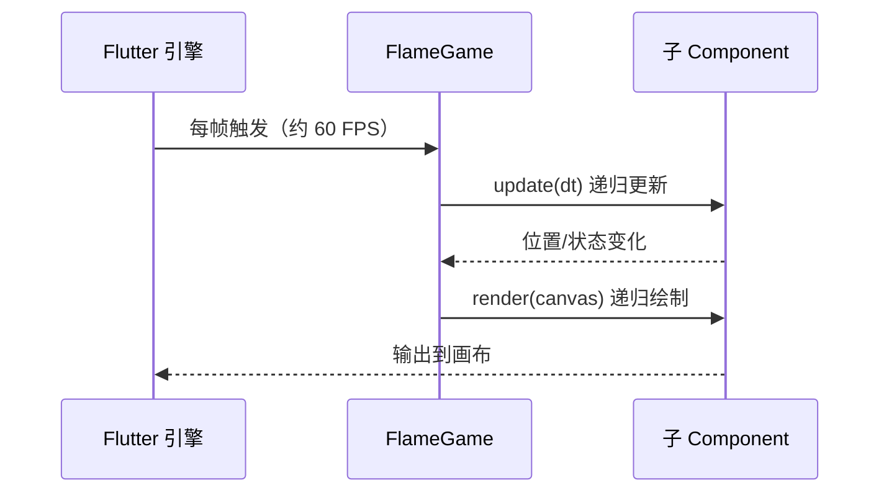

# 11 Flame 游戏开发

> 前置知识：[[dart/3框架/06_动画与自定义绘制|06 动画与自定义绘制]]、[[dart/1入门/09_异步编程|09 异步编程]]
> 本章目标：理解 Flame 的游戏循环与 Component 树，掌握精灵、动画、输入、碰撞、相机、音效与场景管理，完成一个可玩可发布的小游戏，并清楚它与 Unity/Godot 的边界。

## Flame 是什么

Flame 是构建在 Flutter 之上的 2D 游戏引擎。它不替换 Flutter，而是把「游戏循环、组件树、碰撞检测、相机、资源加载」封装成一套 API，最终仍然通过 Flutter 的 Canvas 渲染。因此 Flame 应用可以像普通 Flutter 应用一样打包到 Android/iOS/Web/桌面，也能在页面里嵌入游戏组件。

| 维度 | 纯 Flutter 手写 | Flame | 原生游戏引擎 |
|------|----------------|-------|--------------|
| 游戏循环 | 自己用 Ticker 驱动 | `update(dt)` + `render` 已封装 | 引擎内置 |
| 组件模型 | Widget 树 | Component 树 | 场景/节点树 |
| 碰撞检测 | 手写矩形/圆形判断 | Hitbox + CollisionCallbacks | 物理引擎 |
| 资源与动画 | 手动管理 | SpriteSheet/Animation 内置 | 编辑器管理 |
| 适用 | 简单动画、小交互 | 2D 小游戏 | 商业级 2D/3D |

## 游戏循环

游戏与普通应用的本质区别是**每帧都跑一遍固定流程**。Flame 的 `FlameGame` 在 Flutter 的每一帧回调里做两件事：



关键点：

- `dt`（delta time）是**距上一帧的秒数**，通常约 0.016 秒。所有移动都要写成 `position += speed * dt`，这样在 30 FPS 与 120 FPS 设备上速度一致
- `update` 改状态，`render` 只画不改，职责分离
- 帧率由 Flutter 的 vsync 驱动，不需要自己写 sleep 循环；传统 C 游戏的 `while + SDL_Delay` 循环在这里被引擎接管

## FlameGame 与 Component 树

Flame 应用从 `FlameGame` 开始，它是组件树的根。所有游戏对象都是 `Component`，通过 `add` 挂到树上；`onLoad` 可以 `await` 资源加载完成后再添加依赖资源的组件。运行方式是 `runApp(GameWidget(game: MyGame()))`。

生命周期：`onLoad`（资源加载，可 await）→ `onMount`（加入树）→ `update`/`render` 每帧 → `onRemove`（移除）。`onLoad` 里不要访问 `size` 以外的布局信息，因为此时父组件可能还没完成加载。

## 常用组件

`PositionComponent` 提供位置/大小/旋转，`SpriteComponent` 显示单图，`SpriteAnimationComponent` 播放帧动画，`TextComponent` 绘制文字，`CircleComponent`/`RectangleComponent` 画几何图形，`TimerComponent` 定时回调，`ParallaxComponent` 做视差背景。

```dart
class Player extends SpriteComponent {
  Player() : super(size: Vector2(48, 48), anchor: Anchor.center);
  @override
  Future<void> onLoad() async =>
      sprite = await game.loadSprite('images/player.png'); // 路径与 pubspec 声明一致
  @override
  void update(double dt) {
    super.update(dt);
    position += Vector2(0, 100 * dt); // 每秒向下 100 像素，与帧率无关
  }
}
```
## 精灵表与帧动画

游戏动画通常把多帧拼进一张图（SpriteSheet），运行时按区域裁剪播放：

```dart
class Coin extends SpriteAnimationComponent {
  Coin() : super(size: Vector2(32, 32), anchor: Anchor.center);
  @override
  Future<void> onLoad() async {
    final sheet = await game.loadSpriteSheet('images/coin.png', srcSize: Vector2.all(16));
    animation = sheet.createAnimation(row: 0, stepTime: 0.1, from: 0, to: 5);
    animation!.loop = true; // 循环播放
  }
}
```

```yaml
# pubspec.yaml —— 资源必须声明，且路径大小写敏感
flutter:
  assets:
    - assets/images/
    - assets/audio/
```

## 输入处理

Flame 用 mixin 给组件加输入能力，按需组合：

```dart
class Player extends PositionComponent
    with KeyboardEvents, TapCallbacks, DragCallbacks {
  final _direction = Vector2.zero();
  static const _speed = 320.0;
  // update 中：position.x += _direction.x * _speed * dt（移动逻辑见完整示例）
  @override
  KeyEventResult onKeyEvent(KeyEvent event, Set<LogicalKeyboardKey> keysPressed) {
    _direction.x = keysPressed.contains(LogicalKeyboardKey.arrowLeft)
        ? -1
        : keysPressed.contains(LogicalKeyboardKey.arrowRight) ? 1 : 0;
    return KeyEventResult.handled; // 消费事件，避免冒泡
  }

  @override
  void onTapDown(TapDownEvent event) => position = event.localPosition;
  @override
  void onDragUpdate(DragUpdateEvent event) => position += event.localDelta;
}
```

移动端常用虚拟摇杆：

```dart
final joystick = JoystickComponent(
  knob: CircleComponent(radius: 20, paint: Paint()..color = Colors.blue),
  background: CircleComponent(radius: 60, paint: Paint()..color = Colors.grey),
  margin: const EdgeInsets.only(left: 24, bottom: 24),
);
add(joystick);
// update 中读取：position += joystick.relativeDelta * _speed * dt;
```

## 碰撞检测

Flame 内置基于 Hitbox 的碰撞系统：游戏根类混入 `HasCollisionDetection`，组件加命中框，再实现 `CollisionCallbacks`：

```dart
class DodgeGame extends FlameGame with HasCollisionDetection { /* ... */ }

class Player extends PositionComponent with CollisionCallbacks {
  @override
  Future<void> onLoad() async => add(RectangleHitbox()); // 命中框默认与组件等大

  @override
  void onCollisionStart(Set<Vector2> points, PositionComponent other) {
    super.onCollisionStart(points, other);
    if (other is Enemy) (game as DodgeGame).gameOver();
  }
}
```

| 命中框 | 形状 | 适用 |
|--------|------|------|
| `RectangleHitbox` | 矩形 | 方块、平台 |
| `CircleHitbox` | 圆形 | 子弹、金币 |
| `PolygonHitbox` | 多边形 | 不规则物体 |
| `ScreenHitbox` | 屏幕边界 | 出界检测 |

需要真实物理（重力、弹性、关节）时用 `flame_forge2d`，它把 Box2D 的刚体与 Flame 组件桥接起来；大多数 2D 小游戏用 Hitbox 足够。

## 相机、世界与视差背景

Flame 1.8 之后推荐 `CameraComponent` + `World` 的模型：World 放游戏对象，Camera 决定看世界的哪一块：

```dart
class DodgeGame extends FlameGame {
  late final World world;
  late final CameraComponent camera;
  @override
  Future<void> onLoad() async {
    world = World();
    // 固定逻辑分辨率 360x640，自动缩放到不同屏幕
    camera = CameraComponent.withFixedResolution(world: world, width: 360, height: 640);
    await add(world);
    await add(camera);
    world.add(Player());
  }
}
```

视差背景让远景慢、近景快，产生纵深感：

```dart
@override
Future<void> onLoad() async {
  final parallax = await loadParallaxComponent(
    [ParallaxImageData('images/bg_far.png'), ParallaxImageData('images/bg_near.png')],
    baseVelocity: Vector2(20, 0),
    velocityMultiplierDelta: Vector2(1.8, 1.0), // 每层速度递增
  );
  add(parallax);
}
```

## 音效与音乐

`flame_audio` 封装了音频播放，短音效用 `play`，背景音乐用 `bgm`：

```dart
import 'package:flame_audio/flame_audio.dart';

Future<void> playEffects() async {
  FlameAudio.play('audio/hit.wav');                        // 一次性音效
  await FlameAudio.bgm.play('audio/bgm.mp3', volume: 0.6); // 循环背景音乐
}
```

## 场景与状态管理

用 `RouterComponent` 管理菜单/游戏/结算等场景，用 overlays 显示 Flutter Widget（可直接复用按钮与主题，复杂 UI 不必手绘）：

```dart
class RootGame extends FlameGame {
  @override
  Future<void> onLoad() async {
    add(RouterComponent(routes: {
      'menu': Route(MenuComponent.new),
      'play': Route(GameplayComponent.new),
      'gameOver': Route(GameOverComponent.new),
    }));
  }
}
// 切场景：router.pushNamed('play');
// 覆盖层：game.overlays.add('pause');
// GameWidget(overlayBuilderMap: {'pause': (context, game) => PauseMenu(game: game)});
```
## 粒子与特效

```dart
add(ParticleSystemComponent(
  position: Vector2(180, 320),
  particle: Particle.generate(count: 20, lifespan: 0.8, generator: (i) =>
      AcceleratedParticle(
        speed: Vector2.random() * 120,
        acceleration: Vector2(0, 200), // 模拟重力
        child: CircleParticle(radius: 2, paint: Paint()..color = Colors.orange),
      )),
));
```

## 完整小游戏：躲避障碍

规则：玩家在底部左右移动，躲避从顶部下落的方块；被撞到游戏结束，可按按钮重开。完整实现如下：

```dart
// lib/dodge_game.dart
import 'dart:math';
import 'package:flame/components.dart';
import 'package:flame/events.dart';
import 'package:flame/game.dart';
import 'package:flutter/material.dart';
import 'package:flutter/services.dart'; // LogicalKeyboardKey / KeyEvent

class DodgeGame extends FlameGame with HasCollisionDetection {
  late final Player player;
  late final TextComponent scoreText;
  final _random = Random();
  double _spawnTimer = 0;
  int _score = 0;

  @override
  Future<void> onLoad() async {
    player = Player()..position = Vector2(size.x / 2, size.y - 80);
    scoreText = TextComponent(text: '0', position: Vector2(16, 16))..priority = 10;
    add(player);
    add(scoreText);
  }

  @override
  void update(double dt) {
    super.update(dt);
    _spawnTimer += dt;
    if (_spawnTimer >= 0.6) { // 每 0.6 秒生成一个障碍
      _spawnTimer = 0;
      add(Enemy(position: Vector2(_random.nextDouble() * (size.x - 40), -40)));
    }
  }

  void addScore() => scoreText.text = '${++_score}';

  void gameOver() {
    overlays.add('gameOver');
    pauseEngine(); // 停止 update，画面保留
  }
}

class Player extends PositionComponent with KeyboardEvents, CollisionCallbacks {
  Player() : super(size: Vector2(48, 48), anchor: Anchor.center);
  final _direction = Vector2.zero();
  static const _speed = 320.0;
  @override
  Future<void> onLoad() async => add(RectangleHitbox());

  @override
  void update(double dt) {
    super.update(dt);
    position.x = (position.x + _direction.x * _speed * dt)
        .clamp(size.x / 2, game.size.x - size.x / 2);
  }

  @override
  KeyEventResult onKeyEvent(KeyEvent event, Set<LogicalKeyboardKey> keysPressed) {
    _direction.x = keysPressed.contains(LogicalKeyboardKey.arrowLeft)
        ? -1
        : keysPressed.contains(LogicalKeyboardKey.arrowRight) ? 1 : 0;
    return KeyEventResult.handled;
  }
  @override
  void onCollisionStart(Set<Vector2> points, PositionComponent other) {
    super.onCollisionStart(points, other);
    if (other is Enemy) (game as DodgeGame).gameOver();
  }
}

class Enemy extends PositionComponent with CollisionCallbacks {
  Enemy({required Vector2 position})
      : super(position: position, size: Vector2(40, 40), anchor: Anchor.center);
  @override
  Future<void> onLoad() async => add(RectangleHitbox());

  @override
  void update(double dt) {
    super.update(dt);
    position.y += 220 * dt; // 下落
    if (position.y > game.size.y + 40) {
      removeFromParent(); // 出屏销毁，避免组件无限增长
      (game as DodgeGame).addScore();
    }
  }
}
```

```dart
// lib/main.dart
import 'package:flame/game.dart';
import 'package:flutter/material.dart';
import 'dodge_game.dart';

void main() => runApp(const DodgeApp());

class DodgeApp extends StatelessWidget {
  const DodgeApp({super.key});

  @override
  Widget build(BuildContext context) => MaterialApp(
        home: Scaffold(
          body: GameWidget(
            game: DodgeGame(),
            overlayBuilderMap: {
              'gameOver': (context, DodgeGame g) => Center(
                    child: Column(mainAxisSize: MainAxisSize.min, children: [
                      const Text('游戏结束', style: TextStyle(fontSize: 32, color: Colors.white)),
                      ElevatedButton(
                        onPressed: () {
                          g.overlays.remove('gameOver');
                          g.resumeEngine();
                          g.restart(); // 清空组件树重新开始
                        },
                        child: const Text('重新开始'),
                      ),
                    ]),
                  ),
            },
          ),
        ),
      );
}
```

## 打包发布

Flame 游戏就是 Flutter 应用，构建命令与普通项目完全一致：

```bash
flutter build apk --release      # Android
flutter build web --release      # 浏览器，注意首次点击后才能播音频
flutter build linux --release    # 桌面
```

## 与 Unity / Godot 对比

| 维度 | Flame | Unity | Godot |
|------|-------|-------|-------|
| 语言 | Dart | C# | GDScript/C# |
| 3D 能力 | 无（专注 2D） | 强 | 强 |
| 编辑器 | 无，代码为主 | 完整场景编辑器 | 完整场景编辑器 |
| 包体积 | 小（随 Flutter 应用） | 大 | 中 |
| 资产商店/生态 | 小 | 最大 | 中 |
| 学习曲线 | Flutter 开发者低 | 中 | 低 |
| 发布目标 | Flutter 六端 | 多平台主机 | 多平台 |

## 常见坑

1. **资源路径错误**：路径相对 `assets/` 目录且大小写敏感，未在 `pubspec.yaml` 声明的资源运行时报「Unable to load asset」。
2. **坐标系记反**：Flame 原点在左上角，y 轴向下，与数学坐标系相反，向上移动是 `position.y -= speed * dt`。
3. **忘记乘 dt**：`position.x += 5` 会让速度随帧率变化，高刷屏上快得离谱。所有移动都必须乘 `dt`。
4. **碰撞不生效**：根游戏忘记 `HasCollisionDetection`，或组件忘记 `add(Hitbox)`，或没混入 `CollisionCallbacks`。
5. **组件无限增长与每帧创建对象**：出屏敌人要 `removeFromParent`，`update` 里避免 `new` 大量 `Vector2`，必要时用对象池。
6. **在 render 里改状态或音频不播**：render 可能被多次调用，状态改动全放 `update`；Web 音频需要用户交互，移动端检查静音开关。

## 本章小结

- Flame 是 Flutter 之上的 2D 游戏引擎：游戏循环由引擎驱动，你实现 `update(dt)` 与 `render`；一切皆 Component，挂在 `FlameGame` 上，`onLoad` 可异步加载资源
- 移动必须乘 `dt`，坐标系原点在左上、y 向下
- 精灵表配合 `SpriteAnimationComponent` 播放帧动画；资源必须在 pubspec 声明
- 输入用 mixin（KeyboardEvents/TapCallbacks/DragCallbacks/JoystickComponent）按需组合
- 碰撞 = HasCollisionDetection + Hitbox + CollisionCallbacks；复杂物理用 flame_forge2d
- CameraComponent + World 管理视口，ParallaxComponent 做视差背景；overlays 把复杂 UI 交还 Flutter
- 发布就是 Flutter 构建，注意资源与包体积；大型 3D 项目应选 Unity/Godot

---

- 返回目录：[[dart/dart目录|Dart 教程目录]]

---

## 练习

1. **完成躲避障碍游戏（验收：可玩、有分数、能重开）**
   按本章示例实现完整游戏，加上计分与游戏结束覆盖层；被撞后暂停，点击「重新开始」能清空所有敌人与分数并恢复运行。用真机或 Chrome 各跑一次，确认键盘与触摸都能操作。

2. **加入精灵动画与音效（验收：至少一个帧动画与一个碰撞音效）**
   把玩家或敌人替换为 SpriteSheet 帧动画，移动时播放动画；碰撞时播放音效并触发粒子爆炸；资源路径全部在 pubspec 声明。

3. **相机与视差背景（验收：背景滚动且与游戏节奏协调）**
   加入两层以上的视差背景，使用固定逻辑分辨率相机；窗口大小变化时游戏画面不变形。

4. **打包发布（验收：产出可运行的 release 包）**
   执行 `flutter build web --release` 并本地起静态服务器运行，或构建 Android APK 安装到手机；记录包体积，尝试把图片转成 WebP 后再对比一次。
