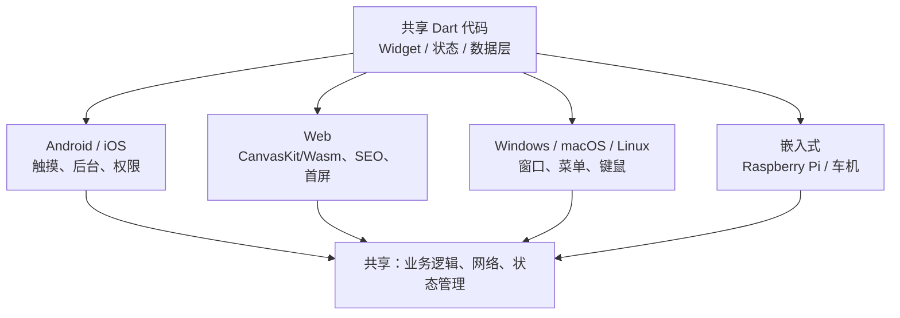

# 12 Web 与桌面跨平台

> 前置知识：[[dart/3框架/08_测试与发布|08 测试与发布]]、[[dart/2深入/06_编译与产物|06 编译与产物]]
> 本章目标：理解 Flutter 的六端版图与 Web 两种渲染模式的取舍，掌握桌面窗口管理、菜单、文件选择与平台差异处理，了解嵌入式与 Jaspr，会用 dart2js / dart compile wasm 构建非 Flutter 的 Web 应用，并掌握条件导入这一跨平台代码组织手段。

## Flutter 的六端版图

同一套 Dart 代码可以编译到六个目标平台，但「能跑」不等于「体验一致」，每一端都有各自的约束：



| 平台 | 渲染方式 | 主要差异 | 插件成熟度 |
|------|----------|----------|-----------|
| Android/iOS | Impeller/Skia 原生 | 权限、后台、手势 | 高 |
| Web | CanvasKit / Wasm | 无 dart:io、SEO、首屏体积 | 中 |
| Windows | Skia + ANGLE | 窗口、菜单、文件路径 | 中 |
| macOS | Skia + Metal | 沙箱、公证、菜单栏 | 中 |
| Linux | Skia + OpenGL | 发行版依赖、窗口管理器 | 中 |
| 嵌入式 | 帧缓冲/OpenGL ES | 无窗口系统、交叉编译 | 低 |

## Flutter Web：渲染模式与取舍

Flutter Web 的渲染经历了三代方案：

| 渲染器 | 原理 | 优点 | 缺点 | 现状 |
|--------|------|------|------|------|
| HTML | 用 DOM/Canvas 元素拼出 UI | 体积小、文本可选中、SEO 稍好 | 性能差、渲染不一致 | 已移除 |
| CanvasKit | Skia 编译成 Wasm，画到 canvas | 与移动端一致、性能好 | 首次下载大（约 1.5 MB Wasm） | 默认 |
| Wasm（skwasm） | 多线程 Skia Wasm | 性能最好、支持多线程 | 浏览器要求高 | `--wasm` 启用 |

```bash
flutter build web --release          # 默认 CanvasKit
flutter build web --wasm             # 使用 skwasm，需要支持 WasmGC 的浏览器
```

选择建议：绝大多数项目用默认 CanvasKit；对性能敏感且用户浏览器可控（如企业内部系统）再上 Wasm。HTML 渲染器已在新版本中移除，不要再依赖「HTML 模式省流量」的旧经验。

### SEO 与首屏优化

Flutter Web 把界面画在 canvas 里，搜索引擎抓不到正文，这是它与 React/Vue 最大的差距。可行的缓解手段：

- 营销页/落地页用纯 HTML 或 Jaspr 生成静态页面，应用主体再跳转 Flutter
- 使用预渲染（prerender）服务，把首屏内容提前生成 HTML
- 首屏加自定义 loading（`web/index.html` 里放骨架屏，`flutter.js` 加载完成后替换）
- 图片压缩为 WebP、开启 gzip/brotli、静态资源上 CDN
- 用 `--tree-shake-icons` 裁剪未用图标字体（默认开启）

## 桌面开发

### 启用与创建

```bash
flutter config --enable-linux-desktop --enable-windows-desktop --enable-macos-desktop
flutter create --platforms=windows,macos,linux .   # 给已有项目补桌面工程
flutter run -d linux                                # 指定设备运行
```

### 窗口管理：window_manager

Flutter 默认窗口大小、标题、位置都不可控，用 `window_manager` 补齐：

```dart
// lib/main.dart
import 'package:flutter/material.dart';
import 'package:window_manager/window_manager.dart';

Future<void> main() async {
  WidgetsFlutterBinding.ensureInitialized();
  await windowManager.ensureInitialized();

  const options = WindowOptions(
    size: Size(1200, 800),
    minimumSize: Size(800, 600),
    center: true,
    title: 'RootStack 桌面端',
  );
  // 等首帧准备好再显示，避免白屏闪烁
  await windowManager.waitUntilReadyToShow(options, () async {
    await windowManager.show();
    await windowManager.focus();
  });

  runApp(const MyApp());
}
```

### 菜单与文件选择

macOS 用系统菜单栏，Windows/Linux 用应用内菜单：

```dart
// macOS 系统菜单
PlatformMenuBar(
  menus: [
    PlatformMenu(label: '文件', menus: [
      PlatformMenuItem(label: '打开', onSelected: _openFile),
    ]),
  ],
  child: const MyHomePage(),
)
```

```dart
// 文件选择用官方 file_selector，跨平台 API 一致
import 'package:file_selector/file_selector.dart';

Future<void> pickImage() async {
  const typeGroup = XTypeGroup(label: '图片', extensions: ['png', 'jpg']);
  final file = await openFile(acceptedTypeGroups: [typeGroup]);
  if (file != null) {
    final bytes = await file.readAsBytes(); // XFile 统一了各平台读取
    debugPrint('选中: ${file.name}, ${bytes.length} 字节');
  }
}
```

桌面端还要注意：快捷键用 `Cmd`（macOS）还是 `Ctrl`（其他）、滚动条默认隐藏需 hover 显示、鼠标悬停态、窗口关闭时拦截未保存数据（`WindowListener.onWindowClose`）。

## 嵌入式：Raspberry Pi

Flutter 在树莓派上有两条路线：

- **flutter-pi**：轻量级嵌入运行时，直接跑在 DRM/KMS 上，不需要桌面环境，适合信息屏、车机
- **flutter-elinux**：Sony 维护的嵌入式 Linux 方案，支持 Wayland/EGL

```bash
# 交叉编译示例（在 x86 主机上构建 ARM64 产物）
flutter build linux --target-platform=linux-arm64 --release
```

嵌入式场景通常没有窗口管理器、输入设备是 GPIO/串口，需要自定义平台通道（见 [[dart/3框架/07_平台通道与原生集成|07 平台通道与原生集成]]）接入硬件。

## Jaspr：Dart 原生 Web 框架

如果你要的是「网站」而不是「应用」，Flutter Web 不是最优解。Jaspr 用 Dart 写组件、支持服务端渲染（SSR），产出真正的 HTML，SEO 友好：

```dart
// lib/app.dart
import 'package:jaspr/jaspr.dart';

class App extends StatelessComponent {
  const App({super.key});

  @override
  Iterable<Component> build(BuildContext context) sync* {
    yield div(classes: 'card', [
      h1([text('RootStack')]),
      p([text('用 Dart 写真正的 Web 应用，服务端直接输出 HTML')]),
    ]);
  }
}
```

```bash
dart pub global activate jaspr_cli
jaspr create my_site && cd my_site
jaspr serve          # 开发模式，支持热重载
jaspr build          # 产出静态文件或 SSR 服务端代码
```

概念对照：组件（Component）对应 Flutter 的 Widget，`build` 返回 HTML 标签而不是 Widget 树，路由用注解声明，`jaspr build` 可选择 static（纯静态）或 server（SSR + hydration）模式。

## dart2js 与 dart compile wasm

不用 Flutter 时，Dart 也能直接编译 Web 应用。与浏览器交互通过 `package:web` 和 `dart:js_interop`：

```dart
// bin/web_app.dart
import 'dart:js_interop';
import 'package:web/web.dart' as web;

void main() {
  final app = web.document.querySelector('#app')!;
  app.textContent = 'Hello from Dart'.toJS;
}
```

```bash
dart compile js bin/web_app.dart -O2 -o web/main.dart.js   # 编译为 JS
dart compile wasm bin/web_app.dart -o web/main.wasm        # 编译为 Wasm
```

| 目标 | 命令 | 适用 |
|------|------|------|
| JavaScript | `dart compile js -O2` | 全浏览器兼容 |
| Wasm | `dart compile wasm` | 支持 WasmGC 的现代浏览器 |
| Flutter Web | `flutter build web` | Flutter UI 应用 |

## PWA 概念

PWA（渐进式 Web 应用）让网页可以安装到桌面/主屏、离线运行。Flutter Web 自带支持：

- `web/manifest.json` 配置应用名、图标、主题色、`display: standalone`
- `flutter build web` 默认生成 service worker，缓存资源实现离线打开
- 在 `web/index.html` 中注册自定义 service worker 可控制更新策略

```json
{
  "name": "城市天气",
  "short_name": "天气",
  "start_url": "/",
  "display": "standalone",
  "theme_color": "#1976D2",
  "icons": [{ "src": "icons/Icon-192.png", "sizes": "192x192", "type": "image/png" }]
}
```

注意：PWA 的离线能力依赖 service worker 缓存，更新版本后要做缓存失效提示，否则用户会一直看到旧版本。

## 与 React / Vue / Electron / Tauri 对比

| 维度 | Flutter Web | React / Vue | Electron | Tauri |
|------|-------------|-------------|----------|-------|
| 语言 | Dart | JS/TS | JS/TS + Node | Rust + Web 前端 |
| 渲染 | Canvas / Wasm | DOM | Chromium | 系统 WebView |
| 安装包体积 | 大（引擎） | 不适用 | 很大（100 MB+） | 小（几 MB） |
| SEO | 差 | 好 | 不适用 | 不适用 |
| 桌面系统能力 | 插件 | 不适用 | Node 全能力 | Rust 命令 |
| 内存占用 | 中 | 低 | 高 | 低 |
| 适合 | 复用 Flutter 代码 | 内容型网站 | 快速桌面化 | 轻量桌面工具 |

选择逻辑：已有 Flutter 代码、要六端复用，选 Flutter；做内容站/SEO 优先，选 React/Vue 或 Jaspr；桌面工具追求小体积，选 Tauri；桌面工具要求最快落地且不在意体积，选 Electron。

## 跨平台代码组织策略

原则：**业务逻辑全共享，平台差异收敛到薄薄一层**。

- 数据层、状态层、路由、主题全部共享，不写平台判断
- UI 用自适应组件：`Switch.adaptive`、`Slider.adaptive`，主题按平台微调
- 平台判断优先用 `defaultTargetPlatform`（来自 `foundation`，Web 也能用），不要用 `Platform.isAndroid`（`dart:io` 在 Web 不存在）
- 确实需要不同实现的（文件保存、剪贴板、通知），用**条件导入**隔离

```dart
// lib/platform/file_saver.dart —— 编译期选择实现，Web 不会打包 dart:io
export 'file_saver_io.dart' if (dart.library.js_interop) 'file_saver_web.dart';
```

```dart
// lib/platform/file_saver_io.dart
import 'dart:io';

Future<void> saveText(String name, String content) async {
  await File(name).writeAsString(content); // 桌面/移动：写本地文件
}
```

```dart
// lib/platform/file_saver_web.dart
import 'dart:js_interop';
import 'package:web/web.dart' as web;

Future<void> saveText(String name, String content) async {
  // Web：创建 Blob 并触发下载
  final blob = web.Blob([content.toJS].toJS, web.BlobPropertyBag(type: 'text/plain'));
  final url = web.URL.createObjectURL(blob);
  web.HTMLAnchorElement()
    ..href = url
    ..download = name
    ..click();
  web.URL.revokeObjectURL(url);
}
```

调用方只 import `file_saver.dart`，三个平台各自编译到正确实现，这就是 Flutter 插件生态背后的通用模式。

## 常见坑

1. **Web 上使用 dart:io**：`File`、`Socket`、`Platform` 全部不可用，编译直接失败。用条件导入或 `package:web`，平台判断用 `defaultTargetPlatform`。
2. **桌面插件成熟度参差**：同一个包可能只支持 Windows，先在 pub.dev 看平台徽章，再逐平台真机验证。
3. **macOS 沙箱拦截**：没有在 entitlements 里声明网络客户端/文件访问权限时，请求静默失败，日志里才有 `Operation not permitted`。
4. **Web 刷新丢失路由**：默认 hash 路由（`/#/city`）难看且不利于分享，改用 `usePathUrlStrategy()` 并配置服务器 fallback 到 `index.html`。
5. **首屏白屏时间长**：CanvasKit 下载需要时间，`web/index.html` 里放 loading 占位，加载完成后再挂载 Flutter。
6. **中文字体体积**：Web 全量中文字体动辄几 MB，用子集化（只保留用到的字符）或系统字体。
7. **窗口关闭丢数据**：桌面端要监听关闭事件，有未保存内容时弹确认框；macOS 的「关闭窗口」不等于退出应用。
8. **快捷键差异**：macOS 用 Command，Windows/Linux 用 Ctrl，用 `PlatformMenuItem` 的 `shortcut` 或 `SingleActivator` 按平台配置。

## 本章小结

- Flutter 六端共享业务逻辑，差异集中在渲染、系统能力与交互习惯
- Web 现役渲染器是 CanvasKit 与 Wasm（skwasm），HTML 渲染器已移除；SEO 是短板，营销页应交给静态 HTML/Jaspr
- 桌面用 window_manager 管窗口，file_selector 选文件，PlatformMenuBar 做系统菜单，注意 macOS 沙箱
- 嵌入式用 flutter-pi / flutter-elinux，通常配合自定义平台通道接硬件
- Jaspr 用 Dart 写组件并支持 SSR，适合 SEO 敏感的内容站
- `dart compile js` / `dart compile wasm` 可把纯 Dart 程序编译到 Web
- PWA 依赖 manifest 与 service worker，注意版本更新后的缓存失效
- 跨平台代码组织的核心是条件导入：调用方接口统一，实现按编译目标选择

---

- 返回目录：[[dart/dart目录|Dart 教程目录]]

---

## 练习

1. **把天气项目构建到 Web（验收：浏览器可完成一次城市搜索）**
   给第 09 章项目补齐 `web/` 目录并执行 `flutter build web --release`，用本地静态服务器打开；配置 `usePathUrlStrategy` 与服务器 fallback，确认刷新 `/search` 不 404；在 `web/index.html` 加一个加载占位。

2. **桌面窗口与菜单（验收：Linux/Windows/macOS 任一平台可运行）**
   集成 window_manager 设置窗口标题、最小尺寸与居中显示；加一个「文件-打开」菜单，用 file_selector 选择一张图片并显示路径与大小；关闭窗口前弹确认对话框。

3. **条件导入文件保存（验收：同一份调用代码在 Web 与桌面各走一条实现）**
   按本章示例实现 `file_saver.dart` 的条件导入，在设置页加「导出数据」按钮：Web 端触发下载，桌面端写入用户选择的目录；用 `flutter build web` 与 `flutter build linux` 分别验证。

4. **Jaspr 静态站点（验收：`view-source` 能看到正文 HTML）**
   用 Jaspr 创建一个单页站点，包含标题、段落与一个路由页面；执行 `jaspr build` 后查看产物中的 HTML，确认正文直接出现在源码里（对比 Flutter Web 的 canvas 渲染），体会 SSR 对 SEO 的意义。
