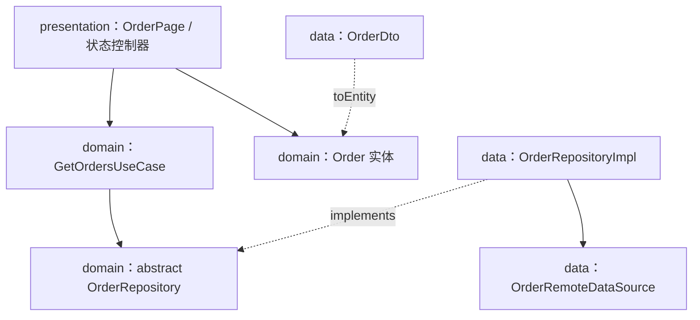
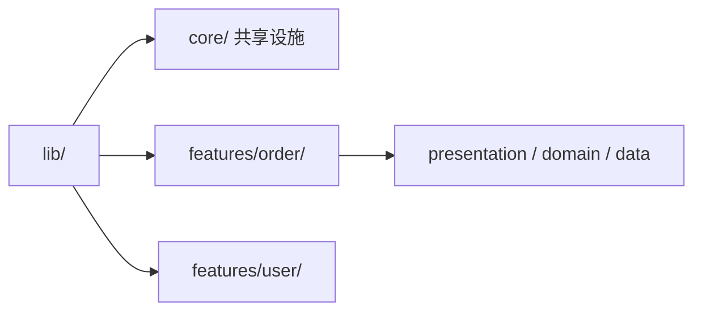

# Dart 工程化 01：项目架构与规范

> 会写 Dart 语法和会做 Dart 项目是两回事。C 项目里我们用 `Makefile` 管构建、用 `include/` 与 `src/` 划边界、用 `static` 藏实现；Dart/Flutter 项目里这些约束换了一副面孔：目录结构、依赖方向、lint 规则、环境配置。本章回答一个问题——**一个 Dart 项目从 500 行长到 5 万行，架构与规范应该怎么跟着长**。
>
> 前置知识：[[dart/1入门/11_包管理与模块|11 包管理与模块]]（pubspec、import/export）、[[dart/3框架/03_状态管理|03 状态管理]]（Provider/Riverpod/Bloc 的取舍）。

---

## 一、项目从小到大的目录演进

| 阶段 | 规模 | 目录形态 | 主要矛盾 |
|------|------|----------|----------|
| 单文件脚本 | < 500 行 | `bin/main.dart` 一个文件 | 无 |
| 小型应用 | 500 - 5000 行 | `lib/` 按类型分（models、services、screens） | 文件互相 import，改一处牵连多处 |
| 中大型应用 | > 5000 行 | 按 feature 分目录 + 层内三层 | 团队并行冲突、测试难、依赖失控 |

不要一开始就上重型架构。**目录结构应该跟随痛点演进，而不是预支复杂度**。阶段二的典型问题：`screens/` 里 40 个页面、`services/` 里 60 个服务，没人说得清哪个服务属于哪个页面；阶段三把「一个功能相关的一切」收拢到同一目录，这正是后文 feature-first 的核心。5000 行以下强行套 Clean Architecture，只会得到一层层转发的样板代码。

```text
lib/
  main.dart                 # 入口：只做初始化与 runApp
  app.dart                  # 根 Widget：主题、路由、全局 Provider
  core/                     # 跨 feature 共享：network/storage/error/utils
  features/
    order/                  # presentation/ domain/ data/ 三层
    user/                   # 同样的三层结构
```

---

## 二、三层架构：presentation / domain / data

### 2.1 各层职责

| 层 | 职责 | 允许依赖 | 禁止出现 |
|----|------|----------|----------|
| presentation | UI 渲染、用户交互、界面状态 | domain 的实体与用例 | 直接 import data 层、直接调 HTTP |
| domain | 业务规则、实体、用例、仓库接口 | 无（纯 Dart） | Flutter、dio、数据库等任何框架 |
| data | 数据获取与持久化、DTO 与实体互转 | domain 的仓库接口 | 依赖 presentation |

依赖方向永远是 **presentation → domain ← data**。domain 定义接口（抽象类），data 提供实现（implements），presentation 只认接口。这与 C 里「头文件声明接口、.c 文件实现」思路一致，只是 Dart 用抽象类而不是函数指针表。



### 2.2 完整示例

```dart
// domain/order.dart —— 实体：纯 Dart，不依赖任何框架
class Order {
  const Order({required this.id, required this.title,
      required this.amount, required this.createdAt});
  final String id;
  final String title;
  final double amount;
  final DateTime createdAt;
  bool get isLargeOrder => amount >= 10000; // 业务规则放实体或用例
}
// domain/order_repository.dart —— 接口：只声明能力
abstract class OrderRepository {
  Future<List<Order>> fetchOrders();
  Future<void> cancelOrder(String id);
}
// domain/get_orders.dart —— 用例：一个动作一个类
class GetOrdersUseCase {
  GetOrdersUseCase(this._repository);
  final OrderRepository _repository;
  Future<List<Order>> call() async {
    final orders = await _repository.fetchOrders();
    return orders..sort((a, b) => b.createdAt.compareTo(a.createdAt));
  }
}
```

```dart
// data/order_repository_impl.dart —— 实现：DTO 转换 + 数据源
class OrderDto {
  OrderDto(this.json);
  final Map<String, dynamic> json;
  Order toEntity() => Order(
        id: json['id'] as String,
        title: json['title'] as String,
        amount: (json['amount'] as num).toDouble(),
        createdAt: DateTime.parse(json['created_at'] as String),
      );
}
abstract class OrderRemoteDataSource {
  Future<List<Map<String, dynamic>>> getOrders();
}
class OrderRepositoryImpl implements OrderRepository {
  OrderRepositoryImpl(this._remote);
  final OrderRemoteDataSource _remote;
  @override
  Future<List<Order>> fetchOrders() async {
    final raw = await _remote.getOrders();
    return raw.map(OrderDto.new).map((dto) => dto.toEntity()).toList();
  }
  @override
  Future<void> cancelOrder(String id) async => throw UnimplementedError();
}
```

小项目可把 domain 合并进 presentation，只保留 data 隔离；判断标准只有一条：**业务逻辑能否在没有 Flutter 的环境下被单元测试**。

---

## 三、feature-first 与 layer-first

| 维度 | layer-first（按层分） | feature-first（按功能分） |
|------|----------------------|--------------------------|
| 目录示例 | `lib/screens/`、`lib/services/`、`lib/models/` | `lib/features/order/`、`lib/features/user/` |
| 找文件 | 跨三个目录才能拼出一个功能 | 一个目录看全 |
| 团队并行 | 两人改不同功能也会撞同名目录 | 冲突集中在各自 feature |
| 删除功能 | 全仓库搜索，容易漏 | 删目录即可，回收干净 |
| 公共代码 | 天然共享 | 需要显式放 `core/` 或 `shared/` |
| 适合规模 | 1 - 2 人、小应用 | 3 人以上、中大型应用 |



主流做法是「feature-first 为主，layer-first 为次」：顶层按 feature 切，feature 内部再按层切。规则：**feature 之间不允许互相 import presentation 层**。订单页要跳用户页，走路由名；订单要用户数据，走 domain 接口。否则 feature 边界形同虚设。

---

## 四、Clean Architecture 与过度设计

它想解决的原始问题是**让业务规则独立于框架、UI、数据库**。收益：domain 纯 Dart，测试毫秒级；换网络库/数据库不影响业务代码；多人协作边界清晰。

出现以下现象说明架构已成负担：

- 「获取列表」要穿过 UseCase → Repository 接口 → 实现 → DataSource 接口 → 实现五层，每层只转发；
- DTO 与 Entity 字段完全一致，却写了两个类加两套转换；每个用例类只有一行 `return _repository.xxx()`；
- 新人要读一天文档才能加一个字段。

| 项目情况 | 建议架构 |
|----------|----------|
| 原型 / Demo / 课程作业 | 不分层，页面直接调 API |
| 单人或双人产品，1 万行内 | presentation + data 两层，逻辑放 service |
| 多人协作，3 万行以上，要求自动化测试 | 标准三层 + feature-first |
| 多端复用业务逻辑 | domain 抽成独立 package，各端共享 |

---

## 五、依赖注入

C 的解耦靠「头文件声明 + 链接时替换实现」或函数指针表。Dart 没有链接期替换，等价手段是**构造器注入接口**。DI 解决三件事：谁创建对象、在哪创建、如何替换测试替身。

| 方式 | 写法 | 优点 | 缺点 | 适用 |
|------|------|------|------|------|
| 手动注入 | 构造器层层传递 | 零依赖、显式、可读 | 层级深时传递繁琐 | 小项目、库代码 |
| get_it | 全局容器 `getIt<T>()` | 随处可取、支持懒加载 | 隐式依赖、编译期无保障 | 中大型项目 |
| Riverpod | `Provider` 依赖图 | 编译期检查、自动 dispose | 有学习曲线 | Flutter 应用首选 |

```dart
// 方式一：手动注入 —— 组合根集中装配
void main() {
  final repository = OrderRepositoryImpl(HttpOrderRemoteDataSource());
  final getOrders = GetOrdersUseCase(repository);
  OrderController(getOrders).load();
}
```

```dart
// 方式二：get_it —— 全局容器注册，测试时 reset 后替换
final getIt = GetIt.instance;
void setupLocator() {
  getIt.registerLazySingleton<OrderRepository>(() => OrderRepositoryImpl(getIt()));
  getIt.registerFactory<GetOrdersUseCase>(() => GetOrdersUseCase(getIt()));
}
// 测试中：getIt.reset() 后注册 FakeOrderRepository 即可
```

```dart
// 方式三：Riverpod —— 依赖关系显式声明在 provider 图上
final orderRepositoryProvider = Provider<OrderRepository>(
  (ref) => throw UnimplementedError('必须在 ProviderScope 中 override'));
final getOrdersProvider = Provider<GetOrdersUseCase>(
  (ref) => GetOrdersUseCase(ref.watch(orderRepositoryProvider)));
final ordersProvider = FutureProvider<List<Order>>(
  (ref) => ref.watch(getOrdersProvider)());
// main.dart 中用 ProviderScope(overrides: [...]) 注入真实实现
```

Riverpod 相比 get_it：依赖是显式的 `ref.watch` 图，漏注入在编译期或启动即报错；测试用 `ProviderContainer(overrides: [...])`，无需全局 reset。

---

## 六、错误处理策略

| 维度 | 抛异常 | Result 类型 |
|------|--------|-------------|
| 调用方感知 | 编译器不强制，易漏 catch | 类型系统强制处理 |
| 正常路径 | 代码干净 | 每步要解包 |
| 适用场景 | 编程错误、不可恢复故障 | 可预期的业务失败（网络、校验） |
| Dart 生态 | 主流（Future 本身携带异常） | 需自行定义或用 `fpdart` |

Dart 没有内建 Result，推荐：**可预期的失败用 sealed 类表达，编程错误继续抛异常**。

```dart
// lib/core/error/result.dart —— 可预期失败用 sealed 类表达
sealed class Result<T> { const Result(); }
final class Success<T> extends Result<T> {
  const Success(this.value);
  final T value;
}
final class Failure<T> extends Result<T> {
  const Failure(this.error);
  final AppError error;
}
sealed class AppError { const AppError(); }
final class NetworkError extends AppError {
  const NetworkError(this.message);
  final String message;
}
final class AuthError extends AppError { const AuthError(); }

// 调用方用 switch 表达式穷尽处理，漏分支编译不过
String describe(Result<List<Order>> r) => switch (r) {
      Success(:final value) => '共 ${value.length} 条订单',
      Failure(error: NetworkError(:final message)) => '网络错误：$message',
      Failure(error: AuthError()) => '请先登录',
    };
```

```dart
// 错误边界：框架错误与异步未捕获错误统一上报
void main() {
  FlutterError.onError = (details) {
    FlutterError.presentError(details);
    reportToCrashlytics(details.exception, details.stack);
  };
  PlatformDispatcher.instance.onError = (error, stack) {
    reportToCrashlytics(error, stack);
    return true; // 已处理，避免崩溃
  };
  runApp(const MyApp());
}
```

data 层的原始异常（`DioException`、`SocketException`）必须在 data 层转成 `AppError`，绝不能泄漏到 presentation，否则换网络库时 UI 要跟着改。

---

## 七、代码规范与静态检查

```yaml
# analysis_options.yaml —— 项目根目录，编辑器与 CI 共用
include: package:flutter_lints/flutter.yaml   # 纯 Dart 用 package:lints/recommended.yaml
analyzer:
  language:
    strict-casts: true        # 禁止隐式 dynamic 转换
    strict-inference: true    # 推断不出类型时报错
    strict-raw-types: true    # 裸泛型 List 也要报错
  exclude:
    - "**/*.g.dart"           # 生成文件不参与检查
    - "**/*.freezed.dart"
linter:
  rules:
    - always_declare_return_types
    - avoid_print                 # 库代码禁止 print
    - prefer_single_quotes
    - require_trailing_commas
    - unawaited_futures           # 漏 await 的 Future 直接报错
```

| 规则集 | 来源 | 严格度 | 适合 |
|--------|------|--------|------|
| `package:lints/recommended.yaml` | Dart 官方 | 中 | 纯 Dart 包、CLI |
| `package:flutter_lints/flutter.yaml` | Flutter 官方 | 中 | 所有 Flutter 项目基线 |
| `very_good_analysis` | Very Good Ventures | 高 | 团队统一高标准 |
| 自定义 rules 列表 | 自行维护 | 自定 | 大团队增量收紧 |

不要一次性启用几百条规则，否则团队开始写 `// ignore:`，规范即失效。先从基线出发，遇到真实问题再加规则。

```bash
dart format .                          # 官方格式化器，无配置项，无需争论风格
dart format --set-exit-if-changed .    # CI 检测未格式化文件并失败
dart fix --apply                       # 自动修复 lint 提示与废弃 API
dart analyze --fatal-infos             # CI 把 info 级别也当失败
```

---

## 八、命名与文件组织约定

| 对象 | 约定 | 示例 |
|------|------|------|
| 文件 / 目录 | `snake_case` | `order_repository.dart` |
| 类 / 枚举 / typedef | `UpperCamelCase` | `OrderRepositoryImpl` |
| 变量 / 方法 / 参数 | `lowerCamelCase` | `fetchOrders` |
| 常量 | `lowerCamelCase` | `maxRetryCount` |
| 私有成员 | 前缀 `_` | `_repository` |
| 布尔值 | `is/has/can/should` 前缀 | `isLargeOrder` |

1. 一个文件一个主要公开类型，文件名与类型名对应；
2. `part`/`part of` 只用于代码生成，不要手工拆文件；
3. 导入顺序 `dart:` → `package:` → 相对路径，交给 `directives_ordering` 检查；
4. 测试文件加 `_test` 后缀，目录结构镜像 `lib/`。

---

## 九、环境配置：flavor 与 dart-define

| 方式 | 写法 | 优点 | 缺点 |
|------|------|------|------|
| 编译期常量 | `String.fromEnvironment` | 树摇可优化 | 需重新编译才能改 |
| `--dart-define` | 命令行传入 | 与 CI 集成好 | 命令长、易拼错 |
| `--dart-define-from-file` | JSON 文件 | 配置集中、多环境清晰 | 文件勿提交敏感值 |
| flavor | Android/iOS 构建变体 | 可装多个包、图标可区分 | 平台侧配置繁琐 |

```json
// config/dev.json（提交进仓库，不含敏感值）
{ "API_BASE_URL": "https://dev-api.example.com", "ENABLE_LOG": true, "FLAVOR": "dev" }
// config/prod.json
{ "API_BASE_URL": "https://api.example.com", "ENABLE_LOG": false, "FLAVOR": "prod" }
```

```dart
// lib/core/config/app_config.dart —— 配置的唯一读取入口
class AppConfig {
  const AppConfig._();
  static const apiBaseUrl = String.fromEnvironment('API_BASE_URL',
      defaultValue: 'https://dev-api.example.com');
  static const enableLog = bool.fromEnvironment('ENABLE_LOG');
  static const flavor = String.fromEnvironment('FLAVOR', defaultValue: 'dev');
  static bool get isProd => flavor == 'prod';
}
```

```bash
flutter run --dart-define-from-file=config/dev.json          # 开发
flutter build apk --release --dart-define-from-file=config/prod.json   # 生产
```

注意：`String.fromEnvironment` 必须在 `const` 上下文使用；所有读取集中在 `AppConfig`，业务代码禁止散落 `fromEnvironment`。

---

## 十、日志与调试开关

```dart
// lib/core/log/app_logger.dart —— 统一日志出口，生产自动降级
class AppLogger {
  const AppLogger(this.tag);
  final String tag;
  void d(String m) { if (kDebugMode && AppConfig.enableLog) debugPrint('[$tag] $m'); }
  void e(String message, [Object? error, StackTrace? stack]) {
    if (AppConfig.enableLog) debugPrint('[$tag] ERROR $message $error');
    // reportToCrashlytics(...) 在此接入
  }
}
```

规则：禁止裸 `print`（`avoid_print` 强制）；分级 debug/info/warn/error；生产关闭 debug 并上报 error；日志不得包含令牌、密码、完整手机号。

---

## 十一、代码评审清单

1. presentation 是否直接 import 了 data 层？
2. 业务逻辑是否混进 Widget 的 build 方法？
3. 可预期失败是否用 Result/错误类型表达，而非静默 catch？
4. 是否有未处理的 `Future`（`unawaited_futures` 是否通过）？
5. 是否有硬编码 URL、密钥、环境判断散落各处？
6. 公共 API 变更是否向后兼容？破坏性变更是否升 MAJOR？
7. 是否补了测试？核心用例是否覆盖失败路径？
8. 格式化、analyze 是否全绿？新依赖是否必要？生成文件是否同步提交？

---

## 常见坑

1. **domain 层偷偷 import Flutter**：纯 Dart 测试立即失效，架构退化。
2. **Riverpod Provider 里做业务逻辑**：provider 只装配依赖与暴露状态，排序/校验放 domain。
3. **滥用 `late` 掩盖初始化顺序**：把「未初始化」变成运行时崩溃。
4. **get_it 测试间不 reset**：单例残留导致测试互相污染。
5. **捕获所有异常后只 `print`**：吞掉错误是事故温床，至少映射成 AppError 并上报。
6. **analysis_options 只 include 不看输出**：CI 不跑 `dart analyze --fatal-infos`，规则形同虚设。
7. **多环境配置提交了密钥**：含签名密码的配置文件必须进 `.gitignore`，用 CI Secrets 注入。

---

## 本章小结

- 目录结构随规模演进：单文件 → 按类型分层 → feature-first + 层内分层，不要预支复杂度；
- 三层架构的核心是依赖方向 presentation → domain ← data，domain 纯 Dart 是可测试性底线；
- feature-first 适合多人协作，跨 feature 只能通过 domain 接口或路由通信；
- Clean Architecture 有价值，但五层转发、DTO 与 Entity 全同是过度设计信号；
- DI 三选一：手动注入最简单、get_it 最灵活、Riverpod 最安全；
- 可预期失败用 Result/sealed 类，错误在 data 层完成映射；
- 规范 = 官方 lint 基线 + 按痛点增量收紧 + 格式化交给机器 + CI 强制全绿；
- 环境配置集中读取，密钥永不入库，日志统一出口并分级。

---

## 练习

1. **目录重构**：找一个 1000 行以上的 Dart/Flutter 项目，把 `lib/` 重构成 feature-first + 三层结构。
   - 验收：`lib/features/<功能>/` 三层目录齐全；`domain/` 内不出现 `package:flutter`、`package:dio`；`dart analyze` 无 error。
2. **DI 改造**：把练习 1 的项目改为 Riverpod 注入，至少包含一个可替换的仓库接口。
   - 验收：用 `ProviderContainer(overrides: [...])` 注入假仓库跑通用例；生产代码无全局单例。
3. **Result 类型落地**：为登录实现 `Result<AuthToken>`，含 `NetworkError`、`AuthError`、`ServerError` 三种失败，UI 用 switch 表达式穷尽处理。
   - 验收：删除任意 switch 分支后编译失败；三种失败路径的测试全部通过。
4. **规范门禁**：补齐 `analysis_options.yaml`（基线 + 至少 5 条自定义规则），CI 加入 `dart format --set-exit-if-changed .` 与 `dart analyze --fatal-infos`。
   - 验收：故意制造未格式化文件与 `unawaited_futures`，CI 对应步骤失败；修复后全绿。

- 返回目录：[[dart/dart目录|Dart 教程目录]]
