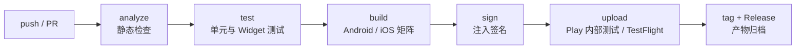

# Dart 工程化 02：CI 与自动化发布

> 后端项目的 CI 通常只要「跑测试 + 打镜像」；移动端 CI 要面对的是两套原生工具链、两种签名体系、两个应用商店审核流程，以及动辄二十分钟的构建时间。**没有 CI 的 Flutter 项目，发布日必然是全组手工劳动日**。本章把「提交代码 → 自动分析 → 自动测试 → 自动打包 → 自动上传商店」这条流水线完整搭出来。
>
> 前置知识：[[dart/4工程化/01_项目架构与规范|01 项目架构与规范]]（analysis_options 与目录结构）、[[dart/3框架/08_测试与发布|08 测试与发布]]（各平台打包命令）。

---

## 一、为什么移动端更需要 CI

| 痛点 | 手工做法 | CI 做法 |
|------|----------|---------|
| 多平台构建 | 在 Mac 上打 iOS、借 Windows 打 Android | 矩阵构建并行产出各平台产物 |
| 签名管理 | 密钥散落在个人电脑 | 密钥进 Secrets，构建时注入 |
| 上架流程 | 手工拖 IPA/AAB 到 Transporter/Play Console | Fastlane 自动上传到测试轨道 |
| 环境差异 | 本机能跑、同事机器报错 | 固定 runner 镜像，构建可复现 |
| 质量门禁 | 靠自觉跑 analyze/test | 分支保护强制 CI 通过才能合并 |
| 版本管理 | 手工改 pubspec 版本号 | 按 tag 或构建号自动递增 |

移动端 CI 的核心目标不是「炫技」，而是把**只有一台机器能完成的发布**变成**任何一台机器都能复现的流程**。



---

## 二、GitHub Actions Flutter 工作流

### 2.1 最小可用工作流

```yaml
# .github/workflows/flutter-ci.yml
name: Flutter CI
on:
  push:
    branches: [main]
  pull_request:
  workflow_dispatch:        # 允许手动触发，方便调试

jobs:
  quality:
    runs-on: ubuntu-latest
    steps:
      - uses: actions/checkout@v4

      - uses: subosito/flutter-action@v2
        with:
          channel: stable
          flutter-version: 3.24.0   # 锁定版本，避免上游更新导致构建漂移
          cache: true               # 自动缓存 Flutter SDK

      - name: 安装依赖
        run: flutter pub get

      - name: 格式检查
        run: dart format --set-exit-if-changed .

      - name: 静态分析
        run: flutter analyze --fatal-infos

      - name: 单元与 Widget 测试
        run: flutter test --coverage

      - name: 上传覆盖率报告
        uses: actions/upload-artifact@v4
        with:
          name: coverage
          path: coverage/lcov.info
          retention-days: 7
```

要点：`flutter-action` 负责安装 SDK 与缓存；`cache: true` 缓存的是 SDK 本身，pub 依赖缓存还要单独配置（见第三节）；`--fatal-infos` 让 info 级 lint 也阻断合并。

### 2.2 构建任务与质量任务分离

质量任务跑在 Ubuntu（快且便宜），构建任务按平台分派：

```yaml
  build-android:
    needs: quality                  # 质量门禁不过，不进入构建
    runs-on: ubuntu-latest
    steps:
      - uses: actions/checkout@v4
      - uses: subosito/flutter-action@v2
        with: { channel: stable, cache: true }
      - run: flutter pub get
      - run: flutter build apk --release --dart-define-from-file=config/prod.json
      # 产物上传见第十节
```

`needs: quality` 让构建任务依赖质量任务；质量不通过时构建直接跳过，节省 runner 时间。

---

## 三、缓存策略

Flutter 构建慢在四处：Flutter SDK、pub 依赖、Gradle、CocoaPods。分别缓存：

| 缓存对象 | 路径 | 键设计 | 命中收益 |
|----------|------|--------|----------|
| Flutter SDK | 由 flutter-action 管理 | channel + 版本号 | 省 1-2 分钟 |
| pub 依赖 | `~/.pub-cache` | `${{ runner.os }}-pub-${{ hashFiles('**/pubspec.lock') }}` | 省 30 秒 - 2 分钟 |
| Gradle | `~/.gradle/caches`、`~/.gradle/wrapper` | `${{ runner.os }}-gradle-${{ hashFiles('**/*.gradle*', '**/gradle-wrapper.properties') }}` | 省 2-5 分钟 |
| CocoaPods | `~/Library/Caches/CocoaPods`、`ios/Pods` | `${{ runner.os }}-pods-${{ hashFiles('**/Podfile.lock') }}` | 省 2-4 分钟 |

```yaml
      - name: 缓存 pub 依赖
        uses: actions/cache@v4
        with:
          path: ~/.pub-cache
          key: ${{ runner.os }}-pub-${{ hashFiles('**/pubspec.lock') }}
          restore-keys: ${{ runner.os }}-pub-

      - name: 缓存 Gradle
        uses: actions/cache@v4
        with:
          path: |
            ~/.gradle/caches
            ~/.gradle/wrapper
          key: ${{ runner.os }}-gradle-${{ hashFiles('**/*.gradle*', '**/gradle-wrapper.properties') }}
          restore-keys: ${{ runner.os }}-gradle-
```

缓存键的设计原则：**用锁文件哈希做主键，用前缀做降级恢复**。锁文件变化时缓存未命中，但 `restore-keys` 仍能命中旧缓存，只增量下载差异部分。

---

## 四、矩阵构建

同一套代码要产出多个 flavor（dev/staging/prod）或多个平台时，用 matrix 展开：

```yaml
jobs:
  build:
    runs-on: ${{ matrix.os }}
    strategy:
      fail-fast: false          # 一个平台失败不取消其他平台
      matrix:
        include:
          - os: ubuntu-latest
            target: apk
            flavor: prod
          - os: macos-latest
            target: ipa
            flavor: prod
    steps:
      - uses: actions/checkout@v4
      - uses: subosito/flutter-action@v2
        with: { channel: stable, cache: true }
      - run: flutter pub get
      - run: flutter build ${{ matrix.target }} --release --flavor ${{ matrix.flavor }}
```

注意：iOS 构建必须用 `macos-latest`（macOS runner 单价约为 Linux 的 10 倍），能放 Linux 的任务绝不放到 macOS 上。

---

## 五、Android 签名密钥管理

### 5.1 原则

签名密钥（keystore）是应用的身份证：**丢失无法更新已上架应用，泄露可被他人冒名发布**。密钥文件绝不入库，CI 中通过 GitHub Secrets 注入。

```bash
# 本地一次性操作：生成 keystore 并转成 base64
keytool -genkey -v -keystore release.jks -keyalg RSA -keysize 2048 \
        -validity 10000 -alias upload
base64 -w 0 release.jks > release.jks.base64
# 把 release.jks.base64 的内容粘贴到 GitHub Secret: ANDROID_KEYSTORE_BASE64
```

```yaml
      - name: 还原 Android 签名密钥
        run: |
          echo "${{ secrets.ANDROID_KEYSTORE_BASE64 }}" | base64 -d > android/app/release.jks
          cat > android/key.properties <<EOF
          storeFile=release.jks
          storePassword=${{ secrets.ANDROID_STORE_PASSWORD }}
          keyAlias=upload
          keyPassword=${{ secrets.ANDROID_KEY_PASSWORD }}
          EOF
```

```groovy
// android/app/build.gradle —— 读取 key.properties，缺失时回退 debug 签名
def keystoreProperties = new Properties()
def keystorePropertiesFile = rootProject.file('key.properties')
if (keystorePropertiesFile.exists()) {
    keystoreProperties.load(new FileInputStream(keystorePropertiesFile))
}

android {
    signingConfigs {
        release {
            keyAlias keystoreProperties['keyAlias']
            keyPassword keystoreProperties['keyPassword']
            storeFile keystoreProperties['storeFile'] ? file(keystoreProperties['storeFile']) : null
            storePassword keystoreProperties['storePassword']
        }
    }
    buildTypes {
        release {
            signingConfig signingConfigs.release
        }
    }
}
```

`android/key.properties` 与 `*.jks` 必须写进 `.gitignore`。

---

## 六、iOS 签名与 TestFlight

iOS 签名比 Android 复杂：需要 Apple 开发者账号、证书（Certificate）、描述文件（Provisioning Profile）、App ID 三者匹配。CI 中的主流方案是 **Fastlane match**——把证书与描述文件加密存放在一个私有 Git 仓库，CI 用只读部署密钥拉取。

```ruby
# ios/fastlane/Matchfile
git_url("git@github.com:your-org/certificates.git")  # 加密证书仓库
storage_mode("git")
type("appstore")                                      # 上架用描述文件
app_identifier("com.example.app")
```

```yaml
      - name: 导入签名证书
        env:
          MATCH_PASSWORD: ${{ secrets.MATCH_PASSWORD }}
          MATCH_GIT_BASIC_AUTHORIZATION: ${{ secrets.MATCH_GIT_AUTH }}
        run: |
          cd ios
          fastlane match appstore --readonly    # 只读拉取，不在 CI 中修改证书
          fastlane build_and_upload
```

`MATCH_PASSWORD` 解密证书仓库，`MATCH_GIT_BASIC_AUTHORIZATION` 提供仓库访问权限，二者都放在 Secrets。`--readonly` 保证 CI 不会意外创建新证书。

---

## 七、版本号自动递增

Flutter 版本号在 `pubspec.yaml` 的 `version: 1.2.3+45`，`+` 后是构建号（Android versionCode / iOS build number）。CI 中常用两种策略：

| 策略 | 做法 | 优点 | 缺点 |
|------|------|------|------|
| 按 run number 递增 | `flutter build apk --build-number=${{ github.run_number }}` | 全自动、永不重复 | 与人工发布版本无关 |
| 按 tag 发布 | 从 `v1.2.3` tag 提取版本号写入 pubspec | 版本与 Git 历史一致 | 需要打 tag 流程 |
| 时间戳构建号 | `--build-number=$(date +%s)` | 简单 | 数值过大，可读性差 |

```yaml
      - name: 从 tag 提取版本并构建
        if: startsWith(github.ref, 'refs/tags/v')
        run: |
          VERSION=${GITHUB_REF_NAME#v}          # v1.2.3 -> 1.2.3
          flutter build appbundle --release \
            --build-name="$VERSION" \
            --build-number="${{ github.run_number }}"
```

规则：**同一版本号只能上传一次**，商店会拒绝重复构建号；构建号必须严格递增。

---

## 八、Fastlane 简介

Fastlane 用 Ruby 把「截图、签名、打包、上传」写成脚本，是移动端发布的行业标准。

| 工具 | 作用 |
|------|------|
| `match` | 管理 iOS 证书与描述文件（加密存 Git） |
| `gym` | 构建 iOS IPA |
| `supply` | 上传 Android AAB/APK 到 Google Play |
| `pilot` | 上传 iOS 构建到 TestFlight |
| `deliver` | 上传截图、元数据与二进制到 App Store |

```ruby
# android/fastlane/Fastfile
default_platform(:android)

platform :android do
  desc "构建并上传到 Play 内部测试轨道"
  lane :internal do
    gradle(task: "clean bundleRelease")          # 产出 AAB
    supply(
      track: "internal",                         # 内部测试轨道
      aab: "app/build/outputs/bundle/release/app-release.aab",
      json_key: ENV["PLAY_JSON_KEY"],            # 服务账号 JSON
      skip_upload_metadata: true,
      skip_upload_images: true
    )
  end
end
```

```ruby
# ios/fastlane/Fastfile
default_platform(:ios)

platform :ios do
  desc "构建并上传 TestFlight"
  lane :beta do
    match(type: "appstore", readonly: true)
    gym(scheme: "Runner", export_method: "app-store")
    pilot(skip_waiting_for_build_processing: true)
  end
end
```

在 GitHub Actions 中安装 fastlane 并执行 lane：

```yaml
      - uses: ruby/setup-ruby@v1
        with: { ruby-version: "3.2", bundler-cache: true }
      - run: bundle exec fastlane android internal
```

---

## 九、Codemagic 与 GitHub Actions 对比

| 维度 | GitHub Actions | Codemagic |
|------|----------------|-----------|
| 移动端预置环境 | 需自行安装 Flutter | 原生支持，开箱即用 |
| macOS 成本 | 约 0.08 美元/分钟 | 有免费额度，超出按分钟计费 |
| 配置方式 | YAML + 社区 action | YAML + 可视化编辑器 |
| 生态整合 | 全语言通用 | 专注移动端（含商店发布 UI） |
| 自托管 runner | 支持 | 支持 |
| 适合 | 已有 GitHub 工作流、多语言仓库 | 纯移动端小团队、想少写配置 |

结论：仓库已经在 GitHub 且有多语言任务，选 GitHub Actions；团队只做 Flutter 且想省掉签名配置，Codemagic 的上手成本更低。两者都支持 Fastlane，脚本可复用。

---

## 十、构建产物上传与保留

```yaml
      - name: 上传 AAB 到 Release（tag 触发）
        uses: softprops/action-gh-release@v2
        with:
          files: build/app/outputs/bundle/release/app-release.aab

      - name: 上传构建产物为 artifact
        uses: actions/upload-artifact@v4
        with:
          name: release-artifacts
          path: |
            build/app/outputs/bundle/release/*.aab
            build/ios/ipa/*.ipa
          retention-days: 30      # 按仓库策略设置，过短不利于回溯
          if-no-files-found: error
```

产物分两类：**临时构建产物**（artifact，用于调试与人工验证，设保留期）与**发布产物**（Release asset / 商店，长期保存）。符号文件（Android 的 mapping.txt、iOS 的 dSYM）必须一并归档，否则线上崩溃无法还原堆栈。

---

## 十一、发布到内部测试轨道

```yaml
  release-android:
    needs: build-android
    runs-on: ubuntu-latest
    if: startsWith(github.ref, 'refs/tags/v')
    steps:
      - uses: actions/checkout@v4
      - uses: actions/download-artifact@v4
        with: { name: android-aab, path: build/app/outputs/bundle/release }
      - name: 上传 Play 内部测试
        env: { PLAY_JSON_KEY: "${{ secrets.PLAY_SERVICE_ACCOUNT_JSON }}" }
        run: fastlane android internal
```

发布流程建议分三档：**internal（内部测试）→ beta（封闭测试）→ production（分阶段放量）**。CI 默认只上传到 internal，人工在 Play Console 确认后逐级推进，避免自动化误操作直接影响全量用户。TestFlight 同理：CI 上传后由人工在 App Store Connect 提交审核。

---

## 常见坑

1. **缓存键不含锁文件哈希**：依赖升级后命中旧缓存，出现「本机正常 CI 报错」；用 `hashFiles` 做主键，并配置 PR 触发质量任务，避免问题到发布时才暴露。
2. **密钥打印进日志**：`echo $SECRET` 或异常堆栈会把密钥写进公开日志；用 `::add-mask::` 或直接走 action 输入。
3. **macOS runner 上跑无关任务**：成本十倍于 Linux，质量任务全部放 Ubuntu。
4. **构建号重复**：`github.run_number` 在 fork 与重跑场景下可能冲突，发布 lane 用 `run_attempt` 或递增计数。
5. **签名文件提交进仓库**：`key.properties`、`*.jks`、证书仓库必须 gitignore，密钥泄露只能吊销重发。
6. **缓存 `ios/Pods` 却忽略 `Podfile.lock` 变化**：Pod 版本漂移导致玄学链接错误；构建超时用 `timeout-minutes: 30` 兜底并加 `--verbose` 定位。

---

## 本章小结

- 移动端 CI 的独特价值：多平台矩阵、签名注入、商店自动上传、构建可复现；
- 工作流分层：quality（Linux，快）→ build（按平台）→ release（tag 触发），用 `needs` 串联；
- 缓存四件套：Flutter SDK、pub、Gradle、CocoaPods，键用锁文件哈希 + 前缀降级；
- Android 密钥用 base64 + Secrets 注入，`key.properties` 与 jks 永不入库；
- iOS 用 Fastlane match 管理证书，CI 只读拉取；
- 版本号与构建号必须单调递增，tag 发布最利于追溯；
- Fastlane 覆盖 match/gym/supply/pilot，Codemagic 适合纯移动端小团队；
- 产物与符号文件必须归档，发布默认只到内部测试轨道，生产放量由人工确认。

---

## 练习

1. **搭一条质量流水线**：为自己的 Flutter 项目创建 `.github/workflows/ci.yml`，包含格式检查、`flutter analyze --fatal-infos`、`flutter test --coverage`，并开启 PR 触发。
   - 验收：故意提交一个格式错误文件，PR 上 CI 变红；修复后变绿。
2. **缓存优化**：给工作流加上 pub 与 Gradle 缓存，记录加缓存前后同一次构建的耗时。
   - 验收：第二次运行命中缓存（日志显示 cache hit），构建时间下降 30% 以上。
3. **Android 签名构建**：生成测试 keystore，按本章方案把 base64 与密码放入 GitHub Secrets，在 CI 中构建出 release APK。
   - 验收：CI 产物可安装到真机；仓库中搜索不到 jks 内容与明文密码。
4. **版本自动递增**：配置 tag 触发的工作流，从 `v1.2.3` 提取版本号并用 `github.run_number` 作为构建号。
   - 验收：推送 tag 后产物版本号正确，重复推送同 tag 时构建号仍递增。

- 返回目录：[[dart/dart目录|Dart 教程目录]]
