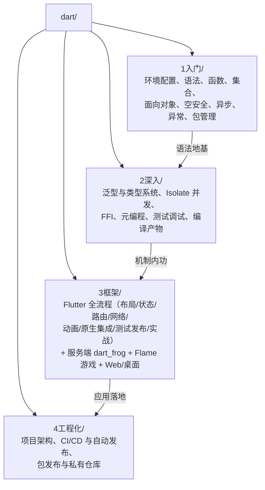

# Dart 教程

Dart 在 RootStack 体系中的定位是**跨平台应用开发语言**——它是 Flutter 的官方语言，一套代码同时构建 Android、iOS、Web、桌面与嵌入式界面；同时它也是服务端、命令行工具与云函数的现代选择。与 C 相比，Dart 把内存管理交给 GC、把并发模型收敛为 Isolate、把空指针风险消灭在编译期；与 Java 相比，它没有 JVM 的启动负担，AOT 编译产物是原生机器码，且原生支持 UI 声明式编程。

> 本教程假设读者已有 C 语言基础。全文延续 RootStack 的「与 C 对比」写法：指针、`malloc/free`、结构体、函数指针这些概念都会在 Dart 中找到对应物或被明确告知「没有这个东西，取而代之的是……」。若为纯初学者，建议先完成 [[c语言教程/c目录|C 语言教程]] 前几章再回到这里。

---

## 写在教程之前

### 本教程的定位

学完本教程你将能够：

- **移动应用开发**：用 Flutter 构建 Android/iOS 双端原生体验的应用，掌握布局、状态管理、路由、网络、动画、平台通道与发布上架全流程
- **桌面与 Web 应用**：同一套 Flutter 代码构建 Windows/macOS/Linux 桌面端与 Web 端
- **服务端与命令行**：用 Dart 写 HTTP 服务、CLI 工具与云函数，`dart compile exe` 产出免运行时依赖的单文件可执行程序
- **游戏开发**：用 Flame 引擎开发 2D 游戏，理解游戏循环、精灵、碰撞与场景管理
- **跨语言协作**：通过 FFI 调用 C/C++ 库，把 Dart 接入已有的原生代码资产

Dart 与 C 的根本差异一句话概括：**C 把内存交给程序员管，Dart 把内存交给 GC 管；C 编译到具体平台机器码需要自己处理平台差异，Dart 既能 JIT 热重载又能 AOT 原生编译；C 的 NULL 可以指向任何地方，Dart 的可空类型在编译期就堵住了空指针。**

### 不同系统安装 Dart 与 Flutter

只学 Dart 语言本身，装 Dart SDK 即可；要做 Flutter 开发，则装 Flutter SDK（它自带 Dart SDK，不要重复安装）。

| 系统 | Dart SDK | Flutter SDK |
|------|----------|-------------|
| Windows | 去 [dart.dev/get-dart](https://dart.dev/get-dart) 下载 ZIP 或用 `winget install Google.DartSDK` | 去 [flutter.dev](https://flutter.dev/) 下载压缩包，解压后将 `flutter\bin` 加入 PATH |
| Linux (Debian/Ubuntu) | `sudo apt install dart` 或按官网添加仓库 | `sudo snap install flutter --classic`，或 git clone stable 分支 |
| Linux (Arch) | `sudo pacman -S dart` | `sudo pacman -S flutter` |
| Linux (Fedora) | `sudo dnf install dart` | 手动下载或 snap |
| macOS | `brew install dart` | `brew install --cask flutter` 或下载压缩包 |

> **国内网络提示**：Flutter 依赖的 pub.dev 与 GitHub 下载在国内可能很慢。可设置镜像环境变量：
> ```bash
> export PUB_HOSTED_URL=https://pub.flutter-io.cn
> export FLUTTER_STORAGE_BASE_URL=https://storage.flutter-io.cn
> ```
> 详见 [[dart/1入门/01_环境配置|01 环境配置]]。

### 版本说明

**推荐 Dart 3.x（当前稳定版）**。Dart 3 带来的关键能力：

| 特性 | 版本 | 说明 |
|------|------|------|
| Sound Null Safety | Dart 2.12+ | 可空类型系统，编译期消除空指针异常 |
| Records | Dart 3.0+ | 轻量匿名元组，多返回值不再需要包装类 |
| Patterns | Dart 3.0+ | 模式匹配、解构、switch 表达式 |
| Class Modifiers | Dart 3.0+ | `sealed`/`base`/`final`/`interface` 精确控制继承 |
| Wasm 编译 | Dart 3.3+ | `dart compile wasm`，面向 WebAssembly 的新目标 |

教程中所有代码在 Dart 3.x 下验证通过。Flutter 部分以 Flutter 3.x stable 为准。

### 编辑器选择

| 编辑器 | 平台 | 说明 |
|--------|------|------|
| **VS Code** | 全平台 | 强烈推荐。装 Dart 与 Flutter 官方插件即可获得补全、调试、热重载、Widget 树检查 |
| Android Studio | 全平台 | Flutter 官方推荐 IDE 之一，Android 开发与模拟器管理最顺 |
| IntelliJ IDEA | 全平台 | 与 Android Studio 同源，装 Flutter 插件即可 |
| Neovim + dart-vim-plugin | 终端 | 终端党方案，配合 nvim-lspconfig 的 dartls |

详细对比见 [[dart/1入门/01_环境配置|01 环境配置]]。

---

## 教程结构



四阶段递进关系：

1. **1 入门**：从零建立 Dart 语法体系。目标是能独立写出几百行、含类与异步逻辑的程序。本阶段不依赖框架，命令行手工操作，打牢「编译-运行-排错」的底层直觉
2. **2 深入**：进入 Dart 真正的机制——类型系统、Isolate 并发模型、FFI 原生互操作、代码生成与编译产物。这一阶段决定你是「会写 Dart」还是「懂 Dart」
3. **3 框架**：以 Flutter 为主线（12 章完整覆盖 UI 开发全流程），并延伸到服务端、游戏与 Web/桌面框架。这是把语言能力转化为产品能力的阶段
4. **4 工程化**：真实项目怎么组织——分层架构、测试策略、CI/CD、包发布与多包管理。求职与团队协作的临门一脚

各阶段预计投入（按每天 2 小时估算）：

| 阶段 | 时长 | 完成标志 |
|------|------|---------|
| 入门 | 2 周 | 能写出含类、集合、异步请求的完整 CLI 程序 |
| 深入 | 3 周 | 说得清 Isolate 与线程的区别；能写 FFI 调用 C 库 |
| 框架 | 6 周 | 独立完成一个多页面、联网、有状态管理的 Flutter 应用 |
| 工程化 | 3 周 | 项目接入 CI，产出各平台安装包并自动化发布 |

---

## 推荐学习路径

### Phase 0：环境准备（2-3 天）

| 序号 | 文件 | 核心内容 |
|:----:|------|---------|
| 0 | [[dart/1入门/00_认识Dart\|00 认识 Dart]] | 语言定位、发展史、JIT/AOT、与 C/Java/TS 对比 |
| 1 | [[dart/1入门/01_环境配置\|01 环境配置]] | Dart SDK、Flutter SDK、VS Code/Android Studio、国内镜像 |

### Phase 1：语言入门（约 2 周）

| 序号 | 文件 | 核心内容 |
|:----:|------|---------|
| 2 | [[dart/1入门/02_第一个程序与命令行\|02 第一个程序]] | main、print、dart run、dart create、命名规范 |
| 3 | [[dart/1入门/03_变量与类型\|03 变量与类型]] | var/final/const/late、数值、字符串、插值、类型转换 |
| 4 | [[dart/1入门/04_运算符与流程控制\|04 运算符与流程控制]] | 运算符、if/switch、for/while、模式匹配 switch |
| 5 | [[dart/1入门/05_函数与闭包\|05 函数与闭包]] | 可选/命名参数、箭头函数、闭包、高阶函数 |
| 6 | [[dart/1入门/06_集合与迭代\|06 集合与迭代]] | List/Set/Map、展开、collection-if/for、Records |
| 7 | [[dart/1入门/07_面向对象\|07 面向对象]] | 类、构造器、继承、接口、mixin、extension |
| 8 | [[dart/1入门/08_空安全\|08 空安全]] | 可空类型、类型提升、空感知运算符、late |
| 9 | [[dart/1入门/09_异步编程\|09 异步编程]] | Future、async/await、Stream、事件循环、微任务 |
| 10 | [[dart/1入门/10_异常处理\|10 异常处理]] | Exception 与 Error、try/catch、自定义异常、Zone |
| 11 | [[dart/1入门/11_包管理与模块\|11 包管理与模块]] | pub、pubspec.yaml、import/export、part |

### Phase 2：语言深入（约 3 周）

| 序号 | 文件 | 核心内容 |
|:----:|------|---------|
| 12 | [[dart/2深入/01_泛型与类型系统\|01 泛型与类型系统]] | 泛型类/函数、边界、协变、typedef、健全性 |
| 13 | [[dart/2深入/02_Isolate与并发\|02 Isolate 与并发]] | 事件循环、Isolate、端口通信、compute |
| 14 | [[dart/2深入/03_FFI与原生交互\|03 FFI 与原生交互]] | dart:ffi、DynamicLibrary、结构体、内存管理 |
| 15 | [[dart/2深入/04_元编程与代码生成\|04 元编程与代码生成]] | 注解、build_runner、json_serializable、freezed |
| 16 | [[dart/2深入/05_测试与调试\|05 测试与调试]] | package:test、mock、覆盖率、DevTools |
| 17 | [[dart/2深入/06_编译与产物\|06 编译与产物]] | JIT/AOT、snapshot、dart compile、dart2js、Wasm |

### Phase 3：框架（约 6 周）

Flutter 主线：

| 序号 | 文件 | 核心内容 |
|:----:|------|---------|
| 18 | [[dart/3框架/01_Flutter入门\|01 Flutter 入门]] | 架构、三棵树、热重载、第一个应用 |
| 19 | [[dart/3框架/02_Widget与布局\|02 Widget 与布局]] | Stateless/Stateful、约束模型、常用布局 |
| 20 | [[dart/3框架/03_状态管理\|03 状态管理]] | setState、Provider、Riverpod、Bloc、GetX 对比 |
| 21 | [[dart/3框架/04_路由与导航\|04 路由与导航]] | Navigator、go_router、参数传递、深链 |
| 22 | [[dart/3框架/05_网络与数据持久化\|05 网络与持久化]] | http/dio、JSON、sqflite/drift、hive |
| 23 | [[dart/3框架/06_动画与自定义绘制\|06 动画与自定义绘制]] | 隐式/显式动画、AnimationController、CustomPaint |
| 24 | [[dart/3框架/07_平台通道与原生集成\|07 平台通道与原生集成]] | MethodChannel、EventChannel、插件开发 |
| 25 | [[dart/3框架/08_测试与发布\|08 测试与发布]] | Widget 测试、集成测试、各平台打包上架 |
| 26 | [[dart/3框架/09_Flutter实战项目\|09 Flutter 实战项目]] | 从 0 到 1 完整应用（架构+联网+状态+发布） |

其他框架：

| 序号 | 文件 | 核心内容 |
|:----:|------|---------|
| 27 | [[dart/3框架/10_服务端Dart\|10 服务端 Dart]] | shelf、dart_frog、数据库、Docker 部署 |
| 28 | [[dart/3框架/11_Flame游戏开发\|11 Flame 游戏开发]] | 游戏循环、精灵、碰撞、动画、发布 |
| 29 | [[dart/3框架/12_Web与桌面跨平台\|12 Web 与桌面跨平台]] | Flutter Web/桌面、Jaspr、Dart Web 编译 |

### Phase 4：工程化（约 3 周）

| 序号 | 文件 | 核心内容 |
|:----:|------|---------|
| 30 | [[dart/4工程化/01_项目架构与规范\|01 项目架构与规范]] | 分层架构、feature-first、lint 规范、依赖注入 |
| 31 | [[dart/4工程化/02_CI与自动化发布\|02 CI 与自动化发布]] | GitHub Actions、缓存、Fastlane、Codemagic |
| 32 | [[dart/4工程化/03_包发布与私有仓库\|03 包发布与私有仓库]] | pub publish、melos 多包、私有 pub 服务 |

> 全部 33 个文件（含本目录）。移动端完整实战见 [[dart/3框架/09_Flutter实战项目|09 Flutter 实战项目]]；进入多人协作前，建议配合 [[多语言工程化/多语言工程化目录|多语言工程化]] 学习跨语言构建、协议与容器编排。

---

## Dart 与 C/Java/TypeScript 快速对照（学习心法）

开始之前，先在脑中装好这张「翻译表」。后续每一章都会反复用到它：

| 你熟悉的 C | Dart 中的对应 | 一句话差异 |
|-----------|--------------|-----------|
| `int` / `double` | `int` / `double` | 数值语义类似，但 Dart 的 int 是 64 位且无平台差异 |
| `char*` + `\0` | `String` | 不可变、UTF-16 编码、无终止符 |
| `struct` + 函数 | `class` | 数据与操作绑定，支持继承与接口 |
| `malloc/free` | `new` + GC | 只管申请，回收交给 GC |
| `int* p` 指针运算 | 引用（无算术运算） | 能指向对象，不能加减移动 |
| `gcc hello.c` | `dart compile exe` | JIT 开发、AOT 发布，产物是原生机器码 |
| `make/CMake` | `pub` + `dart pub get` | 依赖自动下载，声明式管理 |
| `#define` 宏 | `const` | 有类型、有作用域、可调试 |
| 头文件 `.h` | 无 | `import` 直接读源码/库元信息 |
| 函数指针 | 函数类型 / 闭包 | 一等公民，可赋值、可传参 |
| `pthread` | `Isolate` | 不共享内存，消息传递通信，无数据竞争 |
| `NULL` 检查 | 空安全类型系统 | 可空性写进类型，编译期强制处理 |

带这张表学，每章问自己两个问题：

1. 这个概念在 C 里对应什么？
2. Dart 为什么这样设计？解决了 C 的什么痛点？

第二个问题的答案往往指向三个词：**安全**（空安全、内存安全、类型安全）、**效率**（JIT 热重载 + AOT 原生性能）、**一致**（一套语言覆盖移动/桌面/Web/服务端）。

---

## 环境自检清单

学完环境配置后，用这份清单自查。全部通过再进入后续章节：

```bash
# 1. Dart 可用
dart --version                 # 期望: Dart SDK version: 3.x.x

# 2. 能创建并运行项目
dart create -t console hello && cd hello
dart run                       # 期望输出: Hello world!

# 3. 能做静态分析
dart analyze                   # 期望: No issues found!

# 4. 能跑测试
dart test                      # 期望: All tests passed!

# 5. Flutter 可用(仅 Flutter 开发者)
flutter --version              # 期望: Flutter 3.x.x • channel stable
flutter doctor                 # 逐项检查工具链，Android/iOS 按需处理
```

---

## 常见问题 FAQ

**Q：Dart 和 Flutter 是什么关系？**
Dart 是语言，Flutter 是用 Dart 写的 UI 框架。Flutter 应用全部用 Dart 开发；学 Flutter 之前必须先掌握 Dart 语法与异步模型，否则会在 `Future`/`Stream`/状态管理面前寸步难行。

**Q：已经有 C 基础，还需要学 Java 才能学 Dart 吗？**
不需要。Dart 的 OOP 语法与 Java/C# 相近但更简洁，本教程的 OOP 章节从 struct 迁移的角度讲起，C 背景可以直接跟上。

**Q：Dart 只能写 Flutter 吗？**
不是。Dart 也能写服务端（shelf/dart_frog）、CLI 工具、脚本、游戏（Flame）甚至嵌入式。`dart compile exe` 产出的单文件可执行程序无运行时依赖，非常适合分发命令行工具。

**Q：为什么 Dart 并发用 Isolate 而不是线程？**
Dart 的设计目标是消除共享内存带来的数据竞争。Isolate 之间不共享堆内存，只能通过消息通信，从语言层面杜绝了锁与竞态问题。代价是跨 Isolate 传递大数据需要拷贝或使用 `TransferableTypedData`。

**Q：Dart 有指针吗？**
没有可运算的指针，但有引用。`dart:ffi` 提供了 `Pointer<T>` 用于和 C 互操作，那是真正的原生内存指针，但被限制在 FFI 边界内使用。

**Q：Flutter 的跨平台是真原生吗？**
Flutter 不使用平台原生控件，而是自带渲染引擎（Skia/Impeller）直接绘制像素，因此各平台外观一致、性能接近原生。代价是包体积较大，且需要平台通道才能访问原生能力。

**Q：学完能找到工作吗？**
Flutter 在国内移动端与跨端岗位有稳定需求，尤其电商、物联网、出海应用。现实基准：完整走完本教程 + 一个上架级项目 + 了解原生 Android/iOS 基础。

**Q：Dart 会被替代吗？**
Flutter 的生态与 Google 的持续投入（Impeller、Wasm、嵌入式）保证了 Dart 的长期存在。即使未来 UI 技术变化，Dart 在跨端与工具链领域的积累仍具价值。

---

## 学习方法建议

### 1. 对比式笔记

准备一个持续追加的「差异清单」，每章往里加一行：

```text
# 我的 C→Dart 差异清单(示例)
- 内存: malloc/free → GC,只管 new
- 空值: NULL 检查 → 可空类型 String?,编译期强制
- 并发: pthread → Isolate,不共享内存
- 字符串: char* → String,UTF-16,不可变
- ...
```

### 2. 代码必须亲手敲

Dart 的静态分析器（`dart analyze`）会实时指出问题，这是免费的教学材料。把教程代码改坏、读报错、修好，比复制粘贴有效得多。

### 3. 用 DartPad 当草稿纸

[dartpad.dev](https://dartpad.dev/) 是官方在线 Playground，任何「如果……会怎样」的疑问先在那里验证。

### 4. 练习节奏

每章末尾配一道练习，不要跳过。入门篇练习偏向语法自检，深入篇练习偏向工程思维。学 Flutter 阶段则把练习替换为动手小项目。

### 5. 用 Git 管理练习代码

```bash
mkdir ~/code/dart-learn && cd ~/code/dart-learn
git init
# 每章一个目录: ch02-hello/ ch03-types/ ...
git add . && git commit -m "ch02: first program"
```

---

## 术语速查表

| 术语 | 全称 | 一句话解释 |
|------|------|-----------|
| Dart VM | Dart Virtual Machine | 执行 Dart 的虚拟机，支持 JIT 与 AOT |
| JIT | Just-In-Time | 运行时编译，开发阶段热重载的基础 |
| AOT | Ahead-Of-Time | 构建时编译为原生机器码，发布阶段使用 |
| pub | Dart Package Manager | 官方包管理器，对应 npm/pip/cargo |
| pub.dev | — | 官方包仓库 |
| null safety | 空安全 | 可空性写进类型系统的机制 |
| Isolate | — | Dart 的并发单元，独立内存堆，消息通信 |
| FFI | Foreign Function Interface | 调用 C/C++ 等原生代码的接口 |
| Widget | — | Flutter 中 UI 的基本描述单元 |
| Element | — | Widget 与 RenderObject 之间的实例化桥梁 |
| RenderObject | — | 负责布局与绘制的对象 |
| Hot Reload | 热重载 | 不重启应用注入代码修改，毫秒级生效 |
| Impeller | — | Flutter 新一代渲染引擎，替代 Skia |
| mixin | — | 跨类复用实现的手段，绕开单继承限制 |
| sealed class | 密封类 | 限制子类范围的类，配合模式匹配穷尽检查 |

---

## 相关教程

| 教程 | 关系 |
|------|------|
| [[c语言教程/c目录\|C]] | 本教程的前置与对照系。内存模型、指针、结构体是理解 Dart 引用与 FFI 的背景知识 |
| [[java/java目录\|Java]] | 同为 GC 语言。Java 的 JVM 与 Dart VM、Java 的线程与 Dart 的 Isolate 都是绝佳对照 |
| [[前端开发/引导阅读\|前端开发]] | TypeScript/JavaScript 与 Dart 语法相近（Dart 早期参考 JS），前端读者可快速迁移；Flutter Web 也需要 Web 知识 |
| [[cpp教程/cpp目录\|C++]] | FFI 章节需要 C/C++ 编译知识；Flutter 引擎本身用 C++ 编写 |
| [[多语言工程化/多语言工程化目录\|多语言工程化]] | Flutter 项目常与后端（Java/Go/Python）协作，接口契约、容器化与 CI 是进阶必备 |
| [[数据结构/DSA学习路线\|DSA 学习路线]] | Dart 集合框架是数据结构的具体实现；刷题可用 Dart |

---

## 外部资源

- [Dart 官网](https://dart.dev/) — 语言官方文档与 codelab
- [Dart 中文文档](https://dart.cn/) — 官方中文站
- [Flutter 官网](https://flutter.dev/) — 框架官方文档
- [Flutter 中文文档](https://docs.flutter.cn/) — 官方中文站
- [pub.dev](https://pub.dev/) — Dart/Flutter 包仓库
- [DartPad](https://dartpad.dev/) — 在线 Playground
- [Effective Dart](https://dart.dev/effective-dart) — 官方风格指南，工程化篇会引用
- [Flutter Gallery](https://gallery.flutter.dev/) — 官方组件示例集

---

## 本目录的写作约定

1. **命名**：文件名格式 `NN_主题.md`，编号即推荐阅读顺序；中文标题、下划线分隔
2. **对比表**：凡引入新概念必配「与 C 对比」表格，延续 RootStack 风格
3. **图形**：架构与流程一律使用 mermaid 代码块，不使用字符画
4. **链接**：站内互引用 Obsidian wiki 链接 `[[路径|显示名]]`，外部资源用标准 markdown 链接
5. **练习**：基础知识章节末尾固定小节，每章一道独立题目，入门篇偏语法自检、深入篇偏工程思维
6. **代码**：所有示例完整可运行、带中文注释，在 Dart 3.x 下验证通过

---

## 下一步

从 [[dart/1入门/00_认识Dart|00 认识 Dart]] 开始了解这门语言的来龙去脉；如果你已经迫不及待想跑代码，直接跳到 [[dart/1入门/01_环境配置|01 环境配置]]，装好 SDK 后用一个 `dart create` 开始。

> 移动开发与后端协作的交叉内容见 [[多语言工程化/多语言工程化目录|多语言工程化]]；Flutter 与原生平台的边界问题在 [[dart/3框架/07_平台通道与原生集成|07 平台通道与原生集成]] 展开。
