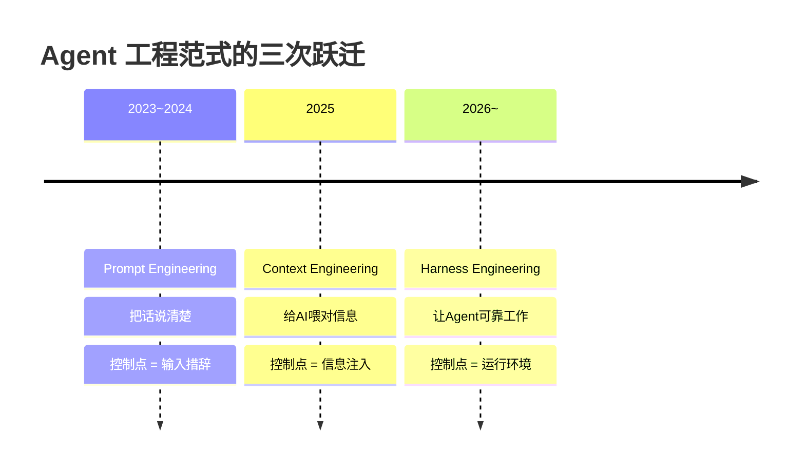
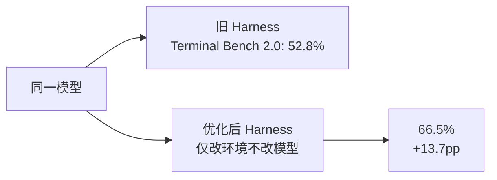
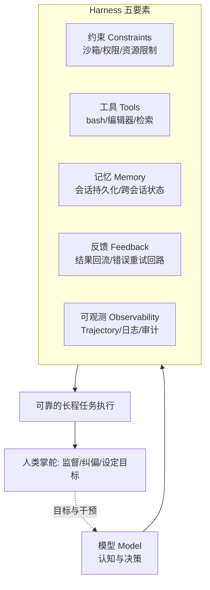
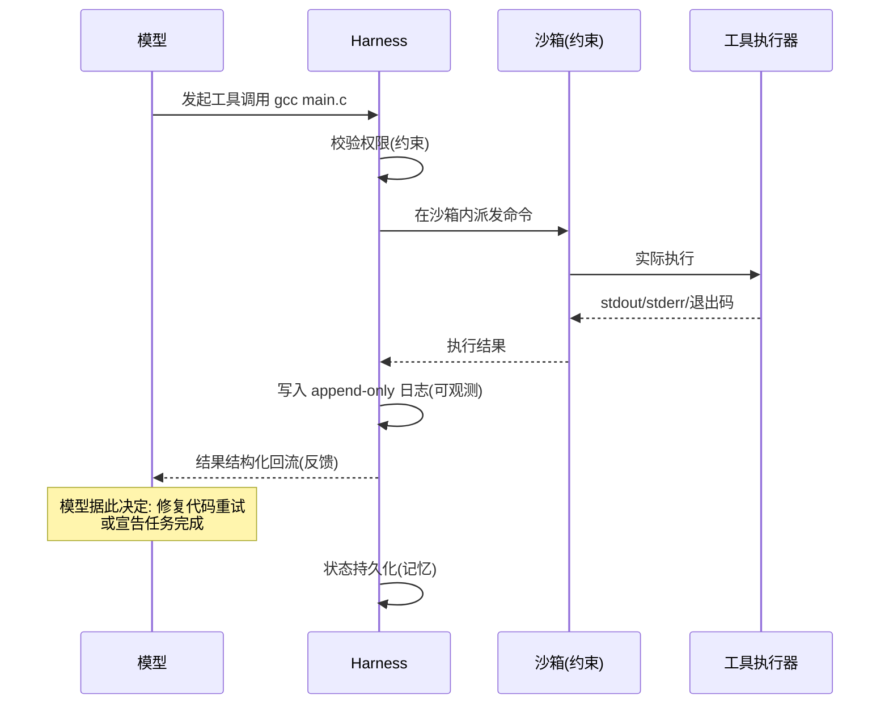

# 01 - Agent 工程范式的三次跃迁

> 本章是整个 DeepSeek Harness 教程库的认知地基。在触碰任何 dsh 代码之前，先回答一个问题：
> 为什么 2026 年的行业共识是——**提升 Agent 可靠性的瓶颈不在模型智能，而在运行环境**？
>
> 论文与框架背景见 [[deepseek-harness/1认知/03-Cordis论文精读|Cordis 论文精读]]。

---

## 目录

1. [三次跃迁全景](#1-三次跃迁全景)
2. [范式一：Prompt Engineering（2023~2024）](#2-范式一prompt-engineering20232024)
3. [范式二：Context Engineering（2025）](#3-范式二context-engineering2025)
4. [范式三：Harness Engineering（2026~）](#4-范式三harness-engineering2026)
5. [行业证据：两个关键实验](#5-行业证据两个关键实验)
6. [为什么瓶颈在基础设施](#6-为什么瓶颈在基础设施)
7. [Harness 的组成要素分解](#7-harness-的组成要素分解)
8bis. [一个具体例子: 同一任务在三个范式下的做法](#8bis-一个具体例子同一任务在三个范式下的做法)
9. [操作系统类比：给 C/C++ 读者的地图](#8-操作系统类比给-cc-读者的地图)
10. [自检: 你现在的项目处在哪个范式](#9bis-自检你现在的项目处在哪个范式)
11. [本章小结](#10-本章小结)

---

## 1. 三次跃迁全景

从 ChatGPT 引爆公众视野到今天，"如何让 AI 把事做对"这个问题，经历了三个阶段的范式迁移。每一次迁移都不是推翻前一次，而是**在前者的基础上把控制点向外推一层**：



用一句话概括三者关系：

- **Prompt Engineering** 解决"怎么问"；
- **Context Engineering** 解决"给它看什么"；
- **Harness Engineering** 解决"让它在什么环境里干活"。

一个来自系统编程的类比：Prompt Engineering 像是精心构造一次函数调用的参数；Context Engineering 像是为进程准备好正确的输入文件和环境变量；Harness Engineering 则像是设计操作系统本身——进程调度、资源约束、信号处理、崩溃恢复。前两者假设"程序本身够好"，第三者承认"程序会犯错，环境必须兜住错误"。

---

## 2. 范式一：Prompt Engineering（2023~2024）

### 2.1 核心思想

模型能力固定，输出质量取决于**输入措辞的质量**。同样一个问题，"帮我写个排序"和"请用 C++17 写一个泛型的快速排序，要求异常安全、附单元测试"，产出天差地别。

这个阶段积累了一整套"措辞工艺"：

- 角色设定（"你是一位资深 C++ 工程师……"）
- Few-shot 示例（给两三个输入输出样例）
- 思维链引导（"请一步一步思考"）
- 输出格式约束（"以 JSON 格式返回"）
- 负向指令与强调（"不要编造""这一点非常重要"）

### 2.2 核心问题表

| 维度 | Prompt Engineering 阶段的状况 |
|------|-------------------------------|
| 交互模式 | 一问一答，单轮为主，对话式补充 |
| 核心问题 | 如何把需求翻译成模型能正确理解的措辞 |
| 工程形态 | Prompt 模板、提示词库、咒语合集 |
| 质量评估 | 人工试错，凭手感迭代 |
| 失败归因 | "提示词没写好"，继续改措辞 |

### 2.3 代表技术

| 技术 | 说明 | 典型残留（至今仍有效） |
|------|------|------------------------|
| Few-shot prompting | 在输入中附带少量示例 | 仍是格式约束的首选手段 |
| Chain-of-Thought | 引导模型显式推理步骤 | 已内化为现代模型的默认行为 |
| 结构化输出约束 | 要求 JSON/YAML 等格式 | 演化为 function calling 的 schema 约束 |
| 角色扮演设定 | 为模型指定身份与语气 | 现在沉淀为 system prompt 的固定部分 |

### 2.4 局限与被取代的原因

Prompt Engineering 的根本局限在于：**它只能控制一次函数调用，无法控制一个任务**。

具体表现为三堵墙：

1. **上下文窗口墙**。再精妙的措辞也无法绕过模型"看不见"的问题——模型不知道你的代码库里有什么、不知道上一轮任务的中间产物。知识不在 prompt 里，措辞再好也没用。
2. **单轮交互墙**。真实任务是长程的：写代码要编译、跑测试、看报错、修改、再编译。一问一答的模式里，这些反馈循环全靠人肉搬运。
3. **不可组合墙**。Prompt 是自然语言，没有类型、没有接口契约、无法像模块一样组合复用。一百个任务就要维护一百份"咒语"，工程上不可扩展。

于是问题从"怎么说"变成了"喂什么"——范式迁移发生。

---

## 3. 范式二：Context Engineering（2025）

### 3.1 核心思想

既然模型的表现取决于它"看到"什么，那就把工程精力放在**信息的检索、筛选、组装与注入**上。Context Engineering 的典型工作：构建 RAG 管线、管理长上下文、压缩历史对话、为不同任务动态拼装信息包。

如果说 Prompt Engineering 是手工调配一份输入，Context Engineering 就是建了一条**输入装配流水线**。

### 3.2 核心问题表

| 维度 | Context Engineering 阶段的状况 |
|------|-------------------------------|
| 交互模式 | 多轮 + 外部知识注入，但仍以"应答"为中心 |
| 核心问题 | 如何让正确的信息在正确的时机进入上下文窗口 |
| 工程形态 | RAG 管线、向量数据库、上下文压缩、记忆系统 |
| 质量评估 | 检索命中率、答案忠实度等离线指标 |
| 失败归因 | "检索没命中""上下文塞错了东西" |

### 3.3 代表技术

| 技术 | 说明 |
|------|------|
| RAG | 向量检索 + 文档切片，把外部知识注入上下文 |
| 长上下文窗口 | 从 8K 到百万 token，"能塞下"不再是第一瓶颈 |
| 上下文压缩 | 历史摘要、滑动窗口，对抗注意力稀释 |
| Memory 系统 | 跨会话记忆存储与召回 |
| Function Calling | 模型可请求外部数据，由框架取回后再注入 |

### 3.4 局限与被取代的原因

Context Engineering 把"喂数据"做成了工程，但它仍然隐含一个前提：**人是执行主体，模型是应答机**。人拆解任务、人调用工具、人验证结果、人在出错时收拾残局。模型只是这条流水线上最聪明的一环，而不是驱动整条流水线的引擎。

当行业想让模型直接承担完整任务时——"把这个仓库的登录模块重构掉"——Context Engineering 显得力不从心：

1. **没有行动闭环**。检索能提供信息，但不能执行动作。模型说"应该运行 `make` 并检查报错"，然后呢？需要有人真的去跑。
2. **没有错误反馈回路**。编译失败、测试挂掉的信号需要自动回到模型面前，形成"行动 → 观察 → 修正"的循环，而不是每次都等人转述。
3. **没有约束与安全边界**。当模型可以执行动作时，"它能删库吗""它能在沙箱外跑吗"成为首要问题，这已经超出信息工程的范畴。

问题的形状变了：从"如何让模型知道"变成"**如何让模型在一个受控的环境里持续、可靠地做事**"。这就是 Harness Engineering。

---

## 4. 范式三：Harness Engineering（2026~）

### 4.1 核心思想

Harness，直译"马具/缰绳"——不是替马奔跑，而是让马的力量被导向正确的方向。Agent Harness 是包裹模型的完整运行环境：

```text
Agent = Model + Harness
```

模型负责认知与决策，Harness 负责其余的一切：把决策变成安全的动作、把动作的结果变回模型可见的反馈、在模型犯错时兜底、在人需要时让过程透明可查。**人类掌舵，Agent 执行**——人的角色从"操作员"上移到"监督者与目标设定者"。

### 4.2 核心问题表

| 维度 | Harness Engineering 阶段的状况 |
|------|-------------------------------|
| 交互模式 | 长程自主任务，人在环上监督而非逐步指挥 |
| 核心问题 | 如何用约束、工具、反馈回路让 Agent 可靠完成长程任务 |
| 工程形态 | Agent Harness、插件化运行时、沙箱、Trajectory 追踪 |
| 质量评估 | 端到端基准（Terminal Bench 等）、任务完成率 |
| 失败归因 | 环境缺陷：缺工具、缺约束、缺反馈、不可观测 |

注意最后一行的变化：失败不再首先归因于"提示词不好"或"检索不准"，而是**环境的系统性缺陷**。这是范式成熟的标志——正如软件工程的成熟不是程序员更聪明了，而是有了构建系统、CI 和版本控制。

### 4.3 代表技术

| 技术 | 说明 | 与操作系统的类比 |
|------|------|------------------|
| 工具沙箱 | 受控执行环境，权限最小化 | 进程隔离与 capability 机制 |
| 反馈回路 | 工具结果自动回流至模型上下文 | 信号与中断处理 |
| 插件化架构 | 能力以插件形式动态装卸 | 用户态服务 / 内核模块 |
| Trajectory 可观测 | 完整记录思维链、工具调用轨迹 | strace / 系统日志 |
| 会话持久化 | append-only 日志，可回放审计 | WAL（预写日志） |
| 分层配置 | Profile/bundle/patch 组合出运行环境 | 编译配置矩阵 |

### 4.4 与前两代的关系

Harness Engineering 不否定前两代，而是**收编**它们：

- Prompt 变成 Harness 中 system prompt 构造的一个环节；
- Context 管理变成 Harness 内部的记忆与上下文组装子系统；
- 新增的是它们都不具备的部分：**动作执行、约束边界、反馈回路、可观测性**。

---

## 5. 行业证据：两个关键实验

范式迁移不是概念游戏，有两个被广泛引用的行业实验作为实证支撑。

### 5.1 OpenAI：百万行代码全 Agent 实验

OpenAI 开展了让 Agent 承接百万行级别代码库维护与开发的实验。结论的核心启示在于：当任务规模大到人类工程师无法逐行把关时，决定成败的不是模型"聪不聪明"，而是**支撑它的运行环境是否完备**——工具链是否顺畅、错误能否快速回流、变更是否可控可回滚。模型能力的边际收益，在长程任务中迅速让位于环境质量的边际收益。

### 5.2 LangChain：Terminal Bench 2.0 从 52.8% 到 66.5%

这是更具说服力的对照实验：LangChain 团队针对 Terminal Bench 2.0 基准做了一系列优化，但**模型完全没有更换**——只优化了 Agent 的外部驾驭环境（工具定义、上下文管理、错误反馈方式等），成绩就从 52.8% 提升到 66.5%，提升近 14 个百分点。

用 C/C++ 的语言重述这个实验：同一个 CPU（模型），换了一套更好的主板、内存和散热（Harness），跑分提升 14%。这说明此前的相当一部分"模型不行"，其实是"Harness 不行"——模型的能力被糟糕的环境持续漏损掉了。



### 5.3 两个实验的共同结论

> 当模型能力进入平台期，**环境工程成为可靠性提升的主战场**。这正是 DeepSeek 于 2026 年 8 月开源 Agent Harness（dsh）、并把 Cordis 论文一并公开的行业背景。

---

## 6. 为什么瓶颈在基础设施

为什么会出现"瓶颈在基础设施不在模型智能"的局面？本节给出三层解释。

### 6.1 错误率的长程放大效应

设单步任务成功率为 p，n 步长程任务的全成功率约为 p^n。这是一个残酷的指数衰减：

| 单步成功率 p | 10 步任务 | 50 步任务 | 100 步任务 |
|--------------|-----------|-----------|------------|
| 99% | 90.4% | 60.5% | 36.6% |
| 95% | 59.9% | 7.7% | 0.6% |
| 90% | 34.9% | 0.5% | 约 0% |

模型每提升一个九，需要预训练规模的投入；而 Harness 通过**错误检测与自动重试**，可以把"带错前进"变成"发现即纠正"，等效于大幅拉高有效 p 值。例如：命令执行失败立即把 stderr 回流给模型修正，一步 95% 的操作经过两次纠错机会，等效成功率约 99.9%。**Harness 是用基础设施换模型智能的交易，且汇率极其划算。**

### 6.2 模型改进的经济学不对称

- 改进模型：预训练/后训练成本巨大，周期以月计，且能力提升对所有任务均匀分布（多数场景用不满）；
- 改进 Harness：普通工程手段，周期以天计，收益直接命中当前任务的具体失败模式。

LangChain 实验（+13.7pp，零模型改动）就是这种不对称的极致体现。

### 6.3 能力的"最后一公里"在环境侧

模型已经"知道"如何写代码、如何调试，但它天然缺乏：持久的执行现场（shell、文件系统）、可靠的记忆、权限边界、以及把失败转化为学习的机制。这些全是环境侧的设施。就像再强的算法也跑在没有操作系统的裸机上一样——**模型智能需要一层"Agent 操作系统"才能兑现为生产力**。dsh 与 Cordis 正是对这一层的开源回答。

---

## 7. Harness 的组成要素分解

一个完整的 Agent Harness 由五个要素构成。后续章节将反复回到这张分解图，dsh 的每个特性都能映射到其中一项或多项。



逐项说明：

| 要素 | 职责 | 缺失时的典型症状 |
|------|------|------------------|
| 约束 | 划定动作边界：能访问哪些文件、能执行哪些命令、消耗多少资源 | Agent 一失手就删库；无法放心给自主权 |
| 工具 | 把模型意图转化为真实动作的标准接口 | 模型只能说不能做，沦为聊天机器人 |
| 记忆 | 任务状态与历史的持久化；断点续作的基础 | 会话一断从头再来；长任务必然遗忘 |
| 反馈 | 动作结果（含错误）结构化回流，形成行动-观察循环 | 模型盲飞：执行了却不知道成败 |
| 可观测 | 全程留痕，供人审查与事后分析 | 出错无法定位；不敢单位内部署 |

对照检查 dsh 的六大特性（详见 [[deepseek-harness/1认知/02-DeepSeek-Harness全景|DeepSeek-Harness 全景]]）："一切皆插件"对应工具与约束的插件化供给，"运行有迹可循"对应可观测（append-only 会话日志与 Trajectory 视图），"无特权内核"对应约束的可逆化管理——要素理论与产品实现严丝合缝。

### 7bis. 五要素如何协作：一次工具调用的完整旅程

五要素不是并列的清单，而是一个咬合的循环。以 Agent 执行 `gcc main.c` 为例：



读图要点：

1. **模型从不直接触碰真实系统**——它只与 Harness 对话，这是所有安全性的来源；
2. **反馈是结构化的**：退出码、stderr 被整理后回流，而非原始倾倒，这直接影响模型的下一步决策质量（LangChain 优化的一大块正在于此）；
3. **每一步都留下不可篡改的记录**：出问题时 Trajectory 可以逐帧回放；
4. **循环的终止条件由模型判断、由人监督**——这就是"人类掌舵，Agent 执行"在机制层的含义。

---

## 8. 操作系统类比：给 C/C++ 读者的地图

本教程库的读者多有 C/C++ 背景，因此全系列采用一张持续的类比地图。这张表值得收藏，后续每一章都会引用。

| 操作系统世界 | Harness 世界 | 对应的 dsh/Cordis 概念 |
|--------------|--------------|------------------------|
| 微内核 | 只保留最核心调度能力的 Agent 运行时 | Cordis 内核（见 [[deepseek-harness/2架构/01-Cordis内核原理|Cordis 内核原理]]） |
| 用户态服务/守护进程 | 以插件形式加载的能力单元 | Cordis 插件（一切皆插件） |
| IPC（进程间通信） | 插件间解耦通信 | Cordis 事件总线 |
| `open()`/`close()` 与 RAII | 注册资源并在生命周期结束时自动释放 | 可逆副作用模型 |
| 动态链接 `dlopen`/`dlclose` | 插件运行时加载与卸载 | Fiber 的装载/卸载/热重载 |
| strace / 系统日志 | Agent 行为全程追踪 | Trajectory 视图 |
| capability（权能）机制 | 细粒度动作授权 | 无特权内核下的注册即撤销 |
| 编译配置矩阵 | 多套运行环境一键切换 | Profile + bundle + patch 分层配置 |

两点提醒，避免类比误导：

1. **类比的边界**：Cordis 的"Fiber"不是协程（不涉及并发调度），而是"带完整生命周期的服务容器"——更接近一个自带构造/析构协议、且析构严格逆序执行的对象图管理器。C++ 读者可理解为"框架托管的 RAII 对象树"。
2. **类比的深意**：微内核的设计哲学（内核极小、机制与策略分离、故障隔离在用户态）正是 dsh "无特权内核：一切注册皆可逆副作用，卸载即撤销"的思想源头。这不是巧合，而是有论文背书的刻意设计——下一章 [[deepseek-harness/1认知/03-Cordis论文精读|Cordis 论文精读]] 将展开。

---

## 8bis. 一个具体例子：同一任务在三个范式下的做法

抽象的范式讨论容易飘，用一个贯穿例子落地：**任务——"修复仓库里所有编译警告"。**

### 8bis.1 Prompt Engineering 的做法（2023）

人把编译器输出贴进对话框：

```text
以下是 gcc -Wall 的输出, 共 47 条警告:
warning: unused variable 'x' [-Wunused-variable] ...
请告诉我每一条该怎么改。
```

模型逐条给出修改建议。然后呢？人手动打开每个文件、手动修改、重新编译、发现新警告、再贴回去……人是循环体，模型只是建议生成器。任务规模一大（比如 200 个文件），人工搬运成本超过修复成本。

### 8bis.2 Context Engineering 的做法（2025）

搭一条 RAG 管线：把代码库切片入向量库，问题来了先检索相关片段再让模型作答。信息获取效率大幅提升，但执行环节依旧缺位——模型说"应把 `x` 删除"，删除这个动作仍由人完成。反馈回路依然靠人肉：编译是否通过、警告是否减少，都要人看一眼再转述给模型。

### 8bis.3 Harness Engineering 的做法（2026）

```text
用户: 修掉所有编译警告, 完成后跑通全部测试。
Agent Harness:
  1. 模型调用 bash 工具执行 gcc -Wall          <- 工具
  2. stderr 自动回流至模型上下文               <- 反馈回路
  3. 模型调用编辑工具修改源文件                 <- 工具
  4. 重新编译验证, 循环直到警告清零             <- 行动闭环
  5. 全程记录于 append-only 会话日志           <- 可观测
  6. 命令在沙箱内执行, 禁止触碰指定目录        <- 约束
```

人只做两件事：设定目标、审查 Trajectory。中间的数十轮"执行-观察-修正"由 Harness 驱动模型自主完成。

### 8bis.4 三种做法的对照表

| 维度 | Prompt 做法 | Context 做法 | Harness 做法 |
|------|-------------|--------------|--------------|
| 谁是执行主体 | 人 | 人 | Agent（人监督） |
| 反馈回路 | 人肉搬运 | 半自动检索 | 全自动回流 |
| 单次可承接规模 | 数条警告 | 信息层面不限 | 整个仓库 |
| 失败后的行为 | 等下一条 prompt | 等更好的检索 | 自动重试/修正 |
| 人的单位时间产出 | 低 | 中 | 高 |

这个例子也解释了为什么三次跃迁是叠加而非替换：Harness 方案内部依然包含精心构造的 system prompt（范式一的遗产）和上下文组装逻辑（范式二的遗产），只是它们被收编为 Harness 的内部组件。

---

## 9bis. 自检：你现在的项目处在哪个范式

用以下问题给自己的 Agent 项目做范式体检，每答一个"是"记一分：

| 问题 | 对应范式短板 |
|------|--------------|
| 模型的输出需要人工复制粘贴才能生效？ | 还在范式一 |
| 任务失败后需要人重新描述上下文才能继续？ | 反馈回路缺失 |
| 无法回答"Agent 上一步为什么这么做"？ | 可观测性缺失 |
| 不敢让 Agent 无人值守运行超过五分钟？ | 约束缺失 |
| 会话中断后一切从头开始？ | 记忆缺失 |
| 换个模型要改大量提示词和胶水代码？ | Harness 与模型耦合过紧 |

- 0~1 分：已具备 Harness 形态，可进入本库架构篇；
- 2~3 分：处于范式二向三过渡期，重点补反馈回路与可观测性；
- 4 分以上：仍是范式一/二形态，建议从第一章第 7 节的五要素清单逐项补课。

这份自检同时也是第 4 章"设计自己的 Harness"的需求分析模板雏形——范式判断直接转化为设计需求。

---

## 10. 本章小结

- 三次跃迁的控制点不断外移：输入措辞 → 信息注入 → 运行环境；
- Prompt Engineering 解决"怎么说"，被上下文窗口与组合性需求终结；
- Context Engineering 解决"看什么"，被行动闭环的需求终结；
- Harness Engineering 解决"在哪干、怎么可靠地干"，核心是约束、工具、记忆、反馈、可观测五要素；
- LangChain 实验（52.8%→66.5%，零模型改动）与 OpenAI 百万行代码实验共同证明：瓶颈在基础设施；
- 错误率指数放大效应解释了为什么环境侧的小改进胜过模型侧的大投入；
- 对 C/C++ 读者：Harness 之于模型，约等于操作系统之于裸机程序。

下一章我们把镜头对准本次范式跃迁中最重要的开源作品之一——DeepSeek Harness 本体，厘清它是什么、不是什么、与竞品的坐标差异：[[deepseek-harness/1认知/02-DeepSeek-Harness全景|DeepSeek-Harness 全景]]。
