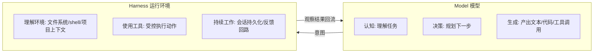
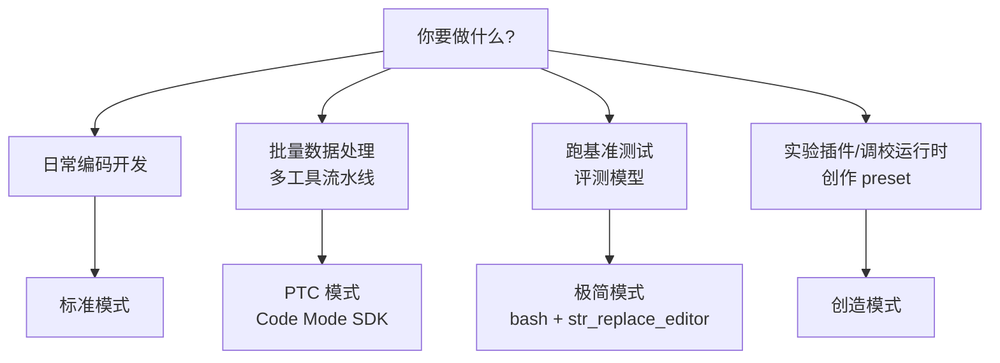
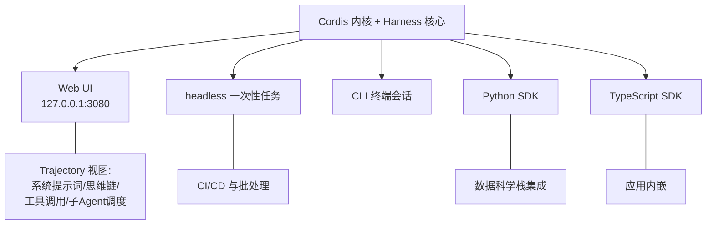
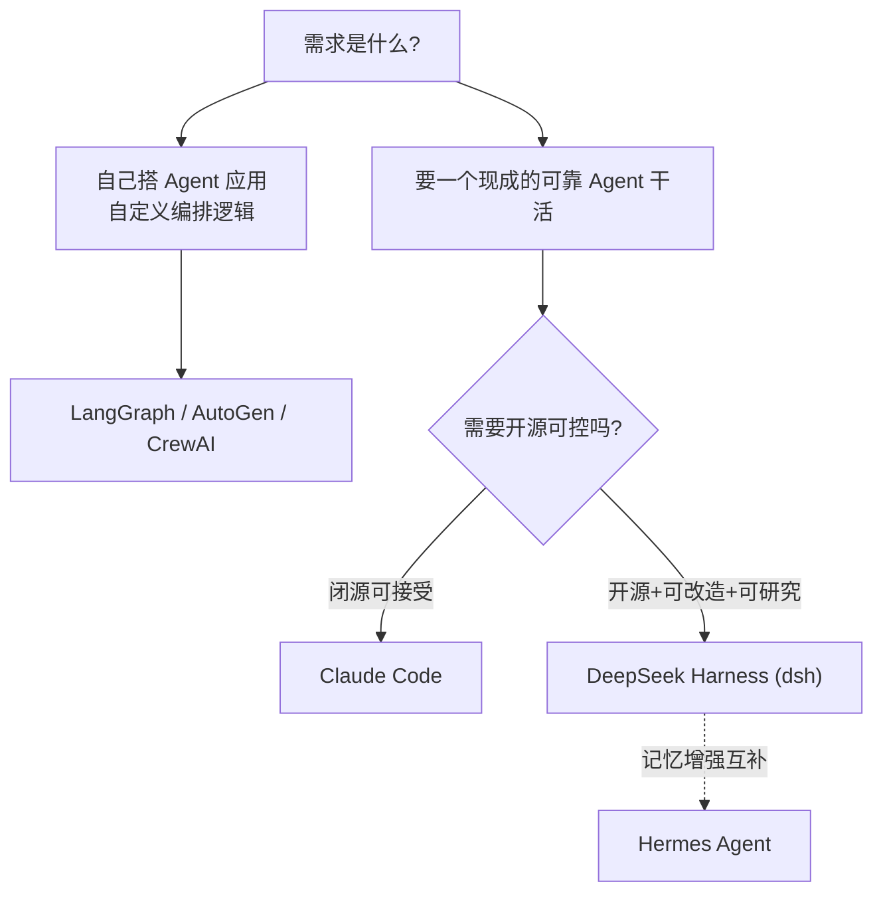
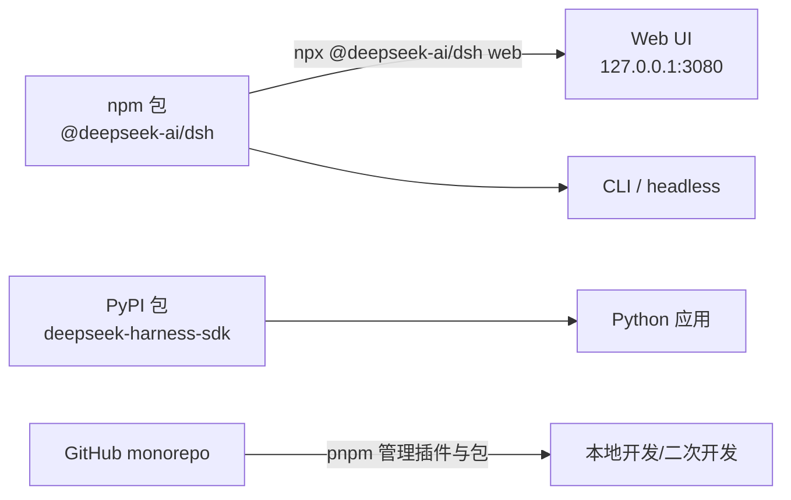

# 02 - DeepSeek Harness 全景

> 本章建立 dsh 在 Agent 工具生态中的精确坐标：它是什么、不是什么、怎么用、与竞品差在哪。
> 范式背景见 [[deepseek-harness/1认知/01-Agent工程范式的三次跃迁|Agent工程范式的三次跃迁]]，底层内核见 [[deepseek-harness/2架构/01-Cordis内核原理|Cordis 内核原理]]。
> 快速上手请直接看速查 [[dsh|dsh.md]]。

---

## 目录

1. [基本信息](#1-基本信息)
2. [dsh 是什么/不是什么](#2-dsh-是什么不是什么)
3. [Agent = Model + Harness 公式详解](#3-agent--model--harness-公式详解)
4. [四种运行模式](#4-四种运行模式)
5. [五种使用形态](#5-五种使用形态)
6. [六大特性逐一展开](#6-六大特性逐一展开)
7. [与竞品的定位差异](#7-与竞品的定位差异)
8. [开源信息与工程结构](#8-开源信息与工程结构)
9. [选型决策：什么人选/不选 dsh](#9-选型决策什么人选不选-dsh)
10. [本章小结](#10-本章小结)

---

## 1. 基本信息

| 项目 | 内容 |
|------|------|
| 名称 | DeepSeek Harness（命令行名 `dsh`） |
| 开发方 | DeepSeek AI |
| 开源时间 | 2026 年 8 月 |
| 协议 | MIT |
| 语言 | TypeScript |
| 阶段 | 开发者预览（developer preview），API 可能存在破坏性变更 |
| 安装 | `npm` 包 `@deepseek-ai/dsh`；Python 侧另有 `pip install deepseek-harness-sdk` |
| 快速启动 | `npx @deepseek-ai/dsh web` 启动 Web UI（127.0.0.1:3080） |
| 源码 | github.com/deepseek-ai/deepseek-harness（约 189k stars） |
| 底层框架 | Cordis（github.com/cordiverse/cordis），设计对应论文《A Programming Paradigm for Spatiotemporal Composability》 |

---

## 2. dsh 是什么/不是什么

定义边界比罗列功能更重要。dsh 的生态定位常被误解，本节正面澄清。

### 2.1 dsh 是什么

**dsh 是一个完整的 Agent Harness 层**——包裹模型的运行环境，提供工具执行、约束管理、会话持久化、可观测性、插件化扩展等全部"模型之外"的能力。它本身可以作为一个产品直接使用（打开 Web UI 就是一个编码 Agent），也可以被改造和扩展（一切皆插件）。

### 2.2 dsh 不是什么

| 常见误解 | 澄清 |
|----------|------|
| "dsh 是个调用大模型的 SDK" | 不是。SDK 只是它的接入形态之一；它的主体是完整运行时环境 |
| "dsh 是 LangChain 那样的构建库" | 不是。LangChain 类库给你积木让你自己搭应用；dsh 给你的是一台已经能跑的整车，且允许你改装 |
| "dsh 是某个模型的专属客户端" | 不是。它模型无关，DeepSeek API key 即用，也支持 OpenAI 兼容端点 |
| "dsh 只是个聊天界面" | 不是。Web UI 只是五种形态中最直观的一种 |

### 2.3 一句话坐标

> 用操作系统的话说：LangGraph/AutoGen/CrewAI 是**应用开发框架**（类似 Qt/Boost），而 dsh 是**操作系统级 Harness**（类似一个完整的发行版）——你既可以直接用它干活，也可以研究它、改装它、以它为蓝本造自己的。
>
> 与闭源对标 Claude Code 的关系则是：同类产品，但 dsh 开源、可审查、可魔改，且底层有论文背书的设计。

---

## 3. Agent = Model + Harness 公式详解

第一章给出了这个公式，本章把它拆开看清楚 Harness 到底"给予"了什么。

### 3.1 公式两侧的分工



裸模型只有左侧一列。右侧三列全部由 Harness 补齐：

1. **理解环境的能力**。模型权重里没有你的代码库、你的 shell 状态、你的项目约定。Harness 把这些环境信息组织后注入上下文，让模型的每次决策都建立在真实世界状态之上。
2. **使用工具的能力**。把"我应该看看这个文件"变成一次受控的文件读取，把"改这一行"变成真实的编辑操作。工具调用是意图到现实的桥梁，而权限约束、沙箱隔离都在这一层落实。
3. **持续工作的能力**。真实任务是长程的：编译失败要重试、测试挂了要修、上下文超限要压缩、进程重启要续作。Harness 通过 append-only 会话日志、反馈回路和状态管理，把单步智能串成长程可靠。

### 3.2 为什么这个公式对用户重要

判断任何一个 Agent 产品时都可以套用这个公式提问："除了模型，它的 Harness 提供了什么？"很多产品的差异不在接入的模型，而在 Harness 层的功力——这正是 LangChain 实验中 52.8%→66.5% 差距的全部来源。dsh 把这层完整开源，等于公开了自己的"主板设计图"。

---

## 4. 四种运行模式

dsh 支持四种运行模式，对应从生产到研究的不同场景。这是理解 dsh 定位的关键切面——一个 Harness 同时服务"干活的人"和"做研究的人"。

| 模式 | 名称 | 组成 | 适用场景 |
|------|------|------|----------|
| 标准模式 | Standard | 完整编码 Agent：全套工具、约束、可观测性 | 日常开发：在真实仓库里写码、调试、重构 |
| PTC 模式 | Code Mode SDK | 模型编写 TypeScript 程序，用程序组合多个工具调用 | 复杂数据处理：批量变换、多工具流水线，逻辑写在代码里比多轮对话更高效可靠 |
| 极简模式 | Minimal | 仅 bash + str_replace_editor 两个工具 | 基准测试：最小化环境变量干扰，公平评测模型能力 |
| 创造模式 | Creative | 运行时检查 + 插件实验 + preset 创作 | 探索与元开发：试验新插件、调校运行时行为、创作可分享的 preset 配置 |

几点解读：

- **极简模式的存在本身就是范式宣言**。基准测试要求控制变量：给模型两个最朴素工具，测出的才是模型能力而非 Harness 加持。这与第一章 Terminal Bench 讨论呼应——评测时必须区分"模型分"与"Harness 加成分"。
- **PTC 模式是对话式工具调用的工程化升级**。传统模式下模型每轮发一个工具调用，十步数据变换就是十轮往返；PTC 让模型直接写一段 TS 程序一次性表达整个流程——类似从逐条敲 shell 命令升级为写脚本。
- **创造模式暴露了 dsh 的野心**：它不只是让人用，还让人改。preset 创作意味着运行环境的配置本身成为可创作的工件。

模式选择的决策路径：



一个实用建议：如果你在标准模式下观察到模型为完成某类任务总是重复同一串工具调用，那就是迁移到 PTC 模式的信号——把这段固定流程显式化为代码，可靠性与速度都会提升。

---

## 5. 五种使用形态

同一内核，五种入口。选择依据是集成深度而非能力差异。

| 形态 | 启动方式 | 典型场景 |
|------|----------|----------|
| Web UI | `npx @deepseek-ai/dsh web`（127.0.0.1:3080） | 交互式开发；Trajectory 可视化查看思维链与工具调用 |
| headless 一次性任务 | 无界面模式执行单条任务 | CI 流水线、定时批处理、脚本化自动化 |
| CLI | 终端交互会话 | 服务器环境、远程开发、偏好终端工作流者 |
| Python SDK | `pip install deepseek-harness-sdk` | 数据科学工作流嵌入、Python 技术栈集成 |
| TypeScript SDK | npm 引入 `@deepseek-ai/dsh` | Node.js 应用内嵌 Agent 能力、深度定制 |

形态之间的关系图：



注意 Web UI 的 Trajectory 视图值得单独强调：它可以查看到系统提示词、模型思维链、每一次工具调用乃至子 Agent 的调度关系。对研究者这是珍贵的第一手数据；对工程师这是调试 Agent 行为的主要手段。append-only 的会话日志设计保证了这些记录不可篡改、可完整回放——类比数据库的 WAL 或 C 语言的 append-only 结构化日志实践。

### 5bis. 形态选择速查

拿不准用哪个形态时，按以下顺序自问：

1. 任务是否需要人中途交互？需要 → Web UI 或 CLI；
2. 是否在无人环境（CI、cron）运行？是 → headless；
3. 调用方是什么语言栈？Python → Python SDK；TypeScript/Node → TS SDK；
4. 是否需要给非工程角色演示或审查？是 → Web UI（Trajectory 可视化最有说服力）。

一个团队常见组合：开发期用 Web UI 调试与观察，稳定后同一套配置切到 headless 进 CI，应用内通过 SDK 复用——配置与插件在五种形态间完全共享，这正是"多形态"特性的实际红利。

### 5ter. 最小上手示例

以下是各形态的典型入口代码/命令（示意，参数以官方文档为准；快速上手细节见 [[dsh|dsh.md]]）：

Web UI 启动：

```bash
# 通过 npx 直接拉起 Web UI, 无需全局安装
# 启动后浏览器访问 http://127.0.0.1:3080
npx @deepseek-ai/dsh web
```

headless 一次性任务：

```bash
# 无界面模式执行单条任务, 适合 CI 流水线或脚本调用
# 任务结束后进程退出, 结果写入会话日志
npx @deepseek-ai/dsh run "统计 src 目录下的 TODO 数量并生成报告"
```

审查当前生效的完整配置树：

```bash
# dump 出 profile 叠加后的最终配置, 用于审查与排障
# 这是"研究就绪"特性的直接体现: 配置完全透明可检
npx @deepseek-ai/dsh --profile web --dump-config
```

Python SDK 调用：

```python
# pip install deepseek-harness-sdk
from deepseek_harness_sdk import HarnessClient

# 创建客户端: 模型路由可在运行时切换, 无需重启
client = HarnessClient(
    api_key="sk-...",       # DeepSeek API key, 或兼容端点配置
    # endpoint="https://your-openai-compatible-endpoint",  # 可选
)

# 提交一次性任务: 返回完整的执行轨迹供上层处理
result = client.run_task("重构 utils/date.py 中的时区处理逻辑")

print(result.status)          # 任务终态
for step in result.trajectory:  # 遍历轨迹: 每次思维与工具调用
    print(step.kind, step.summary)
```

TypeScript SDK 的接入方式与之同构，此处不赘述；深入用法留待实战篇。

---

## 6. 六大特性逐一展开

### 6.1 一切皆插件

dsh 的标语是 **Everything is a Plugin**。工具、约束、UI 面板、甚至运行模式差异，都以 Cordis 插件形式存在。这不是营销话术而是架构事实：内核只保留调度与生命周期管理，其余能力全部来自可装卸的插件。插件通过 pnpm 管理。好处是三层：能力可自由组合、第三方扩展有一等公民地位、系统行为完全可审查（看加载了哪些插件就知道它能干什么）。

### 6.2 运行有迹可循

append-only 会话日志 + Trajectory 视图构成完整的可观测体系。所有思维链、工具调用、子 Agent 调度都被忠实记录且不可回写篡改。这在企业落地中往往是决定性特性：审计合规、事后归因、行为复现都依赖它。

### 6.3 多形态

如上节所述，一套内核五种入口，从人到 CI 都能用同一套 Harness。这避免了"交互用一个工具、自动化又换一个工具"导致的配置漂移。

### 6.4 开放可控，无特权内核

这是 dsh 最具辨识度的设计，源自 Cordis 论文：**一切注册皆可逆副作用，卸载即撤销**。任何插件注册的工具、事件监听、服务，都会在其卸载时被自动、完整地撤销——不存在"特权插件"留下的不可清除的全局状态。类比 C++ RAII：构造即注册，析构即回收，由框架保证严格逆序。安全含义是深远的：恶意或故障插件无法留下持久污染，系统随时可恢复到任意装载历史点。

### 6.5 模型无关

dsh 不绑定单一模型：配 DeepSeek API key 即用，也支持 OpenAI 兼容端点，且**路由切换无需重启**——运行中即可更换或分流模型。这把"模型"彻底降格为可替换零件，与 Agent = Model + Harness 的公式自洽：Harness 是主体，Model 是插槽里的模块。

### 6.6 研究就绪

极简模式服务基准测试、Trajectory 全量可查、创造模式支持插件实验、配置可用 `dsh --profile web --dump-config` 完整导出审查——dsh 显然为研究者做了大量专门设计。"审查配置树"这个能力和开源协议结合，意味着你可以精确回答"这个 Agent 到底被告知了什么、被允许做什么"——这在闭源产品上是做不到的。

---

## 7. 与竞品的定位差异

下表按"生态位"而非"功能清单"对比，因为 dsh 与多数竞品其实不在同一维度竞争。

| 产品/框架 | 类型 | 与 dsh 的核心差异 |
|-----------|------|-------------------|
| Claude Code | 闭源编码 Agent（直接对标） | 同为完整 Harness 产品；Claude Code 闭源不可改造不可审查，dsh 开源 MIT、可魔改、底层论文公开 |
| Hermes Agent | 跨会话记忆型 Agent | 强项在长期记忆，理念互补——记忆层恰好可视为 Harness 要素之一，两者思路可互相借鉴 |
| OpenClaw | 消息型 Agent | 以消息渠道为中心的轻量形态；dsh 以完整运行时为中心，纵深在约束/可观测/插件体系 |
| LangGraph / AutoGen / CrewAI | Agent 构建框架 | 最易混淆的一类：它们给你组件让你**构建** Agent 应用；dsh 是现成**运行 Harness**。类比：前端框架 vs 一个已发布的浏览器 |



一句话总结差异本质：**构建框架回答"怎么写一个 Agent"，Harness 回答"Agent 在哪里跑、如何被约束和观测"。** dsh 选择做后者并把后者开源，这在 2026 年的开源版图中是稀缺供给。

---

## 8. 开源信息与工程结构

### 8.1 仓库概况

- GitHub：deepseek-ai/deepseek-harness，约 189k stars；
- 协议 MIT：商用、修改、再分发均无障碍；
- 当前为开发者预览阶段，**官方明示可能存在破坏性变更**——生产采用需锁定版本并做好升级预案。

### 8.2 monorepo 结构

```text
deepseek-harness/
├── apps/       # 应用入口: Web UI、CLI 等
├── packages/   # 核心包: 内核封装、工具实现、SDK(含 @deepseek-ai/dsh)
├── docs/       # 官方文档
├── examples/   # 示例: 各形态与各模式的用法示范
├── native/     # 原生层代码
├── python/     # Python SDK (deepseek-harness-sdk) 相关
├── scripts/    # 构建/发布脚本
├── vendor/     # 第三方依赖(如 Cordis 相关 vendored 内容)
└── website/    # 官网站点
```

monorepo 对学习者的意义：**一份源码同时是文档、示例和产品**。想理解某特性的实现，直接从 apps 入口顺藤摸瓜进 packages 即可；examples 目录则可作为动手起点。

### 8.3 分发与安装链路



npm 侧的细节见 [[npm|npm.md]]；本地阅读源码的编辑器配置见 [[VSCODE的配置与使用|VSCODE的配置与使用]]。

---

## 9. 选型决策：什么人选/不选 dsh

### 9.1 适合选择 dsh 的情形

1. **需要端到端可观测**：必须审查 Agent 的提示词、思维链与全部工具调用（合规、审计、科研）；
2. **需要深度定制**：现有工具集不够，要写自己的插件并与其他能力组合；
3. **需要多形态统一**：同一套 Harness 既供人交互用，也要进 CI 和应用内嵌；
4. **需要模型自由**：不想被单一供应商锁定，要在 DeepSeek 与 OpenAI 兼容端点间自由路由；
5. **研究导向**：要做 Agent 基准测试（极简模式）、Harness 实验（创造模式）、或以 Cordis 论文为基础开展自己的研究；
6. **信任开源供应链**：MIT + 配置树可 dump 审查，内部部署的安全评估有抓手。

### 9.2 不适合选择 dsh 的情形

1. **只要开箱即用、零运维**：开发者预览阶段的破坏性变更意味着你需要跟进升级、偶尔读源码排障；纯小白用户现阶段更适合闭源成熟产品；
2. **只需要简单问答或消息机器人**：OpenClaw 类消息型产品更贴合，dsh 的完整运行时是杀鸡用牛刀；
3. **核心诉求是跨会话长期记忆**：Hermes Agent 的专项能力更强，或考虑在 dsh 上以插件形式补足；
4. **团队技术栈完全无法触碰 TypeScript/Node**：虽然 Python SDK 存在，但要深度定制仍需进入 TS 生态；
5. **生产环境无法容忍 API 变动**：预览期风险客观存在，等稳定版或在关键路径做好版本锁定与回归测试后再上。

### 9.3 决策要点重申

回到公式的视角：选 dsh 本质上是选择"**把 Harness 作为一等公民来对待**"。如果你的场景里模型能力过剩而可靠性不足——绝大多数工程场景正是如此——投资 Harness 层就是当前性价比最高的方向。

### 9bis. 一张表总结选型信号

| 信号 | 指向 |
|------|------|
| "我需要知道 Agent 到底在干什么" | dsh（Trajectory + dump-config） |
| "我要给它加自定义工具且不想 fork 主项目" | dsh（插件体系） |
| "我要在 CI 里无人值守跑 Agent" | dsh headless 或竞品均可，dsh 胜在配置共享 |
| "我只是想找个聊天助手" | 不需要任何 Harness，直接用模型官方客户端 |
| "我的团队只会 Python 且不做定制" | Python SDK 可用，但需评估 TS 定制需求出现的概率 |
| "生产环境一行代码都不能变" | 等稳定版，或选择已冻结的闭源产品 |

选型没有万能答案，但这张表能把你最真实的约束逼出来——多数错误选型源于没想清楚自己要什么，而不是产品不好。

---

## 9bis. 常见疑问（FAQ）

**Q1：dsh 和直接调 DeepSeek API 写个循环有什么区别？**

自己写循环是"手搓微型 Harness"：你会很快发现需要处理工具执行、错误重试、上下文压缩、权限控制、日志追踪……每一项都要造轮子。dsh 的价值在于把这些做成了经过论文背书、工程打磨的完整层。类比：自己写 `fork/exec` 循环 vs 用一个成熟的进程管理器。

**Q2：模型无关具体指什么程度？**

指接入层的无关：DeepSeek API key 即用，任何 OpenAI 兼容端点也可接入，且路由切换无需重启进程。但注意"模型无关"不等于"模型无差异"——不同模型在相同 Harness 下的表现当然不同，极简模式存在的意义之一就是量化这种差异。

**Q3：189k stars 意味着可以直接生产使用吗？**

stars 反映关注度不反映成熟度。官方明确标注 developer preview、可能存在破坏性变更。建议：个人与实验环境放心用；生产环境锁定版本、建立回归测试、预留升级窗口。

**Q4：不会 TypeScript 能用吗？**

能。日常使用（Web UI/CLI/headless）零 TypeScript 需求；Python 技术栈可用 Python SDK 完成集成；只有开发自定义插件时才需要进入 TS 生态。

**Q5：Trajectory 里的"思维链"会泄露到本地之外吗？**

会话日志存储在本地（Web UI 默认监听 127.0.0.1:3080），但发往模型 API 的内容必然经过网络——这与所有云端模型产品一致。涉密场景应评估的是模型端点侧的合规性，而非 Harness 本身。

**Q6：四种模式可以混用吗？**

模式是运行时的装载方案而非互斥许可：创造模式下你可以实验出新的插件组合，然后通过 preset 把它固化为一种"自定义标准模式"。理解这一点后，"四种模式"应读作"四种官方预设的插件组合"，而非四道围墙。

---

## 10. 本章小结

- dsh 是完整 Agent Harness 层，不是 SDK 也不是 LangChain 式构建库；
- Agent = Model + Harness：Harness 给予模型理解环境、使用工具、持续工作三种关键能力；
- 四种模式（标准/PTC/极简/创造）覆盖从日常开发到基准测试再到元开发的全谱系；
- 五种形态（Web/headless/CLI/Python SDK/TS SDK）共享同一内核；
- 六大特性中，"无特权内核"（可逆副作用）与"研究就绪"最具差异化；
- 与 Claude Code 是同赛道开源 vs 闭源之别；与 LangGraph 系是 Harness vs 构建框架之别；与 Hermes/OpenClaw 是不同侧重之别；
- MIT、189k stars、monorepo 全开源，但处于开发者预览阶段，选型需评估变更风险；
- FAQ 要点：手搓循环 vs 完整 Harness 的差距在工程细节的总量；模式是预设组合而非围墙；stars 不等于生产成熟度。

下一章深入 dsh 的理论根基——Cordis 论文精读：[[deepseek-harness/1认知/03-Cordis论文精读|Cordis 论文精读]]。
