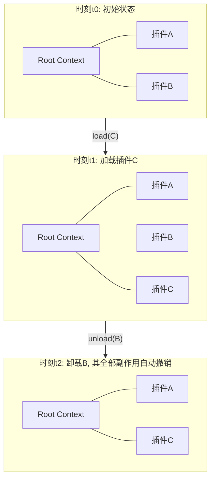
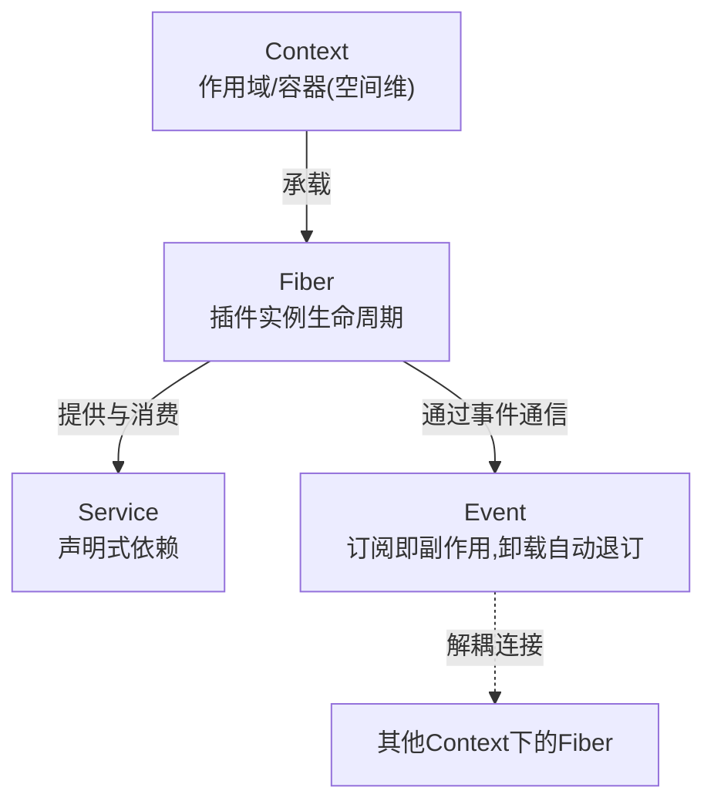
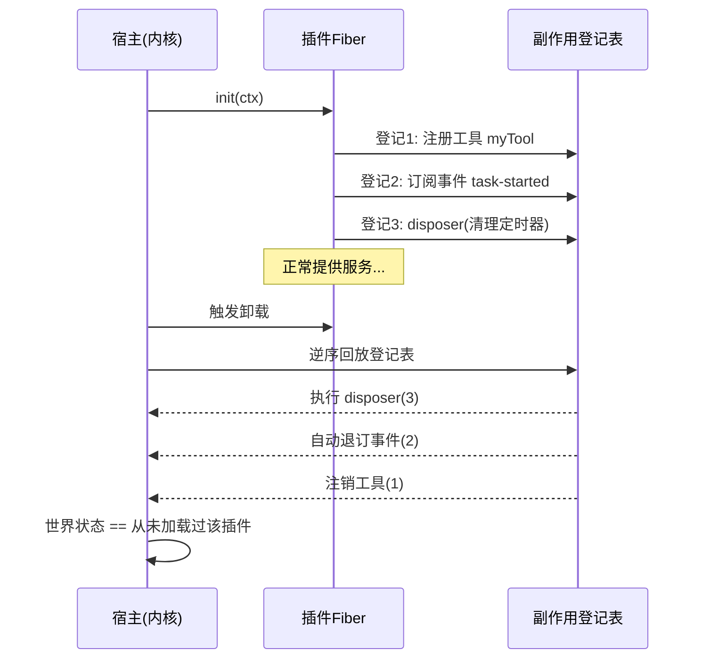

# 03 - Cordis 论文精读

> 本文是对《A Programming Paradigm for Spatiotemporal Composability》的精读与解读。
> 论文原文见 github.com/cordiverse/paper；本文基于公开资料与 Cordis/dsh 的实际设计思想进行忠实解读，个别工程化表述为便于理解所作的引申，均会标明。
>
> 前置阅读：[[deepseek-harness/1认知/01-Agent工程范式的三次跃迁|Agent工程范式的三次跃迁]]、[[deepseek-harness/1认知/02-DeepSeek-Harness全景|DeepSeek-Harness 全景]]。

---

## 目录

1. [论文是什么，为什么值得精读](#1-论文是什么为什么值得精读)
2. [研究动机：大规模插件系统的三座大山](#2-研究动机大规模插件系统的三座大山)
3. [时空组合性：两个维度的组合问题](#3-时空组合性两个维度的组合问题)
4. [核心抽象四件套](#4-核心抽象四件套)
5. [可逆副作用模型](#5-可逆副作用模型)
6. [与传统框架对比](#6-与传统框架对比)
7. [对 dsh 的意义：为什么 Agent Harness 需要它](#7-对-dsh-的意义为什么-agent-harness-需要它)
8. [局限与开放问题](#8-局限与开放问题)
9. [本章小结](#9-本章小结)

---

## 1. 论文是什么，为什么值得精读

《A Programming Paradigm for Spatiotemporal Composability》（时空可组合性编程范式）是 Cordis 框架的理论奠基文档。Cordis 是 DeepSeek Harness（dsh）的底层插件框架，因此这篇论文实际上回答了 dsh 全部架构设计的"为什么"。

三个值得精读的理由：

1. **它是少数有论文背书的 Harness 内核**。多数 Agent 框架的架构是经验演化的产物，Cordis 则先立论后实现——读论文等于拿到了设计者的一手意图；
2. **它处理的问题（动态插件系统）是经典软件工程难题**。即使你不做 Agent，其中对生命周期、依赖管理、副作用撤销的处理也直接适用于任何大型插件系统（编辑器、IDE、游戏引擎）；
3. **它是本教程库 2 架构篇的理论底座**。后续 [[deepseek-harness/2架构/01-Cordis内核原理|Cordis 内核原理]] 中每个机制都能在本文找到出处。

阅读姿态提示：论文标题里的"Programming Paradigm"（编程范式）一词分量很重——它主张的不是又一个框架 API，而是一种组织程序的新方式，地位上类比 OOP、事件驱动之于前代范式。

---

## 2. 研究动机：大规模插件系统的三座大山

### 2.1 问题场景

设想一个成熟的插件生态：数百个插件共存于同一进程，彼此调用、监听事件、注册工具。典型代表是大型编辑器（VS Code 及其插件市场）和如今的 Agent Harness。系统要长期运行，插件随时被安装、卸载、热更新。

传统技术栈在这个场景下会遇到三座大山。

### 2.2 第一座山：耦合失控（OOP 与回调的问题）

传统 OOP 组合方式要求对象之间显式持有引用：

```cpp
// 传统 OOP: 插件 A 直接引用插件 B 的接口
class PluginA {
    PluginB* b;   // 硬引用: A 的存在以 B 存在为前提
public:
    void doWork() { b->helper(); }  // B 被卸载? 未定义行为
};
```

问题链条：

- A 需要 B，则 A 必须知道如何获取 B——要么全局单例（隐藏耦合），要么层层注入（注入链随规模爆炸）；
- 插件间形成引用图后，**卸载顺序**成为噩梦：B 卸载时所有持引用者的悬垂指针怎么办？C/C++ 读者对此应有切肤之痛——这就是手动内存管理的插件版；
- 回调机制稍好（控制反转），但回调的**生命周期归属**依然模糊：B 给 A 注册了一个回调，B 先死，A 再触发回调就是 use-after-free 的变体。

### 2.3 第二座山：生命周期失控

PubSub（发布订阅）看似解耦了通信双方，但引入了新问题：

```text
订阅容易,退订难。
谁负责在什么时候取消订阅?
忘记退订 -> 监听器泄漏 -> 幽灵回调 -> 访问已销毁对象
```

Node.js 社区的 `MaxListenersExceededWarning`、各类 GUI 框架的"注销窗口时忘了解绑事件"都是此病的症状。根本原因是：**订阅是一个副作用，而传统框架没有把"副作用的撤销"作为语言/框架级的保证**——全靠程序员自觉。

### 2.4 第三座山：内存与资源泄漏

以上两座山的最终表现都是泄漏：监听器泄漏、定时器泄漏、全局状态残留、缓存不失效。在一个插件可以随时装卸的系统里，任何一次不彻底的清理都会累积。运行数月的插件宿主，性能逐渐劣化，且极难定位是哪个插件漏的。

### 2.5 三座山的共同根源

论文的诊断：传统范式的**组合关系是静态假设下的产物**——代码写好时模块关系就定了，运行时只是执行这个定死的结构。而插件系统的真实需求恰恰相反：**组合关系本身就是运行时持续变化的对象**。工具不对症，自然处处打补丁（手动 unsubscribe、shared_ptr 乱飞、析构顺序靠文档约定）。

---

## 3. 时空组合性：两个维度的组合问题

论文的核心概念：**组合性必须同时在空间和时间两个维度上成立**。

### 3.1 空间维：模块如何组成树

空间组合性回答"结构从哪来"：系统由模块组合而成，组合结果是一棵树（而非任意图）。每个模块有自己的作用域，子模块的作用域嵌套于父模块之内。

这类似 C/C++ 的作用域嵌套，或文件系统的目录树：内层可见外层，外层不必知道内层。树形结构的收益：

- 依赖方向清晰（向下依赖，禁止向上随意抓取）；
- 销毁可以整棵子树进行（删目录即删其下所有文件）；
- 权限天然分层（父作用域决定子作用域能看到什么）。

### 3.2 时间维：组合关系本身是动态的

时间组合性是论文真正的创新点，回答"结构何时变、怎么变"。传统框架里"加载哪些模块"是启动时的静态决定；时空组合性主张：

> **加载、卸载、重载不是系统的边缘操作，而是与"计算"同等级的一等公民。**

一个程序不仅包括"正在运行的逻辑"，还包括"逻辑之间组合关系的演化"。装上一个插件、卸掉另一个、热替换第三个——这些操作本身应当像函数调用一样可靠、可组合、可逆。

用 C/C++ 类比：`dlopen`/`dlclose` 让你装卸共享库，但装卸之后的符号解析、依赖处理、资源回收全要自己兜底，且装卸过程中系统的"一致性"没有任何保障。时空组合性要做的是把"安全地改变系统自身结构"变成框架保证的原语。

### 3.3 图示



时间轴上的每次结构变化都是一等公民操作：`load(C)` 把 C 织入现有树并建立正确的依赖注入；`unload(B)` 不只是"移除节点"，而是**撤销 B 曾经产生的一切副作用**（注销的工具、挂接的事件监听、占用的服务槽位），系统回到"从未加载过 B"的等价状态。

---

## 4. 核心抽象四件套

论文落地为 Cordis 的四个核心抽象。这里给出概念定义与直觉解释，实现细节留待 [[deepseek-harness/2架构/01-Cordis内核原理|Cordis 内核原理]]。

### 4.1 Context：作用域容器

Context 是空间维的基本单元——一棵树中的节点，承担两个职责：

1. **服务容器**：向内注册、向外提供各类服务（工具、配置、连接池等）；
2. **生命周期边界**：Context 销毁时，其内注册的一切按逆序自动清理。

C++ 直觉：Context 约等于一个**框架托管的超集版 RAII 作用域对象**——普通 RAII 管你 new 出来的内存，Context 管一切"注册型副作用"。

### 4.2 Fiber：生命周期载体

Fiber 是"活着的插件实例"：插件代码是类，Fiber 是该类在某 Context 下的一次实例化存活期。Fiber 具备完整生命周期钩子（启动、就绪、卸载），支持热重载——重载即旧 Fiber 有序退场、新 Fiber 无缝接管。

注意命名陷阱：此 Fiber 非并发意义的协程 Fiber，不涉及调度；它强调的是**受管的生命周期**。最接近的 C++ 心智模型是"由框架保证构造/析构协议严格执行的对象"。

### 4.3 Service：依赖声明

Service 解决"我要用别人什么"的问题：插件以声明式方式暴露与获取服务，框架负责解析依赖、确定实例化与销毁顺序。循环依赖与缺失依赖在装配期显式报错，而不是运行期的空指针。

对比传统 OOP：不再 `new` 或全局查找依赖对象，而是"声明我需要 X"，剩下交给框架——思想接近 Spring DI，但与生命周期深度绑定（见第 6 节对比表）。

### 4.4 Event：解耦通信

Event 是时间维的黏合剂：插件间不互相持有引用，而是通过事件的发布/订阅协作。关键在于 Cordis 对订阅的处理——**订阅本身也是注册型副作用，随 Fiber 卸载自动退订**。第二座山（幽灵回调）由此被系统性拆除。

四件套协作全景：



---

## 5. 可逆副作用模型

这是论文最具原创性、也最能体现"无特权内核"理念的部分。

### 5.1 定义

在 Cordis 中，插件的初始化过程被建模为一串**副作用注册**：

```text
init(插件) = 注册工具 + 订阅事件 + 暴露服务 + 注入配置 + ...
```

框架保证：每一个注册动作都被记录，并在对应 Fiber/Context 卸载时**严格逆序自动撤销**。于是：

```text
unload(插件) 之后的世界 == 从未 load 过该插件的世界
```

这就是 dsh "无特权内核：一切注册皆可逆副作用，卸载即撤销"的理论来源。没有任何插件能留下擦不掉的全局痕迹。

### 5.2 与 RAII 的对比

C++ RAII 是最接近的既有实践：

| 维度 | C++ RAII | Cordis 可逆副作用 |
|------|----------|-------------------|
| 管理对象 | 构造函数获取的资源（内存/句柄/锁） | 一切注册型副作用（含跨模块的事件订阅、服务注册、UI 挂载点） |
| 撤销时机 | 对象析构 | Fiber/Context 卸载 |
| 顺序保证 | 同作用域逆序析构 | 注册链全程逆序撤销 |
| 跨模块传播 | 无（出了作用域就管不着） | 有：A 在 B 里注册的监听，随 A 卸载被框架从 B 身上摘除 |
| 失败处理 | 异常时已构造成员析构，函数体内需自行守护 | init 中途失败，已完成注册由框架统一回滚 |

最后一行值得展开：C++ 里构造函数抛异常时，语言只帮你析构**已完整构造的成员与基类**，构造函数体内申请的资源要自己用局部 RAII 守护；Cordis 把这种守护提升为框架级语义——init 执行到一半失败，前面注册的东西照样被干净回滚。这是"把正确性从程序员纪律升级为运行时不变量"的典型案例。

### 5.3 与 C 语言 defer 思路的对比

Go/C 语言扩展中的 defer 思路（清理语句紧跟获取语句）解决的是**同一函数内**的清理遗忘；Cordis 解决的是**跨模块、跨生命周期阶段**的清理遗忘。可以说 Cordis 是 defer 思想在系统组合层面的推广：defer 把清理绑在词法作用域上，可逆副作用把撤销绑在生命周期容器上。

一段 Cordis 风格示例展示注册与自动撤销（TypeScript 伪代码，附中文注释）：

```typescript
import { Context } from 'cordis'

// 一个示例插件: 初始化即一串受管副作用
export const MyPlugin = (ctx: Context) => {
  // 副作用 1: 向宿主注册一个自定义工具
  ctx.provide('myTool', (input: string) => `processed: ${input}`)

  // 副作用 2: 订阅宿主事件 —— 无需手动退订
  ctx.on('task-started', (payload: unknown) => {
    console.log('收到任务开始事件:', payload)
  })

  // 副作用 3: 定时器, 通过 disposer 登记其清理逻辑
  const timer = setInterval(() => console.log('tick'), 1000)
  ctx.disposer(() => clearInterval(timer))

  // 函数返回后, 以上副作用全部进入"受管"状态:
  // ctx 停止时, disposer 逆序执行,
  // 事件监听自动退订, 工具注册自动注销。
}
```

无需手写任何"卸载时要记得……"的代码——这正是模型的力量：**把一类 bug 从可能性中删除，而不是降低其发生概率。**

### 5.4 撤销过程的时序细节

一次完整的"装载-运行-卸载"中，框架保证的操作时序如下：



三个容易忽视的保证：

1. **逆序是强制的**：后注册的依赖先注册的，逆序撤销天然满足依赖方向——与 C++ 同作用域析构逆序同理，但覆盖跨模块场景；
2. **init 中途失败同样回滚**：已完成的登记照样被撤销，不会留下"半个插件"；
3. **登记表本身由内核持有**：插件无法篡改或拒绝撤销，这是"无特权"的机制保障——撤销权在内核，不在插件。

### 5.5 反例：不可逆副作用怎么办

诚实的读者会问：插件往磁盘写了文件、发了网络请求，这些外部效应如何"撤销"？答案是框架不承诺物理世界的逆转，而是通过**约定边界**收窄问题：

- 外部动作应通过宿主提供的受管通道执行（如 dsh 的工具系统），通道自身记录审计日志；
- "可逆"承诺的范围是**宿主进程内的组合结构**（注册、订阅、服务、挂载点）；
- 这与数据库事务类似：事务保证的是数据库内部一致性，外部世界的影响要靠补偿机制。Cordis 的贡献是把"进程内一致性"从希望变成了保证。

---

## 6. 与传统框架对比

把 Cordis 放到历史坐标系中检验，选取三个代表性对照物：

| 维度 | Spring DI (Java) | OSGi (Java) | Node 模块系统 | Cordis |
|------|------------------|-------------|---------------|--------|
| 组合模型 | 容器 + 依赖注入图 | Bundle 动态模块 | 静态 require/import 树 | 动态 Context 树 |
| 运行时装卸 | 重启容器才生效 | 支持装卸但流程繁琐 | 不支持（动态 import 很受限） | 一等公民：load/unload/reload 随时可做 |
| 生命周期 | 单例为主，destroy 回调可选 | 完整 bundle 生命周期规范 | 无 | Fiber 完整钩子 + 框架保证执行 |
| 副作用撤销 | 手动 @PreDestroy 且易遗漏 | 手动实现 stop() | 无 | 自动逆序撤销，框架不变量 |
| 依赖解析 | 启动时一次性解析，改依赖须重启 | 动态但 API 沉重 | 编译期固定 | 声明式 + 动态，缺失/循环装配期报错 |
| 解耦通信 | 事件机制非核心 | 服务注册表 + 事件 | 无内置 | 事件总线为核心原语 |
| 复杂度成本 | 高（全家桶） | 高（规范繁琐，业界口碑偏冷） | 低但能力弱 | 中：概念少而深 |

三点解读：

1. **OSGi 是前车之鉴**。它在目标上与 Cordis 最接近（动态模块化），却因规范过重、开发体验差而在业界遇冷。Cordis 的启示性差异在于：用极少的概念（四件套）覆盖同样的需求面，并把最难的部分（副作用撤销）做成默认行为而非开发者义务；
2. **Spring 解决的是装配，没解决的是演化**。Spring 应用改个依赖就要重启，这在 Agent Harness 场景不可接受——dsh 要求模型路由切换无需重启、插件实验随时进行，正是时间维组合性的用武之地；
3. **Node 模块系统展示了"不做时间维"的代价**。JS 生态的热更新至今仍是补丁摞补丁的工程奇迹，根因就是底层范式没有给动态重组留位置。

---

## 7. 对 dsh 的意义：为什么 Agent Harness 需要它

论文动机是通用插件系统，为何 Agent Harness 是它最好的落地场景？因为 **Agent 能力天然需要动态组合**，且要求的动态程度超过以往任何插件系统：

1. **能力集合高度多变**。今天装浏览器工具、明天换数据库连接、后天实验一套新约束。Agent 的工具箱不是出厂固定的，而是随任务持续演化的——这正是时间维组合的字面含义；
2. **实验文化需要绝对可逆**。dsh 的创造模式鼓励运行时检查和插件实验，前提是失败零成本：实验插件卸载后不留残渣。可逆副作用模型提供了这层保险；
3. **多模式复用同一内核**。标准/PTC/极简/创造四种运行模式本质上是不同的插件装载方案——同一个 Cordis 内核，不同的组合快照。若没有动态组合能力，四种模式就得做成四个产品；
4. **安全边界要求无特权**。Agent 能执行真实动作（跑命令、改文件），第三方插件的信任问题比编辑器插件更尖锐。"卸载即撤销、无人能留特权状态"是安全模型的基石；
5. **长程运行要求自愈**。Agent 任务动辄数小时，中途装卸组件、热修复而不中断会话，只有把"改变自身结构"做成可靠原语的运行时才能做到。

一句话总结：**Harness Engineering 要让"环境"成为精心设计的一层，而这层环境自身的可演化性，恰好是时空组合性所解决的问题。** 论文与产品的咬合严丝合缝。

---

## 8. 局限与开放问题

忠实解读也包括如实指出边界。以下部分为公开讨论中的常见关切，部分为本教程基于设计的分析（已标注）：

1. **心智模型迁移成本**。"副作用皆可逆"对习惯静态架构的工程师是新思维方式，团队推广存在学习曲线；
2. **生态位绑定单一实现**。范式目前与 Cordis/dsh 生态强绑定，能否脱离 TypeScript 生态独立扩散尚待观察；
3. **调试动态性的难度**（分析）：组合关系随时间变化，"系统此刻的结构"需要专门工具才能看清——dsh 的 dump-config 与 Trajectory 正是为补偿这一点；结构变化频繁时，因果归因比静态系统更难；
4. **性能簿记开销**（分析）：注册记录与逆序撤销有固有成本，官方尚未给出系统性性能数据，重注册频率极高的场景值得评估；
5. **理论验证范围**：范式已在 Agent Harness 场景得到实证，但在更大规模（操作系统级）场景是否成立属开放问题；
6. **预览阶段的稳定性**：dsh 处于 developer preview，破坏性变更意味着工程载体仍在快速演化，学习时应关注版本差异。

这些局限不动摇核心判断：可逆副作用与时空组合性直击插件系统的经典痛点，且已有 dsh 这一大规模实证案例支撑。

---

## 8bis. 概念速查卡

供复习与写作时快速引用：

| 概念 | 一句话定义 | 最近似的 C/C++ 心智模型 |
|------|------------|--------------------------|
| 时空组合性 | 组合关系在结构（空间）与演化（时间）两维都必须可靠 | 静态链接升级为可安全反复执行的 dlopen/dlclose |
| Context | 树形作用域容器，服务容器 + 生命周期边界 | 框架托管的超集 RAII 作用域对象 |
| Fiber | 插件实例的受管存活期 | 构造/析构协议被框架严格执行的对象 |
| Service | 声明式依赖，框架解析与排序 | 编译期链接检查搬到运行时的依赖注入 |
| Event | 订阅即副作用的解耦通信 | 自动随作用域销毁退订的信号槽 |
| 可逆副作用 | 注册全记录、卸载逆序自动撤销 | 跨模块版 RAII + 事务性 init |
| 无特权内核 | 无任何插件能留下不可撤销的状态 | 内核态/用户态隔离的插件化版本 |

建议把这张卡片贴在手边阅读架构篇——每个 Cordis 机制出现时，先用右列的 C/C++ 直觉锚定，再看 TS 实现细节。

---

## 8ter. 动手对照：幽灵回调问题的两种解法

用同一问题在两个世界里的解法收束全章，这是 C/C++ 背景读者建立体感的最快方式。

**问题**：插件 B 向宿主 A 订阅了 `file-changed` 事件，随后 B 被卸载。之后文件变化，A 触发事件。

**传统 C++ 做法（手动管理）**：

```cpp
// 宿主 A 维护监听器列表
class HostA {
    std::vector<Listener*> listeners;   // 裸指针: 谁的生命周期?
public:
    void subscribe(Listener* l) { listeners.push_back(l); }

    void onFileChanged() {
        for (auto* l : listeners)
            l->notify();                // B 已卸载? 悬垂指针, 未定义行为
    }
    // 正确做法要求: B 卸载前必须显式调用 host.unsubscribe(this),
    // 且要处理迭代中删除、多线程竞争、忘记退订…… 全靠纪律。
};
```

**Cordis 做法（框架保证）**：

```typescript
// 插件 B 的初始化: 订阅动作被自动登记
export const PluginB = (ctx: Context) => {
  ctx.on('file-changed', (e) => {
    console.log('B 收到文件变化:', e.path)
  })
  // 没有"取消订阅"的代码 —— 因为不需要:
  // ctx 卸载时框架自动完成退订,
  // 宿主 A 的监听列表里不会再有 B。
}
```

对照结论：传统解法把正确性寄托于每一条使用纪律（记得退订、小心迭代删除），Cordis 把它变成结构性质——**错误不是被避免的，而是不可能发生的**。这正是论文自称"Programming Paradigm"而非"Framework"的底气：范式改变的是你写代码的方式，框架改变的只是你调用的 API。

### 8ter.1 练习

动手巩固（无需 dsh 环境，任何语言均可）：

1. 用你熟悉的语言实现一个迷你版 `Context`：支持 `provide`/`on`/`disposer` 三个方法与逆序撤销，约五十行代码；
2. 为你的实现写一个测试：init 中途抛异常后，验证已注册的副作用全部被回滚；
3. 思考题：如果两个插件的 disposer 相互依赖对方的服务，逆序撤销会出现什么问题？Cordis 的 Service 声明式依赖如何提前暴露这种循环？（提示：回顾 4.3 节"装配期显式报错"。）

完成第 1 题后你就拥有了阅读 [[deepseek-harness/2架构/01-Cordis内核原理|Cordis 内核原理]] 所需的全部直觉——剩下的只是看真实工程如何处理并发、异步与性能这些"脏细节"。

---

## 9. 本章小结

- 传统三座山：耦合失控（OOP/回调）、生命周期失控（PubSub 泄漏）、资源泄漏，共同根源是把组合当静态；
- 时空组合性 = 空间维（模块组成 Context 树）+ 时间维（装卸/重载是与计算同级的一等公民）；
- 四件套：Context（作用域容器）、Fiber（生命周期载体）、Service（声明式依赖）、Event（订阅即副作用的通信）；
- 可逆副作用是核心原创：注册全记录、卸载逆序自动撤销，是 RAII 与 defer 思想向跨模块系统层的推广，把正确性从纪律升级为运行时不变量；
- 对比 Spring/OSGi/Node 模块系统：Cordis 用最少的概念覆盖动态模块化需求，吸取了 OSGi 过重的教训；
- Agent Harness 因能力多变、实验文化、多模式复用、安全边界、长程自愈五项需求，成为该范式最佳落地场景。

至此认知篇三章完结。接下来进入架构篇，看论文思想如何落实为真实运行的内核：[[deepseek-harness/2架构/01-Cordis内核原理|Cordis 内核原理]]。

