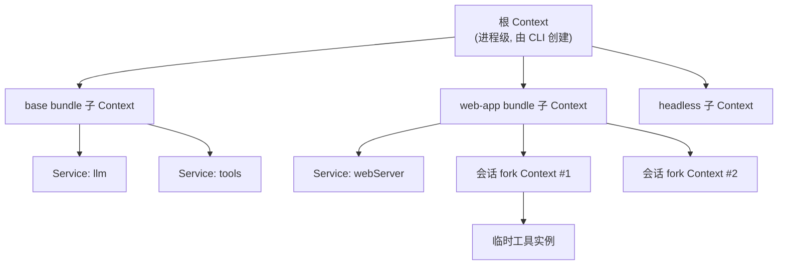
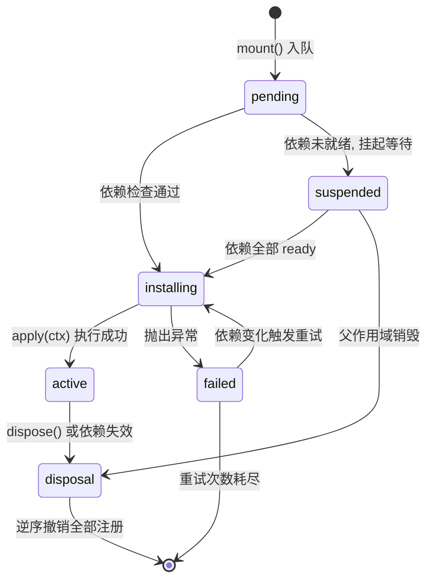
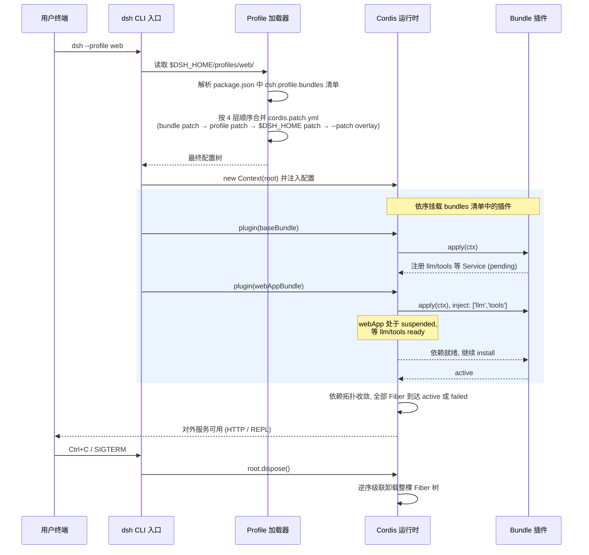

# 01 - Cordis 内核原理

> 本章是整个架构篇的地基。dsh（DeepSeek Harness）的所有上层机制——Profile、Bundle、服务注入、事件系统——全部构建在 [Cordis](https://github.com/cordiverse/cordis) 这个通用插件化框架之上。理解了 Cordis，后面的章节就只是"应用层约定"而已。

前置阅读：[[deepseek-harness/1认知/02-DeepSeek-Harness全景|DeepSeek Harness 全景]]
后续章节：[[deepseek-harness/2架构/02-Profile与Bundle|Profile 与 Bundle]]、[[deepseek-harness/2架构/03-服务与依赖注入|服务与依赖注入]]、[[deepseek-harness/2架构/04-事件系统详解|事件系统详解]]

---

## 1. Cordis 是什么：一个通用插件化框架，dsh 只是应用之一

很多人第一次接触 dsh 时会以为 Cordis 是 dsh 的内部模块。事实恰好相反：

**Cordis 是一个独立开源的、通用的 TypeScript 插件化框架**，它不关心你跑的是聊天机器人、CLI 工具还是 Agent Harness。它的全部工作只有一件事：

> 管理一批插件的加载、依赖、通信和卸载，并保证这一切**可逆**。

你可以把 Cordis 类比为：

- Koajs/Hapi 之于 HTTP 服务——框架本身不提供业务；
- systemd 之于 Linux 用户态服务——负责拉起、依赖编排、优雅停止；
- Eclipse OSGi 之于 Java 插件——运行时模块生命周期管理。

dsh 选择 Cordis 作为内核，换来的是三个直接收益：

| 收益 | 说明 |
| --- | --- |
| 生命周期即事务 | 插件注册的一切资源（服务、命令、事件监听、定时器）随 Context 销毁自动回收，不需要手写 teardown |
| 依赖即声明 | `inject` 一个数组就完成依赖编排，框架保证依赖 ready 后才执行你的初始化 |
| 配置即数据 | 插件的配置是纯 JSON/YAML 数据层，可以在启动前任意合并、覆盖（这正是 Profile 体系的基础） |

一个最小但完整的 Cordis 插件长这样：

```typescript
// 一个 Cordis 插件就是一个导出 apply 函数的 TS 模块
import { Context } from 'cordis'

// ctx 是插件被挂载时所在的作用域对象，一切注册都发生在它身上
export function apply(ctx: Context) {
  // 在 ctx 上注册的一切，都会在这个插件卸载时被自动清理
  ctx.provide('greeting', 'hello')          // 提供一个值
  ctx.on('ready', () => {                   // 监听一个事件
    console.log('插件已就绪')
  })
}
```

没有全局变量，没有单例 import，没有需要手动调用的 `dispose()`。这就是 Cordis 的世界观：**插件是对某个 Context 的一组可逆副作用**。

---

## 2. 插件树模型：Context 组成的森林

Cordis 不是扁平的插件列表，而是一棵 **Context 树**。

### 2.1 树形结构



关键规则：

1. **每个 Context 是一个作用域**，插件挂载在某个 Context 上；
2. **fork 派生**：任何 Context 都可以 `ctx.fork()` 出子 Context，子继承父的可见服务，但自己的注册互不干扰；
3. **销毁级联**：销毁父 Context 会级联销毁整棵子树——这是会话级隔离的基础。

### 2.2 Fork 的语义

```typescript
// 主进程里创建根 Context
const root = new Context()

// 根上挂载全局服务
root.plugin(LlmService)     // 全局唯一的大模型客户端
root.plugin(ToolRegistry)   // 全局工具注册表

// 每来一个新会话，fork 出一个子作用域
function onSessionStart(sessionId: string): Context {
  const session = root.fork()          // 派生子 Context

  // 只属于这个会话的状态挂在子 Context 上，
  // 会话结束时 session.dispose() 一行代码清干净所有东西
  session.plugin(SessionState, { sessionId })

  return session
}

function onSessionEnd(session: Context) {
  session.dispose()   // 级联清理：监听器、定时器、子插件全部回收
}
```

注意 `root.fork()` 返回的子 Context 上，`session.llm`、`session.tools` 依然可用（继承自父），但你在子上注册的东西不会泄漏回父作用域。这就像进程 fork 继承了地址空间，但写时隔离。

---

## 3. Context：一个作用域对象的三重职责

Context 是 Cordis 唯一的核心类型，它同时扮演三个角色：

### 3.1 注册表（Registry）

Context 维护着一张注册表，记录本作用域内所有"可逆副作用"：

```typescript
interface RegistryEntry {
  // 每条注册都有一个唯一的撤销函数
  dispose(): void
}

class Context {
  private registry = new Map<symbol, RegistryEntry>()

  // 所有公开 API 本质都是同一个模式：
  // 登记 + 返回撤销句柄
  on(event: string, listener: Function) {
    this.runtime.addEventListener(event, listener)   // 实际注册
    const key = Symbol()
    this.registry.set(key, {
      dispose: () => this.runtime.removeEventListener(event, listener),
    })                                               // 登记撤销方式
    return this                                      // 支持链式调用
  }
}
```

这意味着你几乎永远不需要写这样的代码：

```typescript
// 反面教材：手动配对注册与清理
const timer = setInterval(task, 1000)
server.on('close', () => clearInterval(timer))   // 忘了就泄漏
```

在 Cordis 里等价写法是把资源登记到 Context 上：

```typescript
// 正确姿势：把手动资源也纳入自动清理
export const apply = (ctx: Context) => {
  ctx.effect(() => {
    // effect 工厂：返回清理函数即可
    const timer = setInterval(() => ctx.emit('tick'), 1000)
    return () => clearInterval(timer)
  })

  // 或者用 setInterval 这种 Cordis 封装好的快捷方法
  ctx.setInterval(() => ctx.emit('tick'), 1000)
}
```

`ctx.effect()` 是处理非 Cordis 原生资源（第三方连接池、文件句柄、child process）的标准逃生舱。

### 3.2 事件分发器（Event Emitter）

每个 Context 背后共享一个进程级的事件总线，但事件的**可见性由作用域决定**。四种发射语义（emit/bail/serial/waterfall）详见 [[deepseek-harness/2架构/04-事件系统详解|事件系统详解]]。

```typescript
// 同一条总线，不同作用域的监听互不可见
const parent = new Context()
const child = parent.fork()

parent.on('message', () => console.log('parent 收到'))
child.on('message', () => console.log('child 收到'))

child.emit('message')
// 输出：
// child 收到        ← 子作用域先处理
// parent 收到       ← 冒泡到父作用域
```

### 3.3 子作用域管理器（Scope Manager）

Context 记录自己的所有 fork 子节点，并提供两个方向的操作：

| 操作 | 行为 |
| --- | --- |
| `ctx.fork()` | 派生新子作用域，继承父的解析视图 |
| `ctx.dispose()` | 先递归 dispose 全部子作用域，再撤销自身全部注册 |

```typescript
// dispose 的执行顺序演示
const root = new Context()
const a = root.fork()
a.on('log', () => console.log('a alive'))
const b = a.fork()
b.on('log', () => console.log('b alive'))

b.dispose()   // 只清理 b 自己
a.dispose()   // 清理 a；若 b 还活着也会被一并带走
```

三重职责合起来的效果：**Context = 一个自带垃圾回收的命名空间**。

---

## 4. Fiber：插件的生命周期状态机

每个已挂载的插件在 Cordis 内部对应一个 **Fiber**（纤维）——它是"插件实例 + 其配置 + 其状态"的运行时载体。Fiber 的状态流转是一条严格的状态机：



逐个状态解释：

| 状态 | 含义 | 触发条件 |
| --- | --- | --- |
| `pending` | 已入队等待安装 | `ctx.plugin()` 刚被调用 |
| `suspended` | 因依赖未满足而挂起 | `inject` 声明的服务还没 ready |
| `installing` | 正在执行用户代码 | 依赖齐备，进入 `apply(ctx)` |
| `active` | 正常运行中 | `apply` 正常返回 |
| `failed` | 安装失败 | `apply` 抛异常或依赖解析失败 |
| `disposal` | 卸载中 | 显式 dispose 或上游失效 |

两个值得注意的设计：

**其一，挂起不是失败。** 一个声明了 `inject: ['database']` 但数据库插件尚未就绪的插件不会报错，它会安静地停在 `suspended`，等依赖一 ready 就自动继续安装。这让插件之间的加载顺序完全解耦——你不需要控制 require 顺序，只需要声明关系。

**其二，disposal 是精确的逆操作。** Cordis 按注册的逆序逐一撤销该 Fiber 名下的全部条目。如果 `apply` 里先注册了 A 再注册了 B，卸载时先撤 B 再撤 A——和 C++ 析构、Rust drop 的栈式语义一致。

```typescript
export const apply = (ctx: Context) => {
  // 注册顺序：1 → 2 → 3
  ctx.provide('step', 1)
  ctx.provide('step', 2)
  ctx.effect(() => {
    console.log('资源 3 打开')
    return () => console.log('资源 3 关闭')
  })
}

// 卸载时的日志顺序必然是：
// 资源 3 关闭
// （撤销 step=2）
// （撤销 step=1）
```

---

## 5. 无特权内核哲学：一切注册皆可逆副作用

传统插件系统往往有一个"特权核心"：框架自己实现的路由、日志、配置读取走特殊通道，插件只能通过有限的扩展点接入。想替换核心行为？要么改框架源码，要么等官方留口子。

Cordis 反其道而行之，它的哲学可以压缩成一句话：

> **内核不做任何插件做不到的事；插件做的一切事都可以被精确撤销。**

推论有三：

1. **没有需要打补丁的核心。** dsh 的 web 界面、工具循环、模型客户端全是普通插件。你想换掉内置的工具循环？写一个同名服务 provide 上去就行，不存在"内部 API"。
2. **猴子补丁没有存在必要。** 因为一切行为都是 ctx 上的注册项，覆盖 = 先撤销旧注册再登记新注册，框架原生支持。
3. **配置热更新免费获得。** 既然插件 = 可逆副作用集合，那么"应用新配置"就等价于"dispose 旧 Fiber + mount 新 Fiber"，受影响的子树重建，无关部分不动。

```typescript
// 演示：用一个插件"接管"另一个插件的行为，全程无补丁
import { Context, Service } from 'cordis'

class Logger extends Service {
  constructor(ctx: Context, public config: { level: string }) {
    super(ctx, 'logger')
  }
  log(msg: string) {
    console.log(`[${this.config.level}] ${msg}`)
  }
}

// 静默版 logger：同名的 Service 会替换旧的
class SilentLogger extends Service {
  constructor(ctx: Context) {
    super(ctx, 'logger')          // 相同服务名 → 触发旧实例的 disposal
  }
  log(msg: string) {
    /* 静默策略：什么都不输出 */
  }
}

const app = new Context()
app.plugin(Logger, { level: 'info' })
console.log(app.logger.log)       // 此刻 ctx.logger 是 Logger

app.plugin(SilentLogger)          // 挂载后 ctx.logger 自动切换为 SilentLogger，
                                  // 且旧 Logger 已被框架干净地卸载
```

这套哲学正是后面 [[deepseek-harness/2架构/02-Profile与Bundle|Profile 与 Bundle]] 四层配置叠加能够成立的前提：**配置层的每一层都只是一组待重放的可逆副作用**。

---

## 6. 与微内核 OS 的类比

如果你有操作系统背景，Cordis 的结构会熟悉得惊人：

| 操作系统概念 | Cordis 对应物 | 共同点 |
| --- | --- | --- |
| Mach 微内核 | Cordis 运行时本体 | 只提供最小机制（IPC/调度/内存），不含策略 |
| 服务进程（如 inetd） | 插件 / Service | 用户态功能单元，崩溃可独立重启 |
| 消息传递 IPC | 事件系统（emit/bail/serial/waterfall） | 组件间唯一通信方式，松耦合 |
| cgroup / namespace | Context fork 作用域 | 资源分组、隔离、级联回收 |
| init 进程（PID 1） | 根 Context | 万物之源，其死亡等于整个进程退出 |
| modprobe + modules.dep | inject 依赖解析 | 声明依赖，加载器负责拓扑排序 |
| rmmod | fiber disposal | 精确逆序卸载，引用计数保护 |

类比中最贴切的一条是 **cgroup ↔ Context**：cgroup 让你把一组进程当作一个整体来分配资源和回收，Context 让你把一组注册当作一个整体来创建和销毁。容器编排里"删掉一个 pod 连带清理它的所有 sidecar"的体验，就是 `session.dispose()` 的体验。

而最不贴切的地方也要指出：微内核 OS 里服务之间消息传递是异步且无返回值的（或需显式 RPC），Cordis 的事件则提供了从"纯广播"到"带短路拦截"再到"管道传值"的完整光谱——这是因为它服务于确定性更强的 TS 运行时。

---

## 7. dsh 启动流程全景

最后把所有概念串起来，看 dsh 从敲下命令到对外服务的完整时序：



用文字复述一遍关键步骤：

1. **CLI 解析 argv**，确定 profile 名与 `--patch` overlay；
2. **Profile 加载器**读取 `$DSH_HOME/profiles/<名>/package.json` 里的 `dsh.profile.bundles` 清单，得到要挂载的 bundle 包列表；
3. **合并配置层**：各 bundle 自带的 patch、profile 目录下的 patch、机器级的 `$DSH_HOME/cordis.patch.yml`、命令行 overlay，按"后层覆盖前层"合成最终配置（细节见下一章）；
4. **构造根 Context**，把最终配置作为数据注入；
5. **依序挂载 bundle 插件**，每个插件成为一棵 Fiber，因 `inject` 声明形成 DAG，Cordis 自动完成拓扑排序与挂起等待；
6. **收敛**：所有 Fiber 到达 active（个别 failed 不阻塞其他插件）；
7. **对外服务**：REPL 或 HTTP server 开始接受请求；
8. **退出**：信号到达时 `root.dispose()`，整棵树逆序级联卸载——包括那些用 `ctx.effect()` 手工登记的资源。

---

## 8. 小结

- Cordis 是通用插件化框架；dsh 只是它的一个应用，两者是"内核与发行版"的关系。
- Context 是唯一核心：注册表 + 事件分发 + 子作用域管理，三位一体。
- 插件树通过 fork 派生，销毁级联回收，这是会话隔离与优雅退出的基础。
- Fiber 状态机让"挂起等待依赖"和"精确逆序卸载"成为框架保证而非开发者义务。
- 无特权内核哲学：一切皆可逆副作用，所以覆盖、热更、配置叠加都不需要补丁。

理解了这套内核语义之后，下一章我们看 dsh 如何在它之上定义 **Profile（用户的堆叠清单）** 与 **Bundle（自带 patch 层的 npm 包）** 这两层分发约定：[[deepseek-harness/2架构/02-Profile与Bundle|Profile 与 Bundle]]。
