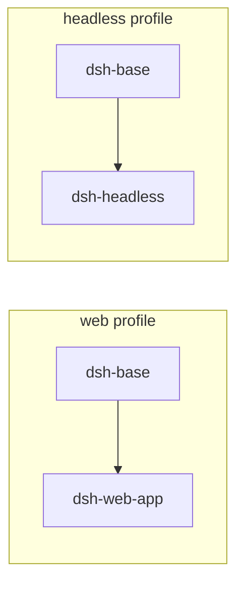
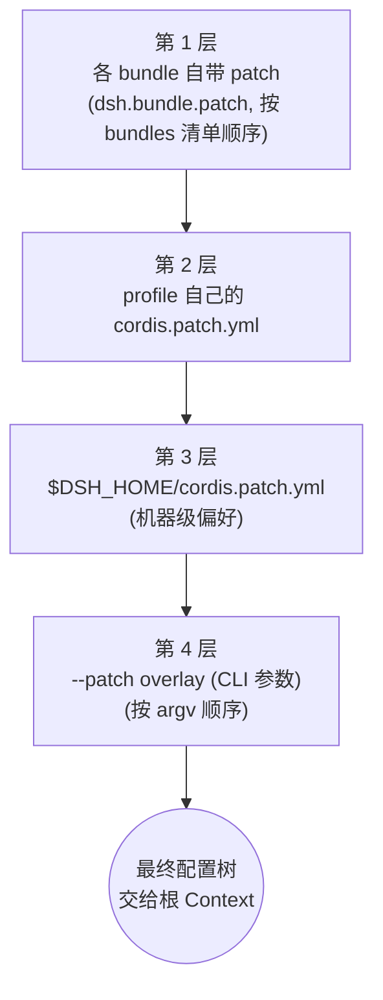
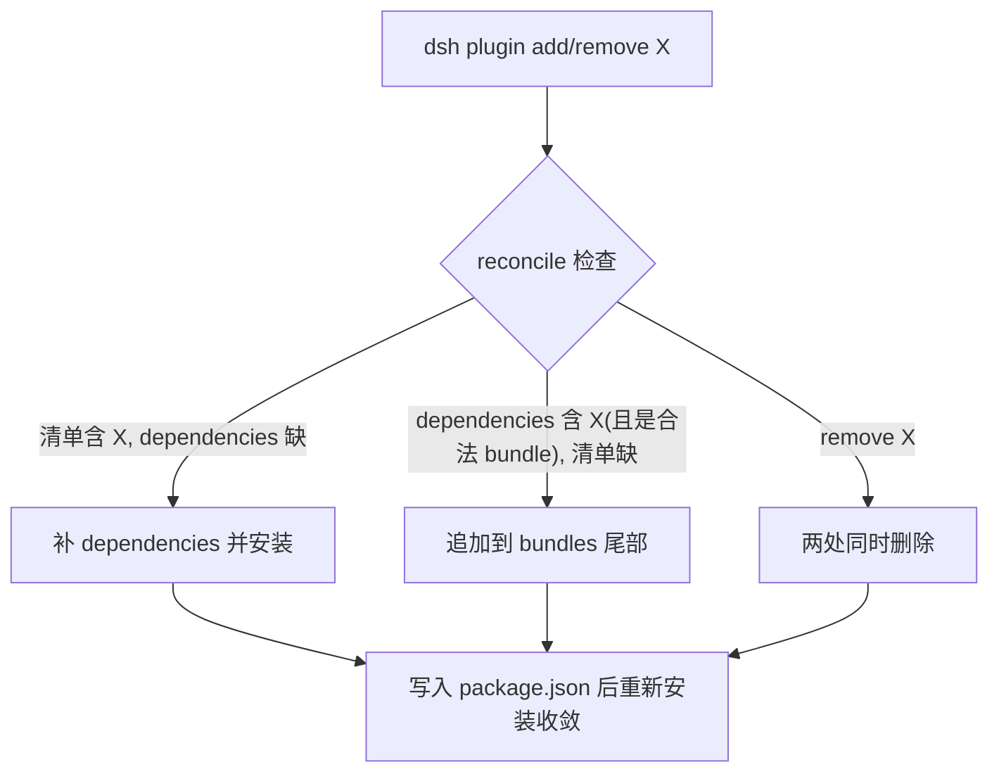

# 02 - Profile 与 Bundle

> 上一章我们确认了 dsh 的内核是 Cordis，一切插件皆可逆副作用。本章回答一个工程问题：**这些插件从哪来、按什么配置装、用户如何组合出自己的发行版**。答案是两份 manifest：bundle 自带的配置层，和 profile 手里的有序堆叠清单。

前置阅读：[[deepseek-harness/2架构/01-Cordis内核原理|Cordis 内核原理]]
后续章节：[[deepseek-harness/2架构/03-服务与依赖注入|服务与依赖注入]]

---

## 1. 两个 Manifest 的分工

dsh 里有两类清单文件，名字都叫 manifest，但归属和职责完全不同：

| 维度 | Bundle Manifest | Profile Manifest |
| --- | --- | --- |
| 归属 | npm 包自带（随包分发） | 用户目录 `$DSH_HOME/profiles/<名>/` |
| 载体字段 | `package.json` 的 `dsh.bundle.patch` 字段 | `package.json` 的 `dsh.profile.bundles` 字段 + 同目录 `cordis.patch.yml` |
| 回答的问题 | "我这个包挂载时要应用什么配置" | "我要装哪些包、全局要覆盖什么配置" |
| 作者 | bundle 开发者 | harness 使用者 |
| 数量 | 每个 bundle 一份 patch 层 | 每个环境一份 profile |

一句话概括分工：

> **Bundle manifest 是包自带的配置层；Profile manifest 是用户对这些包的有序堆叠清单，外加一层自己的覆盖。**

类比 Debian：bundle 像 `.deb` 包（自带 maintainer script 和默认配置），profile 像你的 `sources.list` 加 `apt pinning`——决定装哪些、以什么优先级。

### 1.1 Bundle Manifest 长什么样

```jsonc
// @deepseek-ai/dsh-base 的 package.json（节选）
{
  "name": "@deepseek-ai/dsh-base",
  "version": "1.4.0",
  // 关键字段：声明本包是一个 bundle，并携带自己的 patch 层
  "dsh": {
    "bundle": {
      // 挂载时应用的默认配置，YAML 语义内联为对象
      "patch": {
        "llm": {
          "provider": "deepseek",
          "model": "deepseek-chat"
        },
        "tools": {
          "sandbox": true
        }
      }
    }
  }
}
```

判定规则很严格：

- **有 `dsh.bundle.patch` 字段的包才算 bundle**；
- **没有这个字段的包只是普通 npm 依赖**，即使它导出了合法的 `apply(ctx)`，dsh 也不会把它当作 bundle 挂载，并会输出一条警告提醒你检查是否漏写。

```typescript
// dsh 内部的判定逻辑（示意）
function classifyBundle(pkg: PackageJson): 'bundle' | 'plain' {
  if (pkg.dsh?.bundle?.patch) return 'bundle'
  // 导出了 apply 但没声明 bundle 字段 → 大概率是作者笔误
  console.warn(
    `[dsh] 包 ${pkg.name} 未声明 dsh.bundle.patch，将作为普通依赖忽略。` +
      `若它是 bundle，请检查 package.json。`
  )
  return 'plain'
}
```

---

## 2. Profile 目录结构逐文件解析

profile 是用户侧的完整描述。每个 profile 占据 `$DSH_HOME/profiles/<名>/` 一个目录，四个文件各有其职：

```
$DSH_HOME/
└── profiles/
    └── web/                          # profile 名 = 目录名
        ├── package.json              # 文件 1: bundles 堆叠清单
        ├── cordis.patch.yml          # 文件 2: 本 profile 的覆盖层
        ├── pnpm-workspace.yaml       # 文件 3: 本地 workspace 声明
        └── node_modules/             # 安装产物（pnpm 管理）
```

逐个看。

### 2.1 package.json —— 有序的 bundles 清单

```jsonc
// $DSH_HOME/profiles/web/package.json
{
  "name": "profile-web",
  "private": true,
  "dsh": {
    "profile": {
      // 核心：有序数组。顺序即挂载顺序，
      // 后挂载的 bundle 其 patch 层覆盖先前的
      "bundles": [
        "@deepseek-ai/dsh-base",
        "@deepseek-ai/dsh-web-app"
      ]
    }
  },
  "dependencies": {
    // bundles 必须同时出现在 dependencies 里才能被解析到
    "@deepseek-ai/dsh-base": "^1.4.0",
    "@deepseek-ai/dsh-web-app": "^1.2.0"
  }
}
```

注意两点设计：

1. **数组是有序的**，这不是装饰——挂载顺序决定 patch 叠加顺序，也决定了同名服务的替换方向（后挂者优先）；
2. **bundles 与 dependencies 双重登记**，前者是声明意图，后者是物理安装，两者由 reconcile 机制对齐（见第 6 节）。

### 2.2 cordis.patch.yml —— 本 profile 的覆盖层

```yaml
# $DSH_HOME/profiles/web/cordis.patch.yml
# 这里的键是"插件路径.配置键"，值直接覆盖下层同名字段
llm:
  model: deepseek-reasoner        # 覆盖 base bundle 默认的 deepseek-chat
  temperature: 0.3
tools:
  sandbox: true
webServer:
  port: 8420                      # 本 profile 特有的端口约定
```

这一层的语义是"这个环境的偏好"，与机器无关、与项目无关——它跟着 profile 目录走。

### 2.3 pnpm-workspace.yaml —— 本地开发通道

```yaml
# $DSH_HOME/profiles/web/pnpm-workspace.yaml
packages:
  # 把本地正在开发的 bundle 以 workspace 方式接入
  - ../../my-bundles/custom-tools
```

有了这一行，`pnpm install` 会把 `custom-tools` 软链进 node_modules，于是它的包名可以直接出现在 bundles 清单里——这是调试自制 bundle 的标准姿势，不需要发版。

---

## 3. 出厂三 Bundle 对照表

dsh 出厂提供三个官方 bundle，所有自定义 profile 都从它们起步：

| Bundle 包名 | 定位 | 在其 patch 层中提供的核心配置 | 依赖关系 |
| --- | --- | --- | --- |
| `@deepseek-ai/dsh-base` | 最小内核能力集 | llm 客户端、tools 注册表、session 存储 | 无（最底层） |
| `@deepseek-ai/dsh-headless` | 无界面自动化运行 | headless 循环参数、批处理队列 | base 之上再加一层 |
| `@deepseek-ai/dsh-web-app` | 浏览器交互界面 | webServer 端口、静态资源、会话路由 | base 之上再加一层 |

典型组合关系：

- **web profile** = `base + web-app`（交互式使用）；
- **headless profile** = `base + headless`（CI / 脚本调用）;
- 二者互不包含，但共享同一个 base。



---

## 4. 四层配置叠加顺序图解

现在把所有配置来源放到一起。dsh 规定了严格的四层叠加顺序，**后层覆盖前层**：



覆盖规则细化：

1. 第 1 层内部也有序：bundles 数组中靠后的 bundle 覆盖靠前的；
2. 第 4 层 `--patch` 可以出现多次，argv 中越靠后越晚应用、优先级越高；
3. 所有层的合并都是**深合并**：对象递归合并，标量与数组整体替换。

```bash
# 完整示例：三层静态 + 两段命令行 overlay
dsh --profile web \
  --patch '{"webServer":{"port":9000}}' \
  --patch '{"llm":{"temperature":0}}'
# 最终 webServer.port=9000, llm.temperature=0,
# 其余取自 bundle patch → profile patch → $DSH_HOME patch 的叠加结果
```

等价的 TypeScript 描述：

```typescript
// 配置合并器核心逻辑（示意）
type Config = Record<string, any>

// 深合并：对象递归，其余类型直接右值覆盖
function merge(base: Config, over: Config): Config {
  const out: Config = { ...base }
  for (const [k, v] of Object.entries(over)) {
    const bothObj =
      typeof v === 'object' && v !== null && !Array.isArray(v) &&
      typeof out[k] === 'object' && out[k] !== null && !Array.isArray(out[k])
    out[k] = bothObj ? merge(out[k], v) : v   // 标量/数组整体替换
  }
  return out
}

function buildConfig(profile: Profile, overlays: string[]): Config {
  let cfg: Config = {}
  // 第 1 层：按 bundles 清单顺序逐个应用包自带 patch
  for (const name of profile.bundles) {
    cfg = merge(cfg, loadBundle(name).patch)
  }
  // 第 2 层：profile 目录下的 cordis.patch.yml
  cfg = merge(cfg, loadYaml(profile.dir, 'cordis.patch.yml'))
  // 第 3 层：$DSH_HOME 机器级 patch
  cfg = merge(cfg, loadYaml(process.env.DSH_HOME!, 'cordis.patch.yml'))
  // 第 4 层：--patch overlay 按 argv 顺序
  for (const raw of overlays) cfg = merge(cfg, JSON.parse(raw))
  return cfg
}
```

### 4.1 决策表："这个值应该放哪一层"

拿到任何一个想改的配置项，按下表判断落点：

| 场景 | 应放层级 | 理由 |
| --- | --- | --- |
| 团队所有项目都要的行为（工具沙箱开关） | bundle（自己维护一个项目 bundle） | 随代码仓库分发，可评审 |
| 某类任务环境的固定差异（headless 批处理参数） | profile 的 cordis.patch.yml | 跟随 profile，不污染机器 |
| 个人这台机器的习惯（代理地址、默认模型温度） | `$DSH_HOME/cordis.patch.yml` | 机器级，跨所有 profile 生效 |
| 一次性实验（临时换个模型对比效果） | `--patch` overlay | 不落盘，试完即走 |
| 想知道某个值当前到底是什么 | 见下一节 dump 工作流 | 先观察再动手 |

记忆口诀：**越靠近代码越稳定，越靠近命令行越易变**。

---

## 5. `--dump-config` 审查工作流

四层叠加之后，"最终生效的到底是啥"必须有一个权威答案。dsh 提供：

```bash
dsh --profile web --dump-config
```

它会执行完整的配置合并流程（但不真正启动服务），把最终配置树打印出来。推荐的审查工作流：

```bash
# 第一步：看基线——只有 bundle 层时的样子
dsh --profile web --dump-config > /tmp/opencode/baseline.json

# 第二步：加怀疑的那层 patch 再 dump
dsh --profile web \
  --patch '{"tools":{"sandbox":false}}' \
  --dump-config > /tmp/opencode/with-overlay.json

# 第三步：diff 出差异，验证覆盖是否符合预期
diff /tmp/opencode/baseline.json /tmp/opencode/with-overlay.json
```

三条实用经验：

1. **升级 bundle 后先 dump 一次**——新版本的 bundle patch 可能引入了与你 profile 层冲突的新键；
2. **dump 输出即真相**，不要凭记忆推断四层里谁覆盖了谁，尤其是深合并下嵌套对象的局部覆盖很容易看走眼；
3. 把常用 dump 结果存进版本库当快照，配置回归时 diff 一目了然。

---

## 6. Reconcile 机制：bundles 清单与安装状态自动对齐

理想状态下 `package.json` 里 `dsh.profile.bundles` 数组与 `dependencies` 字段永远一致。但人会忘事：手动编辑了清单忘了装包，或 `pnpm remove` 了包忘了改清单。dsh 的 reconcile 机制负责在两者之间做双向对齐，共三种情况：

| 情况 | 触发操作 | reconcile 行为 |
| --- | --- | --- |
| 清单有、依赖无（如手改了 bundles 加了新包） | `pnpm install` 或 `dsh plugin add <pkg>` | 自动补全 dependencies 条目并安装对应版本 |
| 依赖有、清单无（如手动 `pnpm add` 了一个 bundle 包） | `dsh plugin add <pkg>` | 追加到 `dsh.profile.bundles` 数组尾部 |
| 显式移除（`dsh plugin remove <pkg>`） | remove 命令 | 同时从 bundles 清单和 dependencies 中删除，保持两边一致 |



用 TypeScript 描述 reconcile 的核心分支：

```typescript
async function reconcile(profileDir: string): Promise<void> {
  const pkg = await readPackageJson(profileDir)
  const declared = pkg.dsh.profile.bundles as string[]          // 意图清单
  const installed = Object.keys(pkg.dependencies ?? {})         // 物理安装

  for (const name of declared) {
    if (!installed.includes(name)) {
      // 情况一：清单声明了但没装 → 补装
      await pnpmAdd(profileDir, name)
    }
  }

  for (const dep of installed) {
    if (!declared.includes(dep) && isBundle(dep)) {
      // 情况二：装了个 bundle 但没登记 → 追加到清单尾部
      pkg.dsh.profile.bundles.push(dep)
    }
    // 注意：非 bundle 的普通依赖不做任何事——
    // dependencies 里允许存在工具库等非挂载依赖
  }
  // 情况三由 remove 命令入口直接同步删除两处，无需在此兜底
  await writePackageJson(profileDir, pkg)
}
```

reconcile 的存在让 profile 目录成为一个"可被工具安全修改"的活文档——你不需要手工维持两个列表的一致性。

---

## 7. 实战：自研一个项目级 Bundle

把本章知识串起来，走一遍"团队共享配置"的完整落地流程。目标：把第 4 节决策表里"团队所有项目都要的行为"做成一个私有 bundle。

### 7.1 最小 Bundle 的文件结构

```
my-bundles/
└── acme-base/
    ├── package.json        # bundle manifest（含 dsh.bundle.patch）
    └── index.ts            # 插件入口
```

```jsonc
// my-bundles/acme-base/package.json
{
  "name": "@acme/dsh-base",
  "version": "0.1.0",
  "type": "module",
  "main": "./index.ts",
  // 必须声明 patch 字段，否则 dsh 只会把它当普通依赖并告警
  "dsh": {
    "bundle": {
      "patch": {
        "llm": { "temperature": 0.2 },
        "tools": { "sandbox": true }
      }
    }
  },
  "dependencies": {}
}
```

```typescript
// my-bundles/acme-base/index.ts
import { Context } from 'cordis'

// bundle 与普通插件的区别只在 manifest 声明，
// 入口本身就是一个标准的 apply 函数
export function apply(ctx: Context) {
  ctx.on('session:open', (e) => {
    console.log(`[acme] 会话 ${e.id} 已纳入公司审计范围`)
  })
}
```

### 7.2 接入 profile

两步：workspace 软链 + 清单登记。

```yaml
# $DSH_HOME/profiles/web/pnpm-workspace.yaml
packages:
  - ../../my-bundles/acme-base    # 本地路径接入，免发版
```

```jsonc
// $DSH_HOME/profiles/web/package.json —— dsh plugin add 自动完成双登记
{
  "dsh": { "profile": { "bundles": [
    "@deepseek-ai/dsh-base",
    "@acme/dsh-base"              // 排在官方 base 之后 → 其 patch 覆盖 base
  ]}},
  "dependencies": {
    "@deepseek-ai/dsh-base": "^1.4.0",
    "@acme/dsh-base": "workspace:*"
  }
}
```

验证闭环：

```bash
pnpm install && dsh --profile web --dump-config | rg temperature
# 应看到 0.2（@acme 层覆盖了官方 base 的默认值）
```

### 7.3 迭代节奏

- 改 `index.ts` → workspace 软链即时生效，重启 dsh 即可；
- 改 `dsh.bundle.patch` → 同样只需重启；
- 团队分发 → 把仓库推到内部 registry 后，其他成员把 workspace 行换成版本号依赖。

---

## 8. 小结

- Bundle manifest（`dsh.bundle.patch` 字段）是包自带的配置层；缺此字段的包会被当普通依赖并告警。
- Profile manifest（`dsh.profile.bundles` 有序数组 + 同目录 `cordis.patch.yml`）是用户的堆叠清单与环境覆盖。
- 出厂三件套：base 打底，web-app 与 headless 各加一层，分别构成交互式与自动化两类 profile。
- 配置四层叠加：bundle patch → profile patch → `$DSH_HOME` patch → `--patch` overlay，后层深合并覆盖前层。
- `--dump-config` 是配置审查的唯一权威手段，配合 diff 做回归。
- reconcile 让 bundles 清单与依赖安装状态在三种情况下自动对齐。

配置层讲完了，接下来进入运行时：这些插件里的 Service 如何互相发现、如何声明依赖——[[deepseek-harness/2架构/03-服务与依赖注入|服务与依赖注入]]。
