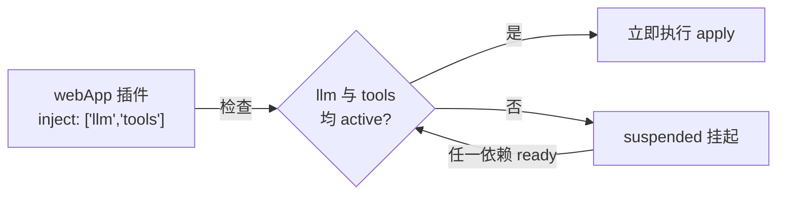
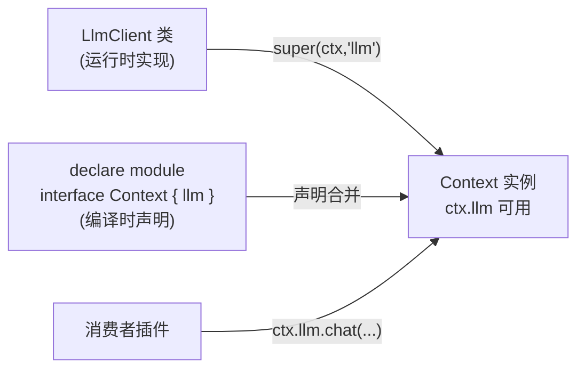
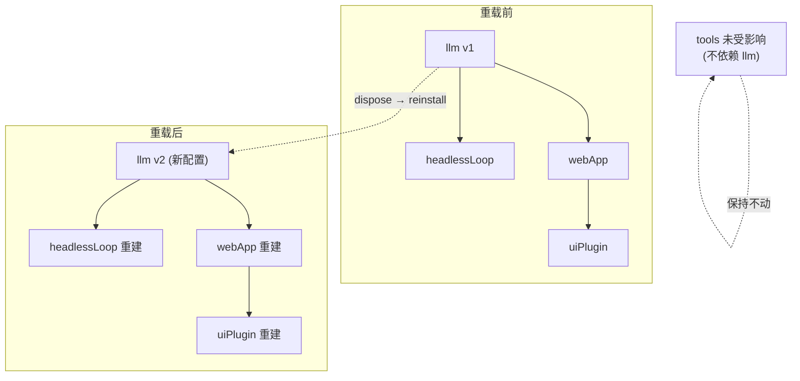

# 03 - 服务与依赖注入

> 上一章解决了"插件从哪来、配置怎么叠"；本章解决"插件之间如何协作"。Cordis 的答案是 Service + `inject`：把有状态的长生命周期对象声明为服务，用数组声明依赖，框架负责拓扑排序、挂起等待和作用域隔离。

前置阅读：[[deepseek-harness/2架构/01-Cordis内核原理|Cordis 内核原理]]、[[deepseek-harness/2架构/02-Profile与Bundle|Profile 与 Bundle]]
后续章节：[[deepseek-harness/2架构/04-事件系统详解|事件系统详解]]

---

## 1. 插件的三种形态

先回顾全景。一个 Cordis 插件是导出 `apply(ctx)` 的 TS 模块，共有三种形态：

```typescript
// 形态一：函数——最简单，适合纯行为型插件（只监听事件、不提供状态）
import { Context } from 'cordis'

export function apply(ctx: Context) {
  ctx.on('tool:invoke', (e) => console.log('调用工具:', e.name))
}

// 形态二：对象——需要携带默认配置时使用
export const plugin = {
  name: 'audit',                 // 插件名，用于日志与调试
  inject: ['logger'],            // 可选的依赖声明
  apply(ctx: Context) {
    /* ... */
  },
}

// 形态三：类 extends Service——需要维护内部状态、被其他插件消费时使用
// 这是本章的主角
export class Tools extends Service {
  static inject = []             // 无依赖也要显式写空数组，表明"已考虑过"
  constructor(ctx: Context) {
    super(ctx, 'tools')          // 第二参数是服务名，决定它在 ctx 上的属性名
  }
}
```

判断标准一句话：**无状态用函数，带配置用对象，要被别人 `ctx.xxx` 访问就用类 Service**。

---

## 2. Service 基类用法

### 2.1 最小完整示例

```typescript
import { Context, Service } from 'cordis'

// 一个工具注册表服务：维护 name -> handler 的映射
export class ToolRegistry extends Service {
  // 静态依赖声明：本服务启动前需要哪些其他服务 ready
  // 这里依赖 llm 服务（工具执行时要请求模型做参数抽取）
  static inject = ['llm']

  private registry = new Map<string, Handler>()   // 服务内部的私有状态

  constructor(ctx: Context) {
    super(ctx, 'tools')   // 注册为名为 'tools' 的服务
                          // 此后任意作用域内 ctx.tools 即为本实例
  }

  // 对外 API：注册工具
  register(name: string, handler: Handler) {
    this.registry.set(name, handler)
  }

  // 对外 API：调用工具
  async invoke(name: string, args: unknown): Promise<unknown> {
    const handler = this.registry.get(name)
    if (!handler) throw new Error(`未知工具: ${name}`)
    return handler(args)
  }
}

export const apply = (ctx: Context) => {
  ctx.plugin(ToolRegistry)

  // 挂载完成后即可在任意插件中通过 ctx 访问：
  ctx.on('ready', () => {
    ctx.tools.register('echo', async (args) => args)   // 类型安全的方法调用
  })
}
```

三个关键点：

1. **`static inject`** 写在类上而非构造参数里，因为 Cordis 需要在**实例化之前**就知道依赖——实例化本身就是依赖满足后的动作；
2. **`super(ctx, 'tools')`** 的第二个参数决定了服务的访问路径，服务名即 ctx 属性名；
3. Service 实例的生命周期与 Fiber 状态机绑定：active 时可用，disposal 时随作用域销毁。

### 2.2 带配置的服务

```typescript
export class LlmClient extends Service {
  static inject = []

  constructor(
    ctx: Context,
    public config: {
      provider?: string     // 模型提供方，默认 deepseek
      model?: string        // 模型名
      temperature?: number  // 采样温度
    } = {},
  ) {
    super(ctx, 'llm')
    // 配置通常来自四层合并后的最终配置树，
    // 由 dsh 启动器通过 plugin(LlmClient, config) 传入
    this.config.provider ??= 'deepseek'
    this.config.temperature ??= 0.7
  }

  async chat(messages: ChatMessage[]): Promise<string> {
    /* 调用模型 API */
    return ''
  }
}
```

配置变更时（例如 profile 层 patch 更新触发重载），Cordis 会 dispose 掉旧实例并用新配置重建——这就是上一章说的"配置热更新免费获得"。

---

## 3. inject 声明依赖：解析时机与挂起语义

### 3.1 解析时机

`inject: ['tools']` 的含义是：

> 在本插件的 `apply` 执行**之前**，名为 `tools` 的服务必须已经到达 active 状态。

如果此刻 `tools` 还没 ready（它自己也在等别的依赖），本插件进入上一章 Fiber 状态机的 `suspended` 态安静等待；一旦目标 ready，自动恢复安装。整个过程不需要你写一行轮询或回调代码。



```typescript
// 依赖 webApp 需要 llm 和 tools 两个服务
class WebApp extends Service {
  static inject = ['llm', 'tools']   // 数组顺序无关，框架自行拓扑

  constructor(ctx: Context) {
    super(ctx, 'webServer')
    // 执行到这里是一种"承诺"：ctx.llm 与 ctx.tools 必然可用且非 undefined
  }
}
```

### 3.2 运行时访问 vs 安装期等待

区分两种获取依赖的方式：

| 方式 | 时机 | 适用 |
| --- | --- | --- |
| `static inject` + 直接访问 | 安装期就要求 ready | 构造时就要用依赖（读它的配置、注册进它的表） |
| `ctx.on('service-ready')` 类延迟钩子 / 回调中访问 | 使用时才访问 | 只在事件发生时才用到 |

经验法则：**能用 inject 就用 inject**——它把"这个服务依赖谁"变成了可静态分析的元数据，热重载、卸载顺序、循环依赖检测全部受益。

---

## 4. Provide / Consume 与类型安全：`ctx.llm` 是怎么来的

细心的读者会问：`ctx.tools`、`ctx.llm` 这些属性在 `Context` 类型定义里并不存在，为什么 TypeScript 不报错？

答案是 **TS 声明合并（declaration merging）**：每个服务在自己的模块里对 `Context` 接口做增强。

```typescript
// dsh-base 包内的某个模块
declare module 'cordis' {
  interface Context {
    llm: LlmClient        // 告诉 TS：所有 Context 上都有 llm 属性
    tools: ToolRegistry   // 以及 tools 属性
  }
}

// 另一个包（比如自定义工具 bundle）同样可以增强：
declare module 'cordis' {
  interface Context {
    search: SearchService // 自研服务也获得同等的类型地位
  }
}
```

声明合并是全局叠加的，于是形成了一条完整的类型链：



这套 provide/consume 模型的分工：

- **provide 侧**（服务作者）：写好类 + `super(ctx, 名字)` + 一段 `declare module` 增强；
- **consume 侧**（业务插件）：`static inject = ['llm']` 声明依赖，然后直接 `ctx.llm.chat()`，全程有补全、有类型检查；
- **框架**：保证注入时机正确，并在服务被替换/卸载时让引用失效。

对比裸 Node 项目里常见的"单例 import"：

```typescript
// 反面教材：模块级单例
// llm.ts 导出 export const llm = new LlmClient()
// 消费者 import { llm } from './llm'
// 问题：无法替换实现、无法按作用域隔离、测试必须 mock 模块系统
```

而 Cordis 的服务解析永远经由当前 ctx，作用域不同看到的实例不同（下一节），测试时 fork 一个干净 ctx 注入假实现即可。

---

## 5. 作用域隔离：fork 出来的子 Context 服务独立

回顾第一章的插件树：`ctx.fork()` 派生子作用域。服务的可见性规则是：

- 子作用域**继承**父链上所有 active 服务；
- 子作用域可以**遮蔽**（shadow）同名服务——子上的同名实例优先；
- 各子作用域的同名服务**互为独立实例**。

```typescript
const root = new Context()
root.plugin(ToolRegistry)          // 全局工具表

// 为每个租户 fork 独立作用域
function tenantScope(tenantId: string): Context {
  const scope = root.fork()

  // 遮蔽全局 tools：租户只能看到自己被授权的工具子集
  scope.plugin(TenantToolRegistry, { tenantId })

  return scope
}

const alice = tenantScope('alice')
const bob = tenantScope('bob')

alice.tools.invoke('deploy', {})   // 走 Alice 的实例与权限
bob.tools.invoke('deploy', {})     // 走 Bob 的实例——两者完全隔离
```

### 5.1 会话级隔离场景

dsh 中最常见的隔离单元是**会话**：

```typescript
// 每个 Agent 会话一个子作用域，会话内一切状态随 dispose 清零
export function startSession(root: Context, sessionId: string) {
  const session = root.fork()

  // 会话级服务：对话历史、临时变量、本次会话专属的工具包装
  session.plugin(SessionHistory)
  session.plugin(EphemeralStore)

  // 监听也挂在会话作用域上，天然只收本会话的事件
  session.on('turn:start', () => session.history.markTurn())

  return session
}

export function endSession(session: Context) {
  session.dispose()   // SessionHistory/EphemeralStore/全部监听一并回收
}
```

没有全局 Map 手工清理、没有 WeakRef 技巧——作用域就是垃圾回收的边界。

---

## 6. 嵌套上下文与热重载：只重建受影响的子树

当某个服务的配置变化（或被替换）时，Cordis 不会重启整个进程，而是沿着依赖图做**最小重载**：

1. 目标服务 dispose；
2. 以新配置重新 install；
3. 所有 `inject` 了该服务的下游插件依次 dispose 并重装；
4. 无关子树纹丝不动。



```typescript
// 演示：手动触发一次服务级热重载
const root = new Context()
root.plugin(LlmClient, { model: 'deepseek-chat' })
root.plugin(WebApp)

// 运行一段时间后切换模型：
root.plugin(LlmClient, { model: 'deepseek-reasoner' })
// 内部过程：
// 1. 同名服务 'llm' 触发旧实例 disposal
// 2. 新配置实例 install 到 active
// 3. WebApp 因 static inject 含 'llm' 被标记失效 → dispose → 重装
// 4. 其他未依赖 llm 的插件完全不受影响
console.log(root.llm.config.model)   // 'deepseek-reasoner'
```

这正是 Profile 四层配置能够支持"改一行 patch、只重装相关服务"体验的运行时基础——配置层（[[deepseek-harness/2架构/02-Profile与Bundle|Profile 与 Bundle]]）与生命周期层（[[deepseek-harness/2架构/01-Cordis内核原理|Fiber 状态机]]）在这里闭环。

---

## 7. 与 Spring DI 对比

如果你来自 Java 世界，下表能快速校准认知：

| 维度 | Spring DI | Cordis DI |
| --- | --- | --- |
| 依赖声明方式 | XML `<property ref>` 或注解 `@Autowired` | `static inject = ['llm']` 数组 |
| 默认生命周期 | singleton 单例（容器级） | 单例，但是**每作用域**单例（scope 树节点级） |
| 作用域模型 | 平铺的 scope 关键字（singleton/request/session） | 任意深度的 Context 树，fork 即新作用域 |
| 装配时机 | 容器启动时一次性静态装配 | 启动装配 + 运行时可变（随时挂新插件/换服务） |
| 循环依赖 | 默认允许（三级缓存解决 setter 注入） | 不允许，检测到即报错（见下节） |
| 卸载 | 容器关闭时统一 destroy | 任意粒度 dispose，逆序级联 |
| 类型安全来源 | 泛型 getBean + 编译期注解处理 | TS 声明合并 augment ctx 类型 |

最本质的差异是**作用域模型**：Spring 的 scope 是预置枚举，Cordis 的作用域是一棵你可以自由生长的树。"每个会话一个独立世界"在 Spring 里要靠 request scope 变通，在 Cordis 里就是一次 fork。

---

## 8. 常见坑

### 8.1 循环依赖

A inject B、B inject A 时无法完成拓扑排序，Cordis 会在安装阶段直接抛错而不是死锁：

```
Error: circular dependency detected: a -> b -> a
```

解法不是绕过检测，而是重新审视职责边界。典型重构是把"双向调用"改为"事件解耦"：

```typescript
// 重构前：a 与 b 互相 inject —— 死锁
// 重构后：通过事件通信，谁也不依赖谁
export function apply(ctx: Context) {
  // b 不再 inject a，而是监听 a 发出的事件
  ctx.on('a:request', (payload) => {
    /* b 处理并 emit('b:response', ...) */
  })
}
```

### 8.2 忘记声明 inject 拿到 undefined

```typescript
// 错误示范
class BadPlugin extends Service {
  static inject = []               // ← 忘了声明 'llm'
  constructor(ctx: Context) {
    super(ctx, 'bad')
    console.log(ctx.llm)           // 大概率 undefined：安装顺序不受控！
  }
}

// 正确做法
class GoodPlugin extends Service {
  static inject = ['llm']          // 声明之后才可能拿到非 undefined
  constructor(ctx: Context) {
    super(ctx, 'good')
    console.log(typeof ctx.llm.chat === 'function')   // true，有保障
  }
}
```

记住因果方向：**不是"inject 让你能访问"，而是"inject 保证访问时已 ready"**。类型上 `ctx.llm` 因为声明合并总是"存在"，但运行时是否有值由 inject 决定。

### 8.3 服务名冲突

两个包都执行了 `super(ctx, 'tools')` 时，后挂载者静默替换前者（第一章讲过这是特性）。但如果是无意撞名，就会出现"我的工具表莫名其妙丢了"的灵异现象。排查手段：

```bash
# dump 配置看不出服务名冲突，需要在启动日志里观察 service 注册记录
dsh --profile web --verbose 2>&1 | rg "service"
# 关注同名服务出现两次的行
```

防御性约定：自研服务的名字加项目前缀（如 `acme-tools`），把命名空间留给官方 bundle。

---

## 9. 小结

- 插件三形态按需选择：函数（无状态）、对象（带配置）、类 extends Service（需被 ctx 访问）。
- `static inject` 数组是依赖声明的唯一正确姿势，框架据此完成拓扑排序与挂起等待。
- `ctx.llm` 这类属性的运行时值来自 Service 注册，编译期类型来自 `declare module` 声明合并。
- fork 出的作用域继承并可遮蔽父服务，各子树实例互不影响——会话隔离的标准实现。
- 热重载沿依赖图最小化重建，只有受影响子树会 dispose/reinstall。
- 三大坑：循环依赖改事件解耦、漏写 inject 得到 undefined、服务名撞车加前缀。

服务是"静态结构"，但 Agent 运行的动态面靠的是事件。下一章逐个拆解四种发射语义与三级扩展点：[[deepseek-harness/2架构/04-事件系统详解|事件系统详解]]。
