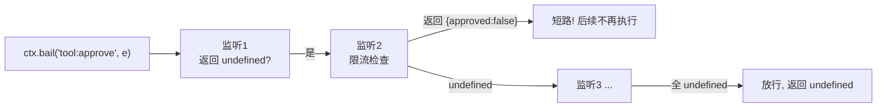
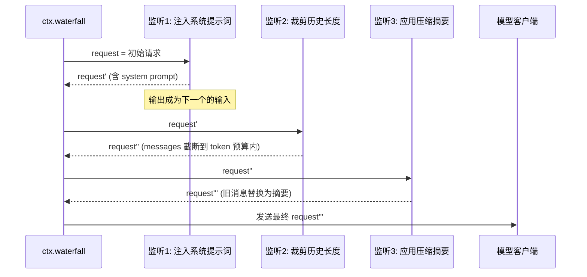

# 04 - 事件系统详解

> 前两章分别讲了"结构"（服务与作用域）与"配置"（Profile 与 Bundle）。本章讲"动态"：插件之间如何响应彼此的行为。Cordis 提供四种发射语义、三级扩展点，本章逐一精讲，并以审计日志与限流两个横切关注点实战收尾。

前置阅读：[[deepseek-harness/2架构/01-Cordis内核原理|Cordis 内核原理]]、[[deepseek-harness/2架构/03-服务与依赖注入|服务与依赖注入]]

---

## 1. 总览：四种发射语义

同一个事件总线，四种 `emit` 变体，差异集中在两点：**监听者如何并发**与**返回值如何处理**。

| 语义 | 并发模型 | 返回值 | 典型用途 |
| --- | --- | --- | --- |
| `emit` | 全部异步并发，不等待 | 忽略 | 广播通知：日志、指标 |
| `bail` | 按注册序执行，可短路 | 第一个非 undefined 的返回值 | 拦截审批：权限、限流 |
| `serial` | 严格串行，依次 await | 最后一个监听者的返回值 | 有顺序副作用的钩子 |
| `waterfall` | 串行 + 值传递 | 最终值（逐层加工） | 中间件管道：请求改写 |

记忆口诀：

> **emit 是喇叭，bail 是关卡，serial 是流水线，waterfall 是传送带。**

```typescript
import { Context } from 'cordis'

export function apply(ctx: Context) {
  // 四种监听注册 API 与四种发射一一对应
  ctx.on('tool:invoke', listener)          // 参与 emit 广播
  ctx.on('tool:approve', listener)         // 参与 bail 短路链
  ctx.serial('turn:run', listener)         // 参与 serial 队列
  ctx.waterfall('request:build', listener) // 参与 waterfall 管道
}
```

---

## 2. emit：广播语义

最基础的形态。所有监听者被并发调用（每个返回 Promise 都会被框架接住），框架等待全部 settle 但**丢弃全部返回值**；任何监听者抛错不会阻断其他监听者。

```typescript
// 发布侧：只管喊一嗓子，不在乎谁听见、听见后干什么
ctx.emit('tool:invoke', {
  name: 'web_search',
  args: { query: 'cordis framework' },
  sessionId: 's-001',
})

// 监听侧 A：写审计日志
ctx.on('tool:invoke', async (e) => {
  await appendLog(`[${e.sessionId}] invoke ${e.name}`)
})

// 监听侧 B：上报指标
ctx.on('tool:invoke', (e) => {
  metrics.increment(`tool.${e.name}.count`)
})

// 监听侧 C：故意抛错——不影响 A/B 已完成或正在进行的处理
ctx.on('tool:invoke', () => {
  throw new Error('这个监听者坏了')
})
```

适用判断：如果你发现自己在 emit 的监听器里写了"如果返回 false 就取消"，说明选错了语义——那应该用 bail。**emit 只用于"发生过了，知会一声"**。

---

## 3. bail：拦截器语义

bail 按注册顺序逐个调用监听者；**第一个返回非 undefined 值的监听者获胜**，后续监听者不再执行；若全部返回 undefined 则放行。



dsh 中权限审批就是用 bail 实现的：

```typescript
// 审批链：多个安全插件各管一段，任何一个拒绝即终止
interface ApprovalEvent {
  tool: string
  args: unknown
}

interface ApprovalResult {
  approved: boolean
  reason?: string
}

export const apply = (ctx: Context) => {
  // 第一关：黑名单拦截
  ctx.on('tool:approve', (e: ApprovalEvent): ApprovalResult | undefined => {
    if (BLACKLIST.has(e.tool)) {
      return { approved: false, reason: '工具在黑名单中' }  // 短路！
    }
    return undefined   // 弃权，交给下一关
  })

  // 第二关：人工确认（交互式 profile 下）
  ctx.on('tool:approve', async (e: ApprovalEvent): Promise<ApprovalResult | undefined> => {
    if (!requiresConfirmation(e.tool)) return undefined
    const yes = await promptUser(`允许调用 ${e.tool}? [y/N]`)
    return { approved: yes, reason: yes ? '用户批准' : '用户拒绝' }
  })
}

// 执行侧：拿到第一个非 undefined 的结果
const verdict = await ctx.bail('tool:approve', { tool: 'rm_rf', args: {} })
if (verdict && !verdict.approved) {
  throw new Error(`调用被拦截: ${verdict.reason}`)
}
```

bail 的精髓在于"弃权协议"：监听者对不关心的事件返回 undefined 表达弃权，让链条继续向更有资格的裁判传递。这与浏览器事件的 stopPropagation、中间件的 next() 是同构思想，但语义更显式。

---

## 4. serial：串行依次 await

serial 保证监听者按注册顺序**一个完成后才开始下一个**，适合存在顺序副作用的多步处理。

```typescript
// 场景：一次 Agent 循环迭代前，需要按顺序做三件事，
// 且每一步依赖上一步的落盘结果
ctx.serial('agent:iteration:start', async (payload) => {
  await snapshotSession(payload.sessionId)     // 第一步：快照会话状态
})

ctx.serial('agent:iteration:start', async (payload) => {
  await rotateTempFiles(payload.sessionId)     // 第二步：轮转临时文件(依赖快照完成)
})

ctx.serial('agent:iteration:start', async (payload) => {
  await notifyWatcher(payload.iteration)       // 第三步：通知观察者(依赖文件就绪)
})
```

与 emit 的区别一句话说清：**emit 关心"都做了"，serial 关心"按顺序做完"**。代价是总耗时为各监听者之和，所以不要把纯通知类监听挂到 serial 上拖慢热路径。

---

## 5. waterfall：值瀑布传递

waterfall 同样串行执行，但每个监听者的返回值会作为输入传给下一个——前者输出是后者输入，形成一条数据加工管道。



代码实现同一管道：

```typescript
interface ChatRequest {
  messages: ChatMessage[]
  system?: string
  maxTokens?: number
}

export const apply = (ctx: Context) => {
  // 第一环：补默认 system prompt
  ctx.waterfall('llm:request', (req: ChatRequest): ChatRequest => ({
    ...req,
    system: req.system ?? '你是 RootStack 助手。',
  }))

  // 第二环：截断超长历史（拿到的是上一环加工后的 req）
  ctx.waterfall('llm:request', (req: ChatRequest): ChatRequest => {
    let messages = [...req.messages]
    while (estimateTokens(messages) > (req.maxTokens ?? 8192)) {
      messages = messages.slice(1)          // 从最旧开始丢
    }
    return { ...req, messages }
  })

  // 第三环：把被丢掉的部分换成滚动摘要
  ctx.waterfall('llm:request', (req: ChatRequest): ChatRequest => ({
    ...req,
    messages: withRollingSummary(req.messages),
  }))
}

// 消费侧：一条瀑布走完，得到最终请求
const finalReq = await ctx.waterfall('llm:request', baseRequest)
await ctx.llm.chat(finalReq.messages)
```

三个管道设计要点：

1. **每一环都应返回新对象而非原地改**，保证管道可预测、可调试（在任意两环之间插入日志监听即可看到当时的值）；
2. **返回 undefined 会破坏瀑布**——waterfall 里忘记 return 是最常见的 bug，类型标注返回值可以防住；
3. 环的顺序由注册顺序决定，跨 bundle 时由 bundles 清单顺序间接控制（呼应 [[deepseek-harness/2架构/02-Profile与Bundle|Profile 与 Bundle]] 的有序堆叠）。

---

## 6. 三级扩展点体系

dsh 把事件按所属层级分为三档，不同档位对应不同的挂载策略：

| 层级 | 代表事件 | 触发频率 | 典型消费者 |
| --- | --- | --- | --- |
| 会话级 | `turn:start` / `turn:end` / `session:open` / `session:close` | 每轮对话一次 | 计费统计、会话归档 |
| Agent 级 | `loop:iteration` / `loop:halt` / `plan:update` | 每次循环迭代 | 步数限制、轨迹记录 |
| 能力级 | `tool:invoke` / `tool:result` / `tool:approve` | 每次工具调用 | 审计、限流、缓存 |

### 6.1 挂载策略示例：三层各就各位

```typescript
export const apply = (ctx: Context) => {
  // ---- 会话级：低频，可以做重活 ----
  ctx.on('session:open', (e) => {
    console.log(`会话 ${e.id} 开启, 配置版本 ${e.configRev}`)
  })
  ctx.on('turn:end', async (e) => {
    await flushBilling(e.sessionId)        // 每轮结算一次费用
  })

  // ---- Agent 级：中频，注意累积开销 ----
  ctx.on('loop:iteration', (e) => {
    if (e.iteration >= MAX_ITERATIONS) {
      ctx.emit('loop:halt', { reason: 'max-iterations', sessionId: e.sessionId })
    }
  })

  // ---- 能力级：高频热路径，监听器必须轻 ----
  ctx.on('tool:result', (e) => {
    metrics.observe(`tool.${e.name}.latency`, e.durationMs)
  })
}
```

选择层级的决策方法：**问"我的横切逻辑的最小触发单元是什么"**。计费按轮次算就挂 turn:end；步数限制按迭代算就挂 loop:iteration；安全审计必须精确到每次工具调用就只能挂能力级。挂错层级要么漏事件，要么白耗性能。

---

## 7. 与 Node EventEmitter 对比

Cordis 事件总线长得像 EventEmitter，但内核完全不同：

| 维度 | Node EventEmitter | Cordis 事件系统 |
| --- | --- | --- |
| 监听者调用 | 同步直呼，Promise 被无视 | 统一异步化，四种并发模型可选 |
| 返回值语义 | 无意义 | emit 忽略 / bail 短路取值 / serial 取末值 / waterfall 级联 |
| 错误传播 | 单独 error 事件约定，漏接即崩 | 框架捕获，按作用域上报，不炸进程 |
| 可见性 | 单实例全局 | 由 Context 树决定，fork 即隔离边界 |
| 卸载 | 手动 removeListener | 随作用域 dispose 自动清理 |

最容易踩的差异是第一条：EventEmitter 里 `ee.emit()` 对 async 监听器的 Promise 不做任何处理，错误静默丢失；Cordis 把"监听者是 async 函数"当作一等公民处理，这也是 serial/waterfall 能够存在的先决条件。

---

## 8. 实战一：审计日志插件

需求：把**每一次工具调用**（谁、何时、调了什么、参数、结果）写入 append-only 日志文件。这是典型的能力级横切关注点。

```typescript
import { Context } from 'cordis'
import { appendFile } from 'node:fs/promises'

interface ToolInvokeEvent {
  sessionId: string
  name: string
  args: unknown
}

interface ToolResultEvent {
  sessionId: string
  name: string
  result?: unknown
  error?: string
  durationMs: number
}

export class AuditLogger {
  constructor(private ctx: Context) {}

  private line(event: Record<string, unknown>): string {
    // JSONL 格式：一行一个 JSON 对象，天然 append-only
    return JSON.stringify({ ts: Date.now(), ...event }) + '\n'
  }

  start() {
    this.ctx.on('tool:invoke', async (e: ToolInvokeEvent) => {
      await appendFile(
        'audit.log',
        this.line({ kind: 'invoke', ...e }),
      )
    })

    this.ctx.on('tool:result', async (e: ToolResultEvent) => {
      await appendFile(
        'audit.log',
        this.line({ kind: 'result', ...e }),
      )
    })
  }
}

export const apply = (ctx: Context) => {
  new AuditLogger(ctx).start()
}
```

实现要点：

- **用 emit 而非 serial**：审计是旁路观察者，绝不能阻塞工具热路径；偶发写失败也不应影响主流程；
- JSONL 天然满足 append-only 与事后 grep；
- 文件句柄若需常驻（性能考虑换 createWriteStream），应通过 `ctx.effect(() => stream; return () => stream.close())` 登记，随作用域自动关闭——呼应 [[deepseek-harness/2架构/01-Cordis内核原理|Cordis 内核原理]] 的可逆副作用原则。

---

## 9. 实战二：限流插件

需求：每个会话每分钟最多调用 N 次工具，超频直接拦截。这是 bail 语义的标准应用。

```typescript
import { Context } from 'cordis'

interface ApprovalResult {
  approved: boolean
  reason?: string
}

export class RateLimiter {
  private windowMs = 60_000      // 时间窗：1 分钟
  private limit: number

  // 每个会话独立的滑动计数：sessionId -> 时间戳数组
  private hits = new Map<string, number[]>()

  constructor(private ctx: Context, limit = 30) {
    this.limit = limit
  }

  start() {
    // 用 bail 挂进审批链：返回非 undefined 即拥有裁决权
    this.ctx.on('tool:approve', (e: { sessionId: string }): ApprovalResult => {
      if (this.allow(e.sessionId)) {
        return undefined                      // 未超频 → 弃权，交给其他裁判
      }
      return {
        approved: false,
        reason: `触发限流: 每 ${this.windowMs / 1000}s 内至多 ${this.limit} 次工具调用`,
      }
    })

    // 会话结束时清掉对应计数，避免 Map 无限增长
    this.ctx.on('session:close', (e: { id: string }) => {
      this.hits.delete(e.id)
    })
  }

  private allow(sessionId: string): boolean {
    const now = Date.now()
    const arr = (this.hits.get(sessionId) ?? []).filter(
      (t) => now - t < this.windowMs,          // 淘汰窗口外的旧命中
    )
    if (arr.length >= this.limit) {
      this.hits.set(sessionId, arr)
      return false                             // 窗口内已满 → 拒绝
    }
    arr.push(now)                              // 记录本次命中并放行
    this.hits.set(sessionId, arr)
    return true
  }
}

export const apply = (ctx: Context) => {
  ctx.plugin(RateLimiter, { limit: 30 })
}
```

设计要点：

- **bail + undefined 弃权协议**：限流器只在超频时发声，平时沉默，因此可以与人工确认、黑名单等其他 bail 监听自由叠加，互不知晓对方存在；
- 计数状态挂在插件实例上，而插件实例挂在哪个作用域决定了限流的隔离粒度——本例若改为在每个 `session.fork()` 上挂载，连 `hits` Map 都可以简化成单会话数组；
- `session:close` 清理防止内存泄漏，或者更彻底地：把整个 RateLimiter 挂到会话作用域，dispose 时自然回收。

两个实战合起来看，正好覆盖了横切关注点的两大门派：**旁路观察用 emit，流程干预用 bail**。需要加工数据的第三种情况则交给 waterfall（见第 5 节的 llm:request 管道）。

---

## 10. 小结

- 四种语义记口诀：emit 是喇叭、bail 是关卡、serial 是流水线、waterfall 是传送带。
- bail 的弃权协议（返回 undefined 放行）使多个拦截插件可以无感知叠加。
- 三级扩展点按最小触发单元选择挂载层：会话级低频重活、Agent 级中频、能力级高频轻量。
- 相比 Node EventEmitter，Cordis 事件的异步一等公民地位与作用域可见性是本质差异。
- 横切关注点三板斧：观察用 emit、干预用 bail、加工用 waterfall。

至此架构篇四章完结：内核（[[deepseek-harness/2架构/01-Cordis内核原理|Cordis 内核原理]]）、分发（[[deepseek-harness/2架构/02-Profile与Bundle|Profile 与 Bundle]]）、结构（[[deepseek-harness/2架构/03-服务与依赖注入|服务与依赖注入]]）、动态（本章）。接下来可以进入实战篇，动手编写自己的 bundle。
