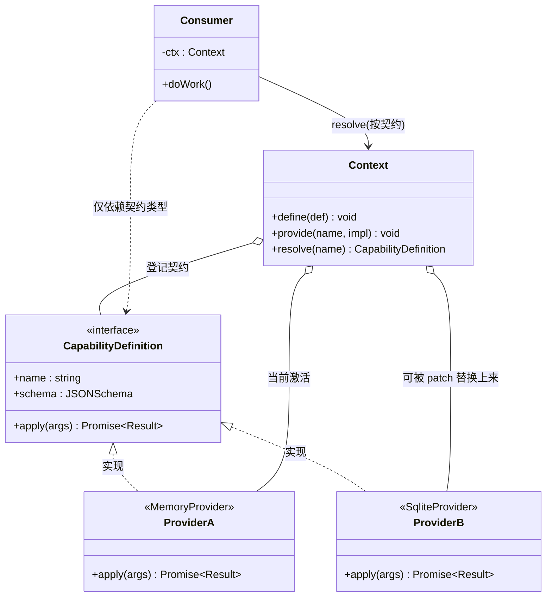
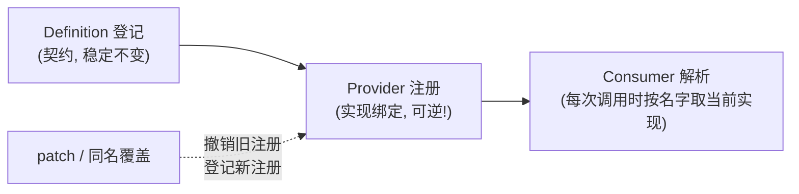
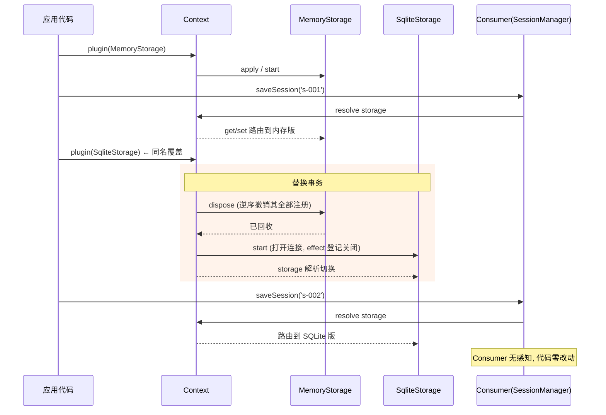
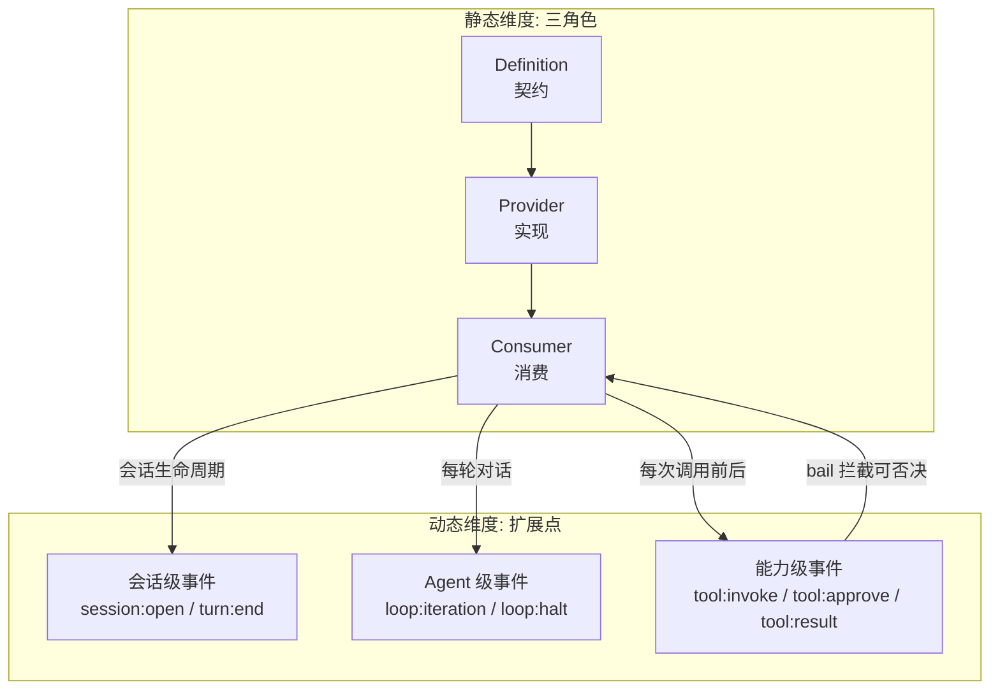

# 05 - 能力三角色模型

> 前四章分别讲了内核、配置、结构与事件。本章回答一个更根本的设计问题：dsh 凭什么敢说"一切皆可替换"？答案是一套贯穿全框架的约定——**能力（Capability）的三角色模型**：Definition 定义契约、Provider 提供实现、Consumer 通过契约消费。三者解耦之后，替换任何一个 Provider 都不需要改动一行 Consumer 源码。

前置阅读：[[deepseek-harness/2架构/01-Cordis内核原理|Cordis 内核原理]]、[[deepseek-harness/2架构/03-服务与依赖注入|服务与依赖注入]]、[[deepseek-harness/2架构/04-事件系统详解|事件系统详解]]

后续章节：[[deepseek-harness/2架构/06-LLM适配器与StreamChunk|LLM 适配器]]、[[deepseek-harness/2架构/07-沙箱审批与安全|沙箱审批与安全]]

---

## 1. 问题：为什么"替换"在传统框架里那么难

设想一个常见需求：你的 Harness 默认把会话状态存内存，现在想换成 SQLite 持久化。在没有解耦设计的框架里，你通常会遇到以下至少一条：

1. **Consumer 直接 import 实现**：`import { MemoryStore } from './store'`——类型、构造参数、甚至静态方法都焊死在调用点；
2. **框架核心持有具体类**：会话管理器内部 `new MemoryStore()`，想换就得改框架源码或等官方留口子；
3. **接口里混进了实现细节**：所谓"抽象接口"上长着 `getMap(): Map<string, Entry>` 这种暴露内存结构的方法，SQLite 根本没法实现。

三条路殊途同归：**换实现 = 改源码**。而 dsh 的目标是任何能力都能被 patch 替换且零改源码，这就要求从第一天起就把"定义"和"实现"彻底分开。

---

## 2. 三角色总览

dsh 把每个能力拆成三个正交的角色：

| 角色 | 职责 | 类比 | 数量关系 |
| --- | --- | --- | --- |
| Definition | 定义能力契约：接口签名 + 参数 schema，**不含任何实现** | Java 的 interface / WSDL | 每个能力恰好一个 |
| Provider | 注册该契约的一个实现 | JDBC 驱动 / SPI 实现包 | 可以有多个，同时只激活一个 |
| Consumer | 只面向契约编码，通过 ctx 解析并调用 | 使用 `DataSource` 的业务代码 | 任意多 |

三方关系的静态视图：



读图要点：

1. **Consumer 到 Provider 没有任何箭头**——它只认识 `CapabilityDefinition` 这个契约类型和负责解析的 Context。这是整个模型的灵魂：依赖箭头全部指向抽象；
2. ProviderA 和 ProviderB 互不相识，可以共存于同一个进程（不同作用域各自激活一个），也可以一先一后顶替；
3. Context 是唯一的"接线板"：Definition 在此登记，Provider 在此注册，Consumer 在此解析。

一句话总结三者分工：

> **Definition 说"能做什么"，Provider 说"怎么做"，Consumer 说"什么时候做"。**

---

## 3. 为什么这是"一切可替换"的关键机制

回顾 [[deepseek-harness/2架构/01-Cordis内核原理|Cordis 内核原理]] 的无特权内核哲学："插件对 Context 的一切注册都是可逆副作用"。这句话需要一个落点——**可逆的到底是什么？**

答案是：正是三角色模型中的"Provider 注册"这一步。把机制拆开看：



关键推论有三条：

1. **替换的最小单位是实现绑定，而非代码**。因为 Consumer 只引用契约名，Context 里"名字 → 实现"的映射换了，所有 Consumer 的下一次解析自动拿到新实现。没有编译期焊死，就没有需要重写的调用点。
2. **可逆性由 Cordis 兜底**。Provider 注册本身是一条 Cordis 注册项，随挂载它的 Fiber 卸载而精确撤销——旧 Provider 的连接池、定时器、监听器一并回收，不会留下半死的实例（呼应 [[deepseek-harness/2架构/03-服务与依赖注入|服务与依赖注入]] 的生命周期保证）。
3. **契约稳定是替换自由的前提**。只要 Definition 不变，Provider 怎么换代、Consumer 怎么增长，两边都互不牵连。所以 dsh 对 Definition 的变更极其慎重——它是公共 API，一旦发布就默认冻结（检查清单见第 8 节）。

反过来说，如果一个能力绕过了这套模型——比如某插件偷偷 `require` 了另一个插件的内部模块——它就脱离了 Context 的管辖，替换时必然产生连锁破坏。dsh 用服务命名空间 + 类型安全的解析把这种逃逸堵死：**一切消费都必须过契约**。

---

## 4. 完整示例：storage 能力的三角色实现

下面用一套完整可运行的 TypeScript 代码走通三角色。场景：会话状态的存取能力 `storage`。

### 4.1 Definition：契约先行

```typescript
// ============ storage.definition.ts ============
// 契约层：只有类型和 schema，零实现、零依赖任何具体存储库

/** storage 能力对外暴露的操作集合 */
export interface StorageCapability {
  /** 读取一个键；不存在时返回 undefined */
  get(key: string): Promise<string | undefined>
  /** 写入一个键（upsert 语义） */
  set(key: string, value: string): Promise<void>
  /** 删除一个键；键不存在不报错 */
  delete(key: string): Promise<void>
  /** 列出全部键（用于会话恢复时的遍历） */
  keys(): Promise<string[]>
}

/** 能力在 Context 中登记时的元信息 */
export const storageDefinition = {
  name: 'storage',                       // 契约唯一名，Consumer 靠它解析
  version: '1.0.0',                      // 契约版本；语义化版本，破坏性变更必须升 major
  // 参数 schema：声明这个能力接受哪些配置项，
  // Provider 的构造配置会被 schema 校验后再传入
  schema: {
    type: 'object',
    properties: {
      namespace: { type: 'string', default: 'default' },  // 键前缀隔离区
    },
  },
} as const

// 类型体操：让 Consumer 侧能用 ctx.storage 拿到强类型的契约，
// 而 Provider 侧只需实现 StorageCapability 接口
declare module 'cordis' {
  interface Events {
    /* 略：能力事件见第 6 节 */
  }
  interface Context {
    storage: StorageCapability
  }
}
```

注意 Definition 里没有出现任何 `sqlite`、`Map`、`fs` 字样——它甚至不知道世界上有几种存储介质。**契约里混进一丝实现痕迹，替换自由就少一分**。

### 4.2 Provider 一：内存实现

```typescript
// ============ storage.memory.ts ============
// 内存 Provider：开发与测试用，进程退出即失忆

import { Context } from 'cordis'
import type { StorageCapability } from './storage.definition'

export class MemoryStorage implements StorageCapability {
  // 每个 namespace 一个独立的 Map，实现配置里的隔离语义
  private spaces = new Map<string, Map<string, string>>()

  constructor(
    private ctx: Context,
    private config: { namespace?: string },
  ) {
    // 记录日志方便调试（ctx.logger 由日志服务提供）
    this.ctx.logger.info('memory storage 就绪, namespace=%s', config.namespace)
  }

  /** 取本 namespace 的存储区；懒创建 */
  private get space(): Map<string, string> {
    const ns = this.config.namespace ?? 'default'
    let m = this.spaces.get(ns)
    if (!m) {
      m = new Map()
      this.spaces.set(ns, m)
    }
    return m
  }

  async get(key: string): Promise<string | undefined> {
    return this.space.get(key)
  }

  async set(key: string, value: string): Promise<void> {
    this.space.set(key, value)
  }

  async delete(key: string): Promise<void> {
    this.space.delete(key)
  }

  async keys(): Promise<string[]> {
    return [...this.space.keys()]
  }
}
```

### 4.3 Provider 二：SQLite 实现

```typescript
// ============ storage.sqlite.ts ============
// SQLite Provider：持久化生产用
// 注意：它 import 了 better-sqlite3，但 Consumer 永远不需要知道这一点

import { Context } from 'cordis'
import Database from 'better-sqlite3'
import type { StorageCapability } from './storage.definition'

export class SqliteStorage implements StorageCapability {
  private db!: Database.Database

  constructor(
    private ctx: Context,
    private config: { namespace?: string; file?: string },
  ) {}

  /** Cordis Service 钩子：依赖全部就绪、即将进入 active 前调用 */
  async start() {
    // 打开数据库连接；effect 登记关闭函数，
    // 本 Provider 被 patch 替换或卸载时连接自动回收
    this.db = new Database(this.config.file ?? 'dsh.db')
    this.ctx.effect(() => {
      return () => this.db.close()          // 可逆副作用：连接随作用域销毁
    })

    // 建表（幂等）：namespace + key 联合主键
    this.db.exec(`
      CREATE TABLE IF NOT EXISTS kv (
        namespace TEXT NOT NULL,
        key       TEXT NOT NULL,
        value     TEXT NOT NULL,
        PRIMARY KEY (namespace, key)
      )
    `)
    this.ctx.logger.info('sqlite storage 就绪')
  }

  private stmt = new Map<string, Database.Statement>()

  /** 预编译语句缓存：同名 SQL 只 prepare 一次 */
  private sql<T>(name: string, text: string): Database.Statement {
    let s = this.stmt.get(name)
    if (!s) {
      s = this.db.prepare(text)
      this.stmt.set(name, s)
    }
    return s as Database.Statement<T extends never ? never : any>
  }

  async get(key: string): Promise<string | undefined> {
    const row = this.sql('get', `
      SELECT value FROM kv WHERE namespace = ? AND key = ?
    `).get(this.ns, key) as { value: string } | undefined
    return row?.value
  }

  private get ns(): string {
    return this.config.namespace ?? 'default'
  }

  async set(key: string, value: string): Promise<void> {
    this.sql('set', `
      INSERT INTO kv (namespace, key, value) VALUES (?, ?, ?)
      ON CONFLICT(namespace, key) DO UPDATE SET value = excluded.value
    `).run(this.ns, key, value)
  }

  async delete(key: string): Promise<void> {
    this.sql('del', `
      DELETE FROM kv WHERE namespace = ? AND key = ?
    `).run(this.ns, key)
  }

  async keys(): Promise<string[]> {
    const rows = this.sql('keys', `
      SELECT key FROM kv WHERE namespace = ? ORDER BY key
    `).all(this.ns) as Array<{ key: string }>
    return rows.map((r) => r.key)
  }
}
```

### 4.4 Consumer：只认契约

```typescript
// ============ session-manager.consumer.ts ============
// 会话管理器：storage 能力的典型 Consumer

import { Context } from 'cordis'

export class SessionManager {
  constructor(private ctx: Context) {}

  async saveSession(sessionId: string, state: object): Promise<void> {
    // 关键一行：通过 ctx.storage 访问能力，
    // 至于背后是 Map 还是 SQLite，这里既不知道也不关心
    await this.ctx.storage.set(`session:${sessionId}`, JSON.stringify(state))
  }

  async loadSession(sessionId: string): Promise<object | null> {
    const raw = await this.ctx.storage.get(`session:${sessionId}`)
    return raw ? JSON.parse(raw) : null
  }

  async dropSession(sessionId: string): Promise<void> {
    await this.ctx.storage.delete(`session:${sessionId}`)
  }

  async listSessions(): Promise<string[]> {
    // 只筛选属于会话的键——契约方法足够表达业务意图
    return (await this.ctx.storage.keys()).filter((k) => k.startsWith('session:'))
  }
}
```

### 4.5 无感切换演示

```typescript
// ============ main.ts ============
// 组装与切换演示

import { Context } from 'cordis'
import { MemoryStorage } from './storage.memory'
import { SqliteStorage } from './storage.sqlite'
import { SessionManager } from './session-manager.consumer'

async function demo() {
  const app = new Context()

  // 第一幕：挂内存版
  app.plugin(MemoryStorage, { namespace: 'prod' })
  const sm = new SessionManager(app)
  await sm.saveSession('s-001', { turns: 3 })
  console.log(await app.storage.get('session:s-001'))
  // 输出: {"turns":3}

  // 第二幕：挂 SQLite 版 —— 相同服务身份触发旧 Provider 卸载
  app.plugin(SqliteStorage, { namespace: 'prod', file: 'dsh.db' })
  // 此刻：
  //   1. MemoryStorage 被精确卸载（它没有任何外部资源，直接回收）
  //   2. SqliteStorage.start() 打开连接、建表
  //   3. ctx.storage 解析结果切到新实例
  await sm.saveSession('s-002', { turns: 1 })
  console.log((await sm.listSessions()).join(','))
  // 输出: session:s-002   ← 内存数据没迁移，属预期；接口行为完全一致

  // SessionManager 的代码从头到尾一行未改。
  await app.dispose()      // SQLite 连接经 effect 登记自动关闭
}
```

切换过程中发生了什么，逐帧回放：



---

## 5. 用 patch 替换能力：纯配置写法

上一节的切换发生在代码里。更多时候你希望**不改任何代码、不改 bundle 清单**，只在配置层完成替换——这正是 [[deepseek-harness/2架构/02-Profile与Bundle|Profile 与 Bundle]] 四层叠加的用途之一。

假设内置 bundle 默认提供内存版 storage，你在 profile 目录下写一份 `cordis.patch.yml`：

```yaml
# $DSH_HOME/profiles/persistent/cordis.patch.yml
# 语义：对已挂载插件列表打补丁——把 storage 能力的 Provider 换掉
plugins:
  # 移除默认的内存 Provider（按插件标识匹配）
  - $remove: memory-storage
  # 追加自定义 Provider，携带它的构造配置
  - $include: my-sqlite-storage

# 自定义 Provider 的配置段，schema 校验通过后才传给构造函数
my-sqlite-storage:
  file: /var/lib/dsh/dsh.db
  namespace: prod
```

也可以不 remove 而是直接覆盖同名服务的配置（若新旧 Provider 约定共用同一服务名）：

```yaml
# 更轻量的写法：仅当新旧 Provider 以相同服务身份注册时可用
storage:
  $patch: replace       # 整段替换而非深合并，避免旧字段残留
  driver: sqlite
  file: /var/lib/dsh/dsh.db
```

两种写法的适用边界：

| 写法 | 适用条件 | 生效时机 |
| --- | --- | --- |
| `$remove` + `$include` 插件清单 | 新旧 Provider 是两个不同的插件包 | 进程启动装配 profile 时 |
| 服务配置段 `$patch: replace` | 新旧 Provider 共享服务身份、由配置内部分流 | 启动装配；配合热重载可运行时生效 |

无论哪种，**bundle 的源码、profile 的 bundles 清单都不需要动**。补丁层本身就是数据，可以被 git 管理、被环境变量覆写、被 `--patch` 命令行临时实验——这正是第 2 章"配置即数据"红利的直接兑现。

---

## 6. 三级扩展点与三角色的协作

[[deepseek-harness/2架构/04-事件系统详解|事件系统详解]] 给出了三级扩展点：会话级、Agent 级、能力级。它们和三角色不是两套平行体系，而是同一台机器的两个维度——**三角色管静态接线，扩展点管动态行为**。协作关系如下：



落到实践，三角色的每个角色都有对应的扩展点用法：

```typescript
export const apply = (ctx: Context) => {
  // Provider 侧：在能力级事件上挂横切逻辑（如审计）
  ctx.on('tool:result', (e) => {
    metrics.observe(`capability.${e.name}.latency`, e.durationMs)
  })

  // Provider 侧：参与 bail 审批链，为自家能力声明风险等级
  ctx.on('tool:approve', (e): ApprovalResult | undefined => {
    if (e.name === 'storage.delete') {
      return { approved: false, reason: '批量删除需人工确认' }
    }
    return undefined                                    // 其余弃权
  })

  // Consumer 侧：在会话级事件驱动能力的使用节奏
  ctx.on('session:open', async (e) => {
    await ctx.storage.set(`last-open:${e.id}`, String(Date.now()))
  })
}
```

记住一个判断式：**如果逻辑属于"这个能力是什么"，写进 Provider；如果属于"这个能力何时被允许/记录/计量"，挂扩展点。** 两者的交点是审批：能力级 bail 事件是 Consumer 调用 Provider 前的最后关卡，也是下一章 [[deepseek-harness/2架构/07-沙箱审批与安全|沙箱审批与安全]] 的主角。

---

## 7. 经典对照：策略模式 / SPI / 依赖倒置

如果你有 OOP 背景，三角色模型会让你想起好几个老朋友。它们的共同祖先是同一个思想——**依赖倒置原则（DIP）**：高层模块不应依赖低层模块，两者都应依赖抽象。区别在于工程化的深度：

| 维度 | GoF 策略模式 | Java SPI | 依赖倒置原则 | dsh 三角色 |
| --- | --- | --- | --- | --- |
| 抽象载体 | 接口（语言级） | 接口 + META-INF/services | 接口（理念） | Definition + schema（含配置校验） |
| 实现发现 | 调用方手工 new 并注入 | ClassLoader 扫描 jar | —— | Context 注册表，运行时按名解析 |
| 替换方式 | 重编译或 setter 注入 | 换 classpath 上的 jar | —— | patch 配置 / 同名覆盖，运行时可热切 |
| 生命周期 | 调用方自理 | SPI 加载器自理 | —— | Cordis Fiber 全托管，卸载精确可逆 |
| 作用域 | 通常全局单份 | 全局 classpath | —— | Context 树分作用域，父子可各持一份 |
| 元数据 | 无 | provider 配置文件 | —— | name/version/schema 随契约登记 |
| 事件集成 | 无 | 无 | 无 | 能力天然接入三级扩展点 |

几个值得咀嚼的差异：

1. **比策略模式多了"平台"**。策略模式解决的是算法可换，但换这件事由应用代码自己完成；三角色把"注册、发现、替换、回收"外包给了 Cordis 平台，应用只剩纯业务代码。
2. **比 SPI 多了作用域与可逆性**。SPI 是进程级扁平命名空间，加载即不可逆；三角色沿 Context 树分层，根上放全局默认、会话 fork 上放会话特化，dispose 即还原。
3. **比裸 DIP 多了 schema**。传统接口只有方法签名，配置项靠文档；Definition 把配置 schema 也纳入契约，错误配置在装载期就被拦住，而不是等到第一次调用才炸。

可以说，三角色模型是"依赖倒置 + 插件化容器 + 配置校验"三位一体的产物——每一个成分单独看都不新鲜，组合起来才构成"零改源码替换"的完整闭环。

---

## 8. 设计自己的能力：检查清单

最后给一份实操清单。定义新能力时逐条自问：

**契约质量**
- [ ] Definition 是否零实现、零第三方依赖？（import 了 sqlite 就是泄漏实现）
- [ ] 方法签名是否只表达业务意图，而不暴露内部数据结构？（`keys()` 好，`getUnderlyingTable()` 坏）
- [ ] 配置 schema 是否覆盖了全部可变点？默认值是否合理？
- [ ] 契约版本是否语义化？破坏性变更是否升了 major？

**多实现友好度**
- [ ] 一个最小实现能否在一屏代码内完成？（不能说明契约定胖了）
- [ ] 两个实现能否在同一进程的不同作用域各持一份？（作用域隔离测试）
- [ ] 异步语义是否统一？（全部返回 Promise，不留同步漏网之鱼）

**替换安全性**
- [ ] 卸载旧 Provider 是否有连锁反应？（打开的连接、定时器是否都经 `ctx.effect` 登记）
- [ ] 切换瞬间是否有数据迁移问题？是否需要在契约中提供 `migrate(from)` 这类可选方法？
- [ ] 是否有 Consumer 缓存了 Provider 实例引用而非每次经 ctx 解析？（缓存引用会让替换失效）

**生态位**
- [ ] 该能力的事件是否已纳入三级扩展点的正确层级？
- [ ] 高风险操作是否预留了 bail 审批钩子？

其中"卸载会连锁吗"最容易被忽视：任何在 Provider 内部打开的资源——数据库连接、文件句柄、子进程、第三方 SDK 客户端——都必须登记到 Context 上，否则第一次被 patch 替换就是一次内存与句柄泄漏。

---

## 9. 小结

- 三角色模型：Definition 定契约（接口 + schema）、Provider 出实现（可多个、可替换）、Consumer 只依赖契约。
- 它是"一切可替换"的落点：Provider 注册是可逆副作用，替换即"撤销旧绑定 + 登记新绑定"，全程无需触碰源码。
- patch 层提供了纯配置的能力替换通道，与 Profile 叠加体系无缝衔接。
- 三级扩展点是动态维度：能力的行为治理（审计、限流、审批）挂在事件上，与静态接线上互不侵入。
- 相比策略模式/SPI/裸 DIP，三角色多了平台托管的注册发现、作用域隔离、精确可逆卸载与 schema 校验。

理解了"能力如何被定义与替换"之后，下一个自然的问题是：最重要的那个能力——大模型调用——是如何被契约化的？请看下一章 [[deepseek-harness/2架构/06-LLM适配器与StreamChunk|LLM 适配器与 StreamChunk]]。
