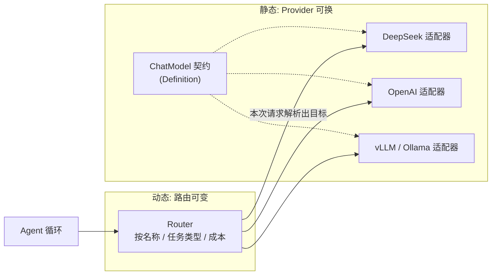
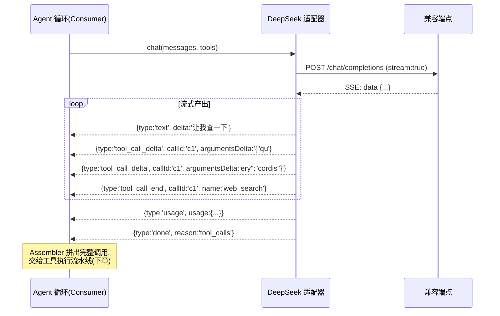

# 06 - LLM 适配器与 StreamChunk

> 上一章的"能力三角色模型"在最关键的能力上得到了最完整的体现：大模型调用。本章讲 dsh 如何用一个统一接口 + 一套流式协议，把 DeepSeek、GPT、本地 vLLM、Ollama 收编为可互换的 Provider——并且路由可以在运行时热切换。

前置阅读：[[deepseek-harness/2架构/05-能力三角色模型|能力三角色模型]]、[[deepseek-harness/2架构/04-事件系统详解|事件系统详解]]

后续章节：[[deepseek-harness/2架构/07-沙箱审批与安全|沙箱审批与安全]]

---

## 1. 模型无关设计的两层含义

说 dsh 是"模型无关"的，其实包含两个独立命题，很多文章混为一谈：

1. **Provider 可换（静态维度）**：今天接 DeepSeek，明天接一个本地 vLLM 部署，适配器作为一个 Provider 被替换或并列注册——这是 [[deepseek-harness/2架构/05-能力三角色模型|上一章]] 三角色模型的直接应用；
2. **路由运行时可变（动态维度）**：同一个会话里，简单问题走便宜模型、复杂问题走旗舰模型；改一行配置甚至不重启进程就能调整分配策略。这要求"用哪个模型"不是启动时焊死的常量，而是每次请求前动态解析的决策。

两层缺一不可。只有第一层，你得到的是"换模型要重启的工具"；只有第二层，你得到的是"绑死一家的多模型调度器"。dsh 的 LLM 适配器同时满足两者：



---

## 2. ChatModel 统一接口

一切从契约开始。dsh 的 `ChatModel` 定义极其克制——**messages in，流式 chunk out**：

```typescript
// ============ chat-model.definition.ts ============
// LLM 能力的契约层：不含任何 HTTP、SDK 或厂商概念
/** 统一的消息表示：三种角色覆盖对话所需 */
export interface ChatMessage {
  role: 'system' | 'user' | 'assistant' | 'tool'
  /** 文本内容；assistant 的工具调用消息此字段可为空 */
  content?: string
  /** role=tool 时：本条结果对应的调用 id */
  toolCallId?: string
  /** role=assistant 时：模型决定发起的工具调用（可能多个） */
  toolCalls?: ToolCallRequest[]
}
/** 模型发起的一次工具调用意图 */
export interface ToolCallRequest {
  /** 本次调用的唯一 id，结果回填时要对上号 */
  id: string
  /** 工具名 */
  name: string
  /** 参数 JSON 字符串——注意是字符串，见下一节 delta 设计 */
  argumentsJson: string
}
/** 对模型的单次请求 */
export interface ChatRequest {
  messages: ChatMessage[]
  /** 可注册给模型使用的工具清单（OpenAI function 格式的中性化封装） */
  tools?: ToolSpec[]
  /** 温度等采样参数；留空则用适配器默认值 */
  temperature?: number
  maxTokens?: number
}

/** 工具声明 */
export interface ToolSpec {
  name: string
  description: string
  parametersSchema: Record<string, unknown>   // JSON Schema
}

/** 每次请求的计量信息（token 数由服务端统计回报） */
export interface Usage {
  promptTokens: number
  completionTokens: number
  totalTokens: number
}

/**
 * ChatModel 契约：唯一的实质方法只有一个 chat。
 * 返回 AsyncIterable —— 天然表达"流"，Consumer 用 for-await 消费
 */
export interface ChatModel {
  chat(req: ChatRequest): AsyncIterable<StreamChunk>
}
```

设计上有三个值得注意的决定：

1. **返回 `AsyncIterable<StreamChunk>` 而非回调或 Promise 全量文本**。异步迭代器是 TS 里表达"一段持续产出的数据流"的标准形态，`for await...of` 消费、`break` 即中止，错误经 try/catch 捕获，不需要额外定义 onChunk/onError/onDone 回调三元组；
2. **参数用 JSON 字符串而非已解析对象**。因为工具调用参数是从模型侧逐段流出的（见下一节），契约必须保留"拼接中间态"的表达力；
3. **没有 `model` 字段在请求里**。选哪个模型是路由层的职责（第 7 节），不是调用方的职责——职责分离才能让两层各自演化。

---

## 3. StreamChunk 协议逐类型精讲

`StreamChunk` 是 Consumer 与适配器之间的流式协议。它是一个可辨识联合（discriminated union），五种类型各司其职：

```typescript
// ============ stream-chunk.ts ============

type StreamChunk =
  | TextChunk          // 正文文本增量
  | ToolCallDelta      // 工具调用参数增量片段
  | ToolCallEnd        // 某个工具调用的参数流结束标记
  | UsageChunk         // 计量信息
  | ErrorChunk         // 错误（软失败：以 chunk 形式送达）
  | DoneChunk          // 终止标记：此后流关闭

interface TextChunk {
  type: 'text'
  /** 本段新增的正文文本（非全文！是与已有内容拼接的增量） */
  delta: string
}
interface ToolCallDelta {
  type: 'tool_call_delta'
  /** 属于哪个工具调用（对应 ToolCallRequest.id） */
  callId: string
  /**
   * 参数 JSON 的下一个片段。
   * 例如完整参数 {"query":"cordis","limit":10} 可能被切成：
   *   '{"qu' → 'ery":' → '"cordis"' → ',"lim' → 'it":10}'
   */
  argumentsDelta: string
}
interface ToolCallEnd {
  type: 'tool_call_end'
  callId: string
  /** 工具名（流的早段给出过一次，此处重复确认） */
  name: string
}
interface UsageChunk {
  type: 'usage'
  usage: Usage
}
interface ErrorChunk {
  type: 'error'
  /** 机器可读的错误类别，恢复策略按此分流（见第 6 节） */
  kind: 'network' | 'rate_limit' | 'context_overflow' | 'content_filter' | 'unknown'
  message: string
  /** 是否建议调用方重试同一请求 */
  retryable: boolean
}
interface DoneChunk {
  type: 'done'
  /** 结束原因：正常收尾 / 达到 token 上限 / 触发停止序列 */
  reason: 'stop' | 'length' | 'tool_calls'
}
```

### 3.1 text：文本增量

最朴素的类型。适配器每收到服务端推来的一段文字就发一个 `{type:'text', delta:'...'}`。**delta 是增量不是累计快照**——这是协议的第一纪律。UI 层拼接渲染，日志层原样落盘，谁都不需要保存两份全文。

### 3.2 tool_call_delta：为什么参数要流式拆分

初学者最常见的疑问：工具调用参数明明最终是一个完整 JSON，为什么不攒齐了再一次性给出？

原因有三层：

1. **首字节延迟**。大参数（比如要写入一份几百行代码的 `write_file` 调用）如果等完整 JSON 才发出，用户界面会有数秒空白；流式拼接可以让 UI 实时显示"模型正在写什么"；
2. **上游本来就是分片的**。OpenAI 兼容协议里工具参数就是以增量片段推送的，契约如实映射，适配器不必做无谓的攒批；
3. **提前校验成为可能**。Consumer 可以边拼边跑前缀级 schema 校验，在最后一个花括号到达之前就知道"这个调用大概率合法"。

消费侧的标准拼接器长这样：

```typescript
// 把散落的 tool_call_delta 组装回完整 ToolCallRequest 的状态机
class ToolCallAssembler {
  private buffers = new Map<string, { name?: string; json: string }>()
  feed(chunk: StreamChunk): void {
    if (chunk.type === 'tool_call_delta') {
      const buf = this.buffers.get(chunk.callId) ?? { json: '' }
      buf.json += chunk.argumentsDelta            // 片段追加
      this.buffers.set(chunk.callId, buf)
    } else if (chunk.type === 'tool_call_end') {
      const buf = this.buffers.get(chunk.callId) ?? { json: '' }
      this.buffers.set(chunk.callId, { ...buf, name: chunk.name })  // 收尾确认工具名
    }
  }

  drain(): ToolCallRequest[] {
    const out: ToolCallRequest[] = []
    for (const [id, buf] of this.buffers) {
      try {
        JSON.parse(buf.json)                      // 完整性验证
        out.push({ id, name: buf.name ?? '', argumentsJson: buf.json })
      } catch (err) {
        console.warn(`工具调用 ${id} 参数流不完整, 已丢弃`, err)
      }
    }
    this.buffers.clear()
    return out
  }
}
```

### 3.3 usage：计量

usage 在流的中后段出现一次（多数兼容端点在正文结束后附带）。把它做成显式 chunk 而不是响应尾字段，是因为**流式场景下"响应结束"和"计量到达"未必同步**，Consumer 可以先渲染完再等计量，也可以忽略计量直接在 done 后关账。

### 3.4 error 与 done：两种终止

协议允许两条终止路径：`error`（软失败，带类别与重试建议）或 `done`（正常终局）。区分它们的价值在于恢复策略不同——error.chunk.retryable 为 true 时 Consumer 可以整体重试本轮请求，而 done 之后重试就毫无意义了。

一轮典型的流式对话，chunk 时序如下：



对应的消费代码骨架：

```typescript
async function runTurn(model: ChatModel, req: ChatRequest): Promise<TurnOutcome> {
  const assembler = new ToolCallAssembler()
  let fullText = ''
  let finish: DoneChunk['reason'] | null = null
  for await (const chunk of model.chat(req)) {
    switch (chunk.type) {
      case 'text':
        fullText += chunk.delta               // 拼接正文
        ui.append(chunk.delta)                // 实时渲染
        break
      case 'tool_call_delta':
      case 'tool_call_end':
        assembler.feed(chunk)                 // 喂给拼接状态机
        break
      case 'usage':
        billing.record(chunk.usage)           // 计量入账
        break
      case 'error':                           // 错误也是流的一部分
        throw chunk.retryable
          ? new RetryableError(chunk.message)
          : new FatalTurnError(chunk.kind, chunk.message)
      case 'done':
        finish = chunk.reason                 // 记录终局原因
        break
    }
  }
  return { text: fullText, toolCalls: assembler.drain(), finish }
}
```

---

## 4. OpenAI 兼容端点适配

### 4.1 为什么大家说同一种语言

DeepSeek API、vLLM、Ollama（`/v1` 端点）、Together、Groq……这些服务都实现了 OpenAI 的 `/v1/chat/completions` 协议，包括其 SSE 流式格式。这不是巧合，而是行业事实标准的胜利：**新推理服务为了零成本接入现有生态，主动兼容这套协议；客户端框架为了广覆盖，只实现这一套**。正反馈一旦形成，兼容端点就成了通用语。

对 dsh 的直接好处：**一个适配器类可以覆盖市面上绝大多数模型服务**，差异只剩三个配置项：

```typescript
// ============ openai-compatible.adapter.ts ============
// 通用 OpenAI 兼容适配器：一个类服务所有兼容端点
import { Context } from 'cordis'

export interface AdapterConfig {
  /** 端点根地址；不同服务商只改这里 */
  baseURL: string   // https://api.deepseek.com | http://localhost:11434/v1 | ...
  apiKey?: string   // 本地 vllm/ollama 通常不需要
  /** 该适配器实例对外暴露的模型名（路由层用它寻址） */
  model: string     // deepseek-chat | qwen2.5-32b-instruct | ...
}

export class OpenAICompatibleAdapter implements ChatModel {
  constructor(private ctx: Context, private config: AdapterConfig) {}

  async *chat(req: ChatRequest): AsyncIterable<StreamChunk> {
    // 1. 中性化请求 → OpenAI wire 格式（纯字段映射）
    const body = this.toWire(req)
    // 2. 发起流式请求；resp.body 是 SSE 字节流
    const resp = await fetch(`${this.config.baseURL}/chat/completions`, {
      method: 'POST',
      headers: {
        'content-type': 'application/json',
        ...(this.config.apiKey && { authorization: `Bearer ${this.config.apiKey}` }),
      },
      body: JSON.stringify(body),
      signal: AbortSignal.timeout(120_000),   // 兜底超时，防连接永久悬挂
    })
    // 3. HTTP 层错误 → 翻译成 ErrorChunk（分类逻辑见第 6 节）
    if (!resp.ok) {
      yield {
        type: 'error',
        kind: resp.status === 429 ? 'rate_limit'
          : resp.status === 400 ? 'context_overflow'   // 多数端点用 400 表达超限
          : 'network',
        message: `HTTP ${resp.status}`,
        retryable: resp.status === 429 || resp.status >= 500,
      }
      return
    }
    // 4. 解析 SSE 流：按空行切事件，data: 前缀剥壳；[DONE] 即终局
    for await (const event of this.parseSSE(resp.body!)) {
      if (event === '[DONE]') {
        yield { type: 'done', reason: 'stop' }
        return
      }
      // 5. 单个 chunk 的 wire 格式 → StreamChunk 翻译
      yield* this.translateChunk(JSON.parse(event))
    }
  }
  /** SSE 解析器：AsyncGenerator 逐事件产出 */
  private async *parseSSE(stream: ReadableStream<Uint8Array>): AsyncGenerator<string> {
    const reader = stream.getReader()
    const decoder = new TextDecoder()
    let buffer = ''
    while (true) {
      const { done, value } = await reader.read()
      if (done) break
      buffer += decoder.decode(value, { stream: true })
      // SSE 以空行分隔事件
      let idx: number
      while ((idx = buffer.indexOf('\n\n')) >= 0) {
        const raw = buffer.slice(0, idx)
        buffer = buffer.slice(idx + 2)
        const line = raw.split('\n').find((l) => l.startsWith('data: '))
        if (line) yield line.slice(6)           // 剥掉 "data: " 前缀
      }
    }
  }
  /** wire chunk → StreamChunk：协议翻译的核心 */
  private *translateChunk(wire: any): Generator<StreamChunk> {
    const choice = wire.choices?.[0]
    if (!choice) return
    const delta = choice.delta ?? {}
    if (delta.content) {
      yield { type: 'text', delta: delta.content }
    }
    // 工具调用增量：wire 格式本身就是分片的，如实透传
    for (const tc of delta.tool_calls ?? []) {
      if (tc.function?.arguments) {
        yield {
          type: 'tool_call_delta',
          callId: tc.id,
          argumentsDelta: tc.function.arguments,
        }
      }
      if (tc.id && choice.finish_reason === 'tool_calls') {
        yield { type: 'tool_call_end', callId: tc.id, name: '' }
      }
    }
    if (wire.usage) {
      yield {
        type: 'usage',
        usage: {
          promptTokens: wire.usage.prompt_tokens,
          completionTokens: wire.usage.completion_tokens,
          totalTokens: wire.usage.total_tokens,
        },
      }
    }
  }
}
```

接入 DeepSeek 与本地 Ollama，只是同一类的两次不同配置：

```typescript
// DeepSeek 云端与本地 Ollama：同一个类，只差三个配置字段
app.plugin(OpenAICompatibleAdapter, {
  baseURL: 'https://api.deepseek.com', apiKey: process.env.DEEPSEEK_API_KEY,
  model: 'deepseek-chat',
})
// 换本地推理服务时零代码差异：
// app.plugin(OpenAICompatibleAdapter, { baseURL: 'http://127.0.0.1:11434/v1', model: 'qwen3-32b' })
```

### 4.2 真正不兼容时的对策

少数服务有私有扩展（如 Anthropic 的原生协议）。处理方式依然遵守三角色：为它单独写一个实现 `ChatModel` 契约的适配器 Provider，内部完成私有协议到 StreamChunk 的翻译——**私有性被封死在适配器内部，永远不外泄到 Consumer**。

---

## 5. 错误处理体系

流式链路上错误的形态远比"抛异常"丰富。dsh 把错误分为四类，各自有明确的恢复策略：

| 错误类别 | 典型症状 | 可重试？ | 恢复策略 |
| --- | --- | --- | --- |
| `network` | 连接重置、超时、DNS 失败、流中途断开 | 是 | 指数退避重试；流中断时若已收到部分文本需评估是否续传 |
| `rate_limit` | HTTP 429，响应头含 Retry-After | 是 | 尊重 Retry-After；无头则退避 + 抖动；连续限流触发降级路由 |
| `context_overflow` | 输入超过模型上下文窗口 | 否（原样重试必败） | 触发上下文压缩管道（waterfall 截断/摘要），缩短后重新发起 |
| `content_filter` | 内容审查拦截 | 否 | 不重试；把拒绝原因回填进对话，让下一轮模型自行调整 |

网络类错误的指数退避重试，包在适配器外围而非侵入 chat 内部：

```typescript
// ============ with-retry.ts ============
// 重试装饰器：包装任意 ChatModel，只对可重试错误生效
function withRetry(model: ChatModel, opts: {
  maxAttempts: number       // 最大尝试次数
  baseDelayMs: number       // 首次退避基数
}): ChatModel {
  return {
    async *chat(req: ChatRequest): AsyncIterable<StreamChunk> {
      let lastError!: Error
      for (let attempt = 1; attempt <= opts.maxAttempts; attempt++) {
        try {
          const chunks: StreamChunk[] = []
          // 流式响应不能边收边重试——先把整轮收完，
          // 成功才向下游转发；这是"缓冲式重试"
          for await (const c of model.chat(req)) {
            if (c.type === 'error') {
              if (!c.retryable) {
                yield c                     // 不可重试错误立即透传
                yield { type: 'done', reason: 'stop' }
                return
              }
              throw new Error(c.message)    // 可重试错误进入退避循环
            }
            chunks.push(c)
          }
          yield* chunks                     // 整轮成功，一次性放行
          return
        } catch (err) {
          lastError = err as Error
          if (attempt < opts.maxAttempts) {
            // 指数退避 + 抖动：2s, 4s, 8s... ±20% 随机偏移，
            // 避免大量并发请求同步重试形成惊群
            const backoff = opts.baseDelayMs * 2 ** (attempt - 1)
            await new Promise((r) =>
              setTimeout(r, backoff + backoff * 0.2 * Math.random()))
          }
        }
      }
      // 重试耗尽：以 error chunk 形式报告而非抛异常，
      // 保持"错误也是流的一部分"的协议一致性
      yield { type: 'error', kind: 'network',
        message: `重试 ${opts.maxAttempts} 次仍失败: ${lastError.message}`,
        retryable: false }
      yield { type: 'done', reason: 'stop' }
    },
  }
}
```

两个工程要点：其一，**错误以 chunk 送达而非抛异常**，Consumer 只需要一种遍历方式，装饰器（重试、计费、日志）也无需 try/catch 包住迭代器——协议自洽比语法糖重要；其二，**429 与 network 共用退避机制但入口不同**，限流错误优先读服务端的 Retry-After 头（服务端最清楚自己的水位），读不到才退化成本地指数退避。

---

## 6. 模型路由：名称、任务、成本

### 6.1 三种路由粒度

适配器解决了"怎么调"，路由解决"调哪个"。dsh 支持三种由粗到细的策略：

| 策略 | 决策依据 | 适用场景 |
| --- | --- | --- |
| 按名称 | 配置里指定当前活跃模型名 | 个人使用，手动切换 |
| 按任务类型 | 请求打标（摘要/编码/闲聊），映射表查目标模型 | 多模型分工明确 |
| 按成本 | 各模型的单价表 + 预算约束，便宜优先、质量兜底 | 成本敏感的生产部署 |

### 6.2 路由器实现

```typescript
// ============ model-router.ts ============
// 路由器：本身也是 ChatModel 契约的实现者——
// 对 Consumer 来说它就是"那个模型"，内部才做分发
import { Context } from 'cordis'

export interface RouteRule {
  /** 匹配的任务标签（waterfall 打标阶段写入 request.meta） */
  task?: string
  /** 命中后使用的实际模型 */
  target: string
}

export interface RouterConfig {
  /** 默认模型：所有规则都不命中时的兜底 */
  defaultModel: string
  rules: RouteRule[]
  /** 每千 token 单价表，用于成本路由（美元计价示意） */
  pricePerKtok: Record<string, { input: number; output: number }>
}
export class ModelRouter implements ChatModel {
  private pool = new Map<string, ChatModel>()     // 名字 → 适配器实例

  constructor(private ctx: Context, public config: RouterConfig) {}

  /** 适配器 Provider 启动时把自己注册进来 */
  register(name: string, model: ChatModel): void {
    this.pool.set(name, model)
  }

  /** 核心决策：给定请求，选出目标模型名（任务匹配 → 默认兜底） */
    const task = req.meta?.task
    if (task) {
      const byTask = this.config.rules.find((r) => r.task === task)
      if (byTask && this.pool.has(byTask.target)) return byTask.target
    }
    return this.config.defaultModel
  }

  async *chat(req: ChatRequest): AsyncIterable<StreamChunk> {
    const name = this.resolve(req as any)
    const target = this.pool.get(name)
    if (!target) {
      // 路由目标缺失：以协议一致的方式报告，而非抛异常
      yield { type: 'error', kind: 'unknown',
        message: `路由目标 ${name} 未注册`, retryable: false }
      yield { type: 'done', reason: 'stop' }
      return
    }
    this.ctx.logger.debug('route → %s', name)
    yield* target.chat(req)
  }
}
```

### 6.3 热切换：config 变更驱动，无需重启

热切换的关键在于**路由决策发生在每次请求时，而不是启动时**。上面 `resolve()` 读的是 `this.config`——只要这个对象被更新，下一次请求立刻生效。谁来更新？Cordis 的配置系统：

```typescript
// 配置热更监听：config 层变更驱动路由器原地更新
export const apply = (ctx: Context) => {
  ctx.on('config:changed', (e) => {
    if (e.path.startsWith('router')) {
      // 只更新受影响的配置段，路由器实例不动，连接池全部复用
      Object.assign(router.config, e.newValue.router)
      ctx.logger.info('路由配置已热更新, default=%s', router.config.defaultModel)
    }
  })
}
```

配合 patch 文件即可完成一次"不重启的模型迁移"：

```yaml
# cordis.patch.yml —— 运行中修改此文件触发热重载
router:
  defaultModel: deepseek-reasoner      # 从 chat 切到 reasoner
  rules:
    - task: summarize
      target: deepseek-chat            # 摘要继续用便宜的
```

对比传统做法（改配置文件 → 重启进程 → 会话全丢、连接重建），热切换的收益不只是省几秒启动：**进行中的会话无缝享受新路由**，这正是"路由运行时可变"的含义。

---

## 7. 接入新模型的步骤清单

以接入一个新的 OpenAI 兼容服务为例，标准流程五步：

- [ ] **确认兼容性**：核对端点是否支持 `/chat/completions` + `stream:true` + 工具调用增量（不支持工具调用也能用，只是 Agent 能力降级）；
- [ ] **写配置而非写代码**：若是纯兼容端点，只需新增一段适配器配置（baseURL/apiKey/model），复用 `OpenAICompatibleAdapter`；
- [ ] **私有协议才写适配器**：仅当协议不兼容时实现新的 `ChatModel` Provider，翻译逻辑封死在类内；
- [ ] **登记路由**：在 RouterConfig 注册名字、必要时补充价格表与任务规则；
- [ ] **冒烟测试三件事**：普通文本流、工具调用增量拼接、人为断网验证重试路径。

完成后，所有现有 Consumer（Agent 循环、摘要服务……）对新模型即刻可用——没有任何一处 `if (model === 'deepseek')` 式的分叉需要维护。

关于如何在自建 Harness 里从零推导出这套多模型路由设计——包括为什么路由器自己也要实现 ChatModel 契约这一手"套娃"——[[deepseek-harness/4设计自己的Harness/04-设计多模型路由|设计多模型路由]] 一章会站在建设者视角完整重演一遍。

---

## 8. 小结

- 模型无关 = Provider 可换（静态）+ 路由运行时可变（动态），两者分别由三角色模型和"每次请求时解析"的路由器实现。
- ChatModel 契约极简：messages in、`AsyncIterable<StreamChunk>` out；返回异步迭代器让流、错误、中止都有统一语义。
- StreamChunk 六种类型各司其职；tool_call_delta 的分片设计换来低首字延迟与实时 UI，拼接责任由 Consumer 侧的 Assembler 承担。
- OpenAI 兼容协议是行业事实标准，一个适配器类覆盖绝大多数服务；私有协议被隔离在各自的适配器内部。
- 错误是流的一部分：四类错误各有恢复策略，可重试的走指数退避 + 抖动，不可重试的（上下文超限、内容过滤）走各自的补救管道。
- 路由器自身实现 ChatModel 契约，配置热更驱动路由变化，全程无需重启。

模型给出的工具调用意图（那些 tool_call）最终要落到真实世界执行——这就引出了整个 Harness 最需要敬畏的部分：[[deepseek-harness/2架构/07-沙箱审批与安全|沙箱审批与安全]]。
