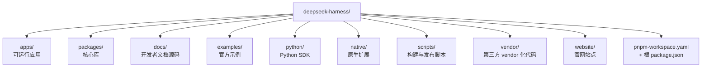
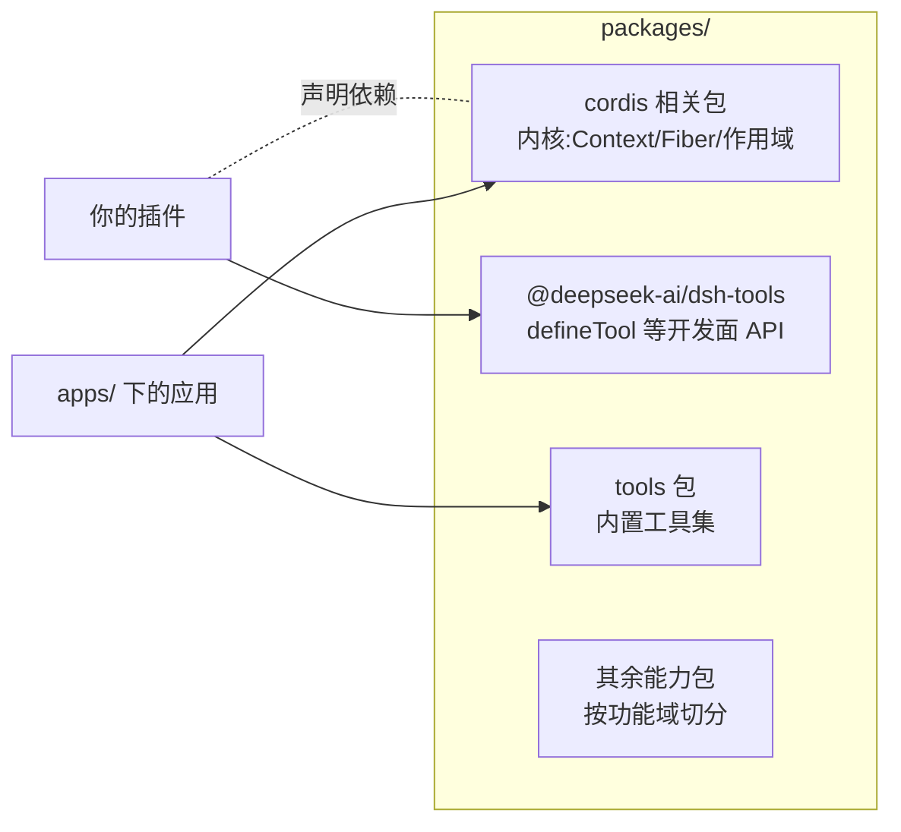
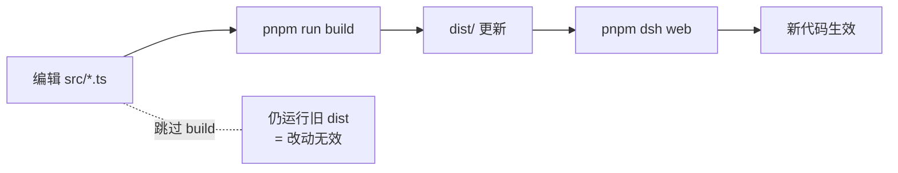
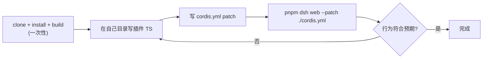
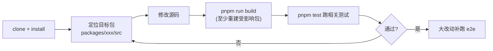

# 01 - 源码结构与构建

> 本章是实战篇的第一章。要写插件、改内核，第一步是把 deepseek-harness 的源码仓库跑起来。本章带你读懂 monorepo 的目录布局、工程化设施，以及从零 clone 到 `pnpm dsh web` 跑通的全流程——包括每一步到底做了什么、失败时如何定位。

前置阅读：[[deepseek-harness/2架构/02-Profile与Bundle|Profile 与 Bundle]]
本章之后：[[deepseek-harness/3实战开发/02-第一个插件完整流程|第一个插件]]

---

## 1. 顶层目录职责：一张表看懂 monorepo

GitHub 上 `deepseek-ai/deepseek-harness` 是一个标准的 pnpm monorepo，根目录由 `pnpm-workspace.yaml` 声明工作区。克隆下来第一眼看到的是这些目录：



各目录的职责与"你会不会碰它"：

| 目录 | 职责 | 典型内容 | 插件作者是否需要碰 |
| --- | --- | --- | --- |
| `apps/` | 可直接运行的应用入口 | CLI（提供 `dsh` 命令）、web 前端壳 | 读为主，理解启动链路时看 |
| `packages/` | 发布到 npm 的核心库 | cordis 内核封装、dsh-tools、tools 等 | 高频接触，import 来源都在这 |
| `docs/` | 开发者文档的源文件 | mdx/md 文档 | 写文档贡献时才碰 |
| `examples/` | 官方示例插件与应用 | 最小插件、工具示例 | 强烈建议通读一遍 |
| `python/` | Python SDK | 让 Python 侧接入 harness 的绑定 | 只用 TS 时不用碰 |
| `native/` | 原生（Rust/C++）扩展代码 | 性能敏感模块的原生实现 | 一般不碰，除非改底层性能 |
| `scripts/` | 构建/发布/CI 辅助脚本 | 发版脚本、生成脚本 | 偶尔看，排查构建问题时读 |
| `vendor/` | 第三方依赖的 vendor 副本 | fork 后修改过的上游库 | 排查依赖行为差异时才看 |
| `website/` | 官网 | 官网前端与部署配置 | 不碰 |

一个关键认知：**monorepo 不等于"一个大项目"**。`apps/` 和 `packages/` 之间是清晰的"应用消费库"关系；你在 `examples/` 里写的插件和你在自己目录里写的插件，加载方式完全一样（都是 patch 层注入，见 [[deepseek-harness/3实战开发/02-第一个插件完整流程|第一个插件]]）。

---

## 2. packages 内部拆分逻辑：包边界即职责边界

`packages/` 是整个仓库的心脏。它的拆分不是按技术分层，而是**按运行时职责切边界**：



### 2.1 三条最重要的边界

**边界一：cordis 内核 vs 一切上层**

cordis 相关包只做一件事：Context 树、Fiber 生命周期、依赖注入、事件分发。它不知道什么是"Agent"、什么是"工具"。任何"业务语义"都不允许下沉到这一层——这是内核保持稳定的纪律。

**边界二：dsh-tools vs tools**

这两个名字很像的包承担完全不同的角色：

| 包 | 角色 | 类比 |
| --- | --- | --- |
| `@deepseek-ai/dsh-tools` | **开发框架面 API**：导出 `defineTool` 等定义工具用的函数与类型 | Spring 里的 `@Bean` 注解所在的 spring-context |
| `tools` | **内置工具集合**：harness 自带的一批具体工具实现 | Spring 自带的 spring-boot-starter-* |

一句话记住：**你 import 它来"定义"东西的是 dsh-tools；仓库"已经替你写好"的工具在 tools 里**。写自己的第一个工具时，参照对象就是 tools 包里的现成实现（详见 [[deepseek-harness/3实战开发/03-defineTool工具开发|defineTool 工具开发]]）。

**边界三：包与包之间只走显式依赖**

每个子包有自己的 `package.json`，跨包引用必须写进 `dependencies` 并通过包名 import（如 `import { defineTool } from '@deepseek-ai/dsh-tools'`），不允许相对路径跨包穿透。这条纪律保证了任何一个包可以被单独抽出复用——你的插件也遵守同样的规则。

### 2.2 为什么要花力气记包名

因为**报错信息里全是包名**。当你在终端看到：

```text
Error: Cannot find module '@deepseek-ai/dsh-tools'
```

你要能立刻反应出三件事：这是"定义工具的 API 包"；它应该在 `packages/` 下某个对应目录；报错原因多半是没 build 或 workspace 没装好（下文第 5 节展开）。

### 2.2 examples 目录:最好的教材藏在仓库里

`examples/` 值得单独一节,因为它是**官方认可的最小可运行样例集**,也是写插件时最该抄的起点。通读建议按这个顺序:

1. **最小插件示例**:通常只有一个 apply 函数加一行日志——对应 [[deepseek-harness/3实战开发/02-第一个插件完整流程|第一个插件]] 的手工版;
2. **工具示例**:defineTool 的标准用法,包括 output 两层分离的示范——对应 [[deepseek-harness/3实战开发/03-defineTool工具开发|defineTool 工具开发]];
3. **带配置的示例**:演示 Schemastery schema 声明与 patch 注入——对应 [[deepseek-harness/3实战开发/04-Config与Schemastery|Config 与 Schemastery]];
4. **组合示例**:多插件协作、服务注入的完整应用。

读 examples 的正确姿势不是"看懂就行",而是:**复制一份出来改到跑不通为止**。跑不通的地方就是你理解边界的地方。

### 2.3 vendor 与 native:什么时候才需要看

这两个目录平时可以完全忽略,但各有一个触发条件:

- `vendor/`:当你发现某个依赖的行为"和上游文档不一致"时,来这确认——vendor 化意味着仓库对第三方代码做了本地修改,文档可能已不适用;
- `native/`:当报错堆栈出现原生模块(`.node` 文件、段错误、ABI 版本不匹配)时才需要关心,多数是 node 版本与原生扩展编译目标不一致导致。

---

## 3. 工程化设施速览：这套仓库怎么保证质量

deepseek-harness 的工程化配置密度相当高，值得逐个认识——不是为了背名词，而是为了在"构建失败/测试挂了/lint 报错"时知道该找哪个配置。

| 设施 | 载体 | 它做什么 | 你会遇到的场景 |
| --- | --- | --- | --- |
| pnpm workspace | `pnpm-workspace.yaml` | 声明 monorepo 工作区，链接内部包 | `pnpm install` 时建立软链 |
| tsdown | 各包 `tsdown.config.ts` | 把 TS 源码打包为可发布的 JS + d.ts | 改了内核必须重新 build |
| vitest | 多份 `vitest.config.*` | 单元测试与集成测试运行器 | `pnpm test` 跑测试 |
| e2e / perf 测试配置 | 独立的 vitest 配置文件 | 端到端测试与性能基准分开跑 | 大改动后跑回归 |
| oxlint | `.oxlintrc.json` 等配置 | Rust 实现的高性能 linter | 提交前 lint 卡住 |
| lefthook | `lefthook.yml` | git hooks 管理（pre-commit 等） | commit 时自动 lint/test |
| knip | knip 配置 | 死代码/未用依赖检测 | CI 报"unused export" |

几个展开说说：

### 3.1 四套测试配置：为什么测试要分四份

仓库里有不止一份 vitest 配置——单元、集成之外还有独立的 **e2e 配置**和 **perf 配置**。这不是过度设计：

- 单元测试要求快，随改随跑；
- e2e 要真实拉起进程、走完整链路，天然慢，只在 CI 与发版前跑；
- perf 是基准测试，输出耗时数据而非 pass/fail，用于防止性能回退。

对比本库 [[java/3工程化/13_CICD流水线|CI 流水线]] 里讲的企业实践：Java 世界常用 Maven Surefire（单测）+ Failsafe（集成）+ JMH（基准）达成同样的分层。思想完全一致——**不同成本的验证放在不同的门禁位置**。区别在于 dsh 用一套 vitest 通过多份配置文件完成分层，而 Java 生态是三个独立插件。

### 3.2 oxlint + lefthook：把门禁前移到本地

oxlint 用 Rust 写成，比 JS 生态主流 linter 快一到两个数量级，这让 "pre-commit 全量 lint" 变得可行。配合 lefthook 在 git hooks 里挂上 lint/stage 检查，问题在本地 commit 那一刻就暴露，而不是等 CI 十分钟后红掉。

### 3.3 knip：给死代码上刑

knip 扫描"没有被任何入口引用的导出、文件、依赖"。在一个几十个包的 monorepo 里，死代码会以肉眼可见的速度堆积；knip 把它变成 CI 上的硬性检查项。

---

## 4. 从零构建运行全流程：每一行命令在干什么

下面是从一台干净机器到 web UI 跑起来的完整流程。npm 包名为 `@deepseek-ai/dsh`，CLI 命令为 `dsh`。

### 4.1 四步走

```bash
# 第 1 步:克隆源码
git clone https://github.com/deepseek-ai/deepseek-harness.git
cd deepseek-harness

# 第 2 步:安装全部工作区依赖
# pnpm 会读取 pnpm-workspace.yaml,为每个子包安装依赖,
# 并在工作区内建立符号链接(包 A import 包 B 直接生效)
pnpm install

# 第 3 步:构建所有包
# tsdown 把每个 packages/* 的 TS 源码编译打包,
# 产物写入各包的 dist/,同时生成 .d.ts 类型声明
pnpm run build

# 第 4 步:从源码启动 web 应用
pnpm dsh web
```

四个步骤各自的本质：

| 步骤 | 本质 | 产出物 |
| --- | --- | --- |
| clone | 拿到源码 | 工作副本 |
| install | 解析 workspace 依赖图，装外部依赖，链接内部包 | node_modules + 包间软链 |
| build | TS 源码 → dist 中的 JS 与类型声明 | 各包 dist/ 目录 |
| dsh web | 以根 context 启动应用，加载默认 profile 与 bundle | 运行中的 web 服务 |

### 4.2 为什么必须先 build：dist 才是 import 目标

新手最常见的困惑："我明明 clone 了最新代码，为什么一跑就报错？"

原因是：**workspace 内部包之间互相 import 的是 `package.json` 里指向 `dist/` 的入口，不是 `src/` 源码**。跳过 build 直接跑，Node 找不到 dist 产物，于是出现典型的模块解析错误：

```text
Error: Cannot find module '@deepseek-ai/dsh'
# 或者
Cannot find module '@deepseek-ai/dsh-tools'
```

排查口诀：

1. 报 Cannot find module 且包名是 `@deepseek-ai/*` → 九成是没 build，或 build 失败了；
2. 先单独重跑 `pnpm run build`,盯紧有没有某个包构建中断;
3. build 成功但还报错 → 删 node_modules 重装:`pnpm install --force`。

另一个相关的坑:**UI 显示的是旧代码**。web 前端属于 apps/packages 的一部分,你改了相关源码但不重建就直接启动,跑的还是上次 build 的 dist 旧产物。"改了没生效"的第一反应应该是:**我 build 了吗?**



### 4.3 启动成功的判断标志

`pnpm dsh web` 正常启动时,终端会依次打印加载日志:根 context 创建、bundle 中各服务逐个 ready、web 服务监听端口。如果卡在某个服务加载不动,日志最后一行通常就是出问题的服务名——启动日志本身就是一张实时的 Fiber 状态表(生命周期细节见 [[deepseek-harness/2架构/01-Cordis内核原理|Cordis 内核原理]])。

---

## 5. 环境变量表

dsh 的运行时行为受少量环境变量控制，最常用的三个：

| 环境变量 | 作用 | 典型取值 | 什么时候设 |
| --- | --- | --- | --- |
| `DSH_HOME` | dsh 的家目录,存放 profile、patch 层等用户级数据 | 绝对路径,如 `/home/a/.dsh` | 想隔离多套环境(如同时跑 stable 和 dev)时 |
| `NODE_USE_ENV_PROXY` | 让 Node 运行时遵循代理环境变量 | `1` | 代理环境下访问外网资源时 |
| `HTTP_PROXY` | HTTP 代理地址 | `http://127.0.0.1:7890` | 公司内网/需要代理的网络环境 |

组合使用示例：

```bash
# 场景:公司网络需要代理,且想用独立的 dsh 家目录做实验
export HTTP_PROXY=http://127.0.0.1:7890     # 指定代理地址
export NODE_USE_ENV_PROXY=1                 # 让 Node 尊重上面的代理设置
export DSH_HOME=/home/a/.dsh-dev            # 使用实验专用的家目录
pnpm dsh web                                # 此时的运行环境已完全隔离
```

代理排查小抄：设置了 `HTTP_PROXY` 但外网请求仍超时？按序检查三件事——`NODE_USE_ENV_PROXY` 是否为 `1`(不设则 Node 忽略代理变量)；代理地址端口是否可达(`curl -x $HTTP_PROXY https://example.com` 验证)；是否还需要 `HTTPS_PROXY`(访问 https 资源时多数场景要单独设置)。

`DSH_HOME` 值得多说一句：它在配置合并体系里占据独立的一层($DSH_HOME patch),优先级介于 profile patch 与 `--patch` overlay 之间(完整优先级见 [[deepseek-harness/2架构/02-Profile与Bundle|Profile 与 Bundle]] 与 [[deepseek-harness/3实战开发/04-Config与Schemastery|Config 与 Schemastery]])。

---

### 4.4 常见失败点汇总表

从 clone 到跑通，路上可能遇到的故障与对策集中列出：

| 阶段 | 失败现象 | 根因 | 对策 |
| --- | --- | --- | --- |
| install | `ERR_PNPM_...` 版本冲突 | 本地 pnpm/node 版本过旧或过新 | 按仓库 README 要求的版本切换(如 corepack) |
| install | 内部包互相找不到 | workspace 未被识别 | 确认在仓库根目录执行,检查 pnpm-workspace.yaml 存在 |
| build | 某包构建中断 | TS 类型错误或依赖缺失 | 读中断处的包名与报错行,先修该包 |
| build | 内存不足(OOM) | 大仓库全量构建吃内存 | 关闭其他进程重试;必要时分区构建 |
| dsh web | Cannot find module `@deepseek-ai/*` | 没 build 或 build 半途失败 | 重跑 build 并盯完整输出 |
| dsh web | 端口占用 | 上次进程没退干净 | 找到残留进程 kill 后重启 |
| dsh web | UI 是旧代码 | 改源码后未重建 dist | 重新 `pnpm run build` 再启动 |

这张表不必背——遇到问题时按"**哪个阶段失败 → 现象 → 根因**"三列对号入座即可。多数问题的答案都收敛于两句话：装了吗(build 了吗)、build 了吗。

### 4.5 启动日志逐段解读

`pnpm dsh web` 的输出值得逐段读一遍,它是理解启动链路的活教材:

```text
# 第一段:环境探测
[dsh] home: /home/a/.dsh            ← DSH_HOME 生效位置
[dsh] profile: default              ← 本次使用的 profile

# 第二段:配置合并
[dsh] bundle: xxx                   ← 加载的应用内置 bundle
[dsh] patches: 0 overlay            ← --patch 注入了几层(现在是 0)

# 第三段:服务加载(每个名字对应一个 Fiber)
[service-a] ready                   ← 依赖少的服务先 ready
[service-b] ready
[my-app] ready                      ← 依赖前两者的应用层最后就绪

# 第四段:对外服务
[web] listening on http://localhost:xxxx
```

读日志的实用技巧：把第三段的 ready 序列记下来，它就是当前 bundle 的依赖拓扑；将来你插入自己的插件，日志里会多出你的插件名——位置即拓扑位。

---

## 5. 环境变量表

根据你要做的事，工作流分两种，选错路径会浪费大量时间在无谓的全量构建上。

### 6.1 路径 A：只写插件(绝大多数人的路径)



要点：

- 仓库只需 build 一次；此后你的迭代循环只有"改插件源码 → 带 patch 重启"两步；
- 插件放哪都行——仓库外的绝对路径目录也可以，patch 里写绝对路径即可；
- 热重载能覆盖多数改动场景，不必频繁手动重启(见 [[deepseek-harness/3实战开发/05-生命周期与自动清理|生命周期与自动清理]])。

### 6.2 路径 B：改内核或改包(贡献者路径)



要点：

- 每次改完必须 build 对应包，否则改动不生效(4.2 节的原因)；
- 改公共 API(dsh-tools 导出的函数签名等)时，注意下游包都要跟着重建；
- 提交前让 lefthook/oxlint 过一遍，别把 lint 问题留给 CI。

### 6.3 一天的典型迭代节奏(路径 A 实录)

把两条路径落到具体的一天,感受节奏差异:

```bash
# 上午:一次性环境准备(路径 A 只做这一次)
git clone https://github.com/deepseek-ai/deepseek-harness.git
cd deepseek-harness && pnpm install && pnpm run build

# 下午:纯插件迭代循环(不碰仓库代码,不再 build)
mkdir -p scratch-plugin/src
# ... 写 my-plugin.ts 与 cordis.yml ...
pnpm dsh web --patch ./scratch-plugin/cordis.yml   # 第 1 轮
# 观察日志/在 UI 操作 → 发现问题 → 改 my-plugin.ts
pnpm dsh web --patch ./scratch-plugin/cordis.yml   # 第 2 轮
# ...循环,每轮只有"改源码 + 重启"两个动作
```

而路径 B 的下午是这样的:

```bash
# 每轮多出 build 与 test 两步
vim packages/dsh-tools/src/define-tool.ts          # 改内核 API
pnpm run build                                     # 必须重建才能生效
pnpm test                                          # 相关测试必须绿
pnpm dsh web --patch ./scratch-plugin/cordis.yml   # 再验证下游行为
```

时间成本对比一目了然：**能走路 A 就别走路 B**。即使你最终目标是改内核，也建议先用路径 A 做一个"调用方视角"的复现，再切到路径 B 动刀——复现脚本本身就是最好的回归测试。

### 6.4 怎么选

问自己一个问题：**我的产出物是不是一个独立的 TS 模块？** 是——走路 A；需要改仓库内的代码才能实现——走路 B。两者也可以叠加：改完内核 build 之后，继续用 patch 方式调试自己的插件。

### 6.5 两条路径共用的一条纪律

无论哪条路径，都遵守同一条纪律：**让改动可回滚**。

| 路径 | 可回滚性的体现 |
| --- | --- |
| 路径 A(只写插件) | 插件目录独立、patch 文件单独管理——删掉 scratch-plugin 目录,仓库毫发无伤 |
| 路径 B(改内核) | 每个逻辑改动一个 commit——build 炸了或测试红了,`git checkout` 一步回到上一个可用状态 |

monorepo 给了你"整个仓库一起编译"的能力，也要求你承担"一次改动污染多个包"的风险，可回滚性是对冲这种风险的唯一手段。

---

## 7. FAQ：构建运行的十个高频问题

| 问题 | 一句话答案 |
| --- | --- |
| 必须用 pnpm 吗？npm 行不行？ | 不行。workspace 协议与包链接依赖 pnpm,npm/yarn 无法正确解析内部包 |
| node 版本有要求吗? | 有,以仓库 README/engines 字段为准;原生模块对版本更敏感 |
| 每次拉取上游更新后要做什么? | `pnpm install`(依赖可能变)→ `pnpm run build`(dist 过期)→ 再启动 |
| 能只 build 一个包吗? | 可以按包目录单独执行其 build 脚本,但改公共 API 时下游包也要重建 |
| `dsh` 命令哪来的? | apps 下 CLI 包的 bin 入口,经 `pnpm dsh` 调用 workspace 内的可执行文件 |
| 不 clone 源码能用 npm 包直接跑吗? | 可以装 `@deepseek-ai/dsh` 直接运行;clone 源码是为了开发与调试 |
| DSH_HOME 不设会怎样? | 落到默认家目录位置;多环境并存时建议显式设置以隔离 |
| web 端口被占了怎么办? | 杀掉残留进程,或查 CLI 的端口参数改用其他端口 |
| build 报类型错误但代码没改过? | 多半是 node_modules 与锁文件不一致,重装依赖再试 |
| 怎么确认我跑的是新代码? | 看构建产物时间戳(`ls packages/*/dist`)与启动日志中的版本信息 |
| 想同时跑两套环境互相不干扰? | 用不同 `DSH_HOME` 与端口分别启动,配置与数据天然隔离 |
| 文档在哪看? | 仓库 `docs/` 是开发者文档源码,`website/` 是官网站点,两者内容同源 |

---

## 8. 本章小结

- monorepo 顶层九个目录各有明确职责,插件作者的主战场是 `examples/` 参考与 `packages/` 的 API;
- 包边界即职责边界:cordis 管内核,dsh-tools 给开发面 API,tools 是内置工具集;
- 工程化四件套(vitest 分层测试/oxlint/lefthook/knip)与本库 [[java/3工程化/13_CICD流水线|CI 流水线]] 的企业实践同构,只是工具选型不同;
- clone → install → build → dsh web 四步缺一不可,**没 build 就跑 = 模块解析错误,改了不 build = 跑旧代码**;
- `DSH_HOME`/代理变量决定运行环境;只写插件走 patch 循环,改内核才需要反复 build。

下一章我们真正动手:[[deepseek-harness/3实战开发/02-第一个插件完整流程|第一个插件]],从空目录到终端打印出自己的第一行日志。
