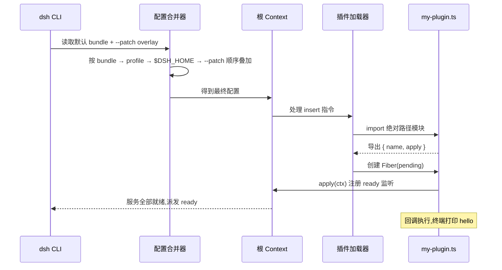

# 02 - 第一个插件完整流程

> 本章目标：从空目录开始，手把手写出第一个 dsh 插件，用 patch 方式加载进 web 应用，并在终端看到它打印的日志。全程只涉及四个文件动作：建目录、写一个 TS 文件、写一个 YAML 文件、跑一条命令。

前置阅读：[[deepseek-harness/3实战开发/01-源码结构与构建|源码结构与构建]]
本章之后：[[deepseek-harness/3实战开发/03-defineTool工具开发|defineTool 工具开发]]

---

## 1. 全景图：我们要做的事


核心机制回顾(细节见 [[deepseek-harness/2架构/02-Profile与Bundle|Profile 与 Bundle]]):

- **patch 层**是对默认配置的一层叠加，`--patch` 参数把你的 YAML 叠加到合并链最顶端；
- patch 里的 `insert` 指令向运行中的 context 树**插入一个新插件**；
- 插件本体是一个导出 `apply(ctx)` 的 TS 模块——dsh 直接加载 TS 源文件，你不需要自己搭编译管线。

---

## 2. 第一步:建目录

在仓库根目录下(或任何你能记住的位置)创建实验目录：

```bash
# 在 deepseek-harness 仓库根目录下执行
# scratch-plugin 是我们的插件工作区,src 放源码
mkdir -p scratch-plugin/src
```

目录结构最终长这样：

```text
deepseek-harness/
├── apps/
├── packages/
├── ...                      (仓库原有内容)
└── scratch-plugin/          ← 我们新建的
    ├── src/
    │   └── my-plugin.ts     ← 第二步创建
    └── cordis.yml           ← 第三步创建
```

注意：`scratch-plugin` 不需要自己的 `package.json`。dsh 的插件加载器直接读 `.ts` 源文件；依赖解析走仓库根的 node_modules(workspace 已装好)。

---

## 3. 第二步:写最小插件

创建 `scratch-plugin/src/my-plugin.ts`：

```typescript
// my-plugin.ts —— 第一个 dsh 插件
// 只做一件事:启动时在终端打印一行字

// Context 类型来自内核包,仅作类型标注,运行时零依赖
import type Context from '@deepseek-ai/cordis'

// 插件显示名:会出现在加载日志与调试信息中
export const name = 'my-first-plugin'

// apply 是插件的入口函数:
// ctx 是本插件被挂载时所在的作用域,
// 在 ctx 上注册的一切资源都会随插件卸载被框架自动回收
export function apply(ctx: Context) {
  // 监听一次性的 ready 事件:等待所有服务就绪后再打印,
  // 避免日志混在启动噪音里看不清
  ctx.on('ready', () => {
    console.log('[my-first-plugin] hello from plugin!')
  })
}
```

逐行说明：

| 代码 | 作用 | 能不能省 |
| --- | --- | --- |
| `import type Context from '@deepseek-ai/cordis'` | 引入类型做标注 | 可省，但省了就没有 IDE 补全与类型检查 |
| `export const name = 'my-first-plugin'` | 给插件起名 | 建议保留，排查问题时靠它对日志 |
| `export function apply(ctx)` | 插件入口，加载时被调用 | 不可省，这是插件存在的意义 |

为什么用 `ctx.on('ready', ...)` 而不是直接 `console.log`？因为 `apply` 被调用的时刻是"插件挂载"，此时其他服务可能还没就绪。挂到 `ready` 事件上能保证打印发生在整个应用就绪之后，日志位置稳定可预期。

---

## 4. 第三步:写 patch 文件

创建 `scratch-plugin/cordis.yml`：

```yaml
# cordis.yml —— 本地调试用 patch 层
# insert 指令:向 context 插入一个插件条目
insert:
  - id: my-first-plugin            # 实例 id:同层内唯一即可
    name: '/home/a/RootStack/deepseek-harness/scratch-plugin/src/my-plugin.ts'
```

两个必须死记的点：

1. **name 必须是绝对路径**。相对路径、`~` 开头的路径都不保证可用——加载器不做 shell 展开，也不会以 cwd 为基准拼接。写绝对路径是最不容易出错的姿势。
2. **id 和 name 分工不同**：id 是配置树里这条插入记录的键(后续往这个插件注入 config 时要靠它定位)；name 才指向真正的模块文件。

生成绝对路径的小技巧：

```bash
# 打印当前文件的绝对路径,直接复制进 cordis.yml
realpath scratch-plugin/src/my-plugin.ts
```

---

## 5. 第四步:带 patch 启动

回到仓库根目录：

```bash
# --patch 接受 patch 文件路径(这里的 ./cordis.yml 是相对当前目录的命令行参数,
# 与 yml 内部 insert.name 要求绝对路径是两回事,不要混淆)
pnpm dsh web --patch ./scratch-plugin/cordis.yml
```

预期输出(节选)：

```text
[my-first-plugin] hello from plugin!
```

看到这一行，你的第一个插件已经完整地走过了"发现 → 加载 → apply → 就绪"全链路。

### 5.1 启动链路里发生了什么



---

## 6. 三种插件形态代码对照

函数式只是三种形态之一。dsh 插件可以是函数、对象、类，三者能力等价于 Cordis 内核层面，但表达力和适用场景不同。

### 6.1 形态一：函数(最简)

就是上文的形式:`export function apply(ctx)`。

```typescript
import type Context from '@deepseek-ai/cordis'

// 最简形态:一个 apply 函数就是全部
// 适用:一次性脚本型逻辑、快速验证想法
export function apply(ctx: Context) {
  ctx.on('ready', () => console.log('函数形态插件已就绪'))
}
```

### 6.2 形态二：对象(结构化声明 inject)

对象形态显式声明 `inject` 数组，声明本插件依赖哪些服务。框架保证这些服务 ready 后才执行 `apply`：

```typescript
// 对象形态:依赖声明前置,可读性与可维护性更好
// inject 里的每一项都是一个已注册服务的名字,
// 框架会把它们作为参数按顺序传入 apply
export default {
  name: 'structured-plugin',
  // 声明依赖 tools 服务:apply 执行时它必然已就绪
  inject: ['tools'],
  apply(ctx: Context, tools: ToolsService) {
    // 这里可以安全使用 tools,无需自己判空或等待
    console.log('对象形态插件,拿到的 tools:', typeof tools)
  },
}
```

适用场景：需要跨服务协作的中等复杂度插件。**只要你要用到别的服务，就应该用这种形态**——依赖写在数组里，一眼可见，也方便框架做拓扑排序。

### 6.3 形态三：类(extends Service,提供服务)

类形态让你的插件本身成为一个**可被别人 inject 的 Service**：

```typescript
// 类形态:插件即服务
// 别的插件可以声明 inject: ['counter'],拿到这个类的实例
import { Service } from '@deepseek-ai/cordis'

export class Counter extends Service {
  // 静态属性声明依赖(与对象形态的 inject 数组同义)
  static inject = []

  private count = 0

  constructor(ctx: Context) {
    // 第二个参数是服务名,决定他人在 inject 里引用时用的字符串
    super(ctx, 'counter')
  }

  increment(): number {
    this.count += 1
    return this.count
  }
}
```

适用场景：提供有状态的、会被多个消费者共享的能力(连接池、计数器、缓存)。Service 基类自带生命周期钩子与状态机接入(Fiber 状态见 [[deepseek-harness/3实战开发/05-生命周期与自动清理|生命周期与自动清理]])。

### 6.4 选型对照表

| 形态 | 写法特征 | 有状态 | 可被 inject | 适用场景 |
| --- | --- | --- | --- | --- |
| 函数 | `export function apply(ctx)` | 否(闭包变量不算正经状态) | 否 | 最小验证、纯副作用脚本 |
| 对象 | `{ name, inject, apply }` | 弱 | 否 | 中等复杂度、依赖多个服务 |
| 类 | `class X extends Service` | 强 | 是 | 共享服务、连接管理、被组合复用 |

决策口诀：**先用函数起步；要用别人的服务换对象；要给别人用换类**。

---

## 7. ctx 能做什么总览

`ctx` 是插件的全部世界。常用能力一览：

| 方法/属性 | 用途 | 卸载时行为 |
| --- | --- | --- |
| `ctx.on(event, cb)` | 注册事件监听 | 自动移除监听器 |
| `ctx.register(...)` | 向 context 注册资源/能力 | 自动撤销注册 |
| `ctx.effect(fn)` | 手动托管一段带清理函数的资源 | 自动调用返回的清理函数 |
| `ctx.inject / static inject` | 声明服务依赖 | - |
| `ctx.provide(name, value)` | 提供可被注入的值 | 自动回收 |

### 7.1 effect 作用域示例：作用域内定时器

下面演示 `ctx.effect` 托管一个定时器——重点不在定时器，而在**清理函数由框架在正确时机自动调用**：

```typescript
import type Context from '@deepseek-ai/cordis'

export function apply(ctx: Context) {
  // effect 接收一个工厂函数:
  //   函数体内做"建立资源"的事,
  //   返回值是另一个函数,描述"如何销毁资源"
  ctx.effect(() => {
    // 建立阶段:每 5 秒心跳一次
    const timer = setInterval(() => {
      console.log(`[heartbeat] alive at ${new Date().toISOString()}`)
    }, 5000)

    // 销毁阶段:插件卸载/热重载时框架自动执行
    return () => {
      clearInterval(timer)
      console.log('[heartbeat] timer cleaned up')
    }
  })
}
```

你不需要在任何地方手动调用那个清理函数——它的调用时机完全由 Fiber 状态机驱动(详见 [[deepseek-harness/3实战开发/05-生命周期与自动清理|生命周期与自动清理]])。

### 7.2 一个 ctx 上能挂多少东西：组合示例

真实插件往往同时注册多种资源。下面把本章出现的 API 组合进一个"综合演示"插件，观察它们在启动日志中的出现顺序：

```typescript
// demo-all.ts —— 组合多种注册动作的演示插件
import type Context from '@deepseek-ai/cordis'

export const name = 'demo-all'

export function apply(ctx: Context) {
  // ① 注册一个事件监听,等全局就绪后触发
  ctx.on('ready', () => console.log('[demo-all] ① ready 监听触发'))

  // ② 托管一个带清理函数的资源
  ctx.effect(() => {
    console.log('[demo-all] ② effect 建立阶段')
    return () => console.log('[demo-all] ② effect 清理阶段')
  })

  // ③ 提供一个值,供其他插件通过依赖注入消费
  ctx.provide('demoGreeting', 'hello from demo-all')

  console.log('[demo-all] apply 执行完毕,进入 active')
}
```

预期日志顺序:`② effect 建立阶段` → `apply 执行完毕` → (等待全局就绪) → `① ready 监听触发`。理解这个顺序，就理解了"apply 是挂载时刻、ready 是全局就绪时刻"这条分界线——也是 [[deepseek-harness/3实战开发/05-生命周期与自动清理|生命周期与自动清理]] 一章的伏笔。

---

## 8. 调试技巧

### 8.1 console.log 放哪里有效

插件源码里的顶层语句和 `apply` 体内的语句，执行时机不同：

```typescript
import type Context from '@deepseek-ai/cordis'

// 时机一:模块被 import 时执行(加载期,早于依赖就绪)
console.log('[debug] module imported')

export function apply(ctx: Context) {
  // 时机二:Fiber 从 pending 转 active 时执行
  console.log('[debug] apply called')

  ctx.on('ready', () => {
    // 时机三:全局就绪后执行
    console.log('[debug] app ready')
  })
}
```

三行日志出现的先后顺序本身就是一张时序表。如果连"module imported"都没出现，说明模块压根没被加载(见 8.4 排查清单)；如果 apply called 出现了但 ready 没出现，说明某个依赖服务卡住了。

### 8.2 启动日志读法

启动日志大致按这个顺序推进：根 context 创建 → 各内置服务逐个 ready(每个名字对应 packages 里的一个实现)→ 你的插件(名字来自 `export const name` 或对象形态的 `name`)→ web 监听端口。**最后一行停住的地方，就是卡住的服务**。

### 8.3 用 --dump-config 验证插件层是否生效

不确定 patch 有没有被吃进去？让合并器把最终配置吐出来看：

```bash
# dump-config 输出四层合并后的最终配置,不真正启动应用
pnpm dsh web --patch ./scratch-plugin/cordis.yml --dump-config
```

在输出中搜索你的插件 id(`my-first-plugin`)。搜得到 → patch 生效，问题在插件代码侧；搜不到 → 问题在 patch 文件或命令行参数侧。一步就把故障域切成了两半。

### 8.4 插件没被加载的五步排查清单

按序检查，第一条命中最常见：

1. **路径是不是绝对路径？** 打开 cordis.yml，确认 `insert.name` 以 `/` 开头且文件真实存在(`ls <该路径>` 验证)；
2. **--patch 参数带了吗？** 不带 `--patch`,你的 yml 根本不参与合并;检查启动命令原文;
3. **yml 结构对吗?** `insert` 下是列表,每项含 `id` 与 `name` 两个字段,id 不能与本层已有条目冲突;
4. **TS 类型报错缺依赖吗?** 若编辑器报找不到 `@deepseek-ai/cordis`,先确认你在仓库内、`pnpm install` 与 `pnpm run build` 都跑过(见 [[deepseek-harness/3实战开发/01-源码结构与构建|源码结构与构建]]);
5. **改了插件代码重启了吗?** 热重载覆盖多数场景,但 patch 文件本身的修改需要重启进程才能生效。

---

## 9. 常见错误速查

| 错误现象 | 根因 | 修法 |
| --- | --- | --- |
| 日志无输出，UI 也无异常 | 插件根本没被加载 | 走 8.4 清单，重点查绝对路径 |
| `Cannot find module '/xxx/my-plugin.ts'` | name 不是绝对路径，或路径拼错 | 用 `realpath` 重新生成 |
| 启动正常但毫无插件痕迹 | 忘了 `--patch` 参数 | 补上参数重启 |
| 编辑器红线 `Cannot find module '@deepseek-ai/cordis'` | workspace 未装/未 build | `pnpm install && pnpm run build` |
| 运行时报类型不匹配 | TS 报错被忽略，运行时才炸 | 先清零所有类型错误再跑 |
| 插件加载了但 ready 日志不出现 | 某个依赖服务卡住未就绪 | 看启动日志最后一行停在哪,排查该服务 |
| effect 建立日志打印两次 | 热重载触发,旧 Fiber 清理后新 Fiber 重建 | 正常现象,确认清理日志也成对出现即可 |
| 想同时调试多个插件? | insert 列表里加多个条目,每个一条 id/name | 注意各 id 不可重复 |

---

## 10. FAQ：第一小时的典型困惑

| 困惑 | 解答 |
| --- | --- |
| 插件一定要放在仓库目录里吗? | 不必。任何绝对路径可达的 TS 文件都能被 insert 加载;放仓库内只是方便共用依赖 |
| 需要给 scratch-plugin 配 tsconfig 吗? | 运行不需要(dsh 直接加载 TS);配一份只为 IDE 类型提示更顺 |
| `export const name` 和 yml 里的 id 必须一致吗? | 不必一致。name 是模块自述名,id 是配置树定位键,但建议同名以免混乱 |
| 一个 patch 文件能插多个插件吗? | 可以。insert 是列表,追加条目即可 |
| apply 里能写顶层 await 吗? | 不能,apply 是同步入口;异步初始化放到 ready 事件回调或 effect 里 |
| 插件之间能互相通信吗? | 能,通过服务注入与事件系统;对象形态的 inject 就是为此准备的 |
| 改了 cordis.yml 没生效? | patch 文件变更需重启进程才参与合并(见 8.4 清单第 5 条) |
| 下一步该学什么? | 给插件注册工具([[deepseek-harness/3实战开发/03-defineTool工具开发|defineTool 工具开发]]),再学配置外置与生命周期管理 |

---

## 11. 本章小结

- 四步闭环:建目录 → 写 `apply(ctx)` 模块 → 写 insert patch(绝对路径!) → `pnpm dsh web --patch`;
- 三种插件形态各有归属：函数起步、对象声明依赖、类提供服务；
- 调试三板斧：分层 log 看时序、读启动日志找卡点、`--dump-config` 切分故障域;
- ctx 是插件的世界:监听器、资源托管、值提供全部经它之手,也因此获得自动清理的承诺。

下一章给你的插件装上牙齿：[[deepseek-harness/3实战开发/03-defineTool工具开发|defineTool 工具开发]]，让模型真正调用你写的工具。
