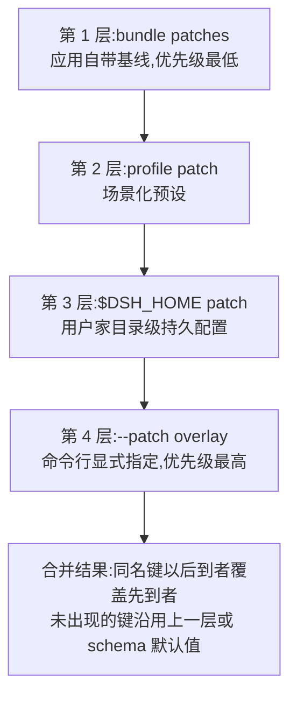

# 04 - Config 与 Schemastery

> 硬编码的插件只能自己用,可配置的插件才能给别人用。本章讲清 dsh 的配置三件事:怎么**声明**(Schemastery schema)、怎么**注入**(patch 层写值)、怎么**读取**(ctx.config),以及四层合并优先级如何决定"你的配置到底以谁为准"。

前置阅读：[[deepseek-harness/3实战开发/03-defineTool工具开发|defineTool 工具开发]]
相关章节：[[deepseek-harness/2架构/02-Profile与Bundle|Profile 与 Bundle]]

---

## 1. 插件为什么要外置配置

先看反面教材。上一章的 git-log-reader 里藏着两处硬编码:

```typescript
// 反例:这些值写死在源码里
const WORKSPACE_ROOT = resolve(process.cwd(), 'workspace')  // 换机器就失效
const limit = Math.min(maxCount ?? 10, 100)                 // 上限因人而异
```

硬编码的代价随使用人数线性放大：

| 配置类型 | 为什么不能硬编码 | 典型例子 |
| --- | --- | --- |
| 凭据类 | 进 git 就等于泄露;不同环境不同值 | API key、数据库密码 |
| 开关类 | 不同部署形态要启停能力 | 是否开启调试日志、是否启用某工具 |
| 参数类 | 没有普适默认值 | 超时时间、条数上限、路径 |

dsh 的解法是把配置做成纯数据层：插件用 schema **声明**自己接受什么配置，用户在 patch 层**注入**具体值，运行时框架把合并结果挂到 `ctx.config` 上供你**读取**。声明、注入、读取三个环节互相独立——你可以改配置不改代码，换环境不改代码。

---

## 2. Schemastery 配置声明

### 2.1 Schemastery 是什么

Schemastery 是 Cordis 生态标配的配置描述库：用一个 JS 对象描述配置项的类型、默认值与约束，框架据此完成校验、补全默认值，并在 UI 中自动生成配置表单。

与 zod / JSON Schema 的一句话对比：**zod 偏运行时数据校验、JSON Schema 偏静态契约文档，而 Schemastery 是为"插件配置 + 自动表单"这个场景特化的**——同一份声明既做校验又直接驱动 UI 渲染配置面板。

### 2.2 声明语法

```typescript
import { Schema } from 'schemastery'

// 用 Schema 对象描述本插件的全部配置项
export const Config = Schema.object({
  // 字符串项:带默认值
  repoPath: Schema.string().description('默认 Git 仓库路径').default(''),

  // 数字项:带默认值与范围
  maxCount: Schema.number().default(10).min(1).max(100)
    .description('每次最多返回的提交条数'),

  // 布尔开关
  verbose: Schema.boolean().default(false)
    .description('是否输出调试日志'),

  // 枚举选择
  format: Schema.string().default('short')
    .role('select')                       // UI 渲染为下拉框
    .values(['short', 'medium', 'full'])  // 可选值
    .description('提交信息的格式化风格'),
})
```

常用类型速查：

| Schemastery 类型 | JS 对应 | 说明 |
| --- | --- | --- |
| `Schema.string()` | string | 可链式 `.default()` `.pattern()` |
| `Schema.number()` | number | 可链式 `.min()` `.max()` `.step()` |
| `Schema.boolean()` | boolean | 开关 |
| `Schema.array(Schema.string())` | string[] | 元素类型作为参数传入 |
| `Schema.object({...})` | object | 嵌套结构 |
| `Schema.natural()` | number | 非负整数等便捷别名 |
| `.role('select')` + `.values()` | enum | 下拉选择 |
| `.description(text)` | - | 文档与 UI 提示文字 |
| `.default(value)` | - | 用户未配置时的兜底 |

### 2.3 把 schema 绑到插件上

```typescript
import type Context from '@deepseek-ai/cordis'

// 静态属性 Config:框架识别后自动接管校验与默认值填充
export const Config = Schema.object({ /* 如上 */ })

export function apply(ctx: Context) {
  // ctx.config 即合并+校验+补全默认值之后的最终配置对象
  console.log('maxCount =', ctx.config.maxCount)
}
```

绑定之后，用户注入的每个值都会先过 schema 校验；非法值在加载期就被拒绝，而不是等到 execute 运行时才炸。

### 2.4 校验失败长什么样

故意注入一个越界值，观察框架的拦截行为：

```yaml
# cordis.yml —— maxCount 故意超出 schema 声明的上限
insert:
  - id: git-log-plugin
    name: '/home/a/RootStack/deepseek-harness/scratch-plugin/src/git-log-plugin.ts'
    config:
      maxCount: 500        # schema 是 .max(100)
```

```bash
pnpm dsh web --patch ./scratch-plugin/cordis.yml
```

启动会在加载期失败，错误信息直接指名道姓：

```text
ConfigError: git-log-plugin.config.maxCount: expected number <= 100, got 500
```

注意这个错误发生的位置：**不是你的 execute 里，而是配置合并与校验阶段**。这意味着坏配置根本进不了运行时——这正是"声明即门禁"的含义。对比没有 schema 的世界：值一路漏到工具执行时才炸出一个 `RangeError`,排查链路长了十倍。

同理可测:`repoPath` 注入数字类型会被拒；未声明过的多余字段按 schema 配置决定是剔除还是报错。**建议把这三类非法用例各试一次**，校验边界摸过一遍才算真正掌握。

---

## 3. 声明 → 注入 → 读取完整链路

三段代码串起全链路：

```typescript
// ===== 第 1 环:声明(git-log-plugin.ts)=====
import { Schema } from 'schemastery'
import type Context from '@deepseek-ai/cordis'

export const Config = Schema.object({
  repoPath: Schema.string().default('').description('默认仓库绝对路径'),
  maxCount: Schema.number().default(10).min(1).max(100),
})

export const name = 'git-log-plugin'

export function apply(ctx: Context) {
  // ===== 第 3 环:读取 =====
  // 此刻 ctx.config 已是 { repoPath: <注入值或默认>, maxCount: <同> }
  const cfg = ctx.config
  ctx.on('ready', () => {
    console.log(`[config] 默认仓库=${cfg.repoPath}, 条数上限=${cfg.maxCount}`)
  })
}
```

```yaml
# ===== 第 2 环:注入(cordis.yml patch)=====
# plugins 层按 id 定位插件,在其下提供 config 字段
insert:
  - id: git-log-plugin
    name: '/home/a/RootStack/deepseek-harness/scratch-plugin/src/git-log-plugin.ts'
    config:
      # 键名必须与 schema 里的字段一一对应,否则校验失败
      repoPath: '/home/a/RootStack'
      maxCount: 20
```

启动验证：

```bash
pnpm dsh web --patch ./scratch-plugin/cordis.yml
# 预期终端输出:
# [config] 默认仓库=/home/a/RootStack, 条数上限=20
```

把 yml 里的 `maxCount` 改成 `200` 再跑一次——加载期直接被 schema 的 `.max(100)` 拦截。这就是"声明即门禁"的价值。

---

## 4. 四层合并优先级回顾

用户的配置值从哪一层来？dsh 的配置不是一个文件，而是四层叠加的结果，**层序决定优先级**：



| 层 | 来源 | 典型用途 | 优先级 |
| --- | --- | --- | --- |
| bundle patches | 应用内置 | 产品出厂默认值 | 1(低) |
| profile patch | profile 文件 | 场景预设(dev/prod) | 2 |
| $DSH_HOME patch | 家目录 | 用户个人持久偏好 | 3 |
| --patch overlay | 命令行参数 | 本次运行的临时覆盖 | 4(高) |

### 4.1 配置落点决策

拿到一个配置需求，该写到哪一层？决策树：

1. **所有用户都该一样的** → bundle(改代码仓库)；
2. **某环境特有的** → profile；
3. **我个人机器上的长期偏好** → `$DSH_HOME` 层；
4. **只影响这一次运行的实验值** → `--patch` overlay。

原则：**配置尽量放在低层做默认，只在高层做例外**。全堆在 `--patch` 里，等于放弃了分层带来的环境隔离能力(完整机制见 [[deepseek-harness/2架构/02-Profile与Bundle|Profile 与 Bundle]])。

---

## 5. 敏感配置处理：API key 不进 git

凭据类配置有一条铁律:**任何会被 git 追踪的文件里都不允许出现真实 key**。按此推演各层的可用性：

| 层 | 通常在 git 内？ | 能放 key 吗 |
| --- | --- | --- |
| bundle | 是 | 否 |
| profile patch | 视情况,常是 | 谨慎,仅放非敏感差异 |
| `$DSH_HOME` 层 | 否,在家目录 | 可以,推荐的个人方案 |
| `.env` 类文件 | 加入 .gitignore 后 | 可以,配合进程环境变量 |

推荐的两种姿势：

```bash
# 姿势一:key 写进 $DSH_HOME 家目录的 patch(不进 git,天然隔离)
mkdir -p ~/.dsh
cat > ~/.dsh/my-secrets.yml << 'EOF'
plugins:
  my-api-plugin:
    config:
      apiKey: 'sk-xxxxxxxxxxxxxxxx'
EOF
export DSH_HOME=~/.dsh
pnpm dsh web   # 该层自动参与合并
```

```bash
# 姿势二:.env + 进程环境变量,由启动脚本转成临时 patch 或环境注入
echo 'MY_API_KEY=sk-xxxxxxxx' >> .env        # .env 必须写入 .gitignore!
source .env && pnpm dsh web
```

检查清单：`.gitignore` 覆盖了 `.env` 与密钥 yml；示例配置里只放占位符(`apiKey: 'sk-YOUR_KEY_HERE'`)；历史提交里不曾出现过真 key(出现过就要轮换，删文件没用)。

---

## 6. 配置变更触发热重载的行为

改了配置一定要重启吗？分两类：

| 变更内容 | 生效方式 | 原因 |
| --- | --- | --- |
| 插件 config 字段的值 | 热重载即可 | 只触发该插件子树重建，Fiber disposal 后重新 apply |
| insert 新增插件 / 删除插件条目 | 重启进程更稳妥 | 改变 context 树拓扑 |
| patch 文件本身的新增或移除 | 必须重启 | 合并层集合变化，需重算整棵配置 |
| schema 结构变更 | 必须重启 + 重新 build | 属于代码变更 |

热重载的内部过程就是 Fiber 状态机的一次完整走位：旧 Fiber 进入 disposal、资源清理，随后新 Fiber 以新配置 active(细节见 [[deepseek-harness/3实战开发/05-生命周期与自动清理|生命周期与自动清理]])。注意代价：**插件内的运行时状态会丢**——这正是 05 章"状态外部化"要解决的问题。

---

## 7. 实战：给 git-log-reader 加可配置项全流程

目标：把上一章写死的 `repoPath` 校验基准与 `maxCount` 上限变成配置项。

### 7.1 第一步：改造插件，声明并消费配置

更新 `scratch-plugin/src/git-log-plugin.ts`:

```typescript
// git-log-plugin.ts —— v2:配置化版本
import { Schema } from 'schemastery'
import type Context from '@deepseek-ai/cordis'
import { createGitLogReader } from './git-log-reader'

// 声明配置项:schema 同时承担校验、默认值与 UI 表单三个职责
export const Config = Schema.object({
  repoPath: Schema.string().default('')
    .description('默认 Git 仓库绝对路径;为空则要求模型每次显式传入'),
  maxCount: Schema.number().default(10).min(1).max(100)
    .description('单次返回的最大提交条数上限'),
})

export const name = 'git-log-plugin'

export function apply(ctx: Context) {
  const cfg = ctx.config
  // 工厂函数接收配置,生成"带着配置出生"的工具实例
  const reader = createGitLogReader(cfg)
  ctx.register(reader)
  ctx.on('ready', () =>
    console.log(`[git-log-plugin] ready, maxCount 上限=${cfg.maxCount}`))
}
```

对应地,把 `git-log-reader.ts` 的 defineTool 包进工厂函数：

```typescript
// git-log-reader.ts —— 工厂化改造(节选关键差异)
import { defineTool } from '@deepseek-ai/dsh-tools'
import { execFile } from 'node:child_process'
import { promisify } from 'node:util'

const execFileAsync = promisify(execFile)

// 接收配置对象,返回配置化的工具定义
export function createGitLogReader(cfg: {
  repoPath: string
  maxCount: number
}) {
  return defineTool({
    name: 'git_log_reader',
    description:
      '读取指定 Git 仓库的最近提交历史并格式化返回。',
    parameters: {
      repoPath: {
        type: 'string',
        // 有默认仓库时参数可省略:required 由配置决定
        required: !cfg.repoPath,
        description: cfg.repoPath
          ? `Git 仓库绝对路径;留空则使用默认 ${cfg.repoPath}`
          : 'Git 仓库绝对路径(必填)',
      },
      maxCount: {
        type: 'number',
        required: false,
        // 把配置上限写进参数描述:模型的取值行为随之改变
        description: `最多返回条数,默认 10,上限 ${cfg.maxCount}`,
      },
    },
    output: {
      schema: {
        ok: { type: 'boolean' },
        formatted: { type: 'string' },
        total: { type: 'number' },
        error: { type: 'string' },
      },
      render: (result) => ({
        type: 'text',
        text: result.ok ? result.formatted : `git log 失败:${result.error}`,
      }),
    },
    execute: async ({ repoPath, maxCount }) => {
      // 兜底顺序:调用参数 > 插件配置 > 硬编码底线
      const effectiveRepo = repoPath || cfg.repoPath
      if (!effectiveRepo) {
        return { ok: false, formatted: '', total: 0,
          error: '未指定仓库且未配置默认 repoPath' }
      }
      // 上限来自配置而非写死
      const limit = Math.min(Math.max(maxCount ?? 10, 1), cfg.maxCount)

      try {
        const { stdout } = await execFileAsync(
          'git',
          ['-C', effectiveRepo, 'log',
            `--max-count=${limit}`,
            '--pretty=format:%h | %an | %ar | %s'],
          { timeout: 10_000 },
        )
        const lines = stdout.split('\n').filter(Boolean)
        return { ok: true,
          formatted: `最近 ${lines.length} 条提交:\n${stdout}`,
          total: lines.length, error: '' }
      } catch {
        return { ok: false, formatted: '', total: 0,
          error: '目录不存在、不是 git 仓库或没有提交历史' }
      }
    },
  })
}
```

### 7.2 第二步:patch 注入配置值

```yaml
# scratch-plugin/cordis.yml
insert:
  - id: git-log-plugin
    name: '/home/a/RootStack/deepseek-harness/scratch-plugin/src/git-log-plugin.ts'
    config:
      repoPath: '/home/a/RootStack'   # 注入默认仓库
      maxCount: 50                    # 注入条数上限(schema 允许,≤100)
```

### 7.3 第三步：验证四种情形

```bash
pnpm dsh web --patch ./scratch-plugin/cordis.yml
```

1. **默认值生效**：终端打印 `ready, maxCount 上限=50`;
2. **注入生效**：UI 里问"看下最近提交"(不给路径)，模型应省略 repoPath 直接命中默认仓库;
3. **覆盖生效**：把 yml 里 maxCount 改成 30,保存——热重载后终端重新打印 `上限=30`,无需重启;
4. **校验生效**：把 maxCount 改成 500,重启——加载期被 schema `.max(100)` 拒绝，错误信息直指字段名。

---

## 8. 本章小结

- 配置外置的三段链路:Schemastery 声明 → patch 层注入 → `ctx.config` 读取,声明本身就是校验门禁与 UI 表单;
- 四层优先级 bundle < profile < `$DSH_HOME` < `--patch`,配置尽量沉底做默认、高层只放例外;
- 敏感 key 只出现在不被 git 追踪的位置:`$DSH_HOME` 层或 ignored 的 .env;
- config 值变更支持热重载,patch 集合变化需要重启。

配置解决的是"参数从哪来";下一章解决"资源怎么死得干净":[[deepseek-harness/3实战开发/05-生命周期与自动清理|生命周期与自动清理]]。
