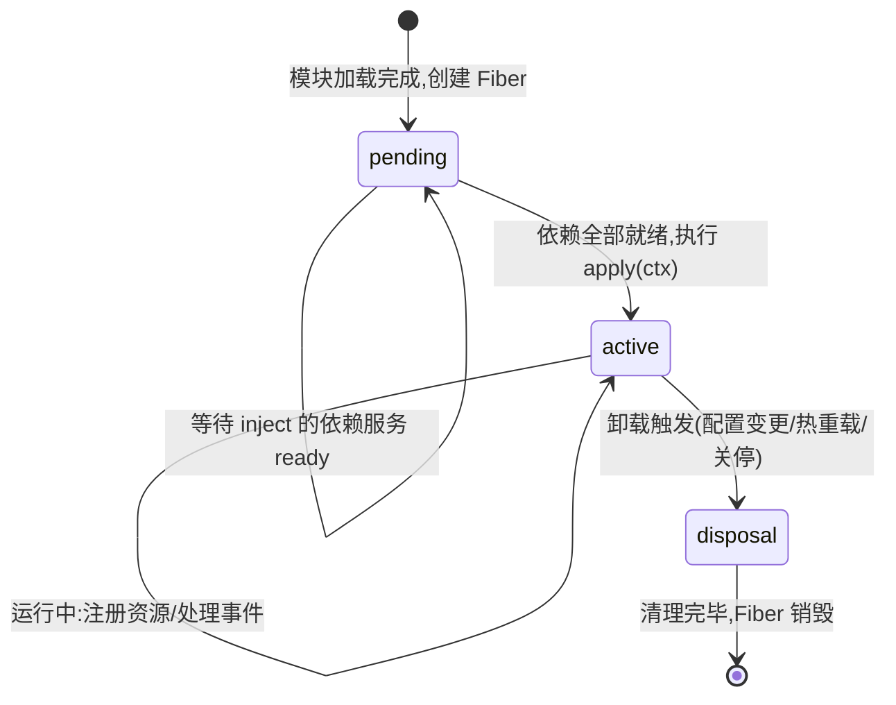
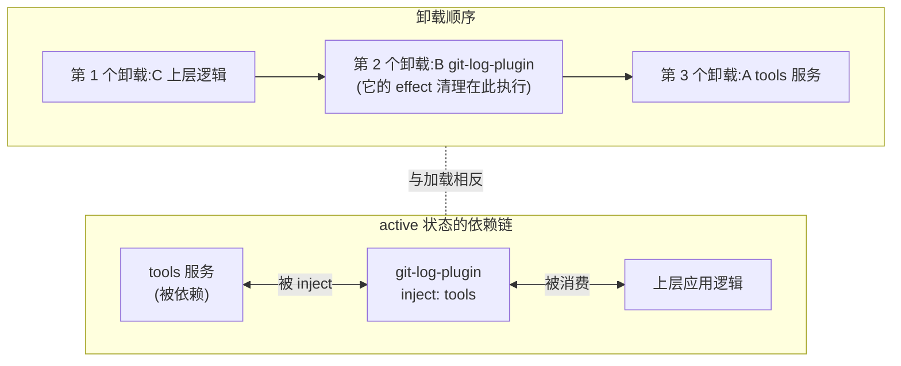

# 05 - 生命周期与自动清理

> 插件写得出来只是及格线；反复启停不泄漏、热重载不残留、卸载顺序不出错，才是工程化的分水岭。本章从 Fiber 状态机的实操视角出发，讲透 dsh 的三层清理机制——自动撤销监听器与定时器、`ctx.effect` 手动托管资源——并以"定时心跳 + SQLite 连接"插件收尾，实测反复启停无泄漏。

前置阅读：[[deepseek-harness/3实战开发/04-Config与Schemastery|Config 与 Schemastery]]
基础理论：[[deepseek-harness/2架构/01-Cordis内核原理|Cordis 内核原理]]

---

## 1. Fiber 生命周期状态机：实操视角

每个插件被加载时，框架为它创建一个 **Fiber**——插件实例在 context 树中的运行载体。Fiber 是一台小状态机：



三个状态各自的关键事实：

| 状态 | 含义 | 实操要点 |
| --- | --- | --- |
| pending | 已加载，等待依赖 | apply 还没执行；此时访问依赖服务会拿到未就绪的占位 |
| active | apply 已执行，正常运行 | 在 ctx 上注册的一切开始生效 |
| disposal | 卸载中 | 按注册逆序执行各项清理，完成后销毁 |

两个最常踩的时序坑都发生在状态边界上：

1. **pending 期抢跑**：在 `apply` 里直接使用注入的服务对象，而它还没 ready。解法是依赖声明交给框架(`inject` 数组)，框架保证 active 时依赖必已就绪(见 [[deepseek-harness/2架构/03-服务与依赖注入|服务与依赖注入]])；
2. **disposal 不彻底**：绕过 ctx 注册的资源(自己 `setInterval`、自己 `new EventEmitter().on`)框架看不见，清不掉——这是本章的核心议题。

---

## 2. 自动清理机制：ctx 注册即托管

### 2.1 反面参照：Node 世界的手动清理

先看原生 Node.js 里一个经典内存泄漏的成因：

```javascript
// 纯 Node 场景:EventEmitter 忘记 removeListener
const bus = new EventEmitter()

function startModule() {
  const handler = (msg) => console.log('got', msg)
  bus.on('message', handler)   // 注册了引用
  // ...模块"结束"时如果忘记这一行:
  // bus.off('message', handler)
  // → handler 与其闭包捕获的全部变量永远无法被 GC
}
```

泄漏的本质是：**事件总线持有对 handler 的强引用，而没人负责解除**。Node 把"谁注册谁注销"的责任完全交给人，人必然忘。同类问题还有：忘 `clearInterval` 的定时器、忘 `close` 的连接、忘 `kill` 的子进程。

### 2.2 dsh 的答案：注册动作自带回收语义

在 dsh 里，凡是**通过 ctx 发生**的注册，框架都会记入该 Fiber 的资源清单，disposal 时统一撤销：

```typescript
import type Context from '@deepseek-ai/cordis'

export function apply(ctx: Context) {
  // ① 事件监听:disposal 时框架自动移除,
  //    等价于帮你写好了 bus.off(event, handler)
  ctx.on('ready', () => console.log('ready!'))

  // ② 定时器:ctx 定义的定时器卸载时自动清除,
  //    等价于帮你写好了 clearInterval(timer)
  ctx.setInterval(() => console.log('tick'), 1000)

  // ③ 通过 register 挂到 context 上的能力:自动撤销注册
}
```

对照表:

| 你写的代码 | 框架在 disposal 时替你做的 |
| --- | --- |
| `ctx.on(evt, cb)` | 移除该监听器 |
| `ctx.setInterval(fn, ms)` / `ctx.setTimeout` | 清除该定时器 |
| `ctx.register(x)` | 撤销 x 的注册 |

原则一句话：**资源经 ctx 之手 = 托管给框架;资源绕过 ctx = 自己负责到底**。

---

## 3. ctx.effect：手动托管任意资源

框架不可能预知所有资源类型(数据库连接池、文件句柄、子进程……)。`ctx.effect` 是通用逃生舱：你描述"怎么建"，再返回一个"怎么拆"，框架负责在对的时机调用它。

```typescript
import type Context from '@deepseek-ai/cordis'

export function apply(ctx: Context) {
  // effect 接收工厂函数:
  //   函数体 = 建立资源
  //   返回值 = 析构函数(disposal 时由框架调用)
  ctx.effect(() => {
    // ---- 建立阶段 ----
    const pool = createConnectionPool({ max: 5 })
    pool.connect()
    console.log('[pool] 连接池已建立')

    // ---- 析构阶段 ----
    return () => {
      pool.closeAll()
      console.log('[pool] 连接池已关闭')
    }
  })

  // 文件句柄同理
  ctx.effect(() => {
    const fd = openSync('/tmp/app.lock', 'w')
    return () => closeSync(fd)
  })

  // 子进程同理
  ctx.effect(() => {
    const child = spawn('tail', ['-f', '/var/log/app.log'])
    child.stdout.on('data', chunk => console.log(chunk.toString()))
    return () => {
      child.kill('SIGTERM')   // 卸载时杀掉子进程,不留孤儿
    }
  })
}
```

三条使用军规：

1. **建立与析构成对书写**——把 return 的清理函数和上面的启动代码挨着写，别让它们相隔两百行；
2. **清理函数必须幂等**——框架保证会调用它，但防御性地容忍重复调用是好习惯；
3. **effect 内不要再注册新 effect**——保持每个 effect 单一职责，嵌套托管让清理顺序难以推理。

---

## 4. 思想对比：effect 与各语言的资源管理

`ctx.effect` 不是新发明，它是 RAII 思想在插件生命周期上的投影：

| 机制 | 语言/生态 | 建立时机 | 释放时机 | 与 effect 的差异 |
| --- | --- | --- | --- | --- |
| RAII / 析构函数 | C++ | 对象构造 | 作用域退出(确定性) | 绑定词法作用域；effect 绑定的是**运行时生命周期**(Fiber 存活期) |
| defer | Go | 函数内任意点 | 函数返回(后进先出) | 同样绑定函数作用域，且需手动逐个 defer |
| try-with-resources | Java | try 头部 | 块退出 | 只覆盖 AutoCloseable，且范围是单个方法 |
| context manager | Python | with 进入 | with 退出 | 同上，块级 |
| **ctx.effect** | dsh/Cordis | apply 执行中 | **Fiber disposal**(可能远晚于 apply 返回) | 释放时机由状态机驱动，与代码块无关 |

关键差异就一条：传统机制管的是"**代码块**的作用域",effect 管的是"**插件实例**的生命周期"。apply 函数早就返回了,但它建立的连接要一直活到插件被卸载的那一刻——这正是传统作用域机制覆盖不了的区间。

---

## 5. 卸载顺序：依赖者先于依赖

当多个插件互相依赖时，卸载必须走**拓扑逆序**——用别人的人先死，被依赖的服务后死。否则先死的服务会被还活着的消费者继续调用，产生悬空引用。



规则总结：

- 加载时按拓扑序：依赖先 active，消费者后 apply；
- 卸载时完全反过来：消费者先进 disposal，其 effect 全部执行完，被依赖者才轮到清理；
- 这个保证意味着：**你的 effect 清理函数执行时，可以放心假设所有消费者已经不再触碰你**——不需要在清理代码里做并发防守。

---

## 6. 热重载场景演练

改插件源码触发 reload 时，同一个插件会发生一次完整的"死亡与新生"：

```mermaid
sequenceDiagram
    participant Watch as 文件监听
    participant FSM as Fiber 状态机
    participant Old as 旧 Fiber(v1)
    participant New as 新 Fiber(v2)

    Watch->>FSM: 检测到 my-plugin.ts 变更
    FSM->>Old: 进入 disposal
    Old->>Old: 按注册逆序执行清理<br/>(监听器移除/定时器清除/effect 析构)
    Old-->>FSM: 清理完成,Fiber 销毁
    FSM->>New: 重新 import 模块,创建新 Fiber(pending)
    New->>New: 依赖检查通过 → apply(ctx)
    New-->>FSM: active
    Note over Old,New: 对用户而言是无缝替换;<br/>对插件内部而言,一切运行时状态已归零
```

### 6.1 状态丢失问题

注意上图的最后一行注解——这是热重载最大的坑：

```typescript
// 反例:状态存在闭包变量里,热重载后归零
let requestCount = 0            // ← 旧 Fiber 死亡时随闭包一起消失

export function apply(ctx: Context) {
  ctx.on('request', () => {
    requestCount += 1           // 重载后从 0 重新数起!
    console.log('累计请求:', requestCount)
  })
}
```

重载之后"累计请求"清零。轻则统计失真，重则缓存全冷、连接重建风暴。

### 6.2 外部化状态方案

原则：**跨重启需要存续的状态，不能活在 Fiber 的闭包里**。两个去处：

```typescript
// 方案一:状态放进 Service 类的实例字段?
// 注意:类形态插件热重载同样会 new 出新实例,实例字段照样丢。
// Service 字段适合的是"被多个消费者共享"而非"跨重载存续"。

// 方案二(推荐):状态存进存储层,以 Fiber 无关的位置为准
import type Context from '@deepseek-ai/cordis'
import { readFile, writeFile } from 'node:fs/promises'

const STATE_FILE = '/tmp/my-plugin-state.json'   // 或 SQLite/Redis 等

async function loadState(): Promise<{ count: number }> {
  try {
    return JSON.parse(await readFile(STATE_FILE, 'utf-8'))
  } catch {
    return { count: 0 }                          // 首次运行没有文件
  }
}

export function apply(ctx: Context) {
  let state: { count: number }

  ctx.on('ready', async () => {
    state = await loadState()                    // 启动时从外部恢复
    console.log('恢复后的计数:', state.count)
  })

  // 持久化本身也交给 effect 托管:卸载前把状态刷回磁盘
  ctx.effect(() => {
    return () => {
      if (state) {
        // fire-and-forget 写盘:即使进程即将退出也尽力保存
        writeFile(STATE_FILE, JSON.stringify(state)).catch(() => {})
      }
    }
  })
}
```

决策口诀：**共享用 Service,存续靠存储，闭包只放临时量**。

---

## 7. 实战：定时心跳 + SQLite 连接插件

综合运用本章全部知识：一个带周期心跳、持有 SQLite 连接的插件，并实测反复启停无泄漏。

### 7.1 实现

创建 `scratch-plugin/src/lifecycle-demo.ts`:

```typescript
// lifecycle-demo.ts —— 生命周期演示:心跳 + SQLite 连接托管
import type Context from '@deepseek-ai/cordis'

// 用 node:sqlite 内置模块演示;也可换成 better-sqlite3 等
import { DatabaseSync } from 'node:sqlite'

export const name = 'lifecycle-demo'

export function apply(ctx: Context) {
  const startedAt = Date.now()

  // ===== 资源一:SQLite 连接(effect 托管)=====
  ctx.effect(() => {
    // 建立阶段:打开数据库文件
    const db = new DatabaseSync('/tmp/lifecycle-demo.db')
    // 初始化一张事件表:记录插件的启停历史
    db.exec(`
      CREATE TABLE IF NOT EXISTS events (
        id INTEGER PRIMARY KEY AUTOINCREMENT,
        kind TEXT NOT NULL,      -- 'start' 或 'stop'
        at INTEGER NOT NULL      -- Unix 毫秒时间戳
      )
    `)
    db.prepare('INSERT INTO events (kind, at) VALUES (?, ?)')
      .run('start', startedAt)
    console.log('[lifecycle] SQLite 已打开')

    // 析构阶段:记录停止事件后关闭连接
    return () => {
      db.prepare('INSERT INTO events (kind, at) VALUES (?, ?)')
        .run('stop', Date.now())
      db.close()
      console.log('[lifecycle] SQLite 已安全关闭')
    }
  })

  // ===== 资源二:ctx 定义的定时器(框架自动清理)=====
  ctx.setInterval(() => {
    const up = Math.round((Date.now() - startedAt) / 1000)
    console.log(`[heartbeat] 存活 ${up}s`)
  }, 3000)

  // ===== 资源三:普通事件监听(框架自动清理)=====
  ctx.on('ready', () => console.log('[lifecycle] 应用就绪'))

  // ===== 反面对照:故意绕过 ctx 的裸定时器(教学用)=====
  // 取消注释下面两行,就能观察到"卸载后心跳仍在打印"的泄漏现象:
  // setInterval(() => console.log('[LEAK] 我不该还活着'), 5000)
}
```

三种资源对应三种命运：effect 托管的连接在 disposal 中优雅收尾；ctx 定时器与监听器被框架静默清除；裸定时器则成为幽灵——这就是注释里那两行反例的教学价值。

### 7.2 patch 与启停脚本

```yaml
# scratch-plugin/cordis.yml
insert:
  - id: lifecycle-demo
    name: '/home/a/RootStack/deepseek-harness/scratch-plugin/src/lifecycle-demo.ts'
```

```bash
# 启停循环脚本:模拟多次热重载/重启
for i in 1 2 3; do
  echo "===== 第 $i 轮启动 ====="
  pnpm dsh web --patch ./scratch-plugin/cordis.yml &
  APP_PID=$!
  sleep 8                       # 让心跳打印两轮
  kill $APP_PID                 # 触发优雅关停(Fiber 走 disposal)
  wait $APP_PID 2>/dev/null
done

# 验证无泄漏:查看事件表,start 与 stop 应严格交替、数量相等
node -e "
const { DatabaseSync } = require('node:sqlite');
const db = new DatabaseSync('/tmp/lifecycle-demo.db');
console.table(db.prepare('SELECT * FROM events').all());
"
```

### 7.3 判定标准

观察两个证据，确认生命周期行为正确：

1. **终端日志成对出现**：每轮都有 `[lifecycle] SQLite 已打开` 和对应的 `[lifecycle] SQLite 已安全关闭`;反面的 `[LEAK]` 日志在进程退出后不再出现;
2. **事件表严格配平**:查询结果里 `start`/`stop` 一一交错,没有"有 start 无 stop"的悬挂记录——任何一轮清理缺失都会在这里现形。

进一步可配合进程级观测:`ps aux | grep dsh` 确认没有残留进程;多次循环前后对比 RSS 内存，不应单调上涨。

### 7.4 泄漏诊断工具箱

当怀疑某处泄漏但不确定在哪，按成本从低到高使用这些手段：

| 手段 | 做法 | 能发现什么 |
| --- | --- | --- |
| 日志配对法 | 给每个 effect 的建立/清理都打日志,启停 N 轮后数配对 | 哪个资源没被清理 |
| 句柄计数 | `ls /proc/<pid>/fd \| wc -l` 反复对比 | 文件句柄泄漏 |
| 定时器残留 | 启停后观察是否仍有周期性日志输出 | 绕过 ctx 的裸定时器 |
| 进程内存曲线 | 多轮启停间记录 RSS,看是否阶梯上涨 | 累积性泄漏(闭包/数组堆积) |
| 堆快照 | 用 `node --inspect` + Chrome DevTools 对比两次快照 | 具体是哪类对象滞留 |

实操顺序建议：先用日志配对法定位"哪个资源"(零成本，五分钟)，再用堆快照回答"为什么没被回收"(高成本，但精准)。绝大多数插件级泄漏在前一步就现形——因为 dsh 体系内泄漏的根因几乎总是同一个：**资源绕过了 ctx 注册**。

---

## 8. 本章小结

- Fiber 三态:pending 等依赖、active 运行、disposal 清理;时序坑都埋在状态边界上;
- 经 ctx 的注册(监听器/定时器/register)全部自动回收——对比 Node 手动 removeListener 的世界,责任从人转移到框架;
- `ctx.effect(() => { 建立; return () => 析构 })` 是通用资源逃生舱;它与 RAII/defer 的本质区别在于绑定的不是代码块作用域而是 Fiber 生命周期;
- 卸载走拓扑逆序,消费者先死、被依赖者殿后;
- 热重载 = 旧 Fiber disposal + 新 Fiber active,闭包状态随之蒸发——共享用 Service、存续靠存储；
- 实战验证了"启停 N 次，start/stop 严格配平"的无泄漏标准。

收尾附一张自查清单，写完每个插件过一遍：

| 自查项 | 通过标准 |
| --- | --- |
| 所有定时器经 ctx 定义? | 源码中不出现裸 `setInterval`/`setTimeout` |
| 所有监听器经 ctx 注册? | 不在自建 EventEmitter 上挂永久回调 |
| 每个外部资源都有 effect? | 连接/句柄/子进程均成对书写建立与析构 |
| 清理函数幂等? | 重复调用不抛错、无副作用累积 |
| 跨重载状态已外部化? | 闭包里只有临时量,持久状态走存储层 |
| 启停 N 次日志配平? | 建立日志数 = 清理日志数,事件表 start/stop 相等 |

至此实战篇的基础四件套(构建/插件/工具/配置/生命周期)齐备。下一步可以回头深读 [[deepseek-harness/2架构/03-服务与依赖注入|服务与依赖注入]] 补足理论，或进入 [[deepseek-harness/4设计自己的Harness/01-何时需要自建Harness|设计自己的 Harness]] 开始造自己的轮子。
