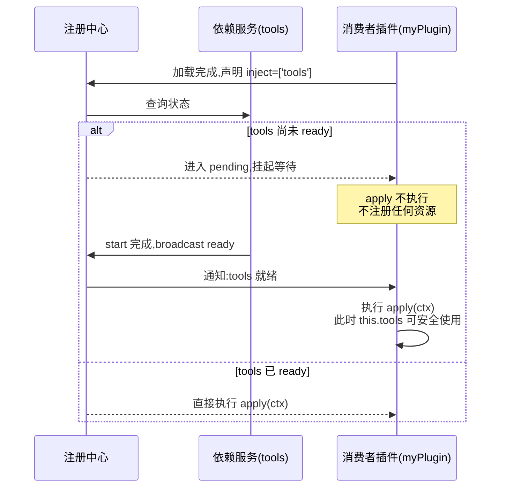
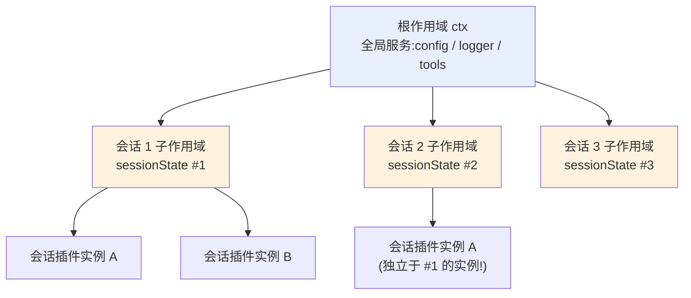
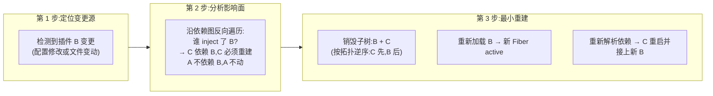
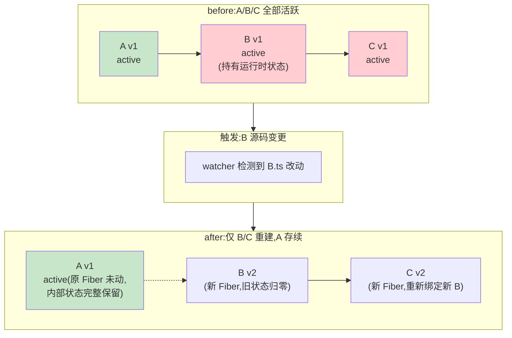

# 06 - 依赖驱动与热重载

> `inject` 不是 import 的另一种写法——它是一份"就绪通知"契约:依赖未就绪时插件挂起等待,依赖被销毁时自己也随之销毁。理解这一点,热重载的"最小重建"行为就是自然推论而非魔法。本章讲透依赖驱动的加载模型、fork 与嵌套上下文、热重载的子树定位机制,并以 A→B→C 三层插件链实测"改 B 只重载 B+C 而 A 纹丝不动"。

前置阅读:[[deepseek-harness/3实战开发/05-生命周期与自动清理|生命周期与自动清理]]
基础理论:[[deepseek-harness/2架构/03-服务与依赖注入|服务与依赖注入]]

---

## 1. inject 的本质:就绪通知,不是导入

### 1.1 与 import 的根本区别

`import` 是**编译期**行为:模块加载即拿到引用,不管对方是否准备好。而 `inject` 是**运行期**契约:

```typescript
import { Service } from '@deepseek-ai/cordis'
import type Context from '@deepseek-ai/cordis'

// 声明:我依赖 'tools' 服务
class MyPlugin extends Service {
  static inject = ['tools']

  constructor(ctx: Context) {
    super(ctx, 'myPlugin')
    // 注意:走到这里不代表 tools 已经 ready!
    // 构造函数里不要使用 this.tools 做任何事
  }
}
```

框架对这份契约的处理方式:

| 场景 | import 世界的行为 | inject 世界的行为 |
| --- | --- | --- |
| 依赖尚未就绪 | 拿到 undefined,运行时报错 | 插件**挂起**(pending),等通知 |
| 依赖就绪 | 无此概念 | 收到通知,执行 apply/start |
| 依赖被销毁 | 无此概念(引用悬空) | 自己也被**连带销毁** |
| 循环依赖 | 加载顺序不定,可能拿到半初始化对象 | 检测到循环,**死锁报错**,拒绝加载 |

第三行是精髓:**依赖销毁则自己也销毁**。这保证了你永远不会持有指向已死亡服务的引用——框架替你维护了引用有效性这个不变量。

### 1.2 就绪流程时序图



两个实操要点:

1. **挂起期间零副作用**:pending 状态下插件没有执行 apply,所以它没注册监听器、没开定时器、没建连接——等待是绝对安全的;
2. **使用注入服务的位置**:在 Service 类形态中,注入的服务在 start 阶段之后才保证可用;把"用到依赖"的逻辑放在 start 或事件回调里,而不是 constructor。

---

## 2. fork 与嵌套上下文

### 2.1 作用域模型

Cordis 的 context 树不只是插件的组织结构,它同时是**作用域边界**。`ctx.fork()` 创建一个子作用域:

```typescript
import type Context from '@deepseek-ai/cordis'

export function apply(ctx: Context) {
  // fork 出一个子作用域
  const child = ctx.fork({
    // 子作用域可以有独立的配置覆盖
  })

  // 在子作用域上安装插件:只影响这个分支
  child.plugin(mySessionPlugin)
}
```

可见性规则一张表说清:

| 对象 | 父作用域的服务 | 子作用域新建的服务 |
| --- | --- | --- |
| 父作用域的插件 | 可见可用 | 不可见 |
| 子作用域的插件 | **可见可用**(向下穿透) | 可见可用 |

即:**服务查找是向上的**——子作用域能看到父作用域的一切;父作用域永远看不到子作用域的东西。如果子作用域注册了与父作用域同名的服务,子作用域内的解析结果会被**遮蔽**(shadow):离得近的优先。

### 2.2 隔离用途:每会话一份状态

嵌套上下文最典型的用途是会话隔离:dsh 为每个对话会话 fork 一个子作用域,会话内创建的状态(临时变量、会话级缓存、进行中的任务队列)全部活在这个子树里。会话结束时销毁子作用域,其中所有插件、服务、资源随之整体回收——不需要逐个清理。



注意图中同一个会话插件在三个会话里有**三份独立实例**——这就是隔离的意义:会话 1 里改了什么,绝不会泄漏进会话 2。

### 2.3 与热重载的关系(伏笔)

作用域树还有一个关键性质:**销毁是递归的**。销毁某个节点,它的整个子树一起走。这正是下一节热重载"最小重建"的基础——重建的单位是子树。

---

## 3. 热重载机制全解

### 3.1 从配置变更到最小重建

当某个插件的配置或源码发生变化,dsh 并不会重启进程,也不会重建整棵 context 树。它做的是一次外科手术:



### 3.2 before / after 对比

假设当前运行的依赖链是 A ← B ← C(C 依赖 B,B 依赖 A):



绿色是存活的(A),红色是被销毁重建的(B/C)。这张图回答了一个高频疑问:"为什么改了 B,我的计数器丢了,但 A 的连接池还在?"——因为重建边界画在了依赖图上,不画在整个进程上。

### 3.3 重建边界的判定规则

| 规则 | 结果 |
| --- | --- |
| 被改插件自身 | 销毁重建 |
| 直接/间接 inject 它的所有服务与插件 | 连带销毁重建(依赖传播) |
| 它 inject 的上游依赖 | **不动**(上游与本次变更无关) |
| 与它无依赖关系的旁支插件 | **不动** |

推论:越靠近叶子(底层)的改动,爆炸半径越大;改最底层的 A 会连着重载整条链上的 B 和 C。这也是为什么公共底座服务要格外谨慎地发布——它的每一次变更都会波及全部消费者。

---

## 4. 触发重载 vs 必须重启:对照表

并非一切改动都能被热重载消化。判断标准是:**改动是否发生在 context 树的管理范围内**。

| 改动类型 | 行为 | 原因 |
| --- | --- | --- |
| 插件源码修改(.ts/.js) | 热重载该插件及其消费者 | 文件在 watcher 监视范围内 |
| 插件配置修改(Config) | 热重载对应插件 | 配置变更是 Cordis 一等公民事件 |
| cordis.yml 中新增插件 | 加载新插件,不动存量 | 纯增量操作 |
| cordis.yml 中移除插件 | 卸载该插件及其子树 | 依赖传播销毁 |
| **dsh 本体升级** | 必须重启进程 | 框架代码已在内存中,无法自替换 |
| **package.json 依赖变更**(新增 npm 包) | 通常需重启 | node_modules 变化超出 watcher 语义 |
| **tsconfig / 构建配置变更** | 必须重启 | 影响编译产物形态,非插件级变更 |
| **环境变量 / 密钥轮换** | 视实现而定,稳妥做法重启 | 进程级环境快照不会因 reload 刷新 |

经验法则:插件目录内的改动交给热重载;动到了"运行环境的形状"(依赖树、构建配置、本体版本)就老老实实重启。热重载是开发加速器,不是运维高可用方案。

---

## 5. 开发循环最佳实践

### 5.1 watch 模式的思路

理想开发循环是:保存文件 → 秒级看到效果 → 继续写。dsh 的热重载让这个循环成立,但要用对姿势:

1. **保持单一变更原则**:一次只改一个插件再观察。同时改 A 和 B 会让重建边界难以解读;
2. **把状态外部化**(见 [[deepseek-harness/3实战开发/05-生命周期与自动清理|生命周期与自动清理]] 第 6.2 节),否则每次重载都从零开始,验证"累计行为"类逻辑会很痛苦;
3. **日志打点建立/析构**:每个插件的 apply 入口和 effect 清理各打一行日志,重载发生时终端会清晰展示谁死了谁活了;
4. **利用 pending 可见性**:如果保存后插件没有生效,先看是不是依赖未满足卡在 pending——日志里通常有提示。

### 5.2 快速验证插件改动的最短路径

对于"只想确认我的工具/服务改动是否正确"的场景,不必每次都开完整 web UI:

```bash
# 最短路径一:headless 单次运行,打印答案即退出
pnpm dsh --profile headless "调用 greet 工具向 Alice 问好"

# 最短路径二:配合 patch 只加载目标插件,排除干扰
pnpm dsh --profile headless --patch ./scratch-plugin/cordis.yml "列出你可用的工具"
```

headless 模式详见 [[deepseek-harness/3实战开发/08-会话日志与可观测|会话日志与可观测]]。组合拳:**web UI 用于交互式调试体验,headless 用于快速回归验证**——两者共享同一套热重载机制,改完代码两种方式都立刻生效。

---

## 6. 实战:三层插件链的重载边界实测

构建 A(基础服务)→ B(依赖 A)→ C(依赖 B)三层链条,然后只改 B,观察重载范围。

### 6.1 服务 A:基础计数服务

创建 `scratch-plugin/src/service-a.ts`:

```typescript
// service-a.ts —— 底层基础服务:无依赖,提供自增计数
import { Service } from '@deepseek-ai/cordis'
import type Context from '@deepseek-ai/cordis'

// 声明合并:让 ctx.serviceA 获得类型安全(详见下一章)
declare module '@deepseek-ai/cordis' {
  interface Context {
    serviceA: ServiceA
  }
}

export class ServiceA extends Service {
  static inject = []            // 底层服务:无依赖

  private count = 0             // 运行时状态:重载后归零

  constructor(ctx: Context) {
    super(ctx, 'serviceA')
  }

  // 对外能力:自增并返回
  increment(): number {
    this.count += 1
    return this.count
  }

  get value(): number {
    return this.count
  }

  // 生命周期:start 时打点,便于观察 A 是否被重建
  async start(): Promise<void> {
    console.log('[A] ServiceA 启动,count =', this.count)
  }
}

export function apply(ctx: Context) {
  ctx.plugin(ServiceA, 'serviceA')
}
```

### 6.2 服务 B:依赖 A

创建 `scratch-plugin/src/service-b.ts`:

```typescript
// service-b.ts —— 中间层:inject 声明依赖 serviceA
import { Service } from '@deepseek-ai/cordis'
import type Context from '@deepseek-ai/cordis'

declare module '@deepseek-ai/cordis' {
  interface Context {
    serviceB: ServiceB
  }
}

export class ServiceB extends Service {
  // 关键一行:声明依赖 A。
  // 框架保证 start 执行前 serviceA 必已就绪;
  // 也意味着 A 若被销毁,B 会被连带销毁。
  static inject = ['serviceA']

  private logHistory: string[] = []   // B 自己的运行时状态

  constructor(ctx: Context) {
    super(ctx, 'serviceB')
  }

  // 组合 A 的能力:记录每次计数事件
  tickWithLog(): string {
    const n = this.ctx.serviceA.increment()
    const entry = `tick #${n} @ ${new Date().toISOString()}`
    this.logHistory.push(entry)
    return entry
  }

  get historySize(): number {
    return this.logHistory.length
  }

  async start(): Promise<void> {
    console.log('[B] ServiceB 启动,history =', this.logHistory.length)
  }
}

export function apply(ctx: Context) {
  ctx.plugin(ServiceB, 'serviceB')
}
```

### 6.3 服务 C:依赖 B

创建 `scratch-plugin/src/service-c.ts`:

```typescript
// service-c.ts —— 顶层消费者:inject ['serviceB']
import { Service } from '@deepseek-ai/cordis'
import type Context from '@deepseek-ai/cordis'

export class ServiceC extends Service {
  static inject = ['serviceB']      // C 只认识 B,不直接碰 A

  constructor(ctx: Context) {
    super(ctx, 'serviceC')
  }

  // 通过 B 间接使用 A:分层的好处是 C 对 A 的存在完全无感
  run(): string {
    const entry = this.ctx.serviceB.tickWithLog()
    console.log('[C] 收到:', entry, '| B 的历史条数:', this.ctx.serviceB.historySize)
    return entry
  }

  async start(): Promise<void> {
    console.log('[C] ServiceC 启动')
  }
}

export function apply(ctx: Context) {
  ctx.plugin(ServiceC, 'serviceC')
}
```

### 6.4 入口插件与启动脚本

创建 `scratch-plugin/src/chain-entry.ts`,把三层串起来并周期性驱动:

```typescript
// chain-entry.ts —— 三层链入口:装配 + 周期驱动
import type Context from '@deepseek-ai/cordis'

export const name = 'chain-entry'

export function apply(ctx: Context) {
  // 三层的加载顺序由 inject 自动推导:
  // 即使这里乱序 plugin,框架也会按 A→B→C 的拓扑序启动
  ctx.on('ready', () => {
    // 每 3 秒驱动一次整条链
    ctx.setInterval(() => {
      ctx.serviceC.run()
    }, 3000)
  })
}
```

更新 `scratch-plugin/cordis.yml`(路径按实际仓库调整):

```yaml
insert:
  - id: chain-entry
    name: '/home/a/RootStack/deepseek-harness/scratch-plugin/src/chain-entry.ts'
  - id: service-a
    name: '/home/a/RootStack/deepseek-harness/scratch-plugin/src/service-a.ts'
  - id: service-b
    name: '/home/a/RootStack/deepseek-harness/scratch-plugin/src/service-b.ts'
  - id: service-c
    name: '/home/a/RootStack/deepseek-harness/scratch-plugin/src/service-c.ts'
```

### 6.5 实验步骤与预期输出

```bash
# 启动(web 模式便于触发热重载;也可直接改文件触发)
pnpm dsh web --patch ./scratch-plugin/cordis.yml
```

启动后终端应周期性出现:

```text
[A] ServiceA 启动,count = 0
[B] ServiceB 启动,history = 0
[C] ServiceC 启动
[C] 收到: tick #1 @ ... | B 的历史条数: 1
[C] 收到: tick #2 @ ... | B 的历史条数: 2
```

现在**只编辑 service-b.ts**——比如把 `tickWithLog` 的日志格式改一下,保存。预期现象:

```text
[B] ServiceB 启动,history = 0          ← B 重建,状态归零
[C] ServiceC 启动                       ← C 因依赖 B 被连带重建
[C] 收到: tick #1 @ ...                 ← 注意!A 没有重启,
                                           count 从上次的中断处继续
```

判定标准三条:

1. **没有 `[A] ServiceA 启动` 日志**——A 未被重建,其 count 保持连续;
2. **B 与 C 各出现一次新的启动日志**——重建边界精确落在"B 及其消费者";
3. B 的 `history` 归零(闭包状态随旧 Fiber 消失),印证第 5 章的"存续靠存储"口诀。

再把实验反过来做一次:改 service-a.ts 并保存。这次应看到 A、B、C **全部**重新启动——底层变更沿依赖图正向传播,爆炸半径最大。两次实验对照,你对"最小重建"就有了肌肉记忆。

---

## 7. 本章小结

- `inject` 是运行期就绪契约:未就绪则挂起(pending)、就绪则通知(apply)、依赖销毁则连带销毁——对比 import 的编译期语义,多出的正是生命周期维度;
- fork 出的子作用域向上可见父服务、向下遮蔽同名服务;每会话一份状态的隔离靠的就是子树的递归销毁;
- 热重载 = 定位变更源 → 反向遍历依赖图 → 最小重建受影响子树;上游不动、旁支不动、消费者连带;
- 插件目录内的改动可热重载;本体升级/依赖安装/构建配置变化必须重启进程;
- 开发循环:单次单改、状态外置、启停打点,headless 快速回归 + web UI 交互调试双轨并行;
- 实测确认:改中间层 B 只重载 B+C,底层 A 的状态安然无恙;改底层 A 则全链重建。

下一章我们把 Service 类形态讲深一层,重点解决"ctx.serviceB 为什么有完整的类型提示"这个问题:[[deepseek-harness/3实战开发/07-服务注册与类型安全|服务注册与类型安全]]。
