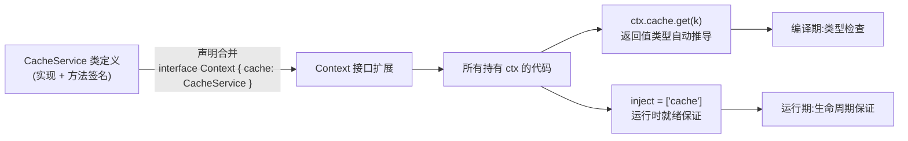
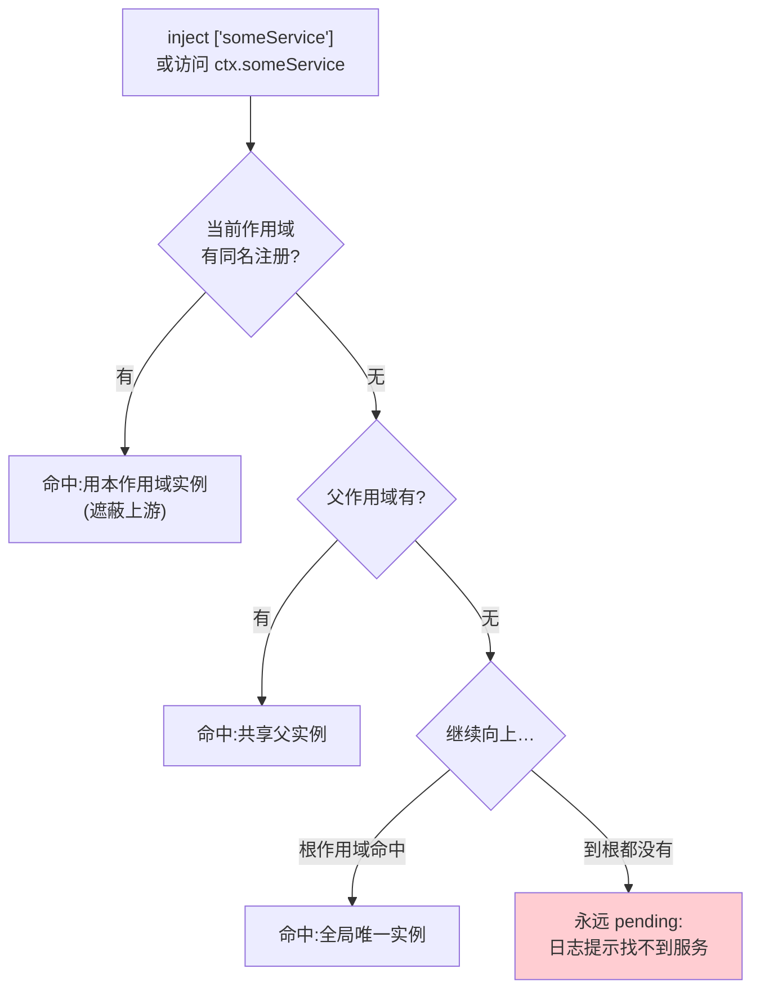

# 07 - 服务注册与类型安全

> Service 是 Cordis 体系里"被多个消费者共享的能力单元"。本章讲三件事:Service 类的完整生命周期用法;TS 声明合并如何让 `ctx.myService` 获得端到端类型流动(并对照 Spring IoC 的运行时注入);以及类型组织、可见性边界、测试策略与三个经典坑。

前置阅读:[[deepseek-harness/3实战开发/06-依赖驱动与热重载|依赖驱动与热重载]]
基础理论:[[deepseek-harness/2架构/03-服务与依赖注入|服务与依赖注入]]
对照阅读:[[java/3工程化/05_Spring IoC与AOP|Spring IoC]]

---

## 1. Service 类深度用法

### 1.1 完整骨架

```typescript
import { Service } from '@deepseek-ai/cordis'
import type Context from '@deepseek-ai/cordis'

export class CacheService extends Service {
  // ① static inject:声明本服务的依赖。
  //    框架据此决定启动时机(pending 等待)与销毁联动
  static inject = ['config']

  private store = new Map<string, string>()

  constructor(ctx: Context) {
    // ② super(ctx, name):把自己注册到当前作用域,
    //    注册名即其他插件 inject 时引用的名字
    super(ctx, 'cache')
  }

  // ③ 生命周期钩子:start 在依赖全部就绪后被调用,
  //    这里是使用 this.ctx.config 的第一个安全时机
  async start(): Promise<void> {
    const maxSize = this.ctx.config.get('cache.maxSize') ?? 1000
    console.log('[cache] 启动,容量上限', maxSize)
  }

  // ④ stop 钩子:disposal 阶段调用。
  //    注意:此时消费者已全部先行销毁(拓扑逆序),
  //    可以放心关闭资源,不必担心还有人调用 set/get
  async stop(): Promise<void> {
    console.log('[cache] 关闭,丢弃', this.store.size, '条缓存')
    this.store.clear()
  }

  // 公开能力:普通方法即可,消费者经 ctx.cache 调用
  set(key: string, value: string): void { this.store.set(key, value) }
  get(key: string): string | undefined { return this.store.get(key) }
}

// 函数式入口:把类安装进 context
export function apply(ctx: Context) {
  ctx.plugin(CacheService, 'cache')
}
```

### 1.2 构造、start、stop 的时机表

| 阶段 | 触发条件 | 能做什么 | 不能做什么 |
| --- | --- | --- | --- |
| constructor | Fiber 创建 | 存 ctx、初始化字段 | **不要**使用注入的服务(this.ctx.xxx 未就绪) |
| start | inject 声明的依赖全部 ready | 使用依赖、建立连接、注册工具 | —— |
| stop | 自身进入 disposal | 释放资源、刷盘 | 不要再假设别的服务还活着(它们可能也已停) |

一句话:**构造只做自我初始化,跨服务协作一律放 start**。把协作代码写进 constructor 是 pending 期抢跑的经典翻车点。

### 1.3 与函数式插件的分工

| 维度 | Service 类 | 函数式 apply |
| --- | --- | --- |
| 定位 | 共享能力单元,多消费者 | 组装逻辑、一次性装配 |
| 被引用方式 | `static inject` + `ctx.name` | 通常不被引用 |
| 状态归属 | 实例字段(随作用域存亡) | 闭包变量(随 Fiber 存亡) |
| 适用 | 连接池、注册中心、领域服务 | 工具注册、事件接线 |

经验法则:凡是会被第二个插件用到的东西,升级成 Service;只出现一次的装配逻辑留在函数式插件里。

---

## 2. 声明合并:让类型沿 ctx 流动

### 2.1 问题:字符串注册,如何获得类型?

`ctx.plugin(CacheService, 'cache')` 用字符串名字注册,消费侧 `ctx.cache` 若没有额外机制,只会是 `any` 或报错——注入是运行时行为,TS 编译器天然看不见。

dsh/Cordis 的答案是 TypeScript 的**声明合并**(declaration merging):接口可以分多处声明,编译器自动聚合。

```typescript
// cache-service.ts 中追加:
declare module '@deepseek-ai/cordis' {
  interface Context {
    // 告诉编译器:Context 接口上有一个 cache 属性,
    // 其类型就是 CacheService 类实例
    cache: CacheService
  }
}
```

这一段之后,**全库范围内**:

```typescript
// 任何文件里,只要有 ctx,就有完整的类型链:
const v = ctx.cache.get('k')
//    ↑ 类型自动推导为 string | undefined
ctx.cache.set('k', 'v')
//   ↑ 方法补全、参数提示、拼错即红线

// 消费者甚至不需要 import CacheService:
class Consumer extends Service {
  static inject = ['cache']
  constructor(ctx: Context) { super(ctx, 'consumer') }
  async start() {
    // 只靠字符串名 'cache' 注入,
    // 却拿到了完整类型的 ctx.cache —— 声明合并的魔力
    console.log(this.ctx.cache.get('hello'))
  }
}
```

### 2.2 类型流动全景图



左边一半(声明合并)解决**编译期**,右边一半(inject)解决**运行期**——两者配合才构成完整的依赖注入体验:名字错了编译不过,顺序错了框架不启动。

### 2.3 对照 Java Spring @Autowired

写过 [[java/3工程化/05_Spring IoC与AOP|Spring IoC]] 的读者对下面这段一定眼熟:

```java
// Spring:运行时注入,编译器不知情
@Service
public class OrderService {
    @Autowired            // ← 仅是标记,容器启动时按类型反射装配
    private CacheClient cache;

    public void place(Order o) {
        cache.put(o.id(), o);   // IDE 补全来自字段声明的静态类型,
    }                           // 但"是否真的会被注入"编译期无从知晓
}
```

逐项对比:

| 维度 | Spring @Autowired | dsh 声明合并 + inject |
| --- | --- | --- |
| 绑定时机 | 运行时反射装配 | 运行时就绪通知 |
| 名字/类型错误暴露时机 | 启动失败(NoSuchBeanDefinition)或更晚 | **编译期红线**(属性不存在直接报错) |
| 注入结果的可推断性 | 依赖 XML/@Qualifier 等外部信息 | `ctx.cache` 的类型由 TS 全局推导 |
| 缺失依赖的行为 | 启动报错(若 required=true) | 插件挂起 pending,日志可查 |
| 重构改名 | 字符串 qualifier 散落各处易漏改 | 改接口声明一处,全库编译错误即时浮现 |

关键差异一句话:Spring 把"装配正确性"押在运行时,dsh 通过声明合并把它**提前到编译期**。这不是语言优劣问题(JS 没有 TS 这样的结构化类型系统可用),而是同一问题域在不同类型系统能力下的两种解法。Spring 社区后来推构造器注入 + JSR-305,本质上也是想往编译期挪一点。

---

## 3. 跨包共享类型的组织方式

当服务要被**多个独立插件包**消费时,"接口在哪"就成了架构问题。原则:**接口与实现分离,类型放独立的 types 包**。

```text
my-dsh-stack/
├── packages/
│   ├── types/                  ← 纯类型包,零运行时代码
│   │   └── src/index.ts        // export interface CacheLike {...}
│   ├── cache-service/          ← 实现 + 服务注册
│   │   └── src/index.ts        // implements CacheLike
│   └── consumer-plugin/        ← 消费者,只依赖 types
│       └── src/index.ts
└── pnpm-workspace.yaml
```

```typescript
// packages/types/src/index.ts —— 消费者与实现共同遵守的契约
// 只描述"能做什么",不绑定任何实现
export interface CacheLike {
  set(key: string, value: string): void
  get(key: string): string | undefined
  readonly size: number
}
```

```typescript
// packages/cache-service/src/index.ts —— 实现方
import { Service } from '@deepseek-ai/cordis'
import type { CacheLike } from '@my-scope/types'

export class CacheService extends Service implements CacheLike {
  static inject = []
  constructor(ctx: any) { super(ctx, 'cache') }
  // ...实现略
}

declare module '@deepseek-ai/cordis' {
  interface Context {
    // 注意:Context 上声明的可以是接口类型而非具体类,
    // 消费者从此只知道 CacheLike,不知道实现细节
    cache: CacheLike
  }
}
```

这样组织的三个收益:

1. **消费者零实现依赖**:consumer-plugin 只 import types 包,测试时可以用内存假实现替换真缓存;
2. **实现可替换**:换 Redis 后端不动任何消费者代码,契约不变;
3. **发布面收窄**:types 包单独发版,语义化版本独立演进,破坏性变更在类型层面一目了然。

---

## 4. 服务解析的查找顺序

在写消费代码前,值得把"`ctx.someService` 到底解析到哪个实例"的规则钉死。给定一个插件所在的 Fiber,服务名按以下优先级解析:



三条推论:

1. **就近遮蔽**:子作用域注册与父作用域同名的服务后,子树内所有消费者拿到的是子实例——这是实现"默认全局、特殊会话覆盖"的标准手法;
2. **解析结果在注入时固定**:一旦某插件被注入了父作用域的实例,之后子作用域再注册同名服务不会影响它——依赖关系是加载时刻的快照;
3. **找不到就是 pending 而不是报错崩溃**:名字拼错的典型症状是"插件一直不启动",排查时先查 inject 数组里的字符串拼写。

---

## 5. 服务的可见性边界

结合上一章的作用域模型([[deepseek-harness/3实战开发/06-依赖驱动与热重载|依赖驱动与热重载]] 第 2 节),服务有两种投放策略:

| 策略 | 做法 | 适用场景 |
| --- | --- | --- |
| 公开给所有插件 | 在根作用域 `ctx.plugin(Service)` | 全局能力:配置、日志、连接池、工具注册表 |
| 仅限子作用域 | 在 `ctx.fork()` 出的作用域上安装 | 会话级状态、请求级上下文、实验性功能 |

```typescript
export function apply(ctx: Context) {
  // 全局唯一:所有插件都能 inject 到同一个实例
  ctx.plugin(GlobalRegistry, 'registry')

  // 会话隔离:每 fork 一个作用域,就有一份新的 SessionState
  ctx.on('session-created', (sessionCtx: Context) => {
    sessionCtx.plugin(SessionState, 'sessionState')
    // 该实例只在会话子树内可见、随会话销毁而销毁
  })
}
```

判断口诀:**状态需要共享 → 根作用域;状态需要隔离 → 子作用域**。拿不准时选子作用域——隔离的错误代价小,共享的错误代价是多会话数据串门。

---

## 6. 测试 Service 的策略

### 5.1 mock 依赖的构造方式

Service 的两个外部输入是 ctx 和注入的依赖。单测时用最小假对象替换:

```typescript
// __tests__/service-b.spec.ts
import { describe, it, expect } from 'vitest'

// 手工捏一个最小化的 fake ctx:
// Service 基类只需要 ctx 能提供"取服务"与事件挂载的最小面
function makeFakeCtx(deps: Record<string, unknown>) {
  return {
    ...deps,                       // 直接把依赖摊平:fakeCtx.serviceA 即可访问
    on: () => () => {},            // 事件注册:返回取消函数
    effect: () => {},              // 资源托管:no-op
    setInterval: () => 0,          // 定时器:no-op
  } as any
}

// 测试中绕过真实加载流程,直接 new:
// 传入 fake ctx,Service 基类的 inject 解析被我们短路
import { ServiceB } from '../src/service-b'

describe('ServiceB', () => {
  it('tickWithLog 应组合 serviceA 的计数', () => {
    let n = 0
    const fakeA = { increment: () => ++n }
    const svc = new ServiceB(makeFakeCtx({ serviceA: fakeA }) as any)
    // 直接调用业务方法(不经 start,因为单测聚焦纯逻辑)
    const entry = svc.tickWithLog()
    expect(entry).toContain('tick #1')
    expect(n).toBe(1)
  })

  it('多次 tick 计数应连续', () => {
    const fakeA = { increment: (() => { let n = 100; return () => ++n })() }
    const svc = new ServiceB(makeFakeCtx({ serviceA: fakeA }) as any)
    svc.tickWithLog(); svc.tickWithLog()
    expect(svc.historySize).toBe(2)
  })
})
```

策略要点:

1. **绕过框架,直击逻辑**:单测不验证 inject 就绪性(那是集成测试的事),用 fake ctx 短路掉生命周期,直接测业务方法;
2. **依赖用最简 stub**:fakeA 只要长出被调用的方法即可,不必是真 Service;
3. **集成测试另开一层**:验证"inject 链是否接对",用 headless 模式跑一次真实加载(见上一章 5.2 节),比搭测试容器便宜得多。

---

## 7. 常见坑

### 坑一:两个插件注册同名服务

```text
症状:后注册者静默覆盖前者(或按作用域规则遮蔽),
     消费者拿到的服务"行为变了",且难以复现。
排查:全局搜索 super(ctx, 'xxx') 与 ctx.plugin(X, 'xxx'),
     确认注册名是否撞车。
预防:注册名带命名空间前缀,如 'myorg.cache';
     或约定每个包 README 声明其占用的服务名。
```

### 坑二:static inject 忘写导致循环等待或死锁

```text
症状:插件永远停在 pending,日志反复出现等待提示;
     若 A 等 B、B 又等 A,形成注入环,框架检测到后死锁报错。
根因:class 里用了 this.ctx.someService,
     但忘了写 static inject = ['someService']——
     框架不知道你依赖它,不会为你的 start 排期;
     对方若也在等你,就成了互相等待的环。
预防:凡是在 start 及之后访问的 ctx 上的服务,
     名字必须出现在 static inject 数组里;写一个自查习惯:
     grep this.ctx\. 列出全部访问点,逐一核对 inject 数组。
```

### 坑三:类型声明没被 tsconfig include

```text
症状:运行一切正常(ctx.cache 真的能用),
     但编辑器里 ctx.cache 报红线"属性不存在"。
根因:declare module 写在了某个 .ts 文件里,
     而该文件不在当前工程的 tsconfig include 范围内,
     声明合并没有发生——这是纯编译期问题,不影响运行。
解法:确保声明所在文件被 include;
     跨包场景下让 types 包在 "types" 或 dependencies 中可达;
     快速自检:在任意文件里 hover ctx.cache,
     有完整类型则合并成功,有红线则查 include。
```

三个坑的共同教训:注册名、inject 数组、声明位置,这三处都是**字符串或文件级约定**,机器不会替你兜底,只能靠清单纪律。收尾的自查表里已列入。

---

## 8. 实战:可替换缓存服务的完整闭环

综合本章知识:types 包定义契约 → 内存实现与 Redis 风格实现可互换 → 消费者零改动。为篇幅起见,三份代码放在同一目录模拟分包结构,边界以注释标明。

### 8.1 契约层(独立 types 包的等价物)

创建 `scratch-plugin/src/cache-contract.ts`:

```typescript
// cache-contract.ts —— 契约层:只描述能力,不知道任何实现
export interface CacheLike {
  set(key: string, value: string): void
  get(key: string): string | undefined
  readonly size: number
}
```

### 8.2 实现一:内存版

创建 `scratch-plugin/src/cache-memory.ts`:

```typescript
// cache-memory.ts —— 实现一:进程内 Map,测试与开发环境用
import { Service } from '@deepseek-ai/cordis'
import type Context from '@deepseek-ai/cordis'
import type { CacheLike } from './cache-contract'

export class MemoryCache extends Service implements CacheLike {
  static inject = []
  private store = new Map<string, string>()

  constructor(ctx: Context) { super(ctx, 'cache') }

  set(key: string, value: string): void { this.store.set(key, value) }
  get(key: string): string | undefined { return this.store.get(key) }
  get size(): number { return this.store.size }

  async start(): Promise<void> {
    console.log('[cache] 内存实现启动')
  }
}

declare module '@deepseek-ai/cordis' {
  interface Context {
    // 注意:声明的是契约类型 CacheLike,不是具体类!
    cache: CacheLike
  }
}

export function apply(ctx: Context) {
  ctx.plugin(MemoryCache, 'cache')
}
```

### 8.3 实现二:文件版(演示可替换性)

创建 `scratch-plugin/src/cache-file.ts`:

```typescript
// cache-file.ts —— 实现二:落盘到 JSON 文件,演示"换后端不动消费者"
import { Service } from '@deepseek-ai/cordis'
import type Context from '@deepseek-ai/cordis'
import type { CacheLike } from './cache-contract'
import { readFileSync, writeFileSync } from 'node:fs'

const FILE = '/tmp/dsh-cache.json'

export class FileCache extends Service implements CacheLike {
  static inject = []
  private store: Record<string, string> = {}

  constructor(ctx: Context) { super(ctx, 'cache') }

  set(key: string, value: string): void {
    this.store[key] = value
    this.flush()
  }
  get(key: string): string | undefined { return this.store[key] }
  get size(): number { return Object.keys(this.store).length }

  async start(): Promise<void> {
    try {
      this.store = JSON.parse(readFileSync(FILE, 'utf-8'))
    } catch { /* 首次运行无文件 */ }
    console.log('[cache] 文件实现启动,已恢复', this.size, '条')
  }

  async stop(): Promise<void> {
    this.flush()
    console.log('[cache] 文件实现关闭')
  }

  private flush(): void {
    try { writeFileSync(FILE, JSON.stringify(this.store)) } catch {}
  }
}

export function apply(ctx: Context) {
  ctx.plugin(FileCache, 'cache')   // 与 MemoryCache 同名注册'cache':
                                    // 换实现 = 只改这一行,消费者零感知
}
```

### 8.4 消费者:只依赖契约

```typescript
// cache-consumer.ts —— 消费者:全程只见 CacheLike
import { Service } from '@deepseek-ai/cordis'
import type Context from '@deepseek-ai/cordis'

export class Greeter extends Service {
  static inject = ['cache']
  constructor(ctx: Context) { super(ctx, 'greeter') }

  greet(name: string): string {
    const hit = this.ctx.cache.get(`greet:${name}`)
    if (hit) return `${hit}(缓存命中)`
    const fresh = `你好,${name}`
    this.ctx.cache.set(`greet:${name}`, fresh)
    return `${fresh}(首次生成)`
  }
}

export function apply(ctx: Context) {
  ctx.plugin(Greeter, 'greeter')
  ctx.on('ready', () => {
    ctx.setInterval(() => {
      console.log(ctx.greeter.greet('Alice'))
    }, 4000)
  })
}
```

验证方式:分别加载 memory 版与 file 版各跑一轮,消费者的输出格式完全一致;file 版重启后出现"(缓存命中)"而 memory 版归零——**行为差异全部来自实现,消费代码一行未动**。这就是第 3 节类型组织的运行时对应物。

---

## 9. 本章小结

- Service 三件套:`super(ctx, name)` 注册进作用域、`static inject` 声明依赖、start/stop 承载启停逻辑;constructor 只做自我初始化;
- 声明合并 `declare module '@deepseek-ai/cordis' { interface Context { myService: MyService } }` 让 `ctx.myService` 获得端到端类型——对比 [[java/3工程化/05_Spring IoC与AOP|Spring IoC]] 的运行时注入,错误暴露从启动期提前到了编译期;
- 跨包共享走独立 types 包:接口与实现分离,消费者零实现依赖,实现可替换;
- 可见性边界即作用域边界:共享上根作用域,隔离下子作用域;
- 单测用 fake ctx 直击业务方法,inject 链的正确性交给 headless 集成验证;
- 三坑记牢:同名注册互相覆盖、忘写 inject 循环等待、声明文件漏出 include。

服务与类型的地基打完,接下来看 dsh 如何把 Agent 运行的一切痕迹变成可审计的事实源:[[deepseek-harness/3实战开发/08-会话日志与可观测|会话日志与可观测]]。
