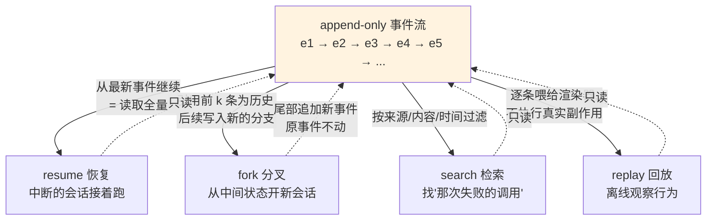
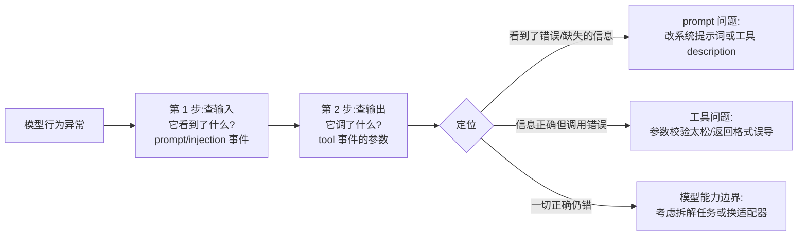

# 08 - 会话日志与可观测

> Agent 的行为不可复现,往往是因为没人知道它"当时看到了什么"。dsh 用一份 append-only 的事件流回答这个问题:系统提示词、思维链、每一次工具调用的参数与结果、子 Agent 调度、上下文注入——全部按时间线落盘。恢复、分叉、检索、回放共享同一份数据;headless 模式让这套审计能力直接进入 CI。本章从设计哲学讲到自建观测插件。

前置阅读:[[deepseek-harness/3实战开发/06-依赖驱动与热重载|依赖驱动与热重载]]
基础理论:[[deepseek-harness/2架构/03-服务与依赖注入|服务与依赖注入]]

---

## 1. append-only 设计哲学

### 1.1 为什么只追加、不改写

会话日志的第一戒律:**事件一旦写入,永不修改**。所有操作都是往流上追加新事件。这个约束初看笨拙,实则是整个可观测体系的地基,因为三类核心需求都要求"不可变的事实源":

| 需求 | 若允许改写会发生什么 |
| --- | --- |
| 审计 | "它到底看到了哪版系统提示词"无法回答,证据被污染 |
| 复现 | 重放时输入已非当时的输入,bug 无法重现 |
| 分叉 fork | 从中间状态分出新会话时,历史必须原样保留 |

### 1.2 与数据库 WAL、区块链账本的思想同构

这个设计不是 dsh 独创,它是计算机科学里反复出现的同一模式:

| 系统 | 追加单元 | 追加带来什么 |
| --- | --- | --- |
| 数据库 WAL(Write-Ahead Log) | 一条变更记录 | 崩溃恢复 = 重放日志;主从复制 = 传输日志 |
| 区块链账本 | 一笔交易 | 可验证的历史:任何篡改都会破坏哈希链 |
| 事件溯源(Event Sourcing) | 一个领域事件 | 当前状态 = 折叠全部事件;审计天然免费 |
| **dsh 会话日志** | 一条会话事件 | resume/fork/replay/检索全部读同一份流 |

共同思想:**把"当前状态"视为日志的派生物,而不是把日志视为状态的附属品**。状态可以被重建、可以出错,但日志是唯一的真相(source of truth)。dsh 里,"会话的当前上下文窗口"只是对事件流做了一次投影——投影随时可以丢弃重算,事件流本身不动。

### 1.3 append-only 的工程红利

```text
追加写        → 顺序 IO,落盘便宜,不怕并发冲突(只增不改无锁争用)
不可变事实    → 审计可信,复现可靠
全量历史在手  → fork 只是"引用到第 N 条为止",零拷贝
新功能免改造  → 回放调试、成本分析、评测集生成……都是流的消费者
```

### 1.4 两个常见误解

| 误解 | 澄清 |
| --- | --- |
| "append-only 就是把对话记录存成文件" | 对话记录只是投影;事件流记录的是**过程**(含思维链/注入等中间态),两者粒度完全不同 |
| "改写历史更省空间" | 省下的存储远抵不上损失的审计/复现/fork 能力;且压缩应发生在归档层,不在写入语义层 |

---

## 2. 日志里有什么

一次 Agent 会话中发生的每类关键动作,都以结构化事件的形式进入同一条时间线:

| 事件类别 | 记录内容 | 排查时的用途 |
| --- | --- | --- |
| 系统提示词 | 完整的 system prompt 内容与版本 | 模型行为怪异时先查它"人设"是什么 |
| 思维链 | 模型推理过程的文本流 | 理解模型为什么做出某个决策 |
| 工具调用 | 工具名 + 入参(模型生成的 args) | 定位"参数填错"类问题 |
| 工具结果 | execute 的 canonical 返回值(含错误) | 判断是工具坏了还是模型误读 |
| 子 Agent 调度 | 派生了哪个子任务、父子对应关系 | 分析多 Agent 协作的调用树 |
| 上下文注入 | 本轮实际塞进上下文的额外内容(RAG 片段等) | 检查检索质量、上下文污染 |

注意两点:

1. **参数与结果都记**:只有调用没有结果,你分不清"工具失败了"还是"工具返回了但模型理解错了";
2. **按来源标记**:每条事件带有来源信息(prompt / model / tool / subagent / injection),这是下一节 Trajectory 视图过滤的基础。

### 2.1 事件的形态:示意性 JSONL

落盘格式上,会话日志表现为按行追加的结构化记录。下面是教学用的形态示意(字段名以实际版本为准),帮助你建立直觉:

```jsonl
{"seq": 1, "type": "system_prompt", "ts": 1756000000000,
 "content": "你是 dsh 助手……可用工具:git_log_reader、read_text_file"}
{"seq": 2, "type": "injection", "ts": 1756000001000,
 "source": "rag-plugin", "content": "相关文档片段:……"}
{"seq": 3, "type": "assistant_thinking", "ts": 1756000005000,
 "content": "用户想看提交历史,我应该先调 git_log_reader……"}
{"seq": 4, "type": "tool_call", "ts": 1756000006000,
 "tool": "git_log_reader",
 "args": {"repoPath": "/home/a/RootStack", "maxCount": 5}}
{"seq": 5, "type": "tool_result", "ts": 1756000007000,
 "tool": "git_log_reader",
 "result": {"ok": true, "total": 5, "formatted": "最近 5 条提交:……"}}
{"seq": 6, "type": "subagent_spawn", "ts": 1756000009000,
 "parentId": "root", "childId": "sub-1", "task": "统计提交作者分布"}
```

从这份示意能读出设计的四个关键性质:

- **seq 单调递增**:时间线有全序,回放时按 seq 重排即可;
- **type 即来源**:过滤视图的物理基础;
- **call 与 result 成对**:中间隔着真实执行时间,性能分析也做得到;
- **父子关系显式建模**(parentId/childId):多 Agent 调用树可以从平铺的事件流中重建出来。

---

## 3. Trajectory 视图使用

Trajectory(轨迹)视图是日志的浏览器:以时间线形式展示一次会话的全部事件,支持按来源过滤。

### 3.1 过滤维度速查

| 过滤来源 | 你会看到 | 典型提问 |
| --- | --- | --- |
| prompt | 系统提示词全文及其变更 | "它的人设/规则到底写的是什么?" |
| model(思维链) | 每轮推理文本 | "它为什么绕开了这个工具?" |
| tool(call+result) | 调用参数与返回值成对展示 | "第 3 次调用为什么传了空路径?" |
| subagent | 派生关系树与各子任务状态 | "哪个子 Agent 在空转?" |
| injection | 每轮被塞进上下文的内容 | "是不是 RAG 片段把它带偏了?" |

### 3.2 三个典型排查场景

```text
场景一:模型答非所问
  → 过滤 [prompt] 查看:系统提示词是否被某插件改写过?
  → 过滤 [injection] 查看:是不是有插件注入了干扰性内容?

场景二:工具调用频繁失败
  → 过滤 [tool] 查看:连续看同一工具的入参,
    发现模型总把相对路径当绝对路径传 → 是 description 写得不清

场景三:多 Agent 任务卡死
  → 过滤 [subagent] 查看:父 Agent 是否反复派生同一个子任务?
```

视图本身不产生数据,它只是事件流的一个查询界面——这保证了你在 UI 里看到的和落盘的、和回放用的,是同一份事实。

---

## 4. 四种操作共享同一份事件流

resume(恢复)、fork(分叉)、检索、回放四种能力,在实现上是同一份数据上的四个不同读取策略:



要点:

- **resume** = 读全量流,恢复出中断时刻的状态继续;
- **fork** = 在流的某个位置分岔:前缀共享,后缀各自追加。因为历史不可变,分叉不需要深拷贝任何东西;
- **检索** = 对流的索引化查询;
- **回放** = 把流重新走一遍给"观察者"(人或测试断言)看,不触发真实的工具副作用。

一个存储层,四种产品能力——这就是 append-only 架构最诱人的地方:功能的边际成本趋近于零。

### 4.1 fork 的实操价值:假设检验

fork 不只是产品功能,它是调试利器。当你在事件流的第 k 条处发现可疑决策("它为什么在这里选了工具 A 而不是 B"),可以:

```text
1. 从第 k 条 fork 出新会话(前 k-1 条为共享历史)
2. 只修改一个变量:比如换一版工具 description、注入一段补充说明
3. 让两个分支各自跑完,对比后续轨迹
```

这就是 Agent 领域的 A/B 测试:**同一份历史 + 单变量差异 + 双分支对照**。没有 append-only 日志,这个实验根本无法设计——你没法让会话"从中间重来一遍"。

---

## 5. 基于日志的调试工作流

当模型行为不符合预期,按固定的三步收敛:



三步法的价值在于**排除法的纪律性**:绝大多数"AI 不听话"的抱怨止步于第 1 步——模型看到的上下文和你以为的完全不同。没有日志,这一步只能靠猜。

### 5.1 完整案例:一次"模型拒绝调用工具"的排查

现象:用户问"看下 RootStack 仓库最近的提交",模型却只用文字回答"我无法访问您的文件系统"。

```text
第 1 步:查输入(Trajectory 过滤 prompt + injection)
  发现:系统提示词正常,工具清单里有 git_log_reader;
  但 injection 事件里,某插件注入了一段
  "当前处于离线演示模式,禁止访问外部资源"。
  → 模型遵守了后注入的指令,压过了默认行为。
  定性:不是模型问题,是上下文污染。

第 2 步(假设第 1 步没发现异常):查输出(过滤 tool)
  若发现它调了 git_log_reader 且参数 repoPath 是相对路径,
  工具返回 ok:false("目录不存在")
  → 对照 description:"必须是绝对路径"——写了,但不够醒目;
  定性:prompt/描述问题,把参数 description 改成
  "绝对路径,以 / 开头,例如 /home/user/project"再验证。

第 3 步(前两步都正常):才考虑模型能力边界,
  考虑拆解任务、换适配器或降低任务复杂度。
```

修复后再用 fork 从原会话分叉重放一遍对照——确认新 description 解决了问题且没有引入新偏差。整个闭环没有一行代码是"盲改"的。

实战口诀:**先问它看见了什么,再问它做了什么,最后才怀疑它蠢**。

---

## 6. 自建观测插件:工具调用频次统计

在动手前,先明确观测插件的设计约束——它和业务插件有本质不同:

| 约束 | 原因 |
| --- | --- |
| 绝不阻塞主流程 | 观测是旁路,写盘失败不能拖慢甚至弄挂一次工具调用 |
| 绝不修改事件 | 只读消费者;要加工就另起新文件(append-only 同样适用于你自己的输出) |
| 资源全部经 ctx 注册 | 自己就是被热重载/卸载的对象,先管好自己([[deepseek-harness/3实战开发/05-生命周期与自动清理|生命周期与自动清理]]) |
| 失败静默降级 | 观测组件自身报错只打一行日志,绝不向上抛 |

监听工具调用事件,把统计数据写成 JSONL 文件——这是一个完整可用的自定义观测插件。

创建 `scratch-plugin/src/tool-metrics.ts`:

```typescript
// tool-metrics.ts —— 观测插件:统计各工具调用频次,JSONL 落盘
import type Context from '@deepseek-ai/cordis'
import { appendFile, mkdir } from 'node:fs/promises'

export const name = 'tool-metrics'

// 内存计数器:工具名 → 调用次数
const counters = new Map<string, number>()

// JSONL 输出文件路径(可用环境变量覆盖)
const OUT_DIR = process.env.METRICS_DIR ?? '/tmp/dsh-metrics'
const OUT_FILE = `${OUT_DIR}/tool-calls.jsonl`

// 统一写一行 JSONL:一条记录 = 一次工具调用事件
async function record(toolName: string, ok: boolean): Promise<void> {
  // 内存计数同步更新,供周期汇总使用
  counters.set(toolName, (counters.get(toolName) ?? 0) + 1)

  const line = JSON.stringify({
    ts: Date.now(),            // 事件发生时间(Unix 毫秒)
    tool: toolName,            // 工具名
    ok,                        // 本次调用成功与否
    totalSoFar: counters.get(toolName),  // 截至该次调用的累计次数
  })
  try {
    await mkdir(OUT_DIR, { recursive: true })   // 目录不存在则建
    await appendFile(OUT_FILE, line + '\n')     // append-only:只追加不改写!
  } catch (e) {
    // 观测组件自身绝不能拖垮主流程:失败仅打日志
    console.error('[metrics] 写入失败', e)
  }
}

export function apply(ctx: Context) {
  // 监听工具调用事件:dsh 在每次工具执行前后广播
  // (事件名以运行版本的类型定义为准,这里演示通用模式)
  ctx.on('tool-call' as any, (payload: any) => {
    // payload 结构示例:{ name: 'git_log_reader', result: {...} }
    const toolName = payload?.name ?? 'unknown'
    const failed =
      payload?.result && typeof payload.result === 'object'
        ? payload.result.ok === false
        : false
    // fire-and-forget:不 await,避免阻塞主调用链路
    void record(toolName, !failed)
  })

  // 周期性打印汇总表,便于开发时肉眼观察
  ctx.setInterval(() => {
    if (counters.size === 0) return
    console.log('[metrics] 当前工具调用频次:')
    for (const [name, count] of [...counters.entries()].sort(
      (a, b) => b[1] - a[1],          // 按次数降序
    )) {
      console.log(`  ${name}: ${count}`)
    }
  }, 15_000)

  ctx.on('ready', () => console.log('[metrics] 观测插件就绪,输出:', OUT_FILE))
}
```

加入 `cordis.yml` 并启动后,跑几轮对话即可得到:

```jsonl
{"ts":1756000000000,"tool":"git_log_reader","ok":true,"totalSoFar":1}
{"ts":1756000012000,"tool":"read_text_file","ok":true,"totalSoFar":1}
{"ts":1756000031000,"tool":"git_log_reader","ok":false,"totalSoFar":2}
```

这份 JSONL 可以直接喂给任何分析管道:`jq` 快速聚合(`jq -s 'group_by(.tool)'`)、导入表格、CI 中做回归对比。注意实现自觉遵守了本章主题:**只追加、不改写**,以及资源经 ctx 注册(setInterval 自动清理,见 [[deepseek-harness/3实战开发/05-生命周期与自动清理|生命周期与自动清理]])。

---

## 7. headless + 日志:CI 中的 Agent 审计组合

### 7.1 headless 模式回顾

```bash
# 一次性运行:跑完打印答案即退出,适合脚本与 CI
dsh --profile headless "总结 /home/a/RootStack 最近 3 条提交"
```

headless 的特性使它与 CI 天作之合:无需交互终端、进程随任务结束退出、退出码可用于判定成败。

### 7.2 组合用法:每次 CI 都留下审计记录

```yaml
# .github/workflows/agent-task.yml 片段(示意)
jobs:
  agent-audit:
    runs-on: ubuntu-latest
    steps:
      - uses: actions/checkout@v4
      # 跑一个 Agent 任务:比如自动检查文档与代码的一致性
      - run: |
          dsh --profile headless \
            "检查 docs/ 下所有章节链接是否有效,输出失效列表"
      # 关键一步:把本次会话的事件流作为构建产物归档
      - uses: actions/upload-artifact@v4
        with:
          name: session-log
          path: ~/.dsh/sessions/
```

这个组合提供的能力:

1. **留存审计记录**:CI 里 Agent 到底看到了什么提示词、调了什么工具、拿到了什么结果,事后可查——出了"为什么这次检查漏了"的问题,答案就在 artifact 里;
2. **可回放的失败诊断**:任务失败时不必重跑,直接回放事件流定位;
3. **趋势数据积累**:配合上一节的 metrics 插件,长期收集工具调用分布,指导工具优化优先级。

CI 场景的额外注意点:

| 事项 | 建议 |
| --- | --- |
| 会话目录隔离 | 每个 job 用独立的 METRICS_DIR/会话目录,避免并发串写 |
| 失败也归档 | upload-artifact 加 `if: always()`,失败的轨迹往往更有排查价值 |
| 密钥脱敏 | CI 环境变量里的凭据可能被工具结果带回事件流,execute 层先脱敏 |
| 时长控制 | headless 配合外层 timeout,防止模型陷入循环拖垮 runner |

原则一句话:**交互式会话靠 web UI,无人值守任务靠 headless,两者的日志语义完全一致**——所以本地调试出的结论可以直接迁移到 CI 场景。

### 7.3 日志驱动的衍生玩法

同一份事件流还能喂出更多下游能力,这里列三个方向作为延伸阅读的地图:

| 衍生能力 | 做法 | 价值 |
| --- | --- | --- |
| 评测集生成 | 从历史 tool_call/result 对中筛选高质量样本 | 新版本工具上线前,用真实历史做回归评测 |
| 成本观测 | 统计每会话的思维链与上下文长度分布 | 定位"哪个环节在烧 token",指导 prompt 瘦身 |
| 失败模式聚类 | 对 ok:false 的 tool_result 做关键词归组 | 发现工具 description 的系统性缺陷 |

它们的共同点:全部是事件流的**只读消费者**,不需要改动 dsh 本体一行代码。这正是第 1 节"新功能免改造"红利的具体兑现。

---

## 8. 隐私与留存:append-only 的另一面

不可变历史是资产,也可能成为负担。生产化使用前考虑三点:

1. **敏感信息入流**:系统提示词里若有密钥、工具结果里有用户数据,它们都会永久留在日志里。对策:在工具的 execute 层就做脱敏(返回值即 canonical 层,脱敏一次全链路受益);
2. **留存策略**:按会话设置过期清理,而不是无限堆积——清理的单位是**整个会话的事件文件**,不违反"会话内不改写"的戒律;
3. **共享礼仪**:把事件流贴到 issue/Discussions 求助时,先检查其中是否含未脱敏内容。

原则:**append-only 保证的是"写入后不被篡改",不豁免你"写入前的审慎"**。

---

## 9. 本章小结

- append-only 是审计/复现/fork 三类需求的公共前提,与 WAL、区块链账本同构:"状态是日志的派生物,日志才是真相";
- 日志覆盖 prompt/思维链/工具调用与结果/子 Agent 调度/上下文注入,全部带来源标记、按时间线落盘;
- Trajectory 视图 = 事件流的查询界面,按来源过滤是最常用的排查入口;
- resume/fork/检索/回放是同一份流上的四种读取策略,fork 靠"前缀共享+尾部追加"实现零拷贝;
- 调试三步法:查输入→查输出→再定性,先排除信息问题再怀疑模型;fork 分支是单变量假设检验的标准工具;
- 自建观测插件的模板已给出:监听事件、JSONL 追加、fire-and-forget、绝不拖垮主流程;
- headless + 日志归档让 CI 中的每次 Agent 运行都可审计、可回放;
- 隐私与留存:脱敏做在 execute 层,过期清理以整会话为单位——写入前审慎,写入后不可变;
- 事件的形态(seq/type/call-result 成对/父子建模)决定了过滤、回放、调用树重建等一切上层能力。

收尾一张自查表:

| 自查项 | 通过标准 |
| --- | --- |
| 观测代码是否全部旁路? | fire-and-forget 写盘,失败仅打日志不上抛 |
| 观测输出是否 append-only? | 只追加不改写,与主日志同一纪律 |
| 排查是否先查输入再查输出? | Trajectory 过滤 prompt/injection 先于 tool |
| CI 任务是否留档? | headless 运行 + artifact 归档 + if: always() |

Agent 的行为已经完全可观测了。下一章解决最后一个问题:怎么把你的插件交到别人手里——[[deepseek-harness/3实战开发/09-打包发布与社区协作|打包发布与社区协作]]。
