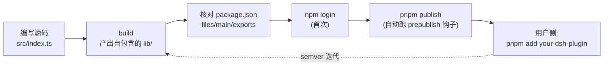

# 09 - 打包发布与社区协作

> 写给自己用的插件,完成度到"能跑"即可;要交到别人手里,标准陡然升高:装得快、装得动、找得到、坏不了。本章覆盖 dsh 插件的三种分发方式的选型与完整流程、GitHub 分发的 prepare 自包含要求、发布前检查清单、社区协作礼仪,最后把第三章的 git-log-reader 完整发布为 npm 包。

前置阅读:[[deepseek-harness/3实战开发/03-defineTool工具开发|defineTool 工具开发]]
基础理论:[[deepseek-harness/2架构/03-服务与依赖注入|服务与依赖注入]]

---

## 1. 三种分发方式决策表

| 方式 | 命令 | 用户侧安装 | 优点 | 局限 | 适用场景 |
| --- | --- | --- | --- | --- | --- |
| **npm 发布**(推荐) | `pnpm publish` | 包名直接安装 | 即装即用、版本管理、生态发现 | 需账号;公开仓库 | 面向所有用户的正式插件 |
| **tarball 私有交付** | `pnpm pack` 产出 .tgz | 从文件路径安装 | 无需注册中心;内网可传 | 手工分发,无自动更新 | 企业内网、付费交付、临时给同事试用 |
| **GitHub 源码分发** | `github:user/repo` 安装 | 直接拉源码构建 | 开源协作友好;免发 npm | 用户需 allowBuilds 授权;依赖用户环境有完整工具链 | 开源项目、快速迭代期、收 issue/PR |

决策路径:默认走 npm;进不了公共 registry(合规/私有代码)走 tarball;想在开源社区攒星标和贡献者,GitHub 直装作为补充渠道——三者并不互斥,npm 包通常同时挂 GitHub 仓库。

---

## 2. npm 发布完整流程

### 2.1 流程总览



### 2.2 关键配置:package.json

```jsonc
{
  "name": "dsh-git-log-reader",
  "version": "0.1.0",
  "description": "git log reading tool plugin for dsh",
  "main": "./lib/index.js",          // CommonJS 入口(如双格式则配 exports)
  "types": "./lib/index.d.ts",       // 类型入口:声明合并靠它传播
  "files": [
    "lib",                            // 只发布构建产物,src 不必随包
    "README.md"
  ],
  "scripts": {
    "build": "tsdown src/index.ts --format esm --out-dir lib",
    "prepublishOnly": "pnpm build"    // 发布前强制重新构建,防止产物过期
  },
  "peerDependencies": {
    // 宿主框架由用户的 dsh 环境提供,不要打包进去
  },
  "keywords": ["dsh-plugin"]         // 见第 6 节 discoverability
}
```

三条铁律:

1. **`files` 收口发布面**:只带 lib 与 README,别把 src/tests/node_modules 发上去;
2. **宿主依赖用 peerDependencies**:你的插件运行在用户的 dsh 进程里,Cordis 本体永远来自宿主;
3. **prepublishOnly 兜底**:保证每次发布的 lib 都精确对应本次源码。

### 2.3 版本管理 semver 速记

| 版本段 | 何时升 | 例子 |
| --- | --- | --- |
| patch(0.1.**0**→0.1.1) | bug 修复,不改任何接口 | 工具 description 措辞修正 |
| minor(0.**1**.x→0.2.0) | 新增能力,向后兼容 | 新增一个可选参数 |
| major(**0**.1.x→1.0.0 / 1.x→2.0.0) | 破坏性变更 | 改了 canonical schema 字段名 |

developer preview 阶段(0.x)惯例放宽:minor 也可能含破坏性变更,但必须在 README 里声明。

---

## 3. GitHub 分发:prepare 脚本与 allowBuilds

### 3.1 为什么 GitHub 分发有额外要求

npm 包自带预构建好的 lib/;而 `github:user/repo` 是**拉源码**,包管理器在用户机器上执行 install 时需要现场构建。这要求两件事:

1. **prepare 脚本必须自包含**:不能假设用户处在你的 monorepo 里、不能引用 workspace 里的其他包。最典型的自包含写法是直接转译:

```jsonc
{
  "scripts": {
    // tsdown 单命令完成转译:不依赖 workspace 的内部包、
    // 不依赖特殊 tsconfig 链、一条命令从 src 得到可用的 lib/
    "prepare": "tsdown src/index.ts --format esm --out-dir lib"
  }
}
```

自包含检查法:clone 你的仓库到一个全新目录,只执行 `pnpm install`,构建必须成功——任何"先去根目录跑点什么"的步骤都不合格。

2. **用户侧 allowBuilds 授权**:pnpm v10 出于安全考虑默认不执行依赖包的生命周期脚本(prepare 就在其中)。使用 GitHub 分发的用户需要在 profile 对应工作区的 `pnpm-workspace.yaml` 中显式放行:

```yaml
# 用户侧 pnpm-workspace.yaml(dsh profile 所在目录)
allowBuilds: true
```

没有这一步,症状是:安装看似成功,但 lib/ 目录不存在,加载插件时报"找不到入口文件"。README 里务必写清这一步——这是 GitHub 渠道最高频的用户翻车点。

### 3.2 三种方式用户视角对照

```text
npm:      pnpm add dsh-git-log-reader            → 完成(lib 已在包里)
tarball:  pnpm add ./dsh-git-log-reader-0.1.0.tgz → 完成
GitHub:   pnpm add github:user/dsh-git-log-reader → 拉源码 → prepare 构建
              ↑ 此步要求 pnpm≥10 且 allowBuilds:true
```

---

## 4. dsh.bundle 声明回顾

回顾 [[deepseek-harness/3实战开发/02-第一个插件完整流程|第一个插件]] 讲过的机制:package.json 中必须有 `dsh.bundle` 字段,dsh 才会把这个包识别为插件并激活。

```jsonc
{
  "dsh.bundle": {
    // 声明本包向 dsh 提供的插件入口
  }
}
```

没有它会发生什么:**包安装成功、文件齐全,但 dsh 视而不见**——这是"装了却不激活"的唯一原因,排查时第一步就检查这个字段。它属于第 4 节检查清单的固定项。

### 4.1 "装了不激活"排查路径

用户报告插件不工作时,按此顺序排查(命中率从高到低):

| 步骤 | 检查 | 命令/方法 |
| --- | --- | --- |
| 1 | dsh.bundle 是否存在 | `node -e "console.log(require('<pkg>/package.json').dsh.bundle)"` |
| 2 | 入口文件是否真实存在 | `ls node_modules/<pkg>/lib/` |
| 3 | main/types 路径是否指对 | 打开包内 package.json 核对 |
| 4 | GitHub 渠道的 prepare 是否执行过 | lib/ 缺失 + 用户没配 allowBuilds → 就是它 |
| 5 | cordis.yml/patch 是否真的引用了该插件 | 对照加载日志确认 |

前两步覆盖了绝大多数案例:bundle 字段漏发、构建产物漏进 files。

---

## 5. 发布前检查清单

每次 publish 前过一遍:

| # | 检查项 | 通过标准 |
| --- | --- | --- |
| 1 | README 安装说明 | 含三种渠道中你支持的每一种的完整命令;GitHub 渠道须含 allowBuilds 说明 |
| 2 | dsh.bundle 声明 | 字段存在且指向正确入口 |
| 3 | 构建产物或 prepare | npm 包:lib/ 在 files 里且已构建;GitHub 包:prepare 自包含可用 |
| 4 | peerDependencies 正确 | 宿主框架声明为 peer,未误打进 dependencies |
| 5 | 类型声明可达 | types 字段指向 .d.ts;声明合并文件被 include |
| 6 | 版本号符合 semver | 变更性质与版本段匹配 |
| 7 | topic 标签 | 仓库加了 dsh-plugin 等 topic(见第 6 节) |
| 8 | 干净环境冒烟测试 | 全新目录按 README 步骤安装并激活成功 |

第 8 条最容易被跳过也最能救命:你自己机器上的"能用"往往带着全局状态的红利,新用户什么都没有。

---

## 6. 社区礼仪

### 6.1 Discussions 发帖模板

dsh 社区的讨论主阵地是 **GitHub Discussions**。发帖时套用模板能显著提高回复率:

```markdown
### 标题:[Plugin] dsh-git-log-reader v0.1.0 发布

**一句话**:读取任意 Git 仓库提交历史的工具插件。

**安装**:
pnpm add dsh-git-log-reader

**功能**:git_log_reader 工具,支持 repoPath/maxCount 参数,
canonical 返回结构化结果。

**反馈渠道**:issue 或本帖回复。
```

要点:标题带 `[Plugin]` 前缀便于检索;安装命令可直接复制;说清反馈去哪。

### 6.2 topic 提高 discoverability

给你的 GitHub 仓库加上 **`dsh-plugin`** topic(仓库页 About 齿轮图标处)。社区通过 topic 索引发现插件——不加 topic 的仓库等于在地图上没标注的店。常用组合:`dsh-plugin` + `deepseek` + 功能域标签(`git`/`tools`)。

### 6.3 issue 处理

| 原则 | 做法 |
| --- | --- |
| 快速分流 | 无法复现的先要日志:请用户附上会话事件流(见 [[deepseek-harness/3实战开发/08-会话日志与可观测|会话日志与可观测]]) |
| 最小复现 | 给出"新目录 + 最小 cordis.yml"的复现指引模板 |
| 关闭留痕 | 即使 wontfix 也说明原因,Discussion 归档可被后人搜到 |

---

## 7. 版本迭代与破坏性变更沟通

### 7.1 语义化版本在插件语境下的具体含义

dsh 插件的"公共 API"不只是导出的函数,还包括几个容易被忽略的契约面:

| 契约面 | 破坏性变更举例 | 应升版本 |
| --- | --- | --- |
| 工具 canonical schema | 删除/改名 result 字段、改变字段类型 | major(0.x 期 minor) |
| 参数 schema | 必填参数新增、枚举收窄 | major |
| 服务注册名 | 'cache' 改成 'myorg.cache' | major |
| Context 声明合并的类型形状 | 接口方法签名变化 | major |
| Config schema | 配置项改名或删除 | major |
| description/文档措辞 | 仅优化提示效果 | patch |

规律:**凡是"模型或消费者可感知"的变化都是 API 变化**——canonical schema 是给程序和模型读的契约,description 是给模型读的 prompt,它们比函数签名更"公共"。

### 7.2 developer preview 期的沟通义务

dsh 目前处于 developer preview 期,**API 不稳定是既定事实**。作为插件作者,你的职责是把这种不确定性显式地传达给用户:

README 兼容范围声明的推荐写法:

```markdown
## 兼容性

- 本插件基于 dsh developer preview API 开发,
  dsh 后续版本可能存在破坏性变更;
- 当前验证过的组合:dsh@preview.x + node >= 22;
- 本插件自身处于 0.x 阶段:minor 升级可能包含 breaking change,
  升级前请阅读 CHANGELOG。
```

破坏性变更发布时的三件套:

1. **CHANGELOG 条目**:写清"改了什么 + 用户该怎么迁移"(旧写法 → 新写法的对照);
2. **major/minor 升版本**:0.x 期破坏性变更至少升 minor,让 semver range 能挡住无感知升级;
3. **Discussions 公告**:重大变更单独发帖,订阅者第一时间可见。

原则:**API 不稳定不是省略沟通的理由,恰恰是加强沟通的理由**。

---

## 8. 实战:git-log-reader 发布为 npm 包全命令流

把 [[deepseek-harness/3实战开发/03-defineTool工具开发|defineTool 工具开发]] 的 git-log-reader 打包发布。以下命令流从零开始,可直接照抄。

### 8.1 初始化独立包结构

```bash
# 创建独立的包目录(脱离 scratch 环境)
mkdir dsh-git-log-reader && cd dsh-git-log-reader
pnpm init
# 安装构建与类型依赖
pnpm add -D tsdown typescript @types/node
```

### 8.2 整理源码

```bash
mkdir src
# 把工具与插件入口合并整理为单入口:
# src/index.ts 内含 git-log-reader 工具定义 + apply 注册函数
```

创建 `src/index.ts`(核心逻辑沿用第三章实现):

```typescript
// index.ts —— dsh-git-log-reader 包入口
// 导出工具定义与插件装配函数,供 dsh 加载
import { defineTool } from '@deepseek-ai/dsh-tools'
import { execFile } from 'node:child_process'
import { promisify } from 'node:util'
import type Context from '@deepseek-ai/cordis'

const execFileAsync = promisify(execFile)

export const name = 'git-log-reader'

// 工具定义:与实战篇第三章一致,此处为发布版整理
export const gitLogReader = defineTool({
  name: 'git_log_reader',
  description:
    '读取指定 Git 仓库的最近提交历史并格式化返回。' +
    '当用户询问某个仓库的提交记录或最近更新时使用;' +
    '查看具体代码差异时应改用 diff 类工具。',
  parameters: {
    repoPath: {
      type: 'string',
      required: true,
      description: 'Git 仓库的绝对路径',
    },
    maxCount: {
      type: 'number',
      required: false,
      description: '最多返回的提交条数,默认 10,上限 100',
    },
  },
  output: {
    schema: {
      ok: { type: 'boolean' },
      formatted: { type: 'string' },
      total: { type: 'number' },
      error: { type: 'string' },
    },
    render: (result: any) => ({
      type: 'text',
      text: result.ok ? result.formatted : `git log 失败:${result.error}`,
    }),
  },
  execute: async ({ repoPath, maxCount }: any) => {
    const limit = Math.min(Math.max(maxCount ?? 10, 1), 100)
    try {
      const { stdout } = await execFileAsync(
        'git',
        ['-C', repoPath, 'log', `--max-count=${limit}`,
         '--pretty=format:%h | %an | %ar | %s'],
        { timeout: 10_000 },
      )
      const lines = stdout.split('\n').filter(Boolean)
      return {
        ok: true,
        formatted: `最近 ${lines.length} 条提交:\n${stdout}`,
        total: lines.length,
        error: '',
      }
    } catch {
      return { ok: false, formatted: '', total: 0,
               error: '目录不存在、不是 git 仓库或没有提交历史' }
    }
  },
})

export function apply(ctx: Context) {
  ctx.register(gitLogReader)
}
```

### 8.3 配置 package.json

```bash
# 用 pnpm pkg 快速写入关键字段
pnpm pkg set name=dsh-git-log-reader version=0.1.0
pnpm pkg set main=./lib/index.js types=./lib/index.d.ts
pnpm pkg set files[0]=lib files[1]=README.md
pnpm pkg set scripts.build="tsdown src/index.ts --format esm --out-dir lib"
pnpm pkg set scripts.prepublishOnly="pnpm build"
pnpm pkg set keywords[0]=dsh-plugin keywords[1]=deepseek keywords[2]=git
# dsh.bundle 声明:没有它装了也不激活!
pnpm pkg set dsh.bundle=true
```

### 8.4 构建与本地冒烟

```bash
pnpm build
ls lib/          # 应看到 index.js 与 index.d.ts

# 干净环境冒烟:另起目录,从 tarball 安装验证
pnpm pack                          # 产出 dsh-git-log-reader-0.1.0.tgz
mkdir /tmp/opencode/smoke && cd /tmp/opencode/smoke
pnpm init
pnpm add /path/to/dsh-git-log-reader-0.1.0.tgz
node -e "console.log(require('dsh-git-log-reader/package.json').dsh.bundle)"
# 输出非 undefined 即 bundle 声明随包发布成功
```

### 8.5 发布

```bash
# 首次需要登录(npmjs.com 注册账号)
npm login

# 发布(publish 会自动触发 prepublishOnly → 重新 build)
pnpm publish --access public

# 验证:npm 上可见
npm view dsh-git-log-reader
```

### 8.6 后续迭代示例

```bash
# 修了个 bug → patch 版本
pnpm version patch     # 0.1.0 → 0.1.1
pnpm publish --access public

# 新增可选参数 → minor
pnpm version minor     # 0.1.x → 0.2.0
pnpm publish --access public
```

同时把仓库推上 GitHub 并加 `dsh-plugin` topic、在 Discussions 按 6.1 节模板发帖——一次发布,三个渠道全部点亮。

---

## 9. 本章小结

- 三种分发的选择:默认 npm;私有走 tarball(`pnpm pack`);开源协作用 GitHub 源码直装;
- npm 发布链路:build 产 lib → `files` 收口 → prepublishOnly 兜底 → `pnpm publish`;版本遵循 semver;
- GitHub 分发的两个前提:prepare 脚本自包含(如 `tsdown src/index.ts --format esm --out-dir lib`)、用户侧 pnpm≥10 且 profile 的 pnpm-workspace.yaml 写入 `allowBuilds: true`;
- `dsh.bundle` 是激活开关:缺失的症状是"装了但 dsh 视而不见";
- 发布八项检查清单,其中"干净环境冒烟"最易跳过最能救命;
- 社区三件事:Discussions 用模板发帖、仓库挂 `dsh-plugin` topic、issue 附事件流求最小复现;
- developer preview 期要在 README 显式声明兼容范围,破坏性变更走 CHANGELOG+升版+公告三件套;
- 实战完成了 git-log-reader 从源码到 npm 上线的全命令流。

至此实战开发篇六章全部完结:构建、插件、工具、配置、生命周期、依赖与热重载、服务与类型、可观测、发布——一套完整的插件工程闭环。接下来可以进入 [[deepseek-harness/4设计自己的Harness/01-何时需要自建Harness|设计自己的 Harness]],把这套体系的思想内化为你自己的轮子。
