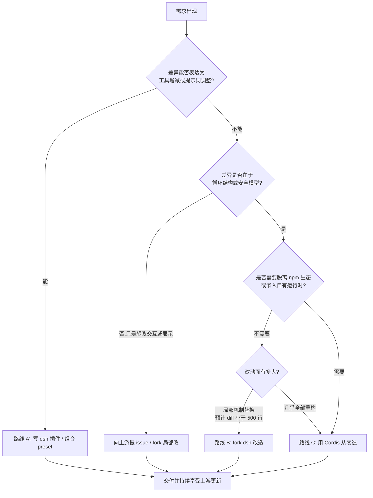
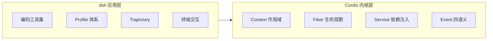

# 01 - 何时需要自建 Harness

> 本章是第四部分的开篇，也是全篇的"决策章"。写代码之前先回答一个更根本的问题：你真的需要自建 Harness 吗？dsh 已经提供了模型接入、工具系统、会话管理、Trajectory 等一整套能力，大多数场景下"用好 dsh"比"重造 dsh"是更优解。但确实存在一类场景——领域约束太特殊、产品形态太定制、或者你的目的本身就是研究和创造——这时候自建才是正道。本章给出完整的决策框架：先判断 dsh 够不够用，再对比三条自建路线的成本收益，最后用五个问题检验你是否准备好了。

前置阅读：[[deepseek-harness/2架构/01-Cordis内核原理|Cordis 内核原理]]
相关章节：[[deepseek-harness/1认知/03-Cordis论文精读|Cordis 论文精读]]、[[deepseek-harness/4设计自己的Harness/02-用Cordis搭建Agent框架|用 Cordis 搭建 Agent 框架]]

---

## 1. 先问：dsh 到底够不够用

在谈"自建"之前，必须诚实地盘点 dsh 的覆盖面。dsh 是一个面向**编码场景**的通用 Agent Harness，它开箱提供的能力包括：

| 能力 | dsh 的实现方式 | 定制成本 |
| --- | --- | --- |
| LLM 接入 | 统一适配器层 + StreamChunk 流式协议 | 低：换端点、换模型即可 |
| 工具系统 | `defineTool` 五字段 DSL + 权限分级 | 低：写插件注册新工具 |
| 会话管理 | 会话日志 append-only 事件流 | 中：格式稳定，可旁路消费 |
| 可观测 | Trajectory 记录与回放 | 中：有现成 UI |
| 配置体系 | Profile + Schemastery schema 校验 | 低：声明式配置 |
| 插件扩展 | Cordis bundle 加载、可逆副作用 | 低：这是它的本职 |
| 模型路由 | 多模型切换与适配器模式 | 中：新 provider 需写适配器 |

对应到三类典型需求，dsh 的答案分别是直接使用、写插件和组合 preset。逐个来看。

### 1.1 直接用：需求落在编码场景内

如果你的需求是"帮我写代码、跑命令、读仓库"，dsh 本体就是为此设计的，不需要任何开发。你要做的只是配好 Profile 和 API key。

这一档的判断标准很清晰：你描述需求时使用的词汇全部是"仓库、文件、命令行、测试"这类编码词汇，且对 Agent 行为的约束可以归结为提示词层面（"不要自动 commit"、"先跑测试再交付"）。凡是这样的需求，装好就用，别浪费时间。

### 1.2 写插件：能力缺口在"工具"层面

如果 dsh 缺的是某个具体能力——比如读取公司内部的 CI 状态、查询内部知识库、操作内部工单系统——正确的做法不是自建 Harness，而是写一个 dsh 插件：

```typescript
// 一个 dsh 插件就能把新工具注入现有生态,复用全部基础设施
import { Context } from 'cordis'
import { defineTool } from '@deepseek-ai/dsh-tools'

export function apply(ctx: Context) {
  ctx.plugin({
    inject: ['tools'],                    // 声明依赖工具注册中心
    apply(ctx) {
      // 注册的工具自动获得:dsh 的权限分级、审计记录、UI 展示
      ctx.tools.register(defineTool({
        name: 'query_ci_status',
        description: '查询内部 CI 流水线的最近一次构建状态。',
        parameters: { pipelineId: { type: 'string', description: '流水线 ID' } },
        execute: async ({ pipelineId }) => {
          const res = await fetch(`https://ci.internal/api/${pipelineId}`)
          return { status: 'success', data: await res.json() }
        },
      }))
    },
  }))
}
```

插件路线的收益是巨大的：权限门禁、审计日志、UI 展示、配置管理全部白拿，你只写了业务逻辑。而且 Cordis 保证这个插件的注册是**可逆副作用**——卸载时工具自动从注册表消失，不留残余。

插件路线能覆盖的场景比多数人想象的多得多。经验上，只要你的诉求能翻译成下面三种句式之一，就该留在插件层解决：

```text
1. "要是有一个能 XXX 的工具就好了"        → 写一个工具插件
2. "默认打开的那些工具我不需要/还缺几个"   → 写一个 bundle 组合 preset
3. "希望启动时预置某类上下文或提示词"      → 写一个注入初始消息的插件
```

### 1.3 组合 preset：缺口在"默认行为"层面

如果想改变的是 Agent 的默认人格、初始提示词、预装工具集——比如做一个"只做数据库迁移审查"的专业模式——用 preset/bundle 组合就够了。把工具集和系统提示词打包成一个 bundle，加载时整体挂载，卸载时整体回收。

preset 的本质是**配置数据而非代码**：一份声明告诉 dsh "加载哪些插件、传什么配置、以什么顺序"。它的定制深度止步于此——你不能用 preset 改变循环怎么转。

> **判断法则**：如果你想要的差异可以表达为"多了什么工具、少了什么工具、提示词怎么改"，留在 dsh 生态内解决；如果差异在于"Agent 循环本身怎么转、安全模型长什么样、日志记给谁看"，才进入自建讨论。

---

## 2. 决策树：一条路径走到黑

把上面的讨论压缩成一棵可执行的决策树：



沿着这棵树往下走，你会停在四个出口之一。注意树上有两个关键的岔路口提问：

- **"差异能否表达为工具增减？"** ——这是 A' 与其他所有路线的分界。九成需求在这里就该停下。
- **"是否需要脱离 npm 生态或嵌入自有运行时？"** ——这是 B 与 C 的分界。fork 的前提是宿主环境不变；一旦要换运行时或做深度嵌入，fork 的历史包袱就成了纯负债。

最右下的那个出口——"用 Cordis 从零造"——就是本部分余下六章的主线。但在踏上它之前，先把三条路线的账算清楚。

> 提示：把这棵决策树的走查过程记入设计文档。三个月后有人问"为什么不用现成的"，答案应当已经在纸上，而不是在某个已经离职的同事脑子里。

---

## 3. 三条自建路线：强度对比

### 3.1 路线总览表

| 维度 | 路线 A：bundle 定制 | 路线 B：fork dsh 改造 | 路线 C：Cordis 从零造 |
| --- | --- | --- | --- |
| 本质 | 在现有框架内扩展 | 复用骨架，替换器官 | 只保留内核思想，全部自写 |
| 代码量级 | 百行级 | 千行级（按 diff 计） | 万行起步，但最小可用可压到两百行 |
| 上手成本 | 天级 | 周级 | 周到月级 |
| 升级跟随 | 无痛，随上游更新 | 每次 rebase 都要解冲突 | 彻底独立，无升级负担也无升级红利 |
| 安全模型 | 继承 dsh | 改起来牵一发动全身 | 完全按需设计 |
| 可观测 | 继承 Trajectory | 受制于原事件流设计 | 从第一天起按自己需求定义 |
| 适用场景 | 补工具、改预设 | 替换单个子系统验证想法 | 领域 Harness、产品内嵌、研究原型 |
| 最大风险 | 无 | 与上游渐行渐远 | 低估了"看不见的子系统"的工作量 |

三个路线不是完全互斥的：很多团队的实际路径是 C 起步做原型，验证后部分子系统反过来给 dsh 提 PR；或者 B 起步改着改着发现 diff 失控，切到 C 重来。提前看清终局，可以少绕路。

### 3.2 路线 A 的边界

A 路线的天花板在于：所有机制都发生在 dsh 规定的扩展点上。你想加一个"每次工具执行前先查合规库"的逻辑，如果 dsh 恰好没有暴露这个拦截点，插件就无从下手。

识别自己是否撞上天花板的方法很简单：**当你发现自己需要的钩子在 dsh 源码里不存在时，A 就结束了。**此时你有两个选择——给上游提 feature request（如果需求足够通用），或者进入 B/C 路线（如果需求足够特殊）。

还有一个隐蔽信号值得留意：如果你为了绕过框架限制，开始在插件里大量 hack 内部 API（访问未导出的对象、monkey-patch 私有方法），这实际上已经是"没有源码的 fork"。维护成本比真 fork 更高，因为上游任何重构都可能无声地弄坏你。

### 3.3 路线 B 的陷阱

fork 听起来诱人——"我只要改一个函数"。但 Harness 的子系统高度耦合于事件流和会话日志格式，局部替换往往引发连锁修改。

```text
一个真实的连锁反应示例:
  目标: 让工具执行前多一道合规检查
  → 改工具执行器(1 处)
  → 发现执行器不知道当前会话主体,需透传会话上下文(2 处)
  → 会话结构变更导致 Trajectory 序列化不兼容(3 处)
  → 回放测试全挂,顺带修 UI 对旧格式的假设(5+ 处)
  最终 diff: 远超最初的"一处修改"
```

经验法则是：

```text
fork 的健康度指标:
  - diff 稳定在 500 行以内   → 健康,可持续跟随上游
  - diff 在 500 到 3000 行   → 危险区,每次升级都要评估
  - diff 超过 3000 行        → 你实际上已经在维护另一个项目,
                               却背着上游的历史包袱,不如走路线 C
```

B 路线的正当用法是**短期实验**：花一周验证某个机制改造的可行性，结论沉淀成文档或上游 PR，然后抛弃 fork。把 fork 当长期资产维护，几乎总是错误的。

### 3.4 路线 C 的真实成本

C 路线常被低估的地方不是核心循环——那只有百来行——而是环绕它的配套系统。很多人第一周就跑通了 loop，然后发现"让它在生产里活着"还有十倍的活儿。本部分的章节安排就是在偿还这份清单：

| 子系统 | 对应章节 | 从零造的最小工作量 | 容易漏掉的坑 |
| --- | --- | --- | --- |
| Agent 循环骨架 | [[deepseek-harness/4设计自己的Harness/02-用Cordis搭建Agent框架\|02 章]] | 约 200 行 | 循环上限与中断恢复 |
| 生产级工具系统 | [[deepseek-harness/4设计自己的Harness/03-设计工具注册系统\|03 章]] | 约 300 行 | 错误返回约定、超时控制 |
| 多模型路由 | [[deepseek-harness/4设计自己的Harness/04-设计多模型路由\|04 章]] | 约 250 行 | 流式协议统一、降级链 |
| 安全与审计 | [[deepseek-harness/4设计自己的Harness/05-设计安全审计机制\|05 章]] | 约 300 行 | 凭据不进日志、审批留痕 |
| 可观测与调试 | [[deepseek-harness/4设计自己的Harness/06-设计可观测与调试\|06 章]] | 约 250 行 | 事件粒度一旦定下很难改 |

好消息是：这些工作每一项都边界清晰、可以增量交付，而且 Cordis 内核替你承担了最难的部分——生命周期管理与依赖编排。你在每一章里写的 Service 都是一个独立 Cordis 插件，可以单独装卸、单独测试。

### 3.5 成本速算工作表

拿一张纸，按下面的模板填空，填完你对 C 路线的投入就有了数量级判断：

```text
目标场景: ____________________
工具清单数量: ____ 个(每个约 30-80 行)
自定义事件类型: ____ 种
需要对接的模型 provider: ____ 家(每家适配器约 100 行)
审批渠道: CLI / Webhook / IM(选一,约 150 行)
审计存储: JSONL 文件 / 数据库(前者 50 行,后者 300 行起)
维护人力: ____ 人 x ____ 周/月
预估总量: 核心约 1500 行 + 工具集 + 适配器
```

填完之后做一次压力测试：把维护人力砍半，这个项目还能活吗？如果答案是否定的，说明范围超出了一个兼职团队的真实承载力——回到问题一重新收窄目标场景，而不是硬着头皮开工。

### 3.6 三个反直觉的观察

大量团队实践沉淀下来的经验，与直觉相悖但反复被验证：

**观察一：自建项目死掉的头部原因不是技术失败，而是"目标场景漂移"。**开工三个月后需求变成了另一个东西，为原场景做的每个默认值都成了阻力。对策：把第 5 节的五问答案贴在仓库首页，任何偏离都要显式修订文档而不是悄悄改代码。

**观察二：fork 改造的团队最后往往羡慕从零造的团队，而从零造的团队偶尔羡慕用现成的。**唯一不后悔的是按决策树走到自己位置的团队。路线没有优劣，错位才有。定期（比如每个季度）重新走一遍第 2 节的决策树——你的需求、上游生态和团队能力都在变化，去年的正确答案未必是今年的。

**观察三：最小可用版本的真实规模总是比预估大一倍，但比想象中可行性强十倍。**"大一倍"来自配套系统，"强十倍"来自 Cordis 已经替你解决了生命周期与依赖这两个最深的坑——你只需要写业务形状的那部分代码。这也是本部分敢把主线押在 Cordis 上的根本原因：它把"从零造"的可行域扩大到了个人与小团队。

---

## 4. 什么情况必须自建：五类信号

以下五类场景中，前两类来自真实生产需求，后三类更多出现在团队内部平台和研究工作中。

### 4.1 合规审计是硬性需求

金融、医疗、政务场景对"每一步谁批准的、原始证据在哪"有法规级要求。dsh 的 Trajectory 面向开发者调试，而合规要求的是不可篡改留痕、审批链签名、保留期限管理。两者的差异是结构性的：

| 维度 | 开发者调试视角(dsh Trajectory) | 合规审计视角 |
| --- | --- | --- |
| 记录目的 | 方便人看懂过程 | 可作为追责证据 |
| 完整性 | 允许采样、允许丢失 | 全量、防篡改、有序号 |
| 审批记录 | 无此概念 | 每次危险操作必须留批准人与时间 |
| 保留策略 | 本地随意删 | 按法规保留数年 |

这类需求通常意味着审计子系统要从第一天起就是架构的一等公民——这正是自建的强信号之一，[[deepseek-harness/4设计自己的Harness/05-设计安全审计机制|05 章]]会展开等保要求的映射。

### 4.2 非 coding 场景

dsh 的工具集、提示词、安全模型都是围绕"操作代码仓库"设计的。换一个领域，这套默认值处处别扭：

- **运维 Bot**：要对接工单系统和变更窗口，"重启服务"是日常动作但必须审批，错误兜底要求"宁可不做不可做错"；
- **客服 Agent**：每个对外回复都要过敏感词与承诺红线，"工具"其实是知识库检索与工单流转，循环终止条件是用户满意而非任务完成；
- **数据分析 Agent**：要管住 SQL 只读账号，查询超时和大结果集截断是一等公民。

这些领域的"工具长什么样、危险怎么定义、错误怎么兜底"完全不同。套壳 dsh 意味着你要持续对抗它的默认值；从 Cordis 自建，意味着每个默认值都是你自己定的。

### 4.3 嵌入自家产品

当 Harness 是你产品的隐藏引擎而非终端工具时，情况又不一样了。你需要控制的是：

- **进程形态**：嵌入而非独立 CLI，可能跑在 Electron 主进程或服务端常驻进程里；
- **资源占用与启动延迟**：用户点一下按钮就要出结果，没有耐心等框架冷启动；
- **API 边界的设计权**：上层 UI 要订阅的事件、要调用的接口，得按产品的组件结构来设计，而不是反过来迁就 dsh 的终端交互假设。

此时基于 Cordis 自己组装反而更轻：Cordis 本身极小，你只需要装上产品需要的那些子系统。

### 4.4 研究实验新架构

想试验"计划-执行分离的双循环"、"多 Agent 辩论"、"工具调用前的自我批评"这类新结构？这些实验改变的是循环本身，fork 改不动那么深——因为循环代码和周边子系统的耦合点太多。从 Cordis 骨架起步，两周就能有一个可跑的原型，而且实验失败时整个原型可以随 Context 一键销毁，不给主工程留任何残骸。

### 4.5 想脱离 npm 生态

某些企业环境不允许引入完整依赖树，或目标运行时是非 Node 环境（边缘设备、嵌入式网关、公司自研运行时）。Cordis 本身零重依赖、纯 TypeScript，恰好是为这种约束准备的内核——它不关心你的 EventLoop 跑在 Node、Deno 还是某个 JS 引擎上。

选择这条理由时额外确认两件事：目标环境有稳定的异步原语（Promise 与微任务队列），以及你能接受为它维护一份独立的构建产物。如果两者都成立，移植成本主要是适配层而非框架层。

---

## 5. 自建前必须回答的五个问题

动第一行代码之前，把这五个问题写成文档。这份文档就是你未来三个月的需求基线，也是团队内沟通的共同语言。回答不了任何一个，就说明还没准备好。

### 问题一：目标场景是什么？

一句话说清"谁的什么任务，在什么约束下，达到什么标准算完成"：

```text
反例:"做一个智能助手。"                    → 无法推导任何设计决策
正例:"运维值班 Agent,处理 P2 以下告警的初步诊断,
     禁止任何写操作,诊断报告自动贴到工单,
     单次诊断预算 5 万 token 以内。"
```

这句话决定了后面所有的工具清单和安全级别。"禁止写操作"一句话就砍掉了半个权限系统的复杂度。

### 问题二：能力清单是什么？

列出 Agent 需要的全部工具，并给每一个标注风险等级。这张表就是你未来权限系统的需求来源：

```text
示例:运维 Bot 能力清单(节选)
  read_only    : query_metrics, search_runbook, tail_log
  network      : ping_host, query_cmdb
  write        : create_incident_ticket
  destructive  : restart_service, drain_node     <- 必须走人工审批
```

画这张表时问自己两个问题：有没有哪个工具可以合并或拆分？有没有哪个"必须存在"的工具其实可以用"只读替代方案 + 人工执行"绕过去？第二个问题的答案往往能大幅缩小破坏面。

### 问题三：安全模型是什么？

三个子问题：哪些操作绝对禁止；哪些操作需要人批准；出事后如何追责。安全模型必须在设计期确定，因为它影响工具接口的形状——比如"重启服务"这个工具如果把服务名设计成自由参数，审批时就无法做精确白名单；而如果设计成受控枚举，审批界面就可以展示"你即将重启 production-api-01"这样明确的确认信息。

### 问题四：可观测需求是什么？

谁在什么时候需要看到什么：开发期要看 trace 定位坏 case；运营期要看成功率和成本曲线；事故期要能在十分钟内回放出事现场。需求决定事件流的设计粒度——事件流是你 Harness 的神经系统，见 [[deepseek-harness/4设计自己的Harness/06-设计可观测与调试|06 章]]。

### 问题五：团队维护成本是多少？

自建意味着永久的维护责任。诚实地评估：几个人、多少时间、谁来做 code review、关键人离职怎么办。一个常见且健康的答案是"两人兼职维护，子系统总量控制在三千行以内"——这也是为什么本部分反复强调每个 Service 都要小而独立：小到任何人两周内能读懂全貌，这个项目才是活的。

---

## 6. 三条路线的隐性成本清单

显性成本（人月、代码量）好估算，真正让项目翻车的是隐性成本。三条路线各自的账外之账：

| 路线 | 隐性收益 | 隐性成本 |
| --- | --- | --- |
| A：bundle 定制 | 上游安全修复自动跟进;社区工具直接可用 | 受制于上游路线图;扩展点缺失时无解 |
| B：fork 改造 | 短期见效快;可做激进实验 | 合并冲突是持续税;安全补丁要手工搬运;招聘时"我们维护一个 fork"是负面信号 |
| C：Cordis 从零造 | 无历史包袱;接口为你的领域而生;团队深度理解每一行 | 所有"理所当然"的功能都要自己列清单;生态孤岛;文档全靠自写 |

其中"生态孤岛"值得展开：dsh 用户可以直接装社区的编码工具插件，而你自建的 Harness 里每一个 read_file 都要自己写。缓解办法有两个——一是工具层尽量兼容 dsh 的 defineTool 形状（本部分第 03 章正是这么做的），让迁移成本趋近于复制粘贴；二是关注 MCP 这类互联协议（第 07 章演进方向会讲），用开放协议对冲孤岛风险。

还有一个常被忽略的组织成本问题：**谁拥有这个项目？**自建 Harness 最怕的处境是"三个人各写了一半、没人对整体负责"。开工前指定唯一的 owner，并在仓库 README 第一行写下他的名字。

---

## 7. 决策案例演算

把决策树套在三个虚构但典型的需求上，演示推演过程：

### 案例一：给 dsh 加公司内部知识库检索

- 差异能否表达为工具增减？**能**——就是一个 query_kb 工具；
- 结论：写一个 dsh 插件，半天交付，享受全部基础设施。
- 若在此处选择 fork 甚至自建，属于明显的过度工程。

### 案例二：客服 Agent,回复必须过合规审查

- 差异能否表达为工具增减？不能——需要改变循环结构(回复生成后插入审查环节,不通过则重新生成)；
- 是否脱离现有运行时？否;改动面多大？循环本身加一个环节,但 dsh 的循环代码不在插件扩展点上；
- 结论:先向 dsh 提 issue 讨论通用化可能;若时间紧,fork 一周验证;若确定长期演进,走 Cordis 自建并把"合规审查"做成流水线的一等公民。

### 案例三：边缘网关上的离线运维 Agent

- 是否脱离 npm 生态/嵌入自有运行时？**是**——目标设备内存 512MB,跑不了完整 Node 依赖树；
- 结论：Cordis 从零造,只装 loop + 单个本地模型 provider + 最小工具集,砍掉一切非必需子系统。

三个案例的共同点：结论都是从决策树的提问里**推导**出来的，而不是从偏好里选出来的。把推演过程写进设计文档，未来有人质疑"为什么不用现成的"时,答案已经在那里。

---

## 8. 常见误区

决策阶段最常犯的四个错误，逐条对照可以避掉大半的弯路：

**误区一：把"想造"当"需要"。**自建 Harness 的技术乐趣是真实的，但它不是立项理由。检验方法：假设今天存在一个完美匹配你需求的现成框架且免费，你会用它吗？如果答案是"会"，你的需求是消费；如果答案是"还是想自己写"，请诚实标注这是研究项目，按研究的标准（可失败、有产出物、有时限）管理它。

**误区二：从配套系统开始造。**新手常先写"配置中心"、"插件市场"、"Web 管理台"——因为这些最好写。正确的顺序永远是核心循环优先：第 02 章的两百行跑通之前，一行配套设施都不该存在。核心不成立，配套全是废墟。

**误区三：低估安全与审计的工作量，高估模型能力的工作量。**直觉上"接个大模型 API"最难，实际上模型接入一天就通了，而审批流、沙箱、审计日志这些"无聊的部分"占掉了生产化路程的大半。本部分的章节配比（三章在讲安全与观测）就是按真实工作量分配的。

**误区四：一次性设计全部接口再动手。**接口形状应该从第二个实现出现时才固化——只有一个 provider 时设计的 ChatModel 接口几乎必然是错的。先让两三个具体实现自然生长，抽象会自己浮出来。第 04 章的 ChatModel 接口就是照这个顺序长出来的：先有一个写死的 LLMService，再有两个 provider，然后接口才出现。

---

## 9. 业界参考：DeepSeek 为什么选"通用内核 + 应用层"

回头看 dsh 自身的架构决策，它其实就是路线 C 的一个成功案例——只不过它的"从零造"造在了 Cordis 这个现成内核上。

这个分层值得细品：



为什么 DeepSeek 不直接做一个一体化框架？三个原因，每一条都值得自建者借鉴：

**第一，关注点正交。** 插件生命周期管理和 Agent 业务逻辑是两个变化速率完全不同的维度。内核十年不变，应用层月月在变。把两者焊死，等于让最稳定的部分陪葬最快的部分——这也是为什么许多一代 Agent 框架（把 prompt 模板、循环逻辑、向量库客户端硬编码在一起的那种）快速过时了：模型能力一变，它们的核心假设就塌了。

**第二，可逆副作用换来工程信心。** Cordis 的"一切注册皆可逆"让 dsh 敢于大胆加载第三方插件——卸载不干净的风险被框架兜住了。一体化框架很难做到这一点，因为清理逻辑散落在各处业务代码里，靠开发者自觉。

**第三，生态外溢。** 因为 Cordis 是独立的通用框架（github.com/cordiverse/cordis），不绑定任何具体应用，Koishi 等社区的插件生态理论上可以互通。内核开源、应用开放，两层各自生长、互相借力。

这套分层对自建者的启示可以压缩成一句话：**把"十年不变的东西"和"月月在变的东西"放进不同的层，并用一个可逆的内核把它们隔开。**你的 Harness 里，十年不变的是循环结构与事件协议；月月在变的是工具集、提示词与模型选择——检查一下你的设计是否也满足这条分界线。

这正是本部分的立场：**你不需要从汇编开始造计算机，但你应该知道主板上有哪几个插槽。** Cordis 就是那块主板，接下来六章教你往插槽上装出自己的机器。

---

## 10. 本章小结

- 大多数需求的终点是插件或 preset，自建只在"循环结构、安全模型、产品形态、研究目的"四个维度被突破时才成立；
- 决策树上两个关键岔路口："能否表达为工具增减"与"是否脱离现有运行时"，结论应从提问推导而非从偏好选择；
- 三条路线中，fork 的隐性成本最高——diff 超 3000 行就该考虑推倒重来；
- 隐性成本清单与成本速算工作表是立项材料的最小集；
- 自建前五个问题（场景/能力/安全/观测/维护）是需求文档的基线，答不出任何一个就不要开工；
- dsh 本身就是"通用内核 + 应用层"路线的范例，关注点正交、副作用可逆、生态外溢三层收益，你也可以在自己的领域复制这条路径。

下一章我们动手：用不到两百行 TypeScript，在 Cordis 上立起一个能真正跑通模型循环的最小 Harness——[[deepseek-harness/4设计自己的Harness/02-用Cordis搭建Agent框架|用 Cordis 搭建 Agent 框架]]。
