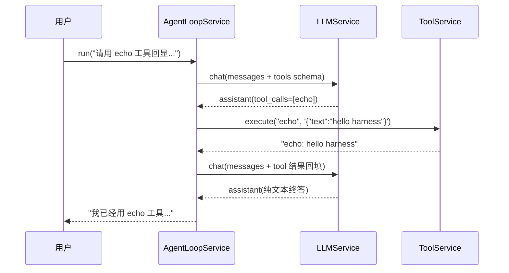

# 02 - 用 Cordis 搭建 Agent 框架

> 本章是第四部分的动手起点。我们将用不到两百行 TypeScript，在 Cordis 内核上立起一个最小但完整可运行的 Agent Harness：它能接 OpenAI 兼容端点、注册工具、跑通"调模型、执行工具调用、结果回填、循环直至终答"的完整 Agent Loop。这个骨架就是你的"微型 dsh"——后续六章会逐个子系统强化它。写完本章你会直观体会到：Agent Harness 的核心其实很小，大的是环绕它的工程配套。

前置阅读：[[deepseek-harness/4设计自己的Harness/01-何时需要自建Harness|何时需要自建 Harness]]、[[deepseek-harness/2架构/03-服务与依赖注入|服务与依赖注入]]
相关章节：[[deepseek-harness/1认知/03-Cordis论文精读|Cordis 论文精读]]、[[deepseek-harness/4设计自己的Harness/03-设计工具注册系统|设计工具注册系统]]

---

## 1. 目标与项目初始化

### 1.1 本章要造什么

一个单文件可运行的 Agent，具备：

| 能力 | 实现载体 | Cordis 对应概念 |
| --- | --- | --- |
| 调用 LLM（OpenAI 兼容） | `LLMService` | Service |
| 注册与分发工具 | `ToolService` | Service + 事件 |
| 核心循环直到终答 | `AgentLoopService` | Service + inject |
| 一个示例工具 | echo 工具 | 可逆副作用注册 |
| 程序入口 | main | root Context 启动 |

刻意**不**包含的：流式输出、多模型路由、权限门禁、审批、审计日志——它们分别是后续各章的主角。骨架阶段每多一行代码，都会模糊"最小内核长什么样"这个问题本身。

### 1.2 初始化

```bash
mkdir mini-harness && cd mini-harness
npm init -y
npm install cordis
npm install -D typescript @types/node
npx tsc --init --outDir dist --target es2022 --module commonjs --strict
```

目录约定：所有源码先放在 `src/main.ts` 单文件里，讲解时再拆段。

---

## 2. 完整源码

下面是全部源码，约两百行，含中文注释。可以先整体扫一遍，再进入逐段精讲。

```typescript
// src/main.ts —— 最小可用 Agent Harness(微型 dsh)
import { Context, Service, defineProperty } from 'cordis'

// ============================================================
// 第一部分:类型定义
// ============================================================

// 一条消息:与 OpenAI Chat Completions 协议保持一致,不做多余抽象
interface Message {
  role: 'system' | 'user' | 'assistant' | 'tool'
  content: string
  tool_calls?: ToolCall[]       // assistant 消息可能携带工具调用请求
  tool_call_id?: string         // role 为 tool 时,标明对应哪一次调用
}

// 模型发出的单次工具调用请求
interface ToolCall {
  id: string                    // 模型生成的调用 ID,回填结果时要原样带回去
  type: 'function'
  function: { name: string, arguments: string }   // arguments 是 JSON 字符串
}

// 工具的 JSON Schema 描述:直接透传给模型的 tools 参数
interface ToolSchema {
  type: 'function'
  function: {
    name: string
    description: string
    parameters: Record<string, unknown>
  }
}

// 工具执行函数:入参是校验后的对象,出参统一包成字符串回填给模型
type ToolExecute = (args: Record<string, any>) => Promise<string>

// ============================================================
// 第二部分:LLMService —— 模型接入层
// ============================================================

class LLMService extends Service {
  // OpenAI 兼容端点的三项配置,从构造参数或 config 注入
  constructor(ctx: Context, private config: {
    baseURL: string     // 例:'https://api.deepseek.com/v1'
    apiKey: string
    model: string       // 例:'deepseek-chat'
  }) {
    super(ctx, 'llm')
  }

  /**
   * 发起一次 chat completion。
   * stream 固定关闭——骨架阶段用同步返回换取简单性,
   * 流式协议(StreamChunk)留到第 04 章的多模型路由中引入。
   */
  async chat(messages: Message[], tools?: ToolSchema[]) {
    const res = await fetch(`${this.config.baseURL}/chat/completions`, {
      method: 'POST',
      headers: {
        'Content-Type': 'application/json',
        Authorization: `Bearer ${this.config.apiKey}`,
      },
      body: JSON.stringify({
        model: this.config.model,
        messages,
        // 只有存在已注册工具时才把工具列表发给模型
        ...(tools?.length ? { tools, tool_choice: 'auto' } : {}),
      }),
    })
    if (!res.ok) throw new Error(`LLM 请求失败: ${res.status} ${await res.text()}`)
    const data = await res.json()
    return data.choices[0].message as Message
  }
}

// 声明 ctx.llm 的类型,让后续 Service 能通过 ctx.llm 直接访问
declare module 'cordis' {
  interface Context {
    llm: LLMService
  }
}

// ============================================================
// 第三部分:ToolService —— 工具注册表与分发器
// ============================================================

class ToolService extends Service {
  // 注册表:name -> { schema, execute }
  // 使用 Map 而非普通对象,避免原型链污染,且键序稳定
  private registry = new Map<string, { schema: ToolSchema, execute: ToolExecute }>()

  constructor(ctx: Context) {
    super(ctx, 'tools')
  }

  /** 注册一个工具。重复注册同名工具视为更新(后到者覆盖),这是 Cordis 式的可逆副作用 */
  register(name: string, description: string, parameters: Record<string, unknown>, execute: ToolExecute) {
    this.registry.set(name, {
      schema: { type: 'function', function: { name, description, parameters } },
      execute,
    })
  }

  /** 卸载工具:插件销毁时的回调里调用,保证注册可逆 */
  unregister(name: string) {
    this.registry.delete(name)
  }

  /** 导出全部工具 schema,供 chat 请求使用 */
  listSchemas(): ToolSchema[] {
    return [...this.registry.values()].map(r => r.schema)
  }

  /**
   * 分发执行:按名字找到工具并调用。
   * 未注册的工具不抛异常,而是返回错误文本——
   * 让模型知道"这个工具不存在",它有机会换工具重试,
   * 这比抛崩整个循环友好得多(错误处理约定的雏形,详见第 03 章)。
   */
  async execute(name: string, argsJson: string): Promise<string> {
    const entry = this.registry.get(name)
    if (!entry) return `错误:工具 ${name} 不存在。可用工具:${[...this.registry.keys()].join(', ')}`
    try {
      const args = JSON.parse(argsJson || '{}')
      return await entry.execute(args)
    } catch (e: any) {
      return `错误:工具 ${name} 执行失败:${e.message}`
    }
  }
}

declare module 'cordis' {
  interface Context {
    tools: ToolService
  }
}

// ============================================================
// 第四部分:AgentLoopService —— 核心循环
// ============================================================

class AgentLoopService extends Service {
  static inject = ['llm', 'tools']    // 声明依赖:Cordis 保证二者就绪后才实例化本服务

  // 循环安全阀:防止模型陷入无限工具调用的兜底上限
  private maxIterations = 10

  constructor(ctx: Context) {
    super(ctx, 'loop')
  }

  /**
   * Agent Loop 主流程:
   * 组装 messages -> 调模型 -> 有 tool_calls 则逐个执行并回填 -> 再次调模型
   * -> 直到模型不再请求工具,返回纯文本终答。
   */
  async run(userInput: string): Promise<string> {
    const messages: Message[] = [
      { role: 'system', content: '你是一个乐于助人的助手,可以调用工具完成任务。' },
      { role: 'user', content: userInput },
    ]

    for (let i = 0; i < this.maxIterations; i++) {
      // 第一步:带着当前全部上下文和工具清单请求模型
      const assistant = await this.ctx.llm.chat(messages, this.ctx.tools.listSchemas())
      messages.push(assistant)

      // 第二步:没有工具调用 => 任务完成,返回终答
      if (!assistant.tool_calls?.length) {
        return assistant.content
      }

      // 第三步:有工具调用 => 逐个执行,并把结果按协议回填
      for (const call of assistant.tool_calls) {
        console.log(`[loop ${i}] 执行工具 ${call.function.name}, 参数: ${call.function.arguments}`)
        const result = await this.ctx.tools.execute(call.function.name, call.function.arguments)
        // 回填的消息必须携带原样的 tool_call_id,模型才能对上号
        messages.push({ role: 'tool', content: result, tool_call_id: call.id })
      }
    }

    // 触达安全阀:如实告知而非静默失败
    return '已达最大循环次数,任务未能完成。'
  }
}

declare module 'cordis' {
  interface Context {
    loop: AgentLoopService
  }
}

// ============================================================
// 第五部分:echo 工具示例 + 启动入口
// ============================================================

// 把工具注册封装成 Cordis 插件:apply 函数内的一切注册都是可逆副作用
function applyEchoPlugin(ctx: Context) {
  ctx.on('ready', () => {
    ctx.tools.register(
      'echo',
      '原样返回输入文本。用于测试工具链路是否通畅。',
      {
        type: 'object',
        properties: {
          text: { type: 'string', description: '要回显的文本' },
        },
        required: ['text'],
      },
      async (args) => `echo: ${args.text}`,
    )
  })

  // 插件卸载时自动清理:这就是"一切注册皆可逆"
  ctx.on('dispose', () => {
    ctx.tools.unregister('echo')
  })
}

async function main() {
  // root Context:整个 Harness 的世界线
  const ctx = new Context()

  // 以配置数据的方式挂载 LLM 服务——换端点只需改这里
  ctx.plugin({
    implement: { llm: LLMService },
    config: {
      baseURL: process.env.LLM_BASE_URL || 'https://api.deepseek.com/v1',
      apiKey: process.env.LLM_API_KEY || '',
      model: process.env.LLM_MODEL || 'deepseek-chat',
    },
  })
  ctx.plugin(ToolService)
  ctx.plugin(AgentLoopService)
  ctx.plugin(applyEchoPlugin)

  await ctx.start()

  // 跑一轮完整 loop:问一个必须借助工具才能答好的问题
  const answer = await ctx.loop.run('请用 echo 工具回显 "hello harness",然后把结果告诉我。')
  console.log('最终回答:', answer)

  ctx.stop()
}

main().catch((err) => {
  console.error('启动失败:', err)
  process.exit(1)
})
```

编译并运行：

```bash
npx tsc
node dist/main.js
# [loop 0] 执行工具 echo, 参数: {"text":"hello harness"}
# 最终回答: 我已经用 echo 工具成功回显了 "hello harness",结果是 "echo: hello harness"。
```

两行日志之间，发生了一次完整的"模型思考、点名工具、框架执行、结果回填、模型总结"。这就是所有 Agent Harness 共享的那个原子过程。

---

## 3. 逐段精讲：为什么这样切

### 3.1 三个 Service 的切分依据

对照 [[deepseek-harness/1认知/03-Cordis论文精读|Cordis 论文精读]]提出的时空组合性视角：**空间维度上，每个 Service 应该对应一类独立变化的关注点；时间维度上，它们的生命周期应该允许各自独立启停。**

| Service | 变化的驱动力 | 为什么必须是独立的 Service |
| --- | --- | --- |
| LLMService | 换 provider、换模型、加流式 | 与业务逻辑零耦合，测试时整个换成 mock |
| ToolService | 加工具、改权限 | 工具集随部署环境变化，循环逻辑不该感知它 |
| AgentLoopService | 改循环策略 | 是唯一"懂 Agent 语义"的地方，其余两层都是通用设施 |

反例是把三者揉成一个 `class MiniAgent`：你想在不开模型的情况下单测工具分发？做不到，构造函数就把 API key 要走了。**切分的检验标准是"能否被单独 mock 掉"**——三个 Service 各自都能。

### 3.2 LLMService：薄封装是对的

骨架阶段的 `chat()` 只有一层 fetch，有人会觉得太薄、该抽象出 Provider 接口。刻意不抽：**过早的抽象会把第一个真实需求（比如流式、或第二家 provider 的差异字段）锁死在你想象出的接口形状里。**等第 04 章真的引入第二个 provider 时，`ChatModel` 接口才会从两个具体实现的交集里自然浮现。

唯一提前做的决定是：**消息结构完全沿用 OpenAI 协议，不自创中间表示。**理由很实际——几乎所有主流 provider 都提供 OpenAI 兼容层，沿用协议意味着适配成本趋近于零，也意味着调试时抓包看到的就是内部结构，无需双向翻译。

### 3.3 ToolService：注册表模式的两个关键决定

第一个决定：**execute 返回字符串而不是对象。**模型消费工具结果的最小公分母就是文本；结构化展示是给人看的，属于渲染层职责（第 03 章 output.render 会把它拆出来）。骨架阶段先用字符串保住正确性。

第二个决定：**execute 不抛异常。**未注册工具、JSON 解析失败、执行出错，一律转成错误文本返回给模型。这不是偷懒，而是 Agent 错误处理的核心约定——[[deepseek-harness/3实战开发/03-defineTool工具开发|defineTool 工具开发]]里讲过：工具报错应该返回给模型让它自行纠正，而不是抛崩 loop。模型收到"工具 X 不存在，可用工具有……"，下一轮就会自我修正。

### 3.4 AgentLoopService：循环不变量

核心 while 循环只有十几行，但它维持着一个至关重要的**不变量**：`messages` 数组在任何时刻都是一个合法的 OpenAI 协议会话——assistant 的每次 tool_calls 之后必然紧跟若干条带对应 tool_call_id 的 tool 消息。破坏这个不变量（漏填一条结果、ID 对不上号），多数 provider 会直接报 400。

两个工程细节值得注意：

- **maxIterations 安全阀**：模型偶尔会陷入"调同一个工具、得到同样结果、再调一遍"的死循环。上限取值要大于正常任务所需轮数（编码任务常见 5 到 15 轮），触顶时如实报告而非静默返回空串；
- **console.log 打点是临时脚手架**：第 06 章会用事件系统替换它们，但保留这些打点的位置——未来 emit 的位置就在这几行。

### 3.5 declare module 与 ctx.xx 访问器

每个 Service 后面都跟着一段 `declare module 'cordis'`，这不是装饰：它把 `ctx.llm`、`ctx.tools`、`ctx.loop` 变成有类型的属性访问，TypeScript 全程推断，拼错服务名编译期就报错。这正是 [[deepseek-harness/2架构/03-服务与依赖注入|服务与依赖注入]]所讲的 Cordis 类型合并机制——dsh 里 `ctx.tools.register(...)` 的丝滑体验来源相同。

---

## 4. 运行演示与时间线

用 mermaid 把刚才那次运行的时间线画出来：



注意第二次 chat 请求：messages 数组此时包含 system、user、assistant(带 tool_calls)、tool(带结果) 四类消息——模型看到的不是"重新问一遍"，而是完整的对话史。**上下文即记忆**：Agent Loop 没有任何隐藏状态，一切状态都在这个数组里。理解了这一点，你就理解了为什么第 05 章的审计日志只需要落盘 messages 数组就能完整回放。

---

## 5. 这个骨架离 dsh 还有多远

诚实盘点一下，微型 dsh 与真 dsh 之间隔着一张清单，而这张清单正是后续六章的路标：

| 缺失能力 | 骨架现状 | 补齐章节 |
| --- | --- | --- |
| 流式输出 | 同步等待完整响应 | [[deepseek-harness/4设计自己的Harness/04-设计多模型路由\|04 章]] StreamChunk 协议 |
| 多模型路由 | 单一端点写死 | 04 章 ModelRouter |
| 参数校验 | JSON.parse 即信任 | [[deepseek-harness/4设计自己的Harness/03-设计工具注册系统\|03 章]] 执行流水线 |
| 权限与审批 | 无任何拦截 | 03 章权限门禁 / [[deepseek-harness/4设计自己的Harness/05-设计安全审计机制\|05 章]]审批流 |
| 审计日志 | console.log 即焚 | 05 章 append-only 事件流 |
| 事件总线 | 无 | 06 章 AgentEvent 体系 |
| 回放与追踪 | 无 | [[deepseek-harness/4设计自己的Harness/06-设计可观测与调试\|06 章]] |

每一项都不是推翻重来，而是在现有挂载点上插入新的 Service 或拦截器——这正是把骨架立在 Cordis 上的意义：**内核提供的扩展点，就是为今天这种演进准备的。**

---

## 6. 常见踩坑速查

第一次跑通骨架时，这几个问题最常出现，提前列出省你半天排查：

| 现象 | 原因 | 修复 |
| --- | --- | --- |
| 模型从不调工具 | tools 参数没带上，或 description 太弱 | 检查请求体里是否有 tools 字段；重写 description |
| 报 400 invalid messages | tool 消息缺 tool_call_id，或漏回填某次调用 | 核对循环不变量：每次 tool_calls 必须紧跟等量回填 |
| `ctx.llm is undefined` | Service 未挂载或依赖未声明 | 确认 plugin 已注册、`static inject` 拼写正确 |
| 死循环烧 token | 无 maxIterations 安全阀 | 加上限；触顶时如实报告 |
| Node 版本过旧 fetch 不存在 | fetch 需 Node 18+ | 升级运行时或改用 undici |

---

## 7. 本章小结

- 两百行即可获得一个能跑的 Agent Harness：LLMService 薄封装、ToolService 注册表、AgentLoopService 十几行核心循环；
- 三个 Service 按"能否单独 mock"切分，对应三类独立的变化驱动力；
- 消息结构沿用 OpenAI 协议、工具错误返回给模型而非抛崩、messages 数组是唯一状态——这三个决定会在后面每一章持续兑现红利；
- `static inject` 保证依赖就绪、`ctx.on('dispose')` 保证注册可逆，骨架从第一行起就是 Cordis 形状的。

下一章开始强化第一个子系统：把简陋的 Map 注册表升级为带流水线、权限门禁和描述质量工程的生产级工具系统——[[deepseek-harness/4设计自己的Harness/03-设计工具注册系统|设计工具注册系统]]。
