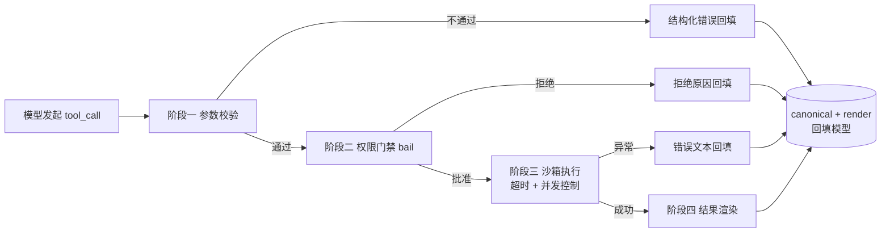

# 03 - 设计工具注册系统

> 骨架阶段的 ToolService 是一张裸 Map：能注册、能执行，但没有校验、没有权限、没有超时。本章把它升级为生产级工具系统——defineTool 风格的 DSL、四阶段执行流水线、分级权限门禁与审批回调、错误处理约定、description 质量工程，以及工具测试策略。完成后的系统在能力上覆盖了 dsh `defineTool` 的核心子集，且每个设计决定都能对照 dsh 的实现找到出处。

前置阅读：[[deepseek-harness/4设计自己的Harness/02-用Cordis搭建Agent框架|用 Cordis 搭建 Agent 框架]]、[[deepseek-harness/3实战开发/03-defineTool工具开发|defineTool 工具开发]]
相关章节：[[deepseek-harness/2架构/04-事件系统详解|事件系统详解]]、[[deepseek-harness/4设计自己的Harness/05-设计安全审计机制|设计安全审计机制]]

---

## 1. 从裸 Map 到 defineTool DSL

### 1.1 五字段接口定义

dsh 的 `defineTool` 有五个核心字段，各司其职：name/description/parameters 给模型看，output.render 给人看，execute 干活。我们把这个契约原样搬进自己的框架：

```typescript
// src/tool/types.ts —— 工具描述符类型契约
import { z } from 'zod'

// 工具风险等级:权限系统的基石,详见第 3 节
export type RiskLevel = 'read-only' | 'write' | 'network' | 'destructive'

// 渲染结果:同一份数据,给模型的文本形态和给人的展示形态分离
export interface ToolOutput<T = unknown> {
  canonical: T                    // 结构化真值:程序消费、可测试、可入库
  render: string                  // 文本渲染:回填给模型(以及简单场景下给人看)
}

// 完整工具描述符:五个字段一个不能少
export interface ToolDefinition<S extends z.ZodTypeAny = z.ZodTypeAny> {
  name: string                                    // 调用标识,snake_case
  description: string                             // 模型的说明书,质量工程见第 6 节
  parameters: S                                   // zod schema,同时承担校验与 JSON Schema 导出
  risk?: RiskLevel                                // 缺省视为 read-only,从严原则
  execute: (args: z.infer<S>) => Promise<ToolOutput>
}

export type RegisteredTool = ToolDefinition & {
  schemaJson: Record<string, unknown>             // 预编译的 JSON Schema,注册时算好
}
```

选择 zod 做参数 schema 是务实之举：一份声明同时得到运行时校验和（借助 zod-to-json-schema）给模型看的 JSON Schema，避免 dsh 中 schema 与校验逻辑双写的问题。

### 1.2 defineTool 工厂函数

```typescript
// src/tool/defineTool.ts —— DSL 入口:注册期就把错误拦住
import { zodToJsonSchema } from 'zod-to-json-schema'
import type { ToolDefinition, RegisteredTool } from './types'

export function defineTool<S extends z.ZodTypeAny>(def: ToolDefinition<S>): RegisteredTool {
  // 注册期校验:名字格式不对、schema 导出失败,都在挂载时炸出来,
  // 而不是等模型调用到这个工具时才在运行时暴露
  if (!/^[a-z][a-z0-9_]*$/.test(def.name)) {
    throw new Error(`工具名 ${def.name} 不合法:须为 snake_case`)
  }
  if (def.description.length < 10) {
    throw new Error(`工具 ${def.name} 的 description 过短,无法起到引导模型的作用`)
  }

  return {
    ...def,
    risk: def.risk ?? 'read-only',          // 未声明的风险一律按最低处理?不——按最常用的 read-only 处理,
                                            // 而 destructive 必须显式声明才生效(白名单思维)
    schemaJson: zodToJsonSchema(def.parameters, { target: 'openAi' }),
  }
}
```

注意"缺省 read-only"的方向性：默认值必须落在**低风险**一侧，destructive 永远需要显式声明——让升级风险是一个主动动作。

---

## 2. 执行流水线：四阶段架构

### 2.1 流水线全景

骨架阶段的 `execute` 是一步到位的；生产级实现拆成四个阶段，每阶段一个拦截点：



四阶段的关键性质：**任何一条路径的终点都是"一条回填给模型的 tool 消息"，永远不向 loop 抛异常。**这是上一章确立的错误处理约定的延续。

### 2.2 升级版 ToolService 完整实现

```typescript
// src/tool/ToolService.ts —— 生产级工具服务
import { Service } from 'cordis'
import type { RegisteredTool, RiskLevel } from './types'

// 审批请求:由权限门禁发出,由外部渠道(UI/CLI/webhook)裁决
export interface ApprovalRequest {
  tool: string
  args: Record<string, any>
  reason: string                  // 为什么需要审批(命中了哪条规则)
}

export interface ToolServiceConfig {
  timeoutMs?: number              // 单次工具执行上限,默认 30s
  maxConcurrent?: number          // 全局并发上限,默认 4
  // 审批回调:返回 true 放行。注入哪个实现,决定了审批走 UI 还是 CLI 还是 webhook
  requestApproval?: (req: ApprovalRequest) => Promise<boolean>
}

class ToolService extends Service {
  static inject = [],             // 无硬依赖;审批回调经 config 注入,保持解耦

  private registry = new Map<string, RegisteredTool>()
  private inflight = 0            // 当前并发计数

  constructor(ctx: Context, public config: ToolServiceConfig = {}) {
    super(ctx, 'tools')
  }

  register(tool: RegisteredTool) {
    this.registry.set(tool.name, tool)
    // 返回清理函数:插件 dispose 时直接调用,注册天然可逆
    return () => this.registry.delete(tool.name)
  }

  listSchemas() {
    return [...this.registry.values()].map(t => t.schemaJson)
  }

  /** 四阶段流水线主入口 */
  async execute(name: string, argsJson: string): Promise<string> {
    const tool = this.registry.get(name)
    if (!tool) return `错误:工具 ${name} 不存在。可用:${[...this.registry.keys()].join(', ')}`

    // ---------- 阶段一:参数校验 ----------
    let args: Record<string, any>
    try {
      args = JSON.parse(argsJson || '{}')
    } catch {
      return `错误:参数不是合法 JSON。请检查 arguments 格式后重试。`
    }
    const parsed = tool.parameters.safeParse(args)
    if (!parsed.success) {
      // 把 zod 的诊断信息原样给模型:它知道哪里错了才能改对
      return `错误:参数校验失败 - ${parsed.error.issues.map(i => `${i.path.join('.')}: ${i.message}`).join('; ')}`
    }

    // ---------- 阶段二:权限门禁(bail 语义) ----------
    const allowed = await this.checkPermission(tool, parsed.data)
    if (!allowed.ok) {
      // bail:一旦有人否决,立即短路,后续阶段不再执行
      return `操作被拒绝:${allowed.reason}`
    }

    // ---------- 阶段三:沙箱执行(超时 + 并发控制) ----------
    if (this.inflight >= (this.config.maxConcurrent ?? 4)) {
      return `错误:工具并发已达上限,请稍后重试。`
    }
    this.inflight++
    try {
      const output = await this.withTimeout(
        tool.execute(parsed.data),
        this.config.timeoutMs ?? 30_000,
        name,
      )
      // ---------- 阶段四:结果渲染 ----------
      // 回填给模型的是 render 文本;canonical 留在事件流里供 UI 和审计消费
      await this.ctx.emit('tool-result', name, output.canonical)
      return output.render
    } catch (e: any) {
      if (e?.name === 'TimeoutError') return `错误:工具 ${name} 执行超时。`
      return `错误:工具 ${name} 执行失败:${e.message}`
    } finally {
      this.inflight--
    }
  }

  /** 权限检查:分级规则 + destructive 触发审批回调 */
  private async checkPermission(tool: RegisteredTool, args: any): Promise<{ ok: true } | { ok: false, reason: string }> {
    const level: RiskLevel = tool.risk ?? 'read-only'

    // 白名单机制:write 及以上级别可配置精确到参数的白名单(第 05 章展开)
    if (level === 'destructive') {
      const req: ApprovalRequest = {
        tool: tool.name,
        args,
        reason: `destructive 级工具,需人工确认`,
      }
      const approved = await this.config.requestApproval?.(req) ?? false
      // 审批决定本身也要进事件流:拒绝率和审批链是审计的核心素材
      await this.ctx.emit('approval', req, approved)
      if (!approved) return { ok: false, reason: `人工审批未通过` }
    }
    return { ok: true }
  }

  /** 超时包装:用 AbortSignal 而非仅 Promise.race,确保底层任务真的被取消 */
  private withTimeout<T>(p: Promise<T>, ms: number, name: string): Promise<T> {
    const ctrl = new AbortController()
    const timer = setTimeout(() => ctrl.abort(), ms)
    return Promise.race([
      p.finally(() => clearTimeout(timer)),
      new Promise<never>((_, rej) =>
        setTimeout(() => rej(Object.assign(new Error(`${name} 超时`), { name: 'TimeoutError' }), ms)),
      ),
    ])
  }
}
```

三个实现细节值得单独说明：

- **register 返回清理函数**：插件写法变成 `const dispose = ctx.tools.register(myTool)` 加 `ctx.on('dispose', dispose)`，比记名字再 unregister 更不易漏；
- **emit('tool-result')**：结果渲染的同时广播事件，可观测子系统（06 章）无需侵入流水线即可旁路收集数据；
- **审批决定也 emit**："谁批的、批没批"是审计素材，不是权限模块的私产。

---

## 3. 权限门禁设计：四级风险模型

### 3.1 分级标准

| 等级 | 定义 | 示例 | 默认策略 |
| --- | --- | --- | --- |
| read-only | 只读，无副作用 | read_file、search_runbook | 直接放行 |
| write | 产生持久化变更但可撤销 | create_file、create_ticket | 放行 + 记录 |
| network | 数据出边界，有外泄面 | http_fetch、send_message | 放行 + 目标域校验 |
| destructive | 难以撤销或影响他人 | rm_rf、restart_service、drain_node | 强制人工审批 |

分级的意义不在标签本身，而在于**策略可以挂在等级上**：日志详略、是否审批、是否限流，都按等级批量配置，而不是逐工具打补丁。network 与 destructive 可以叠加（如"向生产集群发命令"），实现上允许工具声明多等级取最高。

### 3.2 bail 语义为什么是对的

Cordis 事件的四种语义中，bail 的特性是"任一监听器返回假值即中止"。权限门禁正是它的教科书场景：

```typescript
// 多道独立审查并行监听同一个事件,任何一道说"不"就终止
ctx.before('tool-permission', async (tool, args) => policyEngine.check(tool, args))
ctx.before('tool-permission', async (tool, args) => complianceDb.isAllowed(tool, args))
ctx.before('tool-permission', async (tool) => !quarantineMode.active)
```

把权限做成事件而非方法调用的好处：新增一道合规审查不需要修改 ToolService 一行代码，注册一个监听器即可——这正是 [[deepseek-harness/2架构/04-事件系统详解|事件系统详解]]所讲的开闭原则落地方式。

---

## 4. 错误处理约定

把约定显式化成三条铁律：

**铁律一：工具层永不抛异常出流水线。**所有异常在阶段三被捕获并转为文本。loop 里唯一允许的异常来自网络层断连这类"重试也没用"的基础设施故障。

**铁律二：错误文本要说人话，更要让模型能行动。**对比：

```text
差:"Error: ENOENT"                        → 模型不知道该怎么办
好:"错误:文件 /app/config.yaml 不存在。
    目录下现有文件:config.example.yaml。"
                                          → 模型下一轮就会去读 example 文件
```

**铁律三：区分可预期错误与缺陷。**参数不合法、文件不存在是**工作状态**，返回文本让模型调整；空指针、类型崩溃是**代码缺陷**，除了返回文本还应 emit 错误事件留给开发者修——两条通道都要有，只留第一条会吞掉 bug。

---

## 5. description 质量工程

description 是 prompt 的一部分，它的措辞直接决定模型的调用质量。核心规范在 [[deepseek-harness/3实战开发/03-defineTool工具开发|defineTool 工具开发]]已详细展开（动词开头、边界声明、分流指引三军规），这里补充自建视角下的增量工程手段：

### 5.1 描述回归测试

description 改一版，模型行为可能全变。像测代码一样测描述——准备一组固定用例，跑"给定任务，模型选了哪个工具"的断言：

```typescript
// 描述回归:换描述后重跑,断言工具选择不变
const cases = [
  { task: '看看 config.yaml 里写了什么', expect: 'read_file' },
  { task: '帮我把这段日志搜一下 error', expect: 'grep_log', notExpect: 'read_file' },
]
for (const c of cases) {
  const choice = await mockModel.selectTool(c.task)
  assert.equal(choice, c.expect)
}
```

CI 里每次动 description 都跑一遍，防止"顺手改了下文案"引发静默退化。

### 5.2 工具注册的插件化形态

工具不该散落在主工程里，而应按域打包成 Cordis 插件——这是 dsh 的做法，也应该是你的：

```typescript
// src/plugins/fs-tools.ts —— 文件系统工具集,一个插件一个域
import type { Context } from 'cordis'

export function applyFsTools(ctx: Context) {
  const disposers: Array<() => void> = []

  ctx.on('ready', () => {
    disposers.push(ctx.tools.register(readFileTool))
    disposers.push(ctx.tools.register(writeFileTool))     // risk: 'write'
    disposers.push(ctx.tools.register(deletePathTool))    // risk: 'destructive'
  })

  // 一键全清:插件卸载时整个工具域从模型视野消失,
  // 下一次 chat 请求的 tools 列表自动不再包含它们
  ctx.on('dispose', () => disposers.forEach(d => d()))
}
```

这个形态带来两个直接收益：**按场景裁剪**（客服 Agent 只加载 kb-tools 插件，运维 Bot 只加载 ops-tools）与**权限随域走**（对整个插件统一设风险上限，而不是逐个工具审）。

### 5.3 描述质量的自检清单

每次新增工具后过一遍：

```text
1. 只看 name + description(假装不知道实现),能猜出用途吗?
2. 与已有工具的边界写了吗?"什么时候不用我"说了吗?
3. 每个参数的 description 是填空题题干吗?(含格式示例更好)
4. 固定选项用 enum 了,还是留了自由文本让模型编?
5. 必填字段是真的必需,还是有合理默认值?
6. 描述回归测试跑过了吗?
```

---

## 6. 与 dsh 的 defineTool 对照表

诚实标注你实现了它的哪个子集：

| 能力 | dsh defineTool | 本章实现 | 差距说明 |
| --- | --- | --- | --- |
| 五字段契约 | name/description/parameters/output/execute | 同构(zod 替代手写 schema) | 形状一致 |
| 注册期校验 | 有 | 有 | 一致 |
| 参数自动校验 | schema 校验 | zod safeParse | 一致 |
| 权限分级 | 内建分级 | 四级 + 显式 risk 字段 | 子集:dsh 另有会话级授权上下文 |
| 审批流 | 内建 UI 审批 | 回调注入,渠道自选 | 你的更灵活,dsh 的更开箱 |
| canonical/render 两层 | 有 | 有 | 一致 |
| 输出截断与分页 | 有(大结果保护) | 未实现 | 补法见本表下方说明 |

大结果截断值得立刻补上：模型上下文有限，一次 `read_file` 读回 500KB 会挤爆窗口。在阶段四加一段"超过 N 字符则头部保留 + 尾部保留 + 中间替换为省略标记"的逻辑，十行代码，收益巨大：

```typescript
// 阶段四的截断增强:头尾保留,中间省略
const MAX_RENDER = 20_000                       // 回填给模型的字符上限
function truncateRender(render: string): string {
  if (render.length <= MAX_RENDER) return render
  const head = render.slice(0, MAX_RENDER * 0.6)
  const tail = render.slice(-MAX_RENDER * 0.2)
  return `${head}\n...[中间 ${render.length - head.length - tail.length} 字符已省略]...\n${tail}`
}
```

注意省略提示本身也是信息：告诉模型"内容被截断了"，它才知道需要用更精确的工具或参数重新获取，而不是以为已经看到了全文。

---

## 7. 测试工具的策略

工具测试的最大障碍是"模型不可控"。解法是把模型从回路里拿掉：**mock 模型按脚本回放固定的 tool_calls 序列**，被测对象只有工具系统和流水线。

```typescript
// 测试示例:不依赖真实 LLM,验证流水线各阶段
describe('ToolService 流水线', () => {
  it('参数不合法时返回校验错误而非抛异常', async () => {
    const svc = new ToolService(testCtx, {})
    svc.register(defineTool({
      name: 'echo',
      description: '原样返回输入文本,用于链路验证。',
      parameters: z.object({ text: z.string() }),
      execute: async ({ text }) => ({ canonical: text, render: `echo: ${text}` }),
    }))
    // 坏参数:缺少必填字段
    const result = await svc.execute('echo', '{}')
    assert.match(result, /参数校验失败/)
  })

  it('destructive 工具未获批准时不执行', async () => {
    let executed = false
    const svc = new ToolService(testCtx, {
      requestApproval: async () => false,           // 模拟用户点"拒绝"
    })
    svc.register(defineTool({
      name: 'rm_rf',
      description: '递归删除指定目录,危险操作,仅在明确指令下使用。',
      parameters: z.object({ path: z.string() }),
      risk: 'destructive',
      execute: async () => { executed = true; return { canonical: null, render: 'done' } },
    }))
    await svc.execute('rm_rf', '{"path":"/tmp/x"}')
    assert.equal(executed, false)                   // 关键断言:execute 根本没被碰过
  })
})
```

第二条例子里 `executed === false` 是整个权限设计的灵魂断言：**拒绝发生在执行之前**，而不是执行后回滚。配合 [[deepseek-harness/4设计自己的Harness/05-设计安全审计机制|05 章]]的审计日志，审批请求与裁决也会留下完整痕迹。

---

## 8. 本章小结

- defineTool 五字段 DSL 用 zod 实现，注册期校验把错误提前到挂载时刻；
- 四阶段流水线（校验、门禁、执行、渲染）每阶段独立可拦截，所有路径终点都是回填消息；
- 四级风险模型让策略挂等级而非逐工具配置，destructive 强制审批且默认拒绝；
- 三条错误铁律保证 loop 永不被工具炸崩，模型始终保有自我纠正的机会；
- description 是 prompt 的一部分，需要回归测试守护；
- 对照 dsh：已覆盖其核心子集，缺口主要在大结果截断与会话级授权。

下一个子系统解决"模型只有一个、端点写死"的问题——[[deepseek-harness/4设计自己的Harness/04-设计多模型路由|设计多模型路由]]。
