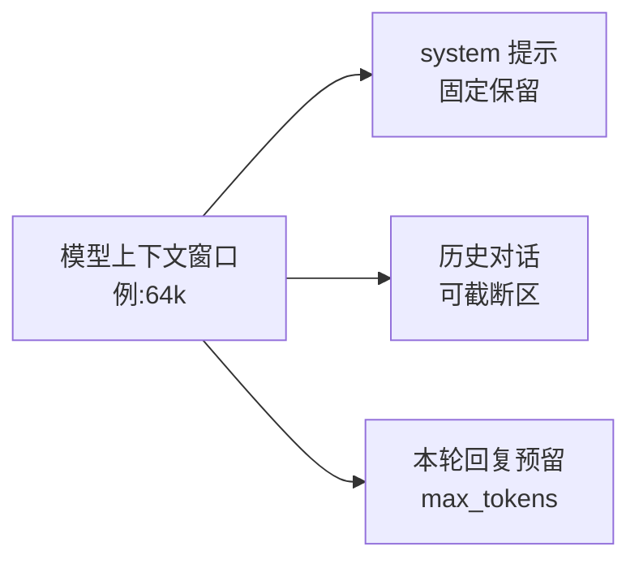

# 04 - 设计多模型路由

> 骨架阶段的 LLMService 只认一个写死的端点。本章把它升级为 ModelRouter：多家 provider（DeepSeek、OpenAI 兼容端点、本地 Ollama）注册进统一接口，StreamChunk 流式协议贯穿全链路，路由策略按名称/任务类型/成本/可用性灵活切换，且换模型不改代码——配置走 Cordis config 层，变更自动重载。同时处理两个生产绕不开的问题：上下文窗口超限截断，与 429/5xx 重试退避。

前置阅读：[[deepseek-harness/4设计自己的Harness/02-用Cordis搭建Agent框架|用 Cordis 搭建 Agent 框架]]、[[deepseek-harness/2架构/03-服务与依赖注入|服务与依赖注入]]
相关章节：[[deepseek-harness/3实战开发/06-依赖驱动与热重载|依赖驱动与热重载]]、[[deepseek-harness/4设计自己的Harness/06-设计可观测与调试|设计可观测与调试]]

---

## 1. 统一接口与 StreamChunk 协议

### 1.1 ChatModel：所有适配器的最小公约数

```typescript
// src/router/types.ts —— 路由层的类型契约
import type { Message, ToolSchema } from '../tool/types'

// 流式分块:全链路唯一的数据货币
export type StreamChunk =
  | { type: 'text', content: string }                          // 增量文本
  | { type: 'tool_call_delta', id: string, name?: string,
      argumentsDelta: string }                                 // 工具调用参数的增量片段
  | { type: 'usage', promptTokens: number, completionTokens: number }
  | { type: 'error', message: string, retryable: boolean }     // retryable 提示上层能否退避重试
  | { type: 'done' }                                           // 结束哨兵

// 所有 provider 适配器实现这一个接口
export interface ChatModel {
  readonly name: string                       // 路由键,如 'deepseek' / 'local-ollama'
  chat(messages: Message[], options: {
    tools?: ToolSchema[]
    signal?: AbortSignal                      // 取消支持:用户中断时中止上游请求
  }): AsyncIterable<StreamChunk>
}
```

协议设计的三个决定值得说明：

- **tool_call_delta 允许 name 缺省**：OpenAI 风格的流里，首个 delta 携带函数名、后续只带参数片段。协议如实反映这一点，解析器负责拼装；
- **usage 独立成块**：token 用量是计费和窗口管理的原料，不能藏在响应末尾的元数据里被中间层丢掉；
- **error 带 retryable**：429 和 400 的处置完全不同，错误在源头就分类，路由器才不用猜。

### 1.2 为什么是 AsyncIterable 而不是回调

`AsyncIterable<StreamChunk>` 是"拉"模型——消费者按自己的节奏取块，天然支持 for-await 中断、背压传递。回调是"推"模型，取消逻辑要靠约定。Cordis 自身的事件系统适合做**广播**（多个订阅者），而模型流是**单消费者管道**，两者别混用。

---

## 2. Provider 适配器实现

### 2.1 OpenAI 兼容适配器（覆盖 DeepSeek 与大多数云厂商）

```typescript
// src/router/openaiCompat.ts —— 一个适配器吃遍 OpenAI 兼容端点
export class OpenAICompatModel implements ChatModel {
  constructor(
    public name: string,
    private cfg: { baseURL: string, apiKey: string, model: string },
  ) {}

  async *chat(messages: Message[], options: { tools?: ToolSchema[], signal?: AbortSignal })
    : AsyncIterable<StreamChunk> {
    const res = await fetch(`${this.cfg.baseURL}/chat/completions`, {
      method: 'POST',
      signal: options.signal,
      headers: { 'Content-Type': 'application/json', Authorization: `Bearer ${this.cfg.apiKey}` },
      body: JSON.stringify({
        model: this.cfg.model,
        messages,
        stream: true,                                   // 全链路强制流式
        ...(options.tools?.length ? { tools: options.tools, tool_choice: 'auto' } : {}),
      }),
    })

    if (!res.ok || !res.body) {
      // 429/5xx 标记可重试;4xx 其余多为请求本身有问题,重试无意义
      const retryable = res.status === 429 || res.status >= 500
      yield { type: 'error', message: `HTTP ${res.status}`, retryable }
      yield { type: 'done' }
      return
    }

    // 解析 SSE:data: {...} 行 -> JSON -> delta
    for await (const chunk of parseSSE(res.body)) {
      const delta = chunk.choices?.[0]?.delta
      if (delta?.content) yield { type: 'text', content: delta.content }
      if (delta?.tool_calls) {
        for (const tc of delta.tool_calls) {
          yield {
            type: 'tool_call_delta',
            id: tc.id ?? '',
            name: tc.function?.name,
            argumentsDelta: tc.function?.arguments ?? '',
          }
        }
      }
      if (chunk.usage) {
        yield { type: 'usage', promptTokens: chunk.usage.prompt_tokens, completionTokens: chunk.usage.completion_tokens }
      }
    }
    yield { type: 'done' }
  }
}
```

DeepSeek 官方端点即 OpenAI 兼容（baseURL 配 `https://api.deepseek.com/v1`、model 配 `deepseek-chat`），因此同一个类直接复用。

### 2.2 SSE 解析器与工具函数

适配器里用到的 `parseSSE` 是流式链路的地基，实现不长但边界多（跨 chunk 断行、注释行、结束标记），值得完整给出：

```typescript
// src/router/sse.ts —— Server-Sent Events 解析器
export async function* parseSSE(body: ReadableStream<Uint8Array>)
  : AsyncIterable<any> {
  const reader = body.getReader()
  const decoder = new TextDecoder()
  let buffer = ''

  while (true) {
    const { done, value } = await reader.read()
    if (done) break
    buffer += decoder.decode(value, { stream: true })

    // SSE 以空行分隔事件;buffer 里凑齐完整事件才处理
    let idx: number
    while ((idx = buffer.indexOf('\n\n')) >= 0) {
      const raw = buffer.slice(0, idx)
      buffer = buffer.slice(idx + 2)
      for (const line of raw.split('\n')) {
        if (!line.startsWith('data:')) continue          // 忽略注释与未知字段
        const payload = line.slice(5).trim()
        if (payload === '[DONE]') return                 // OpenAI 风格结束标记
        try { yield JSON.parse(payload) } catch { /* 容忍残缺行 */ }
      }
    }
  }
}

export const sleep = (ms: number) => new Promise<void>(r => setTimeout(r, ms))
```

### 2.3 本地 Ollama 适配器

Ollama 的原生 API 协议不同，但它同样提供 OpenAI 兼容层（`http://localhost:11434/v1`），所以最省力的实现是复用上面的类：

```typescript
// src/router/models.ts —— provider 注册清单,纯配置数据
import { OpenAICompatModel } from './openaiCompat'

export function createBuiltinProviders(): ChatModel[] {
  return [
    new OpenAICompatModel('deepseek', {
      baseURL: process.env.DEEPSEEK_BASE_URL || 'https://api.deepseek.com/v1',
      apiKey: process.env.DEEPSEEK_API_KEY || '',
      model: 'deepseek-chat',
    }),
    new OpenAICompatModel('gpt', {
      baseURL: process.env.OPENAI_BASE_URL || 'https://api.openai.com/v1',
      apiKey: process.env.OPENAI_API_KEY || '',
      model: 'gpt-4o-mini',
    }),
    new OpenAICompatModel('ollama', {
      baseURL: 'http://localhost:11434/v1',
      apiKey: 'ollama',                     // 本地端点不校验 key,占位即可
      model: 'qwen2.5:7b',
    }),
  ]
}
```

当某家 provider 无法用兼容层覆盖时（如某些闭源 SDK 才有的高级字段），才需要真正新写一个 `ChatModel` 实现——接口不变，路由器无感。

---

## 3. ModelRouter：注册、策略、聚合

### 3.1 路由策略表

路由器收到请求后按序应用四层策略：

| 优先级 | 策略 | 触发方式 | 示例 |
| --- | --- | --- | --- |
| 1 | 显式指定 | 调用方传 model 参数 | `router.chat(msgs, { model: 'ollama' })` |
| 2 | 任务类型映射 | 按 system prompt 或消息特征分类 | 分类/摘要走小模型，复杂推理走大模型 |
| 3 | 成本优化 | 同等能力选低价 provider | 批处理流量全部导向本地 ollama |
| 4 | 故障降级 | fallback 链逐个尝试 | deepseek 失败自动切 gpt 再切 ollama |

四层不是互斥的而是叠加的：先按前三层选出首选，失败后进入第四层的 fallback 序列。

### 3.2 完整路由器实现（双 provider + fallback + 重试）

```typescript
// src/router/ModelRouter.ts —— Cordis Service 形态的路由器
import { Service } from 'cordis'
import type { ChatModel, StreamChunk } from './types'
import type { Message, ToolSchema } from '../tool/types'

interface RouterConfig {
  default: string                                  // 默认模型名
  fallbacks: string[]                              // 有序降级链:['deepseek','gpt','ollama']
  maxRetries: number                               // 单个 provider 内最大重试次数
}

class ModelRouter extends Service {
  private providers = new Map<string, ChatModel>()

  static inject = []                                // 无硬依赖;工具系统通过 ctx.router 反向使用

  constructor(ctx: Context, public config: RouterConfig) {
    super(ctx, 'router')
  }

  /** 注册 provider:热切换的基础——运行中随时可以挂新的进来 */
  register(model: ChatModel) {
    this.providers.set(model.name, model)
    return () => this.providers.delete(model.name)
  }

  /**
   * 统一入口:返回聚合后的流。
   * 内部完成 provider 选择、重试退避、跨 provider 降级。
   */
  async *chat(messages: Message[], options: { tools?: ToolSchema[], model?: string })
    : AsyncIterable<StreamChunk> {

    // 组装尝试序列:首选(显式指定或默认)之后接降级链去重
    const chain = [...new Set([
      options.model ?? this.config.default,
      ...this.config.fallbacks,
    ])]

    for (const name of chain) {
      const provider = this.providers.get(name)
      if (!provider) continue                        // 配置了但没注册:跳过,不炸

      for (let attempt = 0; attempt <= this.config.maxRetries; attempt++) {
        let sawError = false
        let retryable = false

        // 逐块转发;遇到可重试错误则记录并准备下一轮
        for await (const chunk of provider.chat(messages, { tools: options.tools })) {
          if (chunk.type === 'error') {
            sawError = true
            retryable = chunk.retryable
            break                                    // 本轮作废,已转发的部分块由上层丢弃
          }
          if (chunk.type === 'done') {
            yield chunk
            return                                   // 成功结束:整个函数到此为止
          }
          yield chunk
        }

        if (!sawError) return
        if (!retryable) break                        // 不可重试的错误:放弃该 provider,走降级链

        // 指数退避:1s, 2s, 4s...上限 16s,带抖动防雪崩
        const backoff = Math.min(1000 * 2 ** attempt, 16_000)
        await sleep(backoff + Math.random() * 500)
      }
      // 该 provider 重试耗尽:emit 事件留痕,继续尝试链上下一个
      await this.ctx.emit('router-failover', name)
    }

    yield { type: 'error', message: '所有 provider 均不可用', retryable: false }
    yield { type: 'done' }
  }
}
```

注意**部分输出的丢弃问题**：如果流已经转发了一些 text 块后才出错，重试会导致重复内容。严格的处理是在路由器内部缓冲到首个"稳定点"再对外放行；骨架级做法是文档化这个边界——text 错误重试可能重复，error 尽量发生在连接早期。生产化的折中：只在尚未产出任何 text/tool_call 块时才允许原地重试，否则直接降级到下一个 provider。

### 3.3 任务类型分类：最小可用实现

第二层策略"按任务类型路由"听起来要上分类器，实际最常用的是两个轻量做法：

```typescript
// 做法 A:调用方显式声明任务类型,路由器查表
router.chat(msgs, { taskType: 'classify' })

// 做法 B:按消息特征启发式判断——零成本,覆盖八成场景
function guessTaskType(messages: Message[]): string {
  const last = messages.at(-1)?.content ?? ''
  if (/^(总结|摘要|翻译|分类)/.test(last)) return 'classify'   // 轻任务
  if (last.length > 4000) return 'long_context'                // 长文优先选大窗口模型
  return 'default'
}
```

规则表本身放在 config 里，与热切换共用同一套机制。不要一开始就上 embedding 分类器——先让"路由是数据"这件事成立，智能与否可以后续迭代。

---

## 4. 热切换：换模型不改代码

### 4.1 配置驱动的路由表

把"哪个任务用哪个模型"做成 Cordis config 数据，而不是代码常量：

```typescript
// 配置文件(profile.yaml 片段):改这里即改路由,无需重新构建
// router:
//   default: deepseek
//   rules:
//     - match: { taskType: classify }
//       use: ollama            # 分类这种轻任务走本地小模型
//     - match: { taskType: coding }
//       use: deepseek
//   fallbacks: [deepseek, gpt, ollama]
```

Cordis 的 config 层支持变更监听——这正是 [[deepseek-harness/3实战开发/06-依赖驱动与热重载|依赖驱动与热重载]]所讲的机制：配置变更触发回调，服务在回调里更新内部状态，进程不用重启：

```typescript
// 路由器挂载时声明 config schema 并监听更新
ctx.plugin({
  implement: { router: ModelRouter },
  config: [{ default: 'deepseek', fallbacks: ['deepseek', 'ollama'], maxRetries: 2 }],
  apply(ctx, config) {
    // config 更新时,Cordis 以新值重新调用 apply:
    // 这里只需更新路由器的可变状态,Fiber 会处理好其余生命周期
    ctx.on('config-update', (next) => {
      ctx.router.config = next
      console.log('[router] 路由配置已热更新:', next.default)
    })
  },
})
```

热切换的完整链路：运维改 YAML → Cordis 检测变更并校验 schema → 回调更新路由表 → 下一轮请求立即生效。全程无重启、无丢失中的请求（进行中的流继续走旧配置直至 done）。

### 4.2 AgentLoop 的接入改造

上一章的 AgentLoopService 改三行就能吃到路由能力：

```typescript
// 原:const assistant = await this.ctx.llm.chat(messages, tools)
// 改:消费路由器的聚合流
let content = '', toolCalls: ToolCall[] = []
for await (const chunk of this.ctx.router.chat(messages, { tools })) {
  if (chunk.type === 'text') content += chunk.content
  if (chunk.type === 'tool_call_delta') accumulateToolCall(toolCalls, chunk)
}
```

其中 `accumulateToolCall` 按 id 把多个 delta 拼成完整 ToolCall（name 取首次出现的值，argumentsDelta 依序拼接）。这段拼装逻辑建议独立成纯函数单测——它是流式协议里最容易出错的一环。

---

## 5. Token 计数与上下文窗口管理

### 5.1 窗口预算的三段划分

每次请求前检查 messages 总 token 数，超限则截断。预算划分为三段：



截断只动历史区，且从**最旧的消息对**开始丢弃；被丢弃处插入一条摘要占位（可选），保持对话结构的合法性——尤其不能拆散 assistant(tool_calls) 与其 tool 结果的对子。

### 5.2 截断器实现要点

```typescript
// src/router/window.ts —— 上下文窗口管理(节选核心逻辑)
export function truncateToWindow(
  messages: Message[],
  budgetTokens: number,
  countTokens: (m: Message) => number,     // 计数器注入:不同模型的 tokenizer 不同
): Message[] {
  const total = messages.reduce((n, m) => n + countTokens(m), 0)
  if (total <= budgetTokens) return messages

  // 保护头部(system)与尾部最近 N 轮,从中间向前丢弃整轮
  const head = messages[0]                  // system
  const tail: Message[] = []
  const middle = messages.slice(1)

  let freed = total - budgetTokens
  while (freed > 0 && middle.length > 0) {
    // 一次丢一"轮":assistant 消息及其后续的全部 tool 回填必须同生共死,
    // 否则会产生孤儿 tool_call_id,请求直接 400
    const dropped = takeOneRound(middle)
    tail.unshift(...dropped.kept)
    freed -= dropped.tokens
  }
  return [head, ...middle, ...tail]
}
```

关键细节再次指向那个不变量：**assistant 与 tool 消息必须整轮同删**。token 计数方面，精确 tokenizer 各家不同，工程上常用近似（字符数除以经验系数）加安全余量 10%，比引入每家 SDK 的 tokenizer 依赖划算。

---

## 6. 本章小结

- 统一接口只有一个方法，StreamChunk 五种类型（text / tool_call_delta / usage / error / done）是全链路唯一数据货币；
- OpenAI 兼容层让一个适配器类吃遍 DeepSeek、云端与本地 Ollama；
- 路由四层策略叠加：显式指定 > 任务类型 > 成本 > 故障降级链；
- 重试带指数退避与抖动，仅在未产出任何内容块时原地重试，否则跨 provider 降级；
- 路由配置走 Cordis config 层实现热切换，改 YAML 即生效，机制与 [[deepseek-harness/3实战开发/06-依赖驱动与热重载|依赖驱动与热重载]]同源；
- 窗口管理三段预算、整轮删除，守住"tool_call 与回填成对出现"的不变量。

至此模型层与工具层都已生产化。下一章补上最容易被轻视也最致命的部分——[[deepseek-harness/4设计自己的Harness/05-设计安全审计机制|设计安全审计机制]]。
