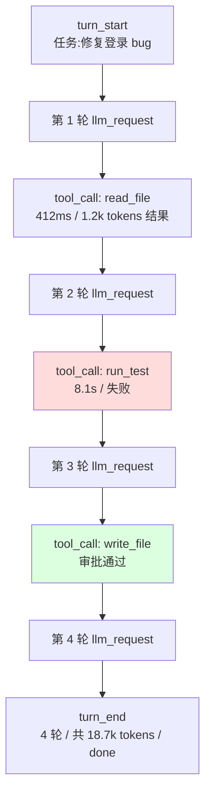
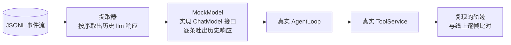

# 06 - 设计可观测与调试

> Agent 的行为是概率性的：同一个任务今天成功明天失败，失败时模型"想"了什么、工具返回了什么，不留下痕迹就永远无法回答。本章为你的 Harness 补上神经系统——可观测三支柱（日志、指标、追踪）在 Agent 场景的映射，一套 AgentEvent 事件类型体系，带 span 与 token 记录的 Trace 树，Prometheus 格式的指标导出思路，以及最实用的两件套：坏案例调试工作流与基于事件的回放器。最后对照 dsh 的 Trajectory 功能做完成度评估。

前置阅读：[[deepseek-harness/4设计自己的Harness/02-用Cordis搭建Agent框架|用 Cordis 搭建 Agent 框架]]、[[deepseek-harness/4设计自己的Harness/05-设计安全审计机制|设计安全审计机制]]
相关章节：[[deepseek-harness/2架构/04-事件系统详解|事件系统详解]]

---

## 1. 可观测三支柱的 Agent 映射

传统后端可观测的三支柱，映射到 Agent 场景后含义发生了值得注意的偏移：

| 支柱 | 传统后端 | Agent 场景 | 关键差异 |
| --- | --- | --- | --- |
| 日志 logging | 离散事件行 | 每轮完整的 messages 数组快照 | 一条"日志"可能几万 token,粒度设计必须谨慎 |
| 指标 metrics | QPS/延迟/错误率 | token 消耗/工具成功率/迭代轮数/审批拒绝率 | 成本是一等指标;错误率要按阶段拆分(校验错/权限拒/执行败) |
| 追踪 tracing | 请求 -> 微服务调用链 | 任务 -> 循环轮次 -> 工具调用/子 Agent 树 | 树的形状由模型的决策动态决定,不可预知 |

第三点差异最深：微服务的调用拓扑在部署时已知，Agent 的调用树由模型现场发挥——同一个任务的两次执行可能一棵树深一棵树浅。这决定了 Agent 的 trace 必须以**任务**为根动态生成，而不是静态埋点的串联。

---

## 2. AgentEvent：事件类型体系

### 2.1 类型定义

第 02 章骨架里的 console.log 打点，本章全部替换为类型化事件：

```typescript
// src/observability/events.ts —— AgentEvent 类型体系
export type AgentEvent =
  | { type: 'turn_start', turnId: string, task: string }
  | { type: 'llm_request', turnId: string, model: string,
      messageCount: number, approxTokens: number }
  | { type: 'llm_response', turnId: string, hasToolCalls: boolean,
      promptTokens?: number, completionTokens?: number }
  | { type: 'tool_call', turnId: string, callId: string,
      tool: string, args: unknown }
  | { type: 'tool_result', turnId: string, callId: string,
      ok: boolean, durationMs: number, outputSize: number }
  | { type: 'approval', turnId: string, tool: string,
      approved: boolean, approver?: string }
  | { type: 'turn_end', turnId: string, iterations: number,
      totalTokens: number, status: 'done' | 'max_iterations' | 'aborted' }

// 事件名到负载类型的映射:Cordis 事件系统的类型化用法
declare module 'cordis' {
  interface Events {
    'agent': (event: AgentEvent) => void
  }
}
```

设计要点有三：

- **turnId 贯穿始终**：一次任务的所有事件共享同一 ID，这是后续聚合成 trace 树的主键；
- **payload 是数据不是字符串**：订阅者各自决定怎么渲染——控制台打一行字，UI 画个面板，指标器累加计数器；
- **单一入口事件 'agent'**：所有事件走一个通道，订阅者按 type 过滤。比起给每种事件开一个 Cordis 事件名，单通道让新增事件类型零成本。

### 2.2 在循环里布点

把 AgentLoopService 的三处 console.log 替换为 emit：

```typescript
// AgentLoopService 内部改造(节选):三个 emit 点
async run(userInput: string): Promise<string> {
  const turnId = crypto.randomUUID()
  await this.ctx.emit('agent', { type: 'turn_start', turnId, task: userInput })
  // ...循环内:
  await this.ctx.emit('agent', {
    type: 'tool_call', turnId, callId: call.id,
    tool: call.function.name, args: JSON.parse(call.function.arguments || '{}'),
  })
  const result = await this.ctx.tools.execute(call.function.name, call.function.arguments)
  await this.ctx.emit('agent', {
    type: 'tool_result', turnId, callId: call.id,
    ok: !result.startsWith('错误'), durationMs: elapsed, outputSize: result.length,
  })
  // ...结束时:
  await this.ctx.emit('agent', { type: 'turn_end', turnId, iterations: i + 1, totalTokens, status: 'done' })
}
```

注意 `ok` 的判定方式借用了第 03 章的错误约定——因为所有工具错误都以"错误:"开头回填，旁路观察者无需侵入流水线就能区分成败。这是当初那条铁律的又一笔回报。

---

## 3. Trace：一次任务一棵树

### 3.1 树形结构

一次任务的完整轨迹构成一棵动态树：主 Agent 的每轮循环是中间节点，每次工具调用和子 Agent 委派是叶子或子树。



### 3.2 Span 实现

每个节点是一个 span：记录起止时间、token 用量与父子关系。实现不需要引 OpenTelemetry——百行以内自足，且格式完全自己可控：

```typescript
// src/observability/tracer.ts —— 轻量 span 树
import { Service } from 'cordis'
import type { AgentEvent } from './events'

interface Span {
  id: string
  parent?: string
  name: string
  startTs: number
  endTs?: number
  attrs: Record<string, unknown>       // 自由属性:tokens、成败、模型名……
}

class Tracer extends Service {
  private spans = new Map<string, Span>()

  constructor(ctx: Context) {
    super(ctx, 'tracer')
    // 订阅统一事件流,把事件流翻译成树结构——tracer 对业务零侵入
    ctx.on('agent', e => this.ingest(e))
  }

  private ingest(e: AgentEvent) {
    switch (e.type) {
      case 'turn_start':
        this.spans.set(e.turnId, {
          id: e.turnId, name: 'task',
          startTs: Date.now(), attrs: { task: e.task },
        })
        break
      case 'tool_call': {
        const id = `${e.turnId}:${e.callId}`
        this.spans.set(id, {
          id, parent: e.turnId, name: e.tool,
          startTs: Date.now(), attrs: { args: e.args },
        })
        break
      }
      case 'tool_result': {
        const span = this.spans.get(`${e.turnId}:${e.callId}`)
        if (span) {
          span.endTs = Date.now()
          span.attrs = { ...span.attrs, ok: e.ok, durationMs: e.durationMs }
        }
        break
      }
      case 'turn_end': {
        const root = this.spans.get(e.turnId)
        if (root) root.attrs = { ...root.attrs, ...e }
        break
      }
    }
  }

  /** 导出整棵树:供 UI 渲染或序列化存档 */
  getTree(turnId: string) {
    const all = [...this.spans.values()].filter(s =>
      s.id === turnId || s.parent === turnId)
    return buildNested(all, turnId)
  }
}
```

ingest 模式再次体现了事件总线的价值：tracer、审计器、指标器都是同一事件流的独立订阅者，彼此不知道对方存在，业务代码只管 emit。

---

## 4. 指标采集

### 4.1 指标清单

Agent 场景的最小指标集：

| 指标 | 类型 | 回答的问题 |
| --- | --- | --- |
| agent_turns_total{status} | Counter | 完成率如何?多少任务触顶失败? |
| agent_tokens_total{direction} | Counter | 成本曲线;prompt 与 completion 分开计 |
| agent_tool_calls_total{tool,result} | Counter | 哪个工具老失败?哪个从不被用? |
| agent_tool_duration_ms{tool} | Histogram | 工具耗时分布,定位慢工具 |
| agent_iterations | Histogram | 任务复杂度漂移:均值上移说明任务变难或模型变笨 |
| agent_approvals_total{decision} | Counter | 审批拒绝率:突增意味着模型行为劣化 |

### 4.2 从事件到 Prometheus

指标器同样只是事件流的订阅者。核心思路是把 AgentEvent 归约为标准三件套（Counter/Gauge/Histogram），再经 `/metrics` 端点暴露：

```typescript
// src/observability/metrics.ts —— 事件驱动的指标归约(节选)
class Metrics extends Service {
  private counters = new Map<string, number>()
  private histIter: number[] = []

  constructor(ctx: Context) {
    super(ctx, 'metrics')
    ctx.on('agent', e => this.observe(e))
  }

  private observe(e: AgentEvent) {
    switch (e.type) {
      case 'tool_result':
        this.incr(`agent_tool_calls_total{tool="${e.tool}",result="${e.ok ? 'ok' : 'fail'}"}`)
        break
      case 'turn_end':
        this.incr(`agent_turns_total{status="${e.status}"}`)
        this.histIter.push(e.iterations)
        break
    }
  }

  /** 导出 Prometheus 文本协议 */
  render(): string {
    return [...this.counters.entries()].map(([k, v]) => `${k} ${v}`).join('\n')
  }

  private incr(key: string) {
    this.counters.set(key, (this.counters.get(key) ?? 0) + 1)
  }
}
```

生产中可直接换用 prom-client 库，但事件归约这一层的形状不变——**先有干净的事件流，指标只是它的另一种投影**。

### 4.3 告警规则建议

指标有了，配几条最低限度的告警（PromQL 示意）：

```text
# 任务失败率 15 分钟窗口超 20%
rate(agent_turns_total{status="max_iterations"}[15m])
  / rate(agent_turns_total[15m]) > 0.2

# 工具失败率突增(按工具分组)
rate(agent_tool_calls_total{result="fail"}[10m]) > 0.1 * rate(agent_tool_calls_total[10m])

# 审批拒绝率异常:模型行为劣化的最早信号之一
increase(agent_approvals_total{decision="denied"}[30m]) > 5

# token 消耗环比翻倍:警惕失控循环或 prompt 膨胀
increase(agent_tokens_total[1h]) > 2 * increase(agent_tokens_total offset 1d[1h])
```

特别留意最后一条：token 消耗的异常增长往往比任何功能故障都更早暴露问题，而且它直接就是钱。

---

## 5. 调试工作流：坏案例复盘

### 5.1 标准流程

用户报告"昨天那个任务它改错了文件"。复盘五步：

```text
第一步 定位 turn:按时间与任务关键词过滤 JSONL,找到 turn_id
第二步 看树的形状:getTree(turn_id) —— 异常往往一眼可见
     例:某工具调用重复出现三次、参数几乎相同 => 模型没读懂第一次的结果
第三步 下钻那次调用:展开该 tool_call 的 span,看 args 与原始 output
第四步 回放上下文:取该轮的完整 messages,检查模型当时"看到"了什么
第五步 归因分类:
     - 描述缺陷   => 工具 description 有歧义,改描述 + 跑回归(03 章)
     - 参数幻觉   => schema 不够约束,加 enum/默认值
     - 结果误导   => 输出渲染问题,模型拿到了截断或歧义的文本
     - 注入污染   => 外部内容夹带指令,回到安全层(05 章)
```

第五步的归因分类是经验结晶：四类原因对应四个不同的修复位置，混着修会浪费大量时间。多数"模型太笨"的结论，下钻后都会落在前三类——**问题通常在你的接口质量，不在模型智力**。

### 5.2 一个真实的排查样例

```text
现象:Agent 反复执行 grep_log 且每次都超时。
trace 显示:三轮同样的 grep_log,args 里 pattern 相同但 path 不同。

第四步回放上下文发现:第一次的工具结果被截断器砍掉了尾部,
而"未找到匹配"的信息恰好在尾部 => 模型以为没执行成功,换了个路径重试。

修复:grep_log 的输出渲染改为"无结果时显式输出'未找到匹配'",
而不是返回空字符串。——空结果与执行失败对模型是不可分辨的。
```

这类问题的通用教训值得写进你的开发规范：**工具永远不要返回空字符串作为"成功"**，空也要说"空"。

---

## 6. 回放器：从 JSONL 到确定性复现

### 6.1 原理

回放的核心思想：**把记录的真实 LLM 响应伪装成一个 mock 模型，重新驱动整个 loop**。除 LLM 以外的所有组件（工具系统、权限门禁、事件总线）都走真实代码，于是复现是确定性的——同样的输入必然得到同样的轨迹。



### 6.2 实现

```typescript
// src/observability/replayer.ts —— 基于 ChatModel 接口的确定性回放
export class ReplayModel implements ChatModel {
  readonly name = 'replay'
  private queue: Message[]            // 预加载的历史 assistant 响应队列

  constructor(recordedResponses: Message[]) {
    this.queue = [...recordedResponses]
  }

  async *chat(): AsyncIterable<StreamChunk> {
    if (this.queue.length === 0) throw new Error('回放脚本耗尽:记录的事件流不完整?')
    const msg = this.queue.shift()!
    // 把历史响应还原成 chunk 流:loop 无感知,它以为在和真模型对话
    if (msg.content) yield { type: 'text', content: msg.content }
    for (const tc of msg.tool_calls ?? []) {
      yield { type: 'tool_call_delta', id: tc.id, name: tc.function.name,
              argumentsDelta: tc.function.arguments }
    }
    yield { type: 'done' }
  }
}

// 用法:从 JSONL 提取历史响应,重建会话,逐步重放
// 注意:工具走真实执行——这正是回放的价值所在:
// "如果当时工具返回了 X,模型接下来会不会做对?" 可以通过修改 mock 结果来反事实推演
const replayer = new ReplayModel(extractAssistantMessages('audit.jsonl', turnId))
ctx.router.register(replayer)
await ctx.loop.run(originalUserInput)
```

反事实推演（counterfactual replay）是这套设计独有的红利：怀疑"是工具结果误导了模型"？把那一条 tool 结果改成你期望的样子，重放看模型是否走上正轨——一晚上能验证五个假设，而不用烧真模型的 token 碰运气。

### 6.3 时间旅行调试的两个守则

- **回放环境要隔离**：工具走真实执行意味着 write 类操作会真的发生。回放一律指向沙箱目录或测试数据库；
- **记录完整性自检**：ReplayModel 抛出的"脚本耗尽"异常是宝贵的信号——它说明你的日志缺了一段，审计覆盖有洞。

### 6.4 事件流设计的经验法则

回放器依赖事件流的完整性，而事件粒度一旦定下就极难更改——这是所有子系统里最需要"一次想对"的地方。四条经验法则：

```text
1. 宁多勿少:存储便宜,信息丢失不可逆。不确定要不要记的事件,先记下来
2. 事件必须自足:每条记录含完整上下文(turnId/工具名/参数),
   消费者不需要"再查别处才能看懂这条"
3. 载荷与渲染分离:事件存结构化数据,文本形态由消费方生成
4. 版本字段从第一天就有:加一个 schemaVersion,未来格式演进时你还能读旧日志
```

第 4 条最容易被忽略也最致命：三个月后格式改了两版，旧 JSONL 成了没人能解析的化石。

---

## 7. 与 dsh Trajectory 功能对照表

| 能力 | dsh Trajectory | 本章实现 | 评估方法 |
| --- | --- | --- | --- |
| 会话过程记录 | 内建,UI 可视化 | JSONL + tracer 树 | 你的更原始但更开放,dsh 更开箱 |
| 回放 | 支持 | ReplayModel 确定性回放 | 能力对等,且你的支持反事实修改 |
| Token 统计 | 有 | usage chunk -> metrics | 对等 |
| 工具调用追踪 | 有 | span 树 | dsh 有现成 UI,你需自建渲染 |
| 导出格式 | 私有格式为主 | 开放 JSONL/Prometheus | 你的对接外部生态更容易 |
| 子 Agent 层级 | 有限 | 树天然支持任意深度 | 结构上你已占优 |

评估方法论比对照本身更重要：拿这张表的每一行问"我的场景里谁更重要"。嵌入自家产品时开放格式的权重高；内部工具团队使用时 UI 的权重高。**没有全面胜出的架构，只有匹配场景的架构。**

---

## 8. 一个最小控制台：把事件流画出来

可观测的最后一公里是"人能看见"。不必急着做 Web UI——几十行代码的控制台渲染器就能覆盖日常调试：

```typescript
// src/observability/consoleView.ts —— 订阅事件流的终端渲染器
export function attachConsoleView(ctx: Context) {
  ctx.on('agent', (e) => {
    switch (e.type) {
      case 'turn_start':
        console.log(`\n=== 任务 ${e.turnId.slice(0, 8)} ===\n> ${e.task}`)
        break
      case 'tool_call':
        console.log(`  [工具] ${e.tool}(${JSON.stringify(e.args).slice(0, 80)})`)
        break
      case 'tool_result':
        console.log(`  [结果] ${e.ok ? 'ok' : 'FAIL'} ${e.durationMs}ms, ${e.outputSize} 字符`)
        break
      case 'approval':
        console.log(`  [审批] ${e.approved ? '通过' : '拒绝'}`)
        break
      case 'turn_end':
        console.log(`=== 结束:${e.status}, ${e.iterations} 轮, ${e.totalTokens} tokens ===\n`)
        break
    }
  })
}
```

它同时是事件体系的**验收测试**：如果你的新子系统集成后这个视图仍然清晰可读，说明事件流设计没有走形。UI 化（树形 trace 面板、指标图表）可以之后再做，数据层已经就绪。

---

## 9. 本章小结

- 三支柱在 Agent 场景的偏移：日志粒度是 messages 快照、成本是一等指标、trace 树由模型动态生长；
- 单通道 AgentEvent + turnId 主键，tracer/审计/指标三方共享同一事件流互不知晓；
- 轻量 span 树百行自足，不必急着引入重型 tracing 框架；
- 坏案例复盘五步法，归因落进四象限（描述缺陷/参数幻觉/结果误导/注入污染）；
- 回放器的本质是"mock 模型 + 真实一切"，反事实推演让它从复现工具升级为实验平台；
- 对照 Trajectory：能力各有胜负，选择取决于你的部署形态。

下一章收官：把六个子系统拼成完整蓝图——[[deepseek-harness/4设计自己的Harness/07-完整Harness架构蓝图|完整 Harness 架构蓝图]]。
