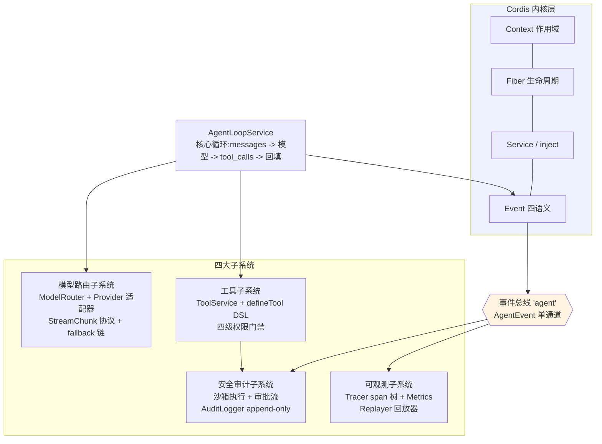
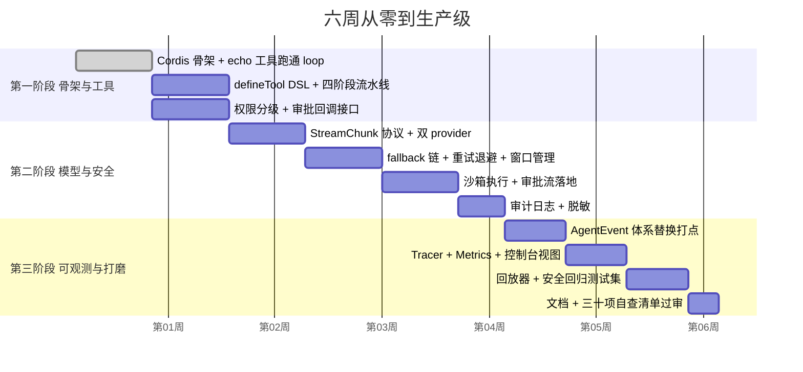

# 07 - 完整Harness架构蓝图

> 收官章。前六章分别立起了骨架、工具系统、模型路由、安全审计与可观测五个部件，本章把它们拼成一张完整蓝图：大架构图、模块职责矩阵、目录结构、六周实施路线图、三十项质量自查清单，以及与 dsh 的能力对照总表。最后谈演进方向——MCP 接入、分布式多 Agent 与记忆系统——并回到本部分的出发点：框架学习的终点是创造。

前置阅读：[[deepseek-harness/4设计自己的Harness/02-用Cordis搭建Agent框架|用 Cordis 搭建 Agent 框架]] 至 [[deepseek-harness/4设计自己的Harness/06-设计可观测与调试|设计可观测与调试]] 全部六章
相关章节：[[deepseek-harness/2架构/01-Cordis内核原理|Cordis 内核原理]]、[[deepseek-harness/1认知/02-DeepSeek-Harness全景|DeepSeek Harness 全景]]

---

## 1. 大架构图



读图要点：

- **事件总线贯穿一切**：AgentLoop 只管 emit，审计与可观测只管订阅，二者互不知道对方存在；
- **安全审计是工具系统的下游**：审批流挂在执行流水线的第二阶段，沙箱挂在第三阶段，不污染其他模块；
- **内核居中承载**：所有 Service 的启停、依赖、卸载都由 Cordis 兜底，四个子系统可以独立装卸。

---

## 2. 模块职责矩阵

| 模块 | 职责 | 对外接口 | 依赖 |
| --- | --- | --- | --- |
| LLMService | 单 provider 的 chat 封装(骨架遗留) | `chat()` | 无 |
| ModelRouter | 多 provider 注册、策略路由、重试降级 | `chat(): AsyncIterable<StreamChunk>`、`register()` | config 层 |
| ToolService | 工具注册表、四阶段流水线、并发控制 | `register()`、`execute()`、`listSchemas()` | 审批回调(config 注入) |
| AgentLoopService | 核心循环、上下文维护、迭代上限 | `run(task)` | router、tools、事件总线 |
| SandboxExecutor | 进程级隔离执行、资源限制 | `runInSandbox(script)` | 无 |
| ApprovalService | 审批队列、渠道适配、超时裁决 | `request(req): boolean` | AuditLogger |
| AuditLogger | append-only JSONL 落盘、集中脱敏 | `write(type, payload)` | 文件系统 |
| Tracer | span 树构建与导出 | `getTree(turnId)` | 事件总线(仅订阅) |
| Metrics | 指标归约、Prometheus 导出 | `render()` | 事件总线(仅订阅) |
| Replayer | 历史响应提取、mock 模型回放 | `replay(turnId)` | AuditLogger(读)、router |

矩阵的最后一列暴露了一个刻意的设计：**依赖方向全部指向基础设施，没有任何模块依赖 AgentLoop**。这保证了循环策略再怎么改（加子 Agent、改双循环），周边子系统一行不动。

### 2.1 对外接口契约清单

把每个模块对外承诺的接口固化成一份契约文档——它是模块间协作的法律，也是重构时的回归基准：

```typescript
// public-api.ts —— 全部跨模块接口的单一事实来源
// ============ 模型路由子系统 ============
interface ModelRouter {
  // 所有 LLM 调用的唯一入口;返回聚合流,error/done 必为流的最后两个 chunk
  chat(messages: Message[], options?: {
    tools?: ToolSchema[]
    model?: string          // 显式路由,绕过策略层
    taskType?: string       // 任务类型,命中 config 路由规则
  }): AsyncIterable<StreamChunk>
  register(model: ChatModel): () => void    // 返回卸载函数
}

// ============ 工具子系统 ============
interface ToolRegistry {
  register(tool: RegisteredTool): () => void
  execute(name: string, argsJson: string): Promise<string>   // 永不抛异常
  listSchemas(): ToolSchema[]
}

// ============ 安全审计子系统 ============
interface ApprovalChannel {
  request(req: ApprovalRequest): Promise<boolean>   // 超时/异常一律视为拒绝
}
interface AuditSink {
  write(type: AuditType, payload: unknown): void    // 出口集中脱敏,append-only
}

// ============ 可观测子系统 ============
interface EventBus {
  // 单通道订阅:所有子系统只消费 'agent' 一个事件名
  on(type: 'agent', handler: (e: AgentEvent) => void): () => void
}
```

契约里最值得强调的三条不变量都写进了注释：router 的流以 error/done 收尾、工具 execute 永不抛异常、审批默认拒绝。**跨模块的信任建立在这几条铁律上，任何一方违反都会引发级联故障。**

### 2.2 事件类型总表

全系统事件清单（第 06 章定义，此处汇总供速查）：

| 事件 | 发射方 | 关键负载 | 主要消费者 |
| --- | --- | --- | --- |
| turn_start / turn_end | AgentLoopService | turnId, status, totalTokens | Tracer, Metrics, AuditLogger |
| llm_request / llm_response | ModelRouter | model, approxTokens, usage | Tracer, Metrics |
| tool_call / tool_result | ToolService 流水线 | tool, args, ok, durationMs | Tracer, Metrics, AuditLogger |
| approval | 审批服务 | req, approved, approver | AuditLogger, Metrics |
| router-failover | ModelRouter | provider 名 | Metrics |

新增事件的流程：先在 events.ts 补类型 → 在发射点 emit → 更新本表。三个动作缺一不可——总表过期比没有总表更危险。

---

## 3. 目录结构蓝图

```text
mini-harness/
├── src/
│   ├── core/                      # 骨架三件套(第 02 章)
│   │   ├── types.ts               # Message / ToolCall / StreamChunk 公共类型
│   │   ├── loop.ts                # AgentLoopService
│   │   └── index.ts               # root Context 组装入口
│   ├── tool/                      # 工具子系统(第 03 章)
│   │   ├── types.ts               # ToolDefinition / RiskLevel
│   │   ├── defineTool.ts          # DSL 工厂 + 注册期校验
│   │   └── ToolService.ts         # 四阶段流水线
│   ├── router/                    # 模型路由子系统(第 04 章)
│   │   ├── types.ts               # ChatModel / StreamChunk
│   │   ├── sse.ts                 # SSE 解析器
│   │   ├── openaiCompat.ts        # OpenAI 兼容适配器
│   │   ├── ModelRouter.ts         # 路由 + 重试 + fallback
│   │   └── window.ts              # 上下文窗口截断
│   ├── security/                  # 安全审计子系统(第 05 章)
│   │   ├── inputFilter.ts         # 输入过滤与包裹
│   │   ├── sandbox.ts             # 进程级沙箱
│   │   ├── approvers.ts           # CLI/Webhook 审批渠道
│   │   ├── redact.ts              # 凭据脱敏
│   │   └── AuditLogger.ts         # append-only 日志
│   ├── observability/             # 可观测子系统(第 06 章)
│   │   ├── events.ts              # AgentEvent 类型体系
│   │   ├── tracer.ts              # span 树
│   │   ├── metrics.ts             # 指标归约
│   │   ├── replayer.ts            # 确定性回放
│   │   └── consoleView.ts         # 终端渲染器
│   └── plugins/                   # 业务工具集,按域打包
│       ├── fs-tools/
│       └── ops-tools/
├── profiles/                      # 配置数据:路由表、白名单、阈值
│   └── default.yaml
├── test/
│   ├── pipeline.spec.ts           # 流水线四阶段用例
│   ├── security.spec.ts           # 安全回归用例
│   └── fixtures/                  # mock 模型回放脚本
└── audit/                         # 运行期生成的 JSONL(gitignore)
```

目录即架构：六个一级模块与六大章一一对应，新人按章节顺序读代码就能建立全图。

### 3.1 配置项总表

全部配置集中在 profiles/ 下的 YAML，schema 校验由 Cordis config 层承担：

| 配置项 | 所属模块 | 类型 | 默认值 | 说明 |
| --- | --- | --- | --- | --- |
| router.default | ModelRouter | string | - | 默认 provider 名 |
| router.rules[] | ModelRouter | 数组 | [] | 任务类型路由规则 |
| router.fallbacks[] | ModelRouter | string[] | [default] | 有序降级链 |
| router.maxRetries | ModelRouter | number | 2 | 单 provider 重试上限 |
| tools.timeoutMs | ToolService | number | 30000 | 单次工具执行上限 |
| tools.maxConcurrent | ToolService | number | 4 | 全局并发上限 |
| tools.requestApproval | ToolService | 渠道引用 | 无(默认拒绝) | destructive 审批渠道 |
| security.sandbox.memoryMB | SandboxExecutor | number | 256 | 子进程内存上限 |
| audit.filePath | AuditLogger | string | audit/session.jsonl | 审计日志路径 |
| loop.maxIterations | AgentLoopService | number | 10 | 循环安全阀 |

配置设计的两条纪律：**所有阈值必须有默认值**（零配置可跑是骨架阶段就立下的规矩）；**所有凭据只从环境变量读取**，YAML 里永远只有引用名。

---

## 4. 实施路线图



三个阶段的里程碑各有一个"不可跳过"的验收物：

- **第一阶段末**：echo 工具在无人工干预下走完一轮完整 loop，且 destructive 用例在默认配置下被拒绝；
- **第二阶段末**：拔掉主 provider 网线，任务自动降级到备用 provider 完成；任意一次危险操作能在审计日志中找到请求与裁决两条记录；
- **第三阶段末**：随机抽三天前的真实会话，回放器能确定性复现；三十项自查全绿。

---

## 5. 测试策略总览

各章零散提到的测试手段在此汇总成分层体系：

| 层次 | 被测对象 | 手段 | 来源章节 |
| --- | --- | --- | --- |
| 单元测试 | 纯函数(SSE 解析、窗口截断、redact) | 常规断言,边界用例 | 04/05 章 |
| 流水线测试 | ToolService 四阶段 | mock 模型回放固定 tool_calls | 03 章 |
| 安全回归 | 权限/沙箱/脱敏 | 攻击用例集,每次安全相关改动必跑 | 05 章 |
| 集成冒烟 | 完整 loop + echo 工具 | 真 provider 跑一轮,CI 中标记为可选(耗 token) | 02 章 |
| 回放验证 | 全系统 | JSONL 历史 -> ReplayModel 确定性复现 | 06 章 |
| 描述回归 | 工具 description | 固定任务集断言工具选择 | 03 章 |

分层的取舍原则：**越便宜的层跑得越频繁**。单元与流水线测试每次提交都跑；真模型集成冒烟只在发版前跑；回放验证作为夜间任务抽查历史会话。

---

## 6. 质量检查清单（30 项）

交付前逐项过审。每项都是可以用"是/否"回答的硬问题：

### 架构与生命周期（6 项）

1. 每个 Service 可以被单独卸载而不影响其余 Service 启动吗？
2. 所有注册（工具、provider、事件监听）都有对应的 dispose 路径吗？
3. 有没有模块反向依赖 AgentLoop？（答案必须是"没有"）
4. 新增一个 Service 需要改动几个既有文件？（目标：不超过两个）
5. root Context 优雅停止时，进行中的 loop 会怎样？有明确行为吗？
6. 所有跨模块通信都走接口或事件，没有直接摸对方内部状态吗？

### 工具系统（6 项）

7. 参数校验失败时返回的是可指导模型的错误文本吗？
8. destructive 级工具在不注入任何审批回调时是否默认拒绝？
9. 工具执行有超时吗？超时后底层任务真的被取消了吗？
10. 并发上限生效吗？压测过吗？
11. 大结果会被截断吗？空结果会显式说"空"而不是返回空串吗？
12. description 改动有回归测试守护吗？

### 模型路由（6 项）

13. 主 provider 故障时降级链实测通过吗？
14. 429 重试带指数退避和抖动吗？
15. 流式中途出错的部分输出会被丢弃还是重复发给用户？行为明确吗？
16. 上下文超限时整轮删除，不会产生孤儿 tool_call_id 吗？
17. 路由配置热更新实测生效吗？进行中的请求受影响吗？
18. token 计数留了安全余量吗？

### 安全与审计（7 项）

19. API key 不进 prompt、不进日志、不进子进程环境——三条都验证过吗？
20. 审计日志是追加模式吗？序号断号会告警吗？
21. 每条审批记录都能关联到操作者身份吗？
22. 审批超时的默认行为是拒绝吗？
23. 子进程 env 是白名单而非继承吗？
24. 外部内容进入上下文前经过过滤与包裹标记吗？
25. 审计器自身故障时系统是停机还是裸奔？（强合规场景必须停机）

### 可观测与运维（5 项）

26. 随机抽取历史会话能确定性回放吗？
27. 事件载荷里有 schemaVersion 字段吗？
28. token 消耗异常增长有告警规则吗？
29. 控制台视图对新子系统集成后的输出仍然可读吗？
30. 新同事照着文档能在一天内本地跑起来吗？

---

## 7. 与 dsh 的能力对照总表

收官盘点。完成度评估方法：对每个子系统问三个问题——功能覆盖了多少、生产强度差多少、生态兼容性如何。

| 子系统 | dsh 对应能力 | 你的 Harness 完成度 | 主要差距与补齐路径 |
| --- | --- | --- | --- |
| Agent 循环 | 成熟 loop,含子 Agent 委派 | 约 80%(单循环) | 补子 Agent 委派与并行工具调用 |
| 工具系统 | defineTool 全家桶 + 会话级授权 | 约 70% | 补大结果分页、输出 schema 校验 |
| 模型接入 | 多 provider + 流式 + 自动切换 | 约 75% | 补更多原生 SDK 适配与成本核算报表 |
| 安全审批 | 内建 UI 审批流 | 约 65% | UI 渠道待建;审批链签名未做 |
| 会话与记忆 | 会话持久化 + Trajectory | 约 50% | 跨会话记忆完全缺失(见演进方向) |
| 可观测 | Trajectory UI + 回放 | 约 70% | 缺图形化 trace 面板 |
| 扩展生态 | npm 插件生态 + Profile 体系 | 从零起步 | 这是 dsh 最深的护城河 |

诚实的结论：你的 Harness 在**单点灵活性**上胜出（每一层都为你的领域定制），在**生态与打磨度**上远逊于 dsh。这正是第 01 章决策树的验证结果——如果读完这张表你发现差距栏里的每一项对你的场景都不致命，那么自建是对的；反之请回到 [[deepseek-harness/4设计自己的Harness/01-何时需要自建Harness|01 章]]重新决策。

---

## 8. 后续演进方向

### 8.1 MCP 协议接入

Model Context Protocol 正在成为工具生态的互联标准。你的工具系统接 MCP 的改造点很集中：把 MCP server 的工具列表翻译成 `defineTool` 描述符注册进来，execute 时转发调用。因为你的注册表接口是干净的（register 一个 RegisteredTool），接入只是一个新插件的事：

```typescript
// src/plugins/mcp-bridge.ts —— MCP 桥接插件(骨架示意)
export function applyMcpBridge(ctx: Context) {
  ctx.on('ready', async () => {
    const client = await connectMcpServer(process.env.MCP_SERVER_URL!)
    const tools = await client.listTools()
    for (const t of tools) {
      // 把远端工具翻译成本地 RegisteredTool:风险统一按 network 起步,
      // 因为远端执行对你是不透明黑盒
      ctx.tools.register({
        name: `mcp_${t.name}`,
        description: t.description,
        parameters: t.inputSchema,
        risk: 'network',
        execute: async (args) => ({
          canonical: await client.callTool(t.name, args),
          render: JSON.stringify(await client.callTool(t.name, args)),
        }),
      })
    }
  })
}
```

桥接的安全注意点：远端工具的参数 schema 未经你校验、执行环境不受你的沙箱管控，因此风险等级宁高勿低——network 起步是保守而正确的选择。

### 8.2 分布式多 Agent

当前蓝图是单进程形态。走向多 Agent 协作的演进路径：子 Agent 作为独立的 Context 树运行，父子之间通过消息队列传递任务与结果；trace 树天然支持跨进程拼接（turnId 加上来源标识即可）。Cordis 的作用域机制在这里再次兑现价值——每个子 Agent 一棵子树，随任务创建与销毁。

### 8.3 记忆系统

对照表里完成度最低的一项。演进顺序建议：先做会话内压缩（窗口管理的升级版，旧轮次摘要化），再做跨会话检索（把历史任务的摘要向量化入库，新任务开始时召回相关经验）。记忆是 Agent 领域最开放的问题域，保持它为一个可整体替换的 Service，不要让循环代码感知它的存在。

### 8.4 开源回馈清单

如果决定回馈社区，按投入产出比排序的四个切入点：

| 产出 | 工作量 | 受众 |
| --- | --- | --- |
| 领域工具集(以 defineTool 兼容形状发布) | 低,主要是整理 | dsh 用户 + 你的 Harness 用户 |
| StreamChunk 协议规范文档 | 低 | 自建 Harness 的同行 |
| 回放器/审计日志格式标准提案 | 中 | 跨项目互操作 |
| 完整 Harness 开源 | 高 | 所有人 |

第一行的性价比最高：工具集与框架无关，一份劳动两份收益——你的 Harness 和 dsh 生态同时可用。这也是第 03 章坚持"defineTool 同构"设计的最后一笔回报。

回馈的形式不必宏大：一篇踩坑记录、一个修好的文档错字、一次 issue 里的深度讨论，都是对生态的净贡献。开源世界的复利来自无数小额存入。

---

## 9. 常见反模式

自查清单管"有没有做对"，这一节管"别做错"。自建 Harness 项目中最常见的五种死法：

**反模式一：上帝 Service。**一个 `AgentService` 里塞了模型调用、工具执行、权限检查、日志落盘。判别信号：这个类的文件超过五百行、构造函数注入了五个以上依赖。解法：回到第 02 章的切分检验标准——每个部分能否被单独 mock。

**反模式二：绕过事件总线直连。**为了图省事，让 ToolService 直接调用 Tracer 的方法而不是 emit 事件。短期看少了一层间接，长期看你失去了"新增订阅者零改动"的能力，且单元测试再也无法隔离。事件总线的解耦价值恰恰在系统变大后才显现。

**反模式三：把 prompt 写死在代码里。**系统提示词、工具描述模板散落在源码各处，改一个措辞要重新构建发版。prompt 是配置数据——放进 profiles/，走 config 层热更新（第 04 章同款机制）。

**反模式四：审计与业务混写。**在业务代码里到处插 audit.write(...)调用，漏插一处就是审计黑洞。正确姿势是第 05 章的旁路订阅：业务只管 emit，审计器自己收集。

**反模式五：为想象中的规模设计。**单机每天几百次任务的原型，上来就规划分布式部署、分库分表、多级缓存。第 01 章的成本速算表会告诉你这些占掉了预算的大头却没换来任何当前价值。演进的正确触发器是真实瓶颈，不是技术焦虑。

---

## 10. 结语：框架学习的终点是创造

回顾整个教程走过的路：第一部分建立了认知，第二部分拆解了 Cordis 内核与 dsh 架构，第三部分在 dsh 上做了实战开发，而第四部分——你刚刚完成的这一部分——用同样的内核思想造出了一个属于你自己的 Harness。

这条路径本身就是一个方法论：**读懂 → 用好 → 造出来**。多数教程止步于前两步，但框架学习的终点是创造。当你为自己的领域造出那个 Harness——运维的、客服的、法务审查的、基因数据分析的——你就拥有了比"会用某个框架"深刻得多的东西：你对 Agent 系统的每个层次都有自己的判断。

也请不要让它停在私有仓库里。把通用的部分抽成插件回馈社区（欢迎到 dsh-plugin 话题下分享你的工具集与 bundle），把你踩过的坑写成文章。dsh 与 Cordis 都是开源生态的一员，它们因无数开发者的回馈而成长——现在轮到你了。

---

## 11. 本章小结

- 四大子系统环绕 Cordis 内核，事件总线贯穿，依赖方向全部指向基础设施；
- 六周三阶段路线图各有不可跳过的验收里程碑；
- 三十项自查清单是交付前的硬门槛，每项都可一票否决；
- 对照总表的评估方法是"三问"：覆盖率、生产强度、生态兼容；
- MCP、分布式多 Agent、记忆系统是三条清晰的演进路径，现有架构已为它们预留了挂载点；
- 读懂、用好、造出来——然后回馈社区。
