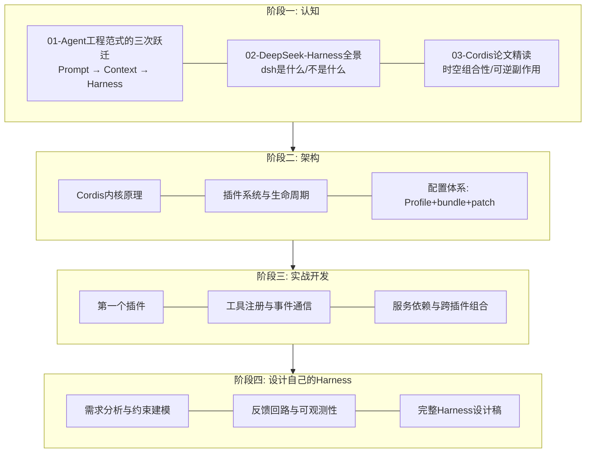

# DeepSeek Harness 教程库总目录

> 本目录是 RootStack 教程库中 DeepSeek Harness（dsh）系列教程的总索引。
> 系列覆盖范围：从 Agent 工程范式的认知建立，到 Cordis 内核架构解析，再到插件实战与自建 Harness 设计。

---

## 1. 定位声明

**本教程不是 dsh 的使用手册。**

如果你只是想快速上手 dsh——怎么安装、怎么配 API key、怎么启动 Web UI、有哪些命令行参数——请直接阅读速查文档 [[dsh|dsh.md]]，那里以最短路径给出全部操作要点，本教程不重复这些内容。

**本教程是框架学习教程。** 它回答的问题不是"dsh 怎么用"，而是：

- 为什么 2026 年行业共识是"瓶颈在 Harness 不在模型"？
- Agent = Model + Harness 这个公式里，Harness 到底承担了什么？
- Cordis 内核为什么把"可逆副作用"和"时空组合性"作为第一等公民？论文背后的设计思想是什么？
- 如果让你从零设计一个 Agent Harness，架构应该长什么样？

换言之：[[dsh|dsh.md]] 教你**开车**，本教程教你**发动机原理与整车设计**。

三条主线贯穿全库：

1. **架构思想线**：Harness Engineering 范式 → Cordis 内核原理 → 插件系统机制；
2. **论文解析线**：《A Programming Paradigm for Spatiotemporal Composability》逐概念精读，并与 C/C++ 读者熟悉的 RAII、微内核、IPC 等概念对照；
3. **动手实践线**：在 dsh 上写真实插件，最终独立设计自己的 Harness。

读者假设：具备 C/C++ 背景。教程会大量使用操作系统与系统编程的类比（例如把 Cordis 的 Fiber 类比为带生命周期的协程对象，把事件总线类比为 IPC 机制），但不要求 TypeScript 功底——所有代码示例完整可运行并附中文注释。

---

## 2. 系列结构图

四阶段递进：认知 → 架构 → 实战 → 设计。

各阶段的关系不是简单的先后，而是螺旋上升：实战中遇到的生命周期问题会迫使你回头重读论文；设计自己 Harness 时会发现阶段一的范式判断直接决定技术选型。

---

## 3. 各章一览表

| 章节 | 文件 | 核心问题 |
|------|------|----------|
| 1-01 | [[deepseek-harness/1认知/01-Agent工程范式的三次跃迁\|Agent工程范式的三次跃迁]] | 为什么说 2026 年的瓶颈在 Harness 不在模型智能？三次范式各自解决什么问题、又被什么取代？ |
| 1-02 | [[deepseek-harness/1认知/02-DeepSeek-Harness全景\|DeepSeek-Harness 全景]] | dsh 在 Agent 工具生态中的精确坐标是什么？它与 Claude Code、LangGraph 类框架的本质差异在哪？ |
| 1-03 | [[deepseek-harness/1认知/03-Cordis论文精读\|Cordis 论文精读]] | 时空组合性是什么？可逆副作用模型如何解决传统插件系统的耦合与泄漏问题？ |
| 2-01 | [[deepseek-harness/2架构/01-Cordis内核原理\|Cordis 内核原理]] | Context/Fiber/Service/Event 四大抽象如何在运行时协作？"无特权内核"怎样实现？ |
| 2-x | 后续章节撰写中 | 插件生命周期、配置分层、Trajectory 可观测性等主题将陆续补全 |
| 3-x | 实战开发（撰写中） | 从零写一个 dsh 插件的完整流程 |
| 4-x | 设计自己的 Harness（撰写中） | 综合运用全部知识，输出一份可落地的 Harness 设计 |

已完成的章节均可在对应子目录中找到；标注"撰写中"的条目列出仅为展示规划路线，链接尚未生成。

---

## 4. 推荐学习路径

不同背景与目标的读者，入口和侧重点不同。以下给出三条经过设计的路径。

### 路径一：研究者路线

适合：AI 研究、Agent 评测方向，关心"为什么"多于"怎么做"。

- 重点读 **1-01**（建立 Harness Engineering 的历史坐标）与 **1-03**（论文思想解读）；
- 读完后应直接去读论文原文与本库的解读互相印证；
- 架构篇重点看与论文概念对应的实现映射，实战篇可跳过；
- 补充阅读：LangChain Terminal Bench 案例与 OpenAI 百万行代码实验的一手材料（见 1-01 中的引用）。

### 路径二：插件开发者路线

适合：想在 dsh 上开发工具、扩展能力的工程师。

- 先用 [[dsh|dsh.md]] 把环境跑通，再进入本库；
- **1-02** 帮你建立全局认知，避免在错误的形态（比如该用 headless 却用 Web UI）上浪费时间；
- **2 架构篇**是核心，尤其是 Cordis 内核原理——不理解 Context 与 Fiber 就写不出不泄漏的插件；
- **3 实战篇**逐章跟做；1-03 论文精读可在遇到生命周期诡异问题时回头补读。

### 路径三：造轮子路线

适合：想自研 Agent Harness 或深入理解 Harness 内部机制的读者。这是本库的完整路线。

- 四个阶段全读，其中 **4 设计自己的 Harness** 是终点也是检验：能否独立完成一份约束建模、反馈回路、可观测性齐备的 Harness 设计稿；
- 阶段一不要跳：范式判断错误会导致整个自研项目方向性浪费（例如在需要强约束反馈的场景里只做了 Prompt 封装）；
- 建议边读边在 scratch 仓库里做最小复现，C/C++ 读者可以先用自己熟悉的语言实现 1-03 中的可逆副作用模型作为热身。

---

## 5. 相关教程

本库内与 dsh 学习直接相关的其他教程：

| 教程 | 关联 | 说明 |
|------|------|------|
| [[dsh\|dsh.md]] | 强关联 | dsh 速查手册：安装、启动、常用命令。本教程的实操前置 |
| [[npm\|npm.md]] | 强关联 | dsh 通过 npm 发布（`@deepseek-ai/dsh`），monorepo 用 pnpm 管理插件；包管理基础必读 |
| [[VSCODE的配置与使用\|VSCODE的配置与使用]] | 弱关联 | 阅读 dsh 源码（TypeScript monorepo）时的编辑器环境配置 |
| [[AI_Agent工具使用教程\|AI_Agent工具使用教程]] | 弱关联 | Agent 工具使用的通识内容，可与 1-01 的范式部分互相参照 |

---

## 6. 外部资源

| 资源 | 地址 | 说明 |
|------|------|------|
| 官网 | https://deepseek.com/harness | DeepSeek Harness 官方站点 |
| GitHub 仓库 | https://github.com/deepseek-ai/deepseek-harness | 主仓库，monorepo 结构，MIT 协议 |
| 官方文档 | 见主仓库 `docs/` 目录 | monorepo 内含 docs 子目录 |
| Cordis 框架 | https://github.com/cordiverse/cordis | dsh 底层插件框架 |
| Cordis 论文 | https://github.com/cordiverse/paper | 《A Programming Paradigm for Spatiotemporal Composability》原文 |
| Discord | 见官网页脚入口 | 社区讨论与开发者预览版反馈渠道 |
| Python SDK | `pip install deepseek-harness-sdk` | PyPI 包，headless/嵌入式集成用 |

> 注意：dsh 目前处于开发者预览（developer preview）阶段，API 可能存在破坏性变更，生产使用需谨慎评估。
