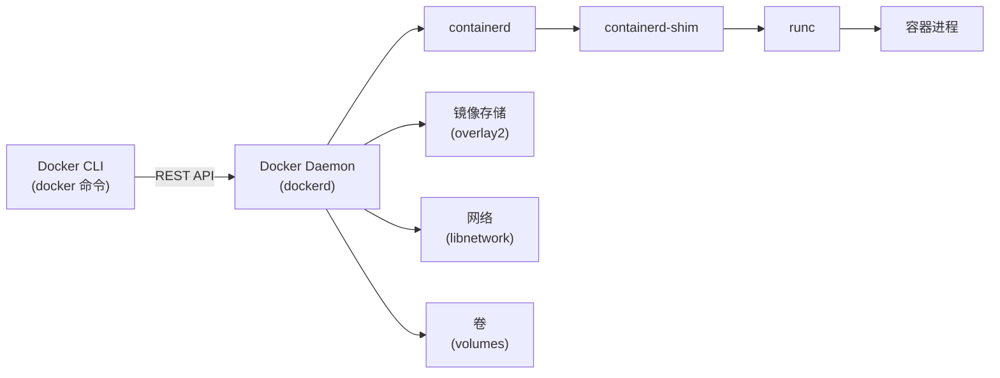
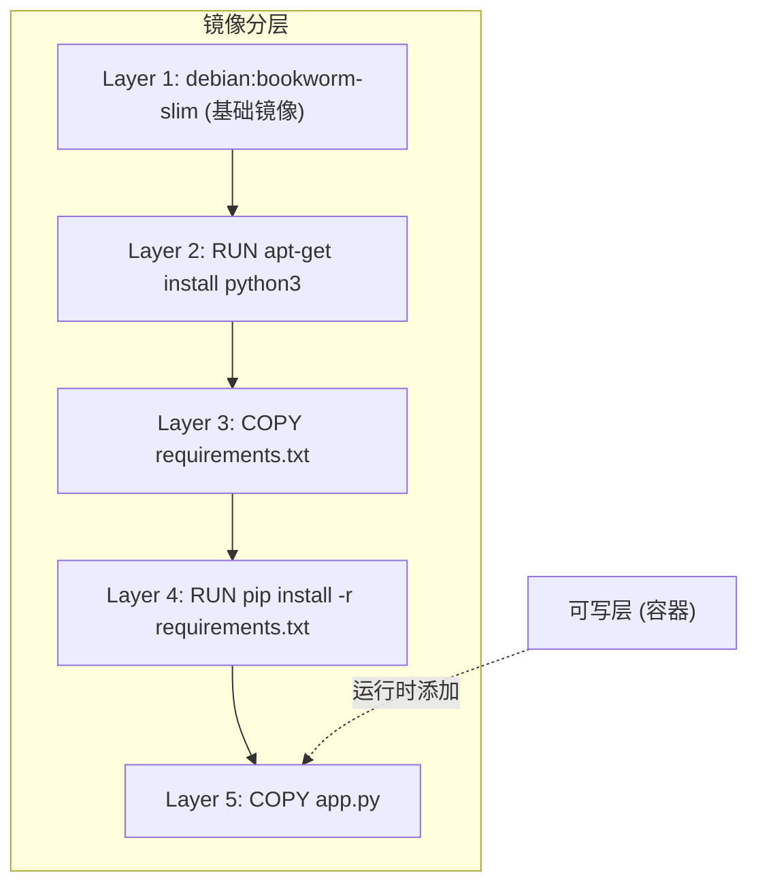
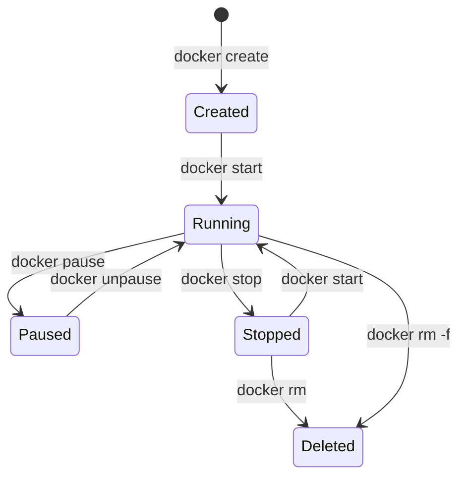

# 2. Docker 核心概念与架构

## 2.1 Docker 架构总览

Docker 采用客户端-服务器架构，核心组件通过分层协作完成容器的创建和管理。



### 各组件职责

| 组件 | 职责 |
|------|------|
| Docker CLI (docker) | 用户接口，发送命令 |
| Docker Daemon (dockerd) | 管理镜像、容器、网络、卷 |
| containerd | 容器生命周期管理 |
| containerd-shim | 每个容器一个 shim，解耦 daemon |
| runc | OCI 运行时，创建容器进程 |

### 通信机制

Docker CLI 通过 Unix Socket 或 TCP 与 Docker Daemon 通信：

```bash
# 默认 Unix Socket
ls -la /var/run/docker.sock

# 验证 CLI 与 Daemon 连接
docker info --format '{{.ServerVersion}}'

# 查看 Docker 守护进程监听的地址
ps aux | grep dockerd
```

### 验证组件版本

```bash
docker version
docker info | grep -E "Server|Storage|Logging|Cgroup"
containerd --version
runc --version
```

### 架构优势

- **解耦设计**：CLI 与 Daemon 分离，支持远程管理
- **插件化**：存储驱动、网络驱动均可替换
- **标准化**：遵循 OCI 标准，兼容多种运行时

---

## 2.2 镜像（Image）

### 镜像是什么

- 只读模板，包含运行应用所需的一切（代码、运行时、库、配置）
- 类比：类（Class） -> 对象（Object） = 镜像 -> 容器
- 镜像不可变，确保环境一致性

### 分层存储原理

Docker 镜像采用分层（Layer）结构，每一层只记录与上一层的差异：



- 每条 Dockerfile 指令创建一个新层
- 层是只读的，多个容器可以共享同一层
- 容器启动时在最顶层添加一个可写层
- 删除容器时，可写层被丢弃，镜像层不受影响

### UnionFS / overlay2

Docker 使用联合文件系统（UnionFS）将只读层和可写层合并为统一视图。现代 Docker 默认使用 overlay2 驱动：

```bash
# 确认当前存储驱动
docker info | grep "Storage Driver"

# 查看镜像分层详情
docker image inspect nginx:alpine --format '{{.RootFS.Layers}}'

# 查看每层大小和创建命令
docker history nginx:alpine

# 查看 overlay2 目录结构
ls -la /var/lib/docker/overlay2/
```

### 镜像标识

- 镜像名：`nginx:latest`（仓库名:标签）
- 镜像 ID：sha256 哈希（`docker images` 可见）
- Digest：内容寻址，唯一标识某个特定层组合

```bash
# 通过 ID 操作镜像
docker rmi 3f8a00f137a0

# 通过 Digest 精确引用
docker pull nginx@sha256:abc123...

# 给镜像打多个标签
docker tag nginx:latest myregistry/nginx:stable
docker tag nginx:latest myregistry/nginx:v1.0
```

### 镜像最佳实践

- 选择小基础镜像（alpine、slim、distroless）
- 合并 RUN 指令减少层数
- 利用构建缓存，将不常变动的指令放前面
- 使用 .dockerignore 排除无关文件

---

## 2.3 容器（Container）

### 容器是什么

- 镜像的运行实例
- 在镜像层之上添加一个可写层
- 进程隔离（PID/Network/Mount/UTS/IPC/User namespaces）
- 容器是一次性的，停止后状态保留但进程已终止

### 容器生命周期



### 常用容器操作

```bash
# 创建并启动
docker run -d --name web nginx:alpine

# 查看运行中的容器
docker ps

# 查看所有容器（包括已停止）
docker ps -a

# 停止容器（发送 SIGTERM，超时后 SIGKILL）
docker stop web

# 启动已停止的容器
docker start web

# 进入运行中的容器
docker exec -it web sh

# 查看容器日志
docker logs -f web

# 强制删除容器
docker rm -f web
```

### PID 1 与信号处理

容器内 PID 1 的进程负责处理信号，这直接影响容器的优雅停止：

```bash
# 容器内 PID 1 的进程负责处理信号
# docker stop 发送 SIGTERM -> 等待 -> SIGKILL
# 在 Dockerfile 中使用 exec 格式确保信号正确传递
ENTRYPOINT ["python", "app.py"]  # exec 格式，python 是 PID 1
ENTRYPOINT python app.py          # shell 格式，sh 是 PID 1，信号丢失
```

### 容器 vs 虚拟机

| 特性 | 容器 | 虚拟机 |
|------|------|--------|
| 隔离级别 | 进程级 | 硬件级 |
| 启动时间 | 毫秒~秒 | 秒~分钟 |
| 镜像大小 | MB 级 | GB 级 |
| 内核 | 共享宿主内核 | 独立内核 |
| 安全隔离 | 中等 | 强 |
| 资源占用 | 低 | 高 |
| 性能损耗 | 接近原生 | 有虚拟化开销 |

---

## 2.4 仓库（Registry）

### 仓库是什么

- 存储和分发镜像的服务
- 类比：GitHub 存储代码，Registry 存储镜像
- Docker Hub 是最大的公共仓库，但可搭建私有 Registry

### Docker Hub

```bash
# 搜索镜像
docker search nginx

# 拉取镜像
docker pull nginx:latest

# 推送镜像（需要登录）
docker login
docker tag my-app:latest myusername/my-app:latest
docker push myusername/my-app:latest

# 查看本地镜像
docker images
```

### 镜像命名规则

```
[registry_host[:port]/][namespace/]repository[:tag|@digest]

示例：
docker.io/library/nginx:latest          <- 官方镜像
docker.io/myuser/my-app:v1.0           <- 用户镜像
ghcr.io/owner/repo:tag                 <- GitHub Container Registry
registry.cn-hangzhou.aliyuncs.com/myapp:v1  <- 阿里云
192.168.1.100:5000/myapp:latest        <- 私有 Registry
```

### 搭建私有 Registry

```bash
# 快速启动一个 Registry 容器
docker run -d -p 5000:5000 --name registry \
  -v /data/registry:/var/lib/registry \
  registry:2

# 推送镜像到私有 Registry
docker tag my-app:latest localhost:5000/my-app:latest
docker push localhost:5000/my-app:latest

# 从私有 Registry 拉取
docker pull localhost:5000/my-app:latest
```

### 镜像标签策略

- `latest`：最新版，但不保证稳定，生产环境慎用
- 版本号：`v1.0.3`，明确指定版本
- Git SHA：`abc1234`，精确到提交
- Digest：`@sha256:...`，内容不可变引用

---

## 2.5 Docker Daemon

### 启动方式

```bash
# systemd 管理（推荐）
sudo systemctl start docker
sudo systemctl enable docker

# 手动启动（调试用）
dockerd --debug

# 查看日志
journalctl -u docker.service -f
```

### 配置文件

```json
// /etc/docker/daemon.json
{
  "storage-driver": "overlay2",
  "log-driver": "json-file",
  "log-opts": {
    "max-size": "10m",
    "max-file": "3"
  },
  "registry-mirrors": [
    "https://mirror.ccs.tencentyun.com"
  ]
}
```

```bash
# 修改配置后重启
sudo systemctl daemon-reload
sudo systemctl restart docker
```

### 远程访问（TLS）

```bash
# 生成证书
openssl req -x509 -newkey rsa:4096 -sha256 -days 365 \
  -nodes -keyout ca-key.pem -out ca-cert.pem -subj "/CN=docker-host"

# 配置 daemon
# /etc/docker/daemon.json
{
  "hosts": ["unix:///var/run/docker.sock", "tcp://0.0.0.0:2376"],
  "tls": true,
  "tlscacert": "/etc/docker/ca-cert.pem",
  "tlscert": "/etc/docker/server-cert.pem",
  "tlskey": "/etc/docker/server-key.pem"
}

# 客户端连接
export DOCKER_HOST=tcp://docker-host:2376
export DOCKER_TLS_VERIFY=1
export DOCKER_CERT_PATH=/path/to/certs
docker ps
```

---

## 2.6 containerd 与 runc

### OCI 标准

- Open Container Initiative：容器运行时标准
- 定义了镜像格式和运行时规范
- runc 是 OCI 参考实现
- 所有主流容器运行时都遵循 OCI 标准

### 运行时层次

```
dockerd -> containerd -> containerd-shim -> runc -> 容器进程
                                        |
                              runc 创建完容器后退出
                              containerd-shim 接管
                              （每个容器一个 shim，解耦 daemon）
```

### 为什么要 shim

- runc 创建容器后退出，shim 成为容器的父进程
- daemon 重启不影响正在运行的容器
- shim 负责 stdin/stdout 的转发和容器退出状态收集

### 验证

```bash
# 查看容器的 PID
docker inspect --format '{{.State.Pid}}' <container>
# 用宿主机 ps 查看
ps aux | grep <pid>
# 会看到 containerd-shim -> 容器进程 的父子关系

# 查看 shim 进程
ps aux | grep containerd-shim
```
