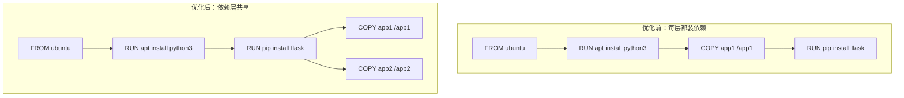

# 镜像原理与管理

## 4.1 镜像分层机制

### 为什么分层



- 多个镜像共享相同的基础层，节省磁盘空间
- 构建时只重建变化的层，加速构建
- 传输时只传输缺失的层，加速推送/拉取

### 只读层 + 可写层

```bash
# 镜像层是只读的，容器启动时在最上层加一个可写层
docker run -it ubuntu bash
# 在容器内创建文件
touch /new_file
# 退出后这个文件在可写层，原始镜像不变

# 查看容器的可写层变化
docker diff <container_id>

# C = 新增文件, A = 修改文件, D = 删除文件
```

### 查看层信息
```bash
# 查看镜像所有层
docker history nginx:alpine

# 查看层大小和指令
docker history --no-trunc nginx:alpine

# 查看层 ID
docker image inspect nginx:alpine --format '{{.RootFS.Layers}}'

# 层的存储位置
ls /var/lib/docker/overlay2/
```

### 层的共享与回收
```bash
# 查看镜像实际磁盘占用
docker system df -v

# 删除未使用的层
docker image prune

# 删除所有未使用的镜像
docker image prune -a
```

## 4.2 构建镜像

### 构建上下文
```bash
# docker build 命令最后的 . 是构建上下文路径
docker build -t myapp:latest .
# Docker 会将当前目录的所有文件发送给 daemon
# .dockerignore 中的文件会被排除

# 指定其他目录作为上下文
docker build -t myapp:latest -f /path/to/Dockerfile /path/to/context

# 使用 stdin 传入 Dockerfile（无上下文）
docker build -t myapp:latest - < Dockerfile
```

### 构建缓存
```bash
# BuildKit 缓存机制
# 当某层的指令和输入没变化时，直接使用缓存
# 一旦某层变化，后续所有层都要重建

# 禁用缓存
docker build --no-cache -t myapp:latest .

# 查看构建缓存
docker builder du
docker builder prune  # 清理缓存
```

### 构建参数
```bash
# ARG：构建时变量（只在 Dockerfile 中有效）
docker build --build-arg VERSION=1.0 --build-arg ENV=prod -t myapp .

# 多平台构建
docker buildx create --use
docker buildx build --platform linux/amd64,linux/arm64 -t myapp:latest .

# 本地加载构建结果
docker buildx build --platform linux/amd64 -t myapp:latest --load .
```

### 从容器创建镜像
```bash
# 从运行中的容器创建镜像
docker commit <container_id> myimage:snapshot

# 带注释的提交
docker commit -m "Added config" -a "admin" <container_id> myimage:v2
```

## 4.3 标签策略

### 语义化版本
```bash
# 推荐：精确版本号
docker tag myapp:latest myapp:1.2.3
docker tag myapp:latest myapp:1.2
docker tag myapp:latest myapp:1

# latest 的陷阱
# latest 不是"最新版"，只是默认标签
# 别人可能推送了不同的 latest
docker pull myapp:latest  # 不确定拿到的是哪个版本
docker pull myapp:1.2.3   # 确定版本
```

### 标签最佳实践
```bash
# 生产环境：用精确版本号
docker pull myapp:1.2.3

# 开发环境：用 git hash
docker tag myapp:latest myapp:abc1234

# 多架构标签
docker buildx build --platform linux/amd64,linux/arm64 \
  -t myapp:1.2.3 --push .
```

### 清理旧标签
```bash
# 查看所有标签
docker images --format "{{.Repository}}:{{.Tag}} {{.Size}}"

# 删除特定标签（只删除标签，不影响其他标签引用的层）
docker rmi myapp:old-tag
```

## 4.4 多阶段构建详解

### 为什么需要多阶段
```bash
# 问题：构建镜像包含编译工具，体积大
FROM golang:1.22
COPY . .
RUN go build -o server .
# 这个镜像包含整个 Go 工具链（~800MB）

# 解决：多阶段构建
# 构建阶段
FROM golang:1.22 AS builder
WORKDIR /app
COPY go.mod go.sum ./
RUN go mod download
COPY . .
RUN CGO_ENABLED=0 go build -o server .

# 运行阶段
FROM alpine:3.19
RUN apk add --no-cache ca-certificates
COPY --from=builder /app/server /server
ENTRYPOINT ["/server"]
# 最终镜像只有 ~15MB
```

### 多语言示例
```dockerfile
# Python 多阶段构建
FROM python:3.12-slim AS builder
WORKDIR /app
COPY requirements.txt .
RUN pip install --no-cache-dir --prefix=/install -r requirements.txt

FROM python:3.12-slim
COPY --from=builder /install /usr/local
COPY . /app
WORKDIR /app
CMD ["python", "app.py"]
```

```dockerfile
# Node.js 多阶段构建
FROM node:20-alpine AS builder
WORKDIR /app
COPY package*.json ./
RUN npm ci
COPY . .
RUN npm run build

FROM node:20-alpine
WORKDIR /app
COPY --from=builder /app/dist ./dist
COPY --from=builder /app/node_modules ./node_modules
CMD ["node", "dist/server.js"]
```

```dockerfile
# Java 多阶段构建
FROM maven:3.9-eclipse-temurin-21 AS builder
WORKDIR /app
COPY pom.xml .
RUN mvn dependency:go-offline
COPY src ./src
RUN mvn package -DskipTests

FROM eclipse-temurin:21-jre-alpine
COPY --from=builder /app/target/*.jar /app.jar
ENTRYPOINT ["java", "-jar", "/app.jar"]
```

## 4.5 缓存优化

### 分层顺序优化
```dockerfile
# 错误顺序：每次改代码都要重新装依赖
COPY . .
RUN pip install -r requirements.txt

# 正确顺序：依赖不变时用缓存
COPY requirements.txt .
RUN pip install -r requirements.txt
COPY . .
```

### BuildKit 缓存挂载
```dockerfile
# syntax=docker/dockerfile:1
# 依赖安装使用缓存挂载，不随层变化失效
RUN --mount=type=cache,target=/var/cache/apt \
    apt-get update && apt-get install -y python3

RUN --mount=type=cache,target=/root/.cache/pip \
    pip install -r requirements.txt

# Go 模块缓存
RUN --mount=type=cache,target=/go/pkg/mod \
    --mount=type=cache,target=/root/.cache/go-build \
    go build -o server .
```

### .dockerignore
```dockerignore
.git
.gitignore
node_modules
__pycache__
*.pyc
.env
*.md
Dockerfile
docker-compose.yml
.vscode
.idea
```

## 4.6 推送到 Registry

### Docker Hub
```bash
docker login -u myusername
docker tag myapp:latest myusername/myapp:1.0
docker push myusername/myapp:1.0
```

### GitHub Container Registry
```bash
docker login ghcr.io -u myusername
docker tag myapp:latest ghcr.io/myusername/myapp:1.0
docker push ghcr.io/myusername/myapp:1.0
```

### 私有 Registry
```bash
docker login 192.168.1.100:5000
docker tag myapp:latest 192.168.1.100:5000/myapp:1.0
docker push 192.168.1.100:5000/myapp:1.0
```

### Registry 管理
```bash
# 登出
docker logout ghcr.io

# 查看镜像摘要（用于不可变引用）
docker inspect --format '{{index .RepoDigests 0}}' myapp:1.0
```

### 镜像签名与安全扫描
```bash
# 使用 Docker Content Trust 签名
export DOCKER_CONTENT_TRUST=1
docker push myusername/myapp:1.0

# 扫描镜像漏洞
docker scout cves myapp:1.0
```

## 4.7 镜像导入导出

### save/load（镜像级别）
```bash
# 导出镜像（包含所有层）
docker save -o nginx.tar nginx:latest
docker save nginx:latest | gzip > nginx.tar.gz  # 压缩

# 导入镜像
docker load -i nginx.tar
docker load < nginx.tar.gz

# 适用场景：离线传输、备份
```

### export/import（容器文件系统）
```bash
# 导出容器文件系统（单层）
docker export mycontainer > container.tar

# 导入为新镜像
docker import container.tar myimage:latest

# 区别：export 丢失元数据（CMD/ENTRYPOINT/ENV 等）
# 适用场景：从运行中的容器创建快照
```

### 镜像迁移实战
```bash
# 在 A 机器导出
docker save myapp:1.0 mydb:5.7 | gzip > images.tar.gz

# 传输到 B 机器
scp images.tar.gz user@b-machine:/tmp/

# 在 B 机器导入
docker load < images.tar.gz

# 验证导入结果
docker images | grep -E "myapp|mydb"
```

## 4.8 镜像安全最佳实践

### 使用最小基础镜像
```bash
FROM alpine:3.19        # ~5MB
FROM debian:bookworm-slim  # ~80MB
FROM ubuntu:24.04       # ~77MB
```

### 非 root 运行
```dockerfile
RUN addgroup -S appgroup && adduser -S appuser -G appgroup
USER appuser
```

### 只读文件系统
```bash
docker run --read-only --tmpfs /tmp myapp:1.0

docker run --read-only \
  -v /app/data:/data:rw \
  -v /tmp:/tmp:rw \
  myapp:1.0
```

### 定期更新基础镜像
```bash
docker pull python:3.12-slim
docker history python:3.12-slim
```
