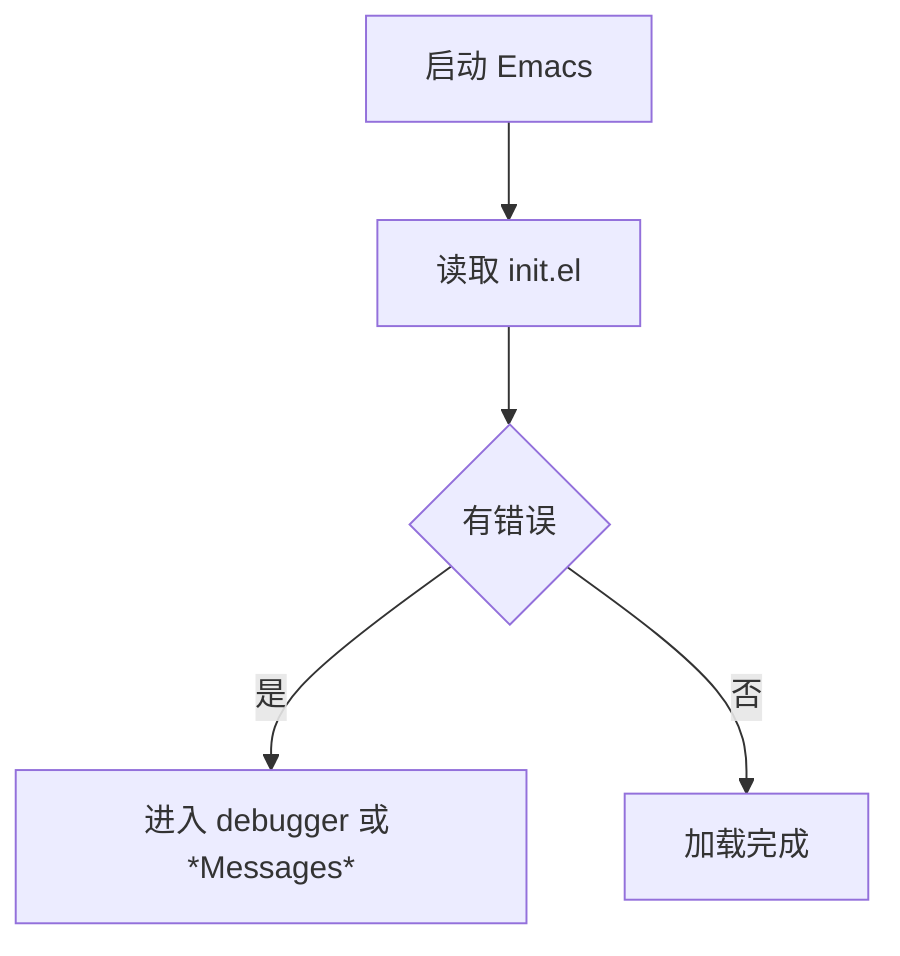

# RootStack「Emacs 教程」写作规范（内部文件，全部写完后删除）

本文件是给各章节作者的统一规范。写完对应章节后**不要**修改本文件。

## 一、项目背景

RootStack 是一套以 C 语言为出发点、覆盖多领域多语言的百科全书式中文教程仓库，使用 Obsidian 的双向链接 `[[文件名]]` 组织内容，并通过 Quartz 构建成静态站点 rootstack.misser.top。

新增模块目录为 `emacs教程/`，结构如下（共 48 篇）：

```
emacs教程/
├── emacs目录.md                        总索引（由主笔统一撰写，其他作者不要写）
├── 1入门/                              Emacs 从零开始
│   ├── 00_认识Emacs.md                 01_安装与启动.md
│   ├── 02_内置教程与基本操作.md         03_配置文件从零开始.md
│   ├── 04_包管理与use-package.md        05_从Vim迁移.md
├── 2Elisp语言/                         Elisp 语言教程
│   ├── 00_学习资源与视频.md             01_求值与数据类型.md
│   ├── 02_变量作用域与绑定.md           03_函数闭包与宏.md
│   ├── 04_列表序列与哈希表.md           05_控制流错误处理与迭代.md
│   ├── 06_缓冲区文本与点.md             07_文本属性与Overlay.md
│   ├── 08_命令与键位映射.md             09_Mode与Hook机制.md
│   ├── 10_包与命名空间实践.md           11_调试与性能剖析.md
├── 3配置实践/
│   ├── 01_配置工程化.md                 02_主题字体与美化.md
│   ├── 03_键位系统设计.md               04_界面布局与功能位置.md
│   ├── 05_自定义功能开发.md             06_多机同步与配置分发.md
├── 4插件开发/
│   ├── 01_插件结构与生命周期.md         02_编写MinorMode.md
│   ├── 03_编写MajorMode与语法高亮.md    04_测试打包与发布MELPA.md
├── 5开发环境集成/
│   ├── 01_补全与LSP.md                  02_编译器集成.md
│   ├── 03_运行器与构建任务.md           04_调试器集成.md
│   ├── 05_Git与Magit.md                 06_终端Shell与远程开发.md
│   ├── 07_OrgMode效率系统.md            08_主流语言配置实战.md
├── 6扩展应用/
│   ├── 01_内置浏览器EWW.md              02_媒体播放器EMMS与MPV.md
│   ├── 03_虚拟机与容器管理.md           04_邮件RSS与阅读.md
│   ├── 05_文件管理与笔记系统.md         06_AI助手集成.md
└── 7进阶/
    ├── 01_启动加速与性能优化.md         02_NativeComp与字节码.md
    ├── 03_TRAMP远程开发.md              04_常见故障排查.md
    └── 05_生态社区与进阶路线.md
```

## 二、硬性规范

### 1. 禁止 emoji 与装饰性符号

不得出现 emoji（含 U+1F300-U+1FAFF、U+2600-U+26FF、U+2700-U+27BF、U+2B00-U+2BFF、U+FE0F），也不要用 ✓ ✗ ✔ ★ 这类符号代替。用「支持 / 不支持」「是 / 否」「已完成 / 未完成」等文字表达。

允许使用的符号：箭头 `→`、项目符号 `-`、表格竖线、代码块反引号、`>` 引用块。

自检命令（必须执行，输出为空才合格）：

```bash
grep -nP '[\x{1F300}-\x{1FAFF}\x{2600}-\x{26FF}\x{2700}-\x{27BF}\x{2B00}-\x{2BFF}\x{FE0F}]' 你的文件
```

### 2. 语言与术语

- 简体中文正文，句子完整，不用口语化的"超好用""神器"之类夸张词。
- 关键术语首次出现给出英文原词与中文解释，例如「缓冲区（buffer）」「窗口（window）」「框架（frame）」「钩子（hook）」。Emacs 术语的 buffer/window/frame 含义与常见理解不同，必须在正文里明确区分。
- 键位统一写成 `C-x C-f`、`M-x`、`M-:`、`RET`、`TAB`、`SPC`、`ESC`、`S-`、`C-M-`、`C-c p` 形式；不要写 `^X`、`Ctrl+X`、`Alt+X`（首次解释键位语法时可以并列说明一次）。
- 命令行提示符统一用 `$`（普通用户）与 `#`（root）。

### 3. 版本基线

- 以 **GNU Emacs 30** 为准，同时兼容 Emacs 29；涉及版本差异（如 `use-package` 在 29 起内置、`which-key` 在 30 起内置、`C-h` 前缀变化、native-comp、`tree-sitter` 内置等）必须注明。
- 三平台覆盖：GNU/Linux（Debian/Ubuntu 与 Arch）、macOS（Homebrew）、Windows（winget/scoop/官方 zip + WSL 说明）。涉及路径时同时给出 `~/.emacs.d/`、`~/.config/emacs/` 与 Windows 的 `%APPDATA%\`。
- 配置文件名统一讨论 `~/.emacs.d/init.el`（也说明 `~/.config/emacs/init.el` 与旧式 `~/.emacs` 的关系）。

### 4. 文件格式模板

````markdown
# 章节标题

> 一句话说明本篇解决什么问题、适合谁读。

---

## 一、xxx

### 1.1 xxx

正文、代码、表格。

```elisp
;; 代码注释用中文，说明这行在做什么
(setq inhibit-startup-screen t)
```

---

## 二、xxx

（同上）

---

## 小结

- 三条以内的要点回顾。

---

## 相关章节

- [[emacs教程/1入门/03_配置文件从零开始|配置文件从零开始]]
- [[emacs教程/2Elisp语言/01_求值与数据类型|Elisp 求值与数据类型]]
````

- 一级标题只有一个，即 `# 章节标题`。
- 二级标题用 `## 一、`、`## 二、`……；三级标题用 `### 1.1`、`### 1.2`……（编号与所属章节无关，可从头编）。
- 用 `---` 分隔大节。
- **篇幅要求**：每篇 400 行以上（含代码块），纯正文（不含代码）不少于 250 行。宁深不浅，但不要灌水复读。目标文件体积 15-25KB。
- 开头不要写"本文将介绍……"这类空话，直接进入实质内容。

### 5. 渲染图（Mermaid）

每篇至少 2 个 Mermaid 图，用来表达流程、结构、状态、时序或类关系。要求：

- 仅使用以下图型：`graph TD`、`flowchart TD`、`sequenceDiagram`、`stateDiagram-v2`、`classDiagram`、`erDiagram`、`gantt`、`pie`。不要用 `mindmap`、`timeline`、`quadrantChart`（Quartz 渲染支持不确定）。
- 节点标签含中文、空格、括号时必须加引号：`A["配置文件加载顺序"]`。
- 图内不要放 emoji、不要放 `<br>`、不要放 Markdown 语法。
- 图前后各留一个空行，代码块语言标注必须是 `mermaid`。

示例：



### 6. 代码块语言标注

`elisp`、`bash`、`powershell`、`cmd`、`python`、`c`、`cpp`、`rust`、`java`、`json`、`yaml`、`toml`、`text`、`org`、`sql`、`vim`。Elisp 代码一律用 `elisp`。

### 7. 技术正确性要求（最重要）

- 所有函数名、变量名、键位、包名、命令、文件路径必须真实存在且用法正确。**不确定就不要写**，绝对不要编造包名或函数名。
- Elisp 示例必须语法正确、括号配平；能用 `emacs -Q --batch --eval` 验证的示例优先给出可验证形式。
- 提及第三方包时给出 MELPA/GNU ELPA 上真实的包名，安装命令写成 `M-x package-install RET 包名 RET`。
- 不要把 Emacs 内置功能说成需要装包，也不要把已废弃包（如 `helm` 已不活跃、`company` 仍在维护、`ivy/counsel` 与 `vertico/consult` 的取舍）说错。

### 8. 外部链接必须校验

- 引用外部资料必须给完整 URL，并**用 curl 校验返回 2xx/3xx**：

```bash
curl -s -o /dev/null -w '%{http_code}\n' -m 15 -L -A 'Mozilla/5.0' "URL"
```

- 校验不通过（502 多为 GitHub 限流，可重试一次换 GET；404 则是真错）就换成真实存在的地址，或删掉该条。**宁可少给链接，也不要给不存在的链接。**
- 国内不易访问的资源（YouTube、GitHub）可以给，但要注明可能需要网络代理，并尽量补充一个可替代的中文来源。

### 9. 双链接写法

- 教程内部：`[[emacs教程/3配置实践/03_键位系统设计|键位系统设计]]`（路径相对仓库根目录，不带 `.md`）。
- 跨模块：`[[vim教程|Vim 编辑器教程]]`、`[[linux/README|Linux 教程]]`、`[[VSCODE的配置与使用|VS Code 配置与使用]]`、`[[dsh|DeepSeek Harness 教程]]`、`[[git|Git 与 GitHub 指南]]`。
- 只链接确实存在的文件。仓库已有：`vim教程.md`、`VSCODE的配置与使用.md`、`linux/`、`c语言教程/`、`cpp教程/`、`python/`、`rust/`、`java/`、`dart/`、`git.md`、`npm.md`、`dsh.md`、`docker/`、`lua-tutorial/`、`bash/`、`数据结构/`、`算法/`、`计算机网络/`、`操作系统/`、`计算机原理/`、`汇编基础/`、`数据库/`、`内核/`、`red_team/`、`前端开发/`。

### 10. 允许引用的已核验链接（可直接使用，均已 curl 验证 200）

官方手册与文档：

- GNU Emacs 手册 https://www.gnu.org/software/emacs/manual/html_node/emacs/
- Elisp 参考手册 https://www.gnu.org/software/emacs/manual/html_node/elisp/
- Elisp 参考手册单页版 https://www.gnu.org/software/emacs/manual/html_mono/elisp.html
- 《Programming in Emacs Lisp》入门书 https://www.gnu.org/software/emacs/manual/html_node/eintr/
- Org 手册 https://orgmode.org/manual/
- Emacs Wiki https://www.emacswiki.org/
- Emacs 源码镜像 https://github.com/emacs-mirror/emacs
- MELPA https://melpa.org/ ／ GNU ELPA https://elpa.gnu.org/ ／ NonGNU ELPA https://elpa.nongnu.org/

配置与框架：

- Doom Emacs https://github.com/doomemacs/doomemacs
- Spacemacs https://github.com/syl20bnr/spacemacs
- Evil https://github.com/emacs-evil/evil ／ evil-collection https://github.com/emacs-evil/evil-collection
- Prelude https://github.com/bbatsov/prelude
- Purcell emacs.d https://github.com/purcell/emacs.d
- Centaur Emacs（中文作者）https://github.com/seagle0128/.emacs.d
- redguardtoo emacs.d（中文作者）https://github.com/redguardtoo/emacs.d
- use-package https://github.com/jwiegley/use-package
- straight.el https://github.com/radian-software/straight.el ／ elpaca https://github.com/progfolio/elpaca
- no-littering https://github.com/emacscollective/no-littering
- which-key https://github.com/justbur/emacs-which-key ／ hydra https://github.com/abo-abo/hydra
- vertico https://github.com/minad/vertico ／ consult https://github.com/minad/consult ／ corfu https://github.com/minad/corfu ／ marginalia https://github.com/minad/marginalia
- company https://github.com/company-mode/company-mode
- lsp-mode https://github.com/emacs-lsp/lsp-mode ／ dap-mode https://github.com/emacs-lsp/dap-mode
- tree-sitter-langs https://github.com/emacs-tree-sitter/tree-sitter-langs
- Magit https://github.com/magit/magit
- modus-themes https://github.com/protesilaos/modus-themes ／ doom-themes https://github.com/doomemacs/themes ／ catppuccin https://github.com/catppuccin/emacs
- doom-modeline https://github.com/seagle0128/doom-modeline ／ dashboard https://github.com/emacs-dashboard/emacs-dashboard
- vterm https://github.com/akermu/emacs-libvterm ／ eat https://codeberg.org/akib/emacs-eat
- EMMS https://www.gnu.org/software/emms/ ／ bongo https://github.com/dbrock/bongo
- docker.el https://github.com/Silex/docker.el ／ kubernetes-el https://github.com/kubernetes-el/kubernetes-el
- realgud https://github.com/realgud/realgud ／ quickrun https://github.com/emacsorphanage/quickrun
- 插件开发手册 https://github.com/alphapapa/emacs-package-dev-handbook
- helpful https://github.com/Wilfred/helpful ／ elisp-refs https://github.com/Wilfred/elisp-refs ／ Elsa https://github.com/emacs-elsa/Elsa
- eldev https://github.com/emacs-eldev/eldev ／ package-lint https://github.com/purcell/package-lint ／ elisp-lint https://github.com/gonewest818/elisp-lint ／ buttercup https://github.com/jorgenschaefer/emacs-buttercup ／ cask https://github.com/cask/cask

中文与学习资源：

- Emacs 中文社区论坛 https://emacs-china.org/
- 子龙山人《Spacemacs Rocks》 https://github.com/zilongshanren/Spacemacs-rocks
- 《一年成为 Emacs 高手》 https://github.com/redguardtoo/mastering-emacs-in-one-year-guide
- Emacs 文档中文翻译 https://github.com/lujun9972/emacs-document
- Emacs 101 新手指南 https://github.com/emacs-tw/emacs-101-beginner-survival-guide
- awesome-emacs https://github.com/emacs-tw/awesome-emacs
- elisp-guide https://github.com/chrisdone/elisp-guide
- Emacs Lisp 编程 https://github.com/caiorss/Emacs-Elisp-Programming
- Learn Elisp The Hard Way https://github.com/hypernumbers/learn_elisp_the_hard_way
- Learn X in Y minutes（Elisp 页）https://learnxinyminutes.com/docs/elisp/
- Mastering Emacs 博客 https://www.masteringemacs.org/
- Sacha Chua 周报 https://sachachua.com/blog/
- System Crafters 站点 https://systemcrafters.net/ ／ 频道 https://www.youtube.com/@SystemCrafters
- Emacs From Scratch 播放列表 https://www.youtube.com/playlist?list=PLEoMzSkcN8oPH1au7H6osFyg_tDDgvB4W
- Protesilaos 频道 https://www.youtube.com/@protesilaos
- Uncle Dave's Emacs https://www.youtube.com/@UncleDavesEmacs
- Emacs Elements https://www.youtube.com/@EmacsElements
- Mike Zamansky 频道 https://www.youtube.com/@mikezamansky ／ 博客 https://cestlaz.github.io/
- EmacsConf（每年会议录像）https://emacsconf.org/
- 子龙山人 Spacemacs Rocks 视频 https://www.bilibili.com/video/BV1fE411x7jc

如果还需要其他链接，必须自己 curl 校验后再写入。

### 11. 自检清单（提交前逐条执行）

```bash
F=你的文件路径
# 1) emoji 检查（应无输出）
grep -nP '[\x{1F300}-\x{1FAFF}\x{2600}-\x{26FF}\x{2700}-\x{27BF}\x{2B00}-\x{2BFF}\x{FE0F}]' "$F"
# 2) mermaid 围栏配平（应为偶数且 >= 4，即至少 2 个图）
grep -c '^```mermaid' "$F"
grep -c '^```' "$F"
# 3) 行数
wc -l "$F"
# 4) 外部链接逐个校验
grep -oP 'https?://[^ )">\]]+' "$F" | sort -u | while read -r u; do
  printf '%s %s\n' "$(curl -s -o /dev/null -w '%{http_code}' -m 15 -L -A 'Mozilla/5.0' "$u")" "$u"
done
# 5) 双链接目标存在性（对每个 [[路径]] 检查文件是否存在）
```

第 4 步出现 404 必须修正；502 重试一次，仍失败则换源。

第 5 步检查方法：

```bash
grep -oP '\[\[[^\]|]+' "$F" | sed 's/^\[\[//' | sort -u | while read -r t; do
  [ -e "$t" ] || [ -e "$t.md" ] && echo "OK  $t" || echo "MISS $t"
done
```
