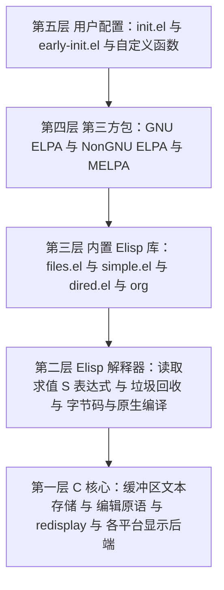
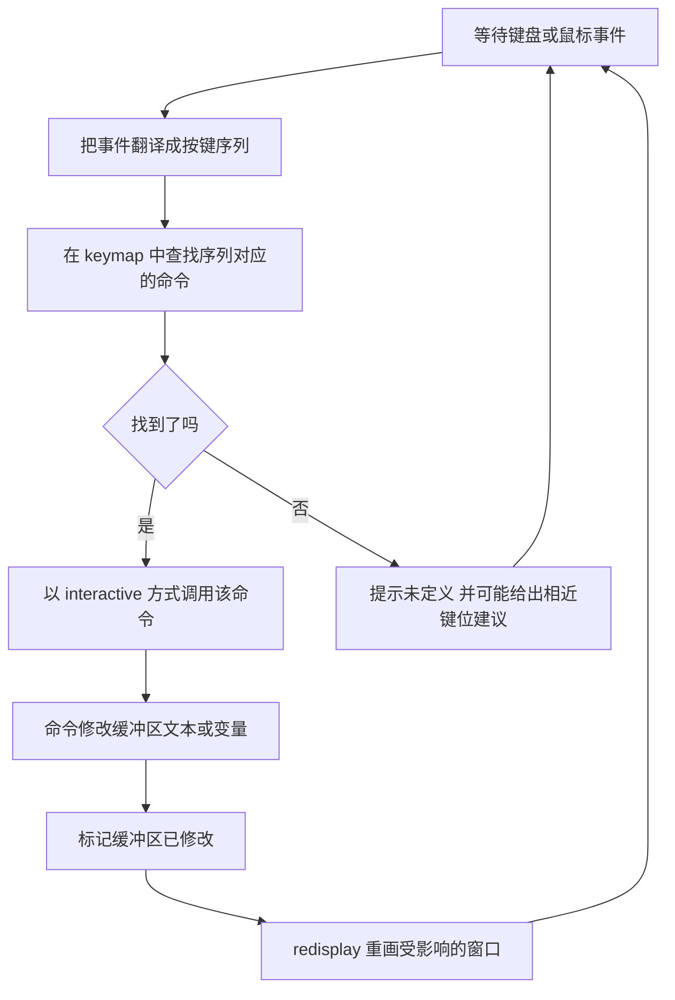
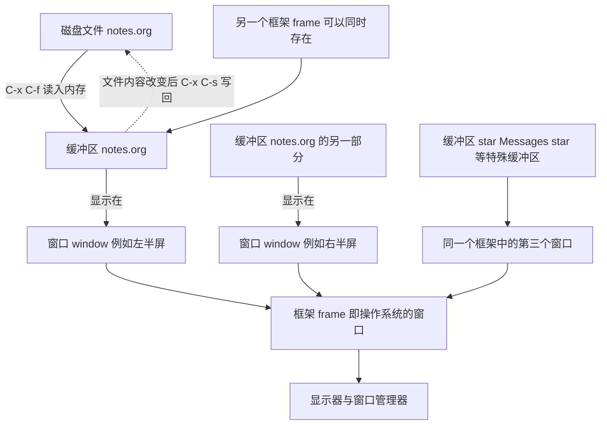

# 认识 Emacs

> 面向完全没用过 Emacs 的读者。本篇不教具体操作，而是把 Emacs 的历史、本质、术语体系和生态一次讲清，让你在动手之前就知道自己在学什么、为什么它的键位那么奇怪、以及它和 Vim、VS Code 到底差在哪里。读完本篇，你应该能在五分钟内决定"要不要学"，以及"从哪个发行版开始学"。

---

## 一、从 1976 年的一堆 TECO 宏说起

### 1.1 Emacs 最初不是程序，而是一套宏

1976 年，MIT 人工智能实验室的理查德·斯托曼（Richard Stallman）在 PDP-10 主机和 ITS 操作系统上使用 TECO 编辑器。TECO（Tape Editor and Corrector）本身是一个"一次处理一行命令"的编辑器，但它内置了一套可编程的宏语言，允许用户写宏来扩展自己。

斯托曼做的事情是：用 TECO 的宏语言写出一整套宏，把原本逐条敲编辑命令的方式，变成"按键直接触发一个功能"。这套宏在 1976 年年底就可以实际使用了，名字叫 EMACS，取自 Editing MACroS（编辑宏），同时也有一个流传很广的玩笑式解释：Escape Meta Alt Control Shift，正好概括了它大量使用修饰键的键位风格。Guy Steele 和 David Moon 参与了早期版本的编写。

Emacs 当时的设计目标写在 1981 年的 MIT 技术备忘录里：可扩展（extensible）、可定制（customizable）、自带文档（self-documenting）、实时显示（real-time display）。这四个词今天依然是对 Emacs 最准确的描述。

### 1.2 从 Gosling Emacs 到 GNU Emacs

TECO 宏版 Emacs 依赖 TECO，运行平台也局限在 PDP-10 这类机器上。1970 年代末到 1980 年代初，James Gosling 用 C 语言重新实现了一个 Emacs（Gosling Emacs，后来由 UniPress 公司商业化），它的扩展语言叫 Mocklisp。Mocklisp 名字里有 Lisp，但它并不是真正的 Lisp，缺少 Lisp 的核心语义，无法承担"用扩展语言重写整个编辑器"的任务。

1984 年，斯托曼开始为 GNU 项目开发一套全新的 Emacs：用 C 写核心，用一门完整的 Lisp 方言（Emacs Lisp，简称 Elisp）作为扩展语言。1985 年初先后有 1.0 到 1.12 版，1985 年 3 月 20 日发布并在 Usenet 上公开宣布的 GNU Emacs 13 是第一个面向公众的发行版。从此 Emacs 的扩展语言就是一门真正的 Lisp。

GNU Emacs 早期使用的是一份专门为它撰写的「Emacs 通用公共许可证」，它是后来 GNU 通用公共许可证（GPL）的前身。这一许可安排意味着：任何人都可以阅读、修改、再分发 Emacs 的源代码，但再分发时不能剥夺别人的同样权利。这是 Emacs 生态能持续四十年、并且一直允许用户"改到底层"的法律基础。

主要版本节点如下（日期取自 Emacs 源码树中的 `etc/HISTORY`）：

| 版本 | 日期 | 值得记住的变化 |
|------|------|----------------|
| GNU Emacs 13 | 1985-03-20 | 首个公开发行版 |
| GNU Emacs 20 | 1997 | 引入多语言环境与 MULE，中文处理能力成熟 |
| GNU Emacs 21 | 2001-10-20 | 图形界面显示引擎重写，支持可变宽字体与图像 |
| GNU Emacs 22 | 2007-06-02 | Org mode 与 Gnus 等大量功能并入 |
| GNU Emacs 23 | 2009-07-29 | 引入 font backend，终端与图形字体统一处理 |
| GNU Emacs 24 | 2012-06-10 | 内置包管理器 `package.el`，ELPA 生态起步 |
| GNU Emacs 25 | 2016-09-16 | 引入动态模块，支持让外部 C 库直接扩展 Emacs |
| GNU Emacs 26 | 2018-05-28 | 引入 Lisp 线程，原生 JSON 解析 |
| GNU Emacs 27 | 2020-08-10 | 原生 JSON、`tab-bar`、Harfbuzz 文本整形 |
| GNU Emacs 28 | 2022-04-04 | 可选的原生编译（native compilation），NonGNU ELPA 默认启用 |
| GNU Emacs 29 | 2023-07-30 | 内置 `use-package`、EGlot、tree-sitter 支持，超长行显示优化 |
| GNU Emacs 30 | 2025-02-23 | 构建时默认启用原生编译，内置 `which-key`，新增 `completion-preview-mode`，移植到 Android |
| GNU Emacs 30.2 | 2025-08-14 | 只修 bug，无新功能 |

本书以 Emacs 30 为基线。30.2 是纯 bug 修复版本，本篇以及后续章节里提到的所有功能在 30.x 上都成立。与 29 的主要差异会在正文中标注。

### 1.3 分叉出去又走回来的 XEmacs

1991 年，Lucid 公司的开发者为了把 Emacs 集成进自家的开发环境，从当时尚未正式发布的 Emacs 19 开发代码上分叉，做出了 Lucid Emacs，后来改名为 XEmacs。

分叉的动机很实际：Emacs 19 的开发周期拖得太久，而 Lucid 需要立刻可用的东西。XEmacs 一度走在前面，它率先有了原生 GUI 控件、更清晰的内部架构、更好的国际化支持，在 1990 年代中后期拥有相当规模的用户群。代价是同一套软件出现了两条代码线：bug 要修两遍，功能要写两遍，包要适配两遍。

随着 GNU Emacs 21 和 22 补齐了大部分差距，社区注意力逐渐回到 GNU Emacs。XEmacs 最后一个稳定版本是 21.4.22（2009 年），之后的 21.5 系列长期停留在开发状态，项目事实上已经停止维护。今天的现实是：如果你在网上看到只适用于 XEmacs 的配置片段，直接跳过即可。

这段历史给新手一个有用的提示：Emacs 生态里的历史遗产非常多，很多教程和代码片段来自不同年代。判断一段内容是否还适用，先看它提到的版本号和函数名。

### 1.4 图形版和终端版是同一个程序

Emacs 可以以图形方式运行，也可以直接在终端里运行：

```bash
# 图形界面启动（有 X11、Wayland、macOS 原生或 Windows 原生窗口支持时）
$ emacs

# 终端界面启动（no window system）
$ emacs -nw
```

这两者不是两个软件。区别只在"显示后端"：图形后端负责把文本画到窗口里，终端后端负责往终端里输出转义序列。缓冲区内容、键位、配置、扩展包完全共用。

由此引出两个新手不容易想到的能力：

- 同一个 Emacs 进程可以同时拥有图形框架（frame）和终端框架。用守护进程启动 Emacs 后，在图形桌面执行 `emacsclient -c` 得到图形窗口，在 SSH 终端里执行 `emacsclient -t` 得到终端窗口，两者编辑的是同一批缓冲区。
- 图形能力是"锦上添花"而不是"必要条件"。Emacs 的按键体系在设计上默认你需要用键盘完成一切，鼠标是可选补充。

Emacs 30 新增了 Android 移植版本，这算是同一套代码在移动平台上的又一次后端扩展。

---

## 二、本质：Emacs 是一个 Elisp 解释器

### 2.1 编辑器只是它自带的第一个应用

理解 Emacs 最关键的一句话是：**Emacs 的核心是一个 Elisp 解释器，编辑器是它自带的一个应用。**

对比一下其他程序的思路：

- Vim 的核心是一个模态编辑器，Vimscript 是它的配置与扩展语言。
- VS Code 的核心是一个基于 Electron 的编辑器外壳，扩展运行在独立的 Node.js 进程里，通过 API 与编辑器通信。
- Emacs 的核心是一个 Lisp 环境，编辑器功能（读取键盘、管理缓冲区、重画屏幕）是用 Lisp 写的，并且这些 Lisp 代码对你完全开放。

因此 Emacs 里"内置"的东西边界很模糊。`dired`（文件管理器）、`org`（大纲笔记）、`eww`（浏览器）、`gnus`（邮件与新闻组）、`tramp`（远程文件）这些在其他编辑器里足以做成独立软件的东西，在 Emacs 里都是一批 `.el` 文件。它们不是"插进编辑器的插件"，而是"运行在同一个 Lisp 环境里的程序"。

### 2.2 分层结构



这张图解释了 Emacs 的很多"怪现象"：

- 为什么 Emacs 启动慢？因为启动时要按顺序加载上层的东西，包越多越慢。
- 为什么改一行配置就能改掉内置功能的行为？因为第四层可以直接覆盖第三层的定义。
- 为什么有些操作会卡住整个界面？因为第二层到第四层都跑在同一个线程里，Lisp 代码不主动让出执行权，redisplay（重画屏幕）就得等。

### 2.3 一切功能都是函数

在 Emacs 里，你按下的每一个"功能键"最终都对应一个 Elisp 函数。举几个例子：

| 你做的事 | 实际调用的函数 |
|----------|----------------|
| `C-x C-f` 打开文件 | `find-file` |
| `C-x C-s` 保存 | `save-buffer` |
| `C-x b` 切换缓冲区 | `switch-to-buffer` |
| `M-x` 执行命令 | `execute-extended-command` |
| `C-g` 取消当前操作 | `keyboard-quit` |
| `C-h k` 查看某个键绑定的函数 | `describe-key` |

想知道某个键到底绑定了什么函数，用 `C-h k` 再按那个键即可；想知道某个函数是干什么的，用 `C-h f` 再输入函数名；想知道某个变量当前值是多少，用 `C-h v`。这三个命令加上 `C-h b`（列出当前所有键位），构成了理解 Emacs 的基本工具集。

这些函数不是"内置在 C 代码里无法修改的黑盒"。用 `C-h f` 打开函数文档后，文档缓冲区里有指向源码的链接，可以直接跳到定义它的 `.el` 文件；也可以在任意位置用 `M-x find-function` 输入函数名跳过去。看完源码，你可以在自己的配置里重新定义同名函数，Emacs 会使用你的版本。

### 2.4 命令循环

Emacs 在"等你输入"的时候，内部在做这样一个循环：



理解这个循环的意义在于：**改键位不需要改源码，只要改 keymap**；**改行为不需要重编译，只要重新定义函数**；**调试卡死时按 `C-g`，本质是中断当前正在执行的命令，让循环回到第一步**。

---

## 三、核心术语：先说清 buffer、window、frame

Emacs 的术语与今天绝大多数软件的习惯不一致，这是新手最容易踩的坑。以下六个词必须一次讲透：缓冲区（buffer）、窗口（window）、框架（frame）、点（point）、标记（mark）、kill-ring（剪贴环）。此外还有两个界面元素：minibuffer（迷你缓冲区）和 mode-line（模式行）。

### 3.1 缓冲区 buffer

缓冲区是 Emacs 里"一块可以编辑的文本"的载体。它的要点是：

- 缓冲区存在于内存中，与磁盘文件没有必然关系。文件被读入缓冲区之后，你在缓冲区里编辑，磁盘上的文件不变，直到你显式保存。
- 每个缓冲区都有名字。访问文件时默认用文件的基本名作为缓冲区名，例如打开 `/home/a/notes/plan.org` 得到名为 `plan.org` 的缓冲区。
- 同一个文件不会被读进两个缓冲区。你再次 `C-x C-f` 打开同一路径，Emacs 只是把已有缓冲区切到前台。
- 同名但不同路径的文件会得到 `plan.org<2>` 这样的名字，尖括号里的数字是区分用的。
- 缓冲区可以没有关联文件。`*scratch*`（草稿）、`*Messages*`（消息日志）、`*Help*`（帮助输出）、`*compilation*`（编译输出）都是纯内存缓冲区。
- 主模式（major mode）与小模式（minor mode）是缓冲区的属性，不是文件的属性。同一个文件被两个缓冲区访问时，两个缓冲区可以处于不同的模式。

### 3.2 窗口 window

Emacs 的 window 指的是**框架内部的一个显示区域**，不是操作系统层面的窗口。一个框架可以被水平或垂直切成多个 window，每个 window 显示一个缓冲区。

常用操作：

| 键位 | 函数 | 作用 |
|------|------|------|
| `C-x 2` | `split-window-below` | 上下切成两个窗口 |
| `C-x 3` | `split-window-right` | 左右切成两个窗口 |
| `C-x o` | `other-window` | 光标移到下一个窗口 |
| `C-x 0` | `delete-window` | 关闭当前窗口（缓冲区还在） |
| `C-x 1` | `delete-other-windows` | 只保留当前窗口 |

请记住那句让所有人一开始都困惑的对应关系：**Emacs 的 window 等于别人嘴里的"窗格/分屏"，Emacs 的 frame 才是别人嘴里的"窗口"。**

### 3.3 框架 frame

框架是操作系统层面的窗口（在终端下则相当于整个终端屏幕）。一个 Emacs 进程可以同时有多个框架，每个框架有自己的窗口划分、自己的字体和位置参数。

| 键位 | 函数 | 作用 |
|------|------|------|
| `C-x 5 2` | `make-frame-command` | 新建一个框架 |
| `C-x 5 o` | `other-frame` | 切换到下一个框架 |
| `C-x 5 0` | `delete-frame` | 关闭当前框架 |

注意 `C-x 0` 与 `C-x 5 0` 的区别：前者关掉框架内的一个分屏，后者关掉整个框架。这两个键位搞混是新手常见的"我的窗口怎么没了"的原因。

### 3.4 点 point 与标记 mark

- **点（point）**就是光标所在的位置。严格地说，point 表示的是两个字符之间的位置，而不是"某个字符上"。
- **标记（mark）**是缓冲区里另一个被记住的位置。point 与 mark 之间的文本叫**区域（region）**。
- 设置 mark 用 `C-SPC`（`set-mark-command`），然后在别处移动 point，region 就形成了。region 高亮显示由 `transient-mark-mode` 控制（现代 Emacs 默认开启，Emacs 30 亦如此）。
- 交换 point 与 mark 用 `C-x C-x`（`exchange-point-and-mark`）。选中一段文字后想回头调整选中区域的另一端，这个键比重新拖一遍鼠标快得多。

这就是为什么 Emacs 的"复制"是 `M-w`（`kill-ring-save`）、"剪切"是 `C-w`（`kill-region`）：它们都以 region 为操作对象，而不是以鼠标选中为操作对象。

### 3.5 kill-ring 剪贴环

kill-ring 是一个**文本片段列表**，不是单个剪贴板。所有"kill"操作（`C-w` 剪切、`C-k` 删除到行尾、`M-w` 复制）都会把文本压入 kill-ring 的头部，因此可以连续取回多次剪切的历史：

| 键位 | 函数 | 作用 |
|------|------|------|
| `C-w` | `kill-region` | 剪切 region，压入 kill-ring |
| `M-w` | `kill-ring-save` | 复制 region，压入 kill-ring |
| `C-y` | `yank` | 粘贴 kill-ring 最新一项 |
| `M-y` | `yank-pop` | 紧接着 `C-y` 之后按，替换为更早的一项 |

保留条数由 `kill-ring-max` 控制，默认 60 条。在图形框架下，kill-ring 与系统剪贴板互通，由 `select-enable-clipboard` 控制（默认开启）；Emacs 30 把 X 剪贴板请求改成了异步处理，因此在连接到较慢的图形会话或远程 X 服务时，不容易再因为剪贴板被别的程序占用而卡住。这个改动是 30 相对于 29 的一个实际体感提升。

### 3.6 minibuffer 与 mode-line

- **minibuffer** 是屏幕最下方那一行输入区，用来读参数、读文件名、收集 `M-x` 命令名、显示提示。你按下 `C-x C-f` 后出现的 `Find file: ~/` 就写在 minibuffer 里。
- 当 minibuffer 不是用来输入而是用来显示消息时，它被称为 **echo area**（回显区）。`*Messages*` 缓冲区保存这些消息的历史，用 `C-h e` 可以打开它。
- **mode-line** 是每个窗口底部的那一条横向状态栏，显示缓冲区名、主模式、小模式、光标位置比例、文件修改状态等。Emacs 30 新增了选项 `mode-line-right-align-edge`，用来控制 mode-line 右侧内容如何对齐。
- 缓冲区顶部的可选状态栏叫 header line，与 mode-line 是两套东西，不要混淆。

### 3.7 一张关系图



### 3.8 术语对照表

| Emacs 术语 | 含义 | 其他软件的叫法 | 常见误解 |
|------------|------|----------------|----------|
| buffer 缓冲区 | 内存中一段可编辑文本及其状态 | 文档 / 标签页 | 以为它就是文件 |
| window 窗口 | 框架内的一块显示区域 | 分屏 / 窗格 | 以为是操作系统窗口 |
| frame 框架 | 操作系统层面的窗口 | 窗口 | 以为是某种框架库 |
| point 点 | 光标位置，位于字符之间 | 光标 / 插入点 | 以为它属于某个字符 |
| mark 标记 | 记住的另一个位置，与 point 构成 region | 选区起点 | 以为必须用鼠标选中 |
| kill-ring | 剪切历史列表 | 剪贴板 | 以为只能存一条 |
| minibuffer | 底部参数输入区 | 命令面板输入框 | 以为是普通缓冲区 |
| mode-line | 每个窗口底部的状态行 | 状态栏 | 与 header line 混淆 |

---

## 四、缓冲区不等于文件：Vim 用户最容易误解的地方

Vim 用户通常已经熟悉"缓冲区"这个词，但 Emacs 的缓冲区范围更宽。这一节专门讲清楚差异，因为后面所有配置和包都建立在这个概念上。

### 4.1 文件是磁盘上的字节，缓冲区是内存里的文本

打开一个文件的过程是：把磁盘文件的字节按编码解码成字符，放进一个新建的缓冲区，并把该缓冲区的"关联文件"记为这个路径。此后：

- 你的所有编辑动作作用于缓冲区，磁盘文件保持原样。
- 保存（`C-x C-s`，`save-buffer`）把缓冲区内容编码后写回文件。
- 另存为（`C-x C-w`，`write-file`）改变缓冲区的关联文件，同时写入新路径。
- 修改状态显示在 mode-line 上：未修改时是 `--`，已修改时是 `**`。缓冲区只读时是 `%%`。

### 4.2 缓冲区可以脱离文件存在

在 Emacs 里打开一个空缓冲区、在里面写笔记、从来不给它起文件名，是完全正常的工作方式。org 的临时记录、`*scratch*` 里的 Elisp 试验、编译输出、帮助文档、一个正在运行的 shell 会话，全都是缓冲区，但都没有磁盘文件。

这也是为什么 Emacs 用户常说"Emacs 里的任何东西都能编辑"：只要它在窗口里显示成文本，它大概率就是一个缓冲区，你就能用编辑文本的方式处理它。在 `*Help*` 缓冲区里直接改文档、把 `*Messages*` 里的报错复制到别处、在 dired 目录列表里直接改文件名再保存，这些都是同一套机制的延伸。

### 4.3 缓冲区列表才是"打开的文件列表"

`C-x C-b`（`list-buffers`）列出所有缓冲区；更常用的是 `M-x ibuffer`，它提供可筛选、可排序、可批量操作的缓冲区列表。在这两个列表里你能看到缓冲区名、模式、关联文件和修改状态。想清理缓冲区，在 ibuffer 里按 `d` 标记、`x` 执行删除即可（删除缓冲区不会删除文件，但有未保存修改时会先询问）。

### 4.4 文件在磁盘上被别的程序改了怎么办

因为缓冲区是内存中的副本，外部程序的修改不会自动反映进来。两种情况：

- 你没改过缓冲区：Emacs 在重新显示该缓冲区时会提示文件已在磁盘上变化，`M-x revert-buffer` 可以丢弃缓冲区内容重新从磁盘读取。
- 你改过缓冲区：保存时 Emacs 会警告冲突，不会静默覆盖。

如果希望自动跟随磁盘变化（例如在与 IDE 或构建工具同时使用时），开启自动重读：

```elisp
;; 当磁盘上的文件被外部改动时，自动把变化读回缓冲区
(global-auto-revert-mode 1)
```

### 4.5 与 Vim 的心智模型对照

| 场景 | Vim 的做法 | Emacs 的做法 |
|------|------------|--------------|
| 打开文件 | `:e file` | `C-x C-f`（`find-file`） |
| 保存 | `:w` | `C-x C-s`（`save-buffer`） |
| 另存为 | `:w new` | `C-x C-w`（`write-file`） |
| 缓冲区列表 | `:ls` | `C-x C-b` 或 `M-x ibuffer` |
| 切到另一个缓冲区 | `:b name` | `C-x b` |
| 关闭文件 | `:bd` | `M-x kill-buffer` |
| 放弃修改重读 | `:e!` | `M-x revert-buffer` |
| 非文件内容的容器 | 一般需要开窗口或分屏 | 任何输出都是缓冲区 |

差异的根源是：Vim 的缓冲区概念基本围绕文件展开，而 Emacs 的缓冲区是"程序与用户交换文本的通用界面"。理解了这一点，后面看到"帮助、终端、编译结果、目录列表都是缓冲区"就不会觉得奇怪了。

---

## 五、可扩展性：为什么改 Emacs 不需要改源码

### 5.1 覆盖定义是最基本的扩展方式

前面提到，所有命令都是 Elisp 函数。这意味着（在 Emacs 自己的语音里）"扩展 Emacs"的最小形式，就是在配置文件里写一个新函数或重新定义旧函数：

```elisp
;; 自己定义一个命令：把当前行重复两遍
;; interactive 让这个函数可以被 M-x 或键位调用
(defun my-duplicate-line ()
  "把当前行复制一份到下一行。"
  (interactive)
  (let ((line (thing-at-point 'line t)))
    (save-excursion
      (end-of-line)
      (newline)
      (insert line))))

;; 把它绑到 C-c d 上；C-c 加字母是留给用户自己的键位空间
(global-set-key (kbd "C-c d") #'my-duplicate-line)
```

上面这段代码不需要编译、不需要重启系统、不需要修改 Emacs 源码。写完 `M-x eval-buffer` 或把光标放在最后一个括号后按 `C-x C-e`，立刻生效。

### 5.2 包就是这样写出来的

第三方包的本质与上面的例子相同，只是规模更大：一个 `.el` 文件提供若干函数、变量、键位映射和模式定义。Emacs 启动时把包目录加入 `load-path`，`require` 时加载对应文件。

| 扩展方式 | 使用场景 | 需要会的技能 |
|----------|----------|--------------|
| 设置变量 | 改变内置行为（缩进宽度、是否显示行号等） | `setq` / `setopt` |
| 自定义函数与键位 | 把常用操作变成一条命令 | 基本 Elisp 与 `global-set-key` |
| 钩子 hook | 在特定时机自动执行（打开某类文件、保存前等） | `add-hook` |
| 建议 advice | 在不修改原函数的前提下包装它的行为 | `advice-add` |
| 安装第三方包 | 直接使用别人写好的功能 | `package-install` 与 `use-package` |
| 写自己的包 | 想分享或长期维护 | 完整的 Elisp 与包规范 |
| 动态模块 | 需要用 C/C++/Rust 实现性能敏感部分 | `emacs-module.h` 与跨语言构建 |

### 5.3 文档是内置的，而且是给作者看的

Emacs 的 `self-documenting` 传统体现在：每个函数、变量、键位、模式都有文档字符串（docstring），并且可以从正在运行的 Emacs 里查到。`C-h f` `C-h v` `C-h k` `C-h m` `C-h b` 覆盖了日常需要的全部查询。查不到时再翻手册：

- GNU Emacs 手册（用户视角，讲怎么用）：https://www.gnu.org/software/emacs/manual/html_node/emacs/
- Elisp 参考手册（作者视角，讲怎么写扩展）：https://www.gnu.org/software/emacs/manual/html_node/elisp/
- 《Programming in Emacs Lisp》（面向编程新手的 Elisp 入门书）：https://www.gnu.org/software/emacs/manual/html_node/eintr/
- Emacs 源码镜像（查看任意函数的实现）：https://github.com/emacs-mirror/emacs

---

## 六、和 Vim、VS Code 的定位差异

### 6.1 对比表

| 维度 | Emacs | Vim / Neovim | VS Code |
|------|-------|--------------|---------|
| 诞生时间 | 1976（GNU Emacs 1985） | 1991（Vi 1976） | 2015 |
| 核心是什么 | Elisp 解释器加编辑功能 | 模态编辑器 | Electron 编辑器外壳 |
| 扩展语言 | Elisp，可覆盖任意内置行为 | Vimscript 与 Lua（Neovim） | TypeScript，运行在扩展宿主进程 |
| 编辑模型 | 无模式，按键直接对应命令 | 模态，普通模式与插入模式分离 | 无模式，以鼠标与快捷键为主 |
| 内置功能范围 | 极广，含邮件、日程、文件管理、浏览器、远程编辑 | 较窄，重编辑核心 | 中等，重编辑与调试 UI |
| 扩展能改动的深度 | 可以改到"读取键盘、重画屏幕"这一层之下 | 较深，但部分核心不可替换 | 受扩展 API 边界限制，不能替换编辑器内核 |
| 启动速度 | 默认慢，需要优化；优化后常在 0.2 秒到 1 秒 | 很快 | 中等，首次打开较慢 |
| 资源占用 | 中等 | 低 | 高 |
| 学习曲线 | 陡，且长期 | 陡，但集中在前几周 | 平缓 |
| 键盘驱动程度 | 极高，多数操作可完全不碰鼠标 | 极高 | 中等，部分功能依赖图形界面 |
| 远程编辑 | 内置 TRAMP，可直接编辑 `/ssh:host:/path` | 需借助 netrw、sshfs 或插件 | Remote-SSH 扩展 |
| 典型用户 | 愿意长期投入、希望工具完全可塑的人 | 追求编辑效率与低占用的人 | 希望开箱可用、团队协作一致的人 |

### 6.2 三者并不互斥

- Emacs 上可以用 Evil（https://github.com/emacs-evil/evil ）获得 Vim 的模态键位，配合 evil-collection 把内置包的键位也一并映射。Doom Emacs 与 Spacemacs 默认就是 evil 键位。
- Vim 与 Neovim 上有很多模仿 Emacs 的包（例如 org 的移植版本、`vim-sexp` 之类的结构化编辑插件）。
- VS Code 有社区提供的 Emacs 键位映射扩展，反过来的做法（在 Emacs 里模拟 VS Code 的键位）也存在，但用户规模小得多。

真正的选择标准不是"哪个编辑器更强"，而是你希望把多少时间投入到工具本身。Emacs 的定位是"你可以把它变成任何东西，代价是你要自己动手"；VS Code 的定位是"开箱即用的默认配置足够好"；Vim 的定位是"用最少的动作完成文本修改"。三者的设计目标不同，因此不存在谁替代谁的问题。

### 6.3 什么时候不该选 Emacs

值得直说：如果你只是需要一个能手写代码、语法高亮正确、能连 Git 的编辑器，并且不打算花时间在配置上，Emacs 不是最优解，VS Code 会更省事。Emacs 的收益来自长期使用与深度定制，前两周你几乎只在付出成本。判断自己是否适合，最简单的方法是先完成下一节"第一个小时"的练习，再决定。

---

## 七、包生态：三个 ELPA 的分工

Emacs 24 引入了内置包管理器 `package.el`，但"官方仓库"不止一个。三个仓库的定位不同，很多新手在配置里抄了一段 `package-archives` 却不知道自己在加什么，这里一次说清。

| 仓库 | 地址 | 谁在维护 | 收录标准 | 包数量级 | 默认是否启用 |
|------|------|----------|----------|----------|--------------|
| GNU ELPA | https://elpa.gnu.org/ | GNU 项目官方 | 需要把版权转让给 FSF | 少 | 是 |
| NonGNU ELPA | https://elpa.nongnu.org/ | GNU 项目官方托管 | 不需要版权转让 | 中等 | 是（Emacs 28 起） |
| MELPA | https://melpa.org/ | 社区 | 自动从源码构建，几乎来者不拒 | 最多 | 否，需要自己加 |

补充说明：

- GNU ELPA 的包数量最少，但法律与维护状态最清晰，随 Emacs 一起测试，出问题的概率最低。
- NonGNU ELPA 是 2021 年之后建立的折中方案：官方托管、无需版权转让，用来收留那些不愿意转让版权但质量可靠的包。它从 Emacs 28 起与 GNU ELPA 一起默认启用。
- MELPA 按提交自动构建，更新最快，但没有任何质量审核。它提供两个频道：默认频道跟随最新提交，`melpa-stable` 只跟随包作者打的版本标签。追求稳定就用后者，但很多包在 `melpa-stable` 上已经长期不更新。
- 查看当前生效的仓库列表用 `M-x customize-variable RET package-archives RET`，或者在 `*scratch*` 里求值 `package-archives`。Emacs 30 的默认值是 `gnu` 与 `nongnu` 两项。
- 安装包的标准流程是 `M-x package-refresh-contents` 刷新索引，`M-x package-install RET 包名 RET` 安装，`M-x list-packages` 浏览全部可用包。
- 从 Emacs 29 起 `use-package` 已经内置，不需要再装。它的作用是把"安装、加载时机、键位、钩子"写在一处，是当前组织配置的主流方式。

关于第三方包的真实状态，有几条容易搞错的事实值得记住：

| 功能 | 内置还是第三方 | 说明 |
|------|----------------|------|
| Org mode | 内置 | Emacs 30 内置 Org 9.7.11，Emacs 29 是 9.6.15 |
| Magit | 第三方 | 在 MELPA 上，必须安装；Emacs 30 没有内置它 |
| EGlot | 内置 | Emacs 29 起内置，LSP 客户端 |
| tree-sitter 支持 | 内置框架 | 语法解析库内置，但每种语言的语言定义库需要另外安装 |
| `use-package` | 内置 | Emacs 29 起内置 |
| `which-key` | 内置 | Emacs 30 起内置；29 及更早需要从 GNU ELPA 安装 |
| `completion-preview-mode` | 内置 | Emacs 30 新增 |
| Evil、vertico、consult、corfu、lsp-mode | 第三方 | 均在 MELPA 上 |

---

## 八、开箱即用能力清单

Emacs 30 装完不装任何第三方包，就已经包含下列功能。这张表的用途是：在决定装包之前，先确认它是不是已经有了。

| 能力 | 内置命令或模式 | 依赖 | 备注 |
|------|----------------|------|------|
| 大纲笔记与任务管理 | `org-mode`、`org-agenda` | 无 | Emacs 30 内置 Org 9.7.11 |
| 日程与日历 | `calendar`、`diary` | 无 | 与 org-agenda 可集成 |
| 文件管理 | `dired`（`C-x d`） | 无 | 可在目录列表里直接改名、批量操作 |
| 版本控制基本操作 | `vc-mode`（`C-x v`） | 系统里要有 git 等工具 | 功能比 Magit 简单，但开箱可用 |
| 图形化 Git 操作 | 无 | 需装 Magit | `M-x package-install RET magit RET` |
| 网页浏览 | `eww` | 需要图形框架才能显示图片 | 纯文本渲染，适合查文档 |
| Shell 与终端 | `shell`、`eshell`、`term` | 无 | eshell 是纯 Elisp 实现的 shell |
| 远程文件编辑 | TRAMP 框架 | 需要 ssh 等外部工具 | 用 `/ssh:user@host:/path` 作为文件名 |
| PDF 与文档查看 | `doc-view-mode` | 需要 gs、mutool 或 pdftoppm 之一 | 逐页转成图片显示 |
| PDF 精细阅读与标注 | 无 | 需装 pdf-tools | 在 MELPA 上 |
| 邮件与新闻组 | `gnus`、`rmail`、`message` | 需要配置服务器信息 | Gnus 学习曲线不低 |
| EPUB 阅读 | 无 | 需装 nov | 在 MELPA 上 |
| 编译与运行 | `compile`、`recompile` | 无 | 输出进入 `*compilation*` 缓冲区，可点击跳转 |
| 调试 | `gdb`、`gud` | 需要 gdb 等调试器 | 图形化断点与单步 |
| 计算器与单位换算 | `calc` | 无 | 支持符号运算、任意精度 |
| 十六进制编辑 | `hexl-mode` | 无 | 编辑二进制文件 |
| 中文输入 | `toggle-input-method`（`C-\`） | 无 | 内置多种输入法，可切换 |
| 拼写检查 | `ispell`、`flyspell-mode` | 需要 aspell 或 hunspell | 需要系统里装词典 |
| 图像查看 | `image-mode` | 无 | 打开图片文件即可 |
| 娱乐 | `tetris`、`doctor`、`dunnet` 等 | 无 | Emacs 传统的一部分 |

这张表最能说明 Emacs 的定位：它更像一个"可以编辑文本的操作环境"，而不是一个编辑器。也正因为如此，它启动时要做的事情比别的编辑器多。

---

## 九、局限与代价

只讲优点是不负责任的。以下问题在真实使用中一定会遇到，提前知道可以少走弯路。

### 9.1 启动速度需要自己管理

Emacs 默认会在启动时加载配置与已安装的包。装到几十个包之后，冷启动可能达到两三秒甚至更久，这是新手最常见的抱怨。可用的手段：

- 查看启动耗时：`M-x emacs-init-time`，或打开 `*Messages*` 看启动末尾打印的时间。
- 用 `use-package` 的延迟加载（`:defer`、`:hook`、`:bind`）让包在真正需要时才加载。
- 把不涉及包系统的设置放进 `early-init.el`，并关闭启动画面等无关开销。
- Emacs 28 起支持原生编译，30 起构建时默认启用，包在被加载前会先被编译成本地代码，配合 `package-native-compile` 可以明显改善加载后的执行速度。

### 9.2 学习曲线很陡，而且没有终点

Emacs 的键位密集、术语自成体系、配置语法是一门真正的编程语言，这些都是硬门槛。更麻烦的是"配置黑洞"：你可以在里面投入无限时间，永远能找到可以优化的地方。比较健康的做法是设定边界，例如只允许自己在遇到实际不便时才改配置，而不是把配置本身当成项目。

### 9.3 图形渲染不是它的强项

Emacs 的显示是单线程的：Lisp 代码执行时不重画屏幕，重画时也不执行 Lisp。界面上的复杂元素（大量图标、语法高亮极多的超大文件、频繁闪烁的状态栏）会直接体现为卡顿。它没有 GPU 加速渲染管线，滚动长文档的流畅度不如现代编辑器。Emacs 29 起对超长行的显示做了专门优化，但实际上限仍取决于机器与内容。

### 9.4 超长行与超大文件

这两个是经典痛点，理解默认阈值就不容易踩坑：

| 变量 | 默认值 | 含义 |
|------|--------|------|
| `long-line-threshold` | 50000 个字符 | 超过这个长度时启用长行显示优化 |
| `large-file-warning-threshold` | 10000000 字节（约 10 MB） | 超过这个大小打开文件前会先询问 |
| `so-long-threshold` | 10000 个字符 | `global-so-long-mode` 判定"长行"的阈值 |

实践建议：

- 打开压缩过的 JSON、单行 HTML、超大日志前，先想清楚要不要用 Emacs。超过几十 MB 的文件用它编辑会很难受。
- 确实要打开超大文件时，`M-x find-file-literally` 以"不做任何转换"的方式打开，能避开大量处理开销。
- 开启 `global-so-long-mode`，它在遇到超长行时自动切换到 `so-long-mode` 并关闭会拖慢显示的功能。这个库从 Emacs 27 起内置。
- 打开前想改大文件阈值，调整 `large-file-warning-threshold` 即可，但要明白警告本身是有意义的。

### 9.5 多线程是协作式的

Emacs 26 引入了 Lisp 线程，但它们不是抢占式的：同一时刻只有一个线程在执行 Lisp，切换点是显式让出的位置。因此一个写得不好的包可以卡住整个界面。真正并行的部分主要在做 I/O 与原生编译。这意味着"Emacs 卡了"往往不是系统资源不足，而是某段 Lisp 在长时间占用执行权，此时按 `C-g` 是第一步。

### 9.6 生态分散带来的选择成本

同一个需求往往有三到五种成熟方案（补全框架、Git 界面、模糊查找、状态栏）。社区偏好也不统一：一方用 `ivy` 与 `counsel`，另一方用 `vertico` 与 `consult`；一方用 `company`，另一方用 `corfu`。这不是缺陷，但它意味着你很难找到一份"所有人都同意"的标准配置，必须自己做取舍。

### 9.7 Windows 上的平台差异

Windows 版 Emacs 能用，但历史上一直有细节差异：子进程调用需要 `cmdproxy.exe` 做转换、部分依赖外部工具的包（例如需要 shell 的构建工具集成）行为不同、文件路径与编码处理更绕。Emacs 30 的官方 Windows 发行包已经相当完整，但如果你同时使用 WSL，通常更好的组合是在 WSL 里跑终端版 Emacs，或者用原生 Windows 版并通过 TRAMP 访问 WSL 里的文件。

---

## 十、发行版对比与从哪个开始

这里的"发行版"指的是**别人做好的整套配置**，不是 Linux 发行版。它们的共同点是替你决定了几百个包的取舍，代价是你需要先理解它的结构才能改动。

| 名称 | 维护者 | 键位 | 对 Emacs 版本的要求 | 特点 | 适合谁 |
|------|--------|------|---------------------|------|--------|
| 原生 Emacs 加自建配置 | 你自己 | 原生 | 任意 | 完全可控，起步最慢 | 想真正学会 Emacs 的人 |
| Doom Emacs | Henrik Lissner 等 | 默认 Evil（Vim 键位） | 官方说明支持 27.1 到 31.1，作为起步配置需要 29.1 以上 | 启动速度优化做得最狠，模块化，社区活跃 | 想要 Vim 手感又想要现代体验的人 |
| Spacemacs | Sylvain Benner 等 | 默认 Evil，`SPC` 前缀 | 需要 Emacs 28.2 以上 | 配置层（layer）体系成熟，文档详尽 | 喜欢按"层"组合功能的人 |
| Prelude | Bozhidar Batsov | 原生 | 官方说明只兼容 Emacs 29.1 以上 | 克制、接近原生、示范性配置 | 想学原生键位又不想从零开始的人 |
| Centaur Emacs | seagle0128 | 原生 | 需要 Emacs 28.1 以上，推荐最新稳定版 | 中文文档，界面开箱美观 | 中文用户，希望少折腾界面的人 |
| redguardtoo emacs.d | 陈斌（redguardtoo） | 原生 | 未强制要求最新版 | 强调稳定与真实开发场景，配套有《一年成为 Emacs 高手》 | 看重稳定性、愿意读中文长文的人 |
| Purcell emacs.d | Steve Purcell | 原生 | 需要较新的 Emacs | 长期维护、结构清晰，被大量人当作起点 | 想读一份高质量配置的人 |

相关链接：

- Doom Emacs https://github.com/doomemacs/doomemacs
- Spacemacs https://github.com/syl20bnr/spacemacs
- Prelude https://github.com/bbatsov/prelude
- Purcell emacs.d https://github.com/purcell/emacs.d
- Centaur Emacs https://github.com/seagle0128/.emacs.d
- redguardtoo emacs.d https://github.com/redguardtoo/emacs.d
- 《一年成为 Emacs 高手》 https://github.com/redguardtoo/mastering-emacs-in-one-year-guide
- 子龙山人《Spacemacs Rocks》 https://github.com/zilongshanren/Spacemacs-rocks
- Emacs 101 新手指南 https://github.com/emacs-tw/emacs-101-beginner-survival-guide

### 10.1 选择建议

按下面的顺序判断，通常一次就能选对：

1. **确定要不要 Vim 键位。** 如果你已经形成 Vim 肌肉记忆且不想改，直接考虑 Doom 或 Spacemacs；如果只是想"先有个能用的环境"，也可以在原生配置上单独装 Evil。
2. **确定要不要框架。** 框架帮你省掉几百个包的取舍，但它的抽象层会让你在出问题时不知道从哪查起。学习目的明确的人应该先用原生配置，哪怕只有二十行。
3. **看中文支持需求。** 希望文档、注释、界面说明都是中文的，Centaur 与 redguardtoo 的配置更合适。
4. **不要同时装两个框架。** 它们的目录结构和包管理互相冲突，切换前先把旧配置目录改名备份。

如果拿不定主意，一个折中方案是：先按下一篇的内容装好原生 Emacs，用一周时间只加自己能说清用途的配置；一周之后再决定是否需要框架。这样无论最终用哪个框架，你都已经具备了读懂它配置的能力。

---

## 十一、给新手的第一个小时

第一小时的目标不是"学会 Emacs"，而是"完成一次真实的编辑，并且知道下一步该学什么"。建议按以下顺序进行。

### 11.1 前十五分钟：跑内置教程

启动 Emacs，按 `C-h t` 打开官方交互教程（`help-with-tutorial`）。它是 Emacs 内置的、随光标提示操作的教程，覆盖移动、保存、切换缓冲区、撤销等最基本操作。不要跳过它，也不要在这一步抄配置。

如果启动后看到的是启动画面而不是普通缓冲区，直接按 `C-h t` 一样有效。

### 11.2 接下来十分钟：记住这七个键

| 键位 | 作用 | 为什么重要 |
|------|------|------------|
| `C-g` | 取消当前命令 | 卡住、误触、提示符里想退出时都靠它 |
| `M-x` | 按名字执行命令 | Emacs 里没有"找不到的功能"这回事 |
| `C-x C-f` | 打开文件 | 最常用的入口 |
| `C-x C-s` | 保存 | 与大多数编辑器不同，Emacs 不会自动保存 |
| `C-x C-c` | 退出 | 有未保存内容时会逐个询问 |
| `C-h k` | 查某个键做什么 | 遇到不懂的键位时的唯一正确答案 |
| `C-h f` | 查某个函数做什么 | 读别人配置时的主力工具 |

补充两条键位语法说明：`C-` 表示 Ctrl 键，`M-` 表示 Meta 键（通常是 Alt，macOS 上常需要把 Option 映射为 Meta），`S-` 表示 Shift。因此 `C-x C-f` 是"按住 Ctrl 按 x，再按住 Ctrl 按 f"。

### 11.3 接下来二十分钟：做一次真实编辑

找一个你真正需要修改的文件（笔记、脚本、作业），完成这一套动作：

1. `C-x C-f` 打开它。
2. 用方向键或 `C-n` `C-p` `C-f` `C-b` 移动，随便改几个字。
3. mode-line 上出现 `**`，说明缓冲区已修改而文件未变。
4. `C-x C-s` 保存，`**` 变回 `--`。
5. `C-x C-f` 打开另一个文件，然后 `C-x b` 在两个缓冲区之间来回切换。
6. `C-x 2` 分屏，`C-x o` 换窗口，`C-x 1` 收回。
7. `C-x C-c` 退出；如果提示保存，按提示处理。

走完这套动作，你就已经用过了后面所有章节都会提到的机制：缓冲区、窗口、模式行、minibuffer、保存语义。

### 11.4 最后十五分钟：建立正确的预期

- **不要第一天就抄别人的大配置。** 一份几百行的配置你无法维护，出问题时也无法定位。先写十行能看懂的。
- **不要立刻安装大量包。** 先用内置功能（dired、org、eshell、compile）做几件事，你会更清楚自己真正缺什么。
- **把配置放进 Git。** 第一天就 `git init`，这样任何一次改坏都能回退。
- **准备一个"干净启动"的自救手段。** 记住 `emacs -Q`：它完全不读你的配置，用来排除"是不是我的配置坏了"。
- **遇到不懂的键位就查。** `C-h k` 加那个键，比在任何教程里搜索都快。

完成以上内容后，按顺序继续读下一篇"安装与启动"，把安装、守护进程、配置文件位置这些基础设施一次做对。之后的学习路径是：先把基本操作练熟，再开始写配置，最后才去装包和做工程化。

---

## 小结

- Emacs 的本质是一个 Elisp 解释器，编辑功能只是它自带的应用之一；所有功能都是可覆盖、可查看源码的函数，这是它四十年不衰的根本原因。
- buffer、window、frame 的含义与现代软件的习惯不同：缓冲区是内存中的可编辑文本（不等于文件），窗口是框架内的分屏，框架才是操作系统的窗口。
- 包生态由 GNU ELPA、NonGNU ELPA、MELPA 三个仓库分工承担；Emacs 30 已经内置 Org、dired、eww、eshell、TRAMP、doc-view、Gnus、calc 等大量功能，装包之前先确认是否已有。
- 代价是真实存在的：启动速度、陡峭的学习曲线、单线程渲染、超长行与大文件的性能瓶颈，都需要预先了解并主动管理。
- 选择发行版的判断顺序是"要不要 Vim 键位、要不要框架、要不要中文文档"；不确定时先用原生 Emacs 过一周再决定。

---

## 相关章节

- [[emacs教程/1入门/01_安装与启动|安装与启动]]：三平台安装、启动参数、守护进程与配置文件位置
- [[emacs教程/1入门/02_内置教程与基本操作|内置教程与基本操作]]：把本篇提到的键位与概念练成肌肉记忆
- [[emacs教程/1入门/03_配置文件从零开始|配置文件从零开始]]：从十行配置开始构建自己的环境
- [[emacs教程/1入门/04_包管理与use-package|包管理与 use-package]]：三个 ELPA 的实际使用与依赖管理
- [[emacs教程/1入门/05_从Vim迁移|从 Vim 迁移]]：带着 Vim 的手感使用 Emacs
- [[emacs教程/2Elisp语言/01_求值与数据类型|Elisp 求值与数据类型]]：从"会改配置"到"会写扩展"
- [[vim教程|Vim 编辑器教程]]：想对比两种编辑模型的读者
- [[VSCODE的配置与使用|VS Code 配置与使用]]：想对比扩展机制与调试体验的读者
- [[git|Git 与 GitHub 指南]]：把配置纳入版本管理的基础
