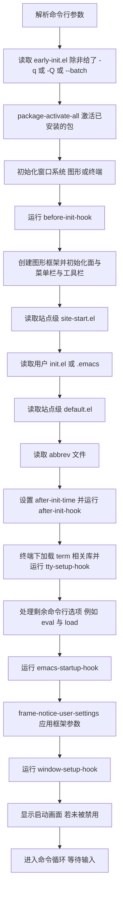
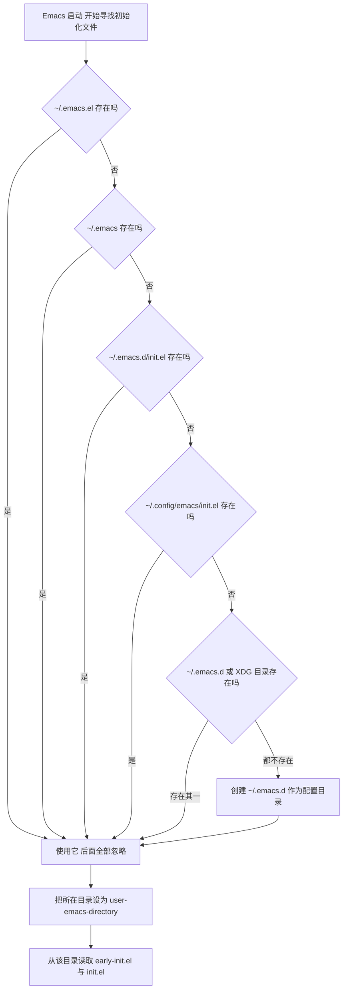

# 安装与启动

> 本篇解决"把它装起来、能启动、知道自己在读哪个配置文件"这三件事，并顺手把守护进程、中文环境、PATH 这几个新手最容易卡住的基础设施一次做对。读完你应该有一个能正常工作的 Emacs，以及一套可自救的启动参数。

---

## 一、在四个平台安装

Emacs 30 的发行渠道很多，但原则只有一条：**优先用系统包管理器装，只有需要特定版本或特定图形后端时才考虑第三方渠道或自己编译。** 下面按平台给出可复制的命令，并说明各自的取舍。

### 1.1 Debian 与 Ubuntu

```bash
# 更新索引后安装
$ sudo apt update
$ sudo apt install emacs

# 查看实际会被装上的版本，以及在仓库里的候选版本
$ apt-cache policy emacs
```

Debian 与 Ubuntu 把 Emacs 拆成若干包，选择哪一个取决于你要什么图形后端：

| 包名 | 内容 | 适用场景 |
|------|------|----------|
| `emacs` | 元包，安装后拉到带图形支持的版本 | 桌面环境下的默认选择 |
| `emacs-nox` | 不带图形支持的构建（no X） | 服务器、只走 SSH 的机器 |
| `emacs-gtk` | 使用 GTK 的图形构建 | 希望界面与桌面风格一致 |
| `emacs-lucid` | 使用 Lucid 工具包的图形构建 | 旧式 X11 外观，某些环境下更稳 |
| `emacs-pgtk` | 使用纯 GTK 的 PGTK 构建 | Wayland 会话下表现更自然 |
| `emacs-common` | 各变体共用的数据文件 | 不要单独安装或卸载它 |

各发行版与各版本提供哪些变体并不一致，先用 `apt-cache search '^emacs'` 或 `apt-cache policy emacs-gtk` 确认再装。仓库里的版本通常滞后于上游一到两年，常见的长期支持发行版往往还停留在 Emacs 29 或更早；如果你必须用 30，可以接受第三方源，或者按源码编译（本书不展开编译流程）。

安装完成后，GNU/Linux 上还会得到一个额外好处：Emacs 30 起官方提供了 `emacsclient.desktop`，使 Emacs 成为 `org-protocol` URI 方案的默认处理程序，也就是说在浏览器里点击 `org-protocol://` 链接会直接交给 `emacsclient`。

### 1.2 Arch Linux

```bash
# 滚动更新后再装，避免部分升级
$ sudo pacman -Syu
$ sudo pacman -S emacs

# 查看仓库里的版本与依赖
$ pacman -Si emacs
```

Arch 的包划分与 Debian 类似：

- `emacs` 是带 GTK 图形支持的标准构建。
- `emacs-nox` 是不带图形支持的构建。
- 部分时期仓库里还提供面向 Wayland 的 PGTK 构建，包名可能是 `emacs-wayland` 之类的形式，随仓库调整。用 `pacman -Ss emacs` 查看当前实际可用的包名，不要照抄网上看到的旧包名。
- AUR 里有跟踪上游开发分支的 `emacs-git`，除非你在追新功能或帮上游测试，否则不建议日常使用。

Arch 滚动更新，拿到 30.x 的速度通常比 Debian 系快。

### 1.3 Fedora

```bash
$ sudo dnf install emacs

# 需要纯终端版本
$ sudo dnf install emacs-nox

# 查看版本
$ dnf info emacs
```

Fedora 的 `emacs` 包通常带图形前端，`emacs-nox` 面向服务器。RHEL 系派生发行版（Rocky、AlmaLinux 等）命令相同，把 `dnf` 换成 `yum` 一般也能用。

### 1.4 macOS

macOS 上的三种主流选择需要分清楚，它们不是同一个程序的不同安装方式。

**第一种：Homebrew 官方仓库的 cask（推荐新手）**

```bash
# 当前 cask 名称是 emacs-app；历史上叫 emacs，旧名仍作为别名保留
$ brew install --cask emacs-app

# 如果旧名还可以用，下面这条等价
$ brew install --cask emacs

# 验证
$ emacs --version

# 以图形方式打开
$ open -a Emacs
```

这个 cask 分发的是官方 macOS 构建（来自 https://emacsformacosx.com/ 的通用二进制包），安装后：

- 应用位于 `/Applications/Emacs.app`。
- `emacs`、`emacsclient`、`etags` 等命令行程序被链接到 Homebrew 的 `bin` 目录（Apple Silicon 通常是 `/opt/homebrew/bin`），因此终端里可以直接敲 `emacs`。
- `brew search emacs` 可以列出当前所有与 Emacs 相关的 cask；如果某条命令报 "Cask is unavailable"，就用它确认现在的名称。

**第二种：Emacs Mac port（emacs-mac）**

它是由 YAMAMOTO Mitsuharu 维护的独立分支，在 C 层加入了大量 macOS 专属实现，因此不是一个"换皮"的安装方式。二者差异如下：

| 维度 | Homebrew 官方 cask 的 GNU 构建 | Emacs Mac port（emacs-mac） |
|------|-------------------------------|-----------------------------|
| 代码来源 | GNU Emacs 上游，几乎不打补丁 | 上游加 macOS 专属补丁的分支 |
| 版本节奏 | 跟随上游发布，通常是当前稳定版 | 落后于上游，随维护者节奏更新 |
| 原生标签页与窗口行为 | 由上游实现，能力较基础 | 更贴近 macOS 原生应用的行为 |
| 输入法与触控板交互 | 可用 | 针对 macOS 输入法做了专门处理 |
| 安装方式 | `brew install --cask emacs-app` | 需要第三方 tap |
| 与官方 cask 共存 | 不能同时安装 | 不能同时安装 |

安装 Mac port 需要先添加维护者的 tap：

```bash
$ brew tap railwaycat/emacsmacport
$ brew install --cask emacs-mac
```

tap 仓库地址是 https://github.com/railwaycat/homebrew-emacsmacport ，里面同时提供 `emacs-mac` 与 `emacs-mac-28` 等 cask。写这篇时该 cask 提供的版本是 Emacs 29.4 系列，也就是说它**不是** Emacs 30。如果你明确需要 30 的新特性（例如内置 `which-key`、默认启用原生编译），就选官方 cask。

**第三种：emacs-plus**

https://github.com/d12frosted/homebrew-emacs-plus 提供用源码编译的 formula（例如 `emacs-plus@30`、`emacs-plus@31`），可以自定义编译选项，代价是每次升级都要重新编译，耗时较长。适合明确知道自己要开启或关闭哪些编译开关的人。

**首次打开被系统拦下怎么办。** 如果提示"无法验证开发者"或"来自身份不明的开发者"，在访达里按住 Control 点击应用图标，选择"打开"，然后确认；也可以在终端里去掉隔离属性：

```bash
$ xattr -d com.apple.quarantine /Applications/Emacs.app
```

### 1.5 Windows

Windows 上有四条路，按推荐程度排列。

**第一条：winget（最省事）**

```powershell
# 官方清单里的包标识是 GNU.Emacs，安装器是官方的安装程序
PS> winget install GNU.Emacs

# 查看是否已被识别
PS> winget list GNU.Emacs
```

对应的清单可以在 https://github.com/microsoft/winget-pkgs/tree/master/manifests/g/GNU/Emacs 查看，里面按版本分目录，目前的 `30.2` 目录使用的安装器来自 GNU 官方 FTP，因此和手动下载安装程序等价。装完后**新开一个终端**再执行 `emacs --version`，环境变量的改动不会影响已经打开的窗口。

**第二条：Scoop（不需要管理员权限、便于管理）**

```powershell
# Extras 仓库里有 emacs
PS> scoop bucket add extras
PS> scoop install emacs
```

Scoop 使用官方 Windows 压缩包，并自动生成 `runemacs.exe`、`emacs.exe`、`emacsclient.exe`、`emacsclientw.exe`、`etags.exe` 等命令的 shim，因此不需要手动配置 PATH。仓库地址是 https://github.com/ScoopInstaller/Extras 。

**第三条：官方压缩包（完全可控，也最麻烦）**

从 https://ftp.gnu.org/gnu/emacs/windows/ 下载对应版本的 `emacs-<版本>-x86_64.zip`（64 位）或 `-i686.zip`（32 位）。解压后顶层目录是 `bin`、`libexec`、`share`、`var`。它本身是绿色版，可以放在 U 盘或任意目录运行，但需要自己把 `bin` 目录加入 PATH：

```cmd
:: cmd 里临时生效，只影响当前窗口
C:\> set PATH=C:\Emacs\bin;%PATH%
```

```powershell
# PowerShell 里临时生效
PS> $env:Path = "C:\Emacs\bin;" + $env:Path

# 永久写入用户级 PATH，注意要用 SetEnvironmentVariable 而不是 setx，
# 因为 setx 对超过 1024 字符的值会截断
PS> $old = [Environment]::GetEnvironmentVariable("Path", "User")
PS> [Environment]::SetEnvironmentVariable("Path", "C:\Emacs\bin;$old", "User")
```

也可以走"系统属性 → 高级 → 环境变量"，在用户变量里编辑 `Path`，新增一行 `C:\Emacs\bin`。压缩包里还有一个 `bin\addpm.exe`，官方 README 说明它的用途是在开始菜单里放置图标并写入注册表项，但明确写了"不推荐这种方式"，所以更推荐自己创建指向 `runemacs.exe` 的快捷方式。

**第四条：官方安装程序**，也就是 winget 使用的那一个，安装到 `Program Files` 下并带开始菜单项，适合希望"像普通 Windows 软件一样安装"的用户。

**Windows 上必须搞清楚的一件事：`~` 在哪里。**

Emacs 在 Windows 上把"用户特定的应用程序数据目录"当作主目录，也就是 `%APPDATA%`，典型路径是 `C:\Users\<用户名>\AppData\Roaming`；如果这个目录不存在或不可访问，会退回到 `C:\`。因此你的配置文件实际位于：

```text
C:\Users\<用户名>\AppData\Roaming\.emacs.d\init.el
```

这个默认值经常与用户预期不符，很多人以为 `~` 是 `C:\Users\<用户名>`。环境变量 `HOME` 可以覆盖它，设置后 Emacs 就用你指定的目录：

```powershell
PS> [Environment]::SetEnvironmentVariable("HOME", "C:\Users\me\emacs-home", "User")
```

想确认 Emacs 当前认为主目录在哪，在 Emacs 里按 `C-x d ~/ RET`，目录列表的第一行会显示完整路径。

**可执行文件的区别**（这一点影响你创建的快捷方式）：

| 文件 | 用途 |
|------|------|
| `emacs.exe` | 主程序，既能跑 GUI 也能跑 `emacs -nw`；从资源管理器直接双击会附带一个命令行窗口 |
| `runemacs.exe` | 只用于以 GUI 方式启动，且不会弹出命令行窗口；快捷方式应该指向它 |
| `emacsclient.exe` | 命令行客户端，连接正在运行的 Emacs 服务器 |
| `emacsclientw.exe` | 不打开控制台窗口的客户端，适合做文件关联或"用 Emacs 打开" |
| `addpm.exe` | 官方压缩包里附带的简易注册工具，用于创建开始菜单项 |
| `etags.exe`、`ctags.exe`、`ebrowse.exe` | 生成标签文件与其他辅助工具 |

Windows 上也可以使用终端模式，需要把 `bin` 放进 PATH，然后在 cmd、PowerShell 或 Windows Terminal 里执行 `emacs -nw`。

### 1.6 WSL 下的注意事项

WSL 里就是一个正常的 Linux 环境，按 1.1 节的 Debian/Ubuntu 方式安装即可。几点实践经验：

- **终端模式优先。** `emacs -nw` 在 Windows Terminal 里工作良好，是与 Windows 混用文件时最省心的方式。
- **图形模式依赖 WSLg。** Windows 11 与升级后的 Windows 10 自带 WSLg，装了带图形支持的 Emacs 后直接运行 `emacs` 就能出窗口，不需要自己配 `DISPLAY`。旧环境需要在 Windows 侧另装 X server 并手动设置 `DISPLAY`。相关说明见 https://learn.microsoft.com/en-us/windows/wsl/tutorials/gui-apps 。
- **跨文件系统的性能差距很大。** 访问 `/mnt/c/...` 比访问 WSL 自己的文件系统慢得多，Git 操作尤其明显。项目文件应放在 WSL 的 `~` 下，而不是 Windows 盘符里。
- **不要在两边共用同一个配置目录。** 如果 Windows 版 Emacs 与 WSL 版 Emacs 指向同一个 `~/.emacs.d`（例如通过 `/mnt/c` 访问），会产生冲突：包目录里的 `.elc` 与原生编译的 `eln-cache` 不能跨平台共用，而且两边可能同时写同一个文件。给它们各自独立的配置目录（例如 WSL 用 `~/.emacs.d`，Windows 版用 `%APPDATA%\.emacs.d`）。
- **从 Windows 版 Emacs 访问 WSL 里的文件**，可以在 WSL 里开启 sshd，然后用 TRAMP 的 `/ssh:` 方法打开，例如 `C-x C-f` 输入 `/ssh:me@localhost:/home/me/notes.org`。
- **守护进程可以跑在 WSL 里**，然后在 WSL 终端用 `emacsclient -t` 连接；是否让 Windows 侧的 `emacsclient` 跨过 WSL 边界去连接同一个守护进程，属于进阶用法，需要额外配置套接字或 TCP 通信，不建议一开始就折腾。

### 1.7 验证安装

无论哪个平台，装完都做这三步验证：

```bash
# 1) 命令行能看到版本号
$ emacs --version
GNU Emacs 30.1
Copyright (C) 2025 Free Software Foundation, Inc.
GNU Emacs comes with ABSOLUTELY NO WARRANTY.
...

# 2) 客户端程序也在
$ emacsclient --version

# 3) 用非交互方式求值，确认版本与构建目标平台
$ emacs -Q --batch --eval '(princ (format "emacs %s on %s\n" emacs-version system-configuration))'
emacs 30.1 on x86_64-pc-linux-gnu
```

进入 Emacs 之后还可以用这几个命令确认内部状态：

| 命令 | 作用 |
|------|------|
| `M-x emacs-version` | 在回显区显示版本号 |
| `M-: user-init-file RET` | 显示实际加载的 init 文件绝对路径，配置不生效时第一个该查的值 |
| `M-: user-emacs-directory RET` | 显示配置目录（`~/.emacs.d/` 或 `~/.config/emacs/`） |
| `M-x emacs-init-time` | 显示本次启动耗时 |
| `M-x describe-variable RET system-configuration RET` | 显示构建目标与编译选项 |

---

## 二、图形、终端与无界面：三种运行方式

### 2.1 直接启动（图形）

```bash
$ emacs
```

在图形环境下这会创建一个图形框架（frame）：有菜单栏、工具栏、滚动条、可用的鼠标交互、可以显示图片与不同字体的文本。它是新手默认的使用方式，也是唯一能完整体现主题、字体、图标类包效果的方式。

### 2.2 终端模式

```bash
# 不连接窗口系统的启动方式
$ emacs -nw
```

`-nw` 是 `--no-window-system` 的缩写。它会忽略 `DISPLAY` 之类的图形环境变量，直接在当前终端里画界面。适用场景：

- 通过 SSH 登录远程机器。
- 服务器上没有图形环境。
- 配合 tmux 或 screen，让会话在断开 SSH 后继续存在。
- 启动更快、占用更低。

终端模式下有几条必须知道的限制：

- **字体与字号由终端决定。** 在 `init.el` 里用 `set-face-attribute` 设置字体对终端框架基本无效，写这类配置前先判断 `(display-graphic-p)`。
- **颜色的精度取决于终端。** 想得到 24 位色效果，终端需要支持真彩色，并且通常要设置 `COLORTERM=truecolor`，否则 Emacs 会退化成 256 色，主题颜色会有偏差。
- **图片与部分图形功能不可用**，例如 EWW 里显示图片、`doc-view` 的页面显示都会退化为纯文本或不可用。

### 2.3 三种方式怎么选

| 运行方式 | 启动命令 | 优点 | 限制 |
|----------|----------|------|------|
| 图形 | `emacs` | 字体、主题、图片、鼠标、菜单齐全 | 依赖图形会话，远程使用不便 |
| 终端 | `emacs -nw` | 轻量、适合 SSH、可配合 tmux | 字体与颜色由终端决定，无图片 |
| 守护进程加客户端 | 先 `emacs --daemon`，再 `emacsclient -c` 或 `emacsclient -t` | 启动几乎瞬时，图形与终端框架可共享同一批缓冲区 | 需要理解服务器与客户端的关系 |

---

## 三、启动参数逐个说明

先给总览表，再逐条解释。表中"作用于"一列标明该选项属于 `emacs` 命令还是 `emacsclient` 命令，这一点经常被混淆。

| 选项 | 全称 | 作用于 | 一句话作用 |
|------|------|--------|------------|
| `-Q` | `--quick` | `emacs` | 最干净的启动，跳过几乎所有用户与站点配置 |
| `-q` | `--no-init-file` | `emacs` | 只跳过用户配置文件 |
| `--debug-init` | 无 | `emacs` | 配置文件出错时进入 Elisp 调试器 |
| `-nw` | `--no-window-system` | `emacs` | 在终端里运行，不使用图形界面 |
| `-c` | `--create-frame` | `emacsclient` | 新建一个框架而不是复用已有框架 |
| `-t` | `--tty` | `emacsclient` | 在当前终端里打开一个新框架 |
| `--eval` | `--execute` | 两者 | 求值一段 Elisp 表达式 |
| `--batch` | 无 | `emacs` | 非交互模式，隐含 `-q`，适合脚本 |
| `-l` | `--load` | `emacs` | 加载指定的 Elisp 文件 |
| `--daemon` | 另有 `--fg-daemon`、`--bg-daemon` | `emacs` | 以守护进程方式启动服务器 |

### 3.1 `-Q`：最干净的启动

```bash
$ emacs -Q
```

`-Q` 等价于下面这一串：

```text
-q --no-site-file --no-site-lisp --no-splash --no-x-resources
```

也就是说它不读你的 `init.el`，不读站点级的 `site-start.el`，不把 `site-lisp` 加入 `load-path`，不显示启动画面，也不读 X 资源文件。

用途有两个，都非常重要：

1. **排查"是不是我的配置坏了"。** 如果 `emacs -Q` 正常而正常启动异常，问题一定在配置或已安装的包里。
2. **干净地查看某个键位或变量的默认行为。** 自己的配置改过某些键位时，用 `-Q` 启动一个实例去查文档最可靠。

注意 `-Q` 下不会激活已安装的包（因为包系统的启动逻辑也被跳过），所以它不适合用来验证"包是否装好了"。

### 3.2 `-q`：只跳过用户配置

```bash
$ emacs -q
```

比 `-Q` 温和：仍然加载站点配置（`site-start.el`、`site-lisp`）与 X 资源，只是不读你自己的 `early-init.el` 与 `init.el`。当你想确认"是我的配置的问题，还是发行版预置配置的问题"时，用 `-q` 和 `-Q` 各试一次就能区分。

### 3.3 `--debug-init`：让配置错误现出原形

```bash
$ emacs --debug-init
```

正常启动时，如果 `init.el` 里出错，Emacs 只会在回显区显示一条简短消息并把错误写进 `*Messages*`，然后继续启动。加上 `--debug-init` 后，出错时会直接弹出 Emacs Lisp 调试器（`*Backtrace*` 缓冲区），并给出出错表达式与调用栈，能直接定位到具体行。

调试器缓冲区里的常用操作：按 `q` 退出调试器，按 `d` 进入单步调试，`e` 求值一个表达式，`c` 继续。排查配置问题时，这是最有效的工具，比"逐行注释再重启"快得多。

### 3.4 `-nw`：终端模式

```bash
$ emacs -nw                  # 在当前终端启动
$ emacs -nw file.org         # 直接打开一个文件
$ emacs -nw +42 file.org     # 打开并跳到第 42 行
```

`emacs -nw` 与 `emacsclient -t` 效果相近，区别在于前者启动一个新进程，后者连接已有进程。

### 3.5 `-c` 与 `-t`：客户端的两种开窗方式

先说最容易搞错的一点：**`-c` 和 `-t` 是 `emacsclient` 的选项，不是 `emacs` 的选项。** `emacs` 本身不接受 `-c`；它接受 `-t DEVICE`（`--terminal`），但那是指定终端设备的底层选项，日常不会用到。

```bash
# 让服务器新建一个图形框架
$ emacsclient -c file.org

# 在当前终端里新建一个框架
$ emacsclient -t file.org

# 复用已有框架（没有才新建）
$ emacsclient -r file.org
```

`-c` 每次都会新建框架，`-r` 会在已有框架里打开文件，`-t` 只能用于终端。在守护进程工作流中，这三者的选择决定了文件出现在哪个"窗口"里。

### 3.6 `--eval`：求值一段 Elisp

```bash
# 交互模式下：求值并把结果打印到回显区和 *Messages*
$ emacs --eval '(message "hello from command line")'

# 非交互模式下：把结果写到标准输出
$ emacs -Q --batch --eval '(princ (+ 1 2))'
3
```

它和 Emacs 内的 `M-:`（`eval-expression`）是一回事，只是从命令行传进来。常见用途：

- 批量转换文件、批量处理文本。
- 在脚本里读取 Emacs 的内部状态，例如 `emacs --batch --eval '(princ (emacs-version))'`。
- 让 `emacsclient` 触发一个动作：`emacsclient -e '(org-agenda)'`。

注意 `--eval` 是在配置文件加载完之后才执行的，因此它能看到你 `init.el` 里定义的一切。

### 3.7 `--batch`：非交互执行

```bash
# 只加载指定的脚本并执行，不打开任何界面
$ emacs -Q --batch -l script.el

# 常用的组合：不读配置、不打开界面、执行一段表达式
$ emacs -Q --batch --eval '(princ (format "%s\n" (length load-path)))'
```

要点：

- `--batch` 隐含 `-q`，并且不会激活已安装的包。
- 不能执行需要交互的命令，例如 `find-file` 会失败；应该用 `find-file-noselect` 之类的非交互版本。
- `princ` 与 `print` 的输出走标准输出，`message` 的输出走标准错误，写脚本时要注意这个区别。
- 执行完会自动退出，退出码反映是否发生错误，因此很适合放进 CI 或 Git 钩子。

### 3.8 `-l`：加载文件

```bash
$ emacs -l ~/lab/test.el          # 加载一个文件，然后正常进入交互界面
$ emacs -Q --batch -l test.el     # 加载并执行，然后退出
```

`-l` 可以出现多次，按命令行顺序依次加载。它是"动作选项"，因此在启动流程中位于你的 `init.el` 之后。另一个常见写法是把脚本写成可执行文件：

```elisp
#!/usr/bin/env -S emacs -Q --batch -l
;; 上面这行让文件本身可以直接执行
(princ "hello\n")
```

### 3.9 `--daemon`：守护进程

```bash
# 后台守护进程，命令立刻返回
$ emacs --daemon

# 前台运行，日志直接打在终端上，适合交给 systemd 管理
$ emacs --fg-daemon

# 给守护进程起个名字，便于同时运行多个
$ emacs --daemon=work
```

`--daemon` 与 `--bg-daemon` 都是后台方式（命令返回后进程继续跑），`--fg-daemon` 不脱离终端。下一节会完整展开这套工作流。`--daemon` 会自动隐含"启动服务器"的语义，不需要再执行 `M-x server-start`。

### 3.10 其他常用选项

| 选项 | 作用 | 示例 |
|------|------|------|
| `--init-directory=DIR` | 用指定目录作为配置目录，不碰默认配置 | `emacs --init-directory=~/lab/emacs.d` |
| `-u USER` | 加载指定用户的 init 文件 | `emacs -u alice` |
| `-L DIR` | 把目录加入 `load-path` | `emacs -L ~/elisp` |
| `-f FUNC` | 调用一个函数 | `emacs -f org-agenda` |
| `--insert FILE` | 把文件内容插入当前缓冲区 | `emacs --insert notes.txt` |
| `--no-splash` | 不显示启动画面 | `emacs --no-splash` |
| `-fn FONT` | 指定默认字体 | `emacs -fn "Noto Sans Mono-12"` |
| `+LINE:COLUMN` | 打开文件并跳到指定行列 | `emacs +12:5 main.c` |

`--init-directory` 是 Emacs 29 引入的，非常适合用来做实验：创建一个空目录，在里面放一份临时 `init.el`，用这个选项启动，就能在不污染现有配置的前提下测试一套新配置。

### 3.11 `emacsclient` 的选项

| 选项 | 全称 | 作用 |
|------|------|------|
| `-c` | `--create-frame` | 新建一个框架 |
| `-t` | `--tty`（`-nw` 亦可） | 在当前终端新建框架 |
| `-r` | `--reuse-frame` | 有框架就复用，没有才新建 |
| `-n` | `--no-wait` | 不等待编辑结束，立即返回命令行 |
| `-e` | `--eval` | 把参数当作 Elisp 表达式求值 |
| `-q` | `--quiet` | 成功时不打印消息 |
| `-u` | `--suppress-output` | 不显示服务器返回的值 |
| `-a EDITOR` | `--alternate-editor` | 服务器不在时使用的备用编辑器；参数为空字符串时表示自动启动守护进程 |
| `-s SOCKET` | `--socket-name` | 指定套接字名，用于连接多个服务器中的一个 |
| `-f FILE` | `--server-file` | 指定 TCP 模式的认证文件 |
| `-T PREFIX` | `--tramp` | 为传输给服务器的文件名加上 TRAMP 前缀 |
| `-w SECONDS` | `--timeout` | 等待服务器响应的超时时间 |
| `-d DISPLAY` | `--display` | 在指定显示上打开 |

---

## 四、守护进程与 emacsclient 完整工作流

### 4.1 为什么要用守护进程

默认用法下，每敲一次 `emacs` 都要从头启动：读配置、激活包、建立界面，耗时从零点几秒到几秒。守护进程把"启动"这件事只做一次：

- 之后每次打开文件只需连接已有进程，几乎是瞬时。
- 所有客户端共享同一批缓冲区、同一份命令历史、同一个 kill-ring、同一份包状态。你在图形框架里打开的 org 文件，切到 SSH 终端里用 `emacsclient -t` 就能直接看到。
- 把 `EDITOR` 设为 `emacsclient` 后，`git commit`、`crontab -e`、`visudo` 等所有调用外部编辑器的程序都会复用你正在用的这个 Emacs，写提交信息时能享受补全、拼写检查和你自己的所有配置。

代价是：守护进程崩溃会影响所有客户端，而且"重启 Emacs 看配置是否生效"不再是一个随手可做的动作。

### 4.2 三种启动服务器的办法

```bash
# 办法一：命令行启动后台守护进程
$ emacs --daemon

# 办法二：在已经运行的 Emacs 里启动服务器
# 对应命令是 M-x server-start
```

第三种最省心，让客户端按需拉起服务器：

```bash
# -a 后跟空字符串：服务器不在时自动启动一个守护进程再连接
$ emacsclient -c -a ""
```

这条命令的含义就是"给我一个图形框架，如果服务器还没起来，就自己起一个"。把它做成桌面快捷方式或别名，日常使用中几乎不需要再关心守护进程的存在。

同时运行多个互不干扰的服务器时，用名字区分：

```bash
$ emacs --daemon=work
$ emacsclient -s work -c file.org
```

### 4.3 日常命令清单

```bash
# 图形框架打开文件，并且不阻塞调用它的程序
$ emacsclient -c -n ~/notes.org

# 在当前终端里打开
$ emacsclient -t ~/notes.org

# 让已经在运行的 Emacs 求值一个表达式并打印结果
$ emacsclient -e '(emacs-version)'

# 打开 org 日程
$ emacsclient -e '(org-agenda)'

# 关闭守护进程，所有客户端随之断开
$ emacsclient -e '(kill-emacs)'
```

把 Emacs 设为默认编辑器：

```bash
# 写进 ~/.bashrc 或 ~/.zshrc
export EDITOR=emacsclient
export VISUAL=emacsclient
```

两点提醒：一是 `emacsclient` 默认会等待编辑结束再返回，这正是编辑器场景需要的行为，所以不要在 `EDITOR` 场景里加 `-n`；二是 `sudoedit` 这类用法会遇到障碍，因为 sudo 会清掉大部分环境变量，而且 root 通常无权访问你的用户套接字，想让 `sudo -e` 用 Emacs 需要额外的授权配置，关键流程上不要依赖它。

### 4.4 守护进程与客户端如何握手


### 4.5 用 systemd 用户服务托管守护进程

如果希望登录后自动就有 Emacs 服务器，让 systemd 用户实例来管理最规范。Emacs 源码里自带一份单元文件（`etc/emacs.service`），内容如下，我逐段加了解释：

```text
[Unit]
Description=Emacs text editor
Documentation=info:emacs man:emacs(1) https://gnu.org/software/emacs/

[Service]
# Emacs 会通过 sd_notify 向 systemd 汇报就绪状态，因此这里用 notify
Type=notify
# 必须用前台模式，否则 systemd 会认为服务已经退出
ExecStart=emacs --fg-daemon

# Emacs 收到 SIGTERM 后以状态 15 退出，这是 systemd 停止服务的默认信号，
# 声明它不算失败，否则每次停止服务都会被标记为异常
SuccessExitStatus=15

# 需要 SSH 认证代理时，systemd 用户服务的环境与登录 shell 不同，
# 官方单元文件里保留了这一行但默认注释掉，按需打开
# Environment=SSH_AUTH_SOCK=%t/keyring/ssh

# 只在异常退出时重启，避免正常停止后被反复拉起
Restart=on-failure

[Install]
WantedBy=default.target
```

实际启用步骤：

```bash
# 先看看发行版是否已经随包提供了这个单元文件
$ systemctl --user status emacs

# 如果不存在，从 Emacs 的安装目录复制一份到用户级目录
# 路径随发行版不同，用 dpkg -L emacs-common | grep emacs.service 之类的命令找
$ mkdir -p ~/.config/systemd/user
$ cp /usr/share/emacs/30.1/etc/emacs.service ~/.config/systemd/user/

# 如果 emacs 不在 systemd 用户管理器的 PATH 里，把 ExecStart 改成绝对路径
$ sed -i 's|^ExecStart=emacs|ExecStart=/usr/bin/emacs|' ~/.config/systemd/user/emacs.service

# 重新加载并启用
$ systemctl --user daemon-reload
$ systemctl --user enable --now emacs
$ systemctl --user status emacs
```

启用后，登录系统就会有服务器在跑，`emacsclient -c` 可以直接使用。要停止或禁用：

```bash
$ systemctl --user stop emacs
$ systemctl --user disable emacs
```

还有更进一步的用法叫套接字激活：让 systemd 先监听套接字，等到第一个 `emacsclient` 连接时才真正启动 Emacs，这样即使启用了服务，登录时也不会占用内存。它需要额外一个 `emacs.socket` 单元，官方手册里给的骨架是：

```text
[Socket]
ListenStream=/run/user/1000/emacs.socket
DirectoryMode=0700

[Install]
WantedBy=sockets.target
```

同时前面那个 `emacs.service` 也必须安装，并且服务里的 `ExecStart` 需要与套接字路径对应。这一套属于进阶配置，先跑通 4.2 节的办法再考虑。

### 4.6 Windows 上的守护进程

Windows 上同样的模型可用，区别在客户端程序与会话套接字的位置：

```cmd
:: 启动守护进程
C:\> emacs --daemon

:: 用不弹控制台的客户端连接，并在需要时自动启动守护进程
C:\> emacsclientw.exe -c -a "" file.org
```

- 做文件关联或"用 Emacs 打开"时用 `emacsclientw.exe`，它不会附带一个黑色命令行窗口。
- 在 cmd 或 PowerShell 里手动调用时用 `emacsclient.exe`，它会把服务器的返回值打印出来。
- 想确认套接字实际放在哪里，执行 `M-x describe-variable RET server-socket-dir RET`；这个变量与 `server-use-tcp`、`server-name` 都定义在 `server.el` 中，需要先加载服务器（`M-x server-start`）。
- 如果套接字方式在你的环境里不通（例如杀毒软件或权限限制），可以把 `server-use-tcp` 设为 `t`，让服务器改用 TCP，并用 `emacsclient -f` 指定认证文件。

### 4.7 关闭与断开

| 你的目的 | 操作 |
|----------|------|
| 只关掉一个图形框架 | `C-x 5 0`（`delete-frame`） |
| 断开当前这个客户端 | 在客户端框架里按 `C-x C-c`，它会保存缓冲区后结束当前连接 |
| 彻底结束守护进程 | `emacsclient -e '(kill-emacs)'`，或在任意客户端执行 `M-x kill-emacs` |
| 结束非守护进程的 Emacs | `C-x C-c`（`save-buffers-kill-terminal`），会逐个询问未保存的缓冲区 |

这里有个容易困惑的地方值得说清楚。`C-x C-c` 绑定的函数是 `save-buffers-kill-terminal`，它的文档说明是"先询问是否保存每个缓冲区，然后结束当前连接；如果当前框架没有客户端，才用 `save-buffers-kill-emacs` 真正结束 Emacs"。所以在守护进程场景下，按 `C-x C-c` 只是**断开这个客户端**，服务器与其他客户端继续运行；而在普通启动（没有服务器）的 Emacs 里，它就是退出程序。

---

## 五、启动流程与配置文件位置

关于启动，需要同时回答三个问题：Emacs 按什么顺序做事、每个阶段能挂什么钩子、配置到底放在哪。

### 5.1 启动顺序



这张图对写配置有三个直接用处：

1. **哪些设置必须提前。** 影响包系统本身的变量（`package-enable-at-startup`、`package-load-list`、`package-user-dir`）必须写在 `early-init.el`，因为 `init.el` 读到它们时包已经被激活了。
2. **哪些钩子该挂哪个。** 想在"包已激活但界面还没画出来"时做事，用 `before-init-hook`；想在"配置读完、可以安全地调用任何函数"时做事，用 `after-init-hook`；想在"框架参数都应用完了"之后做与界面尺寸相关的事，用 `window-setup-hook`；只想在终端下做事，用 `tty-setup-hook`。
3. **命令行选项的处理时机。** `--eval` 与 `--load` 在 `init.el` 之后执行，所以它们能用到你配置里定义的东西。

早于 `init.el` 的 `early-init.el` 有一个硬性限制需要注意：它读取时 GUI 还没初始化，因此在里面设置字体、菜单栏之类的界面相关配置不可靠。官方手册明确建议不要把这些配置搬进 `early-init.el`；如果确实需要在早期代码里做界面相关的事，应该挂到 `window-setup-hook` 或 `tty-setup-hook` 上。

### 5.2 配置文件到底在哪里

Emacs 按固定顺序查找初始化文件，用到第一个存在的就停止，后面的全部忽略：

| 顺序 | 路径 | 说明 |
|------|------|------|
| 1 | `~/.emacs.el` | 古老的裸文件名形式 |
| 2 | `~/.emacs` | 最传统的 init 文件，裸文件，易与其他工具冲突 |
| 3 | `~/.emacs.d/init.el` | 传统主流位置，生态文档默认它 |
| 4 | `~/.config/emacs/init.el` | XDG 规范位置，Emacs 27 起支持 |
| 5 | 以上都不存在 | Emacs 会创建 `~/.emacs.d` 并使用它 |

下图把判断逻辑画出来：



关于这套规则，有几条容易踩坑的细节：

- **`~/.emacs.d` 目录本身存在就足以被选中**，即使里面还没有 `init.el`。因此"我把配置挪到 `~/.config/emacs` 了但没生效"的最常见原因，就是旧的 `~/.emacs.d` 还在。
- **XDG 位置受 `XDG_CONFIG_HOME` 影响。** 设置了该环境变量时，`~/.config` 会被替换成它的值。
- **`~/.emacs`、`~/.emacs.el` 的优先级高于 `~/.emacs.d/init.el`。** 这两个裸文件是历史遗留，容易在排查时被忽略，建议一开始就不要用它们。
- **配置目录会被记忆为 `user-emacs-directory`。** 它决定了 `custom-file`、桌面会话保存文件、`elpa` 包目录、`eln-cache` 原生编译缓存等一切用户文件的位置。官方手册不建议在启动过程中修改这个变量的值，那会打乱后续所有路径计算。
- **用 `--init-directory=DIR` 可以整体替换配置目录**，这正是插件作者用来测试干净环境的标准做法。

想同时兼容旧版本 Emacs 的读者可以按官方手册的建议，在 `~/.emacs.d` 位置放一个指向 `~/.config/emacs` 的符号链接：

```bash
# 官方手册给出的做法：让老版本也能在 ~/.emacs.d 下找到配置
$ ln -s .config/emacs ~/.emacs.d
```

### 5.3 Windows 上的 HOME

Windows 没有各程序公认的"主目录"。Emacs 的做法是：把"用户特定的应用程序数据目录"当作 `HOME`，也就是 `%APPDATA%`；不可访问时退回 `C:\`；环境变量里显式设置的 `HOME` 优先级最高。另外还有一个纯历史兼容行为：如果 `C:\` 下存在名为 `.emacs` 的文件，且环境变量与注册表里都没有 `HOME`，Emacs 会把 `C:\` 当主目录。

实践上建议显式设置 `HOME`，让路径变得可预测，例如设成 `C:\Users\me\emacs-home`，此后配置就在 `C:\Users\me\emacs-home\.emacs.d\init.el`。另外 Windows 版还支持把 init 文件命名为 `_emacs`（当前导点号不方便的时代遗留），这个名字已被标记为过时，启动时会给出警告，不要使用。

### 5.4 `early-init.el` 里该放什么

标准的 `early-init.el` 只做两类事：

```elisp
;; -*- lexical-binding: t; -*-

;; 第一类：影响包系统启动行为的设置，必须在这里
;; 启动时不自动激活包，改由 init.el 中用 use-package 精确控制加载时机
;; 注意：设为 nil 之后要自己调用 package-activate-all，否则已安装的包不会生效
(setq package-enable-at-startup nil)

;; 第二类：启动阶段的性能相关设置
;; 启动期间临时把垃圾回收阈值调大，减少 GC 次数；启动结束后再调回正常值
(setq gc-cons-threshold most-positive-fixnum)
(add-hook 'emacs-startup-hook
          (lambda ()
            ;; 启动完成后恢复到 16 MB，避免长时间运行后内存不回收
            (setq gc-cons-threshold (* 16 1024 1024))))
```

注意上面两件事都有前提：第一件要求你在 `init.el` 里显式激活包，第二件要求你记得把阈值调回去。官方手册不建议把能被 `init.el` 处理的设置搬进 `early-init.el`，尤其是与界面外观相关的（字体、菜单栏、主题），因为那时 GUI 还没初始化。

### 5.5 一份可以直接用的最小 `init.el`

```elisp
;; -*- lexical-binding: t; -*-

;; 关掉启动画面（如果不想看那段欢迎信息）
(setq inhibit-startup-screen t)

;; 让 customize 的保存结果写到单独的文件，避免它把 init.el 改得面目全非
(setq custom-file (locate-user-emacs-file "custom.el"))
(when (file-exists-p custom-file)
  (load custom-file))

;; 关掉不常用的界面元素；这些设置只在图形框架下有效
(menu-bar-mode -1)
(tool-bar-mode -1)
(scroll-bar-mode -1)

;; 关掉提示音，减少打扰
(setq ring-bell-function 'ignore)

;; 三个低风险、几乎人人都开的小模式
(show-paren-mode 1)          ; 高亮匹配的括号
(electric-pair-mode 1)       ; 输入左括号自动补右括号
(save-place-mode 1)          ; 下次打开文件时回到上次的光标位置

;; 文件被外部程序修改时自动重读，配合其他工具一起用时很有用
(global-auto-revert-mode 1)

;; 遇到超长行时自动切换到 so-long-mode，避免界面卡死
(global-so-long-mode 1)
```

这份配置只用了内置功能，任何一条出问题都可以用 `emacs -Q` 对照排除。把它保存到 `~/.emacs.d/init.el`（或你选定的配置目录），重启 Emacs 或在 Emacs 里执行 `M-x eval-buffer` 即可生效。

### 5.6 拿一个沙盒来试新配置

不要拿正在用的配置做实验。用 `--init-directory` 开一个平行世界：

```bash
# 建立实验目录并写一份临时配置
$ mkdir -p ~/lab/emacs.d
$ printf '(setq inhibit-startup-screen t)\n(message "sandbox init loaded")\n' > ~/lab/emacs.d/init.el

# 用这份配置启动，完全不影响 ~/.emacs.d
$ emacs --init-directory=~/lab/emacs.d
```

启动后 `M-: user-emacs-directory RET` 会显示 `~/lab/emacs.d/`，`M-: user-init-file RET` 会显示其中的 `init.el`。确认无误后再把内容搬回正式配置。

---

## 六、PATH 与 exec-path-from-shell

### 6.1 症状与原因

有一类问题几乎每个图形环境用户都会遇到：终端里的 `emacs` 一切正常，但同一个 Emacs 在图形方式启动后，`M-x shell` 里找不到 `node`、`cargo`、`brew` 装的命令；`M-x compile` 报"命令未找到"；在 macOS 上连 `git` 都找不到。

原因不在于 Emacs，而在于**进程是从哪被拉起来的**：

- 你在终端里敲 `emacs`，它继承当前 shell 的环境，包括你在 `~/.bashrc`、`~/.zshrc`、`~/.profile` 里加的 PATH。
- 你从图形桌面点击图标，或者 macOS 的 Dock，或者 systemd 用户服务启动它，父进程是会话管理器或 launchd，**它们不读你的 shell 启动脚本**，因此 Emacs 拿到的是系统默认 PATH。

这解释了一个常见困惑："我在终端里明明测过命令能用。"你测的是 shell 的环境，不是 Emacs 的环境。想确认 Emacs 眼里的 PATH，用 `M-: (getenv "PATH") RET` 与 `M-: exec-path RET` 分别查看两者。

### 6.2 三种解决办法

**办法一：用 exec-path-from-shell（推荐给 macOS 与桌面 Linux 用户）**

它启动一个登录 shell，把 shell 里的 PATH 与指定变量读出，写回 Emacs 的 `exec-path` 与 `PATH`：

```elisp
;; 需要先从 MELPA 安装：M-x package-install RET exec-path-from-shell RET
(use-package exec-path-from-shell
  ;; 只在图形框架下需要，终端启动时环境本来就是对的
  :if (memq window-system '(mac ns x pgtk))
  :config
  ;; 默认会取 PATH 与 MANPATH，需要额外传的变量在这里列
  (setq exec-path-from-shell-variables '("PATH" "MANPATH" "GOPATH"))
  (exec-path-from-shell-initialize))
```

项目地址是 https://github.com/purcell/exec-path-from-shell 。它解决的是"环境变量没继承"这一类问题，如果你还依赖 `SSH_AUTH_SOCK` 或语言版本管理器（如 pyenv、nvm）设置的变量，就把它们一并加进 `exec-path-from-shell-variables`。

**办法二：手工补 PATH**

不想多装一个包，可以直接写：

```elisp
;; 把常用目录加到 exec-path 与 PATH 里
(dolist (dir '("/opt/homebrew/bin" "/usr/local/bin" "~/.cargo/bin"))
  (add-to-list 'exec-path (expand-file-name dir))
  (setenv "PATH" (concat (expand-file-name dir) ":" (getenv "PATH"))))
```

缺点是要自己维护这份清单，装了新工具就要回来看一眼。

**办法三：改变启动方式**

在终端里直接运行 `emacs`（或 `emacs --daemon`），它就继承了 shell 环境。注意 macOS 上用 `open -a Emacs` 启动并不会继承当前 shell 的环境，因为 `open` 只是通知 launchd 去启动应用。折中做法是在终端里跑守护进程，再用 `emacsclient -c` 打开图形框架。

Linux 上由 systemd 用户服务拉起的 Emacs 同理：它继承的是 systemd 用户管理器的环境，不一定等于你交互式 shell 的 PATH。需要时在单元文件里显式声明：

```text
[Service]
Environment=PATH=/usr/local/bin:/usr/bin:/bin
```

Windows 上的 PATH 完全由系统环境变量决定，改完必须重新打开终端或重启资源管理器才会生效；`HOME` 变量见 5.3 节。

---

## 七、中文环境、字体与 locale

### 7.1 先看系统 locale

```bash
# 查看当前 locale 设置
$ locale

# 查看系统里生成了哪些 locale，确认有中文 UTF-8
$ locale -a | grep -i zh_CN
```

如果 `LANG` 不是 UTF-8 结尾的值（例如 `zh_CN.UTF-8` 或 `en_US.UTF-8`），中文显示与编码判断都可能出问题。生成中文 locale 的方法：

```bash
# Debian 与 Ubuntu
$ sudo dpkg-reconfigure locales

# Arch：取消 /etc/locale.gen 中 zh_CN.UTF-8 UTF-8 一行的注释，然后重新生成
$ sudo locale-gen
```

写进 shell 启动脚本让它长期生效：

```bash
# 写进 ~/.bashrc 或 ~/.zshrc
export LANG=zh_CN.UTF-8
export LC_ALL=zh_CN.UTF-8
```

macOS 的图形程序通常不看 shell 里的 `LANG`，需要在"终端"的偏好设置里或在 `init.el` 里固定编码（见下）。Windows 上则由"区域设置 → 管理 → 非 Unicode 程序的语言"与代码页决定，现代 Emacs 使用 Unicode API，中文一般不需要额外设置。

### 7.2 Emacs 内部的编码设置

```elisp
;; 语言环境设为 UTF-8：影响输入法与字符分类等
(set-language-environment "UTF-8")

;; 读写文件时优先使用 UTF-8
(prefer-coding-system 'utf-8)

;; 与操作系统交互（文件名、消息）使用的编码
(setq locale-coding-system 'utf-8)
```

如果因为从图形环境启动导致日期格式、编码按 C locale 处理，可以显式指定：

```elisp
;; 强制 Emacs 使用中文 locale 的环境设置
;; 注意这个函数会重新初始化一批与 locale 相关的变量，只在确有需要时调用
(set-locale-environment "zh_CN.UTF-8")
```

Emacs 内部用 `C-h v current-language-environment RET`、`M-: (getenv "LANG") RET`、`M-x describe-coding-system RET utf-8 RET` 查看当前状态。

### 7.3 中文字体

图形框架下，如果中文显示成方块，说明当前字体里没有汉字。Emacs 用 fontset（字体集）机制为不同字符集挑选不同字体，因此正确做法不是"换一个字体"，而是"给汉字指定一个字体"：

```elisp
;; 只在图形框架下设置；终端框架的字体由终端程序决定
(when (display-graphic-p)
  ;; 默认字体：英文与代码用它
  (set-face-attribute 'default nil :family "Noto Sans Mono CJK SC" :height 140)

  ;; 给汉字与中日韩标点指定字体，避免出现方块或日文字形
  ;; 第二个参数 t 表示操作默认字体集，han 与 cjk-misc 是脚本符号
  (set-fontset-font t 'han (font-spec :family "Noto Sans CJK SC"))
  (set-fontset-font t 'cjk-misc (font-spec :family "Noto Sans CJK SC")))
```

`set-fontset-font` 的第二个参数可以是单个字符、字符区间、脚本符号或字符集符号；用脚本符号 `han` 表示"所有汉字"，这也是最省事的写法。

各平台常见的中文字体名：

| 平台 | 等宽与正文候选 | 说明 |
|------|----------------|------|
| Debian 与 Ubuntu | `Noto Sans CJK SC`、`WenQuanYi Micro Hei`、`Sarasa Mono SC` | 分别来自 `fonts-noto-cjk`、`fonts-wqy-microhei` 等包 |
| Arch | `Noto Sans CJK SC`、`Source Han Sans SC` | `pacman -S noto-fonts-cjk`，装完执行 `fc-cache -fv` |
| macOS | `PingFang SC`、`Songti SC`、`Menlo` | 系统自带，无需额外安装 |
| Windows | `Microsoft YaHei`、`Sarasa Mono SC` | 微软雅黑系统自带；更纱黑体需要自行安装 |

查看系统里到底有哪些能显示中文的字体：

```bash
# Linux 上列出支持中文的字体
$ fc-list :lang=zh | head -20
```

在 Emacs 里验证某个字符实际用了哪个字体：把光标放在该字符上按 `C-u C-x =`（`what-cursor-position` 带前缀参数），会显示字符编码、所属字符集与所用字体；`M-x describe-fontset RET` 可以查看当前字体集的分配情况。

### 7.4 终端下的中文与颜色

终端框架的字体、字号、行高都由终端程序决定，Emacs 里的字体设置对它无效。因此终端下出现方块的原因是终端字体不含汉字，解决办法是换一个带中文的终端字体（例如 Sarasa Mono SC、Noto Sans Mono CJK SC），而不是改 `init.el`。

颜色方面，想要主题的颜色准确，需要终端支持 24 位真彩色，并通常设置：

```bash
export COLORTERM=truecolor
```

否则 Emacs 会退化为 256 色，主题里那些细腻的配色会出现偏差。判断方法是在 Emacs 里查 `M-: (display-color-cells) RET`，返回值 16777216 表示真彩色可用。

---

## 八、第一次使用：minibuffer 与 M-x

### 8.1 minibuffer 是 Emacs 的命令输入区

Emacs 里几乎所有需要参数的交互都通过 minibuffer 完成：打开文件、切换缓冲区、执行命令、搜索替换。它的操作方式与普通缓冲区几乎一样，主要区别是 `RET` 表示"提交参数"而不是换行。

| 按键 | 作用 |
|------|------|
| `TAB` | 补全当前输入（路径、命令名、变量名） |
| `RET` | 提交参数 |
| `C-g` | 取消这次输入，放弃整个命令 |
| `M-p` / `M-n` | 在历史记录里向前、向后查找 |
| `M-r` | 用正则搜索历史记录 |
| `C-a` / `C-e` | 跳到行首、行尾 |
| `C-k` | 删除到行尾 |
| `M-DEL` | 从后往前删除一层目录名 |

在读取文件名的 minibuffer 里，有几个约定值得记住：

- 提示符里预先填好的那段路径是**默认目录**，你直接输入相对文件名就是相对它解释。
- 名字开头的 `~` 表示你的主目录，`~用户名` 表示那个用户的主目录（Windows 上只支持当前用户）。
- 输入 `//` 会让 Emacs 忽略它前面的全部内容，例如默认目录是 `/a/b/` 而你输入 `/a/b//etc/hosts`，实际打开的是 `/etc/hosts`。被忽略的那一段会以暗色显示，这是 `file-name-shadow-mode` 的效果。
- 用 `C-a C-k` 清空默认路径，等于从零开始输入绝对路径。
- 输入 `M-n` 可以取出访问历史里的下一个候选文件名。

### 8.2 你的第一个命令

`M-x`（`execute-extended-command`）是 Emacs 里最重要的一个键位：它按名字执行命令，并在输入时提供补全。任何你在教程里看到的名字，几乎都能这样调用：

```text
M-x emacs-version RET      在回显区显示版本号
M-x calendar RET           打开日历
M-x tetris RET             打开俄罗斯方块，按 q 退出
M-x doctor RET             和 Emacs 的心理医生聊两句，按 C-x k 关闭缓冲区
```

调用 `M-x` 之后，minibuffer 里会出现 `M-x` 提示符，输入命令名的前几个字母再按 `TAB` 就能补全。如果不确定命令叫什么，用 `M-x apropos-command RET 关键字 RET` 按关键字搜索。

### 8.3 退出与中断

| 你现在的状态 | 该按什么 |
|--------------|----------|
| 正常编辑，想退出 | `C-x C-c` |
| minibuffer 里输错了想放弃 | `C-g` |
| 命令执行了一半，界面没反应 | `C-g` |
| 连续按 `C-g` 也没用 | `M-x top-level`，回到最外层命令循环 |
| mode-line 里出现方括号，进入了递归编辑 | `C-]`（`abort-recursive-edit`） |
| 只是想把当前文件关掉 | `C-x k`（`kill-buffer`） |
| 只是想把当前分屏关掉 | `C-x 0` |
| 只想关掉当前图形框架 | `C-x 5 0` |

`C-g` 值得单独强调：它是 Emacs 的"万能取消键"。无论你在提示符里、在长命令执行中、还是在递归编辑里，先按 `C-g` 都是正确的第一步。新手最常见的问题就是不知道该按什么，于是强行关窗口，结果丢掉未保存的内容。

---

## 九、首次启动后的五件事

装好并且能启动之后，建议按顺序做完下面五件事，之后再去折腾包和主题。

**第一件：关掉启动画面，并让 customize 写到单独文件。** 把 5.5 节的最小配置里的前几行写进 `init.el`，重点是 `inhibit-startup-screen` 与 `custom-file`。后者能避免图形化的 customize 界面把你的 `init.el` 改乱。

**第二件：把配置纳入 Git 管理。** 在配置目录里初始化仓库，从第一天起就保留历史：

```bash
$ cd ~/.emacs.d
$ git init
$ printf 'elpa/\neln-cache/\n*.elc\n' > .gitignore
$ git add init.el .gitignore
$ git commit -m "初始配置"
```

把 `elpa/`（第三方包）与 `eln-cache/`（原生编译产物）排除在版本控制之外，这两者都可以重新生成。

**第三件：把中文字体定下来。** 按 7.3 节的写法在 `init.el` 里设置默认字体与汉字字体，然后随便打开一个中文文档确认没有方块。终端用户则跳过这一步，改为调整终端字体。

**第四件：开几个低风险、收益明确的小模式。** `show-paren-mode`、`electric-pair-mode`、`save-place-mode`、`global-auto-revert-mode`、`global-so-long-mode`。它们几乎不会与任何包冲突，而且立刻能感觉到差别。

**第五件：建立一条"改坏也能救回来"的路径。** 具体做法是记住三个手段：`emacs -Q` 启动干净实例、`emacs --debug-init` 定位配置错误、在 Emacs 里用 `M-x eval-buffer` 重新求值当前配置而不用重启。再配合第二件的 Git 历史，你就永远不会真正"把 Emacs 配坏"。

另外两件顺带该做的事：把 `C-h t` 跑一遍（内置教程，十五分钟就能过），以及想清楚自己要不要用守护进程（要就按第四节配好，不要也完全没问题，只是每次启动会慢一点）。

---

## 十、卸载

卸载分两部分：删程序与删配置。包管理器**不会**删除你的配置目录，保留还是清理由你自己决定。

| 平台 | 卸载命令 |
|------|----------|
| Debian 与 Ubuntu | `sudo apt purge emacs emacs-common`，随后 `sudo apt autoremove --purge` |
| Arch | `sudo pacman -Rns emacs` |
| Fedora | `sudo dnf remove emacs emacs-nox` |
| macOS（Homebrew cask） | `brew uninstall --cask emacs-app`；要连偏好与缓存一起清，用 `brew uninstall --zap --cask emacs-app` |
| macOS（Mac port） | `brew uninstall --cask emacs-mac`，再考虑 `brew untap railwaycat/emacsmacport` |
| Windows（winget） | `winget uninstall GNU.Emacs` |
| Windows（Scoop） | `scoop uninstall emacs` |
| Windows（压缩包） | 删除解压目录，从 PATH 里移除对应条目；如果曾运行过 `addpm.exe`，还需手动清理它创建的开始菜单项与注册表项 |

配置与数据目录（不会自动删除）：

```text
~/.emacs.d/                 配置目录、elpa 包目录、eln-cache 编译缓存
~/.config/emacs/            XDG 风格配置目录
~/.emacs                   旧式裸文件
~/.emacs.el                旧式裸文件
%APPDATA%\.emacs.d\         Windows 上的默认配置目录
```

如果之前把守护进程交给了 systemd，先停掉再卸载：

```bash
$ systemctl --user disable --now emacs
$ rm -f ~/.config/systemd/user/emacs.service
$ systemctl --user daemon-reload
```

---

## 十一、常见安装与启动问题

| 现象 | 常见原因 | 处理办法 |
|------|----------|----------|
| `emacs: command not found` | 未安装，或安装后没重开终端导致 PATH 未生效 | 重开终端；Windows 上确认 `bin` 已在 PATH 里 |
| Windows 上配置不生效，找不到 `.emacs.d` | Emacs 用的是 `%APPDATA%` 而不是 `C:\Users\<用户名>` 作为主目录 | 用 `C-x d ~/ RET` 确认实际主目录，必要时显式设置 `HOME` |
| 双击 `emacs.exe` 弹出黑色命令行窗口 | 这是 `emacs.exe` 的固有行为 | 快捷方式改为指向 `runemacs.exe` |
| macOS 上 `M-x shell` 里找不到 brew 装的命令 | 图形启动没有继承 shell 的 PATH | 用 `exec-path-from-shell`，或从终端启动，见第六节 |
| macOS 首次打开提示无法验证开发者 | 系统门禁拦截未签名或用隔离属性标记的应用 | 按住 Control 点击图标选"打开"，或去掉 quarantine 属性 |
| WSL 里执行 `emacs` 打不开窗口 | WSLg 未启用，或装的是无图形支持的构建 | 改用 `emacs -nw`；需要图形则确认 WSLg 可用并安装带 GUI 的包 |
| 终端里中文显示成方块 | 终端字体不含汉字 | 换用带中文的终端字体，而不是改 `init.el` |
| 终端里主题颜色发灰 | 终端不支持真彩色 | 设置 `COLORTERM=truecolor`，用 `(display-color-cells)` 确认 |
| 启动报 `Symbol's value as variable is void` | 引用了未安装的包里的变量，或写法有误 | 用 `emacs --debug-init` 看调用栈定位到具体行 |
| 启动报错但只闪一下消息 | 默认不弹出调试器 | 加 `--debug-init` 重新启动 |
| 不确定是不是自己的配置坏了 | 缺少对照 | 用 `emacs -Q` 启动干净实例对比 |
| `emacsclient: can't find socket` | 服务器没启动，或套接字名字不匹配 | 用 `emacsclient -c -a ""` 自动拉起；多服务器时用 `-s` 指定名字 |
| 按 `C-x C-c` 后进程还在 | 这是守护进程场景的正常行为，`C-x C-c` 只断开当前客户端 | 想结束守护进程用 `emacsclient -e '(kill-emacs)'` |
| 界面完全卡住，按键没反应 | 某段 Lisp 长时间占用执行权 | 先按 `C-g`；仍无反应用 `M-x top-level`；最后才考虑杀进程 |
| 启动越来越慢 | 启动时加载的包太多 | 用 `M-x emacs-init-time` 量化，再用延迟加载改造配置 |
| 改了配置没生效 | 改的不是实际加载的文件，或没重新求值 | 用 `M-: user-init-file RET` 确认路径，改完后 `M-x eval-buffer` |
| 系统输入法在 Emacs 里唤不出来 | 图形构建与输入法集成的差异 | 应急可用内置输入法 `C-\`（`toggle-input-method`） |

---

## 小结

- 装 Emacs 优先走系统包管理器；只有需要特定版本或特定图形后端时才用第三方渠道。Windows 上要特别注意主目录默认是 `%APPDATA%` 而不是 `C:\Users\<用户名>`，建议显式设置 `HOME`。
- `-Q` 用来得到干净环境，`--debug-init` 用来定位配置错误，`--batch` 用来写脚本，`--daemon` 加上 `emacsclient` 用来把启动成本降到一次。
- 配置文件的查找顺序是 `~/.emacs.el`、`~/.emacs`、`~/.emacs.d/init.el`、`~/.config/emacs/init.el`，第一个存在的胜出；`early-init.el` 在包系统与 GUI 初始化之前读取，只适合放影响包系统与启动性能的设置。
- 图形启动不继承 shell 的 PATH，这是"终端里能用、Emacs 里找不到命令"的根本原因，用 `exec-path-from-shell` 或手工设置 `exec-path` 解决。
- 中文问题的两层：系统 locale 与 Emacs 内部编码负责"认得对"，字体集负责"画得出"。终端下字体由终端决定，改 `init.el` 无效。
- 卡住先按 `C-g`，退出按 `C-x C-c`，配置可疑就用 `emacs -Q` 和 `--debug-init`。这三个习惯让你永远不会被 Emacs 困住。

---

## 相关章节

- [[emacs教程/1入门/00_认识Emacs|认识 Emacs]]：先理解 buffer、window、frame 与术语体系再动手
- [[emacs教程/1入门/02_内置教程与基本操作|内置教程与基本操作]]：装好之后第一件该做的事
- [[emacs教程/1入门/03_配置文件从零开始|配置文件从零开始]]：在 init.el 里把本篇提到的基础设置落实下来
- [[emacs教程/1入门/04_包管理与use-package|包管理与 use-package]]：exec-path-from-shell 之类的包怎么装、怎么延迟加载
- [[emacs教程/1入门/05_从Vim迁移|从 Vim 迁移]]：习惯 Vim 的读者如何过渡
- [[emacs教程/7进阶/01_启动加速与性能优化|启动加速与性能优化]]：把 `--daemon` 之外的启动时间问题彻底解决
- [[emacs教程/7进阶/04_常见故障排查|常见故障排查]]：本篇问题表的深入版
- [[linux/README|Linux 教程]]：包管理器、locale 与 systemd 用户服务的基础
- [[git|Git 与 GitHub 指南]]：把配置文件纳入版本管理
