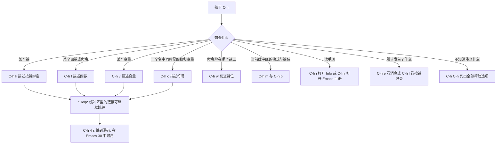
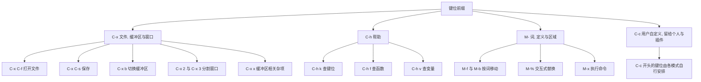
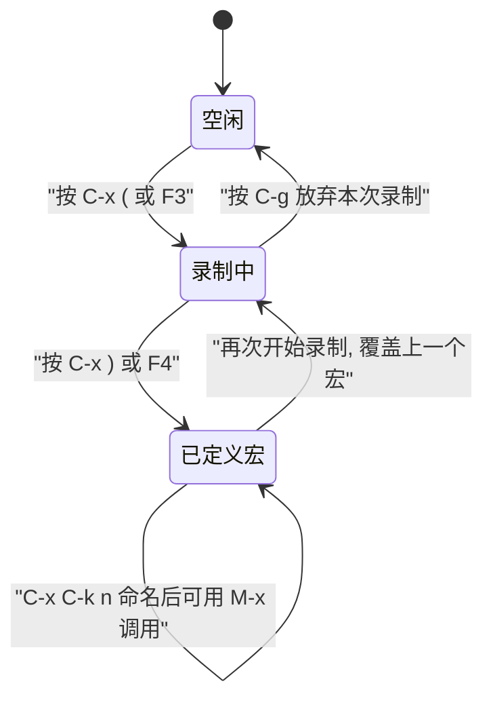

# 内置教程与基本操作

> 这一篇解决两个问题：怎样用 Emacs 自带的交互式教程把手指练熟，以及在没有装任何第三方包的情况下，用内置功能完成日常编辑。读完你应该能在不碰鼠标的情况下完成打开文件、移动、复制粘贴、搜索替换、管理窗口和批处理重复操作。

---

## 一、先跑一遍内置教程

Emacs 自带一份会手把手教你按键的交互式教程（learn-by-doing tutorial）。它比任何视频和文章都更适合入门，因为它边讲边让你在同一个缓冲区（buffer）里练习，练完你就已经形成了肌肉记忆。

### 1.1 启动教程：`C-h t`

按 `C-h t`，Emacs 会打开一个名为 `TUTORIAL` 的缓冲区。`C-h t` 绑定的是命令 `help-with-tutorial`，它的行为可以用 `C-h f help-with-tutorial RET` 自己核对，文档字符串写得很清楚：

- 如果当前「语言环境（language environment）」里有对应的教程版本，就用那个版本；
- 如果没有，就用英文的 `TUTORIAL`；
- 带前缀参数调用时，会让你选择语言。

所以「让内置教程显示中文」有两种做法。

### 1.2 让教程显示中文

第一种是一次性的：按 `C-u C-h t`，Emacs 会在小缓冲区（minibuffer）提示 `Language:`，输入或补全选择 `Chinese-GB`，回车后打开的教程就是简体中文版 `TUTORIAL.cn`。这里能做补全是因为 Emacs 只把「确实存在对应教程文件」的语言列进候选。

第二种是持久的：先切换语言环境，之后每次 `C-h t` 都直接是中文教程。

```elisp
;; 方式一：本次会话临时切换，随后 C-h t 会打开 TUTORIAL.cn
M-x set-language-environment RET Chinese-GB RET

;; 方式二：写进 ~/.emacs.d/init.el，以后每次启动都是这个语言环境
(set-language-environment "Chinese-GB")
```

想确认某个语言环境对应哪个教程文件，用 `C-h v` 查 `language-info-alist`，或者直接求值下面这行：

```elisp
;; 查看 Chinese-GB 这个语言环境登记的教程文件名，结果是 "TUTORIAL.cn"
(get-language-info "Chinese-GB" 'tutorial)
```

有三个新手必踩的坑，这里提前说清楚。

第一个坑是输入法。`Chinese-GB` 这个语言环境自带一个默认输入法 `chinese-py-punct`，切换过去以后，你在缓冲区里输入标点时可能会被自动转换，模式行（mode line）上会出现「拼」字样。用 `C-\`（`toggle-input-method`）可以随时关闭或打开输入法。写代码前建议先关掉。

第二个坑是编码。教程里讲的是按键，不涉及文件编码，但你自己写配置文件时最好显式声明：

```elisp
;; 让 Emacs 优先使用 UTF-8，避免中文在配置文件里变成乱码
(prefer-coding-system 'utf-8)
```

第三个坑是把「中文教程」误解成「中文界面」。Emacs 的帮助文档、菜单、错误信息主体是英文，上游并没有完整的中文翻译。所谓设置中文，实际影响的是教程文件、日期与示例文本这类与语言环境相关的内容。

### 1.3 教程缓冲区到底是个什么东西

了解这一点能避免很多困惑。教程缓冲区有几个不太像普通文件的地方：

- 缓冲区的名字就是教程文件名，例如 `TUTORIAL.cn`；
- 它**不访问任何文件**。Emacs 的源码注释明确写着不把教程缓冲区和文件关联起来，所以你可以在里面随便打字、删字，改坏了也不会影响安装目录里的原件；
- 你改动过的内容会在关闭教程时被询问是否保存，保存位置是 `~/.emacs.d/tutorial/` 目录下与教程同名的文件。下次再 `C-h t`，Emacs 会问你是否恢复上次的进度；
- 如果你改过教程里用到的任何标准键位，教程开头会自动插入一段说明，告诉你哪些键已经被改动。这是 Emacs 30 与更早版本都有的行为，靠的是教程在生成缓冲区时对比键位。

教程结束时用 `C-x k` 关闭它（`kill-buffer`）。教程里建议你先通读一轮，再回头做第二轮的练习部分。

### 1.4 内置教程覆盖了什么

它按顺序教你：用 `C-n`/`C-p`/`C-f`/`C-b` 移动、用 `C-v`/`M-v` 翻屏、用 `C-x C-f` 打开文件、用 `C-x C-s` 保存、用 `C-x C-c` 退出、用 `C-k` 和 `C-y` 剪贴、用 `C-s` 搜索、用 `C-x 2` 分屏、用 `C-h` 查帮助。也就是说，教程覆盖的正好是本文第三章到第九章的内容。先花二十分钟走完教程，再读下面的表格，效率最高。

---

## 二、帮助系统：Emacs 的自我文档能力

Emacs 最有价值的特性不是某个编辑器功能，而是它随时能回答「这个键是干什么的」「这个函数怎么用」。这套能力的入口全部挂在 `C-h` 这个前缀键下面。

### 2.1 十二个常用入口

| 键位 | 命令 | 回答什么问题 |
|------|------|--------------|
| `C-h C-h` | `help-for-help` | 帮助的目录本身，列出所有帮助选项 |
| `C-h k` | `describe-key` | 这个键位绑定到什么命令 |
| `C-h f` | `describe-function` | 这个函数/命令的文档、签名、定义位置 |
| `C-h v` | `describe-variable` | 这个变量的当前值、类型、文档 |
| `C-h o` | `describe-symbol` | 一个名字同时当函数和变量看 |
| `C-h w` | `where-is` | 这个命令绑在哪个键上 |
| `C-h m` | `describe-mode` | 当前主模式与启用的次模式及其键位 |
| `C-h b` | `describe-bindings` | 当前缓冲区里所有生效的键位 |
| `C-h i` | `info` | 打开 Info 手册浏览器 |
| `C-h r` | `info-emacs-manual` | 直接跳到 Emacs 官方手册 |
| `C-h e` | `view-echo-area-messages` | 回看一闪而过的提示与报错 |
| `C-h l` | `view-lossage` | 回看最近按过的键和它们触发的命令 |

下面逐个给一个真实例子。所有命令名都可以用 `C-h f 命令名 RET` 自行核对。

`C-h C-h` 会打开一个 `*Help*` 缓冲区列出全部帮助选项，它本身也在等待你输入一个字母。比如 `C-h C-h k` 与直接按 `C-h k` 等效。记不住 `C-h` 后面跟什么字母时，就用它。

`C-h k` 的用法是先按 `C-h k`，再按你想问的那个键。输入 `C-h k C-M-\`，Emacs 会告诉你这个键运行 `indent-region`。它也能接受前缀键：`C-h k C-x` 的回答是 `C-x` 运行 `Control-X-prefix`，并说明它已经被 `ctl-x-map` 取代、是一个「前缀命令」（定义本身是一张键位表）。鼠标事件同样可以描述：按 `C-h k` 之后点一下鼠标，会显示该点击对应的命令。Emacs 30 起，当键位是通过输入法或键盘翻译产生单个字符时，`describe-key` 会额外显示该字符的 Unicode 名称。

`C-h f` 接受函数名并支持补全。输入 `C-h f forward-char RET`，你会看到它的签名、绑定的键位、源码位置和文档。Emacs 30 对这一处做了两点改动：一是会用 `primitive-function` 这类由 `cl-type-of` 返回的类型名替代过去「内置函数」的说法，二是会显示推断出的函数类型，由 `help-display-function-type` 控制（默认开启）。想查宏也可以，宏的文档里会说明它展开成什么。

`C-h v` 用来查变量。输入 `C-h v package-archives RET`，能同时看到当前值、文档，以及它是否是缓冲区局部（buffer-local）变量。查缓冲区局部变量时会分别列出全局值和当前缓冲区的值，这正是排查「为什么配置没生效」的关键信息。

`C-h o`（`describe-symbol`）是 `C-h f` 和 `C-h v` 的合体：一个符号如果既是函数又是变量，`C-h o` 会一次性给出两部分文档。`C-h o kill-ring RET` 就是典型例子，它会同时展示 `kill-ring` 变量和同名函数。

`C-h w` 是反查键位。`C-h w forward-char RET` 会在回显区打印 `forward-char` 所在的键序列。它的前缀参数会把结果直接插入当前缓冲区，装配置时很方便：`C-u C-h w forward-char RET`。

`C-h m` 显示当前模式的信息。在一个 Emacs Lisp 缓冲区里按 `C-h m`，会看到 Emacs Lisp 主模式的说明、当前启用的次模式列表，以及每个模式的键位。它是回答「为什么这个键在这里行为不一样」的第一站。Emacs 30 起该缓冲区默认启用 Outline 次模式组织内容，由 `describe-mode-outline` 控制。

`C-h b` 列出当前缓冲区里所有生效的键位，按优先级排序（全局绑定、主模式绑定、次模式绑定依次覆盖）。它的文档字符串说明，从 Lisp 调用时可以用前缀参数只看某一段键序列下的绑定；从交互式使用看整表即可，配合 `C-s` 在帮助缓冲区里搜索很快。

`C-h i` 打开 Info 手册浏览器。进入以后常用的键是：`m` 选择菜单项（`Info-menu`）、`g` 直接跳到指定节点（`Info-goto-node`）、`n`/`p` 上/下一节点、`u` 上一层、`l` 返回历史、`i` 按索引查找（`Info-index`）、`,` 跳到下一个索引项、`s` 全文搜索（`Info-search`）、`TAB` 跳到下一个链接（`Info-next-reference`）、`RET` 跟随光标下的链接、`q` 退出。手册里给键位都标注了命令名，遇到不懂的命令名再回到 `C-h f` 查。

`C-h r` 是 `C-h i` 的快捷方式，直接打开 Emacs 官方手册，省去在 Info 里找菜单的步骤。

`C-h e` 打开 `*Messages*` 缓冲区，回看回显区里出现过的消息。新手最常见的场景是：回显区闪过一条错误但没看清，按 `C-h e` 就能看到原文。这个缓冲区保留的消息条数由 `message-log-max` 控制。

`C-h l` 打开 `view-lossage`，列出最近的输入键序列和它们各自触发的命令。忘了自己刚按了什么、或者想搞清某个操作对应的命令名时非常有用。它还支持带参数调用以自动刷新。

### 2.2 值得记住的扩展入口

除了上面十二个，还有几个查起来更快的入口：

- `C-h P`（`describe-package`）查看某个包的说明、版本、状态与来源，安装第三方包前后都用得上；
- `C-h 4 s`（`help-find-source`）在 `*Help*` 里跳转到被描述对象的源码，这是 Emacs 30 新增的命令；
- `C-h a`（`apropos-command`）按关键词搜索命令名，`C-h d`（`apropos-documentation`）按关键词搜索文档内容；
- `C-h .`（`display-local-help`）显示光标处文本上附带的帮助信息；
- `C-h F`（`Info-goto-emacs-command-node`）从命令名直接跳到手册里对应的节点，`C-h S`（`info-lookup-symbol`）按当前语言的语法习惯查符号；
- 任何前缀键按到一半时按 `C-h`，会列出这个前缀下面还有哪些可用键。这条规则由变量 `prefix-help-command` 实现，它的默认值是 `describe-prefix-bindings`；
- Emacs 30 起内置了 `which-key`：执行 `M-x which-key-mode` 打开后，你按下一个前缀键并停顿一会儿，回显区会展开列出后续可用的键位。停顿时间由 `which-key-idle-delay` 控制，默认 1.0 秒。对还在背键位的人，这个次模式的价值很高。

### 2.3 帮助系统的导航关系



第三方包 `helpful` 把 `C-h f`、`C-h v`、`C-h k` 换成了信息更密集的版本，会显示源码片段、调用者与相关变量。它不是必需品，先把内置的用熟再考虑。

---

## 三、基础移动与编辑

### 3.1 先把键位语法读懂

本文和官方文档统一使用这套写法，第一次接触的人先花一分钟记住：

| 写法 | 含义 |
|------|------|
| `C-f` | 按住 Control 再按 f |
| `M-f` | 按住 Meta 再按 f；Meta 通常是 Alt 键，也可以先按 `ESC` 再按 f |
| `C-M-\` | Control 和 Meta 一起按，再按反斜杠 |
| `C-x C-f` | 两段序列：先 `C-x` 再 `C-f`，不必同时按 |
| `C-x b` | 同理，先 `C-x` 再 `b` |
| `RET` | 回车 |
| `TAB` | 制表键 |
| `SPC` | 空格 |
| `S-` | Shift 修饰，例如 `S-<left>` |
| `M-x` | 呼出命令 |

不要写成 `^X` 或 `Ctrl+X`，那套写法在 Emacs 文档和配置文件里都不通用。

### 3.2 移动：字符、词、行、缓冲

| 键位 | 命令 | 动作 |
|------|------|------|
| `C-f` | `forward-char` | 前进一个字符 |
| `C-b` | `backward-char` | 后退一个字符 |
| `C-n` | `next-line` | 下一行 |
| `C-p` | `previous-line` | 上一行 |
| `M-f` | `forward-word` | 前进一个词 |
| `M-b` | `backward-word` | 后退一个词 |
| `C-a` | `move-beginning-of-line` | 行首 |
| `C-e` | `move-end-of-line` | 行尾 |
| `M-<` | `beginning-of-buffer` | 缓冲区开头 |
| `M->` | `end-of-buffer` | 缓冲区结尾 |
| `C-v` | `scroll-up-command` | 向后翻一屏 |
| `M-v` | `scroll-down-command` | 向前翻一屏 |
| `M-g g` | `goto-line` | 跳到指定行号 |
| `C-M-a` | `beginning-of-defun` | 跳到函数开头 |
| `C-M-e` | `end-of-defun` | 跳到函数结尾 |

`M-g g` 是唯一一个需要输入参数的移动命令：按下后在小缓冲区里输入行号回车。配合 `M-g i`（`imenu`）还能在当前文件里按函数名跳转，前提是主模式支持 imenu。

### 3.3 编辑：删除、剪切、粘贴

这里要先分清两个动作：**删除（delete）**只是把字符从缓冲区里去掉，**剪切（kill）**除了去掉还会把内容放进剪贴环（kill ring）。剪切区（region）的内容用 `kill-region`，只复制不删用 `kill-ring-save`。

| 键位 | 命令 | 动作 |
|------|------|------|
| `C-d` | `delete-char` | 删除光标后的一个字符 |
| `M-d` | `kill-word` | 剪切光标后的一个词 |
| `C-k` | `kill-line` | 剪切到行尾；在行尾再按一次剪切换行符 |
| `M-w` | `kill-ring-save` | 复制区域，不删除 |
| `C-w` | `kill-region` | 剪切区域 |
| `C-y` | `yank` | 粘贴剪贴环里最近一项 |
| `M-y` | `yank-pop` | 粘贴后紧接着按，换成剪贴环里更早的一项 |
| `C-/` | `undo` | 撤销 |
| `C-g` | `keyboard-quit` | 放弃当前命令或半个键序列 |
| `M-x` | `execute-extended-command` | 按名字执行命令 |
| `M-;` | `comment-dwim` | 注释/取消注释当前行或区域 |
| `C-M-\` | `indent-region` | 重新缩进区域 |
| `C-x C-s` | `save-buffer` | 保存当前缓冲区 |
| `C-x C-w` | `write-file` | 另存为 |
| `C-x C-c` | `save-buffers-kill-terminal` | 保存并退出 Emacs |

`C-g` 值得单独强调。它是 Emacs 的「退出键」：按错了半个键序列、命令卡在提问状态、误触了不想要的搜索，`C-g` 都能把你救回来。连按两次 `C-g` 通常能回到最外层。新手在 Emacs 里「出不来」的那些时刻，九成靠 `C-g` 解决。

`M-x` 是 Emacs 的可扩展性入口：任何一个有名字的命令都能通过它执行。按下 `M-x` 后按 `TAB` 会补全，`M-p`/`M-n` 翻历史，`C-g` 放弃。装了第三方包以后，很多功能没有默认键位，全部通过 `M-x` 使用。

### 3.4 键位前缀的分工



`C-c` 开头的键位是留给用户和第三方插件的约定空间，标准键位不会占用以 `C-c` 加一个字母的组合（`C-c` 加控制字符或数字另有它用）。这条约定意味着你在配置里写 `C-c` 开头的键位，冲突概率最低。

---

## 四、标记（mark）与区域（region）

### 4.1 三个术语

Emacs 里操作文本的模型和多数编辑器不同，需要先建立这三个概念：

- **光标点（point）**：插入点所在的位置，就是你在屏幕上看到的那个方块；
- **标记（mark）**：一个由你显式设置的位置，每个缓冲区各有一个；
- **区域（region）**：标记与光标点之间的那段文本。光标点一动，区域就跟着变。

设置标记的命令是 `C-SPC`（`set-mark-command`）：先按 `C-SPC` 确定一端，再移动光标到另一端，被高亮的部分就是区域。高亮的颜色来自 `region` 这个 face。

`C-x C-x`（`exchange-point-and-mark`）会把光标点和标记互换。它的作用是让你立刻看到区域的另一端在哪里，同时也是在区域失活之后重新激活它的手段。

### 4.2 transient-mark-mode 与区域的激活

区域高亮这个行为由全局次模式 `transient-mark-mode` 控制。Emacs 官方手册的说法是：交互式会话中这套行为是默认开启的；关闭它则切到另一种行为，区域通常不高亮。用 `C-h v transient-mark-mode RET` 可以核对你的实际环境；如果在批处理模式下求值（例如 `emacs -Q --batch`），它是关闭的，这是批处理环境没有交互框架（frame）的缘故，不要据此判断配置有问题。

开启以后有几个关键性质：

- 设置标记会「激活」它，区域随即高亮；
- 某些非移动类命令执行后，Emacs 会自动「失活」标记，高亮消失。改动文本的命令一定属于这一类；
- 任何时候都能用 `C-g` 手动取消激活；
- 按住 Shift 再按方向键选择文本，也是 transient-mark-mode 提供的「Shift 选择」行为。

### 4.3 对区域敏感的常用命令

很多命令会根据「是否存在活动区域」改变自己的作用范围。这是 Emacs 里最值得早点掌握的一类技巧。

| 键位 | 命令 | 无活动区域时 | 有活动区域时 |
|------|------|--------------|--------------|
| `C-w` | `kill-region` | 报错提示没有区域 | 剪切区域 |
| `M-w` | `kill-ring-save` | 报错提示没有区域 | 复制区域 |
| `M-%` | `query-replace` | 从光标点到缓冲区末尾 | 只在区域内替换 |
| `C-M-\` | `indent-region` | 报错提示没有区域 | 重新缩进区域 |
| `M-;` | `comment-dwim` | 注释当前行 | 注释整个区域 |
| `C-x TAB` | `indent-rigidly` | 调整当前行缩进 | 整体平移区域缩进 |

另外两个专门用来划定区域的命令：`C-x h`（`mark-whole-buffer`）选中整个缓冲区，`M-h`（`mark-paragraph`）选中当前段落。处理完一大段文本想整体缩进或复制时，它们是起手动作。

---

## 五、剪贴环（kill ring）与寄存器

### 5.1 剪贴环不是剪贴板

剪贴环是一个**全局**的历史列表，和多数编辑器只有一格剪贴板不同。每一次剪切都会把内容压入环中，`C-y` 取最近一次，`M-y` 在 `C-y` 之后继续按，就能依次取出更早的内容。

`M-y` 有一个使用条件：它必须紧跟在 `yank` 或另一个 `yank-pop` 之后。如果你中间执行了别的命令，再按 `M-y` 只会得到「上一条命令不是粘贴」的提示。这是最常见的困惑点，解决办法是重新 `C-y` 再 `M-y`。

环的长度由 `kill-ring-max` 控制，默认 120 条。想一次浏览整条环而不是逐次按 `M-y`，用 `M-x yank-from-kill-ring RET`，它会在小缓冲区里列出候选项供你选择。与图形界面剪贴板的同步由 `select-enable-clipboard` 控制（默认开启），如果你不希望剪切内容进入系统剪贴板，把它设为 `nil`。

另外两个能减少干扰的选项：`kill-do-not-save-duplicates` 在内容与环顶重复时不重复入环；`save-interprogram-paste-before-kill` 会在剪切前先把系统剪贴板里的内容存进环，避免用 Emacs 之外的程序复制的内容被覆盖。

### 5.2 寄存器（register）

寄存器是一组有名字的小格子，可以存位置、文本、数字和窗口配置。它们与剪贴环互不干扰，适合存放「经常要跳回去的地方」。

| 键位 | 命令 | 用途 |
|------|------|------|
| `C-x r SPC` | `point-to-register` | 把当前位置存进寄存器 |
| `C-x r j` | `jump-to-register` | 跳回寄存器记录的位置 |
| `C-x r s` | `copy-to-register` | 把区域内容存进寄存器 |
| `C-x r i` | `insert-register` | 插入寄存器内容 |
| `C-x r g` | `insert-register` | 同上，另一个默认键位 |
| `C-x r w` | `window-configuration-to-register` | 存下当前窗口布局 |
| `C-x r f` | `frameset-to-register` | 存下整个框架的布局 |
| `C-x r n` | `number-to-register` | 存一个数字 |
| `C-x r +` | `increment-register` | 把寄存器里的数字加一 |

`M-x list-registers` 列出当前所有寄存器的内容，`M-x view-register` 查看单个寄存器。实践中最常用的组合是：用 `C-x r w` 存下「写代码时的窗口布局」，读文档打乱布局以后用 `C-x r j` 一键还原。这与下一节的 `winner-mode` 是两种互补的布局记忆手段。

---

## 六、窗口（window）与框架（frame）

### 6.1 术语必须分清

Emacs 的 window 和 frame 与日常用语相反，这是新手最容易搞混的地方：

- **框架（frame）**：操作系统层面的一个窗口，有标题栏和边框。你在桌面上看到的那个 Emacs 窗口就是一个 frame；
- **窗口（window）**：框架内部的一块显示区域，一个 frame 可以横向或纵向切成多个 window，每个 window 显示一个缓冲区。

所以 Emacs 官方文档说「分割窗口」时指的是 `C-x 2` 这种把一个 frame 切开的操作，而不是再开一个操作系统窗口。本文统一按这个含义使用「窗口」和「框架」。

### 6.2 窗口操作

| 键位 | 命令 | 动作 |
|------|------|------|
| `C-x 2` | `split-window-below` | 上下分割，新窗口在下方 |
| `C-x 3` | `split-window-right` | 左右分割，新窗口在右侧 |
| `C-x 0` | `delete-window` | 关闭当前窗口 |
| `C-x 1` | `delete-other-windows` | 只保留当前窗口 |
| `C-x o` | `other-window` | 光标移到下一个窗口 |
| `C-x ^` | `enlarge-window` | 加高当前窗口，前缀参数决定行数 |
| `C-x }` | `enlarge-window-horizontally` | 加宽当前窗口 |
| `C-x {` | `shrink-window-horizontally` | 缩窄当前窗口 |
| `C-x +` | `balance-windows` | 均分所有窗口 |
| `C-x -` | `shrink-window-if-larger-than-buffer` | 把当前窗口压到内容高度 |
| `C-M-v` | `scroll-other-window` | 滚动另一个窗口，不切换过去 |
| `C-x 4 b` | `switch-to-buffer-other-window` | 在另一个窗口打开缓冲区 |
| `C-x 4 f` | `find-file-other-window` | 在另一个窗口打开文件 |
| `C-x 4 d` | `dired-other-window` | 在另一个窗口打开目录 |

`C-M-v` 是读代码时最省事的键：一个窗口放文档，另一个放代码，用 `C-M-v` 滚文档而不离开代码窗口。

内置的 `windmove` 提供了按方向跳窗口的键位。它默认没有开启，执行一次下面的代码即可：

```elisp
;; 启用后 S-<left> / S-<right> / S-<up> / S-<down> 按方向切换窗口
(require 'windmove)
(windmove-default-keybindings)
```

### 6.3 winner-mode：布局的撤销

`winner-mode` 是一个全局次模式，记录窗口布局的每一次变化，让你能撤销和重做布局本身。

```elisp
;; 在 init.el 中开启，之后 C-c <left> 撤销布局变化, C-c <right> 重做
(winner-mode 1)
```

开启后，`C-c <left>`（`winner-undo`）回到上一个布局，`C-c <right>`（`winner-redo`）再走回来。误按 `C-x 1` 关掉了所有窗口时，它比手动重新分割快得多。这两个键位在 `winner-mode-map` 里，只有开启该模式后才生效。

### 6.4 框架操作

| 键位 | 命令 | 动作 |
|------|------|------|
| `C-x 5 2` | `make-frame-command` | 新建一个框架 |
| `C-x 5 0` | `delete-frame` | 关闭当前框架 |
| `C-x 5 o` | `other-frame` | 切换到下一个框架 |
| `C-x 5 b` | `switch-to-buffer-other-frame` | 在另一个框架里打开缓冲区 |

`make-frame-command` 的文档字符串说明，新框架会建在同一个终端上；如果终端是纯文本终端，还会顺带选中新框架。也就是说在终端里跑 Emacs 时 `C-x 5 2` 依然有效，只是同一时刻只有一个框架可见，需要用 `C-x 5 o` 切换。

### 6.5 关于 M-o：一个已经失效的老键位

网上很多老教程会让你按 `M-o` 来设置文本属性、`M-o M-o` 来重新字体化。**这些键位在 Emacs 28 已经被移除**，Emacs 30 里 `M-o` 默认没有任何全局绑定。你可以自己核对：按 `C-h k M-o`，回显区会告诉你这个键没有绑定。

`M-o` 现在只在个别模式里有局部绑定，例如 `enriched-mode` 里 `M-o m` 绑定到 `enriched-toggle-markup`。遇到老教程里的 `M-o` 系列，直接跳过。需要按窗口跳转时用 `C-x o`、`C-x 4` 前缀或者上一节的 `windmove`。

---

## 七、缓冲区（buffer）管理

缓冲区是 Emacs 里承载文本的对象：打开文件会创建一个访问该文件的缓冲区，`*scratch*`、`*Messages*`、`*Help*` 这些也是缓冲区，只是它们不访问文件。所有编辑都发生在缓冲区里，保存时才写回文件。

| 键位 | 命令 | 动作 |
|------|------|------|
| `C-x b` | `switch-to-buffer` | 按名字切换缓冲区，支持补全 |
| `C-x C-b` | `list-buffers` | 用表格列出所有缓冲区 |
| `M-x ibuffer` | `ibuffer` | 功能更强的缓冲区列表 |
| `C-x k` | `kill-buffer` | 关闭缓冲区，有未保存改动时会询问 |
| `C-x C-q` | `read-only-mode` | 切换当前缓冲区的只读状态 |
| `C-x <left>` | `previous-buffer` | 切到上一个缓冲区 |
| `C-x <right>` | `next-buffer` | 切到下一个缓冲区 |

`C-x b` 是最高频的切换方式，输入名字的一部分按 `TAB` 就能补全；直接回车则回到上一个缓冲区。`C-x C-b` 给出的是经典表格视图；`ibuffer` 是内置的替代品，支持按模式、路径分组和批量操作，输入 `M-x ibuffer` 打开即可，不需要装包。

Emacs 29 起新增了 `C-x x` 这个前缀专门放缓冲区相关的杂项命令，全部可以用 `C-x x` 加一个字母触发：`C-x x r` 重命名缓冲区（`rename-buffer`）、`C-x x u` 生成唯一名字（`rename-uniquely`）、`C-x x i` 插入另一个缓冲区的内容（`insert-buffer`）、`C-x x t` 切换自动折行（`toggle-truncate-lines`）、`C-x x g` 重新读取文件（`revert-buffer-quick`）、`C-x x n` 克隆缓冲区（`clone-buffer`）、`C-x x f` 刷新字体化（`font-lock-update`）。

`C-x C-q` 把当前缓冲区切到只读，再按一次恢复。它的价值在于防止误改：查看日志、翻别人的代码时先切只读，手滑也不会写坏内容。需要注意的是某些模式会占用这个键，例如 dired 里它绑定的是 `dired-toggle-read-only`。

---

## 八、小缓冲区（minibuffer）与补全

小缓冲区是框架最下方那一行，Emacs 用它来读取命令参数、文件名、缓冲区名。它不是普通缓冲区，但在里面按的键遵循一套独立规则。

| 键位 | 命令 | 用途 |
|------|------|------|
| `TAB` | `minibuffer-complete` | 尽量补全当前输入 |
| `?` | `minibuffer-completion-help` | 列出所有候选 |
| `SPC` | `minibuffer-complete-word` | 补全到词边界 |
| `RET` | `minibuffer-completion-exit` | 采用当前输入并退出 |
| `M-p` | `previous-history-element` | 上一条历史输入 |
| `M-n` | `next-history-element` | 下一条历史输入 |
| `M-r` | `previous-matching-history-element` | 按正则向上搜索历史 |
| `M-s` | `next-matching-history-element` | 按正则向下搜索历史 |
| `C-g` | `abort-minibuffers` | 放弃这次输入 |

有几处细节值得记住。`SPC` 的补全行为只在普通补全里生效；在必须完全匹配的提示里（例如 `C-x k` 询问缓冲区名时），`RET` 走的是 `minibuffer-complete-and-exit`，会先把输入补全成唯一候选再退出。`M-p`/`M-n` 翻的是「这个提示自己的历史」，所以 `M-x` 的历史、`C-x C-f` 的文件历史互不干扰。`C-g` 在输入到一半时按下会直接放弃，命令不会执行；连续按会一层层退出。

补全候选默认显示在 `*Completions*` 缓冲区里。Emacs 内置了两种更紧凑的选择：`M-x fido-mode` 把补全做得像搜索框，`M-x fido-vertical-mode` 与 `M-x icomplete-vertical-mode` 把候选竖排显示在光标下方。这些都是内置功能，不需要安装任何包。第三方方案 `vertico` 走的是同一路线，功能更细。

---

## 九、搜索与替换

### 9.1 增量搜索：`C-s` 与 `C-r`

`C-s`（`isearch-forward`）和 `C-r`（`isearch-backward`）是 Emacs 的增量搜索：你每输入一个字符，Emacs 就立刻跳到第一个匹配处。它是日常使用频率最高的功能之一。

在搜索进行中（还没按 `RET` 退出），小缓冲区里的按键遵循 isearch 自己的一套映射，下面这些是常用的：

| 键位 | 命令 | 动作 |
|------|------|------|
| `C-s` | 重复向前查找 | 跳到下一个匹配 |
| `C-r` | 重复向后查找 | 跳到上一个匹配 |
| `RET` | `isearch-exit` | 结束搜索，光标停在当前位置 |
| `C-g` | `isearch-abort` | 放弃搜索并回到起点 |
| `M-e` | `isearch-edit-string` | 把当前搜索串取到小缓冲区里编辑 |
| `M-c` | `isearch-toggle-case-fold` | 切换大小写敏感性 |
| `M-r` | `isearch-toggle-regexp` | 把本次搜索切换成正则搜索 |
| `C-w` | `isearch-yank-word-or-char` | 把光标处的词或字符追加到搜索串 |
| `M-s w` | `isearch-toggle-word` | 切换整词搜索 |
| `M-s o` | `isearch-occur` | 用当前搜索串打开 occur 结果列表 |
| `M-s i` | `isearch-toggle-invisible` | 切换是否搜索不可见文本 |
| `C-\` | `isearch-toggle-input-method` | 在搜索中开关输入法 |
| `M-%` | `isearch-query-replace` | 用当前搜索串进入替换 |

`C-s C-s` 是不输入任何新内容、重复上一次搜索的快捷方式。`C-w` 是效率跃升点：想搜光标所在的那个标识符，按 `C-s` 再按两三次 `C-w` 就够了，不用手打。全局的 `C-M-s`（`isearch-forward-regexp`）和 `C-M-r`（`isearch-backward-regexp`）直接进入正则搜索，`M-s _`（`isearch-forward-symbol`）按符号搜索，`M-s w`（`isearch-forward-word`）按整词搜索。

匹配到的其他位置会以 `lazy-highlight` 这个 face 高亮显示，当前匹配用 `isearch` face，一眼就能分清主次。

### 9.2 逐个确认的替换：`M-%`

`M-%`（`query-replace`）先问要替换的字符串，再问替换成什么，然后逐个匹配让你确认。它的应答键定义在 `query-replace-map` 里：

| 应答键 | 动作 |
|--------|------|
| `SPC` 或 `y` | 替换这一处并继续 |
| `DEL` 或 `n` | 跳过这一处 |
| `!` | 剩下全部替换，不再询问 |
| `.` | 替换这一处后退出 |
| `,` | 替换这一处并停在原地显示结果 |
| `u` | 撤销上一次替换 |
| `q` | 退出 |
| `e` | 编辑替换文本 |
| `E` | 按大小写精确地编辑替换文本 |
| `C-r` | 进入递归编辑，改完用 `C-M-c` 退出（`M-x exit-recursive-edit`） |
| `C-l` | 把当前匹配移到屏幕中央 |
| `C-h` | 查看完整帮助 |

它的文档字符串说明了几个重要行为：如果当前有活动区域，替换只在区域内进行；`M-n` 可以把上一次增量搜索的字符串拉进「替换什么」的提示里；从小缓冲区角度看，`C-s C-s M-%` 这套连招能直接把搜索结果变成替换对象。替换时的大小写继承由 `case-fold-search` 与 `case-replace` 共同决定：两者都开启且搜索串不含大写字母时，替换文本会自动匹配原文的大小写形态。`replace-lax-whitespace` 开启后，搜索串里的空格可以匹配任意空白。

### 9.3 正则替换：`C-M-%`

`C-M-%`（`query-replace-regexp`）做同样的事，但把「找什么」当作 Emacs 正则表达式。它的替换文本里可以用 `\&` 表示整个匹配、`\1` 到 `\9` 表示第几个分组。下面是两个能直接用的例子。

```text
;; 把连续的多个空格压成一个空格
查找:  +
替换为: （一个空格，直接按空格键）

;; 交换等号两边的文本，例如把 foo=bar 变成 bar=foo
查找:  \([^=]+\)=\(.*\)
替换为: \2=\1
```

注意 Emacs 正则里分组括号要写成 `\(` `\)`，这一点与多数现代语言不同。不确定自己写的正则对不对时，先用 `C-M-s` 试搜一遍再替换。

---

## 十、键盘宏与重复命令

### 10.1 键盘宏：录制一次，重复多次

键盘宏（keyboard macro）记录你的一串按键，之后可以原样重放。它是内置功能，不需要任何包，用来处理「同一个改法要重复几十遍」的场景最有效。

| 键位 | 命令 | 动作 |
|------|------|------|
| `C-x (` | `kmacro-start-macro` | 开始录制 |
| `C-x )` | `kmacro-end-macro` | 结束录制 |
| `C-x e` | `kmacro-end-and-call-macro` | 结束并立即执行一次 |
| `F3` | `kmacro-start-macro-or-insert-counter` | 与 `C-x (` 等效 |
| `F4` | `kmacro-end-or-call-macro` | 结束或重复执行 |
| `C-x C-k n` | `kmacro-name-last-macro` | 给最后一个宏命名 |
| `C-x C-k b` | `kmacro-bind-to-key` | 把宏绑定到键位 |
| `C-x C-k RET` | `kmacro-edit-macro` | 以文本方式编辑宏 |
| `C-x C-k r` | `apply-macro-to-region-lines` | 对区域内每一行执行宏 |

`C-x e` 可以带数字前缀参数重复执行：`C-u 20 C-x e` 就是把宏跑 20 遍。文档字符串还说明，参数为零表示「重复到出错为止」，这在处理不定长内容时很有用。给宏命名（`C-x C-k n`）之后，它会变成一个真正的命令，可以 `M-x 名字` 调用，也可以通过 `C-x C-k b` 绑定键位；绑定到 `C-c` 开头的键位最安全。

录制时的一个常见坑：宏会记录所有按键，包括你为定位而按的移动键。所以录制前先把光标放到「第一处的起点」，录制中只包含从这一处到下一处的动作，重放才能对齐。

### 10.2 宏的状态变化



### 10.3 数字前缀参数与重复

前缀参数是 Emacs 的通用机制：绝大多数命令都接受「重复几次」或「用什么模式」的参数。

| 写法 | 效果 |
|------|------|
| `C-u` | `universal-argument`，单独按一次得到 4 倍参数 |
| `C-u 8 C-f` | 前进 8 个字符 |
| `M-8 C-f` | 同上，`M-数字` 直接输入数字 |
| `C-u C-u` | 参数变成 16，每再按一次 `C-u` 都翻倍 |
| `M--` | `negative-argument`，负参数 |
| `M-3 M--` | 配合使用得到 -3 |

`C-u` 的语义随命令而异：对 `C-f` 是次数，对 `C-k` 是「剪切整行」，对 `M-%` 是「只替换整词匹配」。想知道某个命令的前缀参数含义，用 `C-h f 命令名 RET` 看文档。

`C-x z`（`repeat`）重复上一条命令。它的特别之处在于：由于它是一个多字符键序列，重复时只需要反复按它最后一个字符 `z`。文档字符串说明，带前缀参数调用时会把前缀参数传给被重复的命令，不带参数时沿用该命令上次的参数。连续微调缩进、连续执行同一个宏时比重新输入命令快得多。

---

## 十一、dired：五个最常用的文件操作

`dired` 是内置的文件管理器，用 `C-x d` 打开（会提示目录名，回车确认），或者用 `C-x C-j`（`dired-jump`）从当前文件直接跳到它所在的目录。如果你的环境里 `C-x C-j` 没有绑定，先执行 `M-x load-library RET dired-x RET` 再试。

下面五个操作覆盖了日常绝大部分需求。

**一、进入目录与导航。** 进入 dired 后，`n`/`p`（`dired-next-line`/`dired-previous-line`）上下移动，`RET` 或 `f`（`dired-find-file`）在当前窗口打开光标下的文件或目录，`o`（`dired-find-file-other-window`）在另一个窗口打开，`^` 回到上一级目录，`q` 关闭 dired 窗口。

**二、标记与取消标记。** `m`（`dired-mark`）标记光标处的文件，`u`（`dired-unmark`）取消标记并下移，`U`（`dired-unmark-all-marks`）清除全部标记，`t`（`dired-toggle-marks`）反转标记。多数批量操作都以「先标记、再执行」的方式工作。

**三、删除。** 先用 `d`（`dired-flag-file-deletion`）给要删的文件打上删除标记，再用 `x`（`dired-do-flagged-delete`）真正执行。这个「先打标记再执行」的两步设计是刻意的：你可以在执行前反复检查标记，也可以用 `u` 撤销。跳过标记直接删单个文件用 `D`（`dired-do-delete`）。

**四、复制、重命名与新建目录。** `C`（`dired-do-copy`）复制、`R`（`dired-do-rename`）重命名或移动、`+`（`dired-create-directory`）新建目录。目标路径可以用 `~`、`..` 这类简写，dired 会补全。

**五、刷新目录。** `g`（`revert-buffer`）重新读取目录内容。外部程序改动了文件系统之后，用 `g` 让 dired 显示最新状态，比退出重进快。

额外一个值得知道的技巧：在 dired 里按 `C-x C-q`（`dired-toggle-read-only`）会进入 wdired，把目录列表变成一段可编辑的文本，你可以像改普通文本一样批量改名，最后用 `C-c C-c` 提交。批量重命名用它比逐个 `R` 快得多。

---

## 十二、第一周生存键位表

下面这些键位按预计使用频率排序。一周之内把它们变成肌肉记忆，之后学习别的功能会顺畅很多。这张表里的每一项都能用 `C-h k` 自己核对。

| 顺序 | 键位 | 命令 | 用途 |
|------|------|------|------|
| 1 | `C-g` | `keyboard-quit` | 取消当前操作，万能退出键 |
| 2 | `C-x C-s` | `save-buffer` | 保存 |
| 3 | `C-x C-f` | `find-file` | 打开文件 |
| 4 | `C-s` | `isearch-forward` | 向前搜索 |
| 5 | `C-/` | `undo` | 撤销 |
| 6 | `M-x` | `execute-extended-command` | 按名字执行命令 |
| 7 | `C-n` / `C-p` | `next-line` / `previous-line` | 上下移动 |
| 8 | `C-f` / `C-b` | `forward-char` / `backward-char` | 左右移动 |
| 9 | `C-a` / `C-e` | `move-beginning-of-line` / `move-end-of-line` | 行首行尾 |
| 10 | `C-y` | `yank` | 粘贴 |
| 11 | `M-w` | `kill-ring-save` | 复制 |
| 12 | `C-w` | `kill-region` | 剪切 |
| 13 | `C-k` | `kill-line` | 剪切到行尾 |
| 14 | `M-y` | `yank-pop` | 粘贴后换成更早的剪切内容 |
| 15 | `C-x b` | `switch-to-buffer` | 切换缓冲区 |
| 16 | `C-x C-b` | `list-buffers` | 列出缓冲区 |
| 17 | `M-%` | `query-replace` | 交互式替换 |
| 18 | `C-x 1` | `delete-other-windows` | 只留当前窗口 |
| 19 | `C-x 2` | `split-window-below` | 上下分屏 |
| 20 | `C-x o` | `other-window` | 跳到下一个窗口 |
| 21 | `C-h k` | `describe-key` | 查某个键是干什么的 |
| 22 | `C-h f` | `describe-function` | 查某个命令怎么用 |
| 23 | `C-h v` | `describe-variable` | 查变量的值和文档 |
| 24 | `C-x d` | `dired` | 打开文件管理器 |
| 25 | `C-M-v` | `scroll-other-window` | 滚另一个窗口 |
| 26 | `C-x C-c` | `save-buffers-kill-terminal` | 保存并退出 |
| 27 | `C-u` | `universal-argument` | 数字前缀参数 |
| 28 | `C-x z` | `repeat` | 重复上一条命令 |
| 29 | `C-x (` / `C-x )` / `C-x e` | 宏录制三件套 | 录制并重放按键序列 |
| 30 | `M-<` / `M->` | `beginning-of-buffer` / `end-of-buffer` | 跳到文件首尾 |

---

## 十三、五个由易到难的练习

下面五个练习都只用内置功能，做完可以对照每条的验收方式自查。

**练习一（查帮助）。** 用 `C-h k` 查出 `C-M-\` 绑定的是哪个命令；用 `C-h f` 查看 `forward-char` 的文档并确认它绑在哪些键上；用 `C-h w` 反查 `undo` 绑在哪个键上；最后用 `C-u C-h w undo RET` 把反查结果插入 `*scratch*` 缓冲区。验收方式：`*scratch*` 里出现了一行键位说明，并且与 `C-h k C-/` 的结果一致。

**练习二（剪贴环）。** 在 `*scratch*` 里写三行不同的文字。用 `C-k` 把第一行剪掉，用 `C-k` 剪掉第二行，然后 `C-y` 粘贴、`M-y` 连续按两次，观察粘贴内容的轮换。再用 `M-x yank-from-kill-ring` 从整条环里挑一条插入。验收方式：能解释为什么第三次 `M-y` 之后内容又回到了最近一次剪切的内容。

**练习三（窗口与布局）。** 用 `C-x 3` 左右分屏，两个窗口分别用 `C-x C-f` 打开两个不同文件；用 `C-x o` 在两个窗口间切换；用 `C-x ^` 和 `C-x }` 调整大小；然后 `M-x winner-mode RET` 开启布局记录，用 `C-x 1` 关掉一个窗口，再按 `C-c <left>` 把布局恢复回来。验收方式：`C-c <right>` 能再次回到只有一个窗口的状态。

**练习四（搜索与替换）。** 在 `*scratch*` 里粘一段有重复单词的文本。用 `C-s` 搜索其中一个单词，搜到后按两三次 `C-w` 把搜索串扩成完整单词，再用 `M-s w` 切成整词搜索；退出搜索后用 `M-%` 把该词替换成别的词，中途用 `u` 撤销一次替换，最后用 `q` 退出；再用 `C-M-%` 把连续的多个空格替换成单个空格。验收方式：替换结果符合预期，且 `C-/` 能撤销这次替换。

**练习五（键盘宏）。** 造一个有十行的列表，每行都是普通文字。录制一个宏：`C-a` 到行首，插入 `- `，`C-n` 移到下一行行首，然后 `C-x )` 结束。用 `C-u 9 C-x e` 让剩下九行都加上前缀，接着用 `C-x C-k n` 给宏起个名字，再用 `M-x 名字` 调用一次验证它已经变成命令。最后用 `C-x C-k RET` 打开宏的文本形式，看看 Emacs 记录的按键序列长什么样。验收方式：十行都带上了 `- ` 前缀，且 `M-x` 能通过名字调用这个宏。

---

## 小结

- `C-h t` 是入门第一站，`C-u C-h t` 可以选中文教程；整个 `C-h` 家族是 Emacs 的自我文档系统，遇到任何不认识的键、函数、变量都先用它查，不要靠猜。
- 移动、剪切、粘贴、搜索替换这几组键位是使用频率最高的部分，先把它们练成条件反射，再学窗口与缓冲区管理；`C-g` 是随时可用的退出键。
- 剪贴环、寄存器、键盘宏、前缀参数是四个「一次学会、长期受益」的机制，它们能把重复劳动压缩成几次按键。

---

## 相关章节

- [[emacs教程/1入门/00_认识Emacs|认识 Emacs]]
- [[emacs教程/1入门/03_配置文件从零开始|配置文件从零开始]]
- [[emacs教程/1入门/05_从Vim迁移|从 Vim 迁移]]
- [[emacs教程/2Elisp语言/01_求值与数据类型|Elisp 求值与数据类型]]
- [[emacs教程/2Elisp语言/08_命令与键位映射|命令与键位映射]]
- [[emacs教程/2Elisp语言/09_Mode与Hook机制|Mode 与 Hook 机制]]
- [[emacs教程/3配置实践/03_键位系统设计|键位系统设计]]
- [[emacs教程/7进阶/04_常见故障排查|常见故障排查]]
- [[vim教程|Vim 编辑器教程]]

## 参考资料

- Emacs 官方手册（含 Mark、Killing、Windows、Frames、Dired、Keyboard Macros 等章节）https://www.gnu.org/software/emacs/manual/html_node/emacs/
- Emacs Lisp 参考手册单页版 https://www.gnu.org/software/emacs/manual/html_mono/elisp.html
- Mastering Emacs 博客 https://www.masteringemacs.org/
- Emacs 中文社区论坛 https://emacs-china.org/
- Emacs 101 新手指南 https://github.com/emacs-tw/emacs-101-beginner-survival-guide
- helpful（第三方帮助增强包，MELPA 与 GNU ELPA 均可安装）https://github.com/Wilfred/helpful
- which-key（Emacs 30 起内置，此处是上游仓库）https://github.com/justbur/emacs-which-key
