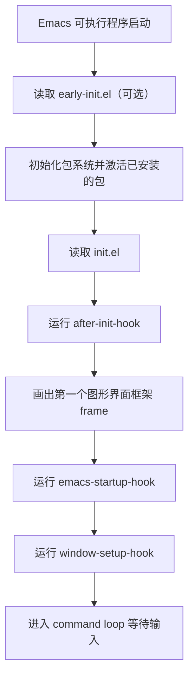
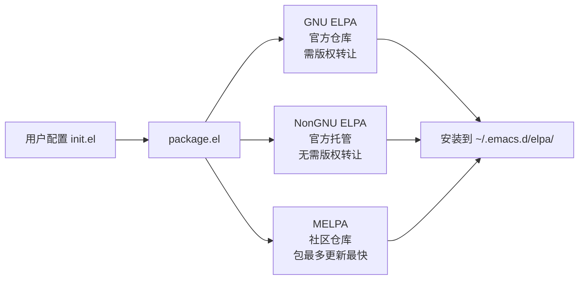
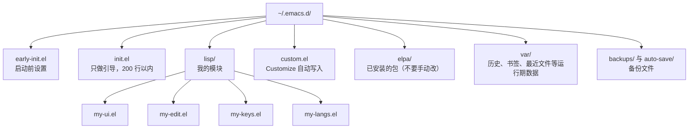

# 配置文件从零开始

> 本篇的目标只有一个：让你在最短时间内拥有一个**能跑、能改、改不坏**的 Emacs 配置。读完你可以关掉这篇，立刻开始写自己的 `init.el`。

---

## 一、先搞清楚配置文件是什么

很多新手在 Emacs 门口卡住，不是因为难，而是因为不知道"我写的这几行字，Emacs 到底什么时候读、读完之后发生了什么"。先把这件事讲清楚，后面所有问题都会变得简单。

### 1.1 配置文件就是一个普通的 Elisp 文件

`init.el` 没有任何特殊格式。它就是一个后缀为 `.el` 的 Emacs Lisp 文件，启动时被 Emacs 从头到尾**求值**一遍。你在里面写的每一行，都等价于在 `M-:`（`eval-expression`）里敲一次同样的内容。

这一点非常重要，它意味着：

- 你可以像编辑普通代码一样编辑配置（括号高亮、自动缩进、跳转到定义都能用）。
- 你可以**随时**用 `M-x eval-buffer` 把当前配置重新执行一遍，而不必重启 Emacs。
- 任何一行报错，你都能用调试器定位到具体位置，而不是面对一个黑盒。

### 1.2 配置文件放在哪里

Emacs 按固定顺序查找用户配置文件，找到第一个就用，后面的全部忽略。

| 顺序 | 路径 | 说明 |
|------|------|------|
| 1 | `~/.emacs.d/init.el` | 传统主流位置，Windows 上同样是 `%USERPROFILE%\.emacs.d\init.el` |
| 2 | `~/.config/emacs/init.el` | XDG 规范位置，Emacs 27 起支持，Linux 用户常用 |
| 3 | `~/.emacs` | 最古老的形式，裸文件，不推荐 |
| 4 | `~/.emacs.el` | 同上，也不推荐 |

建议选第 1 种。原因是生态里绝大多数文档、别人的配置、`use-package` 的示例都默认 `~/.emacs.d/`；`~/.config/emacs/` 完全可用，但你需要自己记住"我的路径和别人不一样"。

想知道你的 Emacs 实际用的是哪个文件，执行：

```elisp
M-: user-init-file RET
```

它会打印出实际加载的 `init.el` 绝对路径。**每次配置不生效时，第一个该确认的就是这个值。**

### 1.3 三个平台怎么创建

```bash
# Linux 与 macOS：创建目录和文件
mkdir -p ~/.emacs.d
touch ~/.emacs.d/init.el
```

```powershell
# Windows PowerShell
New-Item -ItemType Directory -Force -Path "$env:USERPROFILE\.emacs.d" | Out-Null
New-Item -ItemType File -Force -Path "$env:USERPROFILE\.emacs.d\init.el" | Out-Null
```

```cmd
:: Windows cmd
mkdir "%USERPROFILE%\.emacs.d"
type nul > "%USERPROFILE%\.emacs.d\init.el"
```

创建之后不必重启 Emacs，直接 `M-x eval-buffer` 让当前缓冲区生效即可。

### 1.4 early-init.el 是什么

除了 `init.el`，还有一个可选的 `early-init.el`，位置与 `init.el` 同级。它**先于** `init.el` 加载，加载时机早到"包系统还没初始化、图形界面的第一帧还没画出来"。因此它适合放：

- 包系统相关设置（`package-enable-at-startup`、`package-archives`）
- 与启动速度相关的临时设置（GC 阈值）
- 图形界面的第一帧参数（`default-frame-alist`、`menu-bar-mode` 之类，放这里可以避免"启动时先闪一下菜单栏再消失"）

新手**不需要**一开始就写 `early-init.el`。等你觉得启动时界面闪动、或者想统一管理包来源时再补。

### 1.5 加载顺序全景



掌握这张图有两个直接好处：第一，你知道哪些设置必须放前面（包来源放 `early-init.el`）；第二，你知道"启动后自动执行某件事"该挂哪个钩子——想在窗口都建好之后再做点什么，就挂 `emacs-startup-hook`。

---

## 二、五分钟得到一个能用的 Emacs

先不要追求完美。下面的内容可以直接整体复制进 `init.el`，保存后 `M-x eval-buffer`，或者重启 Emacs。

### 2.1 最小可用配置（逐行都有解释）

```elisp
;;; init.el --- 我的 Emacs 配置  -*- lexical-binding: t; -*-

;; 第一行是文件头注释。
;; lexical-binding: t 是必须的：它开启词法作用域，
;; 没有它，闭包、回调、很多现代包的代码都会行为异常。
;; 建议把它当成所有 .el 文件的第一行固定动作。

;; ---------- 界面：先让眼睛舒服 ----------
(setq inhibit-startup-screen t)   ; 关掉启动画面（那个 GNU 图标与帮助链接）
(setq initial-scratch-message nil) ; 关掉 *scratch* 里的提示文字
(menu-bar-mode -1)                 ; 关掉菜单栏（想要菜单就删掉这行）
(when (display-graphic-p)          ; 只在图形界面下执行，终端里这些模式不存在
  (tool-bar-mode -1)               ; 关掉工具栏
  (scroll-bar-mode -1))            ; 关掉滚动条

;; ---------- 编辑习惯 ----------
(setq-default indent-tabs-mode nil) ; 用空格缩进，不用制表符
(setq-default tab-width 4)          ; 一个制表符显示为 4 个空格宽
(setq sentence-end-double-space nil) ; 句号后只留一个空格（英文写作时很关键）
(global-display-line-numbers-mode 1) ; 显示行号
(column-number-mode 1)               ; 状态栏显示列号
(electric-pair-mode 1)               ; 自动补全括号
(show-paren-mode 1)                  ; 高亮匹配的括号
(delete-selection-mode 1)            ; 选中文本后直接输入即替换（现代编辑器习惯）
(setq ring-bell-function 'ignore)    ; 不响铃、不闪屏
(setq use-short-answers t)           ; yes-or-no-p 简化为 y-or-n-p（Emacs 28 起）

;; ---------- 让 Emacs 记住我用过什么 ----------
(save-place-mode 1)                  ; 记住每个文件上次编辑的位置
(savehist-mode 1)                    ; 记住 minibuffer 历史
(recentf-mode 1)                     ; 记录最近打开的文件
(global-auto-revert-mode 1)          ; 文件在外部被改动时自动刷新缓冲区
(winner-mode 1)                      ; C-c <left> / C-c <right> 撤销窗口布局变化

;; ---------- 把生成文件收进一个目录，别弄脏项目 ----------
(setq backup-directory-alist
      `(("." . ,(locate-user-emacs-file "backups"))))
(setq auto-save-file-name-transforms
      `((".*" ,(locate-user-emacs-file "auto-save") t)))
(setq create-lockfiles nil)          ; 不生成 .#foo 锁文件（Windows 上尤其烦）

;; ---------- 让 Customize 写自己的文件，别动我的 init.el ----------
(setq custom-file (locate-user-emacs-file "custom.el"))
(load custom-file :no-error t)       ; 文件不存在时不要报错

;; ---------- 滚动别乱跳 ----------
(setq scroll-conservatively 101)     ; 光标到边缘时只滚动一行，而不是半屏
(setq mouse-wheel-progressive-speed nil)

(provide 'init)
;;; init.el ends here
```

保存，然后 `M-x eval-buffer`。界面应该立刻变干净，行号出现，状态栏有列号。

### 2.2 配置怎么生效：三种方式，按代价排序

| 方式 | 操作 | 生效范围 | 代价 |
|------|------|----------|------|
| 求值一个表达式 | 把光标放在 `(setq ...)` 后面，按 `C-x C-e` | 只有这一个表达式 | 最小，适合试探 |
| 重新执行整个文件 | `M-x eval-buffer` | 当前 `init.el` 的全部内容 | 小，日常主力方式 |
| 重启 Emacs | 退出后重新打开 | 一切 | 大，但能暴露"卸载/清理"类问题 |

日常改配置的正确节奏是：**先 `C-x C-e` 试探单行，确认有效再 `M-x eval-buffer` 整体重跑，最后才重启验证。**

### 2.3 配置出错了怎么救

这是新手最恐惧、也最容易解决的一件事。Emacs 的配置错误几乎不会造成任何损失，因为配置就是一个文本文件。


必须记住的两条命令：

```bash
# 完全不读任何配置启动（干净环境），用于救援与排查
emacs -Q

# 启动并打印配置错误的具体位置
emacs --debug-init
```

如果 Emacs 启动就卡死，在终端里用 `emacs -Q` 打开 `init.el`，把你最近改的部分整体注释掉（选中区域后 `M-;`），保存、重启，就能回到可用状态。**配置永远是可以救回来的，这应当是你在 Emacs 里最早建立的信心。**

---

## 三、第一批真正值得改的 20 项

上面的最小配置只是让界面顺眼。下面这 20 项才是"用起来顺手"的关键。它们按照"收益 / 风险"排序，可以逐条加。

### 3.1 编辑效率类

```elisp
;; 1. 光标到达屏幕上下边缘时只滚动一行，而不是半屏（已在最小配置中）
(setq scroll-conservatively 101)

;; 2. 到达文件首尾时不要把光标停在原地，而是继续滚动到尽头
(setq scroll-error-top-bottom t)

;; 3. 搜索的大小写规则：
;;    全小写的搜索串自动忽略大小写；含大写字母时区分大小写。
;;    search-upper-case 设为 not-yanks 表示"从 kill-ring 取来的搜索串不享受这个规则"
(setq case-fold-search t)          ; 默认即为 t，此处显式写出以便理解
(setq search-upper-case 'not-yanks)

;; 4. 选中文本后直接输入即替换选中内容（现代编辑器习惯）
(delete-selection-mode 1)

;; 5. 大文件与超长行保护：行长度超过阈值时自动切换到简化显示模式
(setq so-long-threshold 1000)
(global-so-long-mode 1)            ; Emacs 27 起内置，打开压缩过的 JS 或日志时的救命设置
```

### 3.2 文件与备份类

```elisp
;; 6. 自动保存间隔：每 20 秒无输入就写一次自动保存文件
;;    （真正的"保存到原文件"仍需 C-x C-s，这里说的是崩溃保护）
(setq auto-save-interval 20)

;; 7. 备份保留策略：不要让备份目录无限增长
(setq delete-old-versions t)       ; 超出数量的旧备份直接删除，不再询问
(setq kept-new-versions 6)         ; 保留最近 6 个版本
(setq kept-old-versions 2)         ; 保留最早 2 个版本

;; 8. 版本控制管理的文件不生成备份（避免把备份文件提交进去）
(setq vc-make-backup-files nil)

;; 9. 打开文件时自动跳回上次编辑位置（已在最小配置中）
(save-place-mode 1)

;; 10. 退出时如果还有正在运行的子进程，不要弹确认框
;;     （默认会问"是否真的要退出"，对经常开终端的人很烦）
(setq confirm-kill-processes nil)
```

### 3.3 交互与反馈类

```elisp
;; 11. 补全列表只在按下 TAB 时展开，不要自动弹出打断输入
(setq completion-auto-help 'lazy)

;; 12. 确认类提问用简答形式（y/n 代替 yes/no，Emacs 28 起）
(setq use-short-answers t)

;; 13. minibuffer 最多占屏幕高度的四分之一，避免长候选列表挤掉正文
(setq max-mini-window-height 0.25)

;; 14. 让 minibuffer 与各种命令记住历史（已在最小配置中）
(savehist-mode 1)
```

### 3.4 键位修补类

Emacs 的默认键位有几十年历史，下面几处是公认"改了更好"的地方。

```elisp
;; 15. 用 Shift+方向键在窗口之间跳转（windmove，内置）
(when (fboundp 'windmove-default-keybindings)
  (windmove-default-keybindings))   ; 绑定 S-<left>、S-<right>、S-<up>、S-<down>

;; 16. C-x C-j 打开当前文件所在目录（由内置的 dired-x 提供）
(require 'dired-x)

;; 17. 用 C-c l 打开配置文件，随时回来改
(defun my-open-init-file ()
  "打开用户的 init.el 配置文件。"
  (interactive)
  (find-file user-init-file))
(global-set-key (kbd "C-c l") #'my-open-init-file)

;; 18. 一键重新加载配置
(defun my-reload-init-file ()
  "重新加载用户配置文件。"
  (interactive)
  (load-file user-init-file)
  (message "配置已重新加载"))
(global-set-key (kbd "C-c r") #'my-reload-init-file)

;; 19. F5 重新执行上一次编译命令（详细用法见编译章节）
(global-set-key (kbd "<f5>") #'recompile)

;; 20. C-x C-b 换成信息更全的 ibuffer
(global-set-key (kbd "C-x C-b") #'ibuffer)
```

### 3.5 收益与风险对照

| 配置项 | 收益 | 风险 | 建议 |
|--------|------|------|------|
| 关闭菜单栏与工具栏 | 界面干净、多出几行显示区 | 新手失去菜单这个"发现功能"的入口 | 先留着菜单，熟练后再关 |
| 关闭滚动条 | 视觉统一 | 无 | 放心改 |
| 显示行号 | 定位与沟通方便 | 超长文件下有性能开销 | 大文件场景改用 `display-line-numbers-type` 调整 |
| 自动保存与自动刷新 | 数据更安全、文件更同步 | 极少数情况下会打断思路 | 放心改 |
| 备份目录集中 | 项目目录干净 | 备份位置变了，找回旧版本时要记得去哪找 | 放心改 |
| 全局改键 | 手感立刻提升 | 与教程、他人配置、文档不一致 | 少改，且每改一个都记下来 |

---

## 四、装上第一个包

界面顺眼之后，下一步往往是"我想要某个功能"。Emacs 装包的标准流程如下。

### 4.1 配置包来源

包来源建议放在 `early-init.el`：这样在包系统初始化之前就已经知道了仓库地址。

```elisp
;;; early-init.el --- 启动前配置  -*- lexical-binding: t; -*-

;; 包仓库：GNU ELPA 与 NonGNU ELPA 是官方维护的，MELPA 是社区仓库、包最多
(setq package-archives
      '(("gnu"    . "https://elpa.gnu.org/packages/")
        ("nongnu" . "https://elpa.nongnu.org/nongnu/")
        ("melpa"  . "https://melpa.org/packages/")))

;; 也可以设置优先级，让同名包优先从官方仓库安装
(setq package-archive-priorities
      '(("gnu" . 10) ("nongnu" . 8) ("melpa" . 0)))

(provide 'early-init)
;;; early-init.el ends here
```

三个仓库的关系要理解清楚：



### 4.2 用 use-package 声明包

`use-package` 在 Emacs 29 起已内置，不需要额外安装。它解决的问题是：把一个包的"安装、配置、加载时机、键位绑定"写在一处，而不是散落在文件的各个位置。

最小用法：

```elisp
;; 确保包已安装（:ensure t），首次启动时会自动下载
(use-package which-key
  :ensure t
  :config
  ;; :config 里的内容在包真正加载之后执行
  (which-key-mode 1))
```

几条使用要点：

- `:ensure t` 表示"没装就装"。加了这个，你不需要手动 `M-x package-install`。
- `:config` 中的代码只在包被加载后执行；`:init` 中的代码在配置读取时就执行，但要小心——此时包可能还没加载。
- `:bind` 绑定键位时会自动引入包的延迟加载：

```elisp
(use-package magit
  :ensure t
  :bind ("C-x g" . magit-status))
```

上面这段的含义是：**只有当你按下 `C-x g` 时才真正加载 Magit**。这是 Emacs 启动速度优化的核心手段，也是 `use-package` 最大的价值。

### 4.3 手动装包（不用 use-package）

```elisp
;; 刷新包列表（首次使用或想装新包时执行一次）
M-x package-refresh-contents RET

;; 安装指定包
M-x package-install RET 包名 RET

;; 查看已安装包、升级、删除
M-x list-packages RET
```

在 `*Packages*` 缓冲区里，`i` 标记安装、`d` 标记删除、`U` 全选可升级项、`x` 执行。装完的包会在下次启动时自动激活——**从 Emacs 27 起 `package.el` 会在启动时自动完成激活，所以你不需要在 `init.el` 里写 `(package-initialize)`**。如果不确定当前版本的行为，用 `C-h v package-enable-at-startup RET` 查看。

### 4.4 前五个包推荐

| 包名 | 作用 | 为什么先装它 | 来源 |
|------|------|--------------|------|
| `which-key` | 按下前缀键后列出后续可用按键 | 解决"记不住键位"，是新手最该有的包 | Emacs 30 起内置 |
| `magit` | Git 的完整图形化前端 | 把版本控制变成按几个键的事 | MELPA |
| `vertico` | minibuffer 补全框架 | 让 `M-x`、找文件的体验接近现代编辑器 | MELPA |
| `corfu` | 缓冲区内的自动补全 | 敲代码时的补全弹窗 | MELPA |
| `modus-themes` | 高质量配色主题 | 护眼，且 Emacs 29 起内置 | Emacs 29 起内置 |

这四个第三方包的配置写法会在后面的章节逐个展开，此处先把它们装进环境即可。

---

## 五、把配置拆成模块

一个 `init.el` 写到三四百行还好，写到两三千行就会变成灾难：找不到东西、改一处忘一处、一删就崩。**在配置还没变大的时候就拆分**，成本最低。

### 5.1 推荐目录结构



这个结构里，只有 `early-init.el`、`init.el`、`lisp/` 需要纳入 Git 版本控制；`elpa/`、`var/`、`backups/` 都是运行期产物。

### 5.2 init.el 只做三件事

```elisp
;;; init.el --- 引导  -*- lexical-binding: t; -*-

;; 第一件：把自己的模块目录加入 load-path
(add-to-list 'load-path (expand-file-name "lisp" user-emacs-directory))

;; 第二件：按顺序加载模块
;; 每个模块只关心自己那一件事，模块之间不互相 require
(require 'my-ui)     ; 界面：主题、字体、行号、模式行
(require 'my-edit)   ; 编辑习惯：缩进、补全、搜索
(require 'my-keys)   ; 键位：统一放在这里，避免散落各处
(require 'my-langs)  ; 语言相关的配置

;; 第三件：收尾
(setq custom-file (locate-user-emacs-file "custom.el"))
(load custom-file :no-error t)

(provide 'init)
;;; init.el ends here
```

### 5.3 模块文件的写法

每个模块是一个独立文件，用 `provide` 声明自己的名字：

```elisp
;;; my-ui.el --- 界面相关配置  -*- lexical-binding: t; -*-

;;; Commentary:
;; 主题、字体、行号、模式行等纯外观设置。
;; 本模块不依赖其他 my-* 模块。

;;; Code:

(setq inhibit-startup-screen t)
(menu-bar-mode -1)
(when (display-graphic-p)
  (tool-bar-mode -1)
  (scroll-bar-mode -1))

(global-display-line-numbers-mode 1)
(column-number-mode 1)

;; 缩进参考线（内置）
(when (fboundp 'global-display-line-numbers-mode)
  (setq display-line-numbers-type 'visual))  ; 视觉行号，长行折行时更准确

(provide 'my-ui)
;;; my-ui.el ends here
```

注意文件的三段式结构：文件头注释（含 `lexical-binding`）→ `;;; Commentary:` 说明用途 → `;;; Code:` 后是真正的代码 → 末尾 `provide` 与 `ends here`。这是 Emacs 社区的统一惯例，遵守它能让 `M-x checkdoc`、包发布、别人读你的配置都更顺畅。

### 5.4 让模块出错不至于搞垮启动

一旦模块多了，某个模块报错导致整个 Emacs 起不来是迟早的事。用一个包装函数把风险隔开：

```elisp
(defun my-load-module (feature)
  "安全加载 FEATURE 模块，出错时只记录信息而不中断启动。"
  (condition-case err
      (require feature)
    (error
     (message "模块 %s 加载失败：%s" feature (error-message-string err)))))

(my-load-module 'my-ui)
(my-load-module 'my-edit)
(my-load-module 'my-keys)
(my-load-module 'my-langs)
```

出错时启动照常完成，错误信息留在 `*Messages*` 里（用 `C-h e` 查看）。排查完之后再改回严格的 `require`。

---

## 六、配置里最常用的六种写法

看懂别人的配置，靠的不是背函数，而是认出这几种"配置惯用句式"。把下面六种认全，八成以上的配置你都能读懂。

### 6.1 设置变量：`setq` 与 `setq-default`

```elisp
;; setq 设置当前缓冲区的值
(setq truncate-lines nil)

;; setq-default 设置默认值——对"每个缓冲区自动拥有副本"的变量必须用它
(setq-default indent-tabs-mode nil)
(setq-default tab-width 4)
```

区分方法：如果变量是 buffer-local 的（比如 `indent-tabs-mode`、`tab-width`、`fill-column`），`setq` 只影响当前缓冲区，配置里几乎总是该用 `setq-default`。用 `C-h v` 查看变量文档时，若出现 "Automatically becomes buffer-local when set" 字样，就用 `setq-default`。

### 6.2 开关模式：`模式名 1` 或 `模式名 -1`

```elisp
(global-display-line-numbers-mode 1)   ; 打开
(menu-bar-mode -1)                     ; 关闭
(global-auto-revert-mode 1)
```

### 6.3 挂钩子：`add-hook`

```elisp
;; 打开 Python 文件时自动做这些事
(add-hook 'python-mode-hook
          (lambda ()
            (setq-local tab-width 4)
            (subword-mode 1)))
```

更好的写法是给函数起个名字，这样既能 `remove-hook`，出问题也容易在调试器里认出它：

```elisp
(defun my-python-setup ()
  "Python 模式下的个人设置。"
  (setq-local tab-width 4)
  (subword-mode 1))

(add-hook 'python-mode-hook #'my-python-setup)
```

### 6.4 绑定按键：`keymap-set`

Emacs 29 起推荐使用 `keymap-set`，它会在写错键位时直接报错，而不是静默失效：

```elisp
(keymap-set global-map "C-c l" #'my-open-init-file)
(keymap-set prog-mode-map "C-c C-c" #'compile)

;; 旧写法仍然可用，但不会校验键位合法性
;; (global-set-key (kbd "C-c l") #'my-open-init-file)
```

### 6.5 延迟到包加载后配置：`with-eval-after-load`

```elisp
(with-eval-after-load 'org
  (setq org-startup-folded 'content)
  (keymap-set org-mode-map "C-c a" #'org-agenda))
```

它的含义是"等 `org` 这个 feature 真正被加载时，再执行这段"。常用于包的加载时机不受你控制、或者你只想在用到时才配置的场景。使用 `use-package` 后，绝大多数情况用 `:config` 就够了。

### 6.6 只在某个条件下生效：`when`

```elisp
;; 只在图形界面下生效（终端里 tool-bar-mode 不存在）
(when (display-graphic-p)
  (tool-bar-mode -1))

;; 只在 Linux 上生效
(when (eq system-type 'gnu/linux)
  (setq browse-url-browser-function 'eww-browse-url))

;; 只在某个版本以上生效
(when (version<= "29" emacs-version)
  (keymap-set global-map "C-c l" #'my-open-init-file))
```

---

## 七、一份可以直接抄走的 init.el

下面这份配置整合了本篇的全部内容，约 150 行，注释完整。你可以整段复制到自己的 `init.el`，逐步按自己的习惯增删。它不依赖任何第三方包，因此即使网络不通也能正常工作。

```elisp
;;; init.el --- RootStack 起步配置  -*- lexical-binding: t; -*-

;;; Commentary:
;; 一份面向新手的起步配置：只用内置功能，不依赖第三方包。
;; 建议按模块逐步理解后自行增删，而不是长期原样使用。

;;; Code:

;; ---------- 0. 环境与路径 ----------
(add-to-list 'load-path (expand-file-name "lisp" user-emacs-directory))

;; ---------- 1. 界面 ----------
(setq inhibit-startup-screen t)
(setq initial-scratch-message nil)
(setq ring-bell-function 'ignore)
(setq use-short-answers t)
(when (display-graphic-p)
  (menu-bar-mode -1)
  (tool-bar-mode -1)
  (scroll-bar-mode -1)
  (set-fringe-mode 8))              ; 左右留白 8 像素，视觉更稳
(global-display-line-numbers-mode 1)
(setq display-line-numbers-type 'visual)
(column-number-mode 1)
(blink-cursor-mode -1)
(setq-default cursor-type 'bar)

;; ---------- 2. 编辑习惯 ----------
(setq-default indent-tabs-mode nil)
(setq-default tab-width 4)
(setq-default fill-column 80)
(setq sentence-end-double-space nil)
(electric-pair-mode 1)
(show-paren-mode 1)
(delete-selection-mode 1)
(setq scroll-conservatively 101)
(setq mouse-wheel-progressive-speed nil)
(global-so-long-mode 1)             ; 超长行保护
(setq read-process-output-max (* 1024 1024))  ; 与语言服务器通信时更顺畅

;; ---------- 3. 记忆与同步 ----------
(save-place-mode 1)
(savehist-mode 1)
(recentf-mode 1)
(setq recentf-max-saved-items 200)
(global-auto-revert-mode 1)
(winner-mode 1)

;; ---------- 4. 备份与临时文件集中管理 ----------
(setq backup-directory-alist
      `(("." . ,(locate-user-emacs-file "backups"))))
(setq auto-save-file-name-transforms
      `((".*" ,(locate-user-emacs-file "auto-save") t)))
(setq create-lockfiles nil)
(setq delete-old-versions t)
(setq kept-new-versions 6)
(setq kept-old-versions 2)
(setq vc-make-backup-files nil)

;; ---------- 5. 包来源（也可搬到 early-init.el） ----------
(require 'package)
(setq package-archives
      '(("gnu"    . "https://elpa.gnu.org/packages/")
        ("nongnu" . "https://elpa.nongnu.org/nongnu/")
        ("melpa"  . "https://melpa.org/packages/")))
(setq package-archive-priorities
      '(("gnu" . 10) ("nongnu" . 8) ("melpa" . 0)))
;; Emacs 27 起会自动激活已安装的包，无需再调用 package-initialize

;; use-package 自 Emacs 29 起内置；老版本需先安装
(require 'use-package)
(setq use-package-always-ensure nil)   ; 想自动安装就改成 t
(setq use-package-always-defer t)      ; 默认延迟加载
(setq use-package-expand-minimally t)  ; 展开更简洁，便于阅读

;; ---------- 6. 自己的工具函数 ----------
(defun my-open-init-file ()
  "打开用户的 init.el。"
  (interactive)
  (find-file user-init-file))

(defun my-reload-init-file ()
  "重新加载用户配置。"
  (interactive)
  (load-file user-init-file)
  (message "配置已重新加载"))

(defun my-open-config-dir ()
  "在 dired 中打开配置目录。"
  (interactive)
  (dired user-emacs-directory))

;; ---------- 7. 键位 ----------
(keymap-set global-map "C-c l" #'my-open-init-file)
(keymap-set global-map "C-c r" #'my-reload-init-file)
(keymap-set global-map "C-c d" #'my-open-config-dir)
(keymap-set global-map "C-x C-b" #'ibuffer)
(when (fboundp 'windmove-default-keybindings)
  (windmove-default-keybindings))

;; ---------- 8. 启动完成后的收尾 ----------
(add-hook 'emacs-startup-hook
          (lambda ()
            ;; 启动耗时打印到 *Messages*，方便观察配置增长带来的影响
            (message "Emacs 启动完成，耗时 %s" (emacs-init-time))))

;; ---------- 9. Customize 的独立文件 ----------
(setq custom-file (locate-user-emacs-file "custom.el"))
(load custom-file :no-error t)

(provide 'init)
;;; init.el ends here
```

### 7.1 抄完之后要做的三步

1. `M-x eval-buffer`，确认没有报错。
2. 打开 `*Messages*`（`C-h e`），确认启动耗时被打印出来。
3. 用 `git init` 把 `~/.emacs.d` 变成仓库，提交一次。**从第一天就纳入版本控制**，之后每次配置出问题都能一键回滚。

---

## 八、七天从零到顺手

不要把配置当成一次性工程。按下面的节奏，每天花 20 到 40 分钟，一周之后你会拥有一份真正属于自己的配置。

| 天 | 目标 | 具体任务 | 验收标准 |
|----|------|----------|----------|
| 第 1 天 | 跑通流程 | 建 `init.el`，抄最小配置，`M-x eval-buffer` | 界面变干净，会 `C-x C-e` 与 `M-x eval-buffer` |
| 第 2 天 | 会用帮助 | `C-h t` 走一遍内置教程，练 `C-h k` / `C-h f` / `C-h v` | 遇到不认识的键位能自己查出来 |
| 第 3 天 | 配置包系统 | 配置 `package-archives`，装 `which-key` 与 `magit` | `C-x g` 能打开 Magit 状态缓冲区 |
| 第 4 天 | 学 use-package | 把已装的包改用 `use-package` 声明，加上 `:bind` | 用 `emacs-init-time` 看到启动耗时下降 |
| 第 5 天 | 拆模块 | 建 `lisp/`，把界面、编辑、键位拆成三个文件 | `init.el` 缩短到 50 行以内 |
| 第 6 天 | 加补全 | 装 `vertico` 与 `corfu` 并配置 | `M-x` 有候选列表，写代码有补全弹窗 |
| 第 7 天 | 纳入版本控制 | `git init`，写好 `.gitignore`，提交首个版本 | 能 `git checkout` 回滚一次故意的改坏 |

七天之后，你已经具备继续自学的一切前提：会查文档、会装包、会拆配置、会救援。

---

## 九、新手最常踩的十个坑

| 现象 | 原因 | 解决 |
|------|------|------|
| 配置改了没反应 | 改的不是实际加载的文件，或忘了 `eval-buffer` | `M-: user-init-file RET` 确认路径 |
| 括号不配平导致启动报错 | Elisp 用括号表达结构，缺一个就整体失效 | `M-x show-paren-mode`，或用 `check-parens` 检查 |
| `setq` 设置 buffer-local 变量无效 | 该变量每个缓冲区有独立副本 | 改用 `setq-default` |
| 闭包/回调行为异常 | 文件头缺少 `lexical-binding: t` | 加到每个 `.el` 文件第一行 |
| 重启后函数找不到 | 定义在 `init.el` 后半段，但前半段就调用了 | 调整顺序，或用 `with-eval-after-load` |
| `M-x eval-buffer` 后旧设置没撤销 | Elisp 没有"取消设置"的概念，只有重新赋值 | 重启 Emacs 验证最终状态 |
| 包下载失败 | 网络问题或仓库地址不可达 | 配置代理，或改用可访问的镜像 |
| 启动越来越慢 | 包在启动时全部加载 | 用 `use-package` 的 `:bind` / `:hook` 延迟加载 |
| 界面一半中文一半方块 | 中文字体未配置 | 参考美化章节配置 fontset |
| 一改就崩、不敢改 | 没有版本控制 | 第一天就 `git init` |

---

## 小结

- `init.el` 就是一个普通的 Elisp 文件，启动时被求值一遍；`M-x eval-buffer` 可以随时重跑，配置永远可以救回来。
- 先让界面顺眼，再让编辑顺手，最后才追求功能丰富——顺序反了会陷入无休止的折腾。
- `use-package` 的价值不只是"少写字"，而是把**加载时机**变成显式声明，这是启动速度的关键。
- 在配置变大之前就拆模块，并且从第一天就纳入 Git 管理。

---

## 相关章节

- [[emacs教程/1入门/01_安装与启动|安装与启动]]：配置文件位置、守护进程与启动参数
- [[emacs教程/1入门/02_内置教程与基本操作|内置教程与基本操作]]：先用 `C-h t` 学会基本操作再改配置
- [[emacs教程/1入门/04_包管理与use-package|包管理与 use-package]]：把包系统讲透
- [[emacs教程/1入门/05_从Vim迁移|从 Vim 迁移]]：带着 Vim 的手感改配置
- [[emacs教程/2Elisp语言/01_求值与数据类型|Elisp 求值与数据类型]]：看懂配置里的每一行
- [[emacs教程/3配置实践/01_配置工程化|配置工程化]]：把本篇的骨架扩展成长期可维护的工程
